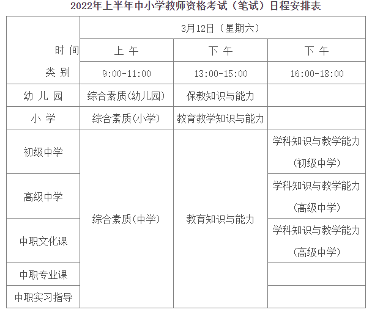

简介
===
  教师又称老师、先生，是以教育为生的职业。

### 教师资格证
  教师资格证是教育行业从业教师的许可证，由国务院教育行政部门统一印制。
  2015年，教师资格证考试改革，打破教师终身制且五年一审（师德表现、年度考核和培训情况），实行全国统一考试，取得的教师资格证全国通用，任何地方都承认。专科、本科在校即可报考，成考、自考、网络教育学历需要毕业才能报考，不再分师范生和非师范生，都必须参加国家统一考试方可申请教师资格证。
  取得教师资格的公民，可以在本级及其以下等级的各类学校和其他教育机构担任教师；但是，取得中等职业学校实习指导教师资格的公民只能在中等专业学校、技工学校、职业高级中学或者初级职业学校担任实习指导教师。高级中学教师资格与中等职业学校教师资格相互通用。

  教师资格证书使用全国统一的17位编号方法。
|位|说明|
|---|---|
|1~4|教师认定年度|
|5~6|发证机关所在的省级行政区（省/自治区/直辖市）[代码](https://baike.baidu.com/item/%E8%A1%8C%E6%94%BF%E5%8C%BA%E5%88%92%E4%BB%A3%E7%A0%81)||
|7~9|教师资格认定机构代码，代码数字由各省级教育行政部门统一规定。|
|10|教师资格类型代码|
|11|性别代码：1代表男性，2代表女性（2009年之前分别是0和1）|
|12~17|教师资格认定机构按本年度办理时间顺序统一递增编号|

|证书|学历要求|类型代码|说明|
|---|---|---|---|
|幼儿园教师资格证|幼儿师范学校或大学专科毕业及以上学历|1||
|小学教师资格证|中等师范学校或大学专科毕业及以上学历|2||
|初级中学教师资格证|高等师范专科学校或大学本科毕业及以上学历|3||
|高级中学教师资格证|高等师范本科院校或其他大学本科毕业及以上学历|4||
|中等职业学校教师资格证|同上|5|中等专业学校、技工学校、职业高级中学文化课、专业课教师资格证|
|中等职业雪娇实习指导教师资格证|大学专科毕业及以上学历，同时还应具备相当于助理工程师以上专业技术自核或中级以上工人技术等级。|6|中等专业学校、技工学校、职业高级中学实习指导教师资格证|
|高等学校教师资格证|本科教师：研究生  专科教师：大学本科毕业及以上学历|7||
|成人/大学教育的教师资格证|按照承认教育的层次、类别，分别具备高等、中等学校毕业及以上学历||

### 教师资格考试
  教师资格考试实行国家统考，内容是笔试+面试（相应科目），由教育部考试中心统一指定考试标准和考试大纲，组织笔试和面试试题，并建立试题库。

#### 申报
* 要求
  普通话水平应达到《普通话水平测试等级标准》二级乙等及以上标准。
  具有良好的身体素质和心里素质，无传染性疾病，无精神病史，按《申请认定教师资格人员体检标准及办法》，在教师资格认定机构指定的县级以上医院体检合格。

* 报名
  进入[中国教育考试网](pic/中国教育考试网.PNG)，点击菜单[考试报名](http://www.neea.edu.cn/html1/folder/1607/298-1.htm)，选择进入[中小学教师资格考试(NTCE)](http://ntce.neea.edu.cn/)页面，按照要求注册和报名（需要在指定时间段）。
  报名需要学历证、身份证、指定规格的照片等。

#### 考试内容
##### 笔试
|教师|考试科目|
|---|---|
|幼儿园教师|综合素质、保教知识与能力|
|小学教师|综合素质、教育教学知识与能力|
|初中教师|综合素质、教育知识与能力、学科知识与教学能力|
|高中教师|综合素质、教育知识与能力、学科知识与教学能力|
|中职文化课教师|综合素质、教育知识与能力、学科知识与教学能力|
|中职专业课教师|综合素质、教育知识与能力|
|中职实习指导教师|综合素质、教育知识与能力|

  以2022年上半年中小学教师资格考试（笔试）为例：

  笔试时间120分钟，题型如下：
|题型|说明|
|---|---|
|选择题|单项或多项选择，客观性试题，比较简单但分数较高，不宜失分过多。|
|填空题|识记性试题，答案需准确不能由错别字，所占分数不多，不宜花费太多时间。|
|判断说明题|判断对错并通过概念说明自己的观点。|
|简答题|按知识点计分，务必要回答全面，条理清晰。|
|论述题|抓住知识点，联系实际和工作经验，阐述观点。|

##### 面试
  面试时间20分钟，分为为结构化、试讲和答辩三部分。
  面试要求形象得体，语言清晰，针对拟教学科以及教育学、心理学、相关专业基础知识进行教育问答。
  试讲和答辩要求在10分钟内完成对一个教学片段的教学，结束后回答两个由考官提出的问题进行答辩，主要涉及试课内容、教育教学发展动态、政治思想理论等。

#### 注意事项
* 幼儿园、小学、初级中学、高级中学、中等职业学校的教师资格考试和中等职业学校实习指导教师资格考试，每年进行一次。
* 笔试成绩合格后，有效期两年，期间都可报名参加面试。当年考试不及格的科目可以在下一年补考，如果还有不及格的要全部重考。
* 高等学校教师资格考试根据需要举行，申请需要两名相关专业的教授或副教授推荐。

### 教师资格认定
  教师资格认定机构和依法接受委托的高等学校，每年春季、秋季各有一次受理资格认定时间。

* 认定机构
  幼儿园、小学和初级中学教师资格，由申请人户籍所在地或者申请人任教学校所在地的县级人民政府教育行政部门认定。高级中学教师资格，由申请人户籍所在地或者申请人任教学校所在地的县级人民政府教育行政部门审查后，报上一级教育行政部门认定。中等职业学校教师资格和中等职业学校实习指导教师资格，报上一级教育行政部门认定或者组织有关部门认定。
  受国务院教育行政部门或者省、自治区、直辖市人民政府教育行政部门委托的高等学校，负责认定在该校任职的人员和拟聘人员的高等学校教师资格。
  在未受国务院教育行政部门或者省、自治区、直辖市人民政府教育行政部门委托的高等学校任职的人员和拟聘人员的高等学校教师资格，按照学校行政隶属关系，由国务院教育行政部门认定或者由学校所在地的省、自治区、直辖市人民政府教育行政部门认定。
  教育行政部门或者受委托的高等学校在接到公民的教师资格认定申请后，应当对申请人的条件进行审查；对符合认定条件的，应当在受理期限终止之日起30日内颁发相应的教师资格证书；对不符合认定条件的，应当在受理期限终止之日起30日内将认定结论通知本人。

* 认定材料
|材料|
|---|
|教师资格认定申请表（由国务院行政部门统一格式，在网上填写并打印）一式两份|
|身份证原件和复印件、户籍原件和复印件、工作单位证明或所在乡镇、街道证明|
|学历证书或教师资格考试合格证明原件和复印件|
|教师资格认定机构指定的县级以上（含县级）医院出具的《申请教师资格人员体格检查表》|
|普通话水平测试等级证书原件和复印件|
|由申请人工作单位或者其户籍所在地乡（镇）政府或街道办事处提供的《申请人思想品德鉴定表》|
|非师范教育类专业毕业的申请人员，需提供《教师资格认定教育学心理学合格证》及教育教学能力测评成绩证明|
|申请认定中等职业学校实习指导教师资格的人员，还需提供专业技术资格证书或工人技术等级证书原件和复印件|
|小二寸免冠半身正面照片一张|

参考
===
* [安徽省中小学教师教育网](http://www.jsjy.ah.cn/cms/)
* [2020年度安徽省泗县中小学新任教师公开招聘公告](https://www.sixian.gov.cn/xwzx/tzgg/141703421.html)