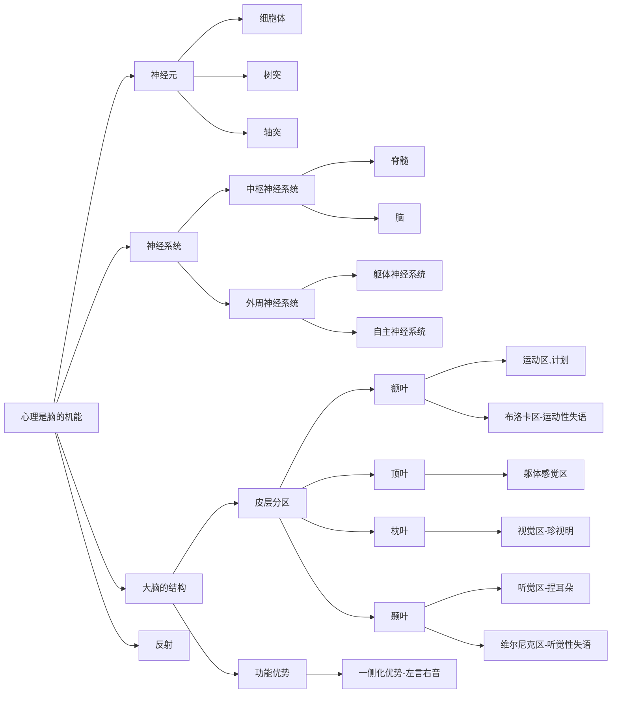
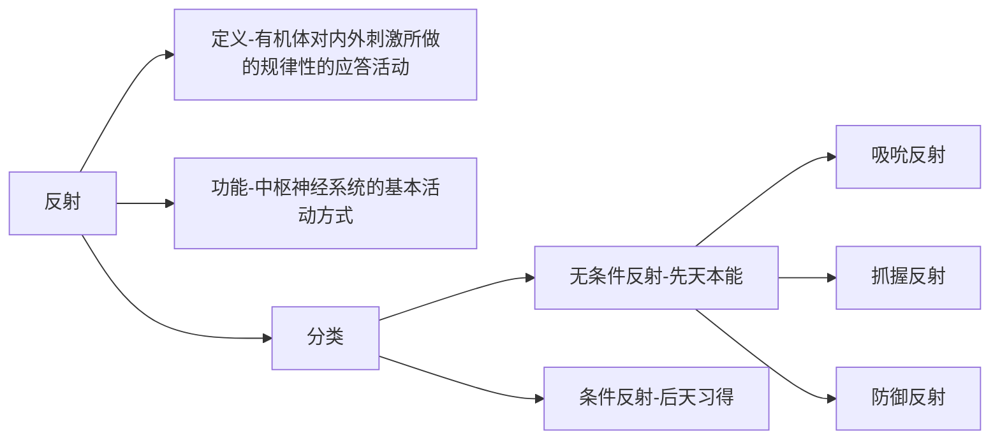

教育学
===
## 宏观教育原理
### 第一章 教育与教育学
#### 第一节 教育活动的基本要素
##### 一、教育的概念
（一）教育的由来：
* “教育”一词最早见于《孟子-尽心上》——“得天下英才而教育之，三乐也”
* 许慎《说文解字》对“教”和“育”做解释——教，上所施，下所效也；育，养子使作善也。

（二）教育的概念：
广义的教育：是指凡是有目的地增进人们知识和技能，影响人们思想观念的活动，包括社会教育、家庭教育和学校教育。
家庭教育的特点：
* 感染性
* 先导性
* 针对性：知子莫若父，知女莫若母；遇物而诲，相机而教。
* 权威性

侠义的教育：是指学校教育，是教育者根据一定的社会要求，有目的、有计划、有组织地通过学校教育的工作，对受教育者的身心施加影响，促使他们朝着期望方向变化的活动。

（三）教育的价值
教育的价值：是指教育满足人们主观需要关系的意义判断，它是教育作用的重要表现，它是指教育这一社会实践活动具有满足个体或社会需要的关系意义。
分类：
* 学说1——内外价值论：教育内在的价值和教育外在的价值【杜威、布鲁巴克】
* 学说2——知识价值论：教育的价值是传播知识、发现或发明只是，科学知识最有价值【斯宾塞、巴格莱、怀特海】
* 学说3——文化价值论：教育是一种文化活动，将文化中的各种客观的价值输入儿童经验中，以完成人格的培养。驾驭的人格陶冶价值是教育价值和核心【斯普朗格】

##### 二、教育活动的基本要素
  教育者、教育影响（内容+措施）、受教育者
* 教育者：教的主体，主导，最直接教育者（教师）
* 受教育者：学的主体，教的客体
* 教育影响（媒介、纽带、中介系统）：教育内容：教什么；教育措施：怎么教

##### 三、教育属性
  质的规定性、社会属性
（一）教育的本质属性
  教育是有目的地培养人的活动，是教育区别于其他食物现象的根本特征。
* 有目的 反面——无意识的（无意地一句话）、生理、本能
* 培养人 反面——人与动物之间；动物之间
  总结：判断属不属于教育，以下都不是
* 1. 无意识
* 2. 本能
* 3. 动物
* 4. 自学，完全独立自主的“自学”很难说得上是“教育”

（二）教育的社会属性
1. 教育的永恒性——与人类社会共始终
2. 教育的历史性——古今不同、变化
3. 教育具有相对独立性
* 教育具有质的规定性
* 教育具有历史继承性——古今相同
* 教育与社会生产力和政治经济制度发展的不平衡性

##### 四、教育的起源
1. 神话起源说
地位：最古老的观点
代表人物：朱熹、所有的宗教
观点：教育是由人格化的神所创造的，使人信奉神、顺从于天便是教育的目的
评价：非科学的

2. 生物起源说
地位：第一个正式提出
代表人物：利托尔诺、沛西-能
观点：教育起源于动物的本能行为
评价：完全否认了人与动物的区别，否认了教育的社会性
口诀：本能生（生物起源说）利（利托尔诺）息（沛西-能）

3. 心理起源说
代表人物：美国孟禄
观点：教育起源于儿童对成人无意识的模仿
评价：否认了教育的目的性，否认了教育是一种自觉有意识地活动
口诀：梦露爱模仿

4. 劳动起源说
代表人物：苏联米丁斯基、凯洛夫
理论和方法论基础：恩格斯《劳动在从猿到人的转变过程中的作用》
观点：认为教育起源于劳动
评价：符合马克思历史唯物主义与辩证法
口诀：米凯爱劳动

生物起源说和心理起源说都违背了社会性和目的性
生活/需要起源学说（杜威）、交往起源学说（叶澜）

##### 五、教育发展的历程
  原始教育、古代教育、近代教育、现代教育
（一）原始形态的教育
特点：
1. 教育无阶级性、等级性
2. 教育与生产劳动相结合
3. 教育内容简单、方法单一

（二）古代教育
中国奴隶社会
|朝代|学校名称|课程内容|教育特征|
|---|---|---|---|
|夏商|庠、序、校||古籍中有记载，但未证实|
|西周|国学、乡学|六艺（礼乐射御书数）|政教合一、学在官府，贵族特权|
|春秋、战国|私学兴起，私学繁荣，稷下学官|儒、墨——显学|官学衰微，私学兴起|

中国封建社会
|朝代|学校名称|课程内容|教育特征|
|---|---|---|---|
|汉代|官学、私学并行|罢黜百家、独尊儒术|察举制、征辟制|
|魏晋南北朝||上品无寒门，下品无士族、《颜氏家训》——家庭教育|九品中正制|
|隋唐|六学二馆——等级性，有钱人||科举制|
|宋朝|书院盛行|程朱理学（四书《大学》《中庸》《论语》《孟子》——孟中大论），五经（《诗》《书》《礼》《易》《春秋》）|科举制|
|明朝|私塾||科举制（八股文称为科考固定格式）|
|清朝末年|学堂|中体西用|科举制（1905年废除）|
口诀：
夏出学校，周有国乡，春兴战繁私学起
汉尊儒术，宋学四五，隋至清5科举废

外国奴隶社会
|国家|学校名称|课程内容|教育特征|
|---|---|---|---|
|古印度||《吠陀》为主的经典、经义|宗教教育（婆罗门教、佛教）|
|古埃及|文士、学校|文字、书写、执政能力|以僧为师、以史为师|

#### 第二节 教育的本质属性
#### 第三节 现代教育的主要特点
#### 第四节 教育形态
#### 第五节 不同时期的教育特点
#### 第六节 广义教育（家庭）

### 第二章 教育与社会的关系
### 第三章 教育与个体发展的关系

## 中观教育系统
### 第四章 教育目的
### 第五章 学校教育制度
### 第六章 学生与老师
### 第七章 课程基本理论

## 微观教育实践
### 第八章 教育基本理论
### 第九章 德育
### 第十章 班级管理与班主任工作
### 第十一章 现代教育技术
### 第十二章 教育研究
### 第十三章 课外活动

心理学
===
## 普通心理学
  客观题满分，主观题扣2分。

### 绪论（唯一非重点）
#### 心理的本质
##### 心理是脑的机能

###### 反射

* 无条件反射
  先天、本能：尝梅生津

* 条件反射的信号类型
（1）第一信号系统
  视觉听觉等具体信号引起，人和动物都有。
  例子：望而生畏、望梅生津、看到红灯停、望梅止渴

（2）第二信号系统
  抽象的语言、文字引起，人类独有。
  例子：谈虎色变、谈梅生津、听到“考试”就焦虑、”望梅止渴“的典故

##### 心理对客观现实具有依存性
##### 心理是人脑对客观现实的反应
##### 心理具有主观能动性

#### 心理学的研究对象
  心理学是研究心理现象/心理活动揭露其本质和规律的科学。

##### 心理过程
  伴随状态：注意
  在心理过程和个性心理中间还有一个过度的心理状态：某一时间的水平
###### 认知过程
  感觉、知觉、记忆、想象、思维

###### 情感过程
  情绪、情感

###### 意志过程

##### 个性心理
###### 个性心理倾向性
  需要、动机、兴趣、爱好、信念、理想、世界观

###### 个性心理特征
  气质、性格、能力（力气行）

#### 心理学的研究任务（不考）
#### 心理学的研究方法（不考）
#### 心理学的发展历史
  心理学有其漫长的过去，但只有短暂的历史。信立源起源于哲学。
  萌芽：亚里士多德的《论灵魂》，最早的心理学著作。
  诞生标志：1879年，德国冯特，第一个实验室。

### 第一模块：心理过程——认知
### 第二模块：心理过程——情感、意志
### 第三模块：个性心理

## 教育心理学

师德法规
===