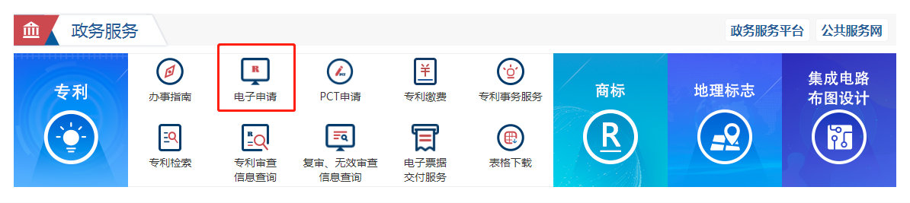
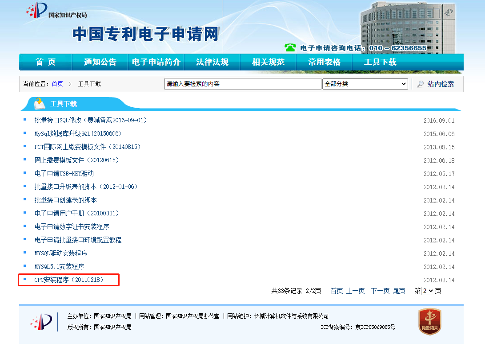
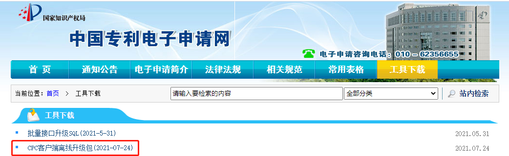
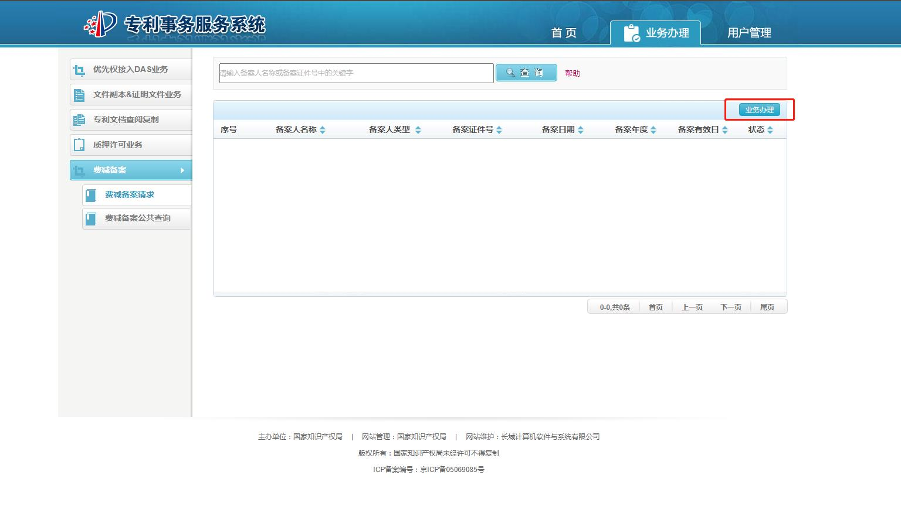

# 简介
  专利分为实用新型、发明和外观三种类型，其中发明专利申请难度最大。
  专利申请方式可以是个人申请或者找代理机构申请，个人申请需要自己撰写专利（也可找人代笔）、网上填报申请资料及缴费。

# 流程
## 准备
### 注册电子申请用户
  打开[国家知识产权局](https://www.cnipa.gov.cn/)网站，下拉到政务服务栏，点击专利下的电子申请，进入[中国专利电子申请网](http://cponline.cnipa.gov.cn/)，按照提示注册个人账号。

### 安装电子申请客户端
  点击【工具下载】，找到CPC安装程序(20110218)和最新的CPC客户端离线升级包(2021-07-24)，下载后解压，参考使用说明安装并升级。

## 申请
### 准备专利文档
  准备专利文档并转换成五书文件（包括说明书摘要、摘要附图、权利要求书、说明书、说明书附图五个模块）：
|名称|说明|
|---|---|
|说明书摘要||
|摘要附图||
|权利要求书||
|说明书||
|说明书附图||

  打开CPC软件，点击左上角申请专利选择需要的专利申请类型，选择五书文件，填写专利请求书并提交。
### 等待受理
  等待专利受理，一般一周左右会发送受理通知书到邮箱。

### 缴纳费用
  缴纳申请费用，个人申请可以申请费减（一千多减到75）。
  打开[国家知识产权局](https://www.cnipa.gov.cn/)网站，下拉到政务服务栏，点击专利下的专利事务服务，进入[专利事务服务系统](http://cpservice.cnipa.gov.cn/home/toHomePage.action?witchPage=1)，使用前面注册的账号登陆。
  点击业务办理-->费减备案-->业务办理，填写费减证明备案信息，通过费减备案公共查询看申请是否通过。

  在中国专利电子申请网登陆对外服务，点击网上缴费-->以国家申请号缴费，按要求填写并缴费。

### 等待授权
  缴费成功后就等待专利局对专利文件进行审查了，若有审查意见需要答复，若专利申请被驳回会收到驳回通知书，专利授权后就会收到专利局下发的证书。

# 附录
* [个人怎么开始进行专利申请？](https://www.zhihu.com/question/348941178/answer/870890808)
* [如何查询已有专利？](https://www.zhihu.com/question/20766812)