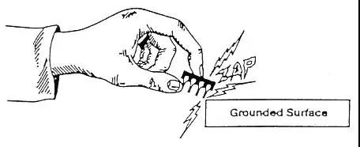
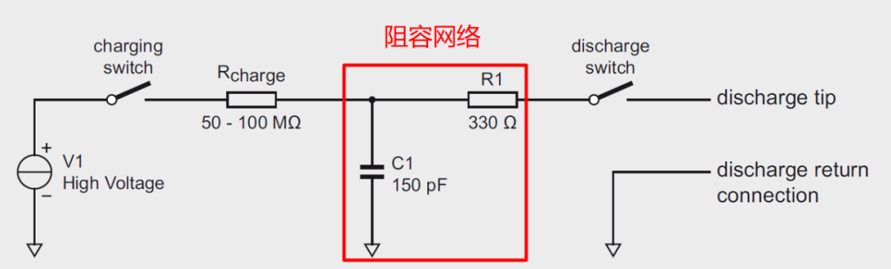

简介
===
内容
===
## EMI
  电磁干扰（Electromagnetic Interference，EMI）是指电子设备自身工作过程中产生的电磁波对外发射，从而对设备其他部分或外部其他设备造成干扰。

## EMS
  电磁敏感度（Electromagnetic Susceptibility，EMS）是指设备受电磁干扰的敏感程度，越敏感的设备越容易受到干扰。

### EMS标准
  EMS相关标准有中国国家标准（GB）、国际电工委员会标准（IEC）、欧洲标准（EN）和美国标准（JDEC），如下表所示，他们之间的关系是等同的。
|GB|IEC|EN|JDEC|
|---|---|---|---|
|GB17626.x|IEC61000-4-x|EN61000-4-x|JESD22-A114-x|

  以国标为例，相应的EMS标准如下：
|标准|说明|
|---|---|
|GB/T 17626.1-98|电磁兼容试验和测量技术 抗扰度试验总论|
|GB/T 17626.2-98|电磁兼容试验和测量技术 静电放电抗扰度试验|
|GB/T 17626.3-98|电磁兼容试验和测量技术 射频电磁场辐射抗扰度试验|
|GB/T 17626.4-98|电磁兼容试验和测量技术 电快速瞬变脉冲群抗扰度试验|
|GB/T 17626.5-99|电磁兼容试验和测量技术 浪涌（冲击）抗扰度试验|
|GB/T 17626.6-98|电磁兼容试验和测量技术 射频场感应的传导骚扰抗扰度|
|GB/T 17626.7-98|电磁兼容试验和测量技术 供电系统及所连设备谐波、谐间波的测量和测量仪器导则|
|GB/T 17626.8-98|电磁兼容试验和测量技术 工频磁场抗扰度试验|
|GB/T 17626.9-98|电磁兼容试验和测量技术 脉冲磁场抗扰度试验|
|GB/T 17626.10-98|电磁兼容试验和测量技术 阻尼振荡磁场抗扰度试验|
|GB/T 17626.11-99|电磁兼容试验和测量技术 电压暂降、短时中断和电压变化的抗扰度试验|
|GB/T 17626.12-99|电磁兼容试验和测量技术 振荡波抗扰度试验|

### ESD
  静电放电（Electrostatic discharge，ESD）可能导致各种产品故障，比如端口损坏、通信卡死、数据跳动甚至产品烧毁等。

#### ESD标准
  ESD是电磁兼容（EMC）中电磁敏感度（EMS）的一部分，相应的标准如下：
|GB|IEC|EN|JDEC|
|---|---|---|---|
|GB/T 17626.2|IEC61000-4-2|EN61000-4-2|JESD22-A114-2|

#### 放电模型
  根据静电的产生方式以及对电路的损伤模式不同通常分为四种测试方式：人体放电模型（Human-Body Model，HBM）、机器放电模型（Machine Model，MM）、元件充电模型（Charge-Device Model，CDM）和电场感应模型（Field-Induced Model，FIM），业界通常使用前两种模型来测试。

##### 人体放电模型HBM
  人与其他物体摩擦或其他因素在人体上积累了电荷，这时触碰芯片时会产生放电，导致芯片烧毁击穿。

  业界对HBM的ESD标准有以下两种：
|标准|说明|
|---|---|
|MIL-STD-883C method 3015.7|等效人体电容为100pF，等效人体电阻为1.5Kohm，有3个等级：<2KV为Class-1，2KV~4KV为Class-2，4KV~16KV为Class-3。|
|EIA/JESD22-A114-A|国际电子工业标准|

##### 机器放电模型MM
  机器本身积累了静电，当触碰芯片时由pin脚释放。由于机器是金属，电阻为0，所以电流很大（即使是200V的MM放电也比2KV的HBM放电的危害大），放电时间很短，几乎是ms或us之间。而且机器本身由于有很多导线互相会产生耦合作用，所以电流会随时间变化而干扰变化。
  MM的ESD标准如下：
|标准|说明|
|---|---|
|EIAJ-IC-121 method 20或者EIA/JESD22-A115-A|等效机器电阻为0，等效机器电容为100pF。|
  HBM和MM放电对比如下：

##### 元件充电模型CDM
  IC内部首先积累了静电，但未损伤，当IC

#### ESD发生器
  ESD发生器也就是常说的静电枪，工作原理框图如下：

  内部的电容C1由静电枪内部的高压电源V1，经过充电开关和充电电阻进行充电；充电完成后，断开充电开关，然后通过放电开关进行ESD放电；其中的RC阻容网络是可以外部人为设置的。

#### ESD芯片
  ESD芯片参数：
|参数|说明|
|---|---|
|V(RWM)|反向隔离电压（Reverse standoff voltage），此状态下二极管不导通，电路正常工作|
|V(BR)|击穿电压（Breakdown voltage），超过后二极管迅速反向击穿，进入导通状态，保护电路|
|V(CL)|钳位电压（Clamping voltage），二极管瞬间流过最大电流时的电压，超过后会损坏|
|V(ESD)|静电放电电压（Electrostatic discharge voltage）|
|I(RM)|反向漏电流（Reverse leakage current）|
|I(PP)|峰值脉冲电流（Peak pulse current）|
|P(PP)|峰值脉冲功率（Peak pulse power）|
|C(d)|二极管电容（Diode capacitance）|
|T(j)|结温（Junction temperature）|
|T(amb)|环境温度（Ambient temperature）|
|T(stg)|储存温度（Storage temperature）|

## EMC
  电磁兼容（Electromagnetic Compatibility，EMC）是指设备或系统在电磁环境中性能不降级的状态，一方面要求系统内没有严重的干扰源，一方面要求设备或系统自身有较好的抗电磁干扰性。
  因为有了EMI，才有了EMC，因为EMS达标，才能实现EMC。

参考
===
* [EMCEMIEMS分别是什么?有什么区别和联系?](https://wenku.baidu.com/view/e8d3d626a5c30c22590102020740be1e650ecca7?bfetype=new)
* [静电放电(ESD: Electrostatic Discharge)是什么？](https://www.elecfans.com/d/823707.html)
* [TVS 击穿电压和钳位电压的区别](https://blog.csdn.net/weixin_41349207/article/details/105857924)
* [ESD器件的主要性能参数](https://blog.csdn.net/LUOHUATINGYUSHENG/article/details/93138162)
* [电源滤波器的作用及正确选型](https://www.to8to.com/yezhu/v5982.html)