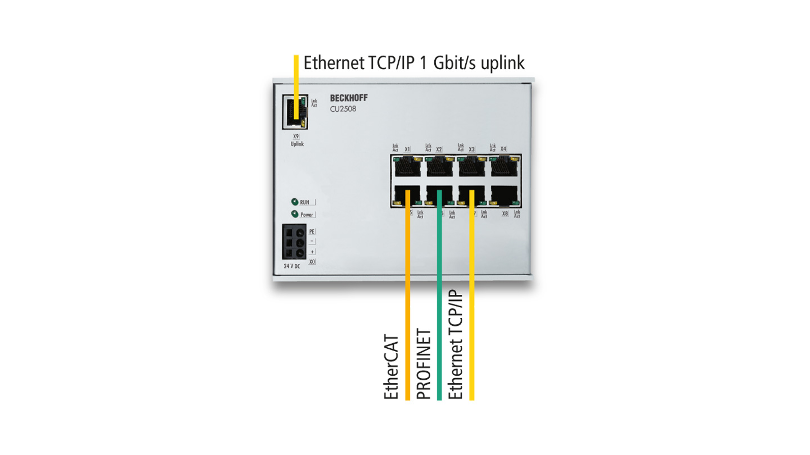

# 简介
## [一致性及互操作性](https://www.ethercat.org.cn/cn/conformance.html)
  保证一致性和兼容性对于一种通讯技术非常重要，技术协议实施的一致性是保证兼容性的首要条件，这样才能确保来自于不同厂商的产品可以在同一个系统网络中协同工作。

## [EtherCAT Plug Fest活动](https://www.ethercat.org.cn/cn/plug_fest.htm)
  Plug Fest是主站和从站设备的研发者会议，供应商聚集到一起进行互操作性测试，共享实时技巧和诀窍。

## [EtherCAT一致性测试工具（CTT）](https://www.ethercat.org.cn/cn/ctt.htm)
  采用一致性测试工具可以检查产品对协议实施的一致性，为满足一致性的最低要求，设备在首次上市前必须使用一致性测试工具通过协议测试。
  一致性测试工具[ET9400 | EtherCAT Conformance Test Tool (CTT)](https://www.beckhoff.com/en-en/products/i-o/ethercat-development-products/etxxxx-software/et9400.html)是德国倍福公司的产品，需要以订阅的方式获得授权才可使用。


  此外，还可以配合外部实时以太网端口扩展器[CU2508 | Real-time Ethernet Port Multiplier](https://www.beckhoff.com/en-en/products/i-o/infrastructure-components/cuxxxx-ethernet-port-multiplier/cu2508.html)进行实时测试，包括支持DC同步的设备测试。



## [EtherCAT测试中心（ETC）](https://www.ethercat.org.cn/cn/etc.htm)
```text
EtherCAT一致性测试中心(ETC)，北京
EtherCAT测试中心
北京航空航天大学
数控与自动化实验室(LNC)
海淀区学院路37号
中国，北京100191
Tel.:	+86 10 82316024
Email:	etc-china@buaa.edu.cn
```

  ETC提供官方的EtherCAT一致性测试和兼容性测试，并提供官方一致性认证，具有该认证的产品可以取得一致性测试标识的使用权（用于社备的市场推广），并可在ETG的[EtherCAT产品指南](https://www.ethercat.org.cn/cn/products.html)中标注出来。
  ETC可以为互操作性测试提供设备，并接受捐赠设备，以扩展每个设备的互操作性网络，同时ETC将提供其产品在互操作性网络中运行情况的反馈报告。

## [一致性技术工作组（TWG）](https://www.ethercat.org.cn/cn/conformance_twg.htm)
  ETG技术委员会设立了一致性工作组，定义测试程序，并专为提升测试用例而工作。工作组发布的测试用例同样用于ETG测试实验室进行官方一致性测试。

# 测试
## 一致性测试
* CTT安装和授权
  安装EtherCAT Conformance Test Tool并授权（需要以ETG会员的身份进行订阅，周期为1年）。


* 将待测从站设备的ESI文件（xml）拷贝到CTT安装目录DeviceDescriptions文件夹下；
* 新建工程，右键点击EtherCAT Devices添加从站设备；


* ECAT Link为True表示检测到设备（如果没有扫描到设备，可以点击Action --> Reload ESI Cache重新加载xml文件），点击OK后在EtherCAT Devices下可以看到该设备。


* 右键点击Tests下的EtherCAT添加默认的测试用例。


  CTT将测试用例分类，以XML格式开发和维护，命名方式为TF-XXXX_\*.xml，存放在CTT安装目录TestFiles文件夹下：


|文件|说明|
|---|---|
|TF-1100_V1i3i0_DLL_Test.xml|Data Link Layer：主要测试邮箱通信。|
|TF-1200_V1i3i0_ESM.xml|EtherCAT State Machine：测试从站状态机切换是否正常（INIT、PRE_OP、SAFE_OP和OP）。|
|TF-1201_V1i3i0_ExplDevIdent.xml|Explicit Device Identification：特殊ID特备的测试。|
|TF-1300_V1i4i0_ESI_Test.xml|EtherCAT Slave Information：主要测试ESI文件和从站EEPROM的内容是否一致，包括Vendor ID、PDO配置、FMMU配置和对象字典等。|
|TF-1301_V1i0i0_ESI_EtherCAT_P.xml||
|TF-2300_V1i3i0_AL_SDO_Service.xml|AL CoE SDO Service：测试对象字典在不同总线状态下的读写是否正确。|
|TF-2301_V1i3i0_AL_OD_Test.xml|AL CoE Object Dictionary：测试从站离线和在线对象字典是否一致。|
|TF-2302_V1i1i0_AL_SDO_Complete_Access.xml|AL CoE SDO Complete Access：测试从站Complete Access功能。|
|TF-4100_V1i3i0_CiA402_OD.xml|CiA402 Object Dictionary：测试CiA402相关对象字典。|

  另外，还有一些其他测试文件，如[TF-4860](https://www.ethercat.org.cn/memberarea/download/TF-4860_V1i0i0_Temperature_Controller(5003-2060)Profile_Tests.xml)、[TF-4900](https://www.ethercat.org.cn/memberarea/download/TF-4900_V1i0i0_Chiller(5003-3000)Profile_Tests.xml)、[TF-482x](https://www.ethercat.org.cn/memberarea/download/TF-482x_V1i0i0.zip)，可以到ETG网站[下载](https://www.ethercat.org.cn/memberarea/cn/ct_version.htm)。

* 点击工具栏中绿色三角按钮按钮开始测试，完成后生成测试报告，绿色项表示测试通过，红色项表示未通过，根据提示对从站进行检查和修改。如果想单独测试某一项，可以用鼠标点击需要测试的项，然后点击开始按钮。


  展开测试用例进一步查看各项测试结果：


## 互操作性测试
  将待测设备（Device under Test， DuT）置于一个来自不同供应商的各种不同设备的网络，检查与其他产品的兼容性。

## 附加测试
  检查从站设备的指示灯和标识是否符合ETG1300规范。

# 参考
* 一致性测试相关的文档[EtherCAT Conformance Test Documents](https://www.ethercat.org.cn/cn/downloads/downloads_607A069210B14903BC77B711A53A7D9F.htm)：

|名称|说明|
|---|---|
|[ETG.7000.2 Conformance Test Record](https://www.ethercat.org.cn/memberarea/download/ETG7000_2_ConfTestSpec.zip)|一致性测试记录是一组测试说明（包括TF-F000测试文件），用于执行EtherCAT一致性测试并同时记录它。ETC就是根据这些说明执行官方EtherCAT一致性测试。EtherCAT设备供应商应使用测试记录来准备正式测试。<br>ETG.7000-2 Conformance Test Record with Test Execution Guideline</br><br>ETG.7000-2 Annex 5003-0001: Semi Device Test Record Example with Test Execution Guideline</br><br>TF-F000: Set of Test Instructions</br>|
|[ETG.7000.3 Interoperability Test Directive](https://www.ethercat.org.cn/memberarea/download/ETG7000_3_V1i0i0_D_R_InteroperabilityTestDirective.pdf)|互操作性测试指令为完整的EtherCAT系统提供了测试说明，包括EtherCAT配置工具、EtherCAT主站、一个或多个EtherCAT从站，测试这些组件之间的交互。|
|[EtherCAT P Conformance Test Bundle: ETG.7000.1030, ETG.7000.1000.2P, TF-1301](https://www.ethercat.org.cn/memberarea/download/EtherCAT-P_Conformance_Test_Bundle.zip)|<br>ETG.7000.1000.2P EtherCAT P Test Plan：定义了基于ETG.1000.2P的测试计划</br><br>ETG.7000.1030 EtherCAT P Test Record：定义了特定设备功能的测试</br><br>TF-1301 EtherCAT P ESI Test File</br>|
|[ETG.7003 EtherCAT Conformance Test Enhancement Process](https://www.ethercat.org.cn/memberarea/download/ETG7003_V1i0i0_S_R_ConformanceTestEnhancementProcess.pdf)|定义了增强EtherCAT一致性测试的过程，包括由于错误修复而对现有测试用例的更改以及对新测试用例的增强，还涵盖了一致性测试工具 (CTT) 的更改。|
|[ETG.7010 EtherCAT Conformance Guide](https://www.ethercat.org.cn/download/documents/ETG.7010_V1i2i0_EtherCATConformanceGuide.pdf)|在EtherCAT一致性指南中可以轻松找到最重要的信息，包括如何获取工具以及如何测试你的设备的一致性。|
|[ETG.7011 FSoE Conformance Check List for common issues](https://www.ethercat.org.cn/memberarea/download/ETG7011_V1i0i2_G_R_FSoEConformanceTestChecklist.pdf)|根据通过 EtherCAT 测试中心的支持和大量 FSoE 一致性测试获得的经验，该指南指出了许多常见错误。|
|[ETG.7020 EtherCAT Slave Device Donation]()|本文档描述了设备捐赠的目的、好处和处理方式。|
|[ETG.7030 EtherCAT Conformance Test Request](https://www.ethercat.org.cn/memberarea/download/ETG7030_EtherCAT_ConformanceTestRequest.pdf)|申请在官方 EtherCAT 测试中心 (ETC) 对 EtherCAT 从设备进行一致性测试的表格。|
|[ETG.7031 FSoE Conformance Test Request](https://www.ethercat.org.cn/memberarea/download/ETG7031_FSoE_ConformanceTestRequest.pdf)|申请在官方 EtherCAT 测试中心 (ETC) 对 FSoE设备进行一致性测试的表格。|
|[ETG.7032 EtherCAT P Conformance Test Request](https://www.ethercat.org.cn/memberarea/download/ETG7032_EtherCATP_ConformanceTestRequest.pdf)|申请在官方 EtherCAT 测试中心 (ETC) 对 EtherCAT P 从设备进行一致性测试的表格。|
|[ETG.9003 EtherCAT Conformance Policy](https://www.ethercat.org.cn/memberarea/download/ETG9003_V1i1_S_R_Conformance_Test_Policy.pdf)|EtherCAT 一致性测试政策描述了符合 EtherCAT 供应商 ID 协议的一致性测试规则和政策。|

* [EtherCAT一致性测试简介](https://blog.csdn.net/ethercat_i7/article/details/80433657)
* [EtherCAT一致性测试软件CTT的使用方法](https://blog.csdn.net/sunlinsunshine/article/details/79794188?utm_medium=distribute.pc_aggpage_search_result.none-task-blog-2~aggregatepage~first_rank_ecpm_v1~rank_v31_ecpm-5-79794188.pc_agg_new_rank&utm_term=ethercat%E6%B5%8B%E8%AF%95&spm=1000.2123.3001.4430)
* [EtherCAT一致性测试](https://blog.csdn.net/sunlinsunshine/article/details/79501752?utm_medium=distribute.pc_aggpage_search_result.none-task-blog-2~aggregatepage~first_rank_ecpm_v1~rank_v31_ecpm-3-79501752.pc_agg_new_rank&utm_term=ethercat%E6%B5%8B%E8%AF%95&spm=1000.2123.3001.4430)
* [如何选择合适的EtherCAT的产品——互操作性至关重要](https://www.bilibili.com/read/cv13217305/)