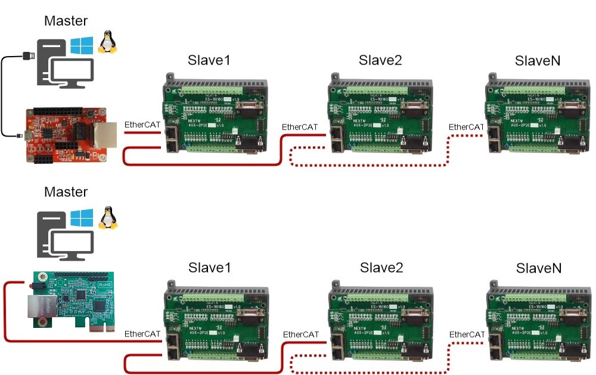

简介
===
内容
===
## ZLG致远电子
|产品|说明|
|---|---|
|[EtherCATNET-100M](https://www.zlg.cn/ethercatnet/ethercatnet/product/id/264.html)|EtherCATNET-100M是一款多功能EtherCAT主站控制器设备，EtherCAT总线传输速率可达100Mb/s，可实现闭环伺服系统的实时控制与实时数据传输，具有高性能、高传输速度、高可靠性通讯等优点。集成2路EtherCAT接口，具有线缆冗余的机能。  |
|[EtherCAT-Analyzer](https://www.zlg.cn/ethernet/ethernet/product/id/285.html)|EtherCAT-Analyzer是一款高性能实时以太网分析仪，其具有网络帧统计（流量、转发延时、错误帧、周期抖动）、网络帧时间分析、网络帧内容分析、GPIO事件分析以及帧数据存储等功能。  |
|[M110-128F8AWI-T & M110-5WB128F8AWI-T](https://www.zlg.cn/ipc/ipc/product/id/249.html) M110-EV-Board |   M110 EtherCAT核心板是ZLG致远电子精心设计的低功耗、高性能嵌入式硬件SoC核心板。该核心板采用TI 32位 Cortex®-A8处理器AMIC 110，主频最高可达300MHz，内部集成可编程实时单元工业通信子系统（PRU-ICSS），可支持EtherCAT实时以太网协议。它具备快速实时响应、专用数据处理等功能，符合组建工业以太网的专业功能需求，是理想的从站解决方案。    M110 EtherCAT核心板内部集成了可编程的实时单元工业通信子系统（PRU-ICSS），支持多种实时工业以太网协议。它默认支持EtherCAT协议，也支持Profinet、Powerlink、Sercos III、EtherNet/IP等其它通信协议，应用更灵活。此外，基于PRU-ICSS 的强劲性能，M110 EtherCAT核心板可灵活实现快速实时响应、专用数据处理及自定义外设接口，从而减轻SoC其他处理器内核的任务负载。      M110系列评估底板，它将M110系列核心板的串口、CAN、网口等功能接口全部引出，可作为M110平台的学习板。在工业领域，它也可以满足消费电子和工业控制等应用，方便开发者更快速的开始软件设计。   |

## 讯成科技
  [讯成科技(NEXTW)](http://www.nextw.com.tw/)提供简单设计的工业以太网EtherCAT主站准控制器系统单片机(SoC)解决方案，该单片机内置EtherCAT通讯协议栈，支持高精准度分布式时钟主站同步功能（DCM）与实时子系统架构等，可适用于各种工业自动化控制相关产品应用。
  讯成也提供各种EtherCAT从站解决方案，如EtherCAT马达/运动控制从站模块、数字信号I/O控制从站模块、应用通讯从站模块等。讯成提供客户EtherCAT完整解决方案服务，由硬件电路设计、韧体设计、到应用软件及函式库设计...等，可协助客户快速开发EtherCAT主从站装置/设备。

|产品|说明|
|---|---|
|EtherCAT Master Control IC/Starter Kit|EtherCAT Master Solution|
|EtherCAT Master Control Card (PCIe)|EtherCAT PC-based Solution|
|EtherCAT Slave Module|EtherCAT Slave Solution|
|EtherCAT Slave Terminals|EtherCAT Coupler with integrated digital inputs/outputs and high speed pulse& encoder.|
