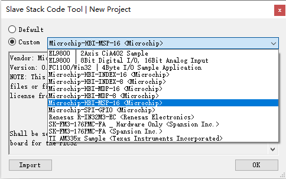
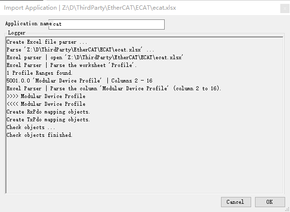
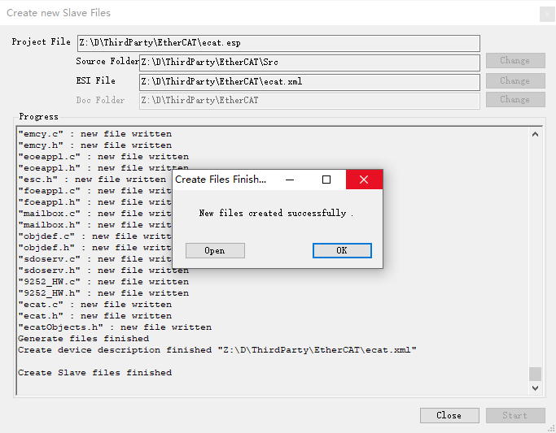
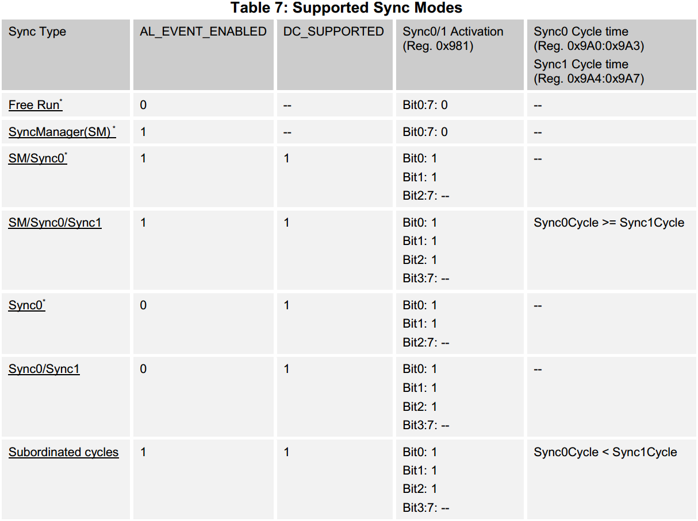
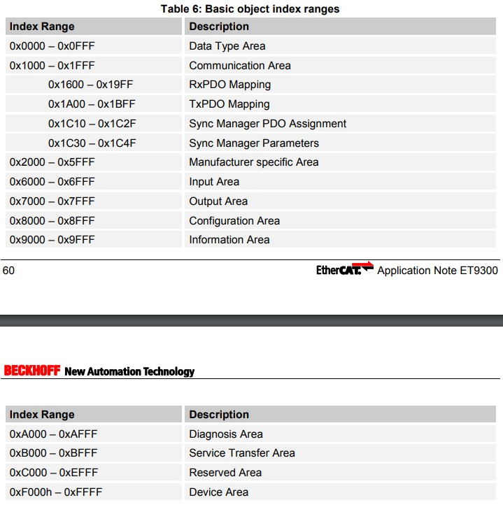
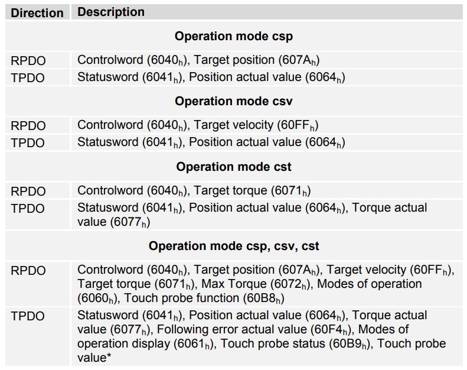
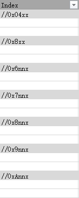
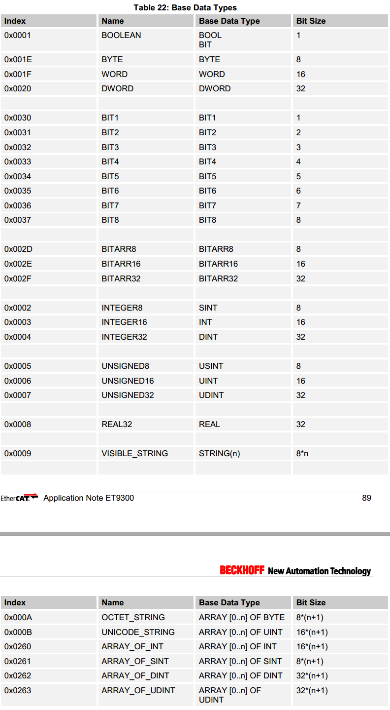
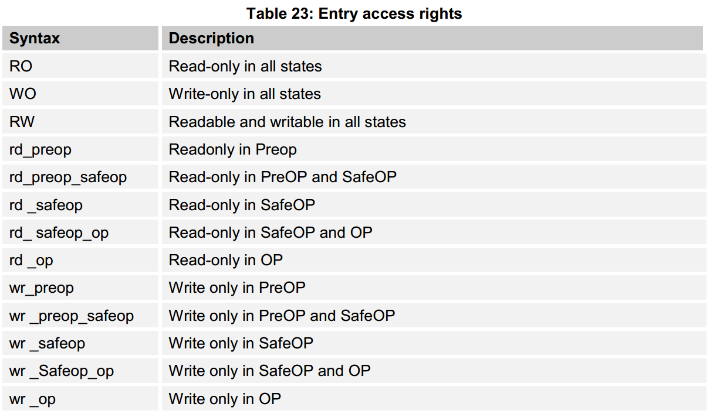
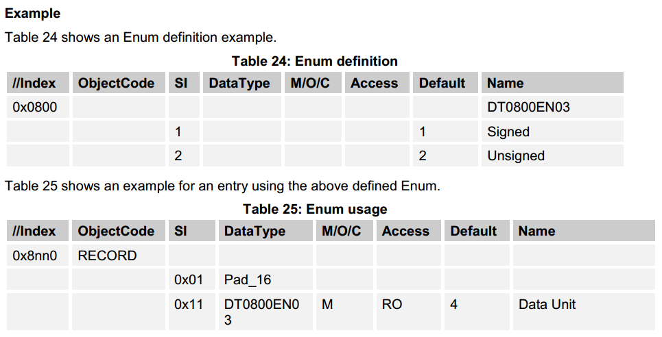

本文参考《Application Note ET9300(EtherCAT Slave Stack Code)》

## 创建工程
  第一次打开SSC或通过菜单"File->New"会弹出新建工程对话框，可以选择"Default"或"Custom"模板来新建工程，也可以点击左下角"Inport"按钮导入第三方工程模板。

  本文使用的是Microchip的LNA9252，下载对应的[LAN9252 EtherCAT SDK](https://www.microchip.com/SWLibraryWeb/product.aspx?product=LAN9252%20EtherCAT%20SDK)并解压，可以看到一个Microchip_LAN9252_SSC_Config.xml文件，"Import"后在"Custom"下拉列表中多了几个Microchip的模板。

  选择合适的模板点击"OK"，会提示缺少文件，按照提示将刚才解压的9252_HW.c文件添加进来，工程自动创建，点击菜单"File->Save"保存工程文件为"ecat.esp"。
  点击菜单"Tool->Application->Create new/Import"新建或导入协议描述文档（本文使用基于Excel的文档，需要按照规定的语法定义对象字典），SSC会自动解析（如果语法不对会报错）。

  点击菜单"Project->Create new Slave Files"，如下图所示：ecat.esp是工程文件，对象字典、硬件驱动和协议栈源代码在Src文件夹下，ecat.xml是ESI文件。

### 基本流程

### 参数配置
#### 同步
|参数名称|参数类型|作用|
|-------|------|----|
|AL_EVENT_ENABLED|||
|DC_SUPPORTED|||
|ECAT_TIMER_INT|||
|MIN_PD_CYCLE_TIME|||
|MAX_PD_CYCLE_TIME|||
|PD_OUTPUT_DELAY_TIME|||
|PD_OUTPUT_CALC_AND_COPY_TIME|||
|PD_INPUT_CALC_AND_COPY_TIME|||
|PD_INPUT_DELAY_TIME|||

## 协议规范（Profile）

### 对象（Object）
#### 入口描述（Entry Description）
#### 对象名称（Object Name）
#### 本地变量（Local Memory）
#### 对象描述（Object Description）

### 邮箱（Mailbox）
#### FOE
#### EOE

### 同步（Synchronization）
  如果AL_EVENT_ENABLE和DC_SUPPORTED都为0时，SSC只支持Free Run模式；
  否则根据SyncTypes（0x1C32.1和0x1C33.1）配置同步模式；
  如果SyncType没有在PS阶段被设置且不支持CoE，Sync0/1 Activation寄存器（0x981）来配置同步模式。

### 索引范围（Index Ranges）

  索引范围的分配取决于所使用的EthreCAT设备子协议（参考ETG5001），SSC使用的基本索引定义如下图所示：

  如果从站支持CiA402电机驱动协议，索引范围0x6000-0xDFFF重新分配（参考ETG6010），如下图所示：

## 协议语法（Syntax）
  我们一般使用一个EXCEL文件按照规定的语法定义通信协议，然后通过SSC Tool导入并生成协议代码。

### 注释（Comment）
  使用"//"可以添加注释，这一行内容会被忽略。

### 索引（Index）
  第一列为对象索引，格式为十六进制"0xZZZZ"。

### 对象标识（ObjectCode）
  第二列为对象标识，可选的类型有"VARIABLE"，"ARRAY"或"RECORD"，如果没有设置会根据后面的元素自动设置。
|标识|含义|
|-------|------|
|VARIABLE|该对象只有一个元素，相当于C语言中的变量|
|ARRAY|该对象有多个相同数据类型的元素，相当于C语言中的数组（实际用结构体定义）|
|RECORD|该对象有多个不同数据类型的元素，相当于C语言中的结构体|

### 子索引(SI)
  对象子索引Subindex可以是十进制或十六进制数字，范围1~255。

  可以使用"n~m"（例如1..10）的格式表示多个相似的元素，如果对象类型为RECORD，可以在命名这些元素时加上占位符"{\_SI\_:d}"，在生成代码时会替换成实际的子索引值；如果没有使用占位符，在导入Excel时会有黄字警告，生成代码时自动在原来的名称后面追加序号（从1开始递增）。

### 数据类型和命名（DataType,Name）
  数据类型可以使用EtherCAT协议命名、ESI命名或者SSC语法命名，SSC支持的基本数据类型如下图所示。

  元素命名可以使用任意字符串，空格会被忽略。
  如果要保证16位对齐，可以使用"PAD_X"的格式（X表示位数，范围是1~15）定义填充元素DataType，元素名称为空。

### 默认/最小/最大值（Default/Min/Max）
  定义元素的默认/最小/最大值，必须是以"0x"开头的十六进制格式，大端模式。

### M/O/C,B/S
|表项|含义|
|-|-|
|M/O/C|M(andatory)：强制的，O(ptional)：可选的，C(onditinal)：条件的；只在ESI文件中设置，对从站应用程序无影响。|
|B/S|B(ackup)：备用对象，S(etting)：设置对象。|

### 访问权限（Access）
  定义元素的CoE访问权限，允许的类型如下图所示。
  如果一个元素在不同状态有不同的权限，可以填写多个类型并使用","分开。

### rx/tx
  定义元素是否可以映射到RX PDO或TX PDO。

### 枚举（Enum）
  点击表格左侧的"+"号将默认隐藏的对象展开，0x800~0xFFF保留了空间用来定义枚举类型。需要按照"DTXXXXENYY"的格式（XXXX表示索引值，YY表示位数大小）。

## EEPROM
  通常情况下，ESC（EtherCAT slave controler）使用SII（Slave Infomation Interface）将过程数据、支持的邮箱通信协议等信息存储在EEPROM（一般为I2C接口）。有的ESC也支持模拟EEPROM（Emulation），将信息存储在应用程序内存中（片上flash）。
  SSC关于EEPROM的参数如下：
|参数名|作用|
|-|-|
|ESC_EEPROM_EMULATION|使能模拟EEPROM，使用指针"pEEPROM"访问EEPROM数据，如果没有使能CREATE_EEPROM_CONTENT，必须在启动时手动初始化|
|CREATE_EEPROM_CONTENT|包含头文件"eeprom.h"（使用EEPROM Programmer生成），并通过宏定义将指针"pEEPROM"指向aEepromData数组|
|ESC_EEPROM_SIZE|实际EEPROM大小或模拟EEPROM缓冲大小（单位是字节）|
|EEPROM_READ_SIZE|ESC单次读EEPROM的字节大小|
|EEPROM_WRITE_SIZE|ESC单次写EEPROM的字节大小，固定为2|

  点击"Tool->EEPROM Programmer"打开EEPROM Programmer程序，点击"File-> Save as"将信息以数组aEepromData的形式存到"eeprom.h"头文件中，然后添加到工程中编译；也可以另存为"\*.bin"文件，然后烧写到EEPROM。

### 烧写EEPROM
  点击"File->Open"打开ESI文件（\*.xml)，"Device Description"会显示文件信息。
  点击"Slaves->Scan"并双击相应的网卡来扫描EtherCAT从站设备，"Salves"会显示设备信息（Product code和Revison number）。
  点击"Slaves->Program Selected/All"烧写选中/全部EtherCAT设备的EEPROM，根据软件下方提示信息处理异常。

## Bootloader
  使能BOOTSTRAPMODE_SUPPORTED和FOE_SUPPORTED以支持通过EtherCAT升级固件，相关的函数如下：
|函数名|作用|
|-----|---|
|void BL_Start( UINT8 State)|在从站状态由INIT到BOOT转换过程中调用，可以用来控制设备重启进入bootloader。|
|void BL_StartDownload(UINT32 password)|从站收到文件上传请求时调用（文件名须以"ECATFW\_"开头，也可以在foeapp.c的aFirmwareDownloadHeader中修改），可以执行flash擦除操作。|
|UINT16 BL_Data(UINT16 \*pData,UINT16 Size)|每收到一帧数据时调用，可以执行flash编程操作。|
