# EtherCAT协议
## 数据帧结构
  EtherCAT数据帧只是对IEEE 802.3 Ethernet进行扩充，并未对基本结构进行任何变更，所以可以转送标准的Ethernet帧内的数据。

  EtherCAT数据帧本质上是以太网数据帧，由14字节帧头+46~1500字节数据+4字节帧校验序列（Fram Check Sequence，FCS）组成：帧头包含6字节目的地址+6字节源地址+2字节帧类型；数据包含2字节EtherCAT头和44~1498字节EtherCAT数据。EtherCAT数据包含至少1个EtherCAT子报文，每个子报文由10字节子报文头+最多1486字节数据+2字节工作计数器（Working Counter，WKC）组成
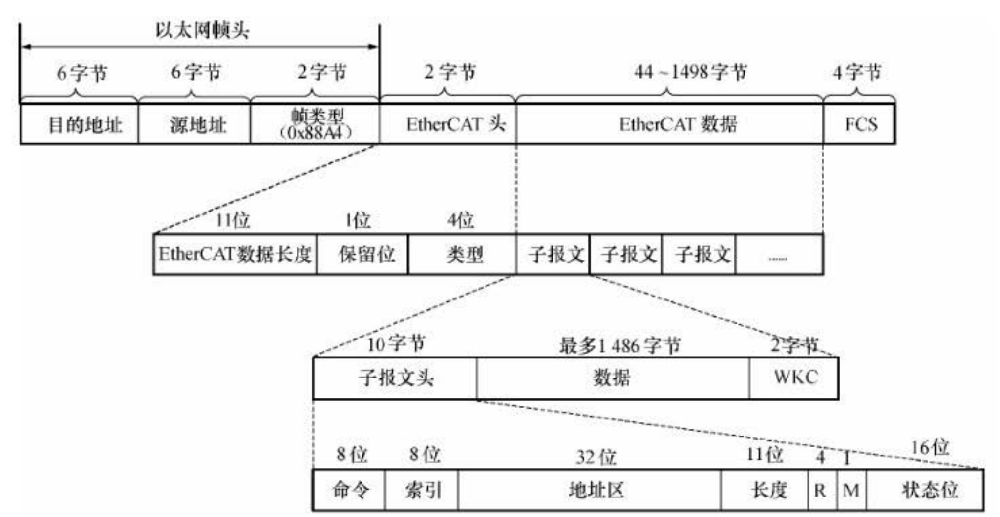

  * 以太网帧头：
|名称|大小|说明|
|---|---|---|
|目的地址|6字节|接收方MAC地址|
|源地址|6字节|发送方MAC地址|
|帧类型|2字节|0x88A4：表示EtherCAT数据帧|

  * EtherCAT头：
|名称|大小|说明|
|---|---|---|
|EtherCAT数据长度|11位|所有子报文总长度（字节）|
|保留位|1位|保留|
|类型|4位|1：表示与从站通信|

  * EtherCAT子报文：
|名称|大小|说明|
|---|---|---|
|命令|8位|指定寻址方式和读写模式，参考[命令和WKC](##命令和WKC)|
|索引|8位|帧编码|
|地址区|32位|从站地址，用于段内寻址|
|长度|11位|子报文数据长度|
|R|4位|保留位|
|M|1位|More EtherCAT Datagrams：后续报文标志|
|状态位|16位|IRQ：中断到来标志|
|数据|最多1486字节|子报文数据内容，用户自定义|
|WKC|2字节|工作计数器，参考[命令和WKC](##命令和WKC)|

## 报文寻址
  一个EtherCAT网段相当于一个以太网设备，主站首先使用以太网数据帧头的MAC地址寻址到网段，然后使用EtherCAT子报文头的32位地址寻址到段内设备。
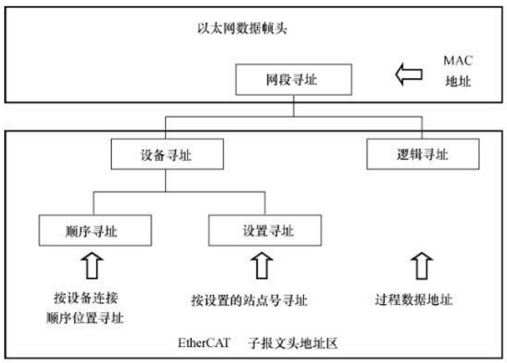

### 网段寻址
  根据EtherCAT主站及其网段的连接方式不同，可以使用两种方式寻址到网段：
  （1）直连模式
  当一个EtherCAT网段直接连接到主站设备的标准以太网端口时，主站使用广播MAC地址（0xFFFFFFFF）作为以太网帧头的目的地址。
  （2）开放模式
  当一个或多个EtherCAT网段和一个或多个主站设备通过一个标准以太网交换机相连时，每个网段的第一个从站设备的MAC地址作为该网段的段地址，该从站称为段地址从站，它能够交换以太网帧头的目的地址和源地址。

### 段内寻址
  段内寻址可以使用设备寻址和逻辑寻址两种方式：设备寻址针对某一个从站进行读写操作,每个报文只寻址唯一的一个从站设备；逻辑寻址面向过程数据，可以实现多播，同一个子报文可以读写多个从站设备。

#### 设备寻址
  设备寻址时EtherCAT子报文头的32位地址分为16位从站设备地址和16位从站设备内部物理存储空间地址，因此最多可以寻址65535个从站设备，每个从站设备内部物理存储空间最大为64K字节。
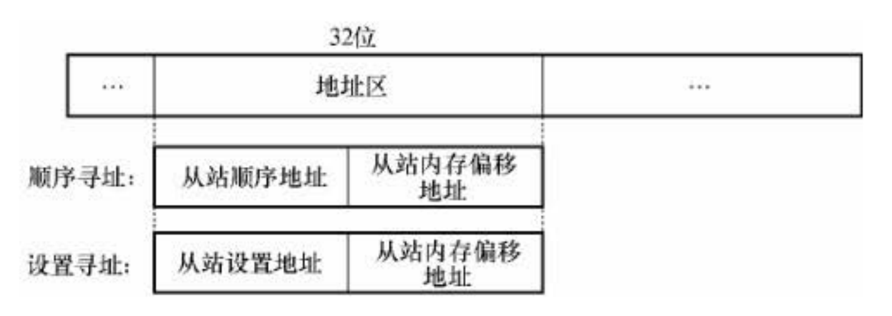
  设备寻址
  （1）顺序寻址
  顺序寻址是指按设备连接顺序位置寻址，从站的地址由其在网段内的连接位置确定，第一个从站设备地址为0，之后的从站设备地址依次减1（例如-1、-2、-3...)。顺序寻址子报文在经过每个从站设备时，子报文头的从站设备地址依次加1，所以又称顺序寻址为自动增量寻址；从站接收报文时，设备地址为0的报文就是寻址到自己的报文。
  顺序寻址主要用于启动阶段。
  （2）设置寻址
  设置寻址是指按设置的站点号寻址，可以由主站在数据链路启动阶段配置给从站，也可以由从站在上电初始化的时候从自身的配置数据存储器装载，然后由主站在数据链路启动阶段使用顺序寻址方式读取各个从站的设置地址。

#### 逻辑寻址
  逻辑寻址时，将子报文头的32位地址整体作为逻辑地址，可以寻址4GB大小空间。EtherCAT从站控制器（EtherCAT Slave Controller，ESC）内部有现场总线内存管理单元（Filedbus Memory Manage Unit，FMMU），将从站内部物理存储空间地址映射到网段内逻辑地址。
  FMMU由主站设置配置，并在数据链路启动过程中传送给从站设备。每个FMMU包含如下配置信息：

|FMMU配置寄存器|说明|
|---|---|
|数据逻辑起始地址（Ls）|32位网段内逻辑地址：0~0xFFFFFFFF|
|数据长度（Ll）|字节数，跨字节也计算|
|数据逻辑起始位（Lsb）|网段内所有从站数据都可以按位映射到主站逻辑地址，起始位可以为0~7|
|数据逻辑终止位（Leb）|同上|
|从站物理内存起始地址（Ps）|0~0xFFFF|
|从站物理内存起始位（Psb）|0~7|
|操作类型（Ty）| 1：只读  2：只写  3：读写 |
|使能（Act）|1|

  从站设备收到一个逻辑寻址的子报文时，检查是否有FMMU逻辑地址匹配，接着按照FMMU配置信息将输入类型数据插入到子报文数据区的对应位置，以及从子报文输出类型数据区取出对应数据，与从站内部物理存储空间进行数据交换。
  逻辑寻址方式适用于传输或交换周期性过程数据。

### 命令和WKC
  子报文的命令指定了主站的寻址方式和读写模式。
  WKC的值与子报文的命令及寻址到的从站个数有关：子报文经过某一个从站时，如果是单独的读或写操作，WKC加1；如果是读写操作，读成功时WKC加1，写成功时WKC加2，读写都成功时WKC加3。主站接收到返回数据帧后，检查子报文的WKC，如果不等于预期值，则表示该子报文没有被正确处理。

|编号|命令|寻址方式|读写模式|说明|WKC|
|---|---|---|---|---|---|
|0|NOP|-|-|No operation：空指令|0|
|1|APRD|顺序寻址|读|Auto increment physical read|1|
|2|APWR|顺序寻址|写|Auto increment physical write|1|
|3|APRW|顺序寻址|读写|Auto increment physical read write|3|
|4|FPRD|设置寻址|读|Configured address physical read|1|
|5|FPWR|设置寻址|写|Configured address physical write|1|
|6|FPRW|设置寻址|读写|Configured address physical read write|3|
|7|BRD|广播寻址|读|Broad read|1\*从站个数|
|8|BWR|广播寻址|写|Broad write|1\*从站个数|
|9|BRW|广播寻址|读写|Broad read write|3\*从站个数|
|10|LRD|逻辑寻址|读|Logical read|1\*从站个数|
|11|LWR|逻辑寻址|写|Logical write|1\*从站个数|
|12|LRW|逻辑寻址|读写|Logical read write|3\*从站个数|
|13|ARMW|逻辑寻址|读，重复写|Auto increment physical read/multiple write：顺序寻址到的从站读取数据，其他从站写入数据|1+3\*（从站个数-1）|
|14|FRMW|设置寻址|读，重复写|Configured address physical read/multiple write：设置寻址到的从站读取数据，其他从站写入数据|1+3\*（从站个数-1）|

## 同步模式
### DC（SYNC0 Event）同步
  分布时钟
### SM2 Event同步
### FreeRun

## 通信模式
### PDO
### SDO

## 状态机
  EtherCAT状态机（EtherCAT State Machine，ESM）负责协调主站和从站应用程序在初始化和运行时的状态关系，EtherCAT从站设备必须支持以下四种基本的状态。
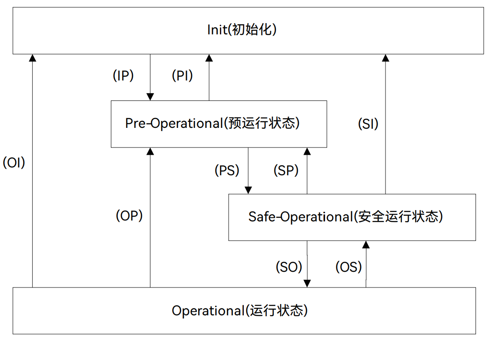

  从初始化状态向运行状态转化时，必须遵循“初始化->预运行->安全运行->运行”的顺序，不可以越级转化，而运行状态可以直接切回到其他各种状态。另外，还有一个可选的引导状态，只允许与初始化状态直接互相转化。所有状态说明如下：

|状态|说明|SDO|TxPDO|RxPDO|
|---|---|---|---|---|
|初始化Init(I)|主站和从站应用层不能直接通信，主站使用初始化状态来初始化ESC的一些配置寄存器。如果从站支持邮箱通信，则配置邮箱通道参数。|NO|NO|NO|
|预运行Pre-Operational(P)|主站和从站可以使用邮箱通信来交换与应用程序相关的初始化操作和参数。在预运行状态下支持邮箱数据通信（Service Data Object，SDO），不支持过程数据通信（Process Data Object，PDO）。|YES|NO|NO|
|安全运行Safe-Operational(S)|从站应用程序读入输入数据，但是不产生输出信号。即只支持输入过程数据通信（TxPDO），不支持输出过程数据通信（RxPDO）。|YES|YES|NO|
|运行Operational(O)|从站应用程序读入输入数据，主站应用程序发出输出数据，从站设备产生输出信号。即支持输入过程数据通信（TxPDO）和输出过程数据通信（RxPDO）|YES|YES|YES|
|引导状态Boot-Strap(B)|主站可以使用FoE协议的邮箱通信下载一个新的固件程序给从站。|YES|NO|NO|
注：输入数据和输出数据是对主站来说的，Tx和Rx是对从站来说的，因此输入过程数据通信（TxPDO）是从从站到主站，输出过程数据通信（RxPDO）是从主站到从站。

  所有的状态改变都由主站发起，主站向从站发送状态控制命令请求新的状态，从站响应此命令，执行所请求的状态转换，并将结果写入从站状态指示变量。如果请求的状态转换失败，从站将给出错误标志。各个状态转化说明如下：
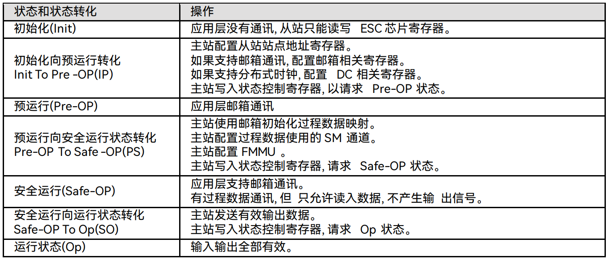

## 应用层协议
* CoE
* SoE
* EoE
* FoE

# EtherCAT从站控制器
## ESC地址空间
  ESC内部物理存储空间DPRAM前4K字节（0x0000~0x0FFFF）作为寄存器空间使用，后面的空间是过程数据作为RAM使用，示意图如下：
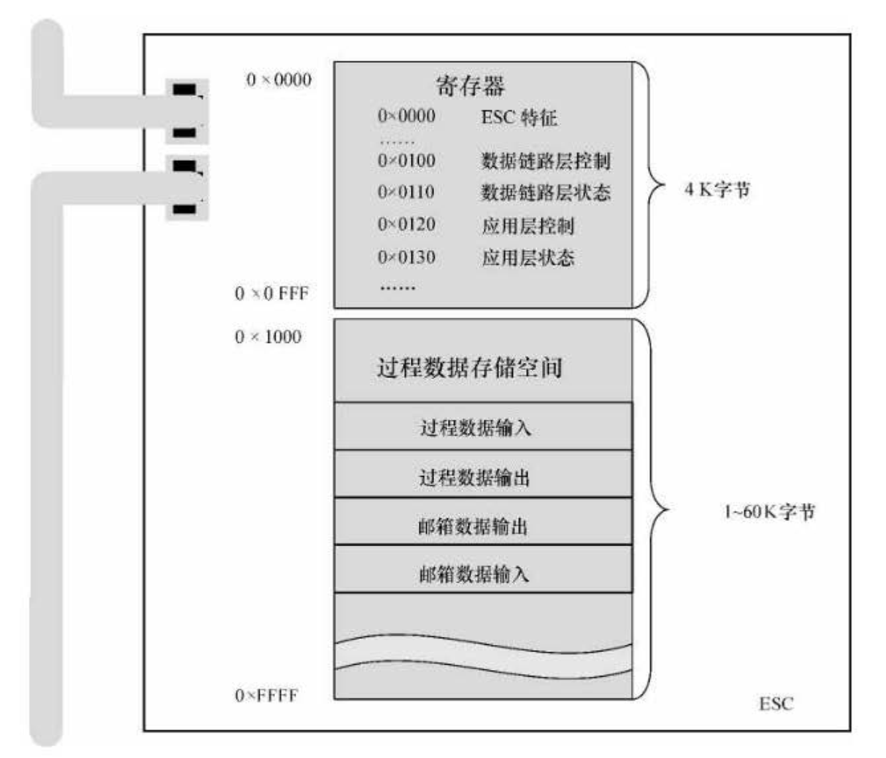

  ESC存储空间详细定义如下：
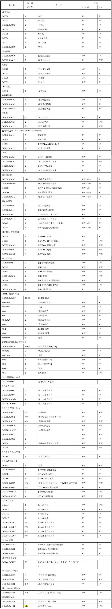

### ESC信息
  ESC芯片寄存器前10个字节表示其特征信息，定义如下：
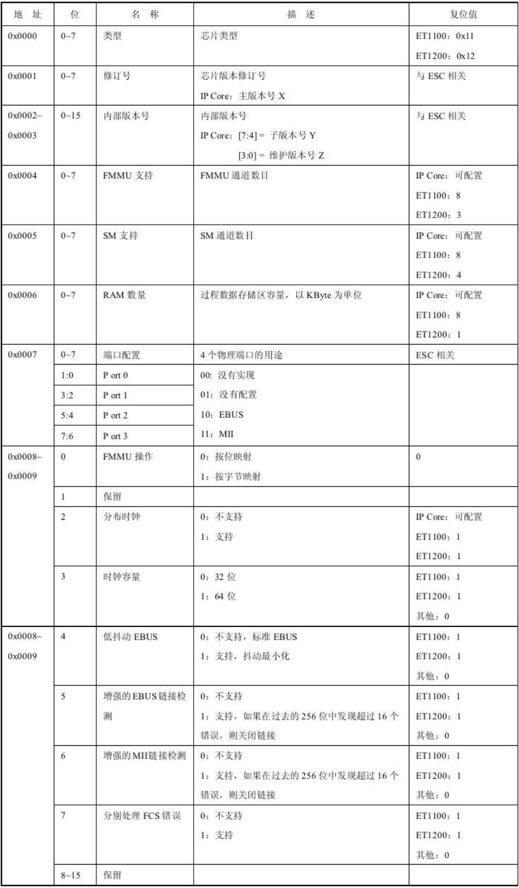

### SM
  ESC使用存储同步管理器（SyncManager，SM）来保证主站和从站应用数据交换的一致性和安全性，并在数据状态改变时产生中断通知双方。SM将存储空间组织为一定大小的缓存区，由硬件控制对缓存区的访问，缓存区的数量和数据交换方向可配置。SM由主站配置，寄存器从0x0800开始，每个通道使用8个字节，包括控制寄存器和状态寄存器。
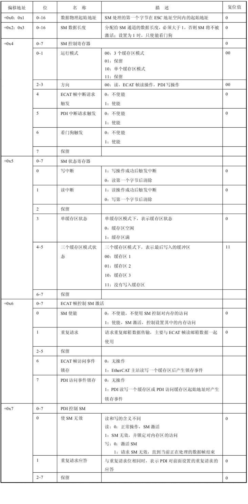

  必须从起始地址开始操作一个缓存区，否则操作被拒绝，之后可以操作整个缓存区，允许再次操作起始地址，并且可以分多次操作。操作缓存区的结束地址表示缓存区操作结束（不允许在一个数据帧内两次操作结束地址），随后缓存器状态改变，同时可以产生一个中断信号或看门狗触发脉冲。
  EtherCAT定义了两种SM运行模式：缓存模式和邮箱模式。

#### 缓存模式
  缓存模式使用3个缓存区，允许主站和从站微控制器同时访问，数据发送方可以随时更新缓存区的内容，接收方可以随时得到一致的最新数据，如果写缓存区的速度比读缓存区的速度快，旧的数据将被覆盖。
  物理上，3个缓存区由SM统一管理，SM只配置了第一个缓存区的地址范围，对第一个缓S存区的访问将被重新定向到3个缓存区中的一个，原理如下：
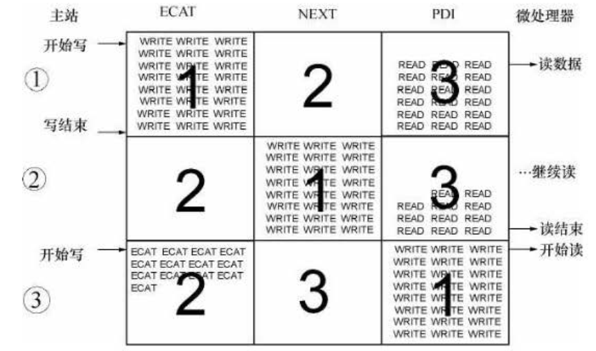
  在情况1中，缓存区1正由主站数据帧写入数据，缓存区2空闲，缓存区3由从站微控制器读走数据。主站写缓存区1完成后，缓存区1和缓存区2交换，成为2中的情况。从站微控制器读缓存区3完成后，缓存区3空闲，并与缓存区1交换，成为3中的情况。此时，主站和从站微控制器又可以分别开始写和读操作。如果SM控制寄存器（0x0804）中使能了ECAT帧和PDI中断，那么每次成功的读写操作都将在SM状态寄存器（0x0805）中设置中断事件请求，并映射到ECAT帧中断请求寄存器（0x0210~0x0211）和AL事件请求寄存器（0x0220~0x0221）中，再由相应的中断屏蔽寄存器决定是否映射河道数据帧状态位或触发中断信号。缓存模式通常用于周期性数据交换。
  缓存模式通常用于周期性数据交换，一般SM2用作RxPDO，SM3用作TxPDO。

#### 邮箱模式
  邮箱模式通常用于非周期性数据交换，使用两个存储同步管理器通道，一般SM0用作邮箱接收，SM1用作邮箱发送，它们被配置为一个缓存区方式，使用握手机制来避免数据溢出，一端完成数据操作后另一端才能访问缓存区。

## EEPROM
### EEPROM内容
  EEPROM存储了EtherCAT从站信息（EtherCAT Slave Information，ESI），由ESC上电或复位后自动读取并装入相应寄存器，并检查校验和。
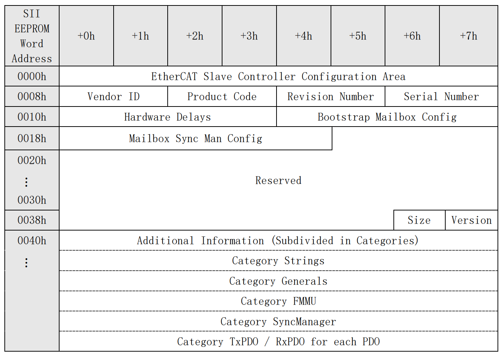

  ESI的前8个字(0x0000~0x0007）存储了从站信息接口（Slave Information Interface，SII）配置信息，对应ESC地址空间的PDI寄存器。
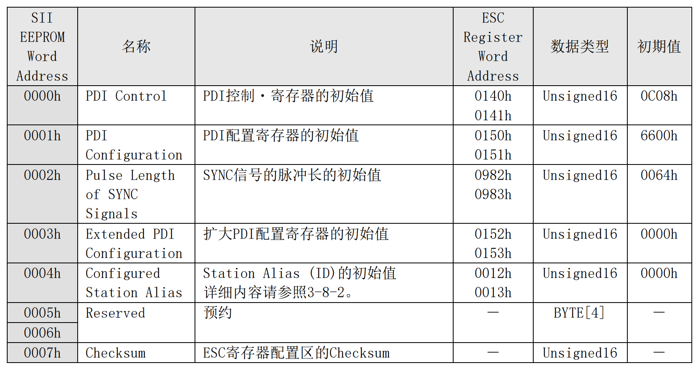

  ESI剩余的字（0x0008~）的信息如下图所示。
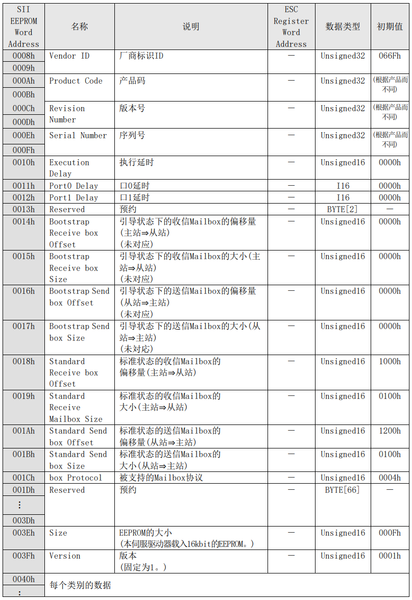

  分类附加信息包含了可选的从站信息：
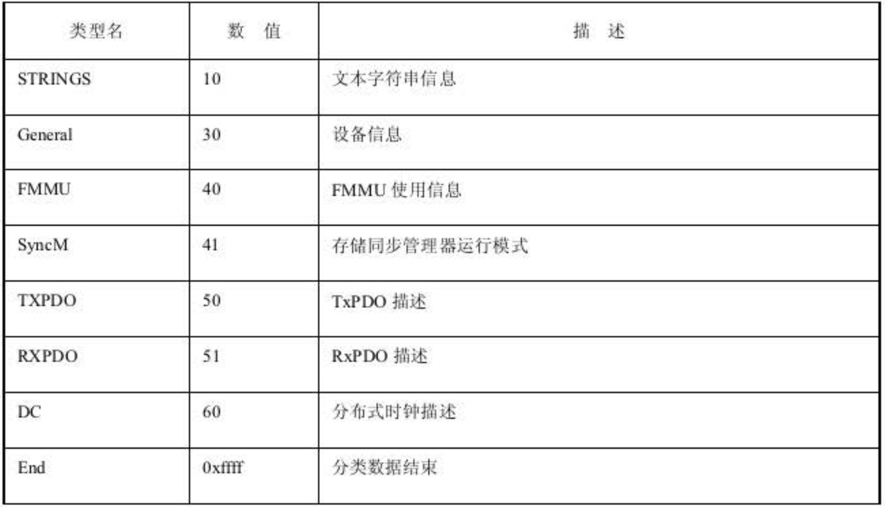

  包含两种类型的数据：标准类型和制造商定义类型，所有分类数据都使用相同的数据结构，包括一个字的数据类型、一个字的数据长度和数据内容。

### EEPROM访问控制
  ESC具有读写EEPROM的功能，主站或PDI通过读写EEPROM控制寄存器来读写EEPROM，在复位状态下由主站控制EEPROM的操作，之后可以移交给PDI控制。EEPROM控制寄存器如下：
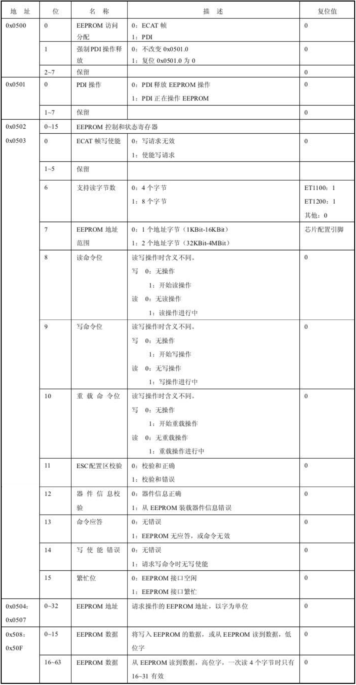

  寄存器0x0500和0x0501分配EEPROM的访问控制权，如果0x0500.1=0、0x0501.0=0，则由主站控制EEPROM访问接口，这也是ESC的默认状态；否则由PDI控制EEPROM。双方在访问完成后可以主动放弃EEPROM访问控制权限，而主站可以在PDI没有释放控制权时强制获取操作控制。
1. 主站操作EEPROM结束后，主动写0x0500.0=1，将EEPROM接口移交给PDI；
2. 如果PDI想要操作EEPROM，则写0x0501.0=1，接管EEPROM控制；
3. PDI完成EEPROM操作后，写0x0501.0=0，释放EEPROM操作；
4. 主站写0x0500.0=0，接管EEPROM控制权，如果PDI未主动释放EEPROM控制，主站可以写0x0500.1=1，

# 参考
* 工业以太网现场总线EtherCAT驱动程序设计及应用
* [MINAS A5B系列 技术资料 -EtherCAT 通信规格篇](https://device.panasonic.cn/ac/c_download/motor/fa-motor/ac-servo/manual/SX-DSV02820_R4_01C.pdf?f_cd=2763)
* [X5EB系列伺服驱动用户手册V1.1](https://files.hcfa.cn:8443/main.html?download&weblink=47cb74c498f7eff512ae7a670e5e5926&realfilename=X5EB$E7$B3$BB$E5$88$97$E4$BC$BA$E6$9C$8D$E9$A9$B1$E5$8A$A8$E7$94$A8$E6$88$B7$E6$89$8B$E5$86$8C$20$20V1.1$2020211101.pdf)
* [EtherCAT从站设计中的重要事项和关键观念（一）](https://mbb.eet-china.com/blog/1649855-350674.html)