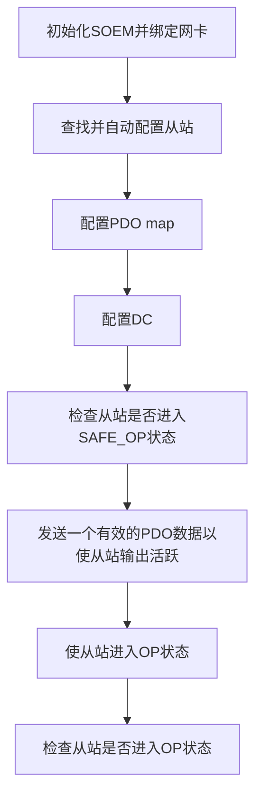

# 1 简介
  [SOEM](http://openethercatsociety.github.io/)（Simple Open EtherCAT Master）是一个免费开源的EtherCAT软件库。

# 2 源码
## 2.1 文件
  **[SOEM主要文件及功能](https://www.cnblogs.com/yujiamin/p/6944351.html)**

| **名称**             | **主要功能**                                                 |
| -------------------- | ------------------------------------------------------------ |
| ethercatbase.c       | 基本EtherCAT功能函数，主要包含的是一些EtherCAT通信服务命令函数以及EtherCAT数据帧组成的函数 |
| ethercatcoe.c        | CoE(CAN over EtherCAT)模块,包含的是应用层CoE协议相关的一些结构体和数据操作函数 |
| ethercatconfig.c     | EtherCAT主站配置模块，包含的是EtherCAT主站对从站的基本配置函数 |
| ethercatconfiglist.h | 此文件包含的是一个列表，里面包含了一些已知产品参数的EtherCAT从站 |
| ethercatdc.c         | EtherCAT分布时钟功能，包含了EtherCAT分布时钟(Distributed Clock)相关配置的函数 |
| ethercatmain.c       | EtherCAT主要功能模块，包含了EtherCAT初始化、状态设置和读取、邮箱数据通信、从站EEPROM操作、从站信息接口SII读和过程数据交换等函数。以及定义ec_slave[]，所有从站信息都在这个结构体中 |
| ethercatprint.c      | 将EtherCAT错误转换成可读信息模块，SDO中止信息和应用层状态代码用于传递从站信息给用户应用层，所以这个文件里函数的主要功能是将二进制码转换成可读的文本信息 |
| ethercattype.c       | 此文件主要是一些新的类型定义和宏定义，使用这些可以给具体的应用程序带来优化和便利 |
| nicdrv.c             | EtherCAT原始套接字驱动，主要包含了使用网卡NIC和socket通信来发送数据帧的函数 |
| osal.c               | 定时器配置模块，主要包含了一些定时器设置和延时等函数         |
| oshw.c               | 此文件中包含的函数主要用来识别现在这台机器上现有的网卡信息   |
| simple_test.c        | 此文件是根据自己所需的EtherCAT主站开发所编写的程序，通过各种配置，数据发送和读取 |

## 2.2 数据类型
枚举ec_state
|值|说明|
|---|---|
|EC_STATE_NONE = 0x00||
|EC_STATE_INIT = 0x01||
|EC_STATE_PRE_OP = 0x02||
|EC_STATE_BOOT = 0x03||
|EC_STATE_SAFE_OP = 0x04||
|EC_STATE_OPERATIONAL = 0x08||
|EC_STATE_ACK = 0x10||
|EC_STATE_ERROR = 0x10||

结构体ec_slavet
|成员|说明|
|---|---|
|uint16 state|从站状态|
|uint32 eep_man|厂家ID|
|uint32_t eep_id|设备ID|
|uint32_t eep_rev|修订版本|
|uint16 Obits|输出PDO位数|
|uint32 Obytes|输出PDO字节数，若Obits<8则Obytes=0。|
|uint8 \*outputs|输出PDO指针，指向IOmap中对应的数据。|
|uint8 Ostartbit|输出PDO数据第一个字节起始位。|
|uint16 Ibits|输入PDO位数|
|uint32 Ibytes|输入PDO字节数，若Obits<8则Obytes=0。|
|uint8 \*inputs|输入PDO指针，指向IOmap中对应的数据。|
|uint8 Istartbit|输入PDO数据第一个字节起始位。|
|uint8 group|从站分组，0表示所有组|
|int (\*ec_slavet::PO2SOconfig)(uint16 slave)|PO->SO回调函数，在ec_config_map之前调用，用户可自定义配置PDO。|
|boolean islost|用来跟踪从站是否响应，SOEM不使用/设置。|
注：eep_\*参数存储在EEPROM

结构体ec_group
|成员|说明|
|---|---|
|boolean docheckstate|检查从站状态，为真时表示至少一个从站没有响应。|

## 2.3 全局变量
|名称|说明|
|---|---|
|ec_slavet ec_slave[EC_MAXSLAVE]||
|int ec_slavecount||
|ec_groupt ec_group[EC_MAXGROUP]||
|boolean EcatError||
|int64 ec_DCtime||

## 2.4 API
|API|说明|
|---|---|
|int ec_init(const char \*ifname)|设置将用于EtherCAT的网卡，返回值>0成功。|
|int ec_config_init(uint8 usetable)|枚举和初始化所有从站，返回值为发现的从站数，保存在ec_slavecount。<br>主站向地址0发送广播请求，从站收到后进行响应，主站收到的working counter值等于从站数。同时初始化从站邮箱通信，并使所有从站进入PRE_OP状态。</br>|
|int ec_config_map(void \*pIOmap)|获取所有从站的PDO map到本地变量，返回值为IOmap大小。并请求从站进入SAFE_OP状态。|
|int ec_config_map_group(void \*pIOmap, uint8 group)|将一组从站的所有输入/输出PDO按顺序映射到IOmap，返回值为IOmap大小，group=0表示所有组。并请求从站进入SAFE_OP状态。|
|int ec_recover_slave(uint16 slave, int timeout)|恢复从站，返回值>0成功。|
|int ec_reconfig_slave(uint16 slave, int timeout)|重新配置从站，返回值为从站状态。|
|boolean ec_configdc(void)||
|uint16 ec_statecheck(uint16 slave, uint16 reqstate, int timeout)|检查从站状态，代码阻塞直至目标从站为期望的状态或超时退出，slave=0表示所有从站。|
|int ec_writestate(uint16 slave)|写从站状态，slave=0表示所有从站。先修改ec_slave[]的state后再调用。不检查实际状态是否改变，建议配合ec_statecheck使用。|
|int ec_readstate(void)|读所有从站状态，保存在ec_slave[]的state中，返回最低的状态。|
|int ec_send_processdata(void)|传输输入和输出过程数据，将输入数据保存在堆栈等待接收。|
|int ec_receive_processdata(int timeout)|从堆栈获取接受到的输入数据，返回值为working counter。|
|int ec_send_processdata_group(uint8 group)|传输一组输入和输出过程数据，将输入数据保存在堆栈等待接收。|
|int ec_receive_processdata_group(uint8 group, int timeout)|从堆栈获取一组接收到的输入数据（由于堆栈不区分组，必须和ec_send_processdata_group一起使用，即要接收一组PDO数据必须先进行发送），返回值为working counter|
|int ec_SDOwrite(uint16 Slave ,uint16 Index, uint8 SubIndex, boolean CA, int psize, void \*p, int Timeout)|CoE SDO写，返回值为workcounter。阻塞式，支持Complete Access|
|int ec_SDOread(uint16 Slave ,uint16 Index, uint8 SubIndex, boolean CA, int \*psize, void \*p, int Timeout)|CoE SDO读，返回值为workcounter。阻塞式，支持Complete Access|
|cahr \*ec_ALstatuscode2string(uint16 ALsratuscode)|查找AL状态码对应的字符串|
|char \*ec_elist2string(void)|将错误列表中错误转换为字符串|
|void ec_close(void)|关闭使用的socket|

## 2.5 用法
### 2.5.1 初始化
  初始化流程：


```flow
start=>start: 开始
init=>condition: ec_init(ifname) > 0 ?
config_init=>condition: ec_config_init(FALSE) > 0 ?
config_map=>operation: ec_config_map(&IOmap)
configdc=>operation: ec_configdc()
statecheck_safe_op=>operation: ec_statecheck(0, EC_STATE_SAFE_OP, EC_TIMEOUTSTATE* 4)
send_processdata=>operation: ec_send_processdata()
ec_receive_processdata(EC_TIMEOUTRET)
writestate_op=>operation: ec_slave[0].state = EC_STATE_OPERATIONAL
ec_writestate(0)
statecheck_op=>operation: ec_send_processdata()
ec_receive_processdata(EC_TIMEOUTRET)
ec_statecheck(0, EC_STATE_OPERATIONAL, 50000)
error=>operation: 错误处理
end=>end: 结束
start->init
init(yes)->config_init
init(no)->error
config_init(yes)->config_map->configdc->statecheck_safe_op->send_processdata->writestate_op->statecheck_op->error->end
config_init(no)->error
```

### 2.5.2 PDO
### 2.5.3 SDO


## 3 参考
* [SOEM-1.4.0 tutorial](https://openethercatsociety.github.io/doc/soem/tutorial_8txt.html)
* [在Windows环境下使用SOEM进行EtherCAT开发——准备篇](https://wxflamy.github.io/2019/09/25/EtherCAT-SOEM/)
