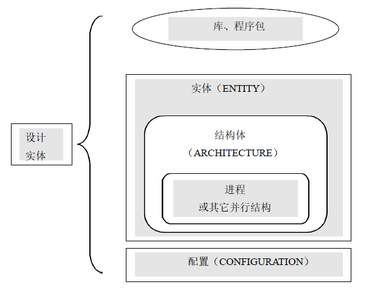
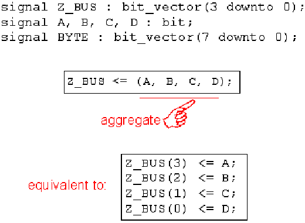
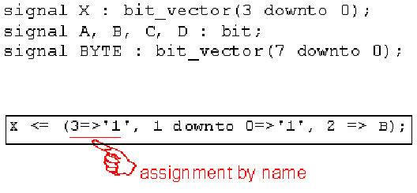
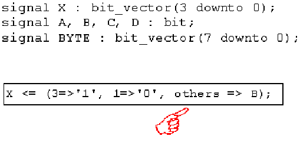

# 1 VHDL程序的组成
  一个完整的VHDL程序由以下五部分组成：库（library）、程序包（package）、实体（entity）、结构体（architecture）、配置（configuration）。


## 1.1 library库
  库用于存放预先编译好的程序包（package）和数据集合体，内含各种包定义、实体、结构体等。一个库对应一个文件夹，程序包的文件就放在此文件夹下。
  调用库有两种表达方式：一种是显式表达，可以使用use语句调用库的程序包或数据集合，适用于不符合VHDL标准的库调用，比如IEEE库；一种是隐式表达，不用写明就自动调用，适用于符合VHDL标准的库，比如STD库、WORK库（当前用户编辑文件所在文件夹下的其他文件里面所描述的包或数据的集合）。

```vhdl
library 库名;
use 库名.所要调用的程序包名.all;
```

## 1.2 package程序包
  程序包是为了使一个实体（文件）中的信号定义、常量定义、数据类型定义、元件语句和子程序定义（包括函数和过程）等内容可以被其他实体（文件）使用。
  程序包由包头和包体构成，格式如下：

```vhdl
package 程序包名 is
	程序包头说明语句;
end [package] 程序包名;
```
  程序包头说明语句可分为use语句、信号声明、常量定义、数据类型定义、元件声明、子程序声明等。
```vhdl
package body 程序包名 is
	程序包体说明语句;
end [package] 程序包名;
```
  程序包体说明语句用于子程序的定义，子程序声明放在包头，子程序定义放在包体。
  在程序包对实体说明前必须先加上use语句，即使实体和程序包在同一个文件里。
常用预定义程序包有以下四个：

### 1.2.1 STD_LOGIC_1164程序包
  STD_LOGIC_1164程序包定义了一些数据类型、子类型和函数。数据类型包括：STD_ULOGIC、STD_ULOGIC _VECTOR、STD_LOGIC和STD_LOGIC _VECTOR，用的最多最广的是STD_LOGIC和STD_LOGIC_VECTOR数据类型。
  该程序包预先在IEEE库中编译，是IEEE库中最常用的标准程序包，其数据类型能够满足工业标准，非常适合CPLD（或FPGA）器件的多值逻辑设计结构。

### 1.2.2 STD_LOGIC_ARITH程序包
  该程序包是美国Synopsys公司的程序包，预先编译在IEEE库中。主要是在STD_LOGIC_1164程序包的基础上扩展了UNSIGNED（无符号）、SIGNED（符号）和SMALL_INT（短整型）三个数据类型，并定义了相关的算术运算符和转换函数。
### 1.2.3 STD_LOGIC_SIGNED程序包
  该程序包预先编译在IEEE库中，也是Synopsys公司的程序包。主要定义有符号数的运算，重载后可用于INTEGER（整数）、STD_LOGIC（标准逻辑位）和STD_LOGIC _VECTOR（标准逻辑位向量）之间的混合运算，并且定义了STD_LOGIC _VECTOR到INTEGER的转换函数。
### 1.2.4 STD_LOGIC_UNSIGNED程序包
  该程序包用来定义无符号数的运算，其他功能与STD_LOGIC_SIGNED相似。

## 1.3 entity实体
  实体是VHDL设计最基本的组成部分之一（另一个是结构体），它不描述设计的具体功能，只定义所需的全部输入/输出端口信号。
```vhdl
entity 实体名 is
[generic (类属常数名 : 类属数据类型 [:= 类属设定值],...);]
	port(
	端口名1 : 方向 类型;
	端口名2,端口名3 : 方向 类型;
	......
	);
实体声明;
实体语句;
end [entity] 实体名;
```
* 实体名：必须与VHDL文件名相同，否则编译会出错。
* 类属表：generic(......)
  用于为设计实体和其外部环境通信的静态信息提供通道，可以定义端口大小、实体中元件数目及实体的定时特性等；带有generic的实体所例化的元件叫做参数化元件。
* 端口表：port(......)
端口名：输入输出信号名称，必须是合法的标识符且唯一。
端口方向：in、out、inout、buffer和linkage。
端口类型：integer [range 下限 to 上限]、std_logic、std_logic_vector(上限 downto 下限)。
* 实体声明：type语句或常量定义。
* 实体语句：实体语句只能是并行断言语句、并行过程调用语句和被动进程语句，这些实体语句部分应该是被动语句，不能含有信号赋值语句。

## 1.4 architecture结构体
  结构体描述实体的的结构或行为，一个实体可以有多个结构体，每个结构体分别代表该实体功能的不同实现方案。
```vhdl
architecture 结构体名 of 实体名 is
[内部信号、常数、元件、数据类型、函数等的定义];
begin
[并行处理语句和block、process、function、procedure];
end architecture 结构体名;
```
  结构体名一般根据对实体的描述来命名，结构体对实体的描述有三种方式：
* 行为描述（behave）：反映一个设计的功能和算法，一般使用进程progress，用顺序语句表达；
* 结构描述（struct）：反映一个设计硬件方面的特征，表达了内部元件间连接关系，使用元件例化来描述；
* 数据流描述（dataflow）：反应一个设计中数据从输入到输出的流向，使用并行语句来描述。
  因此，结构名一般命名为behave、struct或dataflow，当然设计人员也可以自行命名。

## 1.5 configuration配置
  一个实体可以用多个结构体来描述，具体综合时选择哪一个由配置来确定，仿真时用配置语句进行配置能节省大量时间。
```vhdl
configuration 配置名 of 实体名 is
for 选配结构体名;
end for;
end configuration;
```

# 2 数据对象、数据类型、运算符、属性
## 2.1 数据对象
  VHDL常用的数据对象有信号（signal）、变量（variable）和常量（constant）。

### 2.1.1 signal信号
  信号是全局的，在程序包说明、实体说明、结构体描述中使用，用于声明内部信号，其在元件之间起互联作用，可以赋值给外部端口信号（in、out、inout、buffer）。
  信号的赋值符号为"<="，赋值后不立即更新，当进程挂起后才更新。由于综合器往往忽略信号声明时所赋的初值，常在结构体中用赋值语句对信号赋初值。

```vhdl
定义：
signal 信号名 : 数据类型 [:= 初始值];

赋值：
目标信号名 <= 表达式;
```

### 2.1.2 variable变量
  变量只在给定的进程中用于声明局部值或用于子程序，常用在实现某种算法的赋值语句中。信号是实际的，是内部的一个存储单元（signal）或外部输入输出端口（in、out、inout、buffer），而变量是虚的，是为了书写方便而引入的一个名称。变量的赋值符号为":="，赋值后立即更新。
```vhdl
variable 变量名 : 数据类型 [:= 初始值]
```

### 2.1.3 constant常量
  常量是全局的，在程序包说明、实体说明、结构体描述、过程说明、函数调用说明和进程说明中使用，在定义的时候必须初始化。
```vhdl
constant 常量名 : 数据类型 := 表达式;
```
__注意：变量只能定义在进程和子程序（包括函数和过程）内部，不可以定义在其外部，信号则相反。__

## 2.2 数据类型
  VHDL属于强类型语言，信号、变量、常量、函数及设定的各种参量在定义时必须指定数据类型，不同类型之间不能进行运算和赋值，可以进行数据类型转换。
  VHDL常用的数据类型有三种：标准定义的数据类型（已在VHDL标准程序表STD中定义，不需要使用use语句显式调用）、IEEE预定义标准逻辑位和矢量、用户自定义的数据类型。

### 2.2.1 标准定义的数据类型
* bit（位）：取值0或1；
* bit_vector（位矢量）：bit类型数组，例signal A : bit_vector(7 downto 0)、signal B : bit_vector(0 to 3)。__赋值时的方向要和声明时的方向一样__；
* boolean（布尔量）：取值false或true；
* character（字符）：使用单引号括起来，例'A'；
* string（字符串）：使用双引号括起来，例"ABC"；
* integer（整数）：32位有符号；
* positive（正整数）：32位无符号，大于零的整数；
* natureal（自然数）：32位无符号，不小于零的整数；
* real（实数）：只能在VHDL仿真器中使用，综合器不支持；
* time（时间）：由"数字+空格+单位"组成，例1 ps、10 us、100 ms、3 s；
* sevrity level（错误等级）：在VHDL仿真器中用来设计系统的工作状态，常和"assert"语句配合使用，有四种可能的值：note、warning、error和failure。

### 2.2.2 IEEE预定义标准逻辑位和矢量
* std_logic、std_ulogic
  IEEE预定义标准逻辑位类型，前者定义的信号可以由多个信号驱动（赋值），后者定义的信号只能由一个信号驱动（赋值）。
  取值为0（逻辑0）、1（逻辑1）、Z（高阻）、X（强未知）、W（弱未知）、L（弱0）、H（弱1）、-（忽略）、U（未初始化）。只有前四种具有实际物理意义，其他的是为了与模拟环境相容才保留的。
* std_logic_vector、std_ulogic_vector
  IEEE预定义标准逻辑位矢量类型，与上面类似。

  以上4种数据类型均定义在IEEE库的std_logic_1164程序包中，使用前需用use语句显式调用。
```vhdl
library IEEE;
use IEEE.std_logic.1164.all;
```

### 2.2.3 用户自定义的数据类型
  有枚举类型、整数类型和实数类型、数组类型、记录类型4种。
* 枚举（enumerate）类型
```vhdl
type 枚举类型名 is (元素,元素,......);

例：
type week is (sun,mon,tue,thr,fri,sat);
```

* 整数（integer）类型和实数（real）类型
```vhdl
type 数据类型名 is 数据类型定义 range 约束范围;

例：
type week is integer range 1 to 7;
type current is real range -1e4 to 1e4;
```

* 数组（array）类型
```vhdl
type 数组类型名 is array (下限 to 上限) of 元数据类型名;

例：
type week is array (1 to 7) of integer;
```

* 记录（record）类型
```vhdl
type 记录类型名 is record
元素名 : 数据类型名;
元素名 : 数据类型名;
元素名 : 数据类型名;
......
end record;

例：
type person is record
name : string;
age : integer;
......
end record
```
### 2.2.4 类型转换
* conv_std_logic_vector：将某种类型数据转换为指定位数的std_logic_vector，方法是先将数据转换为二进制补码，再取指定位数的低位数据。
```
conv_std_logic_vector（integer/singer/unsigned，位数）
```

## 2.3 运算符
### 2.3.1 算数运算符

  算数运算符应用于integer、real、time类型，不能用于vector（除非使用IEEE库的std_logic_unsigned包，因为它对算数运算符进行了扩展）。vector和array不能表示bumber。

| 符号 | 作用     |
| ---- | -------- |
| +    | 加       |
| -    | 减       |
| *    | 乘       |
| /    | 除       |
| **   | 指数运算 |
| mod  | 取模     |
| rem  | 取余     |
| abs  | 取绝对值 |

### 2.3.2 关系运算符
| 符号 | 作用       |
| ---- | ---------- |
| =    | 等于       |
| /=   | 不等于     |
| <    | 小于       |
| <=   | 小于或等于 |
| >    | 大于       |
| >=   | 大于或等于 |

### 2.3.3 逻辑运算符
| 符号 | 作用                           |
| ---- | ------------------------------ |
| and  | 与                             |
| or   | 或                             |
| not  | 非（优先级比其他逻辑运算符高） |
| nand | 与非                           |
| nor  | 或非                           |
| xor  | 异或                           |

### 2.3.4 连接运算符

| 符号 | 作用                                 |
| ---- | ------------------------------------ |
| &    | 将多个对象或矢量连接成维数更大的矢量 |

### 2.3.5 集合操作
* ()

* 序号

* others


## 2.4 属性
  属性是关于实体、结构体、类型及信号的一些特征，有些属性对于综合非常有用，其一般用法格式：
```vhdl
对象名'属性
```
### 2.4.1 数值类属性
  用于返回数据、块或一般数据的有关值。
一般数据的数值属性：left、right、low、high
数组的数值属性：length
块的数值属性：behavior，不含有component例化信息时返回true；structure含有原件实例化或有被动进程时返回true（被动进程定义实在进程定义中没有代入语句）。

### 2.4.2 函数类属性
  以函数的形式，使设计人员得到有关数据类型、数组、信号的某些信息。
数据类型属性函数：pos(x)得到输入x值得为之序号、val(x)得到输入位置序号的x值、suss(x)、pred(x)、leftof(x)、right(x)
数组属性函数：left(n)、right(n)、high(n)、low(n)
信号的常用属性有：

| 属性              | 含义                                            |
| ----------------- | ----------------------------------------------- |
| event             | 返回boolean值，信号发生变化时返回true。         |
| last_value        | 返回信号发生变化前的值                          |
| last_event        | 返回上一次信号发生变化到现在变化的间隔时间      |
| delayed[(延时值)] | 使信号产生固定时间的延时并返回                  |
| stable[(延时值)]  | 返回boolean值，信号在规定时间内没有变化返回true |
| transaction       | 返回bit值，信号每发生一次变化，返回值翻转一次。 |

例：
```vhdl
A <= B'delayed(10 ns);                   --B延时10ns后赋给A
if (B'stable(10 ns))                     --判断B在10ns内是否发生变化
if ( (clk'event) and (clk = '1') and (clk'last_event = '0')) --判断信号上升沿
if ( (clk'event) and (clk = '0') and (clk'last_event = '1')) --判断信号下降沿
```

### 2.4.3 数据类型属性
  这类属性类函数仅一个：base

### 2.4.4 数据区间类的属性
  range[(n)]和revers_range[(n)]
  用户自定义的属性，格式如下，以函数的形式使设计人员得到有关数据类型。
```vhdl
attribute 属性名 of 目标名 : 目标集合 is 表达式
```

## 2.5 其他语法
### 2.5.1 attribute
  为信号添加标记以在ILA中调试。
```vhdl
attribute mark_debug: string;
attribute mark_debug of write32: signal is "true";
```

### 2.5.2 subtype
### 2.5.3 alias别名
```vhdl
alisa 别名 : 数据类型 is 对象名;
```

### 2.5.4 =>关联符号
  在VHDL中，"=>"是个关联符号，不代表某种操作（不是运算符），只表示"=>"左边的与右边有关系。一般用在端口映射、类属映射、聚合赋值以及case语句中when子句的值域与顺序语句之间等左右关联的场合。

# 3 顺序语句与并行语句
## 3.1 顺序语句
  顺序语句按书写顺序执行，只能出现在进程和子程序内部（包括函数和过程），包括条件控制（if和case语句）和迭代控制（loop和assert语句）两种方式，共10种基本类型。
### 3.1.1 赋值语句
  赋值语句分为变量赋值和信号赋值，变量说明和使用只能在顺序语句中（进程、函数和过程），而信号的说明只能在并行语句中，但可以在顺序语句和并行语句中使用。
* 变量赋值：立即生效
```vhdl
变量名 := 表达式;
```
* 信号赋值：在进程结束时生效
```vhdl
信号名 <= 表达式;
```

### 3.1.2 wait语句
  wait语句属于敏感信号激励信号，当一个进程语句含有敏感信号时，不能使用wait语句；当进程语句不含有敏感信号时，需要使用wait语句产生敏感信号激励；如果都没有则process中代码循环执行。共有5种形式的wait信号：
* wait：无限等待；
* wait on 敏感信号1,敏感信号1,......：敏感信号表中任意一个发生变化时执行；
* wait until 布尔表达式：布尔表达式为true时执行，否则等待；
* wait for 时间表达式：到时间执行；
* wait until 布尔表达式 on 敏感信号1,敏感信号1,...... for 时间表达式：多条件等待语句，任意一个有效时执行。

### 3.1.3 if语句
```vhdl
[if标号 :]
if (条件1) then
	[顺序执行语句;]
elsif (条件2) then
	[顺序执行语句;]
else
	[顺序执行语句;]
end if [if标号];
```

### 3.1.4 case语句
```vhdl
case 条件表达式 is
when 取值1 => 顺序处理语句;
when 取值2|取值3 => 顺序处理语句;
when 取值4 to 取值6 => 顺序处理语句;
when others => 顺序处理语句;
end case;
```

### 3.1.5 loop语句
  loop语句有两种模式：
* for模式
```vhdl
[loop标号 :] for 循环变量 in 离散范围 loop
顺序处理语句;
end loop [loop标号];
例：
for i in 0 to MaxModules-1 loop
  ...
end loop
```
__注意：循环变量不需要声明。__

* while模式
```vhdl
[loop标号 :] while 条件 loop
顺序处理语句;
end loop [loop标号];
```

### 3.1.6 next和exit语句
* next语句：跳出本次循环
```vhdl
next [loop标号] [when 条件];
```

* exit语句：跳出全部循环
```vhdl
exit [loop标号] [when 条件];
```

### 3.1.7 null空操作语句
  空操作，常用于case语句中。
```vhdl
null;
```

### 3.1.8 return语句
  子程序结束后，用来返回到主程序的控制语句，一般有两种形式。
* return：只能用于进程返回
* return 表达式：只能用于函数返回，写在函数末尾。

### 3.1.9 assert断言语句
  主要用于程序仿真、调试出现问题时发出警告和错误信号。
```vhdl
assert (条件表达式) report 输出信号 severity 错误级别
```
assert 条件表达式：表达式为true时不做任何操作，为false时输出提示信息和错误级别；
report 输出信号：字符串
severity 错误级别：note、warning、error和failure

### 3.1.10 report语句
  assert语句的精简形式。
```vhdl
report 输出信息 [severity 出错级别];
```

## 3.2 并行语句
  并行语句的执行与书写顺序无关，是同时进行的，这是由硬件连接的同步性决定的，只能出现在结构体和块语句中。VHDL共6种并行语句。
### 3.2.1 并行信号赋值语句
  信号赋值语句相当于一个简化的进程，用于单个信号的赋值，用在结构体中并行执行，包括3种方式。
  赋值符号"<="既可以用在并行执行语句，也可以用在顺序执行语句。当用在并行执行语句时，"<="右边的值是此条语句的敏感信号，当右边的值变化时会重新激发此条赋值语句，否则不执行，如果右边是常数则赋值语句一直执行。
* 并发信号赋值语句
```vhdl
信号名 <= 表达式;
```

* 条件信号赋值语句：类比if语句
```vhdl
信号名 <= 表达式1 when 条件1 else
表达式2 when 条件2 else
表达式3;
```

* 选择信号赋值语句：类比case语句
```vhdl
with 选择条件表达式 select
信号名 <= 表达式1 when 选择条件1,
表达式2 when 选择条件2,
表达式3 when others;

例：
block
begin
	with s select
	q <= a when s = "00",
	b when s = "01",
	c when s = "02",
	d when s = "03",
	'0' when others;
end block;
```

### 3.2.2 block块语句
  块语句常用来对比较复杂的结构体作结构化描述，将一个大的结构划成一块一块小的结构。子模块block的语句是并行处理的。
```vhdl
[块名 :]
block [(布尔表达式)]
[类属子句;]
[端口子句;]
[块说明部分;]
begin
块语句说明部分;
end block [块名];
```
布尔表达式：为true时block语句才被执行；
类属子句：块的属性说明；
块说明部分：用于定义use、子程序、数据类型、子类型、常量、信号和元件；
块语句说明部分：用于描述块的具体功能，可以包含块结构中的任何并行语句结构。

### 3.2.3 process进程语句
  进程是由顺序语句组成，并行语句不能在进程中使用，组成进程的各个语句都是顺序执行；一个结构体中可以包含多个进程语句，各个进程并行执行。
```vhdl
[进程名 :]
process (敏感信号表) [is]
[进程语句说明部分;]
begin
顺序语句部分;
end process [进程名];
```
敏感信号表：敏感信号表中列出的任意一个信号发生变化时，进程语句将被执行。若没有列出敏感信号，process中需要使用wait语句来产生对信号的敏感；当敏感信号存在时就不能在process中使用wait语句。
进程语句说明部分：用来定义进程语句内部需要使用的数据类型说明、子程序说明和变量说明。

### 3.2.4 subprogram子程序调用语句
  子程序分为函数（function）和过程（procedure），它们的定义属于说明语句，均可在顺序语句和并行语句中使用。
#### 3.2.4.1 function函数语句
  只有一个返回值，用于赋值，在信号赋值的时候就是对函数的调用；
```vhdl
声明：
function 函数名 (参数1 : 类型 := 初始值;
                参数2, 参数3 : 类型;
                ......)	return 数据类型;

定义：
function 函数名 (参数1 : 类型;
                参数2, 参数3 : 类型;
                ......)	return 数据类型 is
	[变量定义语句;]
begin
	[顺序执行语句;]
	return [返回变量名];
end 函数名;

例：
function max (a, b : bit)
	return boolean is
variable flag : boolean;
begin
	if (a = b) then
		flag <= true;
	end if
	return flag;
end max;
```

#### 3.2.4.2 procedure过程语句
  有多个返回值，用于进行处理，子程序调用语句就是过程调用语句。
```vhdl
procedure 过程名 (参数1 : 方向 类型；
                 参数2, 参数3 : 方向 类型;
                 ......) is
	[变量定义语句;]
begin
	[顺序执行语句;]
end 过程名;

例：
procedure max (a, b : in bit;
               flag : out boolean) is
begin
	if (a = b) then
		flag <= true;
	end if
end max;
```

### 3.2.5 generic参数传递语句
  参数传递语句是在元件例化时使用generic定义，在定义了generic的实体叫参数化实体，参考[3.2.6 元件例化语句](# 3.2.6 元件例化语句)。

### 3.2.6 component元件例化语句
  一个实体就相当于元件，元件名就是实体名。由于文件名和实体名相同，要想在一个文件中调用另一个文件里面定义的功能，即在一个实体中调用另一个实体，必须通过元件声明和元件例化。
```vhdl
元件声明：
component 元件名
	[generic (参数说明);]
	port (端口说明);
end component;

元件例化：
元件符 : 元件名 [generic map (参数表)]
	port map (端口表);
```

### 3.2.7 generate生成语句
  generate生成语句用来产生多个相同的结构和描述规则结构，如阵列、元件例化和进程，有两种模式：
* for模式
```vhdl
[生成语句标号 :] for 循环变量 in 离散范围 generate
并行处理语句;
end generate [生成语句标号];
```

* if模式
```vhdl
[生成语句标号 :] if 条件 generate
并行处理语句;
end generate [生成语句标号];
```

### 3.2.8 并行断言语句
  并行断言语句可以在实体说明、结构体和块语句中使用，而顺序断言语句只能在进程、函数和过程中使用。

# 4 附录
## 4.1 重点
* VHDL标识符由字母（不区分大小写）、数字和下划线组成。
* []中的内容表示可选。
* 注释符"--"。
* 断言语句可以放在任何想要观察和调试的地方。

## 4.2 参考
* [VHDL入门教程](http://www.360doc.com/content/10/1023/16/2629236_63317173.shtml)
* [VHDL重点语法全解](https://blog.csdn.net/Reborn_Lee/article/details/88535500)
* [VHDL教学视频](http://demo.ltpower.net/web/kbcqj/news/371.html)
* [FPGA学习笔记06-VHDL语法基础-生成语句(generate)](https://www.cnblogs.com/echo999/p/14835395.html?ivk_sa=1024320u)
* [探讨VHDL和Verilog模块互相调用的问题](https://www.elecfans.com/d/1596368.html)