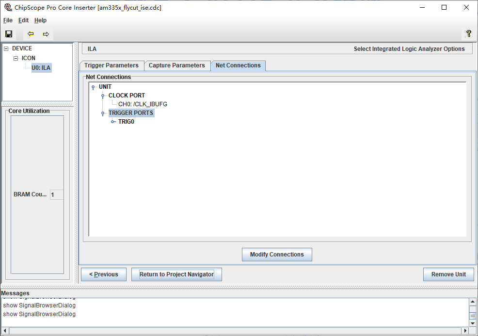

简介
===
说明
===
## ISE
### ChipScope
  ISE有个在线逻辑分析仪ChipScope，以IP核的形式被添加到用户设计中，支持以下两种方法插入ChipScope IP核：
1. 集成逻辑分析仪核（Intergrate Logic Analyzer core，ILA），该核主要用于提供触发核捕获的功能；
2. 集成控制核（Intergrated Controller core，ICON），负责ILA核JTAG端口的通信，一个ICON核可以连接1~15个ILA核。
    ChipScope工作时，ILA核根据用户设置的触发条件捕获数据，然后再ICON核控制下，通过JTAG端口上传至计算机，最后用ChipScope Pro Analyzer显示信号波形。

#### 添加ILA到工程
  在Design窗口右键选择New Source，选中ChipScope Definition and Connection File，输入文件名和路径，点击Next按钮进入信息总览界面，点击Finish按钮完成。


  可以看到在工程下面多了个cdc文件，即刚刚创建的ChipScope文件，双击打开。
  设置DEVICE参数，勾选Use SRLs和Use RPMs，含义如下：
1. Use SRLs：使编译器用移位寄存器查找表（Shift Register LUT）代替触发器（Flip Flops）和乘法器，能有效减少FPGA内部资源，提高ChipScope性能。
2. Use RPMs：RPM（Relationally Placed Macros）包含RLOC约束，RLOC定义了潜在设计原语的顺序与结构。让编译器用FMAP、HMAP、ROM、RAM等相关联的宏模块，使逻辑块布局更加合理，可以有效提高速度和性能，并节省FPGA资源。


  点击Next按钮，设置ICON参数，保持默认值。


  点击Next按钮，设置ILA参数，包括Trigger Parameters、Capture Parameters和Net Connections。
* Trigger Parameters
  触发参数设置界面如下：


1. Number of Input Trigger Ports：设置触发输入端口个数，最多16个。
2. Trigger Width：触发端口宽度，每个端口都可以单独设置。
3. Match Type：触发类型，共有6种，每种类型能够设置的触发条件（Bit Values）和功能（Functions）也有所不同。
|Match Type|Bit Values|Functions|
|--|---|---|
|Basic|0,1,X|=,<>|
|Basic w/edges|0,1,X,R,F,B,N|=,<>|
|Extended|0,1,X|=,<>,>,>=,<,<=|
|Extended w/edges|0,1,X,R,F,B,N|=,<>,>,>=,<,<=|
|Range|0,1,X|=,<>,>,>=,<,<=,in range,not in range|
|Range w/edges|0,1,X,R,F,B,N|=,<>,>,>=,<,<=,in range,not in range|
4. 触发条件（Bit Values）：
|Bit Values|说明|
|---|---|
|0|低电平|
|1|高电平|
|X|不确定|
|R|上升沿（Rising）|
|F|下降沿（Falling）|
|B|双边沿（Both Edge）|
|N|非边沿（No Edge）|
5. 功能（Functions）：
|Functions|说明|
|---|---|
|=|等于|
|<>|不等于|
|<|小于|
|<=|小于等于|
|>|大于|
|>=|大于等于|
|in range|在某个范围|
|not in range|不在某个范围|

* Capture Parameters
  点击Next进入捕获参数设置页面，如下：


1. Data Depth：触发条件后，采样的数据个数，越大占用的FPGA资源越多。
2. Clock Edge：采样的时钟边沿，可以在时钟上升沿（Rising）或下降沿（Falling）采样。
3. Data Same As Trigger：数据信号也可以作为触发信号，但对于inout双向信号，方向会改变，建议只作为数据信号。

* Net Connections
  点击Next进入端口连接设置页面，如下：

**采样时钟设置**
  双击红色的CLOCK PORT打开选择网络界面，该界面主要包括层次结构/网络（Structure / Nets）和网络选择（Net Selections）两部分：
* Structure / Nets上方显示网络层次结构，下方显示相应层次的网络。
* Net Selections上方为信号选择，包含时钟信号（Clock Signals）和触发/数据信号（Trigger/Data Signals）；下方为连接按钮，包括建立连接（Make Connections）、移除连接（Remove connections）、上移网络（Move Nets Up）、下移网络（Move Nets Down）。
  在左侧Structure / Nets选择一个网络作为采样时钟（最好选择跟数据处于同一网络下的时钟信号），在右侧Net Selections的Clock Signals标签页选中某个通道，然后点击下方的Make Connections按钮，即可将前面的时钟信号设为该通道的采样时钟。


  点击OK返回端口连接设置页面，可以看到CLOCK PORT变成了黑色，并显示刚才设置的采样时钟。
**触发端口设置**
  双击红色的TRIGGER PORTS打开选择网络界面，在右侧Net Selections切换到Trigger/Data Signals标签页，可以看到很多通道（CH:0~N），最大通道N等于之前设置的触发端口宽度Trigger Width-1；在下方可以切换触发端口TP0~N，最大端口N等于之前设置的触发端口数Number of Input Trigger Ports-1。选中某个端口的一个或多个通道，并在左侧Structure / Nets选择网络作为触发/数据信号，点击Make Connections按钮建立连接。按照同样的方法添加其他想要抓取的信号。

  点击OK返回端口连接设置页面，如果参数设置正确，TRIGGER PORTS会变成黑色，否则还是红色，可能是有的信号没有连接，也可以返回ILA参数界面修改之前设置的参数。


  到这里所有的配置都完成了，点击Return to Project Navigator，在弹出的对话框点“是”保存配置，返回ISE主窗口，重启编译生成bit流文件。

#### ChipScope Pro Analyzer
  双击Design窗口下的Analyze Design Using ChipScope打开ChipScope Pro Analyzer， 点击工具栏的Open cable/Search JTAG Chain按钮，ChipScope会自动识别硬件信息。


  点击OK进入信号观察界面，包括Project、Signals、Trigger Setup、Waveform等窗口，如下所示：


##### Project
  点击左上角Project窗口下的Trigger Setup、Waveform、Listing、Bus Plot可以打开对应的窗口。
* Trigger Setup：打开触发设置窗口
* Waveform：打开波形窗口
* Listing：打开数据表格窗口，即数据用表格的方式展现出来，并且可以导出。
* Bus Plot：打开数据坐标图，主要用来展示数据与时间的关系或者数据与数据的关系。

  在Project窗口右键设备（如DEV:0 MyDevice0(XC6SLX25)），选择configure，首先点击SelectNew File选择bit文件（默认在working目录下），接着勾选Import Design-level DCD File，同时会打开Open CDC File窗口，选择之前创建的CDC文件（默认在工程根目录下）。


  点击OK，这时会自动下载bit文件到FPGA运行，加载信号并刷新Signals、Trigger Setup和Waveform窗口。

##### Signals
##### Trigger Setup
  Match子窗口的Value栏设置触发条件；Radix栏设置信号显示的进制（默认为二进制bin）。
  Capture子窗口的Depth设置采样深度；Position设置偏移量（默认为0），以100为例，将触发条件满足前的100个数据和触发条件满足之后的Depth-100个数据显示到Waveform窗口中，便于捕捉到触发之前的一部分信息，更有助于问题的定位；Storage Qualification默认选择All Data。

##### Waveform
  Bus/Signal栏是被观察的信号，可以从Signals窗口右键某个信号选择Add to View（或者选择全部信号Add All to View）-->Waveform将其添加到Waveform窗口。

##### Listing
##### Bus Plot
##### 工具栏
  工具栏的Trigger Run Mode可以设置触发模式：Single表示单次触发，Repetitive表示连续触发，Startup脱离ChipScope Pro Analyzer工具（参考Xilinx UG029）。
  右侧的三个按钮分别是开始触发（Apply Settings and Arm Trigger）、停止触发（Stop Acquisition）、实时触发（Trigger Imediate）。
  接着四个按钮分别是跳转到X标尺（Goto X Marker）、跳转到O标尺（Goto O Marker）、跳转到上一次触发（GotoPrevious Marker）、跳转到下一次触发（Goto Next Marker），这些标尺都在Waveform中显示：红色的T标尺代表触发的起始位置，不能移动；绿色的O和蓝色的X标尺是可移动标尺，可以直接拖动这两个标尺来测量两个关键点的差值，其各自的位置及差值在Waveform下方的状态栏中显示。
  接着三个按钮分别是放大波形（Zoom In）、缩小波形（Zoom Out）、使波形适应窗口（Fit Window）。

## 问题
### 编译选项
|选项|说明|
|---|---|
|```(*keep="true"*)```|防止信号在编译时被ISE自动优化掉，导致在Chipscope中找不到。如果不管用，还可以把需要调试的信号赋值给一个冗余输出端口。此外，还建议勾选层次化结构属性（右键Synthesize - XST-->Process Properties-->Synthesis Options下Keep Hierarchy选项设为Yes），这样编译器就会按照层次化去综合，在使用ChipScope的时候可以定位到单个模块。|
|(\* mark_debug = "true" \*)|同上|

参考
===