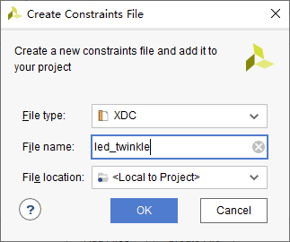

简介
===
硬件
------
  Zynq-7000包含了处理器系统（Processing System，PS）和可编程逻辑（Programmable Logic，PL）两部分，由一个双核ARM Cortex-A9处理器和一个Xilinx 7系列FPGA组成，将处理器的软件可编程性和FPGA的硬件可编程性完美进行整合。
### PL
### PS
  ZYNQ实际上是一个以处理器为核心的系统，PL只是它的一个外设，且两部分的供电电路是独立的，都可以单独使用，不使用的部分可以断电。PL也可以用来搭建像MicroBlaze的嵌入式处理器，称为软核处理器，而PS是硬核处理器，性能更高，两者可以同时并协同工作。
  ZYNQ处理器系统（PS）除了ARM处理器，还有一些相关的资源。

* APU
  应用处理器单元（Application Processing Unit，APU）包括两个ARM核，且每个核都有一个媒体处理引擎NEON和浮点单元FPU、一个内存管理单元MMU、一个一级Cache（指令和数据）；一个二级Cache和片上存储器（On Chip Memory，OCM），两个ARM共用；一个一致性控制单元（Snoop Control Unit，SCU），在ARM核与二级Cache及OCM之间形成了桥连接，还部分负责与PL对接。


* 外部接口
  PS和外部接口主要通过54个复用输入/输出（Multiplexed Input/Output，MIO）通信，当数量不够时还可以使用扩展MIO（Extended MIO，EMIO）共用PL的I/O资源。
  此外，还有2路SPI、2路I2C、2路CAN、2路UART、2路SD、2路USB、2路GigE和4组x32位GPIO。

* 存储器接口
  包括一个动态存储器控制器和几个静态存储器接口模块。前者可以用于DDR3、DDR3L、DDR2或LPDDR2，后者可以支持一个NAND Flash、一个QSPI Flash、一个并行数据总线和并行NOR Flash。

* 片上存储器
  包括256KB RAM（OCM）和128KB ROM（BootROM），OCM支持两个64位AXI从机接口，一个专用于通过APU SCU的CPU/ACP访问，另一个由PS和PL内其他所有的总线主机所共享；BootROM专用于引导过程，用户不可见。

* AXI
  高级可扩展接口（Advanced eXtendsible Interface，AXI）用于片内处理器和PFGA间的通信，使用AXI4协议，支持三种接口。
|类型|说明|
|---|---|
|AXI4|用于处理器访问存储器等需要指定地址的高速数据传输场景|
|AXI4-Lite|简化版的AXI4接口，用于访问一些低速外设中的寄存器，数据量较少。|
|AXI4-Stream|像FIFO一样不需要地址，在主从设备之间直接连续读写数据，用于视频、高速AD、PCIe、DMA等需要高速数据传输的场合。|

  在PS和PL之间共有9个AXI接口，第一个字母的M（主机）或S（从机）表示的是PS的角色：
|接口|说明|
|---|---|
|M_AXI_GP0~1|通用AXI（General Purpose，GP）是32位数据总线，适合PS和PL之间的中低速通信，是透传不带缓冲的。PS作为主机。|
|S_AXI_GP0~1|同上，PL作为主机。|
|S_AXI_ACP|加速器一致性个端口（Accelerator Coherency Port，ACP）是64位总线，用来实现APU Cache和PL单元之间的一致性。PL作为主机。|
|S_AXI_HP0~3|高性能端口（High Performance Port，HP）是32位或64位数据总线，带有FIFO缓冲来提供批量读写操作，并支持PS和PL中存储器单元的高速通信。PL作为主机。|

### IO
  PS的IO Bank包括Bank500、Bank501和Bank502，PL的IO Bank包括Bank13、Bank34和Bank35。

软件
------
  现在Xilinx把软件部分Vitis（即2019.2以前的SDK）与硬件部分Vivado完全分开了。如果只开发硬件部分，只需要安装Vivado即可；如果还需要开发软件部分，则需要安装Vitis，同时也会安装Vivado。

### Vivado
#### 下载
  进入[Xilinx](https://www.xilinx.com/)官网，按照Products-->Hardware Development-->Vivado ML导航到[Vivado](https://www.xilinx.com/products/design-tools/vivado.html)产品页面，在PLATFORM EDITIONS下选择[Standard Edition](https://www.xilinx.com/products/design-tools/vivado/vivado-ml.html)或[Enterprise Edition](https://www.xilinx.com/products/design-tools/vivado/vivado-ml-buy.html)版本，点击[Download from Download Center](https://www.xilinx.com/support/download.html)进入下载页面，找到合适版本的安装包下载（本文以 Vivado HLx 2020.1为例）。

#### 安装
  解压安装包，找到xsetup.exe并双击，不检查新版本，按照提示进行安装。


### Vitis
  [Vitis](https://china.xilinx.com/products/design-tools/vitis/vitis-platform.html)统一软件平台包含了Vitis AI开发环境、Vitis加速库、Vitis Core开发套件、Vitis RunTime库、Vitis目标平台、Vitis Model Composer等重要组件。

#### 下载
  进入[Xilinx](https://www.xilinx.com/)官网，按照Products-->Software Development-->Vitis Software Platform导航到[Vitis](https://www.xilinx.com/support/download/index.html/content/xilinx/en/downloadNav/vitis.html)下载页面，找到合适版本的安装包下载（本文以 Xilinx Vitis 2020.1为例Vitis，实际上可以使用之前下载的Vivado HLx 2020.1安装包）。

#### 安装
  安装方法与Vivado类似，Select Product to Install时选择Vitis，接着自定义安装组件，开始安装。

开发
===
FPGA
------
  FPGA设计中从底层向上存在四种抽象层级，依次为结构性的、寄存器传输级（Register Transfer Level，RTL）、行为性的和高层：

|抽象层级|说明|
|---|---|
|结构性的|最底层的抽象，涉及到对底层硬件单元直接的例化，比如逻辑门，甚至更底层的查找表（LUT）或者触发器（FF）。|
|RTL|设计者更常用的抽象层级，隐藏了底层的细节，描述寄存器和寄存器之间可执行的操作。|
|行为性的|对电路的算法描述，也就是描述电路表现出什么样的功能（行为），而不是描述每个寄存器改如何进行操作。|
|高层|前面三种抽象层级都是在使用硬件描述语言HDL进行设计，而高层则直接使用高级语言（如C/C++和System C）进行设计。|

  Xilinx Vivado高层综合（High-Level Synthesis，HLS）工具将高级语言代码综合成HDL描述，最后再进行逻辑综合得到网表，这个网表最终会被映射到具体的FPGA器件上。

### FPGA开发
  FPGA开发流程如下：


#### 新建工程
  打开Vivado软件，显示首页，如下图所示：


  点击首页的Create Project或菜单栏File-->Project-->New打开新建工程向导。


  点击Next，输入工程名称和路径，勾选Create project subdirectory以便Vivado自动管理工程文件夹内的各种工程文件并创建相应的子目录。


  点击Next，可以看到几种工程类型，选择RTL Project。


|类型|说明|
|---|---|
|RTL Project|按照正常的设计流程，Do not specify sources at this time选项用于设置是否在创建工程向导的过程中添加设计文件。|
|Post-synthesis Project|用于导入第三方工具所产生的综合后的网表|
|I/O Planning Project|在开始RTL设计之前，创建一个用于早期IO规划和器件开发的空工程。|
|Imported Project|用于从ISE、XST或Synopsys Synplify导入现有的工程源文件|
|Example Project|创建一个Vivado提供的工程模板|

  点击Next，如果上一步没有勾选Do not specify sources at this time则会进入添加源文件页面，可以新建或添加源文件，也可以直接点击Next跳过。


  点击Next，如果之前没有勾选Do not specify sources at this time则会进入添加约束文件页面，新建或添加约束文件，也可以直接点击Next跳过。


  点击Next，选择芯片型号或开发板类型，在搜索框中输入xc7z020clg400-2，并用鼠标选中。


  点击Next，进入工程概览页面，检查无误后点击FInish完成工程的创建，初始化完成后显示工程界面。


|子窗口|说明|
|---|---|
|菜单栏|所有命令|
|工具栏|常用命令|
|Flow Navigator|提供了从设计输入到生成比特流的整个过程的命令和工具，点击了相应的命令后，整个工程主界面的各个子窗口可能会做出相应的更改。|
|Sources|显示层次结构（Hierarchy）、库（Libraries）和编译顺序（Compile Order）|
|Netlist|提供分析（Elaborated）或综合（Synthesised）后的逻辑设计的分层视图|
|Properties|显示有关所选逻辑对象或器件资源的特性信息|
|Project Summary|提供了当前工程的摘要信息，运行设计命令时动态更新。|
|Text Editor|显示和编辑基于文本的文件和报告|
|Schematic|原理图窗口|
|Device|器件窗口|
|Package|封装窗口|
|状态和结果窗口|显示运行命令的状态和结果以及消息、日志和报告等<br></br>Tcl Console：输入Tcl命令<br></br>Messages：显示报警信息，如Error、Critical Warning、Warning等<br></br>Log：显示综合、实现和仿真run的日志文件<br></br>Reports：可以查看整个设计流程中的活动run所生程的报告<br></br>Designs Runs：管理当前工程的runs|
|Default Layout|窗口布局选择器，也可以使用菜单栏的Layout命令。|

#### 设计输入
  点击Sources窗口中的+号，弹出添加源文件向导，选择Add or create design sources。


  点击Next，在弹出的页面中创建或添加源文件。
  点击Add Files添加事先编写好的代码。


  或者点击Create File，弹出创建源文件窗口，设置源文件类型、名称和路径。


  点击OK，可以看到文件列表中已经有了刚刚创建的源文件。


  点击Finish，弹出定义模块页面，用于设置源文件的模块名称和端口列表，Vivado都会自动生成相应的代码，也可以后面自己手动添加。


  点击OK完成，这时在Sources窗口的Design Sources下可以看到刚刚创建的源文件led_twinkle.v。
  双击源文件打开文本编辑器，输入源代码如下：
```verilog
`timescale 1ns / 1ps

module led_twinkle(
    input sys_clk,
    input sys_rst_n,
    output [1:0] led
    );

reg [25:0] cnt;

assign led = (cnt < 26'd2500_0000) ? 2'b01 : 2'b10;

always@(posedge sys_clk or negedge sys_rst_n)
begin
    if(!sys_rst_n)
        cnt <= 26'd0;
    else if(cnt < 26'd5000_0000)
        cnt <= cnt + 1'b1;
    else
        cnt <= 26'd0;
end
endmodule
```

#### 分析与综合
* 分析
  点击Flow Navigator窗口RTL ANALYSIS下的Open Elaborated Design开始对RTL源文件进行语法检查和分析，并在Messages窗口显示Error和Warning。分析成功后会生成顶层原始图，并在Schematic窗口显示，在Netlist窗口显示网表信息。


  在Elaborated Design窗口顶部右键，选择Close关闭分析后的界面。

* 综合
  点击Flow Navigator窗口SYNTHESIS下的Run Synthesis，接着点击OK，开始对代码进行综合，可以在Design Runs窗口查看进度。完成后显示如下窗口，点击Cancel关闭。


#### 约束输入
  点击Sources窗口中的+号，弹出添加源文件向导，选择Add or create constraint创建约束文件。
  点击Next，在弹出的页面中创建或添加约束文件。
  点击Add Files添加事先编写好的约束文件。
  或者点击Create File，弹出创建约束文件窗口，设置约束文件类型、名称和路径。


  点击OK，可以看到文件列表中已经有了刚刚创建的约束文件。


  点击Finish，这时在Sources窗口的Constraints下可以看到刚刚创建的约束文件led_twinkle.xdc。
  双击打开约束文件，开始对工程进行约束，包括对IO引脚的约束和对时序的约束。

* 对I/O引脚约束
  打开Elaborated Design窗口，在右上角的布局选择器中选择I/O Planning开始I/O引脚分配。


  在I/O Ports窗口为每个信号分配I/O引脚，按Ctrl + S，在弹出的窗口中选择Select existing file保存到led_twinkle.xdc。
  最后点击OK，可以打开led_twinkle.xdc文件查看修改。
```verilog
set_property PACKAGE_PIN H18 [get_ports {led[1]}]
set_property PACKAGE_PIN J18 [get_ports {led[0]}]
set_property PACKAGE_PIN U18 [get_ports sys_clk]
set_property PACKAGE_PIN J15 [get_ports sys_rst_n]
```

* 对时序约束
  略

#### 设计实现
  点击Flow Navigator窗口IMPLEMENTATION下的Run Implementation，在弹出的窗口直接点击OK，开始对设计进行实现，可以在Design Runs窗口查看进度。完成后显示成功窗口，点击Cancel关闭。


#### 生成和下载比特流
  点击Flow Navigator窗口PROGRAM AND DEBUG下的Generate Bitstream，在弹出的窗口直接点击OK，开始生成比特流文件（\*.bit），可以在Design Runs窗口查看进度。完成后显示成功窗口，点击Cancel关闭。
  点击Flow Navigator窗口PROGRAM AND DEBUG下的Open Hardware Manager打开硬件管理界面。


  将开发板通过Xilinx下载器连接到电脑，打开开发板电源，点击Hardware窗口的Auto Connect按钮连接开发板，连接成功后显示如下：


  点击上方的Program device，在弹出的窗口选择之前生成的比特流文件，点击Program按钮下载程序。完成后可以在Tcl Console窗口看到结果，查看开发板观察程序运行结果。


  需要注意的是，这里下载的程序断电后会丢失，后面需要将程序固化到开发板。

### HLS开发

ARM
------
### 嵌入式开发
  ZYNQ的嵌入式开发分为以下六步，前四步为硬件设计部分，第五步为软件设计部分，第六步为功能的验证。


  要进行ZYNQ嵌入式开发，首先要搭建嵌入式最小系统（由ARM Cortex-A9核、DDR3内存和UART串口组成）。

#### 硬件设计
##### 创建Vivado工程
  参考FPGA开发部分的Vivado教程创建hello_world工程（不需要添加源文件和约束文件）。

##### 使用IP Intergrator创建Processing System
  点击Flow Navigator窗口IP INTEGRATOR下的Create Block Design，在弹出的对话框中输入设计名称system。


  点击OK按钮，打开Block Design界面，在Diagram窗口以图形化的方式设计。


  点击Diagram工具栏的+号打开IP目录，在搜索栏输入zynq，找到并双击ZYNQ7 Processing System，添加ZYNQ7处理系统IP。


  双击添加的ZYNQ7 Processing System模块，进入ZYNQ处理系统的配置界面（类似于STM32CubeMX）。


  Zynq Block Design以图形化的方式显示了Zynq处理系统（PS）的各种模块，其中灰色是固定的，绿色是可配置的。可以直接单击各种可配置块进入相应的配置页面，也可以使用左侧的Page Navigator导航到响应的页面配置。
|页面|说明|
|---|---|
|PS-PL Configuration|配置PS-PL接口，包括AXI、HP和ACP总线接口。|
|Peripheral I/O Pins|为不同I/O外设选择MIO/EMIO配置（引脚复用）|
|MIO Configuration|为不同I/O外设具体配置MIO/EMIO（速度、上拉）|
|Clock Configuration|配置PS输入时钟、外设时钟，以及DDR和CPU时钟等。|
|DDR Configuration|设置DDR控制器配置信息|
|SMC Timing Calculation|执行SMC时序计算|
|Interrupts|配置PS-PL中断|

  点击左侧Peripheral I/O Pins进入IO引脚配置页面，点击MIO14和MIO15下的UART0方块，此时方块会变成绿色，表明这两个脚被配置成了UART0的RXD和TXD。


  点击左侧MIO Configuration进入MIO配置页面，详细配置UART0引脚信息。


  点击左侧PS-PL Configuration进入PS-PL配置页面，配置UART0参数（波特率115200）。


  点击左侧DDR Configuration进入DDR配置页面，在DDR Controller Configuration下配置DDR参数，Memory Part选择与自己所用DDR兼容的型号。


  点击左侧Clock Configuration进入时钟配置页面，设置输入时钟与硬件一致，CPU、DDR和其他外设的时钟保持默认。
  由于不需要使用PL，取消勾选Clock Configuration页面PL Fabric Clocks下的FCLK_CLK0、PS-PL Configuration页面General-->Enable CLock Resets下的FCLK_RESET0_N和AXI Non Secure Enablement-->GP Master AXI Interface下的M AXI GP0 interface，移除与PL相关的接口。


  点击OK回到Diagram窗口，发现ZYNQ7 Processing System接口已经改变。


  点击上方的Run Block Automation，在弹出的对话框选择自动连接IP模块的接口（包括导出外部端口、自动添加模块互联过程中所需的IP），确认勾选processing_system7_0。


  点击OK完成，引出的接口将被分配到ZYNQ器件具体的管脚上，可以点击相应的+号展开，观察具体有哪些信号。


  点击Diagram窗口工具栏的Validate Design按钮（快捷键F6）验证设计，完成后弹出成功对话框提示成功或错误和关键警告信息。

##### 生成顶层HDL
  在Sources-->Design Sources找到刚刚完成的设计system.bd，右键选择Generate Output Products，在弹出的窗口中设置Synthesis Options为Global和Run Settings下的线程数。


  点击Generate来生成设计的综合、实现和仿真文件，完成后弹出成功提示框，点击OK。
  在Sources窗口的IP Sources标签页可以看到生成的结果。


  回到Hierarchy标签页，右键点击system.bd，选择Create HDL Wrapper，在弹出的对话框中勾选Let Vivado manage wrapper and auto-update（当修改了Block Design后Vivado会自动更新顶层模块），点击OK。


  Design Sources结构如下，system_wrapper.v是创建的顶层模块，使用Verilog对设计进行封装，对Block Design例化，可以双击打开查看内容。


##### 生成Bitstream
  如果设计中使用了PL，则需要添加引脚约束并对该设计进行综合、实现并生成Bitstream文件。

##### 导出硬件
  点击菜单File-->Export-->Export Hardware，按照提示生成xsa文件。


#### 软件设计

### Linux开发

参考
===
* []()