简介
===
硬件
------
  Zynq-7000包含了处理器系统（Processing System，PS）和可编程逻辑（Programmable Logic，PL）两部分，由一个双核ARM Cortex-A9处理器和一个Xilinx 7系列FPGA组成，将处理器的软件可编程性和FPGA的硬件可编程性完美进行整合。
### PL
### PS
  ZYNQ实际上是一个以处理器为核心的系统，PL只是它的一个外设，且两部分的供电电路是独立的，都可以单独使用，不使用的部分可以断电。PL也可以用来搭建像MicroBlaze的嵌入式处理器，称为软核处理器，而PS是硬核处理器，性能更高，两者可以同时并协同工作。
  ZYNQ处理器系统（PS）除了ARM处理器，还有一些相关的资源。

* APU
  应用处理器单元（Application Processing Unit，APU）包括两个ARM核，且每个核都有一个媒体处理引擎NEON和浮点单元FPU、一个内存管理单元MMU、一个一级Cache（指令和数据）；一个二级Cache和片上存储器（On Chip Memory，OCM），两个ARM共用；一个一致性控制单元（Snoop Control Unit，SCU），在ARM核与二级Cache及OCM之间形成了桥连接，还部分负责与PL对接。


* 外部接口
  PS和外部接口主要通过54个复用输入/输出（Multiplexed Input/Output，MIO）通信，当数量不够时还可以使用扩展MIO（Extended MIO，EMIO）共用PL的I/O资源。
  此外，还有2路SPI、2路I2C、2路CAN、2路UART、2路SD、2路USB、2路GigE和4组x32位GPIO。

* 存储器接口
  包括一个动态存储器控制器和几个静态存储器接口模块。前者可以用于DDR3、DDR3L、DDR2或LPDDR2，后者可以支持一个NAND Flash、一个QSPI Flash、一个并行数据总线和并行NOR Flash。

* 片上存储器
  包括256KB RAM（OCM）和128KB ROM（BootROM），OCM支持两个64位AXI从机接口，一个专用于通过APU SCU的CPU/ACP访问，另一个由PS和PL内其他所有的总线主机所共享；BootROM专用于引导过程，用户不可见。

* AXI
  高级可扩展接口（Advanced eXtendsible Interface，AXI）用于片内处理器和FPGA间的通信，使用AXI4协议，支持三种接口。
|类型|说明|
|---|---|
|AXI4|用于处理器访问存储器等需要指定地址的高速数据传输场景|
|AXI4-Lite|简化版的AXI4接口，用于访问一些低速外设中的寄存器，数据量较少。|
|AXI4-Stream|像FIFO一样不需要地址，在主从设备之间直接连续读写数据，用于视频、高速AD、PCIe、DMA等需要高速数据传输的场合。|

  在PS和PL之间共有9个AXI接口，第一个字母的M（主机）或S（从机）表示的是PS的角色：
|接口|说明|
|---|---|
|M_AXI_GP0~1|通用AXI（General Purpose，GP）是32位数据总线，适合PS和PL之间的中低速通信，是透传不带缓冲的。PS作为主机。|
|S_AXI_GP0~1|同上，PL作为主机。|
|S_AXI_ACP|加速器一致性端口（Accelerator Coherency Port，ACP）是64位总线，用来实现APU Cache和PL单元之间的一致性。PL作为主机。|
|S_AXI_HP0~3|高性能端口（High Performance Port，HP）是32位或64位数据总线，带有FIFO缓冲来提供批量读写操作，并支持PS和PL中存储器单元的高速通信。PL作为主机。|

### IO
  PS的IO Bank包括Bank500、Bank501和Bank502，PL的IO Bank包括Bank13、Bank34和Bank35。

软件
------
  现在Xilinx把软件部分Vitis（即2019.2以前的SDK）与硬件部分Vivado完全分开了。如果只开发硬件部分，只需要安装Vivado即可；如果还需要开发软件部分，则需要安装Vitis，同时也会安装Vivado。

### Vivado
#### 下载
  进入[Xilinx](https://www.xilinx.com/)官网，按照Products-->Hardware Development-->Vivado ML导航到[Vivado](https://www.xilinx.com/products/design-tools/vivado.html)产品页面，在PLATFORM EDITIONS下选择[Standard Edition](https://www.xilinx.com/products/design-tools/vivado/vivado-ml.html)或[Enterprise Edition](https://www.xilinx.com/products/design-tools/vivado/vivado-ml-buy.html)版本，点击[Download from Download Center](https://www.xilinx.com/support/download.html)进入下载页面，找到合适版本的安装包下载（本文以 Vivado HLx 2020.1为例）。

#### 安装
  解压安装包，找到xsetup.exe并双击，不检查新版本，按照提示进行安装。


### Vitis
  [Vitis](https://china.xilinx.com/products/design-tools/vitis/vitis-platform.html)统一软件平台包含了Vitis AI开发环境、Vitis加速库、Vitis Core开发套件（嵌入式软件开发）、Vitis RunTime库、Vitis目标平台、Vitis Model Composer等重要组件。

#### 下载
  进入[Xilinx](https://www.xilinx.com/)官网，按照Products-->Software Development-->Vitis Software Platform导航到[Vitis](https://www.xilinx.com/support/download/index.html/content/xilinx/en/downloadNav/vitis.html)下载页面，找到合适版本的安装包下载（本文以 Xilinx Vitis 2020.1为例Vitis，实际上可以使用之前下载的Vivado HLx 2020.1安装包）。

#### 安装
  安装方法与Vivado类似，本文以在Ubuntu 18.04系统下安装为例。
  解压安装包，执行安装脚本。

```shell
tar zxvf Xilinx_Unified_2020.1_0602_1208.tar.gz
cd Xilinx_Unified_2020.1_0602_1208
./xsetup
```


  Select Product to Install时选择Vitis，接着自定义安装组件，开始安装。


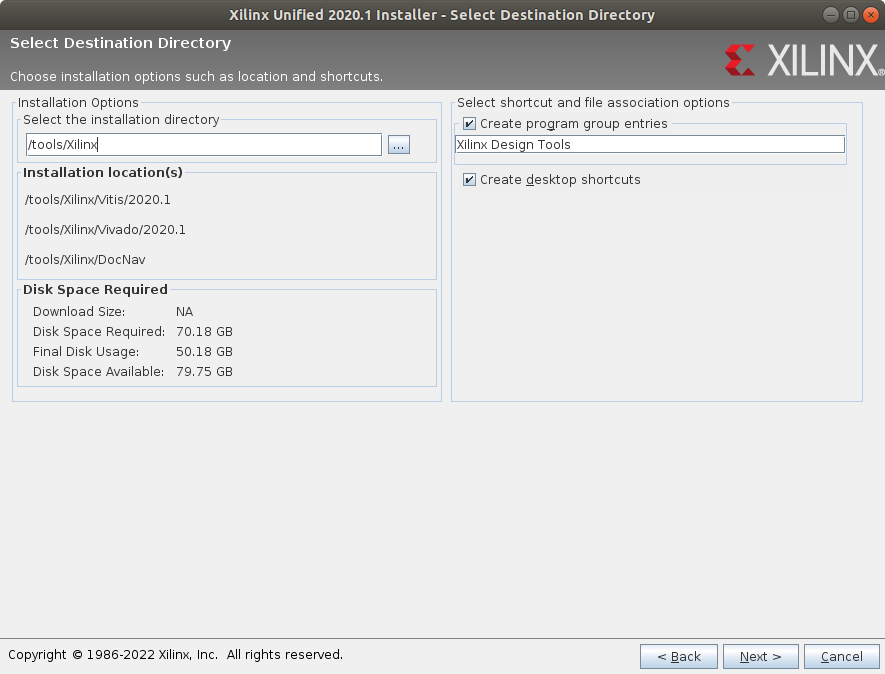


  配置Vitis环境变量。
```shell
cd /tools/Xilinx/Vitis/2020.1
source settings64.sh
aarch64-linux-gnu-gcc # 输入开头按TAB看能不能自动补全，验证环境是否设置成功
echo "source /tools/Xilinx/Vitis/2020.1/settings64.sh" >> ~/.bashrc # 用户登陆时自动配置环境变量
```

  安装JTAG驱动。
```shell
cd /tools/Xilinx/Vitis/2020.1/data/xicom/cable_drivers/lin64/install_script/install_drivers/
sudo ./install_drivers
#使用下面命令可以删除JTAG驱动
sudo rm -f /etc/udev/rules.d/52-xilinx-digilent-usb.rules
sudo rm -f /etc/udev/rules.d/52-xilinx-ftdi-usb.rules
sudo rm -f /etc/udev/rules.d/52-xilinx-pcusb.rules
```

  如果使用虚拟机，连接硬件时可能会出现如下错误，需要设置虚拟机的USB兼容性为USB3.1（默认为USB2.0）。


  此外，加速应用的开发环境需要安装[Xilinx Runtime](https://china.xilinx.com/support/download/index.html/content/xilinx/zh/downloadNav/embedded-platforms/archive-vitis-embedded.html)，下载合适的安装包[xrt_202010.2.6.655_18.04-amd64-xrt.deb](https://china.xilinx.com/bin/public/openDownload?filename=xrt_202010.2.6.655_18.04-amd64-xrt.deb)，执行如下命令安装。
```shell
dpkg -i xrt_202010.2.6.655_18.04-amd64-xrt.deb
```

#### 卸载
```shell
cd /tools/Xilinx/.xinstall/Vitis_2020.1
./xsetup -Uninstall
```


  Vitis使用教程可以参考[Vitis-Tutorials](https://github.com/Xilinx/Vitis-Tutorials)和[Vitis-Doc](https://www.xilinx.com/html_docs/xilinx2020_1/vitis_doc/index.html)。

### PetaLinux
  PetaLinux工具是一个包含了u-boot、linux kernel、device tree、rootfs等源码和库以及Yocto recipes的嵌入式Linux开发套件，可以方便地生成、配置、编译集自定义Linux系统，大大简化了Linux系统的开发工作。

#### 下载
  进入[Xilinx](https://www.xilinx.com/)官网，按照Products-->Embedded Development-->Embedded Software & Ecosystem导航到Embedded Software Infrastructure页面，点击PetaLinux按钮进入PetaLinux Tools页面，点击Download & Licensing-->Download PetaLinux进入[下载](https://www.xilinx.com/support/download/index.html/content/xilinx/en/downloadNav/embedded-design-tools.html)页面，找到合适版本的安装包下载（本文以 PetaLinux 2020.1为例）。

#### 安装
  在安装PetaLinux之前需要先安装一些必要的运行软件和依赖库。
```shell
sudo apt-get install gawk build-essential net-tools xterm autoconf libtool zlib1g-dev gcc-multilib texinfo libncurses5-dev zlib1g:i386 tftpd-hpa
```

  安装PetaLinux到/tools/PetaLinux目录下。
```shell
cd “PetaLinux安装包位置”
sudo mkdir -p /tools/PetaLinux
sudo chown -R $USER:$USER /tools #修改/tools文件夹属性为当前用户
./petalinux-v2020.1-final-installer.run -d /tools/PetaLinux
```


  配置系统shell为bash。
```shell
sudo dpkg-reconfigure dash #选择No回车
```


  配置PetaLinux环境变量。
```shell
cd /tools/PetaLinux
source settings.sh
echo $PETALINUX # 验证环境是否设置成功
echo "source /tools/PetaLinux/settings.sh" >> ~/.bashrc # 每次登陆时自动配置环境变量
```

  安装JTAG驱动。
```shell
cd /tools/PetaLinux/tools/xsct/data/xicom/cable_drivers/lin64/install_script/install_drivers/
sudo ./install_drivers
#使用下面命令可以删除JTAG驱动
sudo rm -f /etc/udev/rules.d/52-xilinx-digilent-usb.rules
sudo rm -f /etc/udev/rules.d/52-xilinx-ftdi-usb.rules
sudo rm -f /etc/udev/rules.d/52-xilinx-pcusb.rules
```

开发
===
FPGA
------
  FPGA设计中从底层向上存在四种抽象层级，依次为结构性的、寄存器传输级（Register Transfer Level，RTL）、行为性的和高层：

|抽象层级|说明|
|---|---|
|结构性的|最底层的抽象，涉及到对底层硬件单元直接的例化，比如逻辑门，甚至更底层的查找表（LUT）或者触发器（FF）。|
|RTL|设计者更常用的抽象层级，隐藏了底层的细节，描述寄存器和寄存器之间可执行的操作。|
|行为性的|对电路的算法描述，也就是描述电路表现出什么样的功能（行为），而不是描述每个寄存器改如何进行操作。|
|高层|前面三种抽象层级都是在使用硬件描述语言HDL进行设计，而高层则直接使用高级语言（如C/C++和System C）进行设计。|

  Xilinx Vivado高层综合（High-Level Synthesis，HLS）工具将高级语言代码综合成HDL描述，最后再进行逻辑综合得到网表，这个网表最终会被映射到具体的FPGA器件上。

### FPGA开发
#### 基本流程
  FPGA开发流程如下：


|流程|说明|
|---|---|
|新建工程|打开Vivado软件，使用新建工程向导新建工程。|
|设计输入|工程创建完成后，需要新建一个Verilog顶层文件，然后输入设计代码。|
|分析与综合|分析（Elaborated）是编译RTL源文件并进行全面的语法检查。<br>综合（Synthesis）就是综合器将RTL设计转变为由FPGA器件中的查找表（LUT）、触发器（FF）等各种底层电路单元所组成的网表，并对设计进行优化（如删除多余的逻辑等）。|
|约束输入|约束（Constraint）表达了设计者期望满足的时序要求，并在综合、实现阶段来指导工具进行布局、布线，工具会按照约束尽量去努力实现以满足时序要求，并在时序报告中给出结果。常用的约束包括时序约束、引脚约束等等。|
|设计实现|实现（Implementation）整个设计，包括布局和布线等。|
|生成和下载比特流|生成用于下载到期间的比特流（Bit Stream）文件，并通过下载器将比特流文件下载到FPGA中，完成整个开发流程。|

  接下来以LED闪烁实验（led_twinkle）来演示整个开发流程。

##### 新建工程
  打开Vivado软件，显示首页，如下图所示：


  点击首页的Create Project或菜单栏File-->Project-->New打开新建工程向导。


  点击Next，输入工程名称和路径。若勾选Create project subdirectory选项，Vivado会在所选工程目录下自动创建一个与工程同名的文件夹，用于存放工程内的各种文件。Vivado会自动管理工程文件夹内的各种工程文件，并创建相应的子目录。


  点击Next，可以看到几种工程类型，选择RTL Project。


|类型|说明|
|---|---|
|RTL Project|按照正常的设计流程，Do not specify sources at this time选项用于设置是否在创建工程向导的过程中添加设计文件。|
|Post-synthesis Project|用于导入第三方工具所产生的综合后的网表|
|I/O Planning Project|在开始RTL设计之前，创建一个用于早期IO规划和器件开发的空工程。|
|Imported Project|用于从ISE、XST或Synopsys Synplify导入现有的工程源文件|
|Example Project|创建一个Vivado提供的工程模板|

  点击Next，如果上一步没有勾选Do not specify sources at this time则会进入添加源文件页面，可以新建或添加源文件，也可以直接点击Next跳过。


  点击Next，如果之前没有勾选Do not specify sources at this time则会进入添加约束文件页面，新建或添加约束文件，也可以直接点击Next跳过。
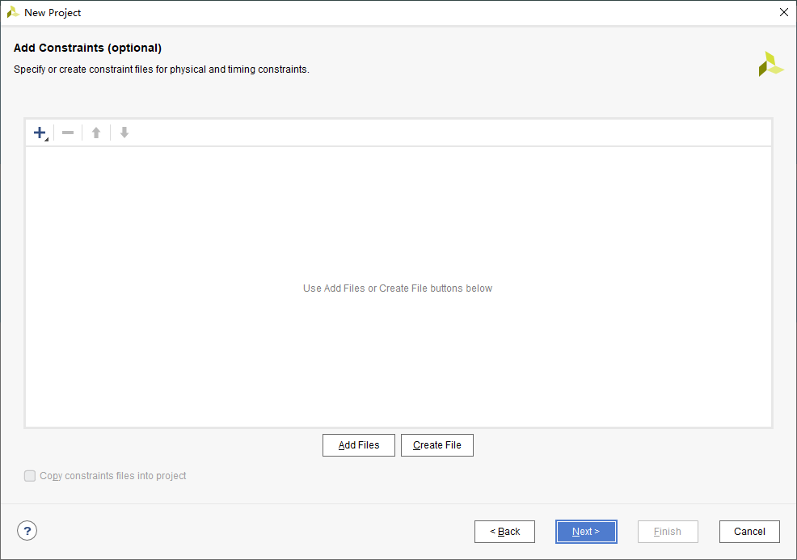

  点击Next，选择芯片型号或开发板类型，在搜索框中输入xc7z020clg400-2，并用鼠标选中。


  点击Next，进入工程概览页面，检查无误后点击FInish完成工程的创建。


  初始化完成后显示工程界面。


|子窗口|说明|
|---|---|
|菜单栏|所有命令|
|工具栏|常用命令|
|Flow Navigator|提供了从设计输入到生成比特流的整个过程的命令和工具，点击了相应的命令后，整个工程主界面的各个子窗口可能会做出相应的更改。|
|Sources|显示层次结构（Hierarchy）、IP源文件（IP Sources）、库（Libraries）和编译顺序（Compile Order）的视图。|
|Netlist|提供分析（Elaborated）或综合（Synthesised）后的逻辑设计的分层视图|
|Properties|显示有关所选逻辑对象或器件资源的特性信息|
|Project Summary|提供了当前工程的摘要信息，运行设计命令时动态更新。|
|Text Editor|显示和编辑基于文本的文件和报告|
|Schematic|原理图窗口|
|Device|器件窗口|
|Package|封装窗口|
|状态和结果窗口|显示运行命令的状态和结果以及消息、日志和报告等<br></br>Tcl Console：输入Tcl命令<br></br>Messages：显示报警信息，如Error、Critical Warning、Warning等<br></br>Log：显示综合、实现和仿真run的日志文件<br></br>Reports：可以查看整个设计流程中的活动run所生程的报告<br></br>Designs Runs：管理当前工程的runs|
|Default Layout|窗口布局选择器，也可以使用菜单栏的Layout命令。|

##### 设计输入
  点击Sources窗口中的+号，弹出添加源文件向导，选择Add or create design sources。


  点击Next，在弹出的页面中创建或添加源文件。


  点击Add Files添加事先编写好的代码。


  或者点击Create File，弹出创建源文件窗口，设置源文件类型、名称和路径。


  点击OK，可以看到文件列表中已经有了刚刚创建的源文件。


  点击Finish，弹出定义模块页面，用于设置源文件的模块名称和端口列表，Vivado都会自动生成相应的代码，也可以后面自己手动添加。


  点击OK完成，这时在Sources窗口的Design Sources下可以看到刚刚创建的源文件led_twinkle.v。
  双击源文件打开文本编辑器，输入源代码如下：
```verilog
`timescale 1ns / 1ps

module led_twinkle(
    input sys_clk,
    input sys_rst_n,
    output [1:0] led
    );

reg [25:0] cnt;

assign led = (cnt < 26'd2500_0000) ? 2'b01 : 2'b10;

always@(posedge sys_clk or negedge sys_rst_n)
begin
    if(!sys_rst_n)
        cnt <= 26'd0;
    else if(cnt < 26'd5000_0000)
        cnt <= cnt + 1'b1;
    else
        cnt <= 26'd0;
end
endmodule
```

**注意：**
* 点击左侧Flow Navigation-->PROJECT MANAGER-->Seetings或菜单栏Tools-->Seetings打开设置对话框，在Tool Settings-->Text Editor-->Fonts and Colors页面可以设置字体、字号和颜色。
* 点击工具栏保存按钮或按Ctrl + S保存文件后，Vivado会对源文件进行部分语法的检查，如果有语法错误会各处提示。另外，大多数情况下，Vivado会自动识别设计的顶层模块，如果没有，用户可以右键源文件选择Set as Top来手动指定顶层模块。

##### 分析与综合
###### 分析
  点击Flow Navigator窗口RTL ANALYSIS下的Open Elaborated Design开始对RTL源文件进行语法检查和分析，并在Messages窗口显示Error和Warning。分析成功后会生成顶层原理图，并在Schematic窗口显示，在Netlist窗口显示网表信息。


  在Elaborated Design窗口顶部右键，选择Close关闭分析后的界面。

###### 综合
  点击Flow Navigator窗口SYNTHESIS下的Run Synthesis，接着点击OK，开始对代码进行综合，可以在Design Runs窗口查看进度。完成后显示如下窗口，点击Cancel关闭。


##### 约束输入
###### 手动输入约束规则
  点击Sources窗口中的+号，弹出添加源文件向导，选择Add or create constraint创建约束文件。
  点击Next，在弹出的页面中创建或添加约束文件。
  点击Add Files添加事先编写好的约束文件。
  或者点击Create File，弹出创建约束文件窗口，设置约束文件类型、名称和路径。


  点击OK，可以看到文件列表中已经有了刚刚创建的约束文件。


  点击Finish，这时在Sources窗口的Constraints下可以看到刚刚创建的约束文件led_twinkle.xdc。
  双击打开约束文件，开始对工程进行约束，包括对IO引脚的约束和对时序的约束。输入如下内容：
```verilog
#IO 管脚约束
set_property -dict {PACKAGE_PIN U18 IOSTANDARD LVCMOS33} [get_ports sys_clk]
set_property -dict {PACKAGE_PIN J15 IOSTANDARD LVCMOS33} [get_ports sys_rst_n]
set_property -dict {PACKAGE_PIN J18 IOSTANDARD LVCMOS33} [get_ports {led[0]}]
set_property -dict {PACKAGE_PIN H18 IOSTANDARD LVCMOS33} [get_ports {led[1]}]
#时钟周期约束
create_clock -name clk -period 20 [get_ports sys_clk]
```

* 每条语句单独占一行，结尾不需要结束符（如“;”）
* “#”号表示注释
* 每条命令第一个关键字代表该命令的名称，其后的所有字段都是该命令的参数列表。
* 使用“set_property”命令对管教位置和电平标准进行约束：以第二行为例，“PACKAGE_PIN U18”定义引脚位置；“IOSTANDARD LVCMOS33”定义电平标准；“[get_ports sys_clk]”定义该约束所附加的对象是sys_clk引脚。
* “create_clock”命令创建一个时钟：“-name clk”表示所创建的时钟名称是“clk“；”-period 20”表示时钟周期是20ns（50MHz）在做约束时可以等于或略低于这个值，但不建议设置的太小，负责软件在布局布线时很难满足要求；”[get_ports sys_clk]“表示该时钟约束所附加的对象即时钟源是sys_clk。一般支队输入的时钟做周期约束。

###### 使用I/O Planning
* 对I/O引脚约束
  打开Elaborated Design窗口，在右上角的布局选择器中选择I/O Planning开始I/O引脚分配。


  在I/O Ports窗口为每个信号分配I/O引脚，按Ctrl + S，在弹出的窗口中选择Create a new file并输入约束文件名led_twinkle，或者选择Select existing file保存到之前创建的led_twinkle.xdc，最后点击OK。可以在Sources-->Constraints-->constrs_1下找到并打开led_twinkle.xdc文件以查看和修改。
```verilog
set_property PACKAGE_PIN H18 [get_ports {led[1]}]
set_property PACKAGE_PIN J18 [get_ports {led[0]}]
set_property PACKAGE_PIN U18 [get_ports sys_clk]
set_property PACKAGE_PIN J15 [get_ports sys_rst_n]
set_property IOSTANDARD LVCMOS33 [get_ports {led[1]}]
set_property IOSTANDARD LVCMOS33 [get_ports {led[0]}]
set_property IOSTANDARD LVCMOS33 [get_ports sys_clk]
set_property IOSTANDARD LVCMOS33 [get_ports sys_rst_n]
```

* 对时序约束
  略

##### 设计实现
  点击Flow Navigator窗口IMPLEMENTATION下的Run Implementation，在弹出的窗口直接点击OK，开始对设计进行实现，可以在Design Runs窗口查看进度。完成后显示成功窗口，点击Cancel关闭。


##### 生成和下载比特流
  点击Flow Navigator窗口PROGRAM AND DEBUG下的Generate Bitstream，在弹出的窗口直接点击OK，开始生成比特流文件（\*.bit），可以在Design Runs窗口查看进度。完成后显示成功窗口，点击Cancel关闭。
  点击Flow Navigator窗口PROGRAM AND DEBUG下的Open Hardware Manager打开硬件管理界面。


  将开发板通过Xilinx下载器连接到电脑，打开开发板电源，点击Hardware窗口的Auto Connect按钮连接开发板，连接成功后显示如下：


  点击上方的Program device，在弹出的窗口选择之前生成的比特流文件，点击Program按钮下载程序。完成后可以在Tcl Console窗口看到结果，查看开发板观察程序运行结果。


  需要注意的是，这里下载的程序断电后会丢失，后面需要将程序固化到开发板。

#### 集成逻辑分析仪
  Vivado中有一个集成逻辑分析仪（Integrated Logic Analyzer，ILA），以IP核的形式加入到用户设计中。Vivado提供了三种具有不同集成层次的插入ILA方法，以满足不同用户的需求。
1. HDL实例化调试探针流程：直接在HDL代码中例化一个ILA IP核。这是集成层次最高的方法，但灵活性较差，在调试完毕后，需要在HDL源码中删除ILA IP核。
2. 网表插入调试探针流程：在综合后的网表中，分别标记要进行调试观察的各个信号，然后通过一个简单的”Setup Debug“向导来设置各个探针和ILA IP核的工作参数，然后工具会根据用户设置的参数，自动地生成各个ILA IP核。用户不需要修改HDL源码，并能单独控制每个ILA IP核以及每个探针，具有很大的灵活性。用户设置的调试信息会议Tcl XDC调试命令的形式保存到XDC约束文件中，在实现阶段，Vivado会读取这些XDC调试命令，并在布局布线时加入这些ILA IP核。在调试完毕后，用户可以自综合后的网表中删除ILA IP核，或者在XDC文件中删除调试命令。
3. 手动在XDC约束文件中书写对应的Tcl XDC调试命令，之后同上。这种方法集成层次最低，一般不会使用。

##### HDL实例化调试探针流程
  点击Flow Navigation窗口PROJECT MANAGER下的IP Catalog，在弹出的IP Catalog窗口中输入”ILA“，双击ILA（Integrated Logic Analyzer）IP核打开配置界面，参数设置如下：
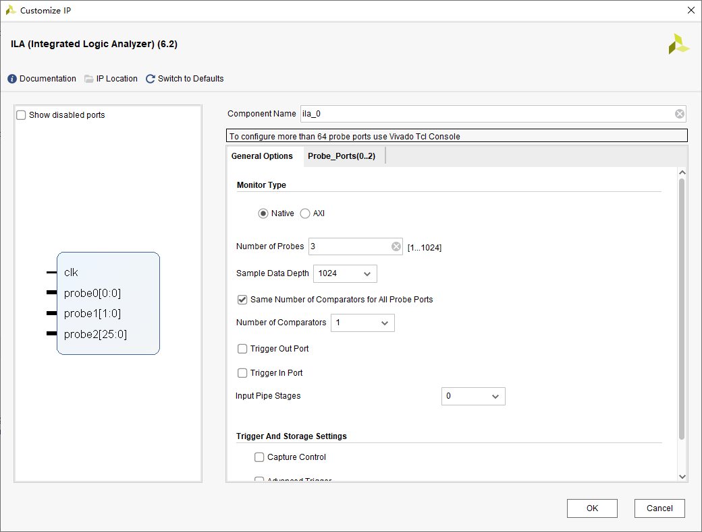
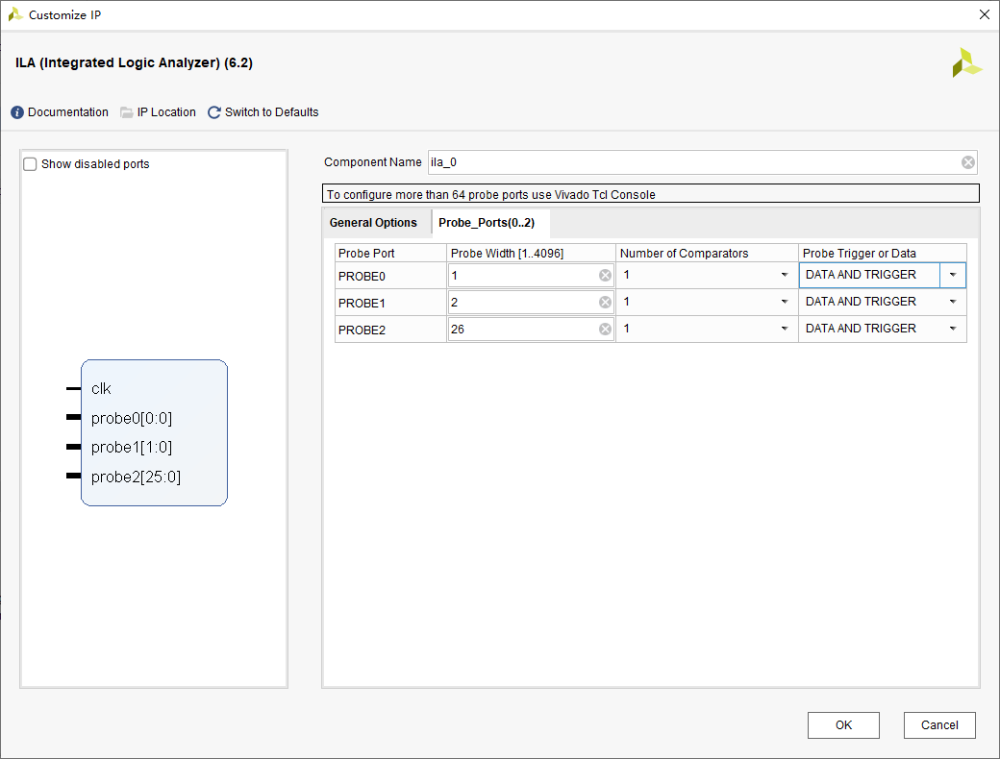

  点击OK，在弹出的对话框继续点击OK，接着弹出”Generate Output Products“对话框，直接点击Generate按钮。
  此时，Vivado开始对ILA IP核进行OOC（Out-of Context）综合。对于顶层设计，Vivado使用自顶向下的全局（Global）综合方式，将顶层之下的所有逻辑模块都进行综合，但是设置为OOC方式的模块除外，它们独立于顶层设置而单独综合。OOC综合是一种自底向上的设计流程，OOC模块可以是来自IP Catalog的IP、来自Vivado IP Intergrator的block design或者顶层模块下手动设置为OOC方式的任何子模块。来自IP Catalog的IP默认使用OOC综合方式，在顶层的全局综合之前，单独地进行OOC综合并生成输出产品（Generate Output Products），包括综合后地网表等各种文件。之后对顶层进行综合时，OOC模块不会参与，其网表会在综合之后的实现过程中，参与到全局设计的实现。
  可以在Design Runs窗口中看到OOC综合过程和结果：


  在Sources-->IP Sources-->IP-->ila_0-->Instantiation Template下找到ILA IP核的例化模板文件ila_0.veo，双击打开查看模板内容，复制例化代码到led_twinkle.v顶层HDL代码中，并将ILA的时钟和探针信号连接到顶层设计中，代码如下：
```verilog
ila_0 u_ila_0 (
    .clk(sys_clk), // input wire clk

    .probe0(sys_rst_n), // input wire [0:0]  probe0
    .probe1(led), // input wire [1:0]  probe1
    .probe2(cnt) // input wire [25:0]  probe2
);
```

  点击Flow Navigation窗口PROGRAM AND DEBUG下的Generate Bitstream，对设计进行综合实现并生成比特流。接着点击Open Hardware Manager打开硬件管理界面，将开发板通过Xilinx下载器连接到电脑，打开开发板电源，点击Hardware窗口的Auto Connect按钮连接开发板。然后点击上方的Program device，在弹出的窗口选择之前生成的比特流文件led_twinkle.bit和具有调试探针信息的调试探测文件led_twinkle.ltx，点击Program按钮下载程序。


  此时，Vivado会自动打开ILA的调试窗口，点击”Waveform - hw_ila_1“窗口下的+号添加探针信号到波形窗口。然后点击”Run trigger for this ILA core“按钮开始采样，采集到的波形如下：


  在Trigger Setup窗口中添加触发条件，点击+号，将cnt信号添加进来，设置触发条件如下图所示。


  波形窗口中有4个触发动作：自动触发开关、开始触发、立即触发、停止触发。当选中了”自动触发开关“，点击”开始触发“按钮后，会不断地检测触发条件，每次触发时都会刷新波形，直到点击”停止触发“按钮。若没有选中，点击”开始触发“按钮后，在检测到触发条件后就会停止触发。也可以点击”立即触发“按钮立刻刷新波形。波形窗口中有一条红色竖线，最上面有个”T“字，标记了触发条件满足的时刻。


  调试完毕后，可以将ILA例化代码注释掉，并在Sources-->Design Sources选中ila_0，然后在Source File Properties窗口中取消勾选”Enabled“项，刷新后ila_0移到了Disabled Sources下。

##### 网表插入调试探针流程
  有以下两种方法：
一. 在综合后的网表中手动选择网络并点击”mark_debug“按钮，将要进行调试观察的各个信号标记”mark_debug“属性，然后通过”Setup Debug“向导来设置ILA IP核的参数，最后工具会根据参数来自动创建ILA IP核。
二. 在综合前在HDL代码中为想要观察的reg或wire信号添加”Mark Debug“综合属性，紧挨在变量声明的前面使用”(\* mark_debug = "true" \*)“标记，这些信号不会被工具优化掉。
  若使用第二种方法添加”Mark Debug“属性，则修改代码如下：
```verilog
module led_twinkle(
    input sys_clk,
(* mark_debug = "true" *)    input sys_rst_n,
(* mark_debug = "true" *)    output [1:0] led
    );

(* mark_debug = "true" *) reg [25:0] cnt;
```

  点击Flow Navigation-->SYNTHESIS-->Run Synthesis进行综合，完成后点击Open Synthesized Design打开综合后的设计窗口，点击右上角的窗口布局选择器，选择“Debug”窗口布局。此时，Vivado打开了Netlist子窗口、Schematic子窗口以及Debug子窗口，如下图所示：


  Netlist子窗口和Schematic子窗口都可以用于标记要进行观察的信号，Debug子窗口用于显示并设置ILA IP核的各个参数。在Debug子窗口中又包含Debug Cores核Debug Nets两个选项卡，用于显示所有标记为”Mark Debug“的信号。Debug Cores以ILA IP核为中心，所有标记为”Mark Debug“的信号并且已经被分配到ILA探针的信号都会被显示在各个ILA IP核的视图树下，否则显示在Unassigned Debug Nets下。Debug Nets不显示ILA IP核，所有标记为”Mark Debug“的信号并且已经被分配到ILA探针的信号都会被显示Assigned Nets下，否则显示在Unassigned Debug Nets下。在HDL代码中已经添加了”Mark Debug“属性的信号会自动出现在Unassigned Debug Nets下。

  若之前没有使用第二种方法添加”Mark Debug“属性，则需要手动标记要进行观察的信号。在Netlists子窗口或Schematic子窗口中，右键要添加标记的网络（此时另一个子窗口中也会自动选中此网络）并选择Mark Debug（或Unmark Debug取消标记），如下图所示：


  此时在Debug子窗口的Debug Nets选项卡的Unassigned Debug Nets下会出现刚刚标记地网络，点击Debug子窗口上方甲壳虫图案的Set Up Debug按钮，弹出Set Up Debug向导，点击Next继续。接下来选择采样待测信号的时钟域（Clock Domain），Vivado会自动识别各个待测信号所属的时钟域并将其自动设为采样时钟，如下图：


  也可以手动指定各个用于采样待测信号的时钟域，选中该信号并点击上方的Select Clock Domain按钮，或者右键选择Select Clock Domain，弹出Select Clock Domain对话框，完成后点击OK。Set Up Debug向导会为每个采样时钟生成一个单独的ILA IP核。


  点击Next，接下来设置ILA IP核的全局参数，其中”Sample of data depth“用于设置采样深度，”Input pipe stages“用于设置待测信号和其采样时钟之间的同步级数。若采样待测信号与其时钟之间是异步的，为了避免亚稳态，此数值最好不要低于2。由于本例的两个待测信号与其采样时钟是同步的，所以可以设置为0。


  点击Next，进入最后的概览页面，确认无误后点击Finish完成。


  此时，在Debug子窗口的Debug Cores选项卡中，可以看到已经添加了ILA IP核，且Unassigned Debug Nets下已经没有未分配的信号了。


  网表中被标记为Mark Debug的信号也变成了虚线，表示其完成了ILA IP核的分配，如下图所示。


  点击工具栏的保存按钮或按Ctrl + S快捷键，在弹出的消息框直接点击OK（如果弹出Save Constraint对话框，询问用户保存到哪个XDC约束文件中，选择Select an existing file并选择led_twinkle.xdc，然后点击OK）。
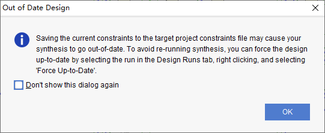

  打开led_twinkle.xdc，可以看到增加了一些用于debug的约束命令。接下来就可以实现设计，Vivado会读取这些约束，并按照这些命令的参数来自动加入ILA IP核。最后生成比特流，下载并观察信号。


  调试完毕后，可以删除led_twinkle.v源代码中信号的Mark Debug属性核XDC文件中包含的Tcl调试命令。

#### 仿真
  根据下图所示的FPGA设计流程，在设计输入之后、设计综合之前进行RTL仿真，成为综合前仿真，也称为前仿真或功能仿真，主要验证电路的功能是否符合设计要求，不考虑电路门延迟和线延迟。在完成设计代码编写后，直接对HDL代码进行仿真，检测源代码是否符合功能要求，可以比较直观的观察波形的变化，在设计的最初阶段发现问题。
  在布局布线后进行的仿真称为布局布线后仿真，也称为后仿真或时序仿真，真实反映了逻辑的时延与功能，综合考虑电路的路径延迟与门延迟的影响，验证电路能否在一定时序条件下满足设计构想的过程是否存在时序违规。


  Vivado集成了Vivado Simulator，能够在设计流程的不同阶段进行功能仿真和时序仿真，并在波形查看器中显示结果。此外，Vivado还支持与ModelSim、Verilog Compiler Simulator（VCS）、Questa Advanced Simulator等第三方仿真器的联合仿真。

##### 功能仿真
  功能仿真需要以下文件：
* 设计HDL源代码（Unit Under Test，UUT）：可以是VHDL或Verilog语言，既可以是顶层模块 ，又可以是下层子模块。

* 测试激励代码（TestBench）：根据UUT顶层输入/输出接口的设计要求，来产生顶层输入接口的测试激励并监视顶层输出接口。不需要进行综合，书写有很大的灵活性。

* 仿真模型/库：根据设计内调用的器件供应商提供的模块而定，如FIFO、ADD_SUB等。在使用Vivado Simulator时，仿真器所需要的仿真模型/库是预先编译好并集成在Vivado中的，因此不需要进行额外的预编译操作，直接加载HDL设计和TestBench即可执行仿真。

  点击Sources窗口中的+号，弹出添加源文件向导，选择Add or create simulation sources创建仿真源文件。
  点击Next，在弹出的页面中创建或添加仿真源文件。
  点击Add Files添加事先编写好的仿真源文件。
  或者点击Create File，弹出创建仿真源文件窗口，设置文件类型、名称和路径。


  点击OK，可以看到文件列表中已经有了刚刚创建的仿真源文件。


  点击Finish，弹出定义模块页面，用于设置仿真源文件的模块名称和端口列表，Vivado都会自动生成相应的代码，也可以后面自己手动添加。


  点击OK，紧接着弹出模块定义确认按钮，点击Yes，这时在Sources窗口的Simulation Sources-->sim_1下可以看到刚刚创建的仿真源文件tb_led_twinkle.v。
  双击源文件打开文本编辑器，输入Test Bench激励代码如下：
```verilog
// 规定时间单位和精度
`timescale 1ns / 1ps

// 定义Test Bench模块名
module tb_led_twinkle();

// 输入
reg sys_clk;
reg sys_rst_n;
// 输出
wire [1:0] led;

// 信号初始化
initial
begin
  sys_clk = 1'b0;
  sys_rst_n = 1'b0;
  #200
  sys_rst_n = 1'b1;
end

// 生成时钟
always #10 sys_clk = ~sys_clk;

// 例化待测设计
led_twinkle u_led_twinkle(
  .sys_clk(sys_clk),
  .sys_rst_n(sys_rst_n),
  .led(led)
  );

end module
```

  由于LED闪烁的周期是500ms，相对于仿真器来说太过漫长，英雌仿真时可以缩小设计代码中的时间尺度，这里将led_twinkle.v中的计时器cnt最大计时值改为10，内容如下：
```verilog
`timescale 1ns / 1ps

module led_twinkle(
    input sys_clk,
    input sys_rst_n,
    output [1:0] led
    );

reg [25:0] cnt;

//assign led = (cnt < 26'd2500_0000) ? 2'b01 : 2'b10;
assign led = (cnt < 26'd5) ? 2'b01 : 2'b10;

always@(posedge sys_clk or negedge sys_rst_n)
begin
    if(!sys_rst_n)
        cnt <= 26'd0;
//    else if(cnt < 26'd5000_0000)
    else if(cnt < 26'd10)
        cnt <= cnt + 1'b1;
    else
        cnt <= 26'd0;
end
endmodule
```

  点击Flow Navigator窗口SIMULATION下的Run Simulation，接着点击Run Behavioral Simulation进入仿真界面。


  包括以下几个子窗口：
|子窗口|说明|
|---|---|
|Scope窗口|Scope（范围）窗口显示了设计层次结构，当选择了一个作用域时，该作用域内的所有HDL对象，包括reg、wire等都会出现在Objects窗口中，可以在Objects窗口中选择HDL对象，并将它们添加到波形窗口中。|
|Objects窗口|以上图为例，在Scope窗口中选择了u_led_twinkle，在Objects窗口中会自动显示出led_twinkle模块中的所有对象，除了顶层端口sys_clk、sys_rst_n、led之外，还包括在内部定义的计数器cnt。|
|波形窗口|用于显示观察所要观察信号的波形，在Objects窗口中选中一个或多个HDL对象如cnt，右键选择”Add to Wave Window“，添加到波形窗口中。|
|仿真工具栏|包含运行各个仿真动作的命令按钮|

  配置完后需要将波形配置信息保存下来，以便下次打开仿真器时继续使用该配置。点击波形窗口左上角的保存按钮，弹出Save Waveform对话框，默认将配置文件保存到当前工程目录，名称为tb_led_twinkle_behav.wcfg（.wcfg只包含波形窗口的配置信息，不包含波形的数据文件，后者将被存储在另外的文件中），直接点击Save。


  之后会弹出一个消息框，是否将刚刚创建的波形配置信息文件添加到当前工程中，点击Yes。可以在Sources-->Simulation Sources-->sim_1-->Waveform Configuration File下看到该文件。


  仿真状态下的工具栏如下：


|工具|说明|
|---|---|
|Restart|将仿真时间重置为0，此时波形窗口中原有的波形都会被清除。下次执行仿真时，会从0时刻重新开始。|
|Run all|运行仿真，直到完成所有事件或遇到HDL语句中的$stop或$finish命令为止，当设计比较复杂，且没有在Test Bench中加入前面两条命令时，不要轻易点击该按钮，否则仿真器会耗费大量的CPU和内存资源，可能造成电脑卡顿或死机。|
|Run For|运行特定一段时间，时间长度和单位由右侧的两个编辑框指定，默认为10us。|
|Step|单步运行仿真，每一步仿真一个HDL语句。|
|Break|暂停当前仿真|
|Relaunch|便于修改HDL源代码后，重新编译仿真源并重新启动仿真，不需要关闭并重新打开仿真器。|

  刚打开仿真器时，仿真器会将Test Bench中信号加入到波形窗口中，并执行一段时间的仿真，时长由Settings窗口的Simulation页面的Simulation标签页下的xsim.simulate.runtime指定，默认为1000ns。


  首先点击Restart按钮将仿真时刻重置为0，此时波形窗口的当前仿真时刻点（黄色标尺）就会回归到0ps，且原先的所有波形都被清除。
  接着点击Run For按钮仿真10us，此时波形窗口口出现了波形，点击波形窗口工具栏中的Zoom Fit按钮，使波形自动缩放到整个窗口，按住Ctrl键并滚动鼠标滚轮可以放大/缩小波形，还可以拖动下方的滚动条查看各个时间的波形。
  cnt信号默认显示为16进制，右键并选择Radix-->Unsigned Decimal，设置为10进制。
  仿真波形如下，可以看到cnt每计数到4和10，两个led的电平状态就切换依次，说明HDL设计达到了预期的功能。


  仿真结束后，右键Flow Navigation-->SIMULATION选择Close Sumulation来关闭仿真界面，在弹出的确认窗口中点击OK即可。

##### 时序仿真
  略

### HLS开发

ARM
------
### 嵌入式开发
#### 基本流程
  ZYNQ的嵌入式开发分为以下六步，前四步为硬件设计部分，第五步为软件设计部分，第六步为功能的验证。


  要进行ZYNQ嵌入式开发，首先要搭建嵌入式最小系统（由ARM Cortex-A9核、DDR3内存和UART串口组成）。

##### 硬件设计
###### 创建Vivado工程
  参考FPGA开发部分的Vivado教程创建hello_world工程（不需要添加源文件和约束文件）。

###### 使用IP Intergrator创建Processing System
  点击Flow Navigator窗口IP INTEGRATOR下的Create Block Design，在弹出的对话框中输入设计名称system。


  点击OK按钮，打开Block Design界面，在Diagram窗口以图形化的方式设计。


  点击Diagram工具栏的+号打开IP目录，在搜索栏输入zynq，找到并双击ZYNQ7 Processing System，添加ZYNQ7处理系统IP。


  双击添加的ZYNQ7 Processing System模块，进入ZYNQ处理系统的配置界面（类似于STM32CubeMX）。


  Zynq Block Design以图形化的方式显示了Zynq处理系统（PS）的各种模块，其中灰色是固定的，绿色是可配置的。可以直接单击各种可配置块进入相应的配置页面，也可以使用左侧的Page Navigator导航到响应的页面配置。
|页面|说明|
|---|---|
|PS-PL Configuration|配置PS-PL接口，包括AXI、HP和ACP总线接口。|
|Peripheral I/O Pins|为不同I/O外设选择MIO/EMIO配置（引脚复用）|
|MIO Configuration|为不同I/O外设具体配置MIO/EMIO（速度、上拉）|
|Clock Configuration|配置PS输入时钟、外设时钟，以及DDR和CPU时钟等。|
|DDR Configuration|设置DDR控制器配置信息|
|SMC Timing Calculation|执行SMC时序计算|
|Interrupts|配置PS-PL中断|

  点击左侧Peripheral I/O Pins进入IO引脚配置页面，点击MIO14和MIO15下的UART0方块，此时方块会变成绿色，表明这两个脚被配置成了UART0的RXD和TXD。


  点击左侧MIO Configuration进入MIO配置页面，详细配置UART0引脚信息。


  点击左侧PS-PL Configuration进入PS-PL配置页面，配置UART0参数（波特率115200）。


  点击左侧DDR Configuration进入DDR配置页面，在DDR Controller Configuration下配置DDR参数，Memory Part选择与自己所用DDR兼容的型号。


  点击左侧Clock Configuration进入时钟配置页面，设置输入时钟与硬件一致，CPU、DDR和其他外设的时钟保持默认。
  由于不需要使用PL，取消勾选Clock Configuration页面PL Fabric Clocks下的FCLK_CLK0、PS-PL Configuration页面General-->Enable CLock Resets下的FCLK_RESET0_N和AXI Non Secure Enablement-->GP Master AXI Interface下的M AXI GP0 interface，移除与PL相关的接口。


  点击OK回到Diagram窗口，发现ZYNQ7 Processing System接口已经改变。


  点击上方的Run Block Automation，在弹出的对话框选择自动连接IP模块的接口（包括导出外部端口、自动添加模块互联过程中所需的IP），确认勾选processing_system7_0。


  点击OK完成，引出的接口将被分配到ZYNQ器件具体的管脚上，可以点击相应的+号展开，观察具体有哪些信号。


  点击Diagram窗口工具栏的Validate Design按钮（快捷键F6）验证设计，完成后弹出成功对话框提示成功或错误和关键警告信息。

###### 生成顶层HDL
  在Sources-->Design Sources找到刚刚完成的设计system.bd，右键选择Generate Output Products，在弹出的窗口中设置Synthesis Options为Global和Run Settings下的线程数。


  点击Generate来生成设计的综合、实现和仿真文件，完成后弹出成功提示框，点击OK。
  在Sources窗口的IP Sources标签页可以看到生成的结果。


  回到Hierarchy标签页，右键点击system.bd，选择Create HDL Wrapper，在弹出的对话框中勾选Let Vivado manage wrapper and auto-update（当修改了Block Design后Vivado会自动更新顶层模块），点击OK。


  Design Sources结构如下，system_wrapper.v是创建的顶层模块，使用Verilog对设计进行封装，对Block Design例化，可以双击打开查看内容。


###### 生成Bitstream
  如果设计中使用了PL，则需要添加引脚约束并对该设计进行综合、实现并生成Bitstream文件。

###### 导出硬件平台文件
  点击菜单File-->Export-->Export Hardware，按照提示生成xsa文件。


##### 软件设计
  打开Vitis软件，设置工作区并启动，显示欢迎页面。


###### 创建平台项目
  点击Create Platform Project或菜单File-->New->Platform Project打开平台项目创建页面，可以从硬件描述文件（XSA）创建或从已有的平台导入。输入工程名称hello_world，点击Next。


  在Hardware Specification下点击Browse导入之前生成的XSA文件，在Software Specification下选择操作系统（standalone、freertos或linux），选择处理器（0或1）。
.PNG)

  点击Finish完成创建，点击工具栏锤子按钮编译工程。


###### 创建应用项目
  点击File-->New->Application Project打开应用项目创建页面，点击Next。


  在Select a platform from repository下选择上一步创建的平台项目，点击Next。


  在Applicaiton Project Details页面输入项目名称hello_world_app，点击Next。


  显示Select a domain页面，直接点击Next。


  在模板选择页面选择Hello World，点击Finish。


  完成后回到主界面，展开src目录可以看到源文件，双击helloworld.c查看或编辑代码，最后编译生成elf文件。


  连接到串口，打开串口调试软件，右键hello_world_app_system，选择Run As-->Lanch Hardware下载程序，观察串口是否打印Hello World信息。

#### 示例
##### GPIO
* MIO和EMIO
  GPIO（General Purpose I/O）是PS的一个外设，可以通过MIO（Multiplexed I/O）连接到PS引脚，也可以通过EMIO（Extended MIO）连接到PL引脚。GPIO分为4个Bank，其中Bank0和Bank1连接到MIO，而Bank2和Bank3连接到EMIO。除了Bank1只有22bit外，其他Bank都有32bit，因此Bank0（MIO[0~31]）+Bank1（MIO[32~53]）共有54个MIO，因此Bank2（EMIO[0~31]）+Bank3（EMIO[32~63]）共有64个EMIO。PS端经由EMIO引出的接口会直接连接到PL端的器件引脚上，通过IO管脚约束来指定所连接的PL引脚的位置。此外，EMIO还用于连接PL内实现的功能模块（IP核），该IP作为PS端的一个外部设备。


* 中断
  中断分为私有外设中断（PPI）、软件生成中断（SGI）和共享外设中断（SPI）。

* AXI GPIO
  在PL端调用AXI GPIO IP核，通过AXI4-Lite接口实现PS与PL中AXI GPIO模块的通信。

###### 硬件设计
  参考嵌入式开发流程新建Vivado工程，名称为gpio，添加ZYNQ Processing System，配置DDR3、UART0和GPIO MIO和EMIO，并将Bank1的I/O电压改为LVCOMS 1.8V。


  在MIO Configuration-->I/O Peripherals-->GPIO下勾选EMIO GPIO并设置位宽为1。


  由于需要PS与PL端的交互，需要配置相关接口。勾选PS-PL Configuration-->General-->Enable Clock Resets下的FCLK_RESET0_N、PS-PL Configuration-->AXI Non Secure Enablement-->GP Master AXI Interface下的M AXI GP0 interface、Clock Configuration-->PL Fabric Clocks下的FCLK_CLK0和Interrupts-->Fabric Interrupts-->PL-PS Interrupt Ports下的IRQ_F2P[15:0]。

  点击OK完成，鼠标移到GPIO_0端口处（光标变成铅笔）右键选择Make External。单击新生成的端口GPIO0_0，在External Interface Properties窗口的General下修改端口名为GPIO_EMIO_KEY。
点击加号，输入gpio添加AXI GPIO IP核。
  点击Run Block Automation，然后点击Run Connection Automation，在弹出的对话框中勾选All Automation。点击OK自动连线，完成后在Diagram空白处右键选择Regenerate Layout对设计重新布局，可以发现自动添加了AXI互联（AXI Interconnnect）和处理器系统复位（Processor System Reset）两个IP核。
  接着双击AXI GPIO IP核，配置位宽为1，并使能中断。


  点击OK完成，发现多了一个中断接口ip2intc_irpt，手动将其与IRQ_F2P连接起来。接着将AXI GPIO引出的端口重命名为AXI_GPIO_KEY，系统最终框图如下：


  此时，Block Design设计完成，在Diagram空白处右键选择Validate Design验证设计，成功无误后按Ctrl+S保存。然后在Source窗口右键点击gpio.bd，依此执行Generate Output Products和Create HDL Wrapper。 
  点击Flow Navigator窗口RTL ANALYSIS下的Open Elaborated Design，在弹出的对话框中点击OK。点击右上角的Default Layout选择I/O Planning打开IO分配页面，在下方的I/O Ports窗口对PL端口进行管脚分配：GPIO_EMIO_KEY（L20，LVCMOS33）、AXI_GPIO_KEY（J20，LVCMOS33）。按Ctrl+S保存为gpio.xdc。
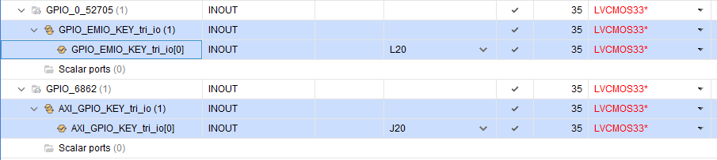

  点击Flow Navigator窗口PROGRAM AND DEBUG下的Generate Bitstream，对设计进行综合、实现并生成Bitstream文件。在最后弹出的对话框中选择Open Implemented Design，点击OK关闭ELABORATED DESIGN界面并打开IMPLEMENTED DESIGN界面。点击点击Flow Navigator窗口IMPLEMENTATION下的Report Utilization，在弹出的窗口点击OK，在下方的Utilization窗口点击Summary查看当前PL资源的使用情况。
  点击菜单File-->Export-->Export Hardware，勾选Include bitstream，生成硬件平台文件gpio_wrapper.xsa。
  参考嵌入式开发流程新建Vitis工程，新建main.c文件，输入代码。
```C
#include "stdio.h"
#include "xparameters.h"
#include "xil_printf.h"
#include "ip.h"
#inlcude "xil_io.h"
#inlcude "sleep.h"

#define LED_IP_BASEADDR               XPAR_IP_0_S0_AXI_BASE_ADDR
#define LED_IP_REG0                   IP_S0_AXI_SLV_REG0_OFFSET
#define LED_IP_REG1                   IP_S0_AXI_SLV_REG1_OFFSET

int main()
{
  int freq_flag;
  int led_state;
  xil_printf("LED User IP Test!\r\n");
  while(1)
  {
    if(freq_flag == 0)
    {
      IP_mWriteReg(LED_IP_BASEADDR, LED_IP_REG1, 0x800000EF);
      freq_flag = 1;
    }
    else
    {
      IP_mWriteReg(LED_IP_BASEADDR, LED_IP_REG1, 0x8000002F);
      freq_flag = 0;
    }
    led_state = IP_mReadReg(LED_IP_BASEADDR, LED_IP_REG0);
    if(led_state == 0)
    {
      IP_mWriteReg(LED_IP_BASEADDR, LED_IP_REG0, 1);
      xil_printf("LED ON\r\n");
    }
    sleep(5);
    led_state = IP_mReadReg(LED_IP_BASEADDR, LED_IP_REG0);
    if(led_state == 1)
    {
      IP_mWriteReg(LED_IP_BASEADDR, LED_IP_REG0, 0);
      xil_printf("LED OFF\r\n");
    }
    sleep(1);
  }
}
```

###### 软件设计
  参考嵌入式开发流程新建Vitis工程，名称为gpio。
  双击Explorer下的platform.spr打开Board Support Package界面，单击选中standalone on ps7_cortexa9_0-->Board Support Package，点击右侧的Drivers-->ps7_gpio_0下的Import Examples，在弹出的窗口勾选xgpiops_polled_example，点击OK。完成后可以看到多了一个应用项目xpgiops_polled_example，打开xgpiops_polled_example.c，学习xgpio库的用法。


  由于MIO0连接的是核心板的LED2，修改以下Output_Pin=0，编译、下载、运行，可以观察到对应的指示灯闪烁。
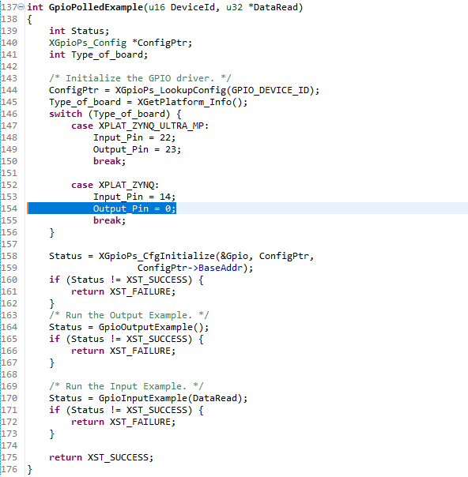

  示例程序仅供参考，学习相关模块的用法，还需要自己动手写。右键xgpiops_polled_example_1_system选择Delete，在弹出的对话框中可以勾选Delete project contents on disk(can not be undone)彻底删除，否则只是从工作区移除。在应用项目gpio_app_system-->gpio_app-->src下新建main.c，输入如下代码后编译。
```c
#include "xparameters.h"
#include "xstatus.h"
#include "xil_printf.h"
#include "xil_exception.h"
#include "xgpiops.h"
#include "xgpio.h"
#include "xscugic.h"
#include "sleep.h"

#define SCUGIC_ID          XPAR_SCUGIC_SINGLE_DEVICE_ID
#define GPIOPS_ID          XPAR_XGPIOPS_0_DEVICE_ID
#define GPIO_INTR_ID       XPAR_XGPIOPS_0_INTR
#define AXI_GPIO_ID        XPAR_AXI_GPIO_0_DEVICE_ID
#define AXI_GPIO_INTR_ID   XPAR_FABRIC_GPIO_0_VEC_ID

#define MIO_LED0           (7)
#define MIO_LED1           (8)
#define MIO_LED2           (0)

#define MIO_KEY0           (12)
#define MIO_KEY1           (11)
#define EMIO_KEY           (54)
#define AXI_KEY_CHANNEL    (1)
#define AXI_KEY_MASK       (XGPIO_IR_CH1_MASK)

static int instance_init(void);
static int interrupt_setup(void);
static void intr_handler(void *callback_ref);
static void axi_intr_handler(void *callback_ref);

XGpioPs gpio;
XGpio axi_gpio;
XScuGic scugic;
u32 key_press;
u32 key_val;

int main()
{
  int status;

  print("GPIO Test!\n\r");
  status = instance_init();
  if(status != XST_SUCCESS)
  {
    xil_printf("Instance init failed!\r\n");
    return XST_FAILURE;
  }

  XGpioPs_SetDirectionPin(&gpio, MIO_LED0, 1);
  XGpioPs_SetDirectionPin(&gpio, MIO_LED1, 1);
  XGpioPs_SetDirectionPin(&gpio, MIO_LED2, 1);
  XGpioPs_SetOutputEnablePin(&gpio, MIO_LED0, 1);
  XGpioPs_SetOutputEnablePin(&gpio, MIO_LED1, 1);
  XGpioPs_SetOutputEnablePin(&gpio, MIO_LED2, 1);

  XGpioPs_SetDirectionPin(&gpio, MIO_KEY0, 0);
  XGpioPs_SetDirectionPin(&gpio, MIO_KEY1, 0);
  XGpioPs_SetDirectionPin(&gpio, EMIO_KEY, 0);

  XGpio_SetDataDirection(&axi_gpio, AXI_KEY_CHANNEL, 1);

  status = interrupt_setup();
  if(status != XST_SUCCESS)
  {
    xil_printf("Setup interrupt system failed!\r\n");
    return XST_FAILURE;
  }

  while(1)
  {
    if(key_press)
    {
      key_press = FALSE;
	  key_val = ~key_val;
	  XGpioPs_WritePin(&gpio, MIO_LED0, key_val);
    }

    XGpioPs_WritePin(&gpio, MIO_LED1, ~XGpioPs_ReadPin(&gpio, MIO_KEY1));
    XGpioPs_WritePin(&gpio, MIO_LED2, ~XGpioPs_ReadPin(&gpio, EMIO_KEY));
  }

  return XST_SUCCESS;
}

static int instance_init(void)
{
  int status;
  XGpioPs_Config *ConfigPtr;
  XScuGic_Config *IntcConfig;

  ConfigPtr = XGpioPs_LookupConfig(GPIOPS_ID);
  status = XGpioPs_CfgInitialize(&gpio, ConfigPtr, ConfigPtr->BaseAddr);
  if(status != XST_SUCCESS)
  {
    return XST_FAILURE;
  }

  IntcConfig = XScuGic_LookupConfig(SCUGIC_ID);
  status = XScuGic_CfgInitialize(&scugic, IntcConfig, IntcConfig->CpuBaseAddress);
  if(status != XST_SUCCESS)
  {
    return XST_FAILURE;
  }

  XGpio_Initialize(&axi_gpio, AXI_GPIO_ID);

  return XST_SUCCESS;
}

static int interrupt_setup(void)
{
  int status;

  Xil_ExceptionInit();
  Xil_ExceptionRegisterHandler(XIL_EXCEPTION_ID_INT, (Xil_ExceptionHandler)XScuGic_InterruptHandler, &scugic);
  Xil_ExceptionEnable();

  XGpio_InterruptEnable(&axi_gpio, AXI_KEY_MASK);
  XGpio_InterruptGlobalEnable(&axi_gpio);
  XScuGic_SetPriorityTriggerType(&scugic, AXI_GPIO_INTR_ID, 0xA0, 0x1);
  XScuGic_Connect(&scugic, AXI_GPIO_INTR_ID, axi_intr_handler, &axi_gpio);
  XScuGic_Enable(&scugic, AXI_GPIO_INTR_ID);

  status = XScuGic_Connect(&scugic, GPIO_INTR_ID, (Xil_ExceptionHandler)intr_handler, (void *)&gpio);
  if(status != XST_SUCCESS)
  {
    return status;
  }

  XScuGic_Enable(&scugic, GPIO_INTR_ID);
  XGpioPs_SetIntrTypePin(&gpio, MIO_KEY0, XGPIOPS_IRQ_TYPE_EDGE_FALLING);
  XGpioPs_IntrEnablePin(&gpio, MIO_KEY0);

  return XST_SUCCESS;
}

static void intr_handler(void *callback_ref)
{
  XGpioPs *gpio = (XGpioPs *)callback_ref;

  if(XGpioPs_IntrGetStatusPin(gpio, MIO_KEY0))
  {
    XGpioPs_IntrDisablePin(gpio, MIO_KEY0);
    usleep(20000);
    if(XGpioPs_ReadPin(gpio, MIO_KEY0) == 0)
    {
      key_press = TRUE;
    }
  }
  XGpioPs_IntrClearPin(gpio, MIO_KEY0);
  XGpioPs_IntrEnablePin(gpio, MIO_KEY0);
}

static void axi_intr_handler(void *callback_ref)
{
  XGpio *gpio = (XGpio *)callback_ref;

  XGpio_InterruptDisable(gpio, AXI_KEY_MASK);
  if(0 == XGpio_DiscreteRead(gpio, AXI_KEY_CHANNEL))
  {
    usleep(20000);
    if(0 == XGpio_DiscreteRead(gpio, AXI_KEY_CHANNEL))
    {
      key_press = TRUE;
    }
  }
  XGpio_InterruptClear(gpio, AXI_KEY_MASK);
  XGpio_InterruptEnable(gpio, AXI_KEY_MASK);
}

```

  由于使用了PL资源，因此在下载elf文件之前需要先下载bitstream文件。点击菜单栏Xilinx-->Program FPGA，在弹出的窗口中确认已经选择了之前生成的bitstream文件，点击Program，完成后核心板上的DONE指示灯亮。接着下载elf文件，调试，观察现象。


##### UART
  ZYNQ内部包含两个UART控制器：UART0和UART1，可以映射到MIO（只有RXD和TXD），也可以映射到EMIO（可选CTSN、DSDN、DSRN等流控制信号），从而使用PL的端口。UART控制器采用独立的接收和发送数据路径，各包含一个64字节的FIFO，FIDO的中断标志支持轮询处理和中断驱动处理。


* 轮询方式
  采用轮询方式发送数据的顺序如下：
1.检查haTxFIFO是否为空；
2.向TxFIFO写入数据，可以写入64个字节；
3.等待TxFIFO为空之后再写入64个字节，或者不停的检测TxFIFO满标志TFUL并一个字节一个字节的写数据。

  采用轮询方式接收送数据的顺序如下：
1.等待RxFIFO中的数据量达到触发等级；
2.从RxFIFO读取数据，直到RxFIFO为空；
3.发生Rx超时中断时将其重制。

* 中断方式
  采用中断方法发送数据的顺序如下：
1.禁用TxFIFO空中断；
2.同上面的2~3，直到TxFIFO满；
3.使能TxFIFO空中断；
4.等待TxFIFO为空，从1重新开始。

  采用中断方法发送数据的顺序如下：
1.使能中断；
2.等待RxFIFO中的数据量达到触发等级或者发生超时；
3.从RxFIFO中读取数据，直到RxFIFO为空；
4.清除中断标志。

  还有一个模式开关，支持四种RXD和TXD信号连接模式：正常模式（Normal Mode）、自动回音模式（Automatic Echo Mode）、本地环回模式（Local Loopback Mode）和远程环回模式（Remote Loopback Mode）。


  在hello_world工程的基础上修改，Vivado工程不变，打开Vitis工程，新建main.c，输入以下代码，编译下载运行。
```C
#include "xparameters.h"
#include "xuartps.h"
#include "xil_printf.h"
#include "xscugic.h"
#include "stdio.h"

#define UART_DEVICE_ID           XPAR_PS7_UART_0_DEVICE_ID
#define INTC_DEVICE_ID           XPAR_SCUGIC_SINGLE_DEVICE_ID
#define UART_INT_IRQ_ID          XPAR_XUARTPS_0_INTR

XScuGic scugic;
XUartPs uart;

int uart_init(XUartPs *uart);
int uart_intr_init(XScuGic *scugic, XUartPs *uart);
void uart_intr_handler(void *callback_ref);

int main(void)
{
  int status;

  status = uart_init(&uart);
  if(status == XST_FAILURE)
  {
    xil_printf("Uart Intial Failed!\r\n");
    return XST_FAILURE;
  }
  uart_intr_init(&scugic, &uart);
  while(1);
  return status;
}

int uart_init(XUartPs *uart_ptr)
{
  int status;
  XUartPs_Config *uart_cfg;

  uart_cfg = XUartPs_LookupConfig(UART_DEVICE_ID);
  if(NULL == uart_cfg)
  {
    return XST_FAILURE;
  }
  status = XUartPs_CfgInitialize(uart_ptr, uart_cfg, uart_cfg->BaseAddress);
  if(status != XST_SUCCESS)
  {
    return XST_FAILURE;
  }
  status = XUartPs_SelfTest(uart_ptr);
  if(status != XST_SUCCESS)
  {
    return XST_FAILURE;
  }
  XUartPs_SetOperMode(uart_ptr, XUARTPS_OPER_MODE_NORMAL);
  XUartPs_SetBaudRate(uart_ptr, 115200);
  XUartPs_SetFifoThreshold(uart_ptr, 1);

  return XST_SUCCESS;
}

int uart_intr_init(XScuGic *scugic_ptr, XUartPs *uart_ptr)
{
  int status;
  XScuGic_Config *scugic_cfg;

  scugic_cfg = XScuGic_LookupConfig(INTC_DEVICE_ID);
  if(NULL == scugic_cfg)
  {
    return XST_FAILURE;
  }
  status = XScuGic_CfgInitialize(scugic_ptr, scugic_cfg, scugic_cfg->CpuBaseAddress);
  if(status != XST_SUCCESS)
  {
    return XST_FAILURE;
  }
  Xil_ExceptionInit();
  Xil_ExceptionRegisterHandler(XIL_EXCEPTION_ID_INT, (Xil_ExceptionHandler)XScuGic_InterruptHandler, (void *)scugic_ptr);
  Xil_ExceptionEnable();
  XScuGic_Connect(scugic_ptr, UART_INT_IRQ_ID, (Xil_ExceptionHandler)uart_intr_handler, (void *)uart_ptr);
  XUartPs_SetInterruptMask(uart_ptr, XUARTPS_IXR_RXOVR);
  XScuGic_Enable(scugic_ptr, UART_INT_IRQ_ID);
  return XST_SUCCESS;
}

void uart_intr_handler(void *callback_ref)
{
  XUartPs *uart_ptr = (XUartPs *)callback_ref;
  u32 rec_data = 0;
  u32 isr_status;

  isr_status = XUartPs_ReadReg(uart_ptr->Config.BaseAddress, XUARTPS_IMR_OFFSET);
  isr_status &= XUartPs_ReadReg(uart_ptr->Config.BaseAddress, XUARTPS_ISR_OFFSET);
  if(isr_status &(u32)XUARTPS_IXR_RXOVR)
  {
    rec_data = XUartPs_RecvByte(XPAR_PS7_UART_0_BASEADDR);
    XUartPs_WriteReg(uart_ptr->Config.BaseAddress, XUARTPS_ISR_OFFSET, XUARTPS_IXR_RXOVR);
  }
  XUartPs_SendByte(XPAR_PS7_UART_0_BASEADDR, rec_data);
}
```

##### TIM
  每个Cortex-A9核都有一个32位私有定时器和一个32位看门狗定时器，两个核同时共享一个64位全局定时器（GT）。此外，PS还有一个24位的系统看门狗定时器（SWDT）和两个16位的TTC（Triple Timer/Counter）。系统看门狗定时器可以在系统发生灾难性的故障时（如 PS 中的 PLL 工作异常）发出信号， 使得系统程序重新启动，保证了系统安全可靠的运行。 TTC 用于计算来自 MIO 引脚或 EMIO 引脚的信号脉冲宽度，每个 TTC 都有三个独立的计数器。


###### 硬件设计
  参考嵌入式开发流程新建Vivado工程，名称为timer_intr_led，添加ZYNQ Processing System，配置DDR3、UART0和MIO，点击OK完成。
  点击Run Block Automation，然后在Diagram空白处右键选择Validate Design验证设计，成功无误后按Ctrl+S保存。然后在Source窗口右键点击timer_intr_led.bd，依此执行Generate Output Products和Create HDL Wrapper。 接着点击File-->Export-->Export Hadware导出硬件平台文件timer_intr_led_wrapper.xsa。

###### 软件设计
  参考嵌入式开发流程新建Vitis工程，双击Explorer下的platform.spr打开Board Support Package界面，单击选中standalone on ps7_cortexa9_0-->Board Support Package，找到Driver下的ps7_scutimer_0，可以查看说明文档或导入例程。
  在src文件夹下新建main.c，输入如下代码：
```C
#include "xparameters.h"
#include "xscutimer.h"
#include "xscugic.h"
#include "xgpiops.h"
#include "xil_exception.h"
#include "xil_printf.h"

#define TIMER_DEVICE_ID             XPAR_XSCUTIMER_0_DEVICE_ID
#define INTC_DEVICE_ID              XPAR_SCUGIC_SINGLE_DEVICE_ID
#define TIMER_IRPT_INTR             XPAR_SCUTIMER_INTR
#define GPIO_DEVICE_ID              XPAR_XGPIOPS_0_DEVICE_ID

#define MIO_LED                     (0)

#define TIMER_LOAD_VALUE            (0x3F83C3F)

XScuGic Intc;
XScuTimer Timer;
XGpioPs Gpio;

int mio_init(XGpioPs *mio_ptr);
int timer_init(XScuTimer *timer_ptr);
void timer_intr_init(XScuGic *intc_ptr, XScuTimer *timer_ptr);
void timer_intr_handler(void *callback_ref);

int main(void)
{
  xil_printf("SCU Timer Interrupt Test!\r\n");
  mio_init(&Gpio);
  if(XST_SUCCESS != timer_init(&Timer))
  {
    xil_printf("Timer Initial Failed!\r\n");
    return XST_FAILURE;
  }
  timer_intr_init(&Intc, &Timer);
  XScuTimer_Start(&Timer);
  while(1);
  return 0;
}

int mio_init(XGpioPs *mio_ptr)
{
  XGpioPs_Config *mio_cfg_ptr;
  mio_cfg_ptr = XGpioPs_LookupConfig(GPIO_DEVICE_ID);
  if(NULL == mio_cfg_ptr)
  {
    return XST_FAILURE;
  }
  if(XST_SUCCESS != XGpioPs_CfgInitialize(mio_ptr, mio_cfg_ptr, mio_cfg_ptr->BaseAddr))
  {
    return XST_FAILURE;
  }
  XGpioPs_SetDirectionPin(&Gpio, MIO_LED, 1);
  XGpioPs_SetOutputEnablePin(&Gpio, MIO_LED, 1);
  return XST_SUCCESS;
}

int timer_init(XScuTimer *timer_ptr)
{
  XScuTimer_Config *timer_cfg_ptr;
  timer_cfg_ptr = XScuTimer_LookupConfig(TIMER_DEVICE_ID);
  if(NULL == timer_cfg_ptr)
  {
    return XST_FAILURE;
  }
  if(XST_SUCCESS != XScuTimer_CfgInitialize(timer_ptr, timer_cfg_ptr, timer_cfg_ptr->BaseAddr))
  {
    return XST_FAILURE;
  }
  XScuTimer_LoadTimer(timer_ptr, TIMER_LOAD_VALUE);
  XScuTimer_EnableAutoReload(timer_ptr);
  return XST_SUCCESS;
}

void timer_intr_init(XScuGic *intc_ptr, XScuTimer *timer_ptr)
{
  XScuGic_Config *intc_cfg_ptr;
  intc_cfg_ptr = XScuGic_LookupConfig(INTC_DEVICE_ID);
  XScuGic_CfgInitialize(intc_ptr, intc_cfg_ptr, intc_cfg_ptr->CpuBaseAddress);
  Xil_ExceptionRegisterHandler(XIL_EXCEPTION_ID_INT, (Xil_ExceptionHandler)XScuGic_InterruptHandler, intc_ptr);
  Xil_ExceptionEnable();
  XScuGic_Connect(intc_ptr, TIMER_IRPT_INTR, (Xil_ExceptionHandler)timer_intr_handler, (void *)timer_ptr);
  XScuGic_Enable(intc_ptr, TIMER_IRPT_INTR);
  XScuTimer_EnableInterrupt(timer_ptr);
}

void timer_intr_handler(void *callback_ref)
{
  static int led_state = 0;
  XScuTimer *timer_ptr = (XScuTimer *)callback_ref;
  led_state ^= 1;
  XGpioPs_WritePin(&Gpio, MIO_LED, led_state);
  XScuTimer_ClearInterruptStatus(timer_ptr);
}
```

##### XADC
  ZYNQ PL端有一个数模混合模块XADC，包含两个12位ADC（转换速率可以达到1MSPS）、一个模拟多路复用器（支持最多17路外部模拟输入信号的测量，且支持单极、双极和差分等信号类型）、片上温度和电压传感器（可以测量芯片工作时的温度和供电电压）。XADC提供了多种接口供外部模块访问，PL中有JTAG和DRP（Dynamic Reconfiguration Port）接口，PS中有PS-XADC接口（同PL-JTAG一样使用串行路径，速度慢，但不需要对PL编程）或通过M_AXI_GP接口（使用DRP的并行路径，速度快，但需要在PL中调用AXI XADC IP核）。PL-JTAG和PS-XADC不能同时使用，但它们都可以和DRP接口并用。


  在hello_world基础上，不需要对硬件进行额外的配置。
  新建Vitis工程ps_xadc，添加main.c文件，输入以下代码：
```C
#include "xparameters.h"
#include "xadcps.h"
#include "stdio.h"
#include "xil_printf.h"
#include "sleep.h"

#define XADC_DEVICE_ID            XPAR_XADCPS_0_DEVICE_ID

XAdcPs Xadc;

int main(void)
{
  u32 temp_rawdata;
  u32 vcc_ps_int_rawdata;
  u32 vcc_ps_aux_rawdata;
  u32 vcc_ps_ddr_rawdata;
  u32 vcc_pl_int_rawdata;
  u32 vcc_pl_aux_rawdata;
  u32 vcc_pl_bram_rawdata;
  float temp;
  float vcc_ps_int;
  float vcc_ps_aux;
  float vcc_ps_ddr;
  float vcc_pl_int;
  float vcc_pl_aux;
  float vcc_pl_bram;
  XAdcPs_Config *xadc_cfg_ptr;
  xadc_cfg_ptr = XAdcPs_LookupConfig(XADC_DEVICE_ID);
  XAdcPs_CfgInitialize(&Xadc, xadc_cfg_ptr, xadc_cfg_ptr->BaseAddress);
  XAdcPs_SetSequencerMode(&Xadc, XADCPS_SEQ_MODE_SAFE);
  while(1)
  {
    temp_rawdata = XAdcPs_GetAdcData(&Xadc, XADCPS_CH_TEMP);
    temp = XAdcPs_RawToTemperature(temp_rawdata);
    vcc_ps_int_rawdata = XAdcPs_GetAdcData(&Xadc, XADCPS_CH_VCCPINT);
    vcc_ps_int = XAdcPs_RawToVoltage(vcc_ps_int_rawdata);
    vcc_ps_aux_rawdata = XAdcPs_GetAdcData(&Xadc, XADCPS_CH_VCCPAUX);
    vcc_ps_aux = XAdcPs_RawToVoltage(vcc_ps_aux_rawdata);
    vcc_ps_ddr_rawdata = XAdcPs_GetAdcData(&Xadc, XADCPS_CH_VCCPDRO);
    vcc_ps_ddr = XAdcPs_RawToVoltage(vcc_ps_ddr_rawdata);
    vcc_pl_int_rawdata = XAdcPs_GetAdcData(&Xadc, XADCPS_CH_VCCINT);
    vcc_pl_int = XAdcPs_RawToVoltage(vcc_pl_int_rawdata);
    vcc_pl_aux_rawdata = XAdcPs_GetAdcData(&Xadc, XADCPS_CH_VCCAUX);
    vcc_pl_aux = XAdcPs_RawToVoltage(vcc_pl_aux_rawdata);
    vcc_pl_bram_rawdata = XAdcPs_GetAdcData(&Xadc, XADCPS_CH_VBRAM);
    vcc_pl_bram = XAdcPs_RawToVoltage(vcc_pl_bram_rawdata);
    printf("Temperature: Raw %lu, Real %fC\r\n", temp_rawdata, temp);
    printf("VCC PS INT:  Raw %lu, Real %fV\r\n", vcc_ps_int_rawdata, vcc_ps_int);
    printf("VCC PS AUX:  Raw %lu, Real %fV\r\n", vcc_ps_aux_rawdata, vcc_ps_aux);
    printf("VCC PS DDR:  Raw %lu, Real %fV\r\n", vcc_ps_ddr_rawdata, vcc_ps_ddr);
    printf("VCC PL INT:  Raw %lu, Real %fV\r\n", vcc_pl_int_rawdata, vcc_pl_int);
    printf("VCC PL AUX:  Raw %lu, Real %fV\r\n", vcc_pl_aux_rawdata, vcc_pl_aux);
    printf("VCC PL BRAM: Raw %lu, Real %fV\r\n", vcc_pl_bram_rawdata, vcc_pl_bram);
    sleep(2);
  }
  return 0;
}
```

##### QSPI Flash
  QSPI Flash控制器通过MIO与外部Flash器件连接，支持三种模式：单个从器件模式、双从器件并行模式和双从器件堆模式。单从器件模式地址映射FC00_0000到FCFF_FFFF（16MB），双器件模式地址空间FC00_0000到FDFF_FFFF（32MB）。


  QSPI Flash控制器支持I/O模式访问（32位APB接口）和线性地址模式（32位AXI接口，该模式下不支持写操作）。


###### 硬件设计
  参考嵌入式开发流程新建Vivado工程，名称为qspi_flash，添加ZYNQ Processing System，配置DDR3、UART0和QSPI Flash（勾选Single SS 4bit IO——单个从器件模式），点击OK完成。


  点击Run Block Automation，然后在Diagram空白处右键选择Validate Design验证设计，成功无误后按Ctrl+S保存。然后在Source窗口右键点击qspi_flash.bd，依此执行Generate Output Products和Create HDL Wrapper。 接着点击File-->Export-->Export Hadware导出硬件平台文件qspi_flash_wrapper.xsa。

###### 软件设计
  参考嵌入式开发流程新建Vitis工程，双击Explorer下的platform.spr打开Board Support Package界面，单击选中standalone on ps7_cortexa9_0-->Board Support Package，点击Driver下的ps7_qspi_0右侧Import Examples，导入xqspips_flash_polled_example例程。
  查看代码学习用法，编译、下载、调试。

##### SD
  SD卡共有9个引脚，支持SDIO模式或SPI模式。
|引脚号|SDIO模式|SPI模式|
|---|---|---|
|1|DAT3|CS|
|2|CMD|MOSI|
|3|VSS1|VSS1|
|4|VDD|VDD|
|5|CLK|CLK|
|6|VSS2|VSS2|
|7|DAT0|MISO|
|8|DAT1|保留|
|9|DAT2|保留|

  TF卡共有8个引脚，同样支持SDIO模式或SPI模式，可以通过适配器转换成SD卡。。
|引脚号|SDIO模式|SPI模式|
|---|---|---|
|1|DAT2|保留|
|2|DAT3|CS|
|3|CMD|MOSI|
|4|VDD|VDD|
|5|CLK|CLK|
|6|VSS|VSS|
|7|DAT0|MISO|
|8|DAT1|保留|

###### 硬件设计
  参考嵌入式开发流程新建Vivado工程，名称为sd_txt，添加ZYNQ Processing System，配置UART0、SD0和DDR3。注意SD0引脚接在Bank1上，电源为1.8V，需要在MIO Configuration界面将Bank1的I/O电压改为LVCOMS 1.8V。同时勾选CD信号并将引脚分配至MIO10。


  点击OK完成，系统最终框图如下：


  此时，Block Design设计完成，在Diagram空白处右键选择Validate Design验证设计，成功无误后按Ctrl+S保存。然后在Source窗口右键点击sd_txt.bd，依此执行Generate Output Products和Create HDL Wrapper。 接着点击File-->Export-->Export Hadware导出硬件平台文件sd_txt_wrapper.xsa。

###### 软件设计
  参考嵌入式开发流程新建Vitis工程，名称为sd_txt。
  双击Explorer下的platform.spr打开Board Support Package界面，单击选中standalone on ps7_cortexa9_0-->Board Support Package，然后点击右侧Modify BSP Settings按钮打开Board Support Package Settings窗口。点击Overview，勾选xilffs项，然后点击Overview-->standalone-->xilffs配置FATFS库，设置use_lfn的Value为1。


  点击OK完成后，可以在左侧Exporer-->sd_txt-->ps7_cortexa9_0-->standalone_domain-->libsrc-->xilffs_v4_3下看到FATFS源码。


  右键sd_txt_app_system-->sd_txt_app-->src选择New-->File新建main.c文件，输入如下代码。然后编译，下载，调试。
```c
#include "xparameters.h"
#include "xil_printf.h"
#include "ff.h"
#include "xdevcfg.h"

#define FILE_NAME "ZDYZ.txt"                //定义文件名

const char src_str[30] = "www.openedv.com"; //定义文本内容
static FATFS fatfs;                         //文件系统

int sd_mount();
int sd_write_data(char *file_name,u32 src_addr,u32 byte_len);
int sd_read_data(char *file_name,u32 src_addr,u32 byte_len);

//main函数
int main()
{
    int status,len;
    char dest_str[30] = "";

    status = sd_mount();           //挂载SD卡
    if(status != XST_SUCCESS){
		xil_printf("Failed to open SD card!\n");
		return 0;
    }
    else
        xil_printf("Success to open SD card!\n");

    len = strlen(src_str);         //计算字符串长度
    //SD卡写数据
    sd_write_data(FILE_NAME,(u32)src_str,len);
    //SD卡读数据
    sd_read_data(FILE_NAME,(u32)dest_str,len);

    //比较写入的字符串和读出的字符串是否相等
    if (strcmp(src_str, dest_str) == 0)
      xil_printf("src_str is equal to dest_str,SD card test success!\n");
    else
      xil_printf("src_str is not equal to dest_str,SD card test failed!\n");

    return 0;
}

//初始化文件系统
int platform_init_fs()
{
	FRESULT status;
	TCHAR *Path = "0:/";
	BYTE work[FF_MAX_SS];

    //注册一个工作区(挂载分区文件系统)
    //在使用任何其它文件函数之前，必须使用f_mount函数为每个使用卷注册一个工作区
	status = f_mount(&fatfs, Path, 1);  //挂载SD卡
	if (status != FR_OK) {
		xil_printf("Volume is not FAT formated; formating FAT\r\n");
		//格式化SD卡
		status = f_mkfs(Path, FM_FAT32, 0, work, sizeof work);
		if (status != FR_OK) {
			xil_printf("Unable to format FATfs\r\n");
			return -1;
		}
		//格式化之后，重新挂载SD卡
		status = f_mount(&fatfs, Path, 1);
		if (status != FR_OK) {
			xil_printf("Unable to mount FATfs\r\n");
			return -1;
		}
	}
	return 0;
}

//挂载SD(TF)卡
int sd_mount()
{
    FRESULT status;
    //初始化文件系统（挂载SD卡，如果挂载不成功，则格式化SD卡）
    status = platform_init_fs();
    if(status){
        xil_printf("ERROR: f_mount returned %d!\n",status);
        return XST_FAILURE;
    }
    return XST_SUCCESS;
}

//SD卡写数据
int sd_write_data(char *file_name,u32 src_addr,u32 byte_len)
{
    FIL fil;         //文件对象
    UINT bw;         //f_write函数返回已写入的字节数

    //打开一个文件,如果不存在，则创建一个文件
    f_open(&fil,file_name,FA_CREATE_ALWAYS | FA_WRITE);
    //移动打开的文件对象的文件读/写指针     0:指向文件开头
    f_lseek(&fil, 0);
    //向文件中写入数据
    f_write(&fil,(void*) src_addr,byte_len,&bw);
    //关闭文件
    f_close(&fil);
    return 0;
}

//SD卡读数据
int sd_read_data(char *file_name,u32 src_addr,u32 byte_len)
{
	FIL fil;         //文件对象
    UINT br;         //f_read函数返回已读出的字节数

    //打开一个只读的文件
    f_open(&fil,file_name,FA_READ);
    //移动打开的文件对象的文件读/写指针     0:指向文件开头
    f_lseek(&fil,0);
    //从SD卡中读出数据
    f_read(&fil,(void*)src_addr,byte_len,&br);
    //关闭文件
    f_close(&fil);
    return 0;
}
```

##### AMP
  多核处理器从多核的结构上是否一致，分为同构多核和异构多核两种架构。多核处理器的运行模式有非对称多处理（AMP）、对称多处理（SMP）和受约束处理（BMP）三种。
1.AMP运行模式指多个内核相对独立的运行不同的任务，每个内核相互隔离，可以运行不同的操作系统（OS）或裸机应用程序。
2.SMP运行模式指多个处理器运行一个OS，这个OS同等地管理多个内核，如PC。
3.BMP运行模式与SMP类似，但开发者可以指定将某个人物仅在某个指定内核上执行。

  在AMP模式下，通过共享内存（约定一块地址和长度已知的内存区域供CPU0和CPU1读写，如少量数据时使用4 x 64 = 256KB的OCM或大量数据时使用DDR）实现两个CPU的数据交互，利用软件中断SGI来避免对共享内存和外设的访问冲突。在多核间使用共享内存时们需要注意数据的一致性问题，因此需要禁用共享内存的Cache功能，使用下面的函数：
```C
Xil_SetTlbAttrubutes(INTPTR Addr, u32 attrib)
```

  从CPU0启动CPU1的方法可以查看UG585的6.1.10 Starting Code on CPU1一章，在JTAG模式不需要，仅在固化程序的时候起作用。


###### 硬件设计
  参考嵌入式开发流程新建Vivado工程，名称为dual_core_amp，添加ZYNQ Processing System，配置DDR3、UART0、SD和QSPI Flash（勾选Single SS 4bit IO——单个从器件模式），点击OK完成。参考自定义IP核实验，添加breath_led_ip核，点击Run Block Automation，完成后设计框图如下：


  在Diagram空白处右键选择Validate Design验证设计，成功无误后按Ctrl+S保存。然后在Source窗口右键点击dual_core_amp.bd，依此执行Generate Output Products和Create HDL Wrapper。
  点击Flow Navigator窗口RTL ANALYSIS下的Open Elaborated Design，设置引脚约束（LED-J16-LVCMOM33），Ctrl+S保存为dual_core_amp.xdc。
  点击Flow Navigator窗口PROGRAM AND DEBUG下的Generate Bitstream，对设计进行综合、实现并生成Bitstream文件。 最后点击File-->Export-->Export Hadware导出硬件平台文件dual_core_amp_wrapper.xsa。

###### 软件设计
  打开Vitis，首先创建CPU0平台项目dual_core_amp_bsp，然后创建应用项目cpu0_uart_app。
  双击打开dual_core_amp_bsp下的platform.spr，点击上方的绿色+号，添加新的domain standalone_on_ps7_cortexa9_1，Processor选择ps7_cortexa9_1，点击OK。


  选中standalone_on_ps7_cortexa9_1-->Board Support Package，然后点击右侧Modify BSP Settings按钮打开Board Support Package Settings窗口。点击ps7_cortexa9_1，在extra_compiler_flags的Value追加-DUSE_AMP=1，使用空格与之前的参数分开，点击OK。


  创建CPU1应用项目cpu1_led_app，处理器选择ps7_cortexa9_1。


  双击打开cpu0_uart_app-->src下的lscript.ld，设置CPU0的访问空间（DDR基地址0x100000大小0x1FF00000），按Ctrl+S保存。


  双击打开cpu1_led_app-->src下的lscript.ld，设置CPU1的访问空间（DDR基地址0x20000000大小0x1FF00000），按Ctrl+S保存。


  拷贝cpu0_uart.c到cpu0_uart_app-->src文件夹下，编译。
  拷贝cpu1_led.c到cpu1_led_app-->src文件夹下，编译。
  右键cpu0_uart_app或cpu1_led_app选择Run As-->Run Configuration，双击Single Application Debug创建新的配置，切换到Application页，勾选ps7_cortexa9_1。


  切换到Target Setup页，选中Reset entire system。


  点击Run按钮开始运行，测试。
  最后参考程序固化章节进行进行双核AMP的程序固化，因为要从CPU0唤醒CPU1，所有基于平台项目cpu0_uart_bsp创建FSBL；之后添加FSBL.elf、dual_core_amp_wrapper.bit、cpu0_uart_app.elf和cpu1_led_app.elf，创建BOOT.bin；最后固化到SD卡或QSPI Flash测试。


###### 问题
  测试结果：双核可以同时运行，但无法通过CPU0产生软中断触发CPU1，原因未知。

##### BRAM
  BRAM（Block RAM）是PL部分的存储阵列，PL通过输出时钟、地址、读写控制等信号来对BRAM进行读写操作，PS通过AXI BRAM控制器（IP核）来对BRAM进行读写操作，可以配置成AXI4-Lite接口（32位）或AXI4接口（32/64/128/512/1024位）。

###### 硬件设计
  参考嵌入式开发流程新建Vivado工程，名称为ps_pl_dram，添加ZYNQ Processing System，配置DDR3和UART0，点击OK完成。
  添加 AXI BRAM Controller IP核，双击打开配置如下：


  添加Block Memory Generator IP核，双击打开配置，在Basic页设置Mode为BRAM Controller，Memory Type为True Dual Port RAM，在Other Options取消勾选Enable Safety Circuit。


  添加自定义的IP核pl_bram_rd_v1.0， 依此点击Run Block Automation和Run Connection Automation，完成后设计框图如下：


  切换到Address Editor窗口，修改axi_bram_ctrl0和pl_bram_rd_0地址范围为4K。


  在Diagram空白处右键选择Validate Design验证设计，成功无误后按Ctrl+S保存。然后在Source窗口右键点击ps_pl_bram.bd，依此执行Generate Output Products和Create HDL Wrapper。
  点击SYNTHESIS窗口RTL ANALYSIS下的Run Systhesis，完成后点击Open Synthesized Design-->Set Up Debug，弹出向导，点击Next。
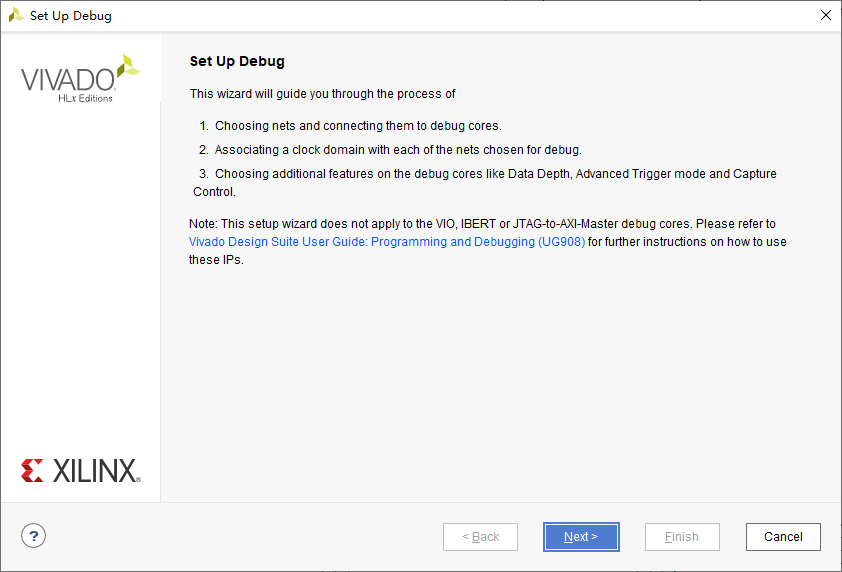

  鼠标选中Netlist窗口pl_pl_bram_i-->blk_mem_gen_0-->U0-->Nets下的addrb、doutb和enb，然后点击Nets to Debug窗口的+号添加网络，点击Next。


  在ILA Core Options窗口设置采样深度为4096，点击Next。


  最后点击FInish，原理图如下：


  点击Flow Navigator窗口PROGRAM AND DEBUG下的Generate Bitstream，对设计进行综合、实现并生成Bitstream文件。 最后点击File-->Export-->Export Hadware导出硬件平台文件dual_core_amp_wrapper.xsa。

###### 软件设计
  参考嵌入式开发流程新建Vitis工程，创建main.c文件，输入下面代码，编译、下载、调试。
```C
#include "xil_printf.h"
#include "stdio.h"
#include "pl_bram_rd.h"
#include "xbram.h"

#define PL_BRAM_BASE         XPAR_PL_BRAM_RD_0_S00_AXI_BASEADDR
#define PL_BRAM_START        PL_BRAM_RD_S00_AXI_SLV_REG0_OFFSET
#define PL_BRAM_START_ADDR   PL_BRAM_RD_S00_AXI_SLV_REG1_OFFSET
#define PL_BRAM_LEN          PL_BRAM_RD_S00_AXI_SLV_REG2_OFFSET

#define START_ADDR           (0)
#define BRAM_DATA_BYTE       (4)

char ch_data[1024];
int ch_data_len;

void str_wr_bram(void);
void str_rd_bram(void);

int main(void)
{
  while(1)
  {
    printf("Please enter data to read and write BRAM\r\n");
    scanf("%1024s", ch_data);
    ch_data_len = strlen(ch_data);
    str_wr_bram();
    str_rd_bram();
  }
}

void str_wr_bram(void)
{
  int i = 0, wr_cnt = 0;
  for(i = BRAM_DATA_BYTE * START_ADDR; i < BRAM_DATA_BYTE * (START_ADDR + ch_data_len); i += BRAM_DATA_BYTE)
  {
    XBram_WriteReg(XPAR_BRAM_0_BASEADDR, i, ch_data[wr_cnt]);
    wr_cnt++;
  }
  PL_BRAM_RD_mWriteReg(PL_BRAM_BASE, PL_BRAM_LEN, BRAM_DATA_BYTE * ch_data_len);
  PL_BRAM_RD_mWriteReg(PL_BRAM_BASE, PL_BRAM_START_ADDR, BRAM_DATA_BYTE * START_ADDR);
  PL_BRAM_RD_mWriteReg(PL_BRAM_BASE, PL_BRAM_START, 1);
  PL_BRAM_RD_mWriteReg(PL_BRAM_BASE, PL_BRAM_START, 0);
}

void str_rd_bram(void)
{
  int i = 0, read_data = 0;
  for(i = BRAM_DATA_BYTE * START_ADDR; i < BRAM_DATA_BYTE * (START_ADDR + ch_data_len); i += BRAM_DATA_BYTE)
  {
    read_data = XBram_ReadReg(XPAR_BRAM_0_BASEADDR, i);
    printf("BRAM address is %d\t, Read data is %c\n", i / BRAM_DATA_BYTE, read_data);
  }
}
```

  返回Vivado，点击Flow Navigator窗口PROGRAM AND DEBUG下的Open Hardware Manager-->Open Target-->Auto Connect打开ILA观察波形的界面，设置触发条件。点击Trigger Setup窗口下的+号，选择enb信号，点击OK，将Value设置为R。


  点击工具栏的Run trigger for this ILA core按钮，等待触发。


  在串口输入数据（例如123）后按回车，串口打印信息如下，说明PS写入BRAM和从BRAM读出的数据一致。
```shell
Please enter data to read and write BRAM
BRAM address is 0       , Read data is 1
BRAM address is 1       , Read data is 2
BRAM address is 2       , Read data is 3
```

  此时ILA逻辑分析仪界面已经显示触发信号的波形，右键doutb选择Radix-->ASCII，显示数据与串口一致。


##### AXI
###### 硬件设计
  参考嵌入式开发流程新建Vivado工程，名称为axi4_ddr_rw，添加ZYNQ Processing System，配置DDR3、UART。由于使用PL使用AXI HP接口读写PS的DDR，因此添加HP Slave AXI Interface-->S AXI GP0 interface，移除AXI Non Secure Enablement-->GP Master AXI  Interface-->M AXI GP0 interface，点击OK。


  点击Tool-->Create and Package New IP创建自定义AXI HP Master IP核PL_DDR3_TEST，最后一步选择Edit IP，点击Finish完成。弹出新的工程，无需修改直接关闭，回到axi4_ddr_rw工程。


  添加自定义的IP核PL_DDR3_TEST，双击打开配置参数如下：


  添加Utility Vector Logic核，双击打开配置为非门，位宽为1。


  点击Run Block Automation，然后点击Run Connection Automation，在弹出的对话框中勾选All Automation。手动连接Utility Vecotr Logic，并依此为op1[0:0]、m00_axi_txn_done和m00_axi_error添加外部端口key_init、compare_done和error_flag，设计框图如下：


  此时，Block Design设计完成，在Diagram空白处右键选择Validate Design验证设计，成功无误后按Ctrl+S保存。然后在Source窗口右键点击axi4_ddr_rw.bd，依此执行Generate Output Products和Create HDL Wrapper。
  点击Flow Navigator窗口RTL ANALYSIS下的Open Elaborated Design，在弹出的对话框中点击OK。点击右上角的Default Layout选择I/O Planning打开IO分配页面，在下方的I/O Ports窗口对PL端口进行管脚分配，完成后按Ctrl+S保存为axi4_ddr_rw.xdc。


  点击Flow Navigator窗口PROGRAM AND DEBUG下的Generate Bitstream，对设计进行综合、实现并生成Bitstream文件。
  点击菜单File-->Export-->Export Hardware，勾选Include bitstream，生成硬件平台文件axi4_ddr_rw_wrapper.xsa。

###### 软件设计
  参考嵌入式开发流程新建Vitis工程，新建main.c文件，输入下面代码，编译、下载、调试。
```C
#include "stdio.h"
#include "xil_cache.h"
#include "xil_printf.h"
#include "xil_io.h"

int main(void)
{
  int i;
  char c;
  Xil_DCacheDisable();
  xil_printf("AXI4 PL DDR TEST!\r\n");
  while(1)
  {
    scanf("%c", &c);
    if('c' == c)
    {
      printf("start\r\n");
      for(i = 0; i < 4096; i += 4)
      {
        xil_printf("%d is %d\r\n", i, (int)Xil_In32(0x10000000 + i));
      }
    }
  }
}
```

##### DMA
  ZYNQ提供了两种DMA，一种是集成在PS中的硬核DMA——DMAC（通过CPU执行DMA指令编程，支持多达8个通道），另一种是PL中使用的软核DMA——AXI DMA IP核。DMAC通过AXI_GP接口与PL连接，最大位宽32位，最高速率600MB/s，不占用PL资源。为了获得更高的传输速率，可以在PL中添加AXI DMA IP核，利用AXI_HP（1200MB/s，只能访问OCM和DDR）、AXI_ACP（1200MB/s）或AXI_GP（600MB/s）接口传输数据。
  AXI DMA用到了三种总线，AXI4-Lite用来配置寄存器，AXI4 Memory Map（包含Read和Write两个接口）用来与内存交互，AXI4 Stream用来对外设进行读写。AXI_MM2S（Memory Map to Stream，读）和AXI_S2MM（Stream to Memory Map，写）是存储器端映射的AXI4-Stream总线，提供对DDR3的访问。
  AXI DMA提供以下三种模式：
|模式|说明|
|---|---|
|Direct Register DMA（Simple DMA）|用于在MM2S和S2MM通道上执行简单的DMA传输，允许应用程序在DMA和Device之间定义单个事务，包括DMA到Device和Device到DMA两个通道，必须设置缓冲区地址和长度以启动那个相应通道的传输。|
|Scatter/Gather（SGDMA）|允许在单个DMA事务中将数据传输到多个存储区域或从多个存储区域传输数据，允许应用程序在内存中定义事务列表，硬件将在应用程序没有进一步干预的情况下处理这些事务，用户可以通过轮询或者中断来检查事务是否完成。SGDMA允许将数据包分解为一个或多个事务，例如以太网IP数据包由14字节包头和若干个数据包组成，可以分别保存在不同的内存区域，而不是将数据包组成连续的内存块，应用程序使用不同的BD（Buffer Descriptor）分别指向各个内存即可。|
|Cyclic DMA||

###### 硬件设计
  参考嵌入式开发流程新建Vivado工程，名称为axi_dma_loop，添加ZYNQ Processing System，配置DDR3、UART，修改Clock Configuration-->PL Fabric Clocks下的FCLK_CLK0频率为100M，勾选PS-PL Configuration-->HP Slave AXI Interface下的S AXI HP0 interface和Interrupts-->Fabric Interrupts-->PL-PS Interrupt Ports下的IRQ_F2P[15:0]，点击OK。
  添加AXI Direct Memory Access IP核，双击打开配置参数，取消勾选Enable Scatter Gather Engine启用Direct Register模式，点击OK。


|选项|说明|
|---|---|
|Enable Scatter Gather Engine|选中可启用Scatter Gather模式，取消可启用Direct Register模式，使Scatter/Gather Engine额所有输出端口都绑定为零，所有输入端口都保持打开状态|
|Enable Micro DMA|生成高度优化的DMA，资源数量较少，用于传输极少量数据的应用程序。|
|Width of Buffer Length Register|指定控制字段缓冲区长度的有效位数和在Scatter/Gather描述符中传输的Status字段的字节数（2^Width），对于多通道模式设置为23。|
|Address Width|指定地址空间的宽度，可以设置为32~64之间的值。|
|Enable Read Channel|开启AXI DMA的读通道MM2S<br></br>Memory Map Data Width：AXI MM2S存储映射读取数据总线的位宽，可选32、64、128、256、512或1024。<br></br>Stream Data Width：AXI MM2S AXI4-Stream数据总线位宽，必须小于等于Memory Data Width，可选8、16、32、64、128、512或1024。<br></br>Max Burst Size：指定MM2S的AXI4-Memory Map侧的突发周期最大值，可选2、4、8、16、32、64、128或256。<br></br>Allow Unaligned Transfer：选中启用数据重新排列引擎（Data Realignment Engine，DRE），允许在MM2S存储映射数据路径上数据重新对齐到8位的字节水平，可以从任何缓冲区地址字节偏移开始读取数据，且读取数据被对齐，使第一个字节读取是AXI4-Stream上的第一个有效字节输出。|
|Enable Write Channel|开启AXI DMA的写通道S2MM，参考读通道MM2S|

  添加AXI4-Stream Data FIFO IP核，参数保持默认。
  参加Concat IP核，用于将2个独立的中断信号mm2s_introut和s2mm_introut合并在一起接入到ZYNQ的中断信号IRQ_F2P[0:0]上。
  依次点击Run Connection Automation和Run Block Automation，在弹出的对话框中勾选All Automation。手动连接Concat和AXI4-Stream Data FIFO，设计框图如下：


  在Diagram空白处右键选择Validate Design验证设计，成功无误后按Ctrl+S保存。然后在Source窗口右键点击axi_dma_loop.bd，依此执行Generate Output Products和Create HDL Wrapper。
  点击Flow Navigator窗口PROGRAM AND DEBUG下的Generate Bitstream，对设计进行综合、实现并生成Bitstream文件。
  点击菜单File-->Export-->Export Hardware，勾选Include bitstream，生成硬件平台文件axi_dma_loop_wrapper.xsa。

###### 软件设计
  创建Vitis工程，新建main.c，输入下面代码，编译、下载、调试。
```C
#include "xparameters.h"
#include "xil_exception.h"
#include "xscugic.h"
#include "xaxidma.h"

#define DMA_DEV_ID                       XPAR_AXIDMA_0_DEVICE_ID
#define RX_INTR_ID                       XPAR_FABRIC_AXIDMA_0_S2MM_INTROUT_VEC_ID
#define TX_INTR_ID                       XPAR_FABRIC_AXIDMA_0_MM2S_INTROUT_VEC_ID
#define INTC_DEVICE_ID                   XPAR_SCUGIC_SINGLE_DEVICE_ID
#define DDR_BASE_ADDR                    XPAR_PS7_DDR_0_S_AXI_BASEADDR
#define MEM_BASE_ADDR                    (DDR_BASE_ADDR + 0x1000000)
#define TX_BUFFER_BASE                   (MEM_BASE_ADDR + 0x00100000)
#define RX_BUFFER_BASE                   (MEM_BASE_ADDR + 0x00300000)
#define RESET_TIMEOUT_COUNTER            (10000)
#define TEST_START_VALUE                 (0x0)
#define MAX_PKT_LEN                      (0x100)

static int check_data(int length, u8 start_value);
static void tx_intr_handler(void *callback);
static void rx_intr_handler(void *callback);
static int setup_intr_system(XScuGic *int_ins_ptr, XAxiDma *axidma_ptr, u16 tx_intr_id, u16 rx_intr_id);
static void disable_intr_system(XScuGic *int_ins_ptr, u16 tx_intr_id, u16 rx_intr_id);

static XAxiDma axidma;
static XScuGic intc;
volatile int tx_done;
volatile int rx_done;
volatile int error;

int main(void)
{
  int i;
  u8 value;
  u8 *tx_buffer_ptr;
  u8 *rx_buffer_ptr;
  XAxiDma_Config *config;
  tx_buffer_ptr = (u8 *)TX_BUFFER_BASE;
  rx_buffer_ptr = (u8 *)RX_BUFFER_BASE;
  xil_printf("\r\n--- Entering main() ---\r\n");
  config = XAxiDma_LookupConfig(DMA_DEV_ID);
  if(!config)
  {
    xil_printf("No config found for %d\r\n", DMA_DEV_ID);
    return XST_FAILURE;
  }
  if(XST_SUCCESS != XAxiDma_CfgInitialize(&axidma, config))
  {
    xil_printf("Initialization failed!\r\n");
    return XST_FAILURE;
  }
  if(XAxiDma_HasSg(&axidma))
  {
    xil_printf("Device configured as SG mode\r\n");
    return XST_FAILURE;
  }
  setup_intr_system(&intc, &axidma, TX_INTR_ID, RX_INTR_ID);
  tx_done = 0;
  rx_done = 0;
  error = 0;
  value = TEST_START_VALUE;
  for(i = 0; i < MAX_PKT_LEN; i++)
  {
    tx_buffer_ptr[i] = value;
    value = (value + 1) & 0xFF;
  }
  Xil_DCacheFlushRange((UINTPTR)tx_buffer_ptr, MAX_PKT_LEN);
  if(XST_SUCCESS != XAxiDma_SimpleTransfer(&axidma, (UINTPTR)tx_buffer_ptr, MAX_PKT_LEN, XAXIDMA_DMA_TO_DEVICE))
  {
    return XST_FAILURE;
  }
  if(XST_SUCCESS != XAxiDma_SimpleTransfer(&axidma, (UINTPTR)rx_buffer_ptr, MAX_PKT_LEN, XAXIDMA_DEVICE_TO_DMA))
  {
    return XST_FAILURE;
  }
  Xil_DCacheFlushRange((UINTPTR)rx_buffer_ptr, MAX_PKT_LEN);
  while(!tx_done && !rx_done && !error);
  if(error)
  {
    xil_printf("Failed test transmit %s done, receive %s done\r\n", tx_done ? "" : "not", rx_done ? "" : "not");
    goto Done;
  }
  if(XST_SUCCESS != check_data(MAX_PKT_LEN, TEST_START_VALUE))
  {
    xil_printf("Data check failed!\r\n");
    goto Done;
  }
  xil_printf("Successfully ran AXI DMA Loop\r\n");
  disable_intr_system(&intc, TX_INTR_ID, RX_INTR_ID);
Done:
  xil_printf("--- Exiting main() ---\r\n");
  return XST_SUCCESS;
}

static int check_data(int length, u8 start_value)
{
  u8 value;
  u8 *rx_packet;
  int i;
  value = start_value;
  rx_packet = (u8 *)RX_BUFFER_BASE;
  for(i = 0; i < length; i++)
  {
    if(rx_packet[i] != value)
    {
      xil_printf("Data error %d: %x%x\r\n", i, rx_packet[i], value);
      return XST_FAILURE;
    }
    value = (value + 1) & 0xFF;
  }
  return XST_SUCCESS;
}

static void tx_intr_handler(void *callback)
{
  int timeout;
  u32 irq_status;
  XAxiDma *axidma_inst = (XAxiDma *)callback;
  irq_status = XAxiDma_IntrGetIrq(axidma_inst, XAXIDMA_DMA_TO_DEVICE);
  XAxiDma_IntrAckIrq(axidma_inst, irq_status, XAXIDMA_DMA_TO_DEVICE);
  if(irq_status & XAXIDMA_IRQ_ERROR_MASK)
  {
    error = 1;
    XAxiDma_Reset(axidma_inst);
    timeout = RESET_TIMEOUT_COUNTER;
    while(timeout)
    {
      if(XAxiDma_ResetIsDone(axidma_inst))
      {
        break;
      }
      timeout--;
    }
    return;
  }
  if(irq_status & XAXIDMA_IRQ_IOC_MASK)
  {
    tx_done = 1;
  }
}

static void rx_intr_handler(void *callback)
{
  int timeout;
  u32 irq_status;
  XAxiDma *axidma_inst = (XAxiDma *)callback;
  irq_status = XAxiDma_IntrGetIrq(axidma_inst, XAXIDMA_DEVICE_TO_DMA);
  XAxiDma_IntrAckIrq(axidma_inst, irq_status, XAXIDMA_DEVICE_TO_DMA);
  if(irq_status & XAXIDMA_IRQ_ERROR_MASK)
  {
    error = 1;
    XAxiDma_Reset(axidma_inst);
    timeout = RESET_TIMEOUT_COUNTER;
    while(timeout)
    {
      if(XAxiDma_ResetIsDone(axidma_inst))
      {
        break;
      }
      timeout--;
    }
    return;
  }
  if(irq_status & XAXIDMA_IRQ_IOC_MASK)
  {
    rx_done = 1;
  }
}

static int setup_intr_system(XScuGic *int_ins_ptr, XAxiDma *axidma_ptr, u16 tx_intr_id, u16 rx_intr_id)
{
  XScuGic_Config *intc_config;
  intc_config = XScuGic_LookupConfig(INTC_DEVICE_ID);
  if(XST_SUCCESS != XScuGic_CfgInitialize(int_ins_ptr, intc_config, intc_config->CpuBaseAddress))
  {
    return XST_FAILURE;
  }
  XScuGic_SetPriorityTriggerType(int_ins_ptr, tx_intr_id, 0xA0, 0x3);
  XScuGic_SetPriorityTriggerType(int_ins_ptr, rx_intr_id, 0xA0, 0x3);
  XScuGic_Connect(int_ins_ptr, tx_intr_id, (Xil_InterruptHandler)tx_intr_handler, axidma_ptr);
  XScuGic_Connect(int_ins_ptr, rx_intr_id, (Xil_InterruptHandler)rx_intr_handler, axidma_ptr);
  XScuGic_Enable(int_ins_ptr, tx_intr_id);
  XScuGic_Enable(int_ins_ptr, rx_intr_id);
  Xil_ExceptionInit();
  Xil_ExceptionRegisterHandler(XIL_EXCEPTION_ID_INT, (Xil_ExceptionHandler)XScuGic_InterruptHandler, (void *)int_ins_ptr);
  Xil_ExceptionEnable();
  XAxiDma_IntrEnable(&axidma, XAXIDMA_IRQ_ALL_MASK, XAXIDMA_DMA_TO_DEVICE);
  XAxiDma_IntrEnable(&axidma, XAXIDMA_IRQ_ALL_MASK, XAXIDMA_DEVICE_TO_DMA);
  return XST_SUCCESS;
}

static void disable_intr_system(XScuGic *int_ins_ptr, u16 tx_intr_id, u16 rx_intr_id)
{
  XScuGic_Disconnect(int_ins_ptr, tx_intr_id);
  XScuGic_Disconnect(int_ins_ptr, rx_intr_id);
}
```

##### VDMA
  AXI VDMA（AXI Video Direct Memory Access）是Xilinx提供的IP核，用于将AXI Stream格式的数据流和Memory Map格式转换，提供从AXI4域到AXI4-Stream域的视频读/写传输功能，从而实现系统内存（主要指DDR3）和基于AXI4-Stream的目标适配IP之间的高速数据移动。


  AXI4-Lite可以对寄存器进行编程，可以动态配置VDMA功能。之后控制/状态逻辑块会为DataMover生成适当的命令，以在AXI4主接口上启动写入和读取命令。可配置的异步Line Buffer用于将像素数据写入AXI4-Mermory Map接口或在AXI4-Stream接口之前临时保存像素数据。
  和AXI DMA相比，AXI VDMA为存储器或AXI4-Stream类目标外设提供高带宽存取、帧缓存的缓冲机制和同步锁相（GenLock）等功能，主要针对视频类数据的高速传输。
  VDMA支持四种同步锁相模式：同步锁相主模式（GenLock Master）、同步锁相从模式（GenLock Slave）、动态同步锁相主模式（Dynamic GenLock Master）和动态同步锁相从模式（Dynamic GenLock Slave）。有一个写通道（S2MM）和一个读通道（MM2S），每一个都可以选择以上四种同步模式。

* GenLock Master
  当某通道配置为GenLock Master时，该通道不会跳过或重复任一帧缓存区域，按帧缓存顺序读出数据。配置为GenLock Slave的通道应当紧跟GenLock Master通道变化，但有一定的延迟，延迟大小在寄存器（\*frmdly_stride[28:24]）中配置。

* GenLock Slave
  当某通道配置为GenLock Slave时，该通道会通过跳过或重复一些帧缓存区域的方式，尝试与GenLock Master通道同步。

* Dynamic GenLock Master
  当某通道配置为Dynamic GenLock Master时，该通道会跳过Dynamic GenLock Slave通道正在操作的帧缓存，通过跳过或者重复一些帧缓存区域的方式来完成。例如有三个帧缓存0、1、2，如果没有检测到slave通道访问的帧缓存，则循环访问0、1、2；如果slave通道长时间访问帧缓存1，则master会循环访问2和3。

* Dynamic GenLock Slave
  当某通道配置为Dynamic GenLock Slave时，该通道会操作Dynamic GenLock Master通道上一周期操作的帧。

  以下是GenLock Master & Slave和Dynamic GenLock Master & Slave示意图（s2mm_frame_reg是写通道访问的帧缓存；s2mm_fsync是写通道帧同步信号，下降沿表示VDMA开始进行写操作；mm2s_frame_ref是读通道访问的帧缓存；mm2s_fsync是读通道帧同步信号，下降沿表示VDMA开始进行读操作）。


  如果想要避开读通道和写通道同时访问一些帧缓存，VDMA必须配置成动态同步锁相模式，且帧缓存数量要大于等于3。

###### PS通过VDMA驱动LCD
  VDMA IP核本身不产生RGB LCD接口时序，ZYNQ提供了AXI4-Stream to Video Out IP核用来将VDMA输出的AXI4-Stream数据流转换成视频协议的数据流（包括并行数据、视频同步信号等），另外还有一个Video Timing Controller（VTC） IP核为AXI4-Stream接口和视频输出接口提供一个桥，用于控制视频输出的时序参数。


  数据流：图像数据来源有两种：一种是由PS端产生图像数据写入DDR3中，VDMA通过AXI Smartconnect IP核与S_AXI_HP端口连接，从而高速访问DDR3；另一种是从sd卡读取图像数据。VDMA将读取的图像数据传输给AXI4-Stream to Video Out IP核，在VTC IP核的控制下，转换成视频协议数据流并传给RGB2LCD IP核。
  控制流：PS通过M_AXI_GP接口与AXI-Interconnect连接，从而控制PL端的外设。通过AXI GPIO IP核获取LCD屏ID，配置VDMA IP核的帧缓存大小、读通道等，配置VTC IP核输出的时序参数，并通过AXI dynclk IP核动态配置LCD时钟。

* 硬件设计
  参考嵌入式开发流程新建Vivado工程，名称为vdma_lcd，添加ZYNQ Processing System，配置DDR3、UART和SD。
  此外，还需要使用S_AXI_HP0_Interface和PL到PS的中断，配置如下：


  点击+号图标，搜索vdma，添加AXI Video Direct Memory Access IP核，双击打开，配置如下：


|接口|说明|
|---|---|
|S_AXI_LITE|AXI_Lite接口，PS通过这个接口配置VDMA寄存器|
|s_axi_lite_aclk|AXI VDMA AXI_Lite接口时钟|
|M_AXI_MM2S|读通道存储器端映射的AXI4接口，提供对存储器（DDR3）的访问|
|m_axi_mm2s_aclk|AXI VDMA MM2S时钟|
|M_AXIS_MM2S|读通道AXI-Stream端映射的AXI4接口，用于输出到外设|
|m_axis_mm2s_aclk|AXI VDMA MM2S AXIS时钟|
|mm2s_introut|读通道中断输出信号|

  点击+号图标，搜索timing，添加Video Timing Controller IP核，双击打开，配置如下：


|接口|说明|
|---|---|
|ctrl|PS通过该接口配置VTC寄存器|
|clk|Video核时钟|
|gen_clken|Video Timing Generator时钟使能信号，高有效|
|vtiming_out|Video时序输出接口|

  点击+号图标，搜索video out，添加AXI4-Stream to Video Out IP核，双击打开，配置如下：


|接口|说明|
|---|---|
|video_in|AXI4-Stream接口输入数据流|
|vtiming_in|Video时序输入接口|
|vid_io_out|Video数据流输出接口|
|vtg_ce|VTC时钟使能信号|

  将例程的ip_repo目录拷贝到自己的工程目录，点击Flow Navigator-->PROJECT MANAGER下的Settings打开设置界面，点击Project Settings-->IP-->Repository打开添加IP仓库界面，点击+号并选择刚刚的ip_repo文件夹，点击Select弹出已添加的IP核，点击OK发现IP Repositories下已经有了新增的目录，点击OK完成。


  点击+号图标，搜索lcd，添加自定义的rgb to lcd IP核，双击打开，配置如下：

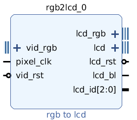

  点击+号图标，搜索dyn，添加自定义的Dynamic Clock Generator IP核，双击打开，配置如下：


  点击+号图标，搜索gpio，添加AXI GPIO IP核，双击打开，配置如下：


  先参考下图手动连接一部分线：


  点击上方的Run Block Automation，勾选processing_system7_0，点击OK将ZYNQ7 PS的DDR和FIXED_IO端口引出。


  点击上方的Run Connection Automation，勾选All Automation，点击OK开始自动连线。完成后，系统会自动生成两个AXI Interconnect模块：ps7_0_axi_periph（用于桥接ZYNQ PS的M_AXI_GP0总线和外部低速外设的AXI_LITE总线）和axi_mem_intercon（用于连接ZYNQ PS的HP0接口和VDMA的M_AXI_MM2S总线）。另外，系统还自动生成一个Processor System Reset模块：rst_ps7_0_100M（用于复位AXI_Lite总线上的外设）。


  Vivado自动连线后，有部分信号需要手动连接。


  最后引出rgb2lcd的输出引脚lcd_rgb、lcd和lcd_bl。


  此时，Block Design设计完成，在Diagram空白处右键选择Validate Design验证设计，成功无误后按Ctrl+S保存。然后在Source窗口右键点击vdma_lcd.bd，依此执行Generate Output Products和Create HDL Wrapper。
  创建约束文件vmda_lcd.xdc，输入以下引脚约束：

```verilog
#----------------------LCD 接口---------------------------
set_property -dict {PACKAGE_PIN Y18 IOSTANDARD LVCMOS33} [get_ports {lcd_rgb_tri_io[0]}]
set_property -dict {PACKAGE_PIN Y19 IOSTANDARD LVCMOS33} [get_ports {lcd_rgb_tri_io[1]}]
set_property -dict {PACKAGE_PIN W20 IOSTANDARD LVCMOS33} [get_ports {lcd_rgb_tri_io[2]}]
set_property -dict {PACKAGE_PIN V20 IOSTANDARD LVCMOS33} [get_ports {lcd_rgb_tri_io[3]}]
set_property -dict {PACKAGE_PIN U14 IOSTANDARD LVCMOS33} [get_ports {lcd_rgb_tri_io[4]}]
set_property -dict {PACKAGE_PIN U15 IOSTANDARD LVCMOS33} [get_ports {lcd_rgb_tri_io[5]}]
set_property -dict {PACKAGE_PIN T20 IOSTANDARD LVCMOS33} [get_ports {lcd_rgb_tri_io[6]}]
set_property -dict {PACKAGE_PIN U20 IOSTANDARD LVCMOS33} [get_ports {lcd_rgb_tri_io[7]}]
set_property -dict {PACKAGE_PIN W14 IOSTANDARD LVCMOS33} [get_ports {lcd_rgb_tri_io[8]}]
set_property -dict {PACKAGE_PIN Y14 IOSTANDARD LVCMOS33} [get_ports {lcd_rgb_tri_io[9]}]
set_property -dict {PACKAGE_PIN N15 IOSTANDARD LVCMOS33} [get_ports {lcd_rgb_tri_io[10]}]
set_property -dict {PACKAGE_PIN N16 IOSTANDARD LVCMOS33} [get_ports {lcd_rgb_tri_io[11]}]
set_property -dict {PACKAGE_PIN V16 IOSTANDARD LVCMOS33} [get_ports {lcd_rgb_tri_io[12]}]
set_property -dict {PACKAGE_PIN W16 IOSTANDARD LVCMOS33} [get_ports {lcd_rgb_tri_io[13]}]
set_property -dict {PACKAGE_PIN W18 IOSTANDARD LVCMOS33} [get_ports {lcd_rgb_tri_io[14]}]
set_property -dict {PACKAGE_PIN W19 IOSTANDARD LVCMOS33} [get_ports {lcd_rgb_tri_io[15]}]
set_property -dict {PACKAGE_PIN T10 IOSTANDARD LVCMOS33} [get_ports {lcd_rgb_tri_io[16]}]
set_property -dict {PACKAGE_PIN T11 IOSTANDARD LVCMOS33} [get_ports {lcd_rgb_tri_io[17]}]
set_property -dict {PACKAGE_PIN P14 IOSTANDARD LVCMOS33} [get_ports {lcd_rgb_tri_io[18]}]
set_property -dict {PACKAGE_PIN R14 IOSTANDARD LVCMOS33} [get_ports {lcd_rgb_tri_io[19]}]
set_property -dict {PACKAGE_PIN V13 IOSTANDARD LVCMOS33} [get_ports {lcd_rgb_tri_io[20]}]
set_property -dict {PACKAGE_PIN U13 IOSTANDARD LVCMOS33} [get_ports {lcd_rgb_tri_io[21]}]
set_property -dict {PACKAGE_PIN G15 IOSTANDARD LVCMOS33} [get_ports {lcd_rgb_tri_io[22]}]
set_property -dict {PACKAGE_PIN H15 IOSTANDARD LVCMOS33} [get_ports {lcd_rgb_tri_io[23]}]
set_property -dict {PACKAGE_PIN U17 IOSTANDARD LVCMOS33} [get_ports lcd_hs]
set_property -dict {PACKAGE_PIN P20 IOSTANDARD LVCMOS33} [get_ports lcd_vs]
set_property -dict {PACKAGE_PIN N20 IOSTANDARD LVCMOS33} [get_ports lcd_de]
set_property -dict {PACKAGE_PIN Y16 IOSTANDARD LVCMOS33} [get_ports lcd_bl]
set_property -dict {PACKAGE_PIN T16 IOSTANDARD LVCMOS33} [get_ports lcd_clk]
```

  最后点击Flow Navigator窗口PROGRAM AND DEBUG下的Generate Bitstream，对设计进行综合、实现并生成Bitstream文件。然后点击菜单File-->Export-->Export Hardware，勾选Include bitstream，生成硬件平台文件vdma_lcd_wrapper.xsa。

* 软件设计
  参考嵌入式开发流程新建Vitis工程，名称为vdma_lcd。
  拷贝例程中display_ctrl、dynclk、vdma_api三个文件夹到自己工程的src目录下，新建mian.c并输入如下代码，编译，下载，调试。

```C

#include <stdio.h>
#include <stdlib.h>
#include <string.h>
#include "xil_types.h"
#include "xil_cache.h"
#include "xparameters.h"
#include "xgpio.h"
#include "xaxivdma.h"
#include "xaxivdma_i.h"
#include "display_ctrl/display_ctrl.h"
#include "vdma_api/vdma_api.h"
#include "ff.h"
#include "sleep.h"

//宏定义
#define BYTES_PIXEL        3                          //像素字节数，RGB888占3个字节
#define DYNCLK_BASEADDR    XPAR_AXI_DYNCLK_0_BASEADDR //动态时钟基地址
#define VDMA_ID            XPAR_AXIVDMA_0_DEVICE_ID   //VDMA器件ID
#define DISP_VTC_ID        XPAR_VTC_0_DEVICE_ID       //VTC器件ID
#define AXI_GPIO_0_ID      XPAR_AXI_GPIO_0_DEVICE_ID  //PL端  AXI GPIO 0(lcd_id)器件ID
#define AXI_GPIO_0_CHANEL  1                          //PL按键使用AXI GPIO(lcd_id)通道1

//函数声明
void colorbar(u8 *frame, u32 width, u32 height, u32 stride);
void load_sd_bmp(u8 *frame);

//全局变量
XAxiVdma     vdma;
DisplayCtrl  dispCtrl;
XGpio        axi_gpio_inst;   //PL端 AXI GPIO 驱动实例
VideoMode    vd_mode;
//frame buffer的起始地址
unsigned int const frame_buffer_addr = (XPAR_PS7_DDR_0_S_AXI_BASEADDR + 0x1000000);
unsigned int lcd_id=0;        //LCD ID

int main(void)
{
  //获取LCD的ID
  XGpio_Initialize(&axi_gpio_inst,AXI_GPIO_0_ID);
  lcd_id = LTDC_PanelID_Read(&axi_gpio_inst,AXI_GPIO_0_CHANEL);
  xil_printf("LCD ID: %x\r\n",lcd_id);

  //根据获取的LCD的ID号来进行video参数的选择
  switch(lcd_id){
    case 0x4342 : vd_mode = VMODE_480x272; break;  //4.3寸屏,480*272分辨率
    case 0x4384 : vd_mode = VMODE_800x480; break;  //4.3寸屏,800*480分辨率
    case 0x7084 : vd_mode = VMODE_800x480; break;  //7寸屏,800*480分辨率
    case 0x7016 : vd_mode = VMODE_1024x600; break; //7寸屏,1024*600分辨率
    case 0x1018 : vd_mode = VMODE_1280x800; break; //10.1寸屏,1280*800分辨率
    default : vd_mode = VMODE_800x480; break;
  }

  //配置VDMA
  run_vdma_frame_buffer(&vdma, VDMA_ID, vd_mode.width, vd_mode.height,
              frame_buffer_addr,0, 0,ONLY_READ);

    //初始化Display controller
  DisplayInitialize(&dispCtrl, DISP_VTC_ID, DYNCLK_BASEADDR);
    //设置VideoMode
  DisplaySetMode(&dispCtrl, &vd_mode);
  DisplayStart(&dispCtrl);

  while(1)
  {
    //写彩条
    colorbar((u8*)frame_buffer_addr, vd_mode.width,
        vd_mode.height, vd_mode.width*BYTES_PIXEL);
    sleep(1);

    //读取SD卡图片并显示
    load_sd_bmp((u8*)frame_buffer_addr);
    sleep(1);
  }

    return 0;
}

//写彩条函数（彩虹色）
void colorbar(u8 *frame, u32 width, u32 height, u32 stride)
{
  u32 color_edge;
  u32 x_pos, y_pos;
  u32 y_stride = 0;
  u8 rgb_r, rgb_b, rgb_g;

  color_edge = width * BYTES_PIXEL / 7;
  for (y_pos = 0; y_pos < height; y_pos++) {
    for (x_pos = 0; x_pos < (width * BYTES_PIXEL); x_pos += BYTES_PIXEL) {
      if (x_pos < color_edge) {                                           //红色
        rgb_r = 0xFF;
        rgb_g = 0;
        rgb_b = 0;
      } else if ((x_pos >= color_edge) && (x_pos < color_edge * 2)) {     //橙色
        rgb_r = 0xFF;
        rgb_g = 0x7F;
        rgb_b = 0;
      } else if ((x_pos >= color_edge * 2) && (x_pos < color_edge * 3)) { //黄色
        rgb_r = 0xFF;
        rgb_g = 0xFF;
        rgb_b = 0;
      } else if ((x_pos >= color_edge * 3) && (x_pos < color_edge * 4)) { //绿色
        rgb_r = 0;
        rgb_g = 0xFF;
        rgb_b = 0;
      } else if ((x_pos >= color_edge * 4) && (x_pos < color_edge * 5)) { //青色
        rgb_r = 0;
        rgb_g = 0xFF;
        rgb_b = 0xFF;
      } else if ((x_pos >= color_edge * 5) && (x_pos < color_edge * 6)) { //蓝色
        rgb_r = 0;
        rgb_g = 0;
        rgb_b = 0xFF;
      } else if ((x_pos >= color_edge * 6) && (x_pos < color_edge * 7)) { //紫色
        rgb_r = 0x8B;
        rgb_g = 0;
        rgb_b = 0xFF;
      }
      frame[x_pos + y_stride + 0] = rgb_b;
      frame[x_pos + y_stride + 1] = rgb_g;
      frame[x_pos + y_stride + 2] = rgb_r;
    }
    y_stride += stride;
  }
  Xil_DCacheFlush();     //刷新Cache，数据更新至DDR3中
  xil_printf("show color bar\r\n");
}

//从SD卡中读取BMP图片
void load_sd_bmp(u8 *frame)
{
  static   FATFS fatfs;
  FIL   fil;
  u8    bmp_head[54];
  UINT   *bmp_width,*bmp_height,*bmp_size;
  UINT   br;
  int   i;

  //挂载文件系统
  f_mount(&fatfs,"",1);

  //打开文件
  f_open(&fil,"fengjing.bmp",FA_READ);

  //移动文件读写指针到文件开头
  f_lseek(&fil,0);

  //读取BMP文件头
  f_read(&fil,bmp_head,54,&br);
  xil_printf("fengjing.bmp head: \n\r");
  for(i=0;i<54;i++)
    xil_printf(" %x",bmp_head[i]);

  //打印BMP图片分辨率和大小
  bmp_width  = (UINT *)(bmp_head + 0x12);
  bmp_height = (UINT *)(bmp_head + 0x16);
  bmp_size   = (UINT *)(bmp_head + 0x22);
  xil_printf("\n width = %d, height = %d, size = %d bytes \n\r",
      *bmp_width,*bmp_height,*bmp_size);

  //读出图片，写入DDR
  for(i=*bmp_height-1;i>=0;i--){
    f_read(&fil,frame+i*(*bmp_width)*3,(*bmp_width)*3,&br);
  }

  //关闭文件
  f_close(&fil);

  Xil_DCacheFlush();     //刷新Cache，数据更新至DDR3中
  xil_printf("show bmp\n\r");
}
```

###### PS通过VDMA驱动HDMI
* 硬件设计
  在上一实验基础上修改，删除AXI GPIO和rgb2lcd并新增DVI_Transmitter IP核，手动连好线，设计框图如下：


  为了支持HDMI 1080P分辨率，需要修改AXI Stream格式数据流和Memory Map合适数据流的时钟频率为150MHz。双击ZYNQ7 Processing System，在Clock Configuration-->PL Fabric Clocks勾选FCLK_CLK1并设置频率为150M，点击OK完成后发现多了一个FCLK_CLK1端口。


  选中FCLK_CLK0连线，按Delete键删除，然后删除ps7_0_axi_periph、axi_mem_intercon和rst_ps7_0_100M IP核。


  手动连接FCLK_CLK1，如下：


  带年纪Run Connection Automation，勾选All Automation，点击OK。完成后系统会重新生成ps7_0_axi_periph、axi_mem_intercon和rst_ps7_0_100M IP核，设计框图如下：
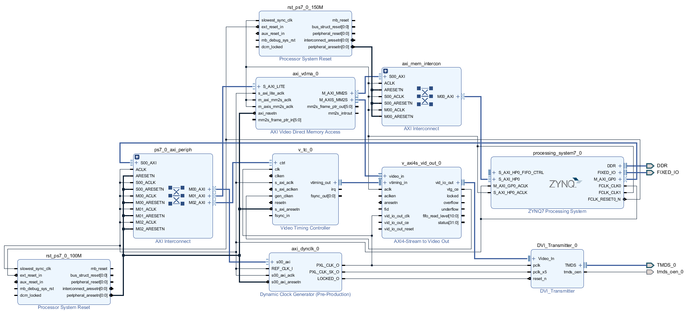

  在Diagram空白处右键选择Validate Design验证设计，成功无误后按Ctrl+S保存。然后在Source窗口右键点击vdma_lcd.bd，依此执行Generate Output Products和Create HDL Wrapper。
  修改约束文件，添加如下引脚约束：
```verilog
set_property -dict {PACKAGE_PIN G17 IOSTANDARD LVCMOS33} [get_ports tmds_oen_0]
set_property PACKAGE_PIN L16 [get_ports {TMDS_0_tmds_data_p[2]}]
set_property PACKAGE_PIN M14 [get_ports {TMDS_0_tmds_data_p[1]}]
set_property PACKAGE_PIN K19 [get_ports {TMDS_0_tmds_data_p[0]}]
set_property PACKAGE_PIN L14 [get_ports TMDS_0_tmds_clk_p]
```

  点击Flow Navigator窗口PROGRAM AND DEBUG下的Generate Bitstream，对设计进行综合、实现并生成Bitstream文件。
  点击菜单File-->Export-->Export Hardware，勾选Include bitstream，生成硬件平台文件hdmi_wrapper.xsa。

* 软件设计
  打开Vitis工程，更新平台项目，修改display_ctrl.c/h和main.c，删除AXI GPIO相关代码，编译、下载调试。

##### FreeRTOS

##### LwIP
  PS拥有两个千兆以太网控制器（GEM），实现了标准10/100/1000Mb/s以太网MAC，使用MDIO接口管理PHY芯片，通过MIO连接到PS端的PHY芯片时使用GMII接口，通过EMIO连接到PL端的PHY芯片时使用RGMII接口。

###### 硬件设计
  参考嵌入式开发流程新建Vivado工程，名称为lwip，添加ZYNQ Processing System，配置DDR3、UART和ENET，移除PL部分接口，点击OK完成。


  点击Run Block Automation，然后在Diagram空白处右键选择Validate Design验证设计，成功无误后按Ctrl+S保存。然后在Source窗口右键点击lwip.bd，依此执行Generate Output Products和Create HDL Wrapper。
  点击菜单File-->Export-->Export Hardware，勾选Include bitstream，生成硬件平台文件lwip_wrapper.xsa。

###### 软件设计
  打开Vitis，首先创建平台项目lwip_bsp，双击platform.spr打开Board Support Package界面，单击选中standalone on ps7_cortexa9_0-->Board Support Package，然后点击右侧Modify BSP Settings按钮打开Board Support Package Settings窗口。点击Overview，勾选lwip211，然后点击Overview-->standalone-->lwip211配置LwIP库，使能DHCP，点击OK完成，编译。


  接着创建应用项目lwip_app，最后选择模板lwIP Echo Server，点击Finish完成。在src文件夹下可以看到很多源文件，删除无关的文件，打开main.c查看代码，可以手动修改IP地址。


  编译、下载、调试，使用TCP客户端向开发板发送信息，开发板将原封不动发送回去。

##### 自定义IP核
  IP核的接口（Interface）一个或多个端口（Ports）组成，不同类型的信号需要不同的接口。
  在主页Tasks下点击Manage IP-->New IP Location或菜单栏File-->IP-->New Location，在弹出的窗口点击Next，设置工程路径，其他先不管。


  点击FInish完成，打开工程管理界面。


  点击菜单栏Tools-->Create and Package New IP打开创建的封装IP向导，点击Next。接下来可以选择封装IP或者创建一个带AXI4接口的IP核。


###### 封装IP
  新建一个DVI_TX文件夹，然后新建两个子文件夹：ip（存放封装的IP核）和if（存放自定义的接口），在ip文件夹下新建src文件夹，并拷贝FPGA_Design/hdmi_colorbar/hdmi_colorbar.srcs/sources/new下的源文件（asyn_rst_syn.v、div_encoder.v、dvi_transmitter_top.v和serializer_10_to1.v）。
  选择Package a specified directory，点击Next；设置源文件路径为ip，点击Next；点击Next，最后点击FInish完成，自动创建一个新的Vivado工程。


  在Sources窗口可以看到需要封装的IP核源文件，右键dvi_transmitter_top选择Set as Top手动设置为顶层文件（左侧显示品字图标）。
  在Package IP窗口的Identification页面设置厂商（Vendor）、IP核名称（Name）、IP核显示名称和描述信息等。


  在Compatibility页面设置IP核兼容性，使用Family下的+号或-号增加或删除器件。


  点击File Groups，点击上方的Merge changes from File Groups Wizard更新源文件。


  点击Customization Parameters，点击上方的Merge changes from Customization Parameters Wizard。由于最开始错误地识别了顶层模块，此时会提示错误，点击OK。由于模块没有定义parameter变量，因此页面没有识别到任何变量。


  在Ports and Interfaces页面设置IP核的端口和接口。


  由于最开始错误地识别了顶层模块，多出了reset和paralell_clk，右键选择Remove Interface移除，此时左侧红色感叹号变成黄色。另外工具错误地将tmds_clk_n和tmds_clk_p识别成了两个时钟接口，需要移除，此时左侧黄色感叹号也消失了。


  右键pclk选择Add Bus Interface，弹出Add Interface窗口，点击General页面Interface Definition右侧...按钮，搜索clock，选中Signal下的clock_ctrl，点击OK。


  设置接口名称为pclk，模式为slave，表示输入信号。


  在Port Mapping页面，对IP核的逻辑端口与物理端口进行映射，选中左侧逻辑端口CLK和右侧物理端口pclk，然后点击Map Ports按钮，下方显示已经映射的端口。点击OK为pclk添加时钟接口，使用同样的方法为pclk_x5添加时钟接口。


  接下来为video_din、video_hsync、video_vsync和video_de添加视频接口。


  接下来添加自定义的TMDS接口，点击菜单栏Tools-->Create Interface Definition，设置厂商（Vendor）、接口名称（Name）和位置（if文件夹）等，点击OK。


  接下来自动打开TMDS接口配置界面，点击Ports下的+号，添加端口tmds_clk_p，定义如下，点击OK完成。使用同样的方法添加端口tmds_clk_n。


  然后添加端口tmds_data_p，定义如下（注意位宽为3，类型为Data），使用同样的方法添加端口tmds_data_n。


  最终的端口定义如下，点击下方Save按钮保存，可以看到在if文件夹下多了TMDS.xml和TMDS_rtl.xml两个接口定义文件。
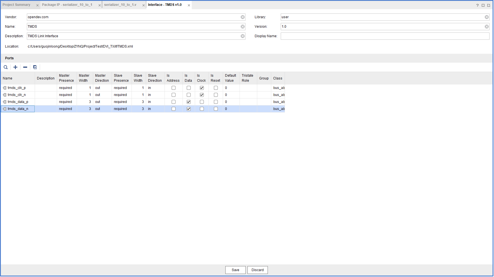

  回到Package IP窗口，为tmds_clk_p、tmds_clk_n、tmds_data_p和tmds_data_n添加端口。

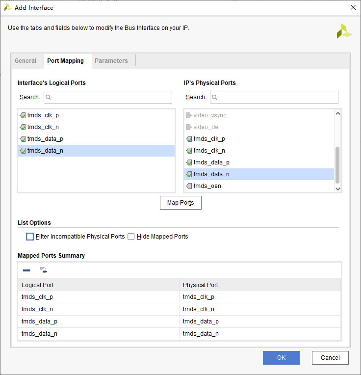

  右键reset_n选择Edit Interface，在Parameter页面为接口添加变量，点击OK。


  最终的接口定义如下：


  可以在Customization GUI查看IP核封装后的符号，包括五个接口和一个端口。
  最后在Review and Package页面查看IP核的名称、描述和目录等信息，点击上方的IP has been modified，然后点击Package IP封装IP核。成功后弹出对话框，提示IP核保存位置，点击Yes关闭当前工程。


  打开IP核所在位置，在xgui文件夹下可以看到两个tcl文件，其中一个是刚刚生成的，另一个是最开始错误识别了顶层模块生成的，删除。使用自己封装的IP核替换HDMI实验的文件，测试显示是否正常。

###### 创建一个带AXI4接口的IP核
  选择Ceate a new AXI4 peripheral，点击Next。设置IP核名称、版本号、显示名、描述和路径，点击Next。


  设置AXI接口，修改名称为S0_AXI，其他保持默认，点击Next。


  在最后弹出的窗口中选择Add IP to the repository，点击Finish完成。
  在IP Catalog窗口中右键User Repository-->AXI Peripheral下新建的breath_led_ip_v1.0，选择Edit in IP Packager，在弹出的窗口点击OK，此时会打开一个新工程。
  双击Sources-->Design Sources下的breath_led_ip_v1_0.v，编辑代码。完成后，点击Flow Navigator窗口SYNTHESIS下的Run Synthesis编译。
  双击Sources-->Design Sources-->IP-XACT下的component.xml，打开Package IP窗口。
  点击Identification-->Categories的+号可以修改IP核的分类，这里默认为AXI_Peripheral。
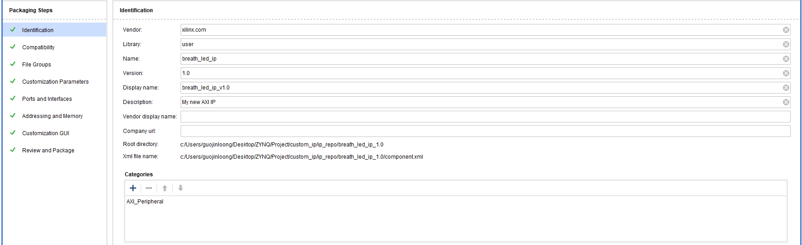

  点击Compatibility-->Family下的+号，选择Add Family Explicitly，修改IP核支持的器件，选择zynq(Zynq-7000)，Life-cycle为Pre-Production。


  点击File Groups，点击上方的Merge changes from File Groups Wizard，完成后可以在Advanced-->Verilog Synthesis下看到三个模块。


  点击Customization Parameters，点击上方的Merge changes from Customization Parameters Wizard，完成后多了Hidden Parameters一栏，可以看到程序自定义的参数START_FREQ_STEP。


  右键该参数，选择Edit Parameter，在弹出的窗口勾选Visible in Customization GUI（显示在GUI参数界面），Format改为long，勾选Specify Range设置参数范围为整数1~1000，默认值为100，点击OK。可以发现Hidden Parameters一栏消失，START_FREQ_STEP参数移到了其他参数的下面。


  点击Customization GUI，可以拖动Layout-->Window-->Page 0下的参数来调整在GUI显示的位置。


  点击Review and Package，点击上方的IP has been modified，然后点击Re-Package IP。在弹出的对话框点Yes，关闭工程。

* 硬件设计
  新建Vivado工程user_led，点击菜单栏Tools-->Settings，点击IP-->Repository，然后点击+号添加自定义的IP核。
  添加ZYNQ Processing System和自定义的IP核，双击打开配置参数。依此点击RunBlock Automation和Run Connection Automation，布线完成后右键选择Regenerate Layout。右键led脚选择Make External，并修改新建的端口名为LED。


  此时，Block Design设计完成，在Diagram空白处右键选择Validate Design验证设计，成功无误后按Ctrl+S保存。然后在Source窗口右键点击user_led.bd，依此执行Generate Output Products和Create HDL Wrapper。
  点击Flow Navigator窗口RTL ANALYSIS下的Open Elaborated Design，在弹出的对话框中点击OK。点击右上角的Default Layout选择I/O Planning打开IO分配页面，在下方的I/O Ports窗口对PL端口进行管脚分配：LED（J16，LVCMOS33）、AXI_GPIO_KEY（J20，LVCMOS33）。按Ctrl+S保存为user_led.xdc。


  点击Flow Navigator窗口PROGRAM AND DEBUG下的Generate Bitstream，对设计进行综合、实现并生成Bitstream文件。
  点击菜单File-->Export-->Export Hardware，勾选Include bitstream，生成硬件平台文件user_led_wrapper.xsa。

* 软件设计
  创建Vitis工程，新建main.c文件，输入如下代码，编译、下载、调试。
```C
#include "stdio.h"
#include "xparameters.h"
#include "xil_printf.h"
#include "breath_led_ip.h"
#include "xil_io.h"
#include "sleep.h"

#define LED_IP_BASEADDR               XPAR_BREATH_LED_IP_0_S0_AXI_BASEADDR
#define LED_IP_REG0                   BREATH_LED_IP_S0_AXI_SLV_REG0_OFFSET
#define LED_IP_REG1                   BREATH_LED_IP_S0_AXI_SLV_REG1_OFFSET

int main()
{
  int freq_flag;
  int led_state;
  xil_printf("LED User IP Test!\r\n");
  while(1)
  {
    if(freq_flag == 0)
    {
      BREATH_LED_IP_mWriteReg(LED_IP_BASEADDR, LED_IP_REG1, 0x800000EF);
      freq_flag = 1;
    }
    else
    {
      BREATH_LED_IP_mWriteReg(LED_IP_BASEADDR, LED_IP_REG1, 0x8000002F);
      freq_flag = 0;
    }
    led_state = BREATH_LED_IP_mReadReg(LED_IP_BASEADDR, LED_IP_REG0);
    if(led_state == 0)
    {
      BREATH_LED_IP_mWriteReg(LED_IP_BASEADDR, LED_IP_REG0, 1);
      xil_printf("LED ON\r\n");
    }
    sleep(5);
    led_state = BREATH_LED_IP_mReadReg(LED_IP_BASEADDR, LED_IP_REG0);
    if(led_state == 1)
    {
      BREATH_LED_IP_mWriteReg(LED_IP_BASEADDR, LED_IP_REG0, 0);
      xil_printf("LED OFF\r\n");
    }
    sleep(1);
  }
}
```

###### 问题
  Vivado2020.1无法生成driver文件夹，原因未知。直接拷贝例程的ip_repo文件夹，但编译不通过，需要修改makefile，然后重新导出xsa并重新建立平台项目。

##### 程序固化
  通过JTAG接口将FPGA配置文件（BIT）和ARM应用程序（ELF）下载到ZYNQ，复位后无法运行。需要把程序存储在非易失性存储器，在上电或者复位时使用引导程序（BootLoader）加载FPGA配置文件和ARM应用程序。
  ZYNQ的启动流程如下：


* BootROM
  BootROM是ZYNQ上的一块非易失性存储器，包含了ZYNQ所支持的配置器件的驱动，而且里面的代码是不可修改的。

* FSBL
  FSBL（First-Stage Boot Loader）可以配置DDR存储器和硬件设计过程中定义的一些外设，需要在加载软件应用及配置PL之前就初始化完毕。
1.初始化PS；
2.如果提供了BIT文件，则配置PL，通过处理器配置访问接口（Processor Configuration Access Port，PCAP）进行，可以对PL进行部分配置或者完全配置。一旦PS启动运行后，可以在任意时刻配置PL，FSBL和应用程序可以清除、配置以及使能PL；
3.加载裸机应用程序到DDR，或者加载SSBL（Second-Stage Boot Loader）；
4.开始执行裸机应用程序，或者SSBL。

  要重建一个ZYNQ启动镜像，需要以下文件：
1.BootROM头文件：控制BootROM设置，比如就地执行、加密、FSBL偏移量、镜像大小等；
2.FSBL；
3.配置PL的BIT文件；
4.运行在PS上的应用程序。

  ZYNQ使用MIO[8:2]引脚配置启动模式，MIO[5:2]定义启动位置，MIO[6]定义是否使用PLL，MIO[8:7]定义上电过程中MIO Bank0和Bank1的电压。


  整个系统的启动过程如下：


  以在gpio的基础上进行程序固化为例，打开Vivado工程。点击左侧Flow Navigator-->IP INTEGRATOR下的Open Block Design，双击打开ZYNQ Processing System，配置QSPI和SD控制器外设并设置Bank0和Bank1电平标准。


  此时，Block Design设计完成，在Diagram空白处右键选择Validate Design验证设计，成功无误后按Ctrl+S保存。然后在Source窗口右键点击gpio.bd，依此执行Generate Output Products和Create HDL Wrapper。
  点击Flow Navigator窗口PROGRAM AND DEBUG下的Generate Bitstream，对设计进行综合、实现并生成Bitstream文件。
  点击菜单File-->Export-->Export Hardware，勾选Include bitstream，生成硬件平台文件gpio_wrapper.xsa。
  打开Vitis工程，右键平台项目选择Update Hardware Specification，在弹出的对话框中选择刚刚生成的gpio_wrapper.xsa，完成后参考SD示例添加xilffs库，编译。
  点击菜单栏File-->New-->Application Project，新建FSBL工程，最后的模板选择Zynq FSBL，点击Finish完成，编译生成FSBL.elf文件。
  点击菜单栏Xilinx-->Create Boot Image，在弹出的窗口中设置输出文件路径，output.bif是Boot Image配置文件，BOOT.bin是启动文件。
  接着点击Boot image partitions右侧的Add按钮，在弹出的窗口添加之前生成的FSBL.elf文件，Partition type选择bootloader，点击OK。


  再次点击Add按钮添加FPGA配置文件system_wrapper.bit，Partition type选择datafile，点击OK。需要注意bit文件必须跟在FSBL后面，顺序不能错。


  再次点击Add按钮添加应用程序文件gpio_app.elf，Partition type选择datafile，点击OK。


  最终配置如下，点击下方的Create Image按钮，完成BIN文件的创建，可以在指定文件夹下看到生成的两个文件：BOOT.bin和output.bif。


* 使用SD卡启动
  将BOOT.bin拷贝到一个FAT32格式的SD根目录，然后插入开发板SD卡槽中，设置BOOT开关从SD卡启动，上电。

* 使用QSPI Flash启动
  将开发板BOOT开关拨到JTAG模式，上电，点击菜单栏Xilinx-->Program Flash，在弹出的对话框指定前面生成的BOOT.bin和FSBL.elf，点击Program。


  完成后配置BOOT开关从QSPI Flash启动，上电。

### Linux开发
  使用PetaLinux设计流程如下：
|步骤|工具/命令|
|---|---|
|Vivado|创建硬件平台，生成XSA文件|
|petalinux-create -t project|创建PetaLinux工程|
|petalinux-create -t COMPONENT|创建用户器件|
|petalinux-config|配置系统层选项|
|petalinux-config --get-hw-description|导入XSA文件并配置PetaLinux工程|
|petalinux-config -c kernel|配置Linux内核|
|petalinux-config -c rootfs|配置Linux根文件系统|
|petalinux-build|编译整个工程|
|petalinux-package --boot|制作BOOT.BIN启动文件|
|petalinux-boot|启动系统以测试|


#### 使用PetaLinux定制系统
##### 使用Vivado创建硬件平台
##### 使用PetaLinux创建系统工程
###### 创建PetaLinux工程
  创建PetaLinux工程zynq_petalinux，-t指定创建类型为project，--template指定平台模板为zynq，-n指定工程名称。
```shell
mkdir zynq_petalinux
petalinux-create -t project --template zynq -n zynq_petalinux
```

###### 配置PetaLinux工程
  首次配置PetaLinux工程时或硬件改动后，需要导入XSA文件，--get-hw_description指定XSA文件所在位置。后面想要重新配置，只需输入petalinux-config即可。
```shell
cd zynq_petalinux
petalinux-config --get-hw-description /home/ubuntu/xilinx/Project/zynq_petalinux/vivado/
```

  弹出PetaLinux工程配置界面。


* Linux Components Selection
  前面两项表示生成FSBL.elf和自动更新ps_init，后面两项用来配置u-boot和kernel来源。


* Auto Config Settings
  设置是否自动配置Device tree、kernel和u-boot。
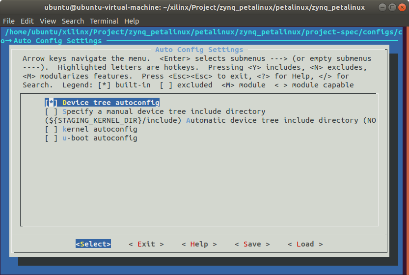

* Subsystem AUTO Hardware Settings
  这里的外设已经根据XSA文件自动配置好了，无需手动配置。Advanced bootable images storage Settings可以配置启动引导镜像和内核镜像的存储媒介，默认为SD卡。


* DTG Settings
  配置设备树。


* FSBL Configuration


* FPGA Manager


* u-boot Configuration
  配置u-boot。


* Image Packaging Configuration
  Root filesystem type设置根文件系统类型，选择INITRAMFS，可以选择SD/eMMC等。Copy final images to tftpboot选项，当在Ubuntu的根文件下创建一个名为tftpboot的文件夹时，工程生成镜像后会自动复制过去，这里去掉选项，否则最后容易失败。


* Firmware Version Configuration
  设置Linux系统的主机名和产品名，默认与PetaLinux工程同名。


* Yocto Settings


```shell
Yocto Settings  --->
  Parallel thread execution  --->
    (8) sets number of bb threads (BB_NUMBER_THREADS) # 设置8线程执行任务
    (8) sets number of parallel make -j (PARALLEL_MAKE) # 编译代码时使用8线程，这两项可以根据CPU情况自行调整，一般为2N，N为CPU核心数。
  Add pre-mirror url   ---> # 设置从内网下载镜像（一般是一些源码或编译好的镜像），从公网拉取往往需要1，2天时间
  [*] Enable Network sstate feeds (NEW)
    Network sstate feeds URL  ---> # 设置从内网下载一些工具等
```

  Network sstate feeds URL和pre-mirror url path默认为：
> http://petalinux.xilinx.com/sswreleases/rel-v${PETALINUX_VER%%.*}/arm/sstate-cache
> http://petalinux.xilinx.com/sswreleases/rel-v${PETALINUX_VER%%.*}/downloads

  代入实际的PetaLinux版本后：
> http://petalinux.xilinx.com/sswreleases/rel-v2020/arm/sstate-cache/
> http://petalinux.xilinx.com/sswreleases/rel-v2020/downloads

  使用wget下载，然后设置Network sstate feeds URL和pre-mirror url path为本地路径。
```shell
wget -c -r -np -nH -R index.html -P /home/ubuntu/xilinx/Project/zynq_petalinux/petalinux/ http://petalinux.xilinx.com/sswreleases/rel-v2020/arm/sstate-cache/
wget -c -r -np -nH -R index.html -P /home/ubuntu/xilinx/Project/zynq_petalinux/petalinux/ http://petalinux.xilinx.com/sswreleases/rel-v2020/downloads
```

  设置完成后保存退出，PetaLinux会根据Auto Config Settings和Subsystem AUTO Hardware Settings来解析硬件描述文件，以获取更新设备树、u-boot配置文件和内核配置文件所需的硬件信息。

###### 配置Linux内核
```shell
petalinux-config -c kernel
```

  等待一段时间后，弹出Linux内核配置界面，保持默认，直接保存退出。


###### 配置Linux根文件系统
```shell
petalinux-config -c rootfs
```

  弹出根文件系统配置界面，PetaLinux RootFS Settings可以用来设置root用户密码，默认为root。


###### 配置设备树文件
  打开project-spec/meta-user/recipes-bsp/device-tree/files/system-user.dtsi文件，添加各种设备配置信息。
```c
/include/ "system-conf.dtsi"

#define GPIO_ACTIVE_HIGH   0
#define GPIO_ACTIVE_LOW    1

/ {
    model = "Navigator Development Board";
    compatible = "alientek,zynq-7020","xlnx,zynq-7000";

    usb_phy0: phy0@e0002000 {
        compatible = "ulpi-phy";
        #phy-cells = <0>;
        reg = <0xe0002000 0x1000>;
        view-port = <0x0170>;
        drv-vbus;
    };

    leds {
        compatible = "gpio-leds";

        gpio-led1 {
            label = "ps_led1";
            gpios = <&gpio0 0 GPIO_ACTIVE_HIGH>;
            default-state = "on";
        };

        gpio-led2 {
            label = "ps_led2";
            gpios = <&gpio0 7 GPIO_ACTIVE_HIGH>;
            linux,default-trigger = "timer";
        };

        gpio-led3 {
            label = "ps_led3";
            gpios = <&gpio0 8 GPIO_ACTIVE_HIGH>;
            default-state = "on";
        };

        gpio-led4 {
            label = "pl_led1";
            gpios = <&gpio0 58 GPIO_ACTIVE_HIGH>;
            linux,default-trigger = "timer";
        };

        gpio-led5 {
            label = "pl_led2";
            gpios = <&gpio0 59 GPIO_ACTIVE_HIGH>;
            default-state = "on";
        };

        gpio-led6 {
            label = "pl_led3";
            gpios = <&gpio0 60 GPIO_ACTIVE_HIGH>;
            default-state = "on";
        };
    };

    keys {
        compatible = "gpio-keys-polled";
        poll-interval = <20>;
        autorepeat;

        touch-key {
            label = "touch_key";
            gpios = <&gpio0 56 GPIO_ACTIVE_HIGH>;
            linux,code = <1>;     // ESC
        };

        gpio-key1 {
            label = "pl_key1";
            gpios = <&gpio0 54 GPIO_ACTIVE_LOW>;
            linux,code = <105>;   // Right
        };

        gpio-key2 {
            label = "pl_key2";
            gpios = <&gpio0 55 GPIO_ACTIVE_LOW>;
            linux,code = <106>;   // Left
        };

        gpio-key3 {
            label = "ps_key1";
            gpios = <&gpio0 11 GPIO_ACTIVE_LOW>;
            linux,code = <103>;   // Up
        };

        gpio-key4 {
            label = "ps_key2";
            gpios = <&gpio0 12 GPIO_ACTIVE_LOW>;
            linux,code = <108>;   // Down
        };
    };

    beep {
        compatible = "gpio-beeper";
        gpios = <&gpio0 57 GPIO_ACTIVE_HIGH>;
    };
};

&i2c1 {
    clock-frequency = <100000>;

    eeprom@50 {
        compatible = "atmel,24c64";
        reg = <0x50>;
        pagesize = <32>;
    };

    rtc@51 {
        compatible = "nxp,pcf8563";
        reg = <0x51>;
    };
};

&usb0 {
    status = "okay";
    dr_mode = "otg";
    usb-phy = <&usb_phy0>;
};
```

###### 编译PetaLinux工程
  编译整个PetaLinux工程，生成设备树DTB文件、FSBL文件、u-boot、kernel、启动脚本和根文件系统映像（images目录下）。
```shell
petalinux-build

INFO: sourcing build tools
[INFO] building project
[INFO] sourcing build environment
[INFO] generating user layers
[INFO] generating workspace directory
INFO: bitbake petalinux-image-minimal
Loading cache: 100% |#######################################################| Time: 0:00:00
Loaded 4229 entries from dependency cache.
Parsing recipes: 100% |#####################################################| Time: 0:00:07
Parsing of 2961 .bb files complete (2959 cached, 2 parsed). 4230 targets, 189 skipped, 0 masked, 0 errors.
NOTE: Resolving any missing task queue dependencies
Initialising tasks: 100% |##################################################| Time: 0:00:03
Checking sstate mirror object availability: 100% |##########################| Time: 0:00:03
Sstate summary: Wanted 928 Found 760 Missed 168 Current 40 (81% match, 82% complete)
NOTE: Executing Tasks
NOTE: Setscene tasks completed
NOTE: linux-xlnx: compiling from external source tree /home/ubuntu/xilinx/Project/zynq_petalinux/petalinux/zynq_petalinux/components/yocto/workspace/sources/linux-xlnx
NOTE: Tasks Summary: Attempted 3509 tasks of which 2621 didn't need to be rerun and all succeeded.
INFO: copy to TFTP-boot directory is not enabled !!
[INFO] successfully built project
```


###### 制作BOOT.BIN启动文件
  ZYNQ的启动文件BOOT.BIN一般包含FSBL文件、bitstream文件和u-boot文件。
```shell
petalinux-package --boot --fsbl ./images/linux/zynq_fsbl.elf --fpga --u-boot --force

INFO: sourcing build tools
INFO: File in BOOT BIN: "/home/ubuntu/xilinx/Project/zynq_petalinux/petalinux/zynq_petalinux/images/linux/zynq_fsbl.elf"
INFO: File in BOOT BIN: "/home/ubuntu/xilinx/Project/zynq_petalinux/petalinux/zynq_petalinux/project-spec/hw-description/zynq_petalinux_wrapper.bit"
INFO: File in BOOT BIN: "/home/ubuntu/xilinx/Project/zynq_petalinux/petalinux/zynq_petalinux/images/linux/u-boot.elf"
INFO: File in BOOT BIN: "/home/ubuntu/xilinx/Project/zynq_petalinux/petalinux/zynq_petalinux/images/linux/system.dtb"
INFO: Generating Zynq binary package BOOT.BIN...


****** Xilinx Bootgen v2020.1
  **** Build date : May 26 2020-14:07:15
    ** Copyright 1986-2020 Xilinx, Inc. All Rights Reserved.


[INFO]   : Bootimage generated successfully

INFO: Binary is ready.
```

###### 制作SD启动卡
  使用fdisk命令为SD卡创建分区，第一个分区为FAT32格式，大小为500M，设为引导分区；剩下的空间作为第二分区，ext4格式。
```shell
sudo fdisk /dev/sdb

Welcome to fdisk (util-linux 2.31.1).
Changes will remain in memory only, until you decide to write them.
Be careful before using the write command.


Command (m for help): p
Disk /dev/sdb: 7.4 GiB, 7969177600 bytes, 15564800 sectors
Units: sectors of 1 * 512 = 512 bytes
Sector size (logical/physical): 512 bytes / 512 bytes
I/O size (minimum/optimal): 512 bytes / 512 bytes
Disklabel type: dos
Disk identifier: 0x98c1973d

Device     Boot  Start      End  Sectors  Size Id Type
/dev/sdb1  *         1   262143   262143  128M  c W95 FAT32 (LBA)
/dev/sdb2       262144 15564799 15302656  7.3G 83 Linux

Command (m for help): d
Partition number (1,2, default 2):

Partition 2 has been deleted.

Command (m for help): d
Selected partition 1
Partition 1 has been deleted.

Command (m for help): n
Partition type
   p   primary (0 primary, 0 extended, 4 free)
   e   extended (container for logical partitions)
Select (default p): p
Partition number (1-4, default 1):
First sector (2048-15564799, default 2048):
Last sector, +sectors or +size{K,M,G,T,P} (2048-15564799, default 15564799): +500M

Created a new partition 1 of type 'Linux' and of size 500 MiB.

Command (m for help): t
Selected partition 1
Hex code (type L to list all codes): c
Changed type of partition 'Linux' to 'W95 FAT32 (LBA)'.

Command (m for help): a
Selected partition 1
The bootable flag on partition 1 is enabled now.

Command (m for help): n
Partition type
   p   primary (1 primary, 0 extended, 3 free)
   e   extended (container for logical partitions)
Select (default p):

Using default response p.
Partition number (2-4, default 2):
First sector (1026048-15564799, default 1026048):
Last sector, +sectors or +size{K,M,G,T,P} (1026048-15564799, default 15564799):

Created a new partition 2 of type 'Linux' and of size 7 GiB.

Command (m for help): p
Disk /dev/sdb: 7.4 GiB, 7969177600 bytes, 15564800 sectors
Units: sectors of 1 * 512 = 512 bytes
Sector size (logical/physical): 512 bytes / 512 bytes
I/O size (minimum/optimal): 512 bytes / 512 bytes
Disklabel type: dos
Disk identifier: 0x98c1973d

Device     Boot   Start      End  Sectors  Size Id Type
/dev/sdb1  *       2048  1026047  1024000  500M  c W95 FAT32 (LBA)
/dev/sdb2       1026048 15564799 14538752    7G 83 Linux

Command (m for help): w
The partition table has been altered.
Calling ioctl() to re-read partition table.
Syncing disks.
```

  然后使用mkfs命令格式化分区，将第一个分区格式化为FAT32分区并命名为BOOT，将第二个分区格式化为ext4分区并命名为rootfs。
```shell
sudo mkfs.vfat -F 32 -n BOOT /dev/sdb1
sudo mkfs.ext4 -L rootfs /dev/sdb2
```

  挂载分区，并拷贝boot.scr、BOOT.BIN和image.ub到BOOT分区。

###### 启动测试
* QEMU模拟启动
  首先使用petalinux-package命令打包预编译镜像。
```shell
petalinux-package --prebuilt --fpga ./project-spec/hw-description/zynq_petalinux_wrapper.bit

INFO: Updating software prebuilt
INFO: Installing software images
INFO: Pre-built directory is updated.
```

  然后使用petalinux-boot命令启动预编译镜像。如果想退出，先按Ctrl+A，再按X即可。
```shell
petalinux-boot --qemu --prebuilt 3
```
* 启动选项：--qemu启动软件仿真，--jtag启动硬件；--u-boot启动u-boot，--kernel启动kernel
* 启动等级1：下载预编译好的FPGA数据流文件，启动FSBL
* 启动等级2：下载预编译好的FPGA数据流文件，启动FSBL，然后启动u-boot
* 启动等级3：下载预编译好的FPGA数据流文件，启动FSBL，然后启动u-boot，最后启动kernel

* SD卡启动
  将开发板设置为SD卡启动，插入SD卡，打开串口终端，上电。查看串口打印信息，启动完成后提示如下信息，输入用户名root和密码root，登陆系统。另外还可以看到开发板上LED1、LED2、PL_LED1和PS_LED1常亮，PL_LED0和PS_LED0闪烁。
```C
PetaLinux 2020.1 zynq_petalinux /dev/ttyPS0

zynq_petalinux login:
```

#### 使用Vitis开发Linux应用
  创建平台项目zynq_petalinux_bsp，操作系统选择linux，点击Finish完成，编译。


  创建应用项目zynq_petalinux_app，模板选择Linux Hello World，点击Finish完成，编译。


  将生成的zynq_petalinux_app.elf拷贝到开发板中（USB、SSH、TFTP、NFS等），通过./zynq_petalinux_app.elf命令运行。

#### 使用Linux显示设备（未编译通过）
  需要配置PetaLinux工程和Linux内核以及设备树来驱动HDMI或LCD的显示。
```shell
petalinux-config
```

  修改Linux内核来源，可以选择remote并设置URL为远程仓库（[Xilinx](https://github.com/Xilinx)提供的[linux-xlnx](https://github.com/Xilinx/linux-xlnx.git)或[正点原子](https://gitee.com/greatdream)提供的[ZYNQ-linux](https://gitee.com/greatdream/linux.git)。也可以将源码下载到本地，然后选择ext-local-src并指定本地路径。另外需要设置内核许可证信息（许可证文件为内核源码根目录下的COPYING，使用md5sum命令计算其md5值），否则编译时进行检查会报错（do_populate_lic: QA Issue: linux-xlnx: The LIC_FILES_CHKSUM does not match），保存并退出。


  修改u-boot来源，可以选择remote并设置URL为远程仓库（[Xilinx](https://github.com/Xilinx)提供的[u-boot-xlnx](https://github.com/Xilinx/u-boot-xlnx)或[正点原子](https://gitee.com/greatdream)提供的[ZYNQ-uboot](https://gitee.com/greatdream/uboot.git)）。也可以将源码下载到本地，然后选择ext-local-src并指定本地路径。另外还需要设置u-boot许可证信息（许可证文件为u-boot源码根目录下的README，使用md5sum命令计算其md5值），否则编译时进行检查会报错，保存并退出。


  修改了内核来源后，需要先清除之前的内核配置，默认的内核源码位置位于/home/ubuntu/xilinx/Project/zynq_petalinux/petalinux/zynq_petalinux/components/yocto/workspace/sources/linux-xlnx，执行以下命令会清空所有源码。
```shell
petalinux-build -c linux-xlnx -x reset
```


  重新配置内核，进入Device Drivers-->Graphics support菜单，选择显示驱动为原子提供的选项。
```shell
petalinux-config -c kernel
```


  在开始编译之前，还需要做一些修改，防止出错：
* 1. 在“/ project-spec/meta-user/recipes-kernel/linux/ linux-xlnx\_%.bbappend”文件内加入KERNEL_VERSION_SANITY_SKIP="1"，避免由于PetaLinux版本和内核版本不匹配而报错。
  注意：若petalinux-config--> DTG 配置保持默认的 template 选项，工具不会自动新建 project-spec/meta-user/recipes-kernel/linux 文件夹，我们需要手动创建 linux-xlnx\_%.bbappend文件并添加如下内容。
```shell
FILESEXTRAPATHS_prepend := "${THISDIR}/files:"

KERNEL_VERSION_SANITY_SKIP = "1"
```

* 2. TODO

  编译工程，生成BOOT.BIN，启动测试。

#### Linux图形界面的使用（使用原子系统测试）
##### 下载带图形界面文件系统
  Linux常用的图形界面有GNOME、KDE、XFCE、LXDE等，后两个定位于轻量级的桌面，可用于硬件性能配置不高的电脑或嵌入式领域（也可以是使用Qt搭建）。
  Linaro公司提供了Linux不同发行版的根文件系统，进入[Linaro releases](https://releases.linaro.org/)。


  进入debian/images目录，可以看到debian不同发行版的根文件系统，名称带arm64的用于ARM 64位架构，带armhf的用于ARM 32位架构，其中alip版本带图形界面。


  进入alip-armhf，可以看到很多历史版本，数字代表发布时间。
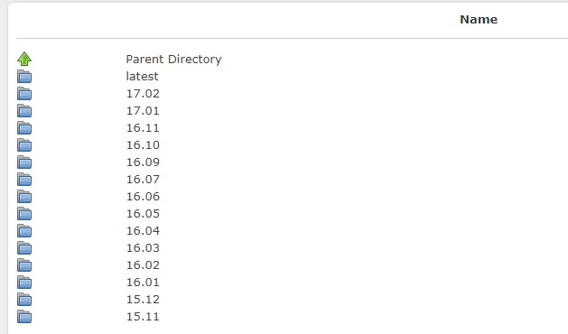

  进入latest，可以看到最近的发布版本，其中，其中linaro-jessie-alip-20161117-32.tar.gz就是根文件系统，可以直接点击下载或者右键复制链接并用工具下载。


  如果想尝试Ubuntu系统可以进入ubuntu/images/gnome/latest/，下载linaro-vivid-gnome-20151215-714.tar.gz（实际测试Ubuntu桌面启动不了）。

##### 重新配置PetaLinux工程
  执行petalinux-config重新配置PetaLinux工程。
```shell
petalinux-config
````

  进入Image Packaging Configuration-->Root filesystem type，选择EXT4(SD/eMMC/SATA/USB)项，保存配置并退出。
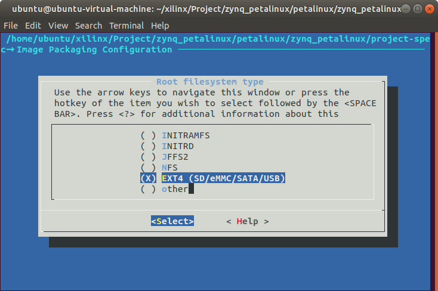

  编译整个PetaLinux工程，并打包生成BOOT.BIN文件。
```shell
petalinux-build
petalinux-package --boot --fsbl ./image/linux/zynq_fsbl.elf --fpga --u-boot --force
````

##### 制作启动SD卡并测试
  拷贝image/linux下的UBOOT.BIN和image.ub到SD卡的boot分区。
  解压根文件系统linaro-jessie-alip-20161117-32.tar.gz到SD卡的rootfs分区。
```shell
sudo tar zxvf linaro-jessie-alip-20161117-32.tar.gz -C /media/ubuntu/rootfs
sync
sync
```

  这时可以看到，rootfs分区多了一个binary文件夹，根文件系统就在里面，需要移动到根目录，然后删除binary文件夹。
```shell
sudo mv binary/* ./
sudo rmdir binary/
```

  卸载SD卡，插到开发板上启动测试。
```shell
sudo umount /dev/sdb*
```

问题
===
* Vitis平台项目编译自定义IP核出错，修改IP核源码中的makefile文件，重新生成xsa文件并更新平台项目。
```C
COMPILER=
ARCHIVER=
CP=cp
COMPILER_FLAGS=
EXTRA_COMPILER_FLAGS=
LIB=libxil.a

RELEASEDIR=../../../lib
INCLUDEDIR=../../../include
INCLUDES=-I./. -I${INCLUDEDIR}

INCLUDEFILES=*.h
LIBSOURCES=*.c
OBJECTS = $(addsuffix .o, $(basename $(wildcard *.c)))
ASSEMBLY_OBJECTS = $(addsuffix .o, $(basename $(wildcard *.S)))

libs:
	echo "<CustomIP_name>..."
	$(COMPILER) $(COMPILER_FLAGS) $(EXTRA_COMPILER_FLAGS) $(INCLUDES) $(LIBSOURCES)
	$(ARCHIVER) -r ${RELEASEDIR}/${LIB} ${OBJECTS} ${ASSEMBLY_OBJECTS}
	make clean

include:
	${CP} $(INCLUDEFILES) $(INCLUDEDIR)

clean:
	rm -rf ${OBJECTS} ${ASSEMBLY_OBJECTS}
```

* 使用git管理仓库
  Vivado工程的.gitignore配置如下：
```GIT
#########################################################################################################
##	This is an example .gitignore file for Vivado, please treat it as an example as
##	it might not be complete. In addition, XAPP 1165 should be followed.
#########################################################################################################
#########
#Exclude all
#########
*
!*/
!.gitignore
###########################################################################
##	VIVADO
###########################################################################
#########
#Source files:
#########
#Do NOT ignore VHDL, Verilog, block diagrams or EDIF files.
!*.vhd
!*.v
!*.bd
!*.edif
#########
#IP files
#########
#.xci: synthesis and implemented not possible - you need to return back to the previous version to generate output products
#.xci + .dcp: implementation possible but not re-synthesis
#*.xci(www.spiritconsortium.org)
!*.xci
#*.dcp(checkpoint files)
!*.dcp
!*.vds
!*.pb
#All bd comments and layout coordinates are stored within .ui
!*.ui
!*.ooc
#########
#System Generator
#########
!*.mdl
!*.slx
!*.bxml
#########
#Simulation logic analyzer
#########
!*.wcfg
!*.coe
#########
#MIG
#########
!*.prj
!*.mem
#########
#Project files
#########
#XPR  +  *.XML ? XPR (Files are merged into a single XPR file for 2014.1 version)
#Do NOT ignore *.xpr files
!*.xpr
#Include *.xml files for 2013.4 or earlier version
!*.xml
#########
#Constraint files
#########
#Do NOT ignore *.xdc files
!*.xdc
#########
#TCL - files
#########
!*.tcl
#########
#Journal - files
#########
!*.jou
#########
#Reports
#########
!*.rpt
!*.txt
!*.vdi
#########
#C-files
#########
!*.c
!*.h
!*.elf
!*.bmm
!*.xmp
```

  PetaLinux工程的.gitignore配置如下：
```GIT
.petalinux
!.petalinux/metadata
build/
images/linux
pre-built/linux
components/plnx-workspace/
components/yocto/
*/*/config.old
*/*/rootfs_config.old
*.o
*.log
*.jou
```

参考
===
* [[Vivado 2020.1]ZYNQ7020折腾之路(一)之荔枝糖Hex入门输出“Hello,World!“](https://blog.csdn.net/qq_36229876/article/details/108054405)
* [Drivers and Makefiles problems in Vitis 2020.2](https://support.xilinx.com/s/question/0D52E00006hpOx5SAE/drivers-and-makefiles-problems-in-vitis-20202?language=en_US)
* [使用Petalinux定制Linux系统](https://www.cnblogs.com/Mike2019/p/14293018.html)
* [ZYNQ #0 petalinux的使用与工程建立](https://blog.csdn.net/sements/article/details/88921275)