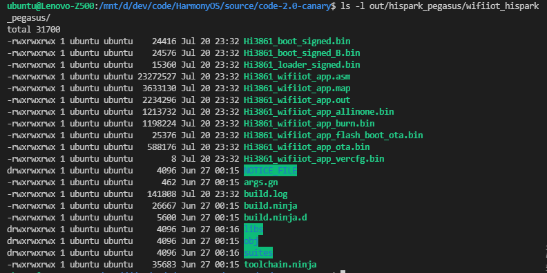

# 1 简介
## 1.1 概述
  DevEco Device Tool为设备开发提供代码编辑、编译、烧录和调试等功能，以VS Code组件的形式安装。
  目前已支持多种类型的开发板，如下：

|厂商|型号|
|--|--|
|海思|Hi3516DV300、Hi3518EV300和Hi3816V100开发板|
|第三方|iMX6ULL、RTL8720、XR872、W800、BL602、Neptune开发板、BearPi-HM Nano开发板等|

## 1.2 源码
  当前的OpenHarmony源代码仅支持在Linux环境下编译。

### 1.2.1 源码获取
  参考[源码获取](https://device.harmonyos.com/cn/docs/start/get-code/oem_sourcecode_guide-0000001050769927)。
#### 1.2.1.1 从代码仓库获取
  参考[从代码仓库获取](https://gitee.com/openharmony/docs/blob/master/zh-cn/device-dev/get-code/%E6%BA%90%E7%A0%81%E8%8E%B7%E5%8F%96.md#section537312010229)。

#### 1.2.1.2 从HPM（包管理器）组件式获取
  参考[从HPM（包管理器）组件式获取](https://gitee.com/openharmony/docs/blob/master/zh-cn/device-dev/get-code/%E6%BA%90%E7%A0%81%E8%8E%B7%E5%8F%96.md#section463013147412)，当前仅支持在Ubuntu环境下使用HPM获取源码。
* 方法一
  执行如下命令查找可用的发行版：

```shell
hpm search -t distribution
```


  下载指定的发行版源码：
```shell
mkdir test && cd test
#按照模板生成bundle.json
hpm init -t dist
#下载@ohos/hispark_pegasus源码到ohos_bundles文件夹安装
hpm install @ohos/hispark_pegasus
```
* 方法二
  登录[HPM](https://hpm.harmonyos.com/#/cn/home)页面，查找合适的发行版并点击查看详情。
  点击直接下载或定制组件（需要登录华为开发者账号），并按照提示完成定制及下载。
  
  这时会得到一个OpenHarmony代码结构文件（demo.zip），解压后内容如下：
  
  其中最关键的是bundle.json，它定义了组件名称、版本号等，内容如下：
```shell{
  "name" : "demo",
  "version" : "1.0.0",
  "license" : "",
  "description" : "",
  "publishAs" : "distribution",
  "ohos" : {
    "os" : "2.0.0",
    "board" : "hi3861",
    "kernel" : "liteos-m"
  },
  "dirs" : { },
  "scripts" : { },
  "envs" : { },
  "base" : {
    "name" : "@ohos/hispark_pegasus",
    "version" : "2.0.0"
  },
  "dependencies" : { },
  "excludes" : [ ]
}
```
  执行如下命令，HPM会根据bundle.json下载需要的组件到ohos_bundles文件夹下，然后解压、安装，部分组件会将源码复制到指定文件夹下：
```shell
hpm install
```

#### 1.2.1.3从镜像站点获取
  参考[从镜像站点获取](https://gitee.com/openharmony/docs/blob/master/zh-cn/device-dev/get-code/%E6%BA%90%E7%A0%81%E8%8E%B7%E5%8F%96.md#section1186691118430)。
  右键复制合适的版本源码站点链接（以2.0 Canary为例），下载并解压到xxx/sources文件夹(xxx为sources所在路径)。

```shell
mkdir sources && cd sources
wget https://repo.huaweicloud.com/harmonyos/os/2.0/code-2.0-canary.tar.gz
tar -zxvf code-2.0-canary.tar.gz
```

### 1.2.2 源码分析
#### 1.2.2.1 源码目录结构
| 目录名       | 描述                                  |
| ------------ | ------------------------------------- |
| applications | 应用程序样例，包括camera等            |
| base         | 基础软件服务子系统集&硬件服务子系统集 |
| build        | 组件化编译、构建和配置脚本            |
| docs         | 说明文档                              |
| domains      | 增强软件服务子系统集                  |
| drivers      | 驱动子系统                            |
| foundation   | 系统基础能力子系统集                  |
| kernel       | 内核子系统                            |
| prebuilts    | 编译器及工具链子系统                  |
| test         | 测试子系统                            |
| third_party  | 开源第三方组件                        |
| utils        | 常用的工具集                          |
| vendor       | 厂商提供的软件                        |
| build.py     | 编译脚本文件                          |

# 2 开发
## 2.1 环境搭建
### 2.1.1 开发环境搭建
#### 2.1.1.1 Windows
  参考[Windows开发环境准备](https://device.harmonyos.com/cn/docs/ide/user-guides/install_windows-0000001050164976)。

#### 2.1.1.2 Linux
  参考[Ubuntu开发环境准备](https://device.harmonyos.com/cn/docs/ide/user-guides/install_ubuntu-0000001072959308)。

### 2.1.2 编译环境搭建
  目前，不管开发环境是在Windows系统还是Linux系统，必须在Linux编译。
#### 2.1.2.1 Linux系统准备
  推荐使用win10自带的Ubuntu子系统，安装方法如下：
  打开“程序和功能“，点击”启用或关闭Windows功能”，启用“适用于Linux的Windows子系统”。

  打开Microsoft Store，搜索"ubuntu"，在搜索结果中选择合适的Ubuntu版本（本文使用Ubuntu 20.04 LTS）并安装。

  安装完成后启动，等待系统初始化完成并设置用户名和密码，然后执行以下命令更新系统。

```shell
sudo apt update
sudo apt upgrade
```

#### 2.1.2.2 开发工具安装
|开发环境|需要安装的工具|备注|
|-------|-----------|----|
|使用Docker时|略|参考[Docker方式获取编译环境](https://device.harmonyos.com/cn/docs/start/get-tools/oem_tool-0000001055701144#section107932281315)|
|使用HPM获取源码时|hpm-cli、llvm、hb||
|使用镜像站点或代码仓库获取源码时|gn、ninja、llvm、hb、gcc_risv32||

* 安装python3.8
```shell
#安装python3.8
sudo apt install python3.8
sudo update-alternatives --install /usr/bin/python python /usr/bin/python3.8 1
sudo update-alternatives --install /usr/bin/python3 python3 /usr/bin/python3.8 1
sudo apt install python3-setuptools python3-pip -y
sudo pip3 install --upgrade pip
```

* 安装hb
```shell
#安装hb
python3 -m pip install --user ohos-build
#配置环境变量
sudo vim ~/.bashrc
#在末尾插入一行
export PATH=$PATH:~/.local/bin
#保存退出，使用source命令或者重启系统使环境变量生效
source ~/.bashrc
```

* 安装hpm-cli
  参考[HPM](https://hpm.harmonyos.com/#/cn/home)帮助文档。
  先安装node.js(12.x或更高)：
```shell
curl -sL https://deb.nodesource.com/setup_12.x | sudo -E bash -
sudo apt install nodejs
nodejs -v
```

  也可以直接下载二进制文件并解压：
```shell
#下载安装linux版本的node.js到xxx/tools文件夹(xxx为tools所在路径)
wget https://nodejs.org/dist/v14.17.1/node-v14.17.1-linux-x64.tar.xz
tar zxvf node-v14.17.1-linux-x64.tar.xz
#配置环境变量
sudo vim ~/.bashrc
#在末尾添加一行
export PATH=$PATH:xxx/tools/node-v14.17.1-linux-x64/bin
#保存退出，使用source命令或者重启系统使环境变量生效
source ~/.bashrc
```

  使用npm命令安装或更新hpm-cli：
```shell
npm install -g @ohos/hpm-cli
npm update -g @ohos/hpm-cli
hmp -V
```

* 安装gn、ninja、llvm编译工具
```shell
#下载编译工具到xxx/tools文件夹(xxx为tools所在路径)
mkdir tools && cd tools
wget https://repo.huaweicloud.com/harmonyos/compiler/gn/1717/linux/gn-linux-x86-1717.tar.gz
wget https://repo.huaweicloud.com/harmonyos/compiler/ninja/1.9.0/linux/ninja.1.9.0.tar
wget https://repo.huaweicloud.com/harmonyos/compiler/clang/10.0.1-62608/linux/llvm.tar.gz
#解压
sudo tar -zxvf gn-linux-x86-1717.tar.gz
sudo tar -xvf ninja.1.9.0.tar
sudo tar -zxvf llvm.tar.gz
#配置环境变量
sudo vim ~/.bashrc
#在末尾插入一行
export PATH=$PATH:xxx/tools:xxx/tools/ninja:xxx/tools/llvm/bin
#保存退出，使用source命令或者重启系统使环境变量立即生效
source ~/.bashrc
```

## 2.2 开发流程
### 2.2.1 创建工程

* 方法一
  DevEco Device Tool创建新工程并从HPM获取源码和工具链（当前仅支持在Ubuntu环境下，Windows下会出错）。
  点击VS Code左侧DevEco图标，打开DevEco Device Tool，进入Home页面，点击New DevEco Project弹出新建工程向导。
  
|选项|说明|
|--|--|
|Name|工程名称|
|Board|选择支持的开发板类型（模板）|
|Bundle|选择基础组件包|
|Location|取消勾选Use default location，设置存储路径。|
  工程创建完成后点击Open按钮打开工程，弹出Do you trust the authors of the files in this folder?提示，选择Yes。
  返回DevEco Device Tool，进入HPM页面，查找相应的解决方案，然后点击Install to project并选择工程名称，下载源码。


* 方法二
  先下载源码，然后使用DevEco Device Tool打开。
  点击VS Code左侧DevEco图标，打开DevEco Device Tool，进入Home页面，点击Open DevEco Project选择源码所在目录，如果提示该工程不是DevEco Device Tool工程，点击Open继续。
  

  设置开发板类型和Framework：

|选项|说明|
|--|--|
|Board|开发板类型|
|Framework|表示源码来源：<br>Ohos-sources：通过开源社区镜像站点或者代码仓库获取，版本1.0.0</br><br>Hb：通过开源社区镜像站点或者代码仓库获取，版本1.0.1或1.1.0</br><br>Hpm：通过HPM命令行获取源码</br>|

### 2.2.2 代码编译
#### 2.2.2.1 设置编译工具链
  使用HPM获取源码时，自动包含了相关的工具链，无需手动设置；
  通过开源社区镜像站点或者代码仓库获取源码时，需要手动在DevEco Device Tool添加（根据开发板类型获取所依赖的编译工具链）。
  点击VS Code左侧DevEco图标，打开DevEco Device Tool，进入Tools页面，查看预置的常用工具链：

  点击Add user component新增工具链，设置工具链名称、版本及位置（工具链[下载](https://device.harmonyos.com/cn/docs/ide/user-guides/tools_management-0000001141455367))。

#### 2.2.2.2 编译源码
##### 2.2.2.2.1 使用DevEco Device Tool编译
  打开工程，点击VS Code左侧DevEco图标，打开DevEco Device Tool，进入Projects页面。点击相应工程右侧的Settings按钮，在开发板配置页设置编译类型build_type为release，点击Save保存。


  点击左上方PROJECT TASKS窗口相应工程下的Build按钮，执行编译。


  完成后会在下方TERMINAL窗口输出SUCCESS提示，编译成功，并在out/hispark_pegasus/wifiiot_hispark_pegasus/目录下生成二进制文件，用于后续的烧录操作。


##### 2.2.2.2.2 命令行编译
  打开Ubuntu子系统或使用ssh命令登录（需要先安装sshd服务），使用cd命令跳转到源代码根目录（Windows下的盘符被映射到/mnt目录下）。
  输入"hb set"命令，输入"."选择代码路径为当前目录，选择产品类型为wifiiot_hispark_pegasus。


  输入"hb build"开始编译，成功后会打印wifiiot_hispark_pegasus build success信息，可在out/hispark_pegasus/wifiiot_hispark_pegasus/查看编译生成的文件。


### 2.2.3 代码烧录

  DevEco Device Tool提供一键烧录功能，支持USB、串口和网口烧录。针对不同的开发板和芯片，支持烧写的系统和烧录方式不同。
|系统类型|处理器类型|内存|说明|
|-------|--------|---|---|
|小型系统（Small System）|ARM Cortex-A|>=1MB|面向应用型处理器，提供标准的图形框架和视频编解码的多媒体能力，如网络摄像机、电子猫眼、路由器、行车记录仪等|
|标准系统（Standard System）|ARM Cortex-A|>=128MB|面向应用型处理器，提供增强的图形能力和交互能力，有完整的应用框架|

* 串口烧录
  打开工程，点击VS Code左侧DevEco图标，打开DevEco Device Tool，进入Projects页面。点击相应工程右侧的Settings按钮，在分区配置页设置待烧录文件信息（默认已经为Hi3861适配好了）。
  

  在开发板配置页设置烧录选项Upload Options，完点击右上角Save保存。
|选项|说明|
|---|---|
|upload_port|串口号，例如COM4|
|upload_protocol|烧录协议，选择burn-serial|
|upload_partitions|待烧录文件，默认选择hi3861_app|


  点击左上方PROJECT TASKS窗口相应工程下的Upload按钮，执行烧录，过程中会提示复位设备，需要按一下RST按钮重启开发板。


  完成后会在下方TERMINAL窗口输出SUCCESS提示，烧录成功。


  点击左下角DevEco:Serial Monitor按钮打开DevEco串口终端。


  再次按RST按钮重启开发板，查看串口打印信息，判断是否烧录成功。


  在DevEco的串口终端中输入下面AT命令，测试Wifi模块是否正常工作。
```shell
AT+STARTSTA                             # 启动STA模式
AT+SCAN                                 # 扫描周边AP
AT+SCANRESULT                           # 显示扫描结果
AT+CONN="SSID",,2,"PASSWORD"            # 连接指定AP，其中SSID/PASSWORD为待连接的热点名称和密码
AT+STASTAT                              # 查看连接结果
AT+DHCP=wlan0,1                         # 通过DHCP向AP请求wlan0的IP地址
AT+IFCFG                                # 查看模组接口IP
AT+PING=X.X.X.X                         # 检查模组与网关的联通性，其中X.X.X.X需替换为实际的网关地址
```

* USB烧录
* 网口烧录

### 2.2.4 代码调试
#### 2.2.4.1 常用调试功能
  DevEco Device Tool支持单步调试、设置断点、查看变量、堆栈、寄存器、内存、反汇编等常用调试功能。
  参考[代码调试](https://device.harmonyos.com/cn/docs/ide/user-guides/debug_overview-0000001050164998)。

#### 2.2.4.2 根据asm文件定位异常
  系统异常退出时会在串口终端打印异常发生时寄存器、内存、调用栈等信息，通过解析异常栈信息可以定位异常位置。
```shell
=======KERNEL PANIC=======

**********syserr info start**********
kernel_ver      : Hi3861V100 R001C00SPC025,2020-09-03 18:10:00
**********Exception Information**********
PC Task Name    : usr_app
PC Task ID      = 2
Cur Task ID     = 2
Task Stack Size = 0x4000
Exception Type  = 0x7
**********reg info**********
mepc         = 0x4a383e
mstatus      = 0x1880
mtval        = 0x4a37ee
mcause       = 0x7
ccause       = 0x7
ra           = 0x4a383a
sp           = 0xeecd0
gp           = 0x11a9c0
tp           = 0xb62d6c1a
t0           = 0x3f4884
t1           = 0x3fad96
t2           = 0xffffffff
s0           = 0x11d000
s1           = 0x11d000
a0           = 0x10
a1           = 0x10
a2           = 0x0
a3           = 0x40008000
a4           = 0xd00a0dff
a5           = 0x4a3000
a6           = 0xa
a7           = 0x3fd60c
s2           = 0x4b0084
s3           = 0x12121212
s4           = 0x11111111
s5           = 0x10101010
s6           = 0x9090909
s7           = 0x8080808
s8           = 0x7070707
s9           = 0x6060606
s10          = 0x5050505
s11          = 0x4040404
t3           = 0x0
t4           = 0x0
t5           = 0x0
t6           = 0x0
**********memory info**********
Pool Addr    = 0xe8480
Pool Size    = 0x30140
Fail Count   = 0x0
Peek Size    = 0x11a5c
Used Size    = 0x11a00
**********task info**********
Name         : usr_app
ID           = 2
Status       = 0x14
Stack Index  = 0x8
Stack Peak   = 0x4e8
Stack Size   = 0x4000
SP           = 0x11a860
Stack        : 0xeade0 to 0xeede0
Real SP      = 0xeecd0
Stack Overflow  = 0
**********track_info**********
current_item:0x3
item_cnt:10
Index   TrackType   TrackID  CurTime  Data1  Data2 
0001 0064 0006 0x2 0x0 0x0
0002 0064 0007 0x2 0x0 0x0
0003 0064 0008 0x2 0x0 0x0
0004 0016 0007 0x0 0x3f1702 0x0
0005 0016 0007 0x1 0x3f5a74 0x0
0006 0064 0003 0x2 0x0 0x0
0007 0065 0003 0x2 0x3f5e36 0x3f78a2
0008 0065 0002 0x2 0x3f5e78 0x3f5e36
0009 0064 0004 0x2 0x0 0x0
0010 0064 0005 0x2 0x0 0x0
**********Call Stack**********
Call Stack 0 -- 4a08dc addr:eed8c
Call Stack 1 -- 4113e0 addr:eedac
Call Stack 2 -- 4113a8 addr:eedbc
Call Stack 3 -- 3f78c0 addr:eedcc
Call Stack 4 -- 3f5e24 addr:eeddc
**********Call Stack end**********
```
  asm文件记录了代码中函数在flash上的符号地址以及反汇编信息，编译时随二进制文件一同生成。
  打开out/hispark_pegasus/wifiiot_hispark_pegasus/Hi3861_wifiiot_app.asm文件，根据Call Stack中的地址搜索对应的函数名、信息，定位异常代码位置。
```shell
  4a08dc:	bf75                j	4a0898 <OHOS_SystemInit+0x84>
  4113e0:	c88e906f          	j	3fa868 <__riscv_restore_0>
  4113a8:	cc0e906f          	j	3fa868 <__riscv_restore_0>
  3f78c0:	4808                lw	a0,16(s0)
003f5e24 <OsTaskExit>:
  3f5e24:	221042ef          	jal	t0,3fa844 <__riscv_save_0>
```

#### 2.2.4.3 Profiling可视化分析
* Profiling功能
  Profiling通过可视化界面展示应用所占系统资源和内存资源信息，可查看的资源曲线和数据如下。
|资源|说明|
|---|---|
|Heap|堆内存：实时统计应用堆内存当前的使用情况和历史峰值情况。|
|Stack|栈内存：统计应用内各任务内存使用情况，通过任务内存的峰值比例（Peak%）合理分配各任务的内存大小。|
|OS Objects|系统资源：统计资源使用情况，如timers、tasks、queues等数量。|
|All in one|实时内存占用情况：统计Heap和Stack的使用情况，实时动态刷新。|

  点击VS Code左侧DevEco图标，打开DevEco Device Tool，进入Profiling页面，点击Live capture按钮。

  设置好串口和波特率，再点击Capture即可显示系统资源和内存资源占用情况。

  点击Stop capturing停止数据采集后，可以将可视化数据到出为Excel或Json格式文件。也可以导入Json文件或同过串口获取的Txt格式应用运行日志，进行可视化分析。

* Profiling代码移植（参考2.2.4 编写业务）
  要想实现Profiling可视化分析功能，需要在应用程序中添加定时查询系统资源信息和内存信息的定时任务，然后DevEco Device Tool通过串口按照约定的格式获取并解析数据，生成相应的曲线图。
  1. 进入用户目录下的.deveco-device-tool\platforms\hisilicon\profiling\src文件夹，拷贝app_demo_sysinfo.c和app_demo_sysinfo.h文件到业务文件夹。
  2. 在业务编译脚本BUILD.gn的sources和include_dirs项中分别添加app_demo_sysinfo.c源文件和app_demo_sysinfo.h的路径（相对于源码根目录）。
  3. 在业务入口函数源文件中包含头文件app_demo_sysinfo.h，并在业务入口函数中调用app_demo_heap_task()。
  4. 编译并烧录到开发板中，参考上一节内容进行操作。

### 2.2.4 编写业务
  创建业务时，需要在./applications/sample/wifi-iot/app路径下新建一个业务文件夹，用于存放业务代码和编译脚本文件。
  打开VS Code文件浏览界面，在./applications/sample/wifi-iot/app下新建业务文件夹my_first_app，在my_first_app下新建业务代码文件hello_world.c和编译脚本文件BUILD.gn，目录结构如下。

> └── applications
>     └── sample
>         └── wifi-iot
>             └── app
>                 │── my_first_app
>                 │  │── hello_world.c
>                 │  └── BUILD.gn
>                 └── BUILD.gn

  在hello_world.c中新建业务接口函数，HelloWorld()并实现业务逻辑，并在代码最下方使用HarmonyOS启动恢复模块接口SYS_RUN()启动业务。
```C
#include <stdio.h>
#include "ohos_init.h"
#include "ohos_types.h"

void HelloWorld(void)
{
  printf("\r\nHello World!\r\n");
}

SYS_RUN(HelloWorld);
```

  编写编译脚本BUILD.gn，将业务构建成静态库。
```C
static_library("my_first_app") {
    sources = [
        "hello_world.c"
    ]
    include_dirs = [
        "//utils/native/lite/include"
    ]
}
```
* static_library中指定业务模块的编译结果，为libmy_first_app.a。
* sources中指定源代码文件，//为代码根目录。
* include_dirs中指定所依赖的头文件路径。

  配置./applications/sample/wifi-iot/app/BUILD.gn文件，在features字段增加my_first_app业务模块索引，格式为"业务模块路径(相对于app) : 业务目标"。
```C

import("//build/lite/config/component/lite_component.gni")

lite_component("app") {
    features = [
        "startup",
        "my_first_app:my_first_app",
    ]
}
```
  第一个my_first_app指向./applications/sample/wifi-iot/app/my_first_app/BUILD.gn，第二个my_first_app指向./applications/sample/wifi-iot/app/my_first_app/BUILD.gn中的static_library("my_first_app")。
  编译、下载并打开串口终端，然后重启并观察是否打印”Hello World!“。

# 3 附录
* [HUAWEI DevEco Device Tool使用指南](https://device.harmonyos.com/cn/docs/ide/user-guides/service_introduction-0000001050166905)
* [HarmonyOS Device快速入门](https://device.harmonyos.com/cn/docs/start/introduce/oem_minitinier_des-0000001105598722)
