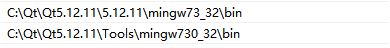
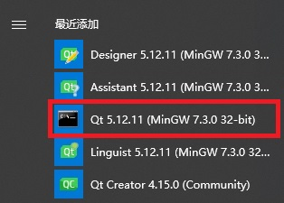
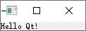
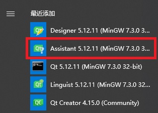
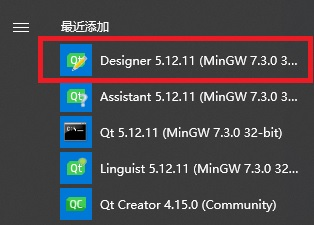
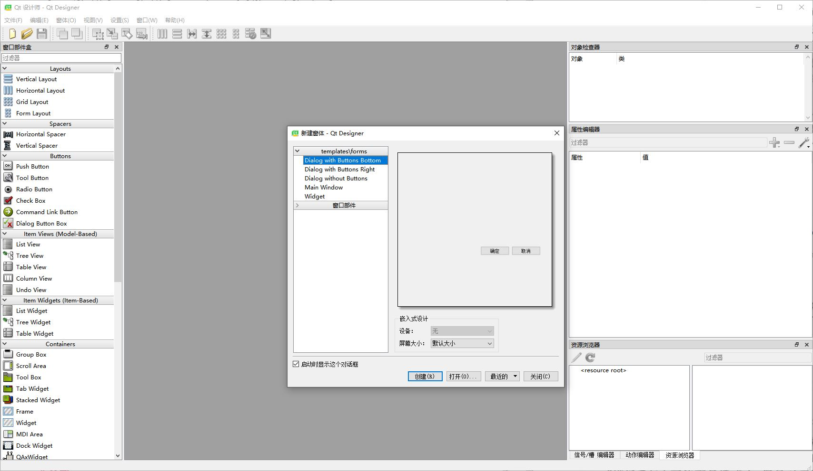

# 概述
  Qt包括开源版本和商业版本，

# 下载和安装
|名称|说明|
|---|---|
|Source SPackages||
|Offline Installers||
|Qt Creator||
|Visual Studio Add-in||
## 下载

## 安装
  不管是在线安装还是离线安装，都需要登陆Qt账号，因此先注册一个Qt账号。
  双击安装程序（qt-opensource-windows-x86-5.12.11.exe），联网并登录Qt账号，选择组件安装。

## 更新组件
  找到Qt安装目录下的MaintenanceTool.exe程序，双击运行，添加、删除或更新组件。

# 开发
## 创建第一个应用
### Qt Widgets
  Qt Widgets库提供了一些UI控件，可以创建经典的桌面风格的用户界面。

### Qt Quik
  Qt Quik库提供了一些类和函数，可以创建时尚、流畅、生动的UI。

[Getting Started with Qt](https://doc.qt.io/qt-6/gettingstarted.html)

## 基础
### 基本结构
  以hello.cpp为例，Qt程序的基本结构如下：
```C++
#include <QApplication>
#include <QLabel>

int main(int argc, char *argv[])
{
  QApplication app(argc, argv);
  QLabel *label = new QLable("<h2><i>Hello<i> "
                             "<font color=red>Qt!</font></h2>");
  label->show();
  return app.exec();
}
```

  对于每个Qt类，都有一个与之同名且大写的头文件，其中包含了对该类的定义，使用之前必须包含其头文件。
  QApplication类用来管理整个应用程序所用到的资源，包含两个参数（argc和argv），支持Qt自己的一些命令行参数。
  窗口部件（Widget，Window gadget缩写）有按钮QButton、标签QLabel、滚动条QSlider、菜单栏QMenuBar、工具栏QToolBar、状态栏QStatusBar、框架QMainWindow、对话框QDialog等，窗口部件也可以包含其他窗口部件，绝大多数应用程序都会使用一个QMainWidnow或QDialog作为窗口，其实任意一个窗口部件都可以作为应用程序的窗口。创建窗口部件的时候，默认都是隐藏的，这就允许我们可以先对其进行设置然后再显示它们，从而避免了闪烁现象。 
  最后程序的控制权传递给Qt，进入事件循环状态，等待事件（event，也称为消息，如用户单击鼠标、按键等）并产生响应。

### 构建
  首先需要设置环境变量，有两种方式：
* 手动添加：右键我的电脑选择属性，点击左侧高级系统设置，在高级标签页点击环境变量，编辑系统变量的PATH，添加Qt和MinGW相关命令所在的路径。


* Windows系统下，已经安装了Qt的开源版和MinGW编译器，在开始菜单中会看到一个命令提示符的快捷键，点击打开，这里已经正确创建了使用Qt所需的全部环境变量。


  打开命令提示符，进入源码目录，输入下面的命令编译并执行：
```shell
qmake -project # 生成一个与平台无关的项目文件hello.pro
qmake hello.pro # 生成一个与平台无关的makefile文件
mingw32-make # 编译，生成可执行程序hello.exe（debug或release文件夹下）
./release/hello.exe
```


  编译过程中如果出现下面的错误，是因为Qt5把大部分桌面部件移到了Qt Widget模块中，即QApplication从原来的<QtGui/QApplication>移到了<QtWidgets/QApplication>。
```shell
hello.cpp:1:10: fatal error: QApplication: No such file or directory
 #include <QApplication>
```

  需要手动修改pro文件，添加下面内容：
```shell
greaterThan(QT_MAJOR_VERSION, 4): QT += widgets
```

  另外，还可以生成VS和Xcode工程。
```shell
qmake -tp vc hello.pro
qmake -spec macx-xcode hello.pro
```

### 信号和槽
  Qt的窗口部件通过发送信号（signal）来表明一个用户动作已经发生了或者是一个状态已经改变了，信号可以与函数（slot，槽）连接，以便在发射信号时自动执行槽函数。
  信号和槽机制是Qt编程的基础，用于将一些互不了解的对象绑定在一起，这种机制本身是在QObject中实现的，可以用于QObject的任何子类中，并不局限于图形用户界面编程。
  槽和普通的C++成员函数几乎是一样的——可以是虚函数；可以被重载；可以是共有的、保护的或者私有的，并且也可以被其他C++成员函数直接调用；它们的参数可以是任意类型。唯一的不同是：槽还可以和信号连接在一起（使用QObject::connect()函数），当发射这个信号的时候，就会自动调用这个槽。
  connect()语句的形式如下，其中sender和receiver是指向QObject的指针，signal和slot是不带参数的函数名，宏SIGNAL()和SLOT()会把它们的参数转换成相应的字符串。
```C++
connect(sender, SIGNAL(signal), receiver, SLOT(slot));
```

  信号和槽的连接由以下几种可能：
#### 一个信号可以连接多个槽
  发射信号的时候，会以不确定的顺序一个接一个地调用这些槽。
```C++
connect(slider, SIGNAL(valueChanged(int)), spinBox, SLOT(setValue(int)));
connect(slider, SIGNAL(valueChanged(int)), this, SLOT(updateStatusBarIndicator(int)));
```

#### 多个信号可以连接同一个槽
  无论发射哪个信号，都会调用这个槽。
```C++
connect(lcd, SIGNAL(overflow()), this, SLOT(handleMathError()));
connect(caculator, SIGNAL(divisionByZero()), this, SLOT(handleMathError()));
```

#### 一个信号可以与另一个信号相连接
  当发射第一个信号时，也会发射第二个信号。
```C++
connect(lineEdit, SIGNAL(textChanged(const QString &)), this, SIGNAL(updateRecord(const QString &)));
```
#### 连接可以被移除
  这种情况较少用到，因为当删除对象时，Qt会自动移除和这个对象有关的所有连接。
```C++
disconnect(lcd, SIGNAL(overflow()), this, SLOT(handleMathError()));
```

  要连接的信号和槽必须保证有相同的参数顺序和类型，如果参数类型不匹配或者信号或槽不存在，在调试模式构建并运行时会发出警告。这里有个例外，当信号的参数比要连接的槽的参数多，那么多余的参数将会被简单地忽略掉。
```C++
connect(ftp, SIGNAL(rawCommandReply(int, const QString &)), this, SLOT(processReply(int, const QString &)));
connect(ftp, SIGNAL(rawCommandReply(int, const QString &)), this, SLOT(checkErrorCode(int)));
```

  以下面的代码为例，当用户单击按钮QPshButton时，该按钮就会发射一个clicked()信号，使用connect函数把按钮clicked()信号与QApplication对象的quit()槽连接起来，这样单击按钮时将会退出程序。
```C++
#include <QApplication>
#include <QPushButton>

int main(int argc, char *argv[])
{
  QApplication app(argc, argv);
  QPushButton *button = new QPushButton("Quit");
  QObject::connect(button, SIGNAL(clicked()), &app, SLOT(quit()));
  button->show();
  return app.exex();
}
```

### 布局
  布局（layout）用来管理窗口中部件的几何形状，布局管理器就是一个能够对其所负责窗口部件的尺寸大小和位置进行设置的对象。Qt有三个主要的布局管理器类：
* QHBoxLayout：在水平方向上排列窗口部件，从左到右。
* QVBoxLayout：在竖直方向上排列窗口部件，从上到下。
* QGridLayout：把各个窗口部件排列在一个网格中。

  以下面的代码为例，程序由QSpinBox、QSlider和QWidget三个窗口部件组成，其中QWidget是应用程序的主窗口，QSpinBox和QSlider显示在QWidget内。换言之，QSpinBox和QSlider是QWidget的子对象，QWidget是QSpinBox和QSlider的父对象，这里QWidget没有父对象，作为程序的顶层窗口。QWidget的构造函数及其所有子类都会带一个参数QWidget \*，用来说明谁是它们的父窗口部件。但程序中创建QSpinBox和QSlider时没有将QWidget传递给他们的构造函数，因为布局系统会自动设置，所以当创建一个需要放进某个布局中的窗口部件时，就没有必要为其显示地指定父对象了。
```C++
#include <QApplication>
#include <QHBoxLayout>
#include <QSpinBox>
#include <QSlider>

int main(int argc, char *argv[])
{
  QApplication app(argc, argv);

  QWidget *window = new QWidget;
  window->setWindowTitle("Enter Your Age");

  QSpinBox *spinBox = new QSpinBox;
  QSlider *slider = new QSlider(Qt::Horizontal);
  spinBox->setRange(0, 130);
  slider->setRange(0, 130);

  QObject::connect(spinBox, SIGNAL(valueChanged(int)), slider, SLOT(setValue(int)));
  QObject::connect(slider, SIGNAL(valueChanged(int)), spinBox, SLOT(setValue(int)));
  spinBox->setValue(35);

  QHBoxLayout *layout = new QHBoxLayout;
  layout->addWidget(spinBox);
  layout->addWidget(slider);
  window->setLayout(layout);

  window->show();

  return app.exec();
}
```

### 帮助文档
  在Qt安装目录C:\Qt\Qt5.12.11\Docs\Qt-5.12.11下，可以找到html格式的参考文档，并且使用任意Web浏览器阅读。也可以使用Qt的帮助浏览器Qt Assistant，可以在开始菜单找到。


  点击打开，显示主页，如下图所示：


  Qt Assistant具有强大的查询和索引功能，使用更加快速和容易。支持以下几种查询方式：
* 目录（翻译成内容不准确）
  如果事先知道要查的是什么类时，直接在目录中查找。

* 索引
  直接输入要查找的类或成员名称（部分或全部），实时显示所有相关的文档。

* 书签
  当浏览某个文档时，可以在该页添加标签，日后随时查看。

* 搜索
  输入要查找的关键字，然后点击搜索按钮，列出所有包含该关键字的文档。

### 对话框
  绝大多数图形用户界面应用程序都带有一个由菜单栏、工具栏构成的主窗口以及若干个对主窗口进行补充的对话框，当然也可以直接创建对话框应用程序。
  基本步骤如下：
1. 创建并初始化子窗口部件
2. 把子窗口部件放到布局中
3. 设置Tab键顺序
4. 建立信号和槽直接的连接
5. 实现对话框中的自定义槽

#### 子类化QDialog
  使用C++手动编写一个查找对话框FindDialog，源代码分别在finddialog.h和finddialog.cpp文件中。
  finddialog.h
```C++
#ifndef FINDDIALOG_H
#define FINDDIALOG_H

#include <QDialog> // 包含QDialog的定义，它是Qt中对话框的基类，从QWidget派生出来。

class QCheckBox; // 一些Qt类的前置声明，告诉C++编译器类的存在，但不提供类的具体定义（通常在各自的头文件中）。没有包含与这几个类相关的头文件，可以使编译过程更快些。
class QLabel;
class QLineEdit;
class QPushButton;

class FindDialog : public QDialog
{
  Q_OBJECT // 对于所有定义了信号和槽的类，在类定义开始时都必须调用该宏！

public:
  FindDialog(QWidget *parent = 0); // 典型的窗口部件类的构造函数定义，parent指定了其父窗口部件，默认值是一个空指针即没有父对象。
  ~FindDialog();

signals: // signals关键字实际上是一个宏，C++预处理器在编译程序找到它之前把它转换成标准C++代码。
  void findNext(const QString &str, Qt::CaseSensitivity cs); // 声明了两个信号，当用户点击Find按钮时，若勾选了向前查询选项，对话框发射findPrevious()信号，否则findNext()。
  void findPrevious(const QString &str, Qt::CaseSensitivity cs); // Qt::CaseSensitivity是一个枚举类型，它有Qt::CaseSensitive和Qt::CaseInsensitive两个取值。

private slots: // 关键字slots就像signals一样也是一个宏，也可以扩展成C++编译程序可以处理的一种结构形式。
  void findClicked(); // 声明了两个槽
  void enableFindButton(const QString &text);

private:
  QLabel *label; // 对于这些私有变量，使用了它们的类前置声明，因为它们都是指针，且没有必要在头文件中访问它们，因而编译程序无需这些类的完整定义。
  QLineEdit *lineEdit;
  QCheckBox *caseCheckBox;
  QCheckBox *backwardCheckBox;
  QPushButton *findButton;;
  QPushButton *closeButton;
};

#endif
```

  finddialog.cpp
```C++
#include <QtWidgets> // <QtWidgets>包含了Qt窗口部件类的定义，不用再单独包含每个类的头文件，但不推荐在头文件中再包含一个这么大的头文件。Qt5中，使用<QtWidgets>取代了Qt4的<QtGUI>。

#include "finddialog.h"

// FindDialog类的构造函数
FindDialog::FindDialog(QWidget *parent)
  : QDialog(parent)
{
  label = new QLabel(tr("Find &what:")); // tr()函数把字符串翻译成其他语言的标记，在每个QObject对象以及包含有Q_OBJECT宏的子类中都有这个函数的声明。尽管并没有立刻翻译成其他语言大打算，但在每一个用户可见的字符串周围使用tr()函数是个不错的好习惯。
  lineEdit = new QLineEdit;
  label->setBuddy(lineEdit); // 设置行编辑器作为标签的伙伴，buddy是一个窗口部件，可以在按下标签的快捷键时接受焦点，当用户按下Alt + W（该标签的快捷键）时，焦点就会一道这个行编辑器上。

  caseCheckBox = new QCheckBox(tr("Match &case"));
  backwardCheckBox = new QCheckBox(tr("Search &backward"));

  findButton = new QPushButton(tr("&Find")); // 在字符串中使用“&”符号（可以控制焦点）来表示快捷键，用户按下Alt + F键来激活Find按钮。
  findButton->setDefault(true); // 让Find按钮成为对话框的默认按钮（当用户按下Enter键时能够按下的按钮）
  findButton->setEnabled(false); // 禁用Find按钮，显示为灰色，不能与用户交互。

  closeButton = new QPushButton(tr("Close"));

  // 由于QObject时FindDialog类的父对象之一，所以可以省略函数前面的QObject::前缀。
  connect(lineEdit, SIGNAL(textChanged(const QString &)), this, SLOT(enableFindButton(const QString &))); // 只要行编辑器的文本发生变化，就调用私有槽enableFindButton(const QString &)。
  connect(findButton, SIGNAL(clicked()), this, SLOT(findClicked())); // 当用户点击Find按钮时，调用私有槽findClicked()。
  connect(closeButton, SIGNAL(clicked()), this, SLOT(close())); // 当用户点击Close按钮时，关闭对话框。close()槽是从QWidget中继承而来，它的默认行为就是把窗口部件从用户的视野中隐藏起来，而无须将其删除。

  // 布局中既可以包含多个窗口部件，也可以包含其他子布局。布局管理器不是窗口部件，它们派生自QLayout，也就是进一步派生自QObject。窗口部件用实线轮廓来表示，布局用点线来表示，很好区分。程序运行时，布局不可见。
  QHBoxLayout *topLeftLayout = new QHBoxLayout;
  topLeftLayout->addWidget(label);
  topLeftLayout->addWidget(lineEdit);

  QVBoxLayout *leftLayout = new QVBoxLayout;
  leftLayout->addLayout(topLeftLayout);
  leftLayout->addWidget(caseCheckBox);
  leftLayout->addWidget(backwardCheckBox);

  QVBoxLayout *rightLayout = new QVBoxLayout;
  rightLayout->addWidget(findButton);
  rightLayout->addWidget(closeButton);
  rightLayout->addStretch(); // 分隔符（或称为伸展器），用来占据Find和Close按钮所余下的空白区域，确保这些按钮完全占用它们所在布局的上部空间。

  QHBoxLayout *mainLayout = new QHBoxLayout;
  mainLayout->addLayout(leftLayout);
  mainLayout->addLayout(rightLayout);
  setLayout(mainLayout); // 将主布局安装在FindDialog中，并由其负责对话框的整个区域。

  setWindowTitle(tr("Find")); // 设置显示在对话框标题栏上的标题。
  setFixedHeight(sizeHint().height()); // QWidget::sizeHint()函数可以返回一个窗口部件所“理想”的尺寸大小。
}

// FindDialog类的析构函数，不是必须的，因为Qt会在删除父对象的时候自动删除其所属的所有子对象（所有子窗口部件和子布局）。
FindDialog::~FindDialog()
{
  // TODO
}

void FindDialog::findClicked()
{
  QString text = lineEdit->text();
  Qt::CaseSensitivity cs = caseCheckBox->isChecked() ? Qt::CaseSensitive : Qt::CaseInsensitive;
  if(backwardCheckBox->isChecked())
  {
    emit findPrevious(text, cs); // emit用来发射信号，是Qt的关键字，会被C++预处理器转换成标准的C++代码。
  }
  else
  {
    emit findNext(text, cs);
  }
}

void FindDialog::enableFindButton(const QString &text)
{
  findButton->setEnabled(!text.isEmpty());
}
```
  Find对话框的布局：


  创建main.cpp来实例化FindDialog类，测试这个自定义的窗口部件类。
```C++
#include <QApplication>

#include "finddialog.h"

int main(int argc, char *argv[])
{
  QApplication app(argc, argv);
  FindDialog *dialog = new FindDialog;
  dialog->show();
  return app.exec();
}
```

  由于FindDialog类包含Q_OBJECT宏，qmake生成的makefile将会自动包含一些运行moc的规则，moc就是指Qt的元对象编译器（meta-object compile）。如果没有使用qmake重新生成makefile文件，并且也没有重新运行moc，链接程序就会提示下面的错误，声明了一些函数却没有实现它们。
```shell
release/finddialog.o:finddialog.cpp:(.text+0x29): undefined reference to `vtable for FindDialog'
release/finddialog.o:finddialog.cpp:(.text+0x30): undefined reference to `vtable for FindDialog'
release/finddialog.o:finddialog.cpp:(.text+0x52): undefined reference to `FindDialog::staticMetaObject'
release/finddialog.o:finddialog.cpp:(.text+0x103): undefined reference to `FindDialog::staticMetaObject'
release/finddialog.o:finddialog.cpp:(.text+0x175): undefined reference to `FindDialog::staticMetaObject'
release/finddialog.o:finddialog.cpp:(.text+0x1e4): undefined reference to `FindDialog::staticMetaObject'
release/finddialog.o:finddialog.cpp:(.text+0x282): undefined reference to `FindDialog::staticMetaObject'
release/finddialog.o:finddialog.cpp:(.text+0x50d): more undefined references to `FindDialog::staticMetaObject' follow
release/finddialog.o:finddialog.cpp:(.text+0x6d2): undefined reference to `vtable for FindDialog'
release/finddialog.o:finddialog.cpp:(.text+0x6d9): undefined reference to `vtable for FindDialog'
release/finddialog.o:finddialog.cpp:(.text+0x708): undefined reference to `vtable for FindDialog'
release/finddialog.o:finddialog.cpp:(.text+0x70f): undefined reference to `vtable for FindDialog'
release/finddialog.o:finddialog.cpp:(.text+0x785): undefined reference to `FindDialog::findPrevious(QString const&, Qt::CaseSensitivity)'
release/finddialog.o:finddialog.cpp:(.text+0x7d2): undefined reference to `FindDialog::findNext(QString const&, Qt::CaseSensitivity)'
collect2.exe: error: ld returned 1 exit status
mingw32-make[1]: *** [Makefile.Release:68: release/new.exe] Error 1
```

  运行程序，依次检验快捷键Alt + W、Alt + C、Alt + B和Alt + F，也可以通过Tab键遍历这些窗口部件，默认的Tab键顺序就是创建窗口部件的顺序，也可以使用get::setTabOrder()函数改变。

##### 元对象系统
  Qt使用元对象系统（meta-object system）机制对C++进行了扩展，提供了两项关键的技术：信号和槽、内省（introspection），内省功能对于实现信号和槽是必须的。
  标准C++没有对Qt的元对象系统所需要的动态元信息提供支持，Qt通过提供一个独立的moc工具，解析Q_OBJECT类的定义并通过C++函数来提供可供使用的信息。由于moc使用纯C++来实现它的所有功能，所以Qt的元对象系统可以在任意C++编译器上工作。
  元对象系统工作机制如下，都是由qmake、moc和QObject自动处理，可以阅读有关QMetaObject类的文档和由moc生成的C++源代码，理解这些实现工作如何进行。
* Q_OBJECT宏声明了在每一个QObject子类中必须实现的一些内省函数：metaObject()、tr()、qt_metacall()以及其他一些函数。
* Qt的moc工具生成了用于有Q_OBJECT声明的所有函数和所有信号的实现。
* 想connect()和disconnect()这样的QObject的成员函数使用这些内省函数来完成它们的工作。

#### Qt Designer
  Qt Designer提供了一种可视化的设计方法，可用于开发应用程序中的所有或部分窗体，并自动生成C++代码。
  在开始菜单中找到Qt Designer。


  点击打开，显示主页，如下图所示。


  提供几种新建窗体的模板，选择Widget，点击创建，可以看到一个“untitled”的空白窗体。
  在左侧的窗口部件盒中分门别类地展示了一些常用的窗口部件，可以直接用鼠标点击并拖动到对话框中。这里需要创建一个标签、一个行编辑器、一个水平分隔符和两个按钮，不需要精确摆放它们的位置，后面会使用布局管理器自动布局，大概如下图所示。


  在右侧的属性编辑器中为每个窗口部件设置属性：
1. 单击标签，确保此时objectName的属性是“label”，设置其text属性为“&Cell Location:”。
2. 单击行编辑器，确保objectName属性是“lineEdit”。
3. 单击左边的按钮，设置objectName为“okButton”，取消勾选enabled项，text属性设置为“OK”，勾选default项。
4. 单击右边的按钮，设置objectName为“cancelButton”，text属性设置为“Cancel”。
5. 点击窗体空白地方，选中窗体本省，设置objectName为“GoToCellDialog”，windowTile属性设置为“Go To Cell”。
6. 点击菜单栏Edit-->Edit Buddies，进入一种允许设置窗口部件伙伴的特殊模式，单击标签并拖到行编辑器，释放鼠标后可以看到标签的内容由“&Cell Location:”变成了“<u>C</u>ell Location:” 。设置伙伴完成后，点击菜单栏Edit-->Edit Widgets离开伙伴设置模式。


  对所有窗口部件进行布局。
1. 按住Ctrl键并选中标签和行编辑器，点击菜单栏Form-->Lay Out Horizontally或快捷键Ctrl + 1。
2. 按住Ctrl键并选中OK按钮和Cancel按钮，点击菜单栏Form-->Lay Out Horizontally或快捷键Ctrl + 1。
3. 点击窗体空白部分，取消所有选择，点击菜单栏Form-->Lay Out Vertically或快捷键Ctrl + 2。
4. 点击Form-->Adjust Size，重新把窗体的大小定义为最佳形式。
    此时窗体布局如下，红线是创建的布局，在运行的时候不会出现。


  设置窗口部件的Tab顺序：点击菜单栏Edit-->Edit Tab Order，这时在每一个可以接受焦点的窗口部件上，都会出现一个数字，使用鼠标按想要的顺序依次点击每个窗口部件，对应的数字发生变化。完成后点击Edit-->Edit Widgets，离开Tab键顺序设置模式。


  点击Form-->Preview预览效果，然后保存为gotocelldialog.ui（.ui是一种基于XML的文件格式），并在同一目录下创建一个main.cpp文件，输入如下代码。
```C++
#include <QApplication>
#include <QDialog>

#include "ui_gotocelldialog.h"

int main(int argc, char *argv[])
{
  QApplication app(argc, argv);

  Ui::GoToCellDialog ui;
  QDialog *dialog = new QDialog;
  ui.setupUi(dialog);
  dialog->show();

  return app.exec();
}
```

  运行qmake命令生成.pro文件和makefile文件，qmake可以自动检测到用户界面文件gotocelldialog.ui并生成适当的makefile规则来调用Qt的用户界面编译器（user interface compiler，uic）。uic工具会将gotocelldialog.ui文件转换成C++并存储在ui_gotocelldialog.h文件中，与gotocelldialog.ui文件等价，包含了类Ui::GoToCellDialog的定义，这个类声明了一些成员变量，存储着窗体中的子窗口部件和子布局，以及用于初始化窗体的setupUi()函数。调用的时候，可以创建一个QDialog对象，然后把它传递给setupUi函数。

  如果现在运行程序，对话框也可以工作，但没有预期的一些功能：OK按钮一直无效；点击Cancel按钮没反应；行编辑器可以接受任何文本，而不是只能接受有效的单元格位置坐标。
  通过对uic所生成的类进行子类化，就可以实现自定义的函数功能。这里创建一个新类，同时继承自QDialog和Ui::GoToCellDialog，并用它来实现那些预期的功能。
  新建一个gotocelldialog.h文件，输入下面的代码：
```C++
#ifndef GOTOCELLDIALOG_H
#define GOTOCELLDIALOG_H

#include <QDialog>
#include "ui_gotocelldialog.h"

class GoToCellDialog : public QDialog, public Ui::GoToCellDialog
{
  Q_OBJECT

public:
  GoToCellDialog(QWidget *parent = 0);

private slots:
  void on_lineEdit_textChanged();
};

#endif
```

  再新建一个gotocelldialog.cpp文件，实现GoToCellDialog类的构造函数和槽函数等。
```C++
#include <QtWidgets>

#include "gotocelldialog.h"

GoToCellDialog::GoToCellDialog(QWidget *parent)
  :QDialog(parent)
{
  setupUi(this); // 初始化窗体，并自动将那些符合on_objectName_signalName()命名惯例的任意槽与相应的objectName的signalName()信号连接到一起。比如本例中就省略了connect(lineEdit, SIGNAL(textChanged(const QString &)), this, SLOT(on_lineEdit_textChanged()))。

  QRegExp regExp("[A-Za-z][1-9][0-9]{0,2}"); // 设置检验器来限制输入范围，该正则表达式的含义是：允许一个大写或者小写的字母，后面跟着一个范围1~9的数字，后面再跟0~2个0~9的数字。
  lineEdit->setValidator(new QRegExpValidator(regExp, this)); // 把this传递给QRegExpValidator的构造函数，使它成为GoToDialog的子对象，当删除父对象使也会自动删除QRegExpValidator。

  connect(okButton, SIGNAL(clicked()), this, SLOT(accept())); // 点击OK按钮，对话框关闭并返回QDialog::Accepted()（其值为1）
  connect(cancelButton, SIGNAL(clicked()), this, SLOT(reject())); // 点击Cancel按钮，对话框关闭并返回QDialog::Rejected()（其值为0）
}

void GoToCellDialog::on_lineEdit_textChanged()
{
  okButton->setEnabled(lineEdit->hasAcceptableInput());
}
```

  最后，修改main.cpp如下：
```C+++
#include <QApplication>

#include "gotocelldialog.h"

int main(int argc, char *argv[])
{
  QApplication app(argc, argv);

  GoToCellDialog *dialog = new GoToCellDialog;
  dialog->show();

  return app.exec();
}
```

  Qt提供了三个内置检验器类：QIntValidator、QDoubleValidator和QRegExpValidator，再帮助文档中查看相应的类。
  Qt的父-子对象机制是在QObject中实现，当利用一个父对象创建一个子对象时，父对象会把这个子对象添加到自己的子对象列表中。当删除这个父对象时，它会遍历子对象列表并删除每一个子对象。这些子对象再去删除各自包含的每个子对象，如此反复递归调用，直至清空所有子对象为止。需要明确删除的对象是那些使用new创建的并且没有父对象的对象。对于窗口部件，子窗口部件会显示再其父对象所在的区域中。
  现在运行程序，操作编辑框和按钮都有了预期的效果。

##### Dialog Button Box
  此外，可以使用QDialogButtonBox替换OK和Cancel按钮，操作如下：
1. 选中窗体，点击菜单栏Edit-->Break Layout。
2. 删除OK按钮、Cancel按钮、水平分隔符以及空下来的水平布局。
3. 在标签和行编辑器下方拖放一个Dialog Button Box。
4. 选中窗体，点击菜单栏-->Lay Out Vertically。

  修改gotocelldialog.cpp，内容如下：
```C++
#include <QtWidgets>

#include "gotocelldialog.h"

GoToCellDialog::GoToCellDialog(QWidget *parent)
  :QDialog(parent)
{
  setupUi(this); // 初始化窗体，并自动将那些符合on_objectName_signalName()命名惯例的任意槽与相应的objectName的signalName()信号连接到一起。比如本例中就省略了connect(lineEdit, SIGNAL(textChanged(const QString &)), this, SLOT(on_lineEdit_textChanged()))。
  buttonBox->button(QDialogButtonBox::Ok)->setEnabled(false); // Qt Designer生成QDialogButtonBox类的对象名称默认为buttonBox，类QDialogButtonBox有一组标准按钮的枚举值，借此访问这些特殊的按钮，这里禁用OK按钮。

  QRegExp regExp("[A-Za-z][1-9][0-9]{0,2}"); // 设置检验器来限制输入范围，该正则表达式的含义是：允许一个大写或者小写的字母，后面跟着一个范围1~9的数字，后面再跟0~2个0~9的数字。
  lineEdit->setValidator(new QRegExpValidator(regExp, this)); // 把this传递给QRegExpValidator的构造函数，使它成为GoToDialog的子对象，当删除父对象使也会自动删除QRegExpValidator。

  connect(buttonBox, SIGNAL(accepted()), this, SLOT(accept())); // 默认情况下，标准的QDialogButtonBox::Ok按钮具有AcceptRole属性，按下时会发射accepted()信号。
  connect(buttonBox, SIGNAL(rejected()), this, SLOT(reject())); // 默认情况下，标准的QDialogButtonBox::Cancel按钮具有RejectRole属性，按下时会发射rejected()信号。
}

void GoToCellDialog::on_lineEdit_textChanged()
{
  buttonBox->button(QDialogButtonBox::Ok)->setEnabled(lineEdit->hasAcceptableInput());
}
```

##### 扩展对话框
  最常见的可改变形状的对话框有两种：扩展对话框（extension dialog）和多页对话框（multi-page dialog）。
  扩展对话框通常默认只显示简单外观，隐藏那些高级选项，但是它还有一个切换按钮（toggle button），可以在简单外观和扩展外观之间来回切换。
  点击File-->New Form，选择Dialog without Buttons模板，按下面的步骤添加窗口部件：
1. 创建OK按钮，objectName属性设置为okButton，勾选default项。
2. 创建Cancel按钮，objectName属性设置为cancelButton。
3. 创建一个垂直分隔符（Vertical Spacer），放到Cancel按钮下方。然后创建一个More按钮，放在垂直分隔符下方，objectName属性设置为moreButton，text属性设置为“&More”，勾选checkable项。
4. 鼠标选中OK按钮、Cancel按钮、垂直分隔符和More按钮，点击菜单栏Form-->Lay Out Verically。
5. 创建一个群组框（Group Box）、两个标签（Label）、两个组合框（Combo Box）以及一个水平分隔符（Horizontal Spacer），放大群组框并把其他窗口部件移到内部，然后分别摆放到适当位置。
6. 拖动下面的组合框右边缘，使其宽度为另一个的两倍。
7. 设置群组框的objectName属性为”primaryGroupBox“，title属性为“&Primary Key”，上面的标签text属性设置为“Column”，下面的标签text属性设置为“Order:”。
8. 右键上面的组合框选择Edit Item，在弹出的对话框点击左下角的+号，添加一个None选项，点击OK完成。
9. 右键下面的组合框选择Edit Item，在弹出的对话框点击左下角的+号，添加一个“Ascending"和一个”Descending“选项，点击OK完成。
10. 选中群组框，点击菜单栏Form-->Lay Out in a Grid。再次选中群组框，点击菜单栏Form-->Adjust Size。
11. 按住Ctrl键，鼠标点击群组框拖动即可复制出一个新的群组框，照这种方法复制出两个群组框放在第一个下面，把它们的objectName属性分别设为”secondaryGroupBox“和”tertiaryGroupBox“，title属性分别设为”&Sencondary Key“和”Tertiary Key“。分别修改三个群组框的第一个组合框的objectName为”primaryColumnCombo“、”secondaryColumnCombo“和”tertiaryColumnCombo“。
12. 创建一个垂直分隔符，放到第一个和第二个群组框中间。
13. 点击窗体空白处，取消选中所有窗口部件，点击菜单栏Form-->Lay Out in a Grid。
14. 设置两个垂直分隔符的sizeHint属性为20 x 0。
15. 设置窗体的objectName属性为SortDialog，windowTitle属性为Sort。
16. 点击菜单栏Edit-->Edit Tab Order，从上到下依次点击三个群组框的布局上的数字，然后点击右侧的OK、Cancel和More按钮。点击Edit-->Edit Widgets离开Tab键顺序设置模式。


  窗体设计完成，还需要设置一些信号和槽的连接来实现窗体的功能。点击菜单栏Edit-->Edit Signals/Slots进入设置连接模式。
1. 点击OK按钮并拖动到窗体空白处，松开鼠标，在弹出的对话框中选中左边okButton的clicked()信号和右边SortDialog的accept()槽，点击OK按钮完成。


2. 点击Cancel按钮并拖动到窗体空白处，松开鼠标，在弹出的对话框中选中左边cancelButton的clicked()信号和右边SortDialog的reject()槽，点击OK按钮完成。
3. 点击More按钮并拖动到第二个群组框，松开鼠标，在弹出的对话框中选择左边moreButton的toggle(bool)信号和右边secondaryGroupBox的setVisible(bool)槽（默认不会显示在槽列表，需要选择左下角Show all signals and slots才能看到。
4. 使用同样的方法连接moreButton的toggle(bool)信号和tertiaryGroupBox的setVisible(bool)槽。

  保存设计文件为sortdialog.ui，参考上一节多重继承的方法，创建一个SortDialog类来实现自定义功能。
  新建一个sortdialog.h文件，输入下面的代码：

```C++
#ifndef SORTDIALOG_H
#define SORTDIALOG_H

#include "ui_sortdialog.h"

class SortDialog : public QDialog, public Ui::SortDialog
{
  Q_OBJECT

public:
  SortDialog(QWidget *parent = 0);
  void setColumnRange(QChar first, QChar last);
};

#endif
```

  新建一个sortdialog.cpp文件，输入下面的代码：
```C++
#include <QtWidgets>

#include "sortdialog.h"

SortDialog::SortDialog(QWidget *parent)
  : QDialog(parent)
{
  setupUi(this);

  secondaryGroupBox->hide();
  tertiaryGroupBox->hide();
  layout()->setSizeConstraint(QLayout::SetFixedSize); // 设置窗体为固定大小，用户不能重新修改，布局在显示或者隐藏子窗口部件的时候可以自动重新定义对话框的大小。

  setColumnRange('A', 'Z'); // 根据电子制表软件中选择的列初始化这些组合框的内容
}

void SortDialog::setColumnRange(QChar first, QChar last)
{
  primaryColumnCombo->clear();
  secondaryColumnCombo->clear();
  tertiaryColumnCombo->clear();

  secondaryColumnCombo->addItem(tr("None"));
  tertiaryColumnCombo->addItem(tr("None"));
  primaryColumnCombo->setMinimumSize(secondaryColumnCombo->sizeHint()); // 由于第二、三个组合框多了“None”选项，会比第一个宽一些，需要手动设置第一个组合框宽度和其他的一致。QWidget::sizeHint()函数可以返回系统试图认同的“理想”大小。

  QChar ch = first;
  while(ch <= last)
  {
    primaryColumnCombo->addItem(QString(ch));
    secondaryColumnCombo->addItem(QString(ch));
    tertiaryColumnCombo->addItem(QString(ch));
    ch = ch.unicode() + 1;
  }
}
```

  新建一个main.cpp，输入下面的代码：
```C+++
#include <QApplication>

#include "sortdialog.h"

int main(int argc, char *argv[])
{
  QApplication app(argc, argv);
  SortDialog *dialog = new SortDialog;
  dialog->setColumnRange('C', 'F');
  dialog->show();
  return app.exec();
}
```


##### 动态对话框
  动态对话框（dynamic dialog）就是程序运行时使用QUiLoader类加载.ui文件创建出来的对话框，不需要通过uic把.ui文件转换成C++代码。QUiLoader类放在一个独立的库中，使用时必须在.pro文件中加入一行：QT += uitools（Qt4版本为：CONFIG += uitools）。
  动态加载方法如下：
```C++
QUiLoader uiLoader;
QFile file("sortdialog.ui");
QWidget *sortDialog = uiLoader.load(&file);
if(sortDialog)
{
  sortDialog->show();
}
```

  可以使用QObject::findChild\<T>()来访问这个窗体的各个子窗口部件，这是一个模板成员函数，可以返回与给定的名字和类型相匹配的对象。
```C++
QComboBox *primaryColumnCombo = sortDialog->findChild<QComboBox *>("primaryColumnCombo");
if(primaryColumnCombo)
{
  ...
}
```

  修改上一节的main.cpp，内容如下：
```C++
#include <QtWidgets>
#include <QUiLoader>
#include <QFile>

int main(int argc, char *argv[])
{
  QApplication app(argc, argv);
  QUiLoader uiLoader;
  QFile file("sortdialog.ui");
  QWidget *sortDialog = uiLoader.load(&file);
  if(sortDialog)
  {
    QGroupBox *secondaryGroupBox = sortDialog->findChild<QGroupBox *>("secondaryGroupBox");
    if(secondaryGroupBox)
    {
      secondaryGroupBox->hide();
    }

    QGroupBox *tertiaryGroupBox = sortDialog->findChild<QGroupBox *>("tertiaryGroupBox");
    if(tertiaryGroupBox)
    {
      tertiaryGroupBox->hide();
    }

    sortDialog->layout()->setSizeConstraint(QLayout::SetFixedSize);
    sortDialog->show();
  }
  return app.exec();
}
```

##### 窗口部件和对话框
  Qt提供了四种类型的按钮：QPushButton、QToolButton、QRadioButton和QCheckBox。
  Qt的容器窗口部件可以包含其他的窗口部件，如QGroupBox和QFrame。
  QTabWidget和QToolBox是多页窗口部件，每一页都是一个子窗口部件，并从0开始编号。
  QListView、QTreeView和QTableView是项视图窗口部件，当数据量比较大时，会使用滚动条（该机制在QAbstractScrollArea中实现，是所有项视图和其他类型可滚动窗口部件的基类）。
  Qt提供了一些纯粹用于显示信息的窗口部件，如QLabel、QTextBrowser、QLCDNumber和QProcessBar。QLabel可以用来显示普通文本、HTML和图片。QTextBrowser是一个制度性QTextEdit子类，可以显示带格式的文本，可以自动提供滚动条，同时提供了键盘、鼠标导航的支持（Qt Assistant就是使用QTextBrowser来为用户呈现文档的）。
  Qt提供了数个用于数据输入的窗口部件，如QComboBoxr、QLineEdit、QTextEdit、QSpinBox、QDoubleSpinBox、QTimeEdit、QDateEdit、QDateTimeEdit、QScrollBar、QDial和QSlider等。QLineEdit可以使用输入掩码和校验器对它的输入进行限定。QTextEdit是QAbstractScrollArea的子类，可用于编辑普通文本或者富文本（支持Qt富文本引擎所支持的所有元素）。
  Qt提供了通用消息框QMessageBox、可以记住它所显示的消息内容的错误对话框QErrorMessage、操作进度显示对话框QProgressDialog和单行文本或数字输入对话框QInputDialog。
  Qt提供了一套标准的通用对话框，便于用户选择颜色（QColorDialog）、字体（QFontDialog）、页设置（QPageSetupDialog）、文件（QFileDialog）、打印（QPrintDialog）对话框。
  如果没有合适的窗口部件或对话框，Qt Solutions还提供了许多额外的窗口部件，包括各种颜色选择器、一个复制对话框、一个手轮控制器、许多饼状图菜单以及属性浏览器等。
  此外，还可以手动创建一个自定义窗口部件，并集成Qt Designer中使用。

#### 创建主窗口
  一个完整的应用程序包括主窗口（用于构建用户界面的框架）、菜单栏、工具栏、状态栏以及其他对话框。

  子类化QMainWindow可以创建一个应用程序的主窗口，新建mainwindow.h和mainwindow.cpp，代码如下：
  mainwindow.h
```C++
#ifndef MAINWINDOW_H
#define MAINWINDOW_H

#include <QMainWindow>

#define MULTI_DOCUMENT     (1)

class QAction;
class QLabel;
class FindDialog;
class Spreadsheet;

class MainWindow : public QMainWindow
{
  Q_OBJECT

public:
  MainWindow();

protected:
  void closeEvent(QCloseEvent *event); // closeEvent()函数是QWidget类中的一个虚函数，当用户关闭窗口时会被自动调用。类MainWIndow重新实现，可以在关闭前执行一些自定义的操作，如保存参数。

private slots:
  void newFile();
  void open();
  bool save(); // 槽作为信号的响应函数被执行时会忽略返回值
  bool saveAs();
  void find();
  void goToCell();
  void sort();
  void about();
  void openRecentFile();
  void updateStatusBar();
  void spreadsheetModified();

private:
  void createActions();
  void createMenus();
  void createContextMenu();
  void createToolBars();
  void createStatusBar();
  void readSettings();
  void writeSettings();
  bool okToContinue();
  bool loadFile(const QString &fileName);
  bool saveFile(const QString &fileName);
  void setCurrentFile(const QString &fineName);
  void updateRecentFileActions();
  QString strippedName(const QString &fullName);

  Spreadsheet *spreadsheet;
  FindDialog *findDialog;
  QLabel *locationLabel;
  QLabel *formulaLabel;
  QStringList recentFiles;
  QString curFile;

  enum { MaxRecentFiles = 5 };
  QAction *recentFileActions[MaxRecentFiles];
  QAction *separatorAction;

  QMenu *fileMenu;
  QMenu *editMenu;
  QMenu *selectSubMenu;
  QMenu *toolsMenu;
  QMenu *optionsMenu;
  QMenu *helpMenu;
  QToolBar *fileToolBar;
  QToolBar *editToolBar;
  QAction *newAction;
  QAction *openAction;
  QAction *saveAction;
  QAction *saveAsAction;
#if MULTI_DOCUMENT
  QAction *closeAction;
#endif
  QAction *exitAction;
  QAction *cutAction;
  QAction *copyAction;
  QAction *pasteAction;
  QAction *deleteAction;
  QAction *selectRowAction;
  QAction *selectColumnAction;
  QAction *selectAllAction;
  QAction *findAction;
  QAction *goToCellAction;
  QAction *recalculateAction;
  QAction *sortAction;
  QAction *showGridAction;
  QAction *autoRecalcAction;
  QAction *aboutAction;
  QAction *aboutQtAction;
};

#endif
```

  mainwindow.cpp
```C++
#include <QtWidgets>

#include "mainwindow.h"
#include "finddialog.h"
#include "gotocelldialog.h"
#include "sortdialog.h"
#include "spreadsheet.h"

// MainWindow构造函数
MainWindow::MainWindow()
{
  spreadsheet = new Spreadsheet;
  setCentralWidget(spreadsheet);

  createActions();
  createMenus();
  createContextMenu();
  createToolBars();
  createStatusBar();

  readSettings();

#if MULTI_DOCUMENT
  setAttribute(Qt::WA_DeleteOnClose); // 告诉Qt在关闭窗口时删除new申请的内存
#endif

  findDialog = 0; // 第一次调用MainWindow::find()函数时会创建该FindDialog对象

  setWindowIcon(QIcon(":/images/icon.png"));
  setCurrentFile("");
}

// 创建动作列表
void MainWindow::createActions()
{
  newAction = new QAction(tr("&New"), this); // 加速键和父对象
  newAction->setIcon(QIcon(":/images/new.png")); // 图标
  newAction->setShortcut(QKeySequence::New); // 快捷键
  newAction->setStatusTip(tr("Create a new spreadsheet file")); // 状态提示
  connect(newAction, SIGNAL(triggered()), this, SLOT(newFile()));

  openAction = new QAction(tr("&Open"), this);
  openAction->setIcon(QIcon(":/images/open.png"));
  openAction->setShortcut(QKeySequence::Open);
  openAction->setStatusTip(tr("Open an existing spreadsheet file"));
  connect(openAction, SIGNAL(triggered()), this, SLOT(open()));

  saveAction = new QAction(tr("&Save"), this);
  saveAction->setIcon(QIcon(":/images/save.png"));
  saveAction->setShortcut(QKeySequence::Save);
  saveAction->setStatusTip(tr("Save the spreadsheet to disk"));
  connect(saveAction, SIGNAL(triggered()), this, SLOT(save()));

  saveAsAction = new QAction(tr("Save &As"), this);
  saveAsAction->setIcon(QIcon(":/images/save.png"));
  saveAsAction->setShortcut(QKeySequence::Save);
  saveAsAction->setStatusTip(tr("Save the spreadsheet under a new name"));
  connect(saveAsAction, SIGNAL(triggered()), this, SLOT(saveAs()));

  for(int i = 0; i < MaxRecentFiles; ++i)
  {
    recentFileActions[i] = new QAction(this);
    recentFileActions[i]->setVisible(false);
    connect(recentFileActions[i], SIGNAL(triggered()), this, SLOT(openRecentFile()));
  }

#if MULTI_DOCUMENT
  closeAction = new QAction(tr("&Close"), this);
  closeAction->setShortcut(QKeySequence::Close);
  closeAction->setStatusTip(tr("Close the window"));
  connect(closeAction, SIGNAL(triggered()), this, SLOT(close()));

  exitAction = new QAction(tr("E&xit"), this);
  exitAction->setShortcut(tr("Ctrl+Q"));
  exitAction->setStatusTip(tr("Exit the application"));
  connect(exitAction, SIGNAL(triggered()), qApp, SLOT(closeAllWindows()));
#else
  exitAction = new QAction(tr("E&xit"), this);
  exitAction->setShortcut(tr("Ctrl+Q"));
  exitAction->setStatusTip(tr("Exit the application"));
  connect(exitAction, SIGNAL(triggered()), this, SLOT(close()));
#endif

  cutAction = new QAction(tr("Cu&t"), this);
  cutAction->setIcon(QIcon(":/images/cut.png"));
  cutAction->setShortcut(QKeySequence::Cut);
  cutAction->setStatusTip(tr("Cut the current selection's contents to the clipboard"));
  connect(cutAction, SIGNAL(triggered()), spreadsheet, SLOT(cut()));

  copyAction = new QAction(tr("&Copy"), this);
  copyAction->setIcon(QIcon(":/images/copy.png"));
  copyAction->setShortcut(QKeySequence::Copy);
  copyAction->setStatusTip(tr("Copy the current selection's contents to the clipboard"));
  connect(copyAction, SIGNAL(triggered()), spreadsheet, SLOT(copy()));

  pasteAction = new QAction(tr("&Paste"), this);
  pasteAction->setIcon(QIcon(":/images/paste.png"));
  pasteAction->setShortcut(QKeySequence::Paste);
  pasteAction->setStatusTip("Paste the clipboard's contents into the current selection");
  connect(pasteAction, SIGNAL(triggered()), spreadsheet, SLOT(paste()));

  deleteAction = new QAction(tr("&Delete"), this);
  deleteAction->setShortcut(QKeySequence::Delete);
  deleteAction->setStatusTip(tr("Delete the current selection's contents"));
  connect(deleteAction, SIGNAL(triggered()), spreadsheet, SLOT(del()));

  selectRowAction = new QAction(tr("&Row"), this);
  selectRowAction->setStatusTip(tr("Select all the cells in the current row"));
  connect(selectRowAction, SIGNAL(triggered()), spreadsheet, SLOT(selectCurrentRow()));

  selectColumnAction = new QAction(tr("&Column"), this);
  selectColumnAction->setStatusTip(tr("Select all the cells in the current column"));
  connect(selectColumnAction, SIGNAL(triggered()), spreadsheet, SLOT(selectCurrentColumn()));

  selectAllAction = new QAction(tr("&All"), this);
  selectAllAction->setShortcut(QKeySequence::SelectAll);
  selectAllAction->setStatusTip(tr("Select all the cells in the spreadsheet"));
  connect(selectAllAction, SIGNAL(triggered()), spreadsheet, SLOT(selectAll())); // selectAll()是由QTableWidget的父类之一的QAbatractItemView提供的，没有必要再去亲自实现它。

  findAction = new QAction(tr("&Find..."), this);
  findAction->setIcon(QIcon(":/images/find.png"));
  findAction->setShortcut(QKeySequence::Find);
  findAction->setStatusTip(tr("Find a matching cell"));
  connect(findAction, SIGNAL(triggered()), this, SLOT(find()));

  goToCellAction = new QAction(tr("&Go to Cell..."), this);
  goToCellAction->setIcon(QIcon(":/images/gotocell.png"));
  goToCellAction->setShortcut(tr("Ctrl+G"));
  goToCellAction->setStatusTip(tr("Go to the specified cell"));
  connect(goToCellAction, SIGNAL(triggered()), this, SLOT(goToCell()));

  recalculateAction = new QAction(tr("&Recalculate"), this);
  recalculateAction->setShortcut(tr("F9"));
  recalculateAction->setStatusTip(tr("Recalculate all the spreadsheet's formulas"));
  connect(recalculateAction, SIGNAL(triggered()), spreadsheet, SLOT(recalculate()));

  sortAction = new QAction(tr("&Sort..."), this);
  sortAction->setStatusTip(tr("Sort the selected cells or all the cells"));
  connect(sortAction, SIGNAL(triggered()), this, SLOT(sort()));

  // 复选动作在菜单中显示时会带一个复选标记，在工具栏中可以实现成切换按钮。
  showGridAction = new QAction(tr("&Show Grid"), this);
  showGridAction->setCheckable(true);
  showGridAction->setChecked(spreadsheet->showGrid());
  showGridAction->setStatusTip(tr("Show or hide the spreadsheet's grid"));
  connect(showGridAction, SIGNAL(toggled(bool)), spreadsheet, SLOT(setShowGrid(bool))); // Spreadsheet组件的setShowGrid(bool)槽继承自QTableWidget

  autoRecalcAction = new QAction(tr("&Auto-Recalculate"), this);
  autoRecalcAction->setCheckable(true);
  autoRecalcAction->setChecked(spreadsheet->autoRecalculate());
  autoRecalcAction->setStatusTip(tr("Switch auto-recalculation on or off"));
  connect(autoRecalcAction, SIGNAL(toggled(bool)), spreadsheet, SLOT(setAutoRecalculate(bool)));

  aboutAction = new QAction(tr("&About"), this);
  aboutAction->setStatusTip("Show the application's About box");
  connect(aboutAction, SIGNAL(triggered()), this, SLOT(about()));

  aboutQtAction = new QAction(tr("About &Qt"), this);
  aboutQtAction->setStatusTip(tr("Show the Qt library's About box"));
  connect(aboutQtAction, SIGNAL(triggered()), qApp, SLOT(aboutQt())); // 通过访问qApp全局变量，可以使用QApplication对象的aboutQt槽。
}

// 创建菜单系统，并添加之前创建的动作
void MainWindow::createMenus()
{
  fileMenu = menuBar()->addMenu(tr("&File")); // QMainWindow::menuBar()函数返回一个指向QMenuBar的指针（菜单栏会在第一次调用menuBar()函数的时候就创建出来），addMenu()函数利用给定的文本创建一个QMenu窗口部件，并把它添加到菜单栏中。
  fileMenu->addAction(newAction);
  fileMenu->addAction(openAction);
  fileMenu->addAction(saveAction);
  fileMenu->addAction(saveAsAction);
  separatorAction = fileMenu->addSeparator(); // 在菜单栏中添加间隔器，当用一个指针指向间隔器，可以隐藏或显示那个间隔器。
  for(int i = 0; i < MaxRecentFiles; ++i)
  {
    fileMenu->addAction(recentFileActions[i]);
  }
  fileMenu->addSeparator();
  fileMenu->addAction(exitAction);

  editMenu = menuBar()->addMenu(tr("&Edit"));
  editMenu->addAction(cutAction);
  editMenu->addAction(copyAction);
  editMenu->addAction(pasteAction);
  editMenu->addAction(deleteAction);

  selectSubMenu = editMenu->addMenu(tr("&Select")); // 添加子菜单
  selectSubMenu->addAction(selectRowAction);
  selectSubMenu->addAction(selectColumnAction);
  selectSubMenu->addAction(selectAllAction);

  editMenu->addSeparator();
  editMenu->addAction(findAction);
  editMenu->addAction(goToCellAction);

  toolsMenu = menuBar()->addMenu(tr("&Tools"));
  toolsMenu->addAction(recalculateAction);
  toolsMenu->addAction(autoRecalcAction);

  optionsMenu = menuBar()->addMenu(tr("&Options"));
  optionsMenu->addAction(showGridAction);
  optionsMenu->addAction(autoRecalcAction);

  menuBar()->addSeparator(); // 在菜单之间插入一个间隔器

  helpMenu = menuBar()->addMenu(tr("&Help"));
  helpMenu->addAction(aboutAction);
  helpMenu->addAction(aboutQtAction);
}

// 创建上下文菜单：任何Qt窗口部件都可以有一个与之相关联的QActions列表，为Spreadsheet窗口部件添加动作，并设置它的上下文菜单策略为显示这些动作。
void MainWindow::createContextMenu()
{
  spreadsheet->addAction(cutAction);
  spreadsheet->addAction(copyAction);
  spreadsheet->addAction(pasteAction);
  spreadsheet->setContextMenuPolicy(Qt::ActionsContextMenu);
}

// 创建工具栏
void MainWindow::createToolBars()
{
  fileToolBar = addToolBar("tr(&File)"); // 添加菜单栏
  fileToolBar->addAction(newAction);
  fileToolBar->addAction(openAction);
  fileToolBar->addAction(saveAction);

  editToolBar = addToolBar(tr("&Edit"));
  editToolBar->addAction(cutAction);
  editToolBar->addAction(copyAction);
  editToolBar->addAction(pasteAction);
  editToolBar->addSeparator(); // 在工具栏中添加间隔器
  editToolBar->addAction(findAction);
  editToolBar->addAction(goToCellAction);
}

// 创建状态栏：普通模式下，状态栏包括两个状态指示器：当前单元格的位置和当前单元格的公式。也可用于显示状态提示和其他一些临时消息。
void MainWindow::createStatusBar()
{
  locationLabel = new QLabel(" W999 ");
  locationLabel->setAlignment(Qt::AlignHCenter);
  locationLabel->setMinimumSize(locationLabel->sizeHint());

  formulaLabel = new QLabel;
  formulaLabel->setIndent(3); // 设置缩进格式

  statusBar()->addWidget(locationLabel); // statusBar()函数返回一个指向状态栏的指针（第一次调用statusBar()函数会创建状态栏）。
  statusBar()->addWidget(formulaLabel, 1); // 为单元格位置指示器默认伸展因子为0，意味着它不喜欢被伸展；为单元格公式指示器指定一个伸展因子1，这样多余的空间都会分配给它。

  connect(spreadsheet, SIGNAL(currentCellChanged(int, int, int ,int)), this, SLOT(updateStatusBar()));
  connect(spreadsheet, SIGNAL(modified()), this, SLOT(spreadsheetModified()));
  updateStatusBar(); // Spreadsheet不会在一开始就发送currentCellChanged()和modified()信号，这里需要手动调用updateStatusBar()初始化这些指示器。
}

// 更新状态栏的单元格位置和公式指示器
void MainWindow::updateStatusBar()
{
  locationLabel->setText(spreadsheet->currentLocation());
  formulaLabel->setText(spreadsheet->currentFormula());
}

// 更新标题栏和状态栏
void MainWindow::spreadsheetModified()
{
  setWindowModified(true);
  updateStatusBar();
}

// 实现File菜单：新建文件
void MainWindow::newFile()
{
#if MULTI_DOCUMENT
  MainWindow *mainWin = new MainWindow;
  mainWin->show();
#else
  if(okToContinue())
  {
    spreadsheet->clear(); // 清空全部单元格和公式
    setCurrentFile(""); // 更新窗口的标题，设置curFile私有变量并更新最近打开文件的列表。
  }
#endif
}

bool MainWindow::okToContinue()
{
  if(isWindowModified())
  {
    int r = QMessageBox::warning(this, tr("Spreadsheet"), tr("The document has been modified.\nDo you want to save your changes?"), QMessageBox::Yes | QMessageBox::No | QMessageBox::Cancel);
    if( r == QMessageBox::Yes)
    {
      return save();
    }
    else if(r == QMessageBox::Cancel)
    {
      return false;
    }
  }
  return true;
}

// 实现File菜单：打开文件
void MainWindow::open()
{
  if(okToContinue())
  {
    QString fileName = QFileDialog::getOpenFileName(this, tr("Open Spreadsheet"), ".", tr("Spreadsheet files (*.sp)\n"
                       "Comma-seperated values files (*.csv)\n"
                       "Lotus 1-2-3 files (*.wkl *.wks)")); // 返回用户选择的文件名，如果点击了Cancel按钮则返回一个空字符串。
    if(!fileName.isEmpty())
    {
      loadFile(fileName);
    }
  }
}

bool MainWindow::loadFile(const QString &fileName)
{
  if(!spreadsheet->readFile(fileName)) // Spreadsheet::readFile()会通过一个消息框把遇到的问题通知给用户。
  {
    statusBar()->showMessage(tr("Loading canceled"), 2000); // 在状态栏显示2s（2000ms）的消息
    return false;
  }
  setCurrentFile(fileName); // 更新窗口的标题
  statusBar()->showMessage(tr("File loaded"), 2000);
  return true;
}

// 实现File菜单：保存文件
bool MainWindow::save()
{
  if(curFile.isEmpty())
  {
    return saveAs();
  }
  else
  {
    return saveFile(curFile);
  }
}

bool MainWindow::saveFile(const QString &fileName)
{
  if(!spreadsheet->writeFile(fileName))
  {
    statusBar()->showMessage(tr("Saving canceled"), 2000);
    return false;
  }
  setCurrentFile(fileName);
  statusBar()->showMessage(tr("File saved"), 2000);
  return true;
}

// 实现File菜单：另存为文件
bool MainWindow::saveAs()
{
  QString fileName = QFileDialog::getSaveFileName(this, tr("Save Spreadsheet"), ".", tr("Spreadsheet files (*.sp)"));
  if(fileName.isEmpty())
  {
    return false;
  }
  return saveFile(fileName);
}

// 实现File菜单：关闭窗口，通过重新实现QWidget::closeEvent()函数，以实现自定义功能。
void MainWindow::closeEvent(QCloseEvent *event)
{
  if(okToContinue())
  {
    writeSettings();
    event->accept();
  }
  else
  {
    event->ignore();
  }
}

// 存储设置：保存设置
void MainWindow::writeSettings()
{
  QSettings settings("Software Inc.", "Spreadsheet"); // QSettings存储应用程序中与特定平台相关的一些设置信息，Windows系统中使用系统注册表，UNIX系统中把设置信息存储在文本文件中，在Mac OS X中使用Core Fundation Preference的应用程序编程接口。构造函数的参数说明了组织的名字和应用程序的名字。

  settings.setValue("geometry", saveGeometry()); // 保存窗口的几何形状（位置和尺寸大小）
  settings.setValue("recentFiles", recentFiles); // 最近打开文件列表
  settings.setValue("showGrid", showGridAction->isChecked());
  settings.setValue("autoRecalc", autoRecalcAction->isChecked());
}

// 存储设置：载入设置
void MainWindow::readSettings()
{
  QSettings settings("Software Inc.", "Spreadsheet");

  restoreGeometry(settings.value("geomery").toByteArray());

  recentFiles = settings.value("recentFiles").toStringList();
#if MULTI_DOCUMENT
  foreach(QWidget *win, QApplication::topLevelWidgets())
  {
    if(MainWindow *mainWin = qobject_cast<MainWindow *>(win))
    {
      mainWin->updateRecentFileActions();
    }
  }
#else
  updateRecentFileActions();
#endif

  bool showGrid = settings.value("showGrid", true).toBool(); // value()函数第二个参数指定在没看有可用摄制的情况下使用的默认值，如程序第一次运行
  showGridAction->setChecked(showGrid);

  bool autoRecalc = settings.value("autoRecalc", true).toBool();
  autoRecalcAction->setChecked(autoRecalc);
}

void MainWindow::setCurrentFile(const QString &fileName)
{
  curFile = fileName;
  setWindowModified(false);  // 每个QWidget都有一个windowModified属性，如果该窗口的文档存在没有被保存的变化，则应当把它设置为true，否则设置为false。

  QString shownName = tr("Untitled");
  if(!curFile.isEmpty())
  {
    shownName = strippedName(curFile); // 移除文件路径，只保留文件名。
    recentFiles.removeAll(curFile); // 更新最近打开文件列表recentFiles：移除最近文件中已经出现过的文件名，避免重复。
    recentFiles.prepend(curFile); // 把当前文件名作为文件列表的第一项添加进去
#if MULTI_DOCUMENT
    foreach(QWidget *win, QApplication::topLevelWidgets())
    {
      if(MainWindow *mainWin = qobject_cast<MainWindow *>(win))
      {
        mainWin->updateRecentFileActions();
      }
    }
#else
    updateRecentFileActions(); // 更新File菜单栏中的最近文件条目
#endif
  }
  setWindowTitle(tr("%1[*] - %2").arg(shownName).arg(tr("Spreadsheet"))); // 使用第一个arg()内容替换%1，使用第二个arg()内容替换%2，等效于：shownName + tr("[*] - Spreadsheet"))，当使用arg()函数可以为翻译人员提供更多的灵活性。
}

QString MainWindow::strippedName(const QString &fullFileName)
{
  return QFileInfo(fullFileName).fileName();
}

void MainWindow::updateRecentFileActions()
{
  QMutableStringListIterator i(recentFiles);
  while(i.hasNext())
  {
    if(!QFile::exists(i.next()))
    {
      i.remove(); // 移除不再存在的文件
    }
  }

  for(int j = 0; j < MaxRecentFiles; ++j)
  {
    if(j < recentFiles.count())
    {
      QString text = tr("&%1 %2").arg(j + 1).arg(strippedName(recentFiles[j]));
      recentFileActions[j]->setText(text);
      recentFileActions[j]->setData(recentFiles[j]); // 每一个动作都可以带一个与之相关的QVariant型data项，可以保存许多C++和Qt型变量。
      recentFileActions[j]->setVisible(true);
    }
    else
    {
      recentFileActions[j]->setVisible(false); // 隐藏多余的动作
    }
  }
  separatorAction->setVisible(!recentFiles.isEmpty()); // 如果至少存在一个最近打开的文件，设置间隔器可见
}

void MainWindow::openRecentFile()
{
  if(okToContinue())
  {
    QAction *action = qobject_cast<QAction *>(sender()); // 在Qt的moc所生成的元信息基础上执行动态类型强制转换
    if(action)
    {
      loadFile(action->data().toString());
    }
  }
}

// 创建对话框：Find，非模态
void MainWindow::find()
{
  if(!findDialog)
  {
    findDialog = new FindDialog(this);
    connect(findDialog, SIGNAL(findNext(const QString &, Qt::CaseSensitivity)), spreadsheet, SLOT(findNext(const QString &, Qt::CaseSensitivity)));
    connect(findDialog, SIGNAL(findPrevious(const QString &, Qt::CaseSensitivity)), spreadsheet, SLOT(findPrevious(const QString &, Qt::CaseSensitivity)));
  }
  findDialog->show(); // 使用show()就是非模态对话框，可以再调用setModal()变成模态对话框
  findDialog->raise();
  findDialog->activateWindow();
}

// 创建对话框：GoToCell，模态
void MainWindow::goToCell()
{
  GoToCellDialog dialog(this);
  if(dialog.exec()) // 通过exec()调用就是模态对话框，QDialog::exec()可返回一个true值（QDialog::Accepted）或者false值（QDialog::Rejected）。
  {
    QString str = dialog.lineEdit->text().toUpper();
    spreadsheet->setCurrentCell(str.mid(1).toInt() - 1, str[0].unicode() - 'A'); // QTabel::setCurrentCell()函数需要两个参数：行索引和列索引
  }
}

// 创建对话框Sort，模态
void MainWindow::sort()
{
  SortDialog dialog(this);
  QTableWidgetSelectionRange range = spreadsheet->selectedRange();
  dialog.setColumnRange('A' + range.leftColumn(), 'A' + range.rightColumn());
  if(dialog.exec())
  {
    SpreadsheetCompare compare;
    compare.keys[0] = dialog.primaryColumnCombo->currentIndex(); // QComboBox::currentIndex()返回当前选定项的索引值，从0开始
    compare.keys[1] = dialog.secondaryColumnCombo->currentIndex() - 1; // 考虑到None项，从当前项减去1
    compare.keys[2] = dialog.tertiaryColumnCombo->currentIndex() - 1;
    compare.ascending[0] = (dialog.primaryOrderCombo->currentIndex() == 0);
    compare.ascending[1] = (dialog.secondaryOrderCombo->currentIndex() == 0);
    compare.ascending[2] = (dialog.tertiaryOrderCombo->currentIndex() == 0);
    spreadsheet->sort(compare);
  }
}

void MainWindow::about()
{
  QMessageBox::about(this, tr("About Spreadsheet"), tr("<h2>Spreadsheet 1.1</h2><p>Copyright &copy; 2022 Software Inc.<p>Spreadsheet is a small application that demonstrates QAction, QMainWindow, QMenuBar, QStatusBar, QTableWidget, QToolBar, and many other Qt classes.")); // QMessageBox::about()和QMessageBox::warning()形式相似，只是用了父窗口的图标替换了标准的”警告“图标
}
```

  main.cpp
```C++
#include <QApplication>
#include <QSplashScreen>

#include "mainwindow.h"

int main(int argc, char *argv[])
{
  QApplication app(argc, argv);

  QSplashScreen *splash = new QSplashScreen;
  splash->setPixmap(QPixmap(":/images/splash.png"));
  splash->show();
  Qt::Alignment topRight = Qt::AlignRight | Qt::AlignTop;
  splash->showMessage(QObject::tr("Settings up the main window..."), topRight, Qt::white);

#if MULTI_DOCUMENT
  MainWindow *mainWin = new MainWindow;
  mainWin->show();
  splash->finish(mainWin);
#else
  MainWindow mainWin;
  mainWin.show();
  splash->finish(&mainWin);
#endif

  delete splash;

  return app.exec();
}
```

  Qt调用QWidget::setWindowIcon()函数设置窗口图标，支持BMP、GIF、JPEG、PNG、PNM、SVG、TIFF、XBM和XPM格式。这里使用Qt的资源系统（resource system）存储图片，需要先创建一个资源文件（resource file）——.qrc，一种简单的XML文件格式。
  新建spreadsheet.qrc文件，内容如下：

```XML
<RCC>
<qresource>
  <file>images/icon.png</file>
  <file>images/new.png</file>
  <file>images/open.png</file>
  <file>images/save.png</file>
  <file>images/cut.png</file>
  <file>images/copy.png</file>
  <file>images/paste.png</file>
  <file>images/find.png</file>
  <file>images/gotocell.png</file>
  <file>images/splash.png</file>
</qresource>
</RCC>
```

  新建images文件夹，将需要用到的图标对应的图片拷贝进去。当引用资源时使用”:/资源文件路径“的形式，例如上面的”:/images/icon.png“，资源可以是任意类型的文件。
  最后还需要在.pro文件中添加一行：RESOURCES = spreadsheet.qrc。
  Qt通过动作（action）简化了有关菜单和工具栏的编程，一个动作可以添加到任意数量的菜单和工具栏。在Qt中，创建菜单和工具栏的步骤如下：
* 创建并设置动作
* 创建菜单并把动作添加到菜单上
* 创建工具栏并把动作添加到工具栏上

   QMessageBox提供了一些函数：warning()、information()、about()、question()和critical()；还提供了许多标准按钮：Yes、No、Cancel，并自动尝试让其中一个成为默认的确认按钮（按Enter键时激活），一个成为默认的推出按钮（按ESC键时激活）。
   QSettings把设置信息存储为键值对（key-value pair）的形式，键（key）与文件系统的路径很相似，可以使用路径形式的语法（如findDialog/matchCase）来指定子健（subkey）的值，或者也可以使用beginGroup()和endGroup()的形式。值可以是一个int、bool、QString、QStringList或者是QVariant所支持的其他任意类型，包括那些已经注册过的自定义类型。
```C++
settings.beginGroup();
settings.setValue("mathcCase", caseCheckBox->isChecked());
settings.setValue("searchBackward", backwardCheckBox->isChecked());
settings.endGroup();
```

## 中级
## 高级

# Tips
## Project
* pro文件语法
[Qt程序学习（一）------pro文件](https://www.cnblogs.com/sggggr/p/15023286.html)
[Qt Creator之.pro文件各字段含义](https://blog.csdn.net/zyhse/article/details/105368166)

* 在pro文件添加程序图标、版本、描述信息等，进行qmake、build后会自动生成.rc文件，并将对应的信息写入文件。
```C++
# 可执行文件名称
TARGET = Lunar
# 程序图标
RC_ICONS = "pic\Lunar.ico"
# 语言：0x0004表示简体中文
RC_LANG = 0x0004
# 版本号
VERSION = 1.0.0.1
# 公司名
QMAKE_TARGET_COMPANY = "Company Name"
# 产品名
QMAKE_TARGET_PRODUCT = "Product Name"
# 详细描述
QMAKE_TARGET_DESCRIPTION = "Lunar Tool"
# 版权
QMAKE_TARGET_COPYRIGHT = "Copyright(C) 2022 Company Name All right reserved."

# 使用如下方法可在代码中使用
DEFINES += APP_VERSION=\\\"$${VERSION}\\\"
```

  代码中使用
```C++
QString version = APP_VERSION;
qInfo() << "版本信息：" << version;
```

[Qt自动生成.rc文件并配置对应属性 程序图标 版本 描述等](https://www.cnblogs.com/larkin-cn/p/9566304.html)
[【Qt5】Windows下配置程序的产品、公司、版权、版本号等详细信息](https://wobushixiaohai.blog.csdn.net/article/details/117605298?spm=1001.2101.3001.6661.1&utm_medium=distribute.pc_relevant_t0.none-task-blog-2%7Edefault%7ECTRLIST%7EPayColumn-1.pc_relevant_default&depth_1-utm_source=distribute.pc_relevant_t0.none-task-blog-2%7Edefault%7ECTRLIST%7EPayColumn-1.pc_relevant_default&utm_relevant_index=1)
[QT应用编程: 程序发布添加版权、版本信息](https://blog.csdn.net/qq_45662588/article/details/116031823)
[QT设置可执行文件（EXE）的详细信息](https://www.freesion.com/article/88961206902/)
[Qt程序版本号使用](https://blog.csdn.net/xianquji1676/article/details/106168037)

* error: C2001: 常量中有换行符
  pro文件添加如下内容，clean并重新编译。
```C++
QMAKE_CXXFLAGS += /utf-8
```

  也可以在含有中文的头文件或源文件开始添加下面代码：
```C++
#pragma execution_character_set(“utf-8”)
```

  选择菜单栏工具-->选项，在文本编辑器-->Dehavior页设置UTF-8 BOM选项为“如果编码是UTF-8则添加”。

[QT MSVC中文编译出错error: C2001: 常量中有换行符 --- 解决方案](https://qwq1503.blog.csdn.net/article/details/104332402)

* error: RC2135 : file not found: IDI_ICON1
  打开.rc文件，选择菜单栏编辑-->Select Encoding...，选择System，点击Save with Encoding保存，重新编译。

## Thread
* QThread安全退出
  [QThread的用法：开启与退出](https://blog.csdn.net/newyher/article/details/53190067)
  [QT 多线程的实现方法以及GUI线程与其他线程间的通信](https://blog.csdn.net/qq_42108501/article/details/119055062)

* QSemaphore
  [QT 线程之QSemaphore(深入理解)](https://blog.csdn.net/qq_37529913/article/details/110187121)

* 清空队列
  QQueue是没有clear函数的，可以通过以下三种方法清空队列。
```C++
QQueue<bool> q;
// 一、使用空的队列对象赋值
q = QQueue<bool>();
// 二、遍历队列
while(!q.isempty())
{
  q.dequeue();
}
// 三、使用swap
QQueue<boo> empty;
swap(empty, q);
```

## GUI
* QGroupBox复选框
```C++
QGroupBox *groupBox = new QGroupBox(tr("StartUsing"), this);
groupBox->setCheckable(true);
groupBox->setChecked(false);
if(groupBox->isChecked())
{
  // TODO
}
```

* 多选项按钮
  [QT中复合按钮中下拉菜单的实现](https://blog.csdn.net/liukang325/article/details/23754881?utm_medium=distribute.pc_aggpage_search_result.none-task-blog-2~aggregatepage~first_rank_ecpm_v1~rank_v31_ecpm-4-23754881.pc_agg_new_rank&utm_term=qt+%E5%AE%9E%E7%8E%B0%E4%B8%8B%E6%8B%89%E5%BC%8F%E6%8C%89%E9%92%AE&spm=1000.2123.3001.4430)
  [QT按钮下拉菜单](https://blog.csdn.net/mikasoi/article/details/90384069)
```C++
QPushButton *button = new QPushButton;
QMenu *menu = new QMenu(this);
menu->addAction(QIcon("images:/import.png"), tr("导入"));
menu->addAction(QIcon("images:/export.png"), tr("导出"));
button->setMenu(menu);
connect(menu, SIGNAL(triggered(QAction *)), this, SLOT(conMenu_Triggered(QAction *)));
```

* 改变QDialogButtonBox按钮名称
```C++
ui->buttonBox->button(QDialogButtonBox::Ok)->setText(tr("保存"));
ui->buttonBox->button(QDialogButtonBox::Cancel)->setText(tr("取消"));
```

* 设置编辑框只能输入数字
[Qt设置lineEdit只能输入double或者int](https://www.cnblogs.com/mc-r/p/12439259.html)
[Qt QLineEdit 只能输入数字的方法](https://www.csdn.net/tags/MtTaEg2sNDU1NzIxLWJsb2cO0O0O.html)
[Qt限制文本框仅输入数字，正则表达式](https://blog.csdn.net/qq_45662588/article/details/119144184)
```C++
ui->lineEdit_Number->setValidator(new QDoubleValidator(0, 1000, 3, this));
ui->lineEdit_Number->setValidator(new QIntValidator(0, 1000, this));
ui->lineEdit_Number->setValidator(new QRegExpValidator(QRegExp("[0-9]+$"), this));
```

* 设置边框为红色以提示错误
[QLINEEDIT设置错误提示信息，并且设置QLINEEDIT设置为红色](https://www.freesion.com/article/90811299847/)
```C++
ui->lineEdit_HW_Major->setStyleSheet("QLineEdit{border:1px solid red}");
ui->lineEdit_HW_Major->setStyleSheet("QLineEdit{border:1px solid gray}");

ui->comboBox_Model->setStyleSheet("QComboBox{border:1px solid red}");
ui->comboBox_Model->setStyleSheet("QComboBox{border:1px solid gray}");
```

* 为QLabel增加Clicked信号
[为QLabel增加Clicked信号](https://www.cnblogs.com/sggggr/p/12017783.html)

* 二维码
  [libqrencode](https://fukuchi.org/works/qrencode/index.html.en)是开源的二维码库。
[Qt实现二维码](https://blog.csdn.net/qqzhaojianbiao/article/details/118488806)
[Qt生成二维码](https://www.cnblogs.com/grebamboo/p/12743373.html)

## Peripheral
* QSerial
```C++
// 开
serial.setPortName(portName);
serial.setBaudRate((QSerialPort::BaudRate)baudRate);
serial.setDataBits(QSerialPort::Data8);
serial.setParity(QSerialPort::EvenParity);
serial.setStopBits(QSerialPort::OneStop);
serial.setFlowControl(QSerialPort::NoFlowControl);
if(!serial.open(QIODevice::ReadWrite))
{
  return;
}

// 关
if(serial.isOpen())
{
  serial.close();
}

// 读
if(!serial.bytesAvailable() && !serial.waitForReadyRead(timeout))
{
  return;
}
bytesread = serial.read((char *)(data + index), len - index);
if(-1 == bytesread)
{
  return;
}

// 写
serial.clear(QSerialPort::AllDirections);
serial.write((char *)(data + index), len - index);
serial.flush();
if(serial.bytesToWrite() && !serial.waitForBytesWritten(timeout))
{
  return;
}

// DTR RTS
serial.setDataTerminalReady(true);
serial.setRequestToSend(false);
```

# 参考
* [C++ GUI Programming with Qt4, 2nd Edition](https://www.informit.com/store/c-plus-plus-gui-programming-with-qt4-9780132354165)
* [QT5的程序打包发布（打包成exe可执行程序）](https://blog.csdn.net/kangshuaibing/article/details/84951619)
* [QT5版本添加icon图标](https://www.cnblogs.com/it-tsz/p/10741114.html)
* [C++ 清空队列(queue)的几种方法](https://blog.csdn.net/weixin_30364325/article/details/98228010?spm=1001.2101.3001.6650.1&utm_medium=distribute.pc_relevant.none-task-blog-2%7Edefault%7ECTRLIST%7ERate-1.pc_relevant_antiscanv2&depth_1-utm_source=distribute.pc_relevant.none-task-blog-2%7Edefault%7ECTRLIST%7ERate-1.pc_relevant_antiscanv2&utm_relevant_index=2)
* [Qt 的线程与事件循环](https://blog.csdn.net/lynfam/article/details/7081757)
* [【Qt学习笔记】04\_单选复选框](https://www.cnblogs.com/ZHJ0125/p/12904496.html)
* [qmake 手册 012 变量](https://www.jianshu.com/p/894e06f77aab)