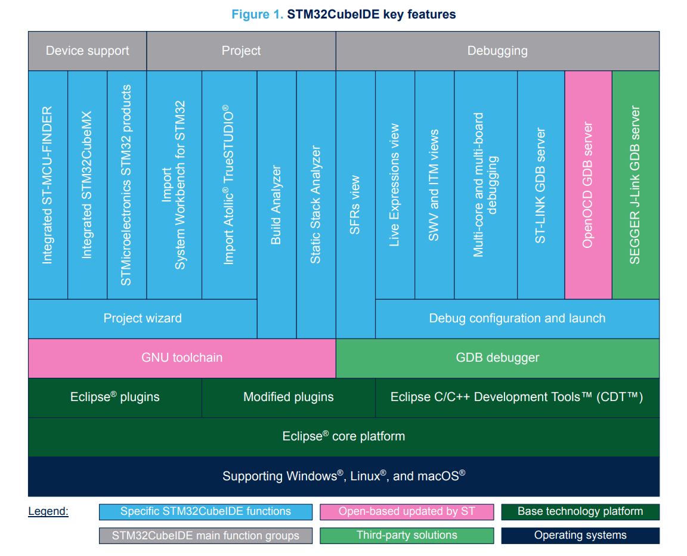

# 简介
  [STM32CubeIDE](https://my.st.com/content/my_st_com/zh/products/development-tools/software-development-tools/stm32-software-development-tools/stm32-ides/stm32cubeide.html)基于Eclipse C/C++ Development Tools™ (CDT™)架构、GCC工具链和GDB调试器，集成了ST MCUFinder和[STM32CubeMX](https://my.st.com/content/my_st_com/zh/products/development-tools/software-development-tools/stm32-software-development-tools/stm32-configurators-and-code-generators/stm32cubemx.html)，具有外设配置，代码生成，编译，链接，调试等功能，支持Windows、Linux和macOS操作系统（限64位）。
  通过build analyzer and a static stack analyzer分析项目编译状态和内存分配，在调试界面可以查看CPU核心寄存器、内存、外设寄存器以及变量窗口、串口终端和错误分析仪。

# 使用
## 基本概念和术语
* 工作空间
* 信息中心
* 外观、菜单栏、工具栏
* 视图和编辑器