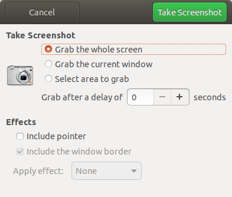

#### 修改主机名
* 修改/etc/hostname文件内容为新的主机名（如果是空或者localhost，显示为linux），重启后生效。
```shell
sudo vim /etc/hostname
```

* 修改hosts文件（好像没啥用）

#### 修改用户名（未成功）
  修改sudoers文件，赋予新用户名全部权限。
```shell
sudo vim /etc/sudoers #将root行复制一行，root改成新用户名
```

  修改shadow文件，修改用户名，格式如下：
> username:passwd:lastchg:min:max:warn:inactive:expire:flag
> 用户名：密码：上一次修改时间：最小时间间隔：最大时间间隔：警告时间：不活动时间：失效时间：标志

  修改用户家目录名称为新用户名。
```shell
cd /home
sudo mv 旧用户名 新用户名
ls
```


#### 下载deb包
  进入Ubuntu [Packages](https://packages.ubuntu.com/)网站，搜索需要的deb包名称。

#### Ubuntu截图
* 按键盘的Print Screen键对整个屏幕进行截图，或按Alt + Print Screen键对当前窗口进行截图，并自动保存到Home/Pictures下。

* Ubuntu自带一个名为“截图/Screenshot”的软件，与Windows的截图工具类似。


* Linux有一个强大的截图软件ksnapshot，可以在软件商店安装，也可以直接命令行安装。
```shell
sudo apt-get install ksnapshot
```