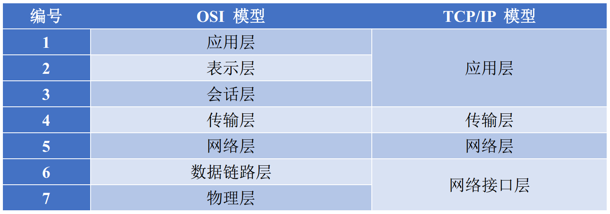
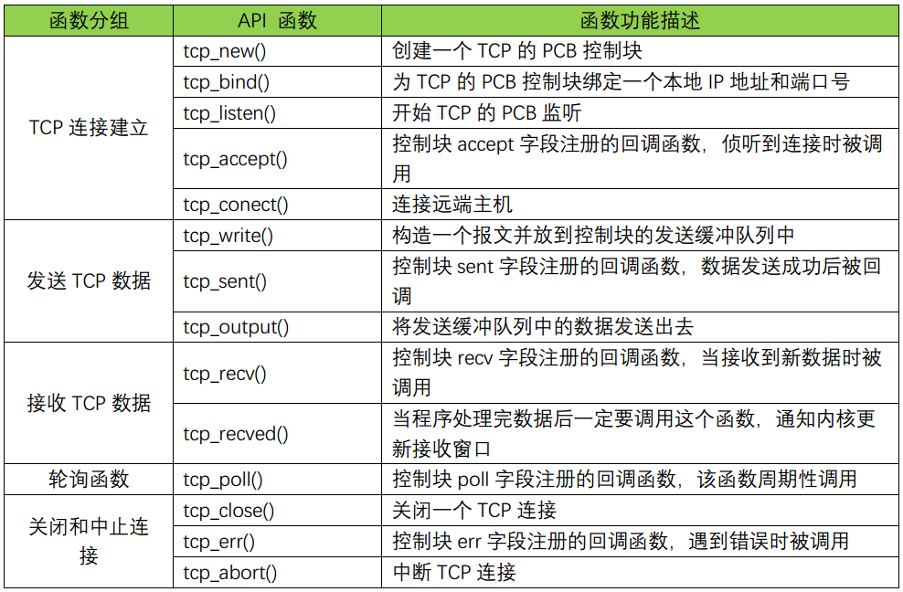

简介
===
  LwIP

API
===
## TCP
### RAW API

#### 示例
##### 服务端
1.tcp_new
2.tcp_arg
3.tcp_bind
4.tcp_listen或tcp_listen_with_backlog
5.tcp_accept

##### 客户端
1.tcp_new
2.tcp_arg
3.tcp_bind
4.tcp_connect

## UDP