# 1  测试环境
  1. 开发板：Beaglebone Black工业版（红色）
  2. 操作系统： 主机Win10 x64、虚拟机Ubuntu 20.04 LTS x64
  3. SDK：ti-processor-sdk-linux-am335x-evm-06.03.00.106
  4. 交叉编译器：gcc-linaro-7.5.0-2019.12-x86_64_arm-linux-gnueabihf

# 2 原理
## 2.1 AM335x启动流程
  AM335x有四个不同的启动阶段：ROM Code -> SPL/MLO -> U-Boot -> Kernel

### 2.1.1 ROM code
  ROM Code是固化在AM335x芯片内部ROM的第一段代码，上电复位后自动运行，根据SYSBOOT引脚配置选择启动源（MMC,USB,EMAC等），并加载SPL/MLO到内部RAM中运行。

### 2.1.2 SPL/MLO
  SPL/MLO初始化并加载U-Boot到DDR运行。

### 2.1.3 U-Boot
  U-Boot初始化外设，并且提供了很多命令和环境变量，U-Boot加载Kernel和设备树到DDR中并将启动参数传递给kernel运行。

### 2.1.4 Kernel
  Kernel加载设备树和文件系统启动Linux系统。

## 2.2 EMMC烧写流程
  EMMC烧写有两种方式，一种是在U-Boot阶段使用mmc命令擦写EMMC，另一种是在Kernel启动后用Linux命令烧写。

### 2.2.1 mmc命令
  U-Boot中提供了一系列操作EMMC/SD的mmc命令：

|命令                      |作用|
|-------------------------|----|
|mmc list                 |列出当前可用的MMC设备（EMMC/SD）|
|mmc dev \[dev][part]     |查看当前的设备号，或者切换到dev设备的part分区|
|mmc info                 |查看当前的设备信息|
|mmc read addr blk# cnt   |将当前设备的第blk#开始的cnt个块读到DDR地址addr处|
|mmc write addr blk# cnt  |将DDR地址addr开始的cnt个块写到当前设备的第blk#处|
|mmc erase addr blk# cnt  |擦除当前设备的第blk#开始的cnt个块|
|mmc rescan addr blk# cnt |重新扫描当前可用的MMC设备|
|mmc part \[dev][part]    |列出当前设备的可用分区|
|mmc bootpart \[dev][part]|显示或设置分区号|

  由于U-Boot中对EMMC/SD的分区和格式化支持不够，需要将整个系统（MLO,U-Boot,Kernel,Device Tree,Rootfs以及分区表等）做成镜像，然后使用mmc命令将整个镜像写到EMMC/SD中。这个系统镜像通常包含了很多没有用到的空间，文件比较大，如果超过DDR大小的话还得分成几个小文件依次烧写，使用网络传输和烧写过程中会浪费很多时间。因此，在U-Boot中更适合烧写NAND、NOR、SPI等Flash，而在Linux下对EMMC/SD操作就非常简单，可以直接进行分区、格式化、解压、拷贝文件等，本文就使用这种方式。

### 2.2.2 Linux命令
  Linux启动后就可以为所欲为了。

# 3 步骤
## 3.1 框图
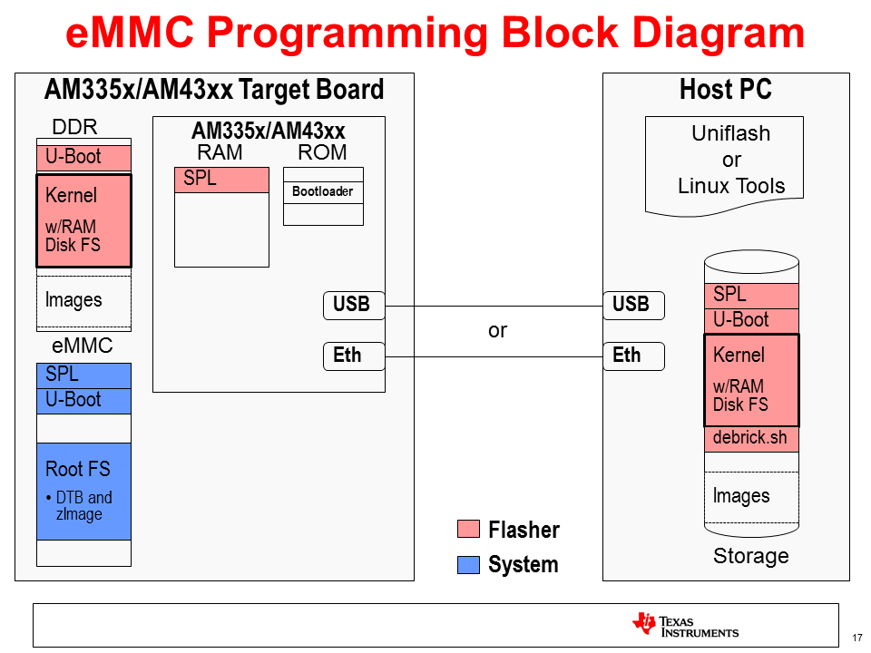

  根据上图，烧写EMMC需要制作两类文件：
  一类是红色标识的Flasher，用来实现网络启动和烧写EMMC。

|文件名                   |作用    |
|------------------------|-------|
|u-boot-spl-restore.bin  |SPL，编译U-Boot生成|
|u-boot-restore.img      |U-Boot，编译U-Boot生成|
|zImage                  |Linux Kernel，编译Linux源码生成|
|am335x-boneblack.dtb    |设备树，编译Linux源码生成|
|debrick.sh或Flasher.sh  |烧写脚本，自定义|

  另一类是蓝色标识的System，是待烧写的系统文件，烧写脚本需要用到，此处只是测试，可以自定义。

|文件名                   |作用    |
|------------------------|-------|
|boot_partition.tar.gz   |MLO和u-boot.img打包后的U-Boot文件，编译U-Boot生成|
|tisdk-rootfs-image-am335x-evm.tar.gz|内核、设备树和文件系统，SDK提供的预编译镜像|

## 3.2 移植
  本文使用的SDK是ti-processor-sdk-linux-am335x-evm-06.03.00.106版本（附件1下载），需要在Ubuntu20下安装，默认安装到/opt文件夹下。

### 3.2.1 制作System文件
#### 3.2.1.1 修改U-Boot支持EMMC启动
  1. 跳转到U-Boot源码目录，创建并切换到新的分支emmc。
```shell
cd /opt/ti-processor-sdk-linux-am335x-evm-06.03.00.106/board-support/u-boot-2019.01+gitAUTOINC+333c3e72d3-g333c3e72d3/
git checkout -b emmc
```

  2. 配置编译器并编译
```shell
export PATH="/opt/ti-processor-sdk-linux-rt-am335x-evm-02.00.02.11/linux-devkit/sysroots/x86_64-arago-linux/usr/bin":$PATH
make ARCH=arm CROSS_COMPILE=arm-linux-gnueabihf- O=emmc am335x_boneblack_config all
```

  3. 创建/tftpboot文件夹，打包MLO和u-boot.img为boot_partition.tar.gz并拷贝到/tftpboot文件夹，获取tisdk-rootfs-image-am335x-evm.tar.gz并拷贝到/tftpboot文件夹。
```shell
mkdir /tftpboot
cd emmc
tar czvf boot_partition.tar.gz MLO u-boot.img
cp boot_partition.tar.gz /tftpboot
cd /opt/ti-processor-sdk-linux-rt-am335x-evm-02.00.02.11/filesystem
cp tisdk-rootfs-image-am335x-evm.tar.gz /tftpboot
```

### 3.2.2 制作Flasher文件
#### 3.2.2.1 修改U-Boot支持网络启动
  1. 跳转到U-Boot源码目录，创建并切换到新的分支flasher。
```shell
cd /opt/ti-processor-sdk-linux-am335x-evm-06.03.00.106/board-support/u-boot-2019.01+gitAUTOINC+333c3e72d3-g333c3e72d3/
git checkout -b flasher
```

  2. 编译U-Boot
```shell
make ARCH=arm CROSS_COMPILE=arm-linux-gnueabihf- O=flasher am335x_evm_defconfig
make ARCH=arm CROSS_COMPILE=arm-linux-gnueabihf- O=flasher menuconfig
```

  使能“Enable a default value for bootcmd”，并修改bootcmd为
”run findfdt; run init_console; bootp; tftp $fdtaddr $fdtfile; bootz $loadaddr - $fdtaddr; “

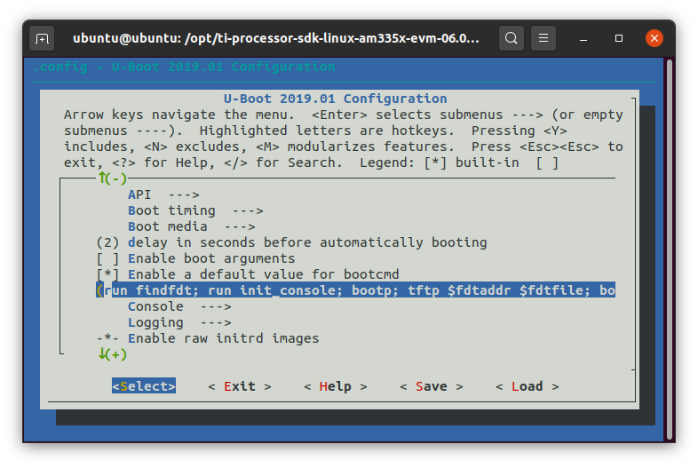

  3. 编译U-boot源码，并将生成的SPL和U-Boot文件复制并重命名到/tftpboot文件夹下。
```shell
make ARCH=arm CROSS_COMPILE=arm-linux-gnueabihf- O=flasher
cd flasher/
cp spl/u-boot-spl.bin /tftpboot/u-boot-spl-restore.bin
cp u-boot.img /tftpboot/u-boot-restore.img
```

#### 3.2.2.2 修改Kernel支持initramfs
  1. 切换到Kernel源码目录，创建并切换到新的分支flasher。
```shell
cd /opt/ti-processor-sdk-linux-am335x-evm-06.03.00.106/board-support/linux-4.19.94+gitAUTOINC+be5389fd85-gbe5389fd85/
git checkout -b flasher
```

  2. 下载sitara_flasher_initramfs_rev_1.0.tar.gz（附件2下载），拷贝到当前目录并解压。
```shell
mkdir sitara_flasher_initramfs
tar -xvf sitara_flasher_initramfs_rev_1.0.tar.gz -C sitara_flasher_initramfs/
```

  3. 配置内核支持initramfs
```shell
make ARCH=arm CROSS_COMPILE=arm-linux-gnueabihf- tisdk_am335x-evm_defconfig
make ARCH=arm CROSS_COMPILE=arm-linux-gnueabihf- menuconfig
```

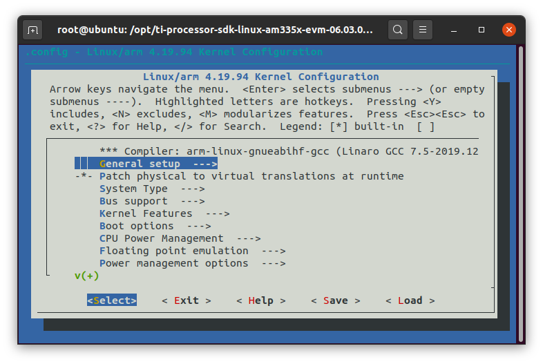
  选择"General setup --->"，选中"Initial RAM filesystem and RAM disk (initramfs/initrd) support"，将"Initramfs source file(s)"修改为上面的路径"/opt/ti-processor-sdk-linux-am335x-evm-06.03.00.106/board-support/linux-4.19.94+gitAUTOINC+be5389fd85-gbe5389fd85/sitara_flasher_initramfs"，退出后保存当前配置。

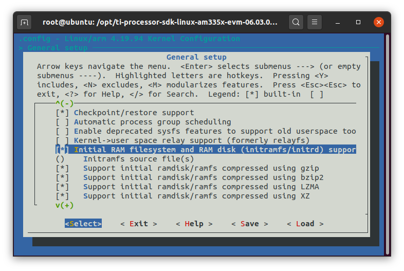
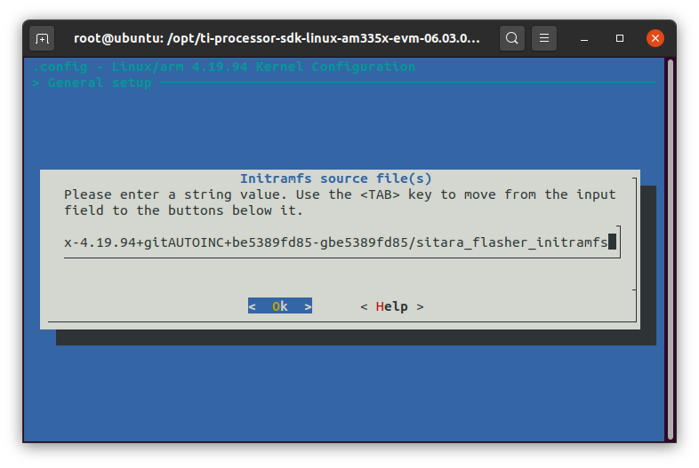
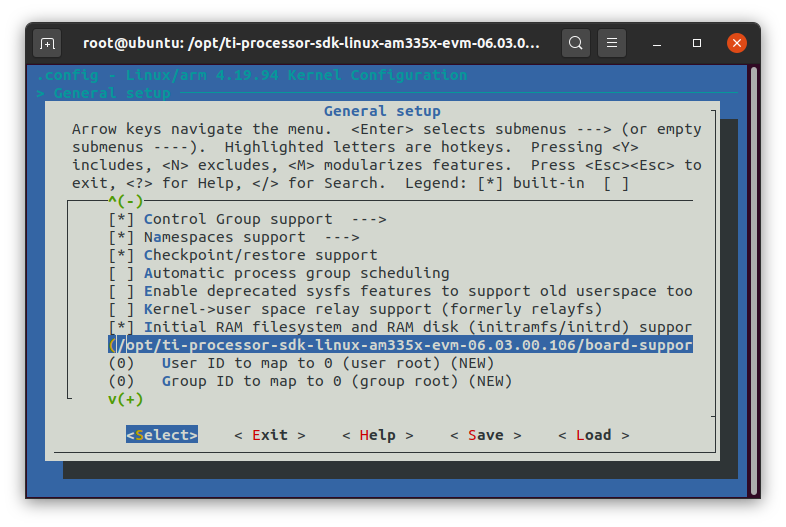

  4. 修改内核命令行参数

    选择”Boot options  --->“，修改”Default kernel command string“为
”console=ttyO0,115200n8“。
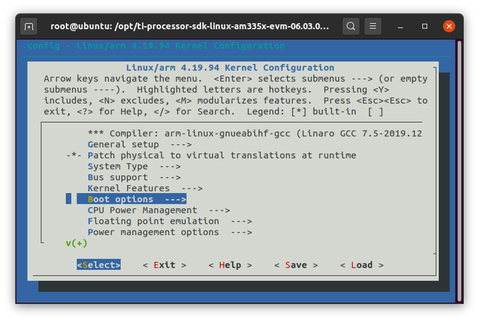
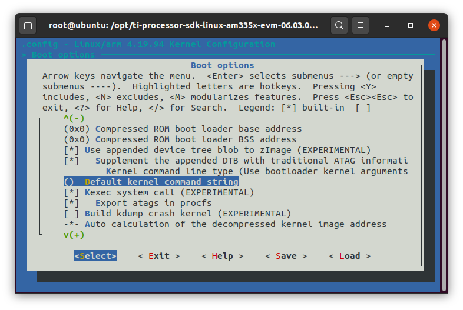
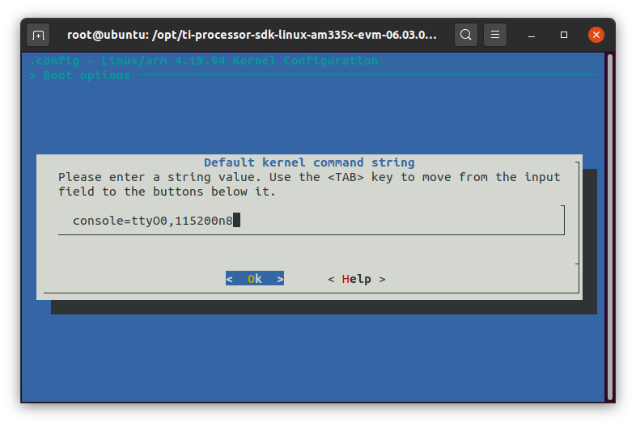
  5. 编译内核，并将生成的内核镜像zImage（内含文件系统）和设备树am335x-boneblack.dtb拷贝到/tftpboot文件夹下。

```shell
make ARCH=arm CROSS_COMPILE=arm-linux-gnueabihf-
cp arch/arm/boot/zImage /tftpboot
cp arch/arm/boot/dts/am335x-boneblack.dtb /tftpboot
```

## 3.3 修改硬件BOOT引脚支持网络启动
  参考“AM335x and AMIC110 Sitara™ Processors Technical Reference Manual”的Table 26-7. SYSBOOT Configuration Pins，需要将SYSBOOT[4:0]修改为10101b（红色下划线，设置启动顺序为MMC0->EMAC1），SYSBOOT[7:6]为00b（蓝色下划线，设置以太网接口为MII）。
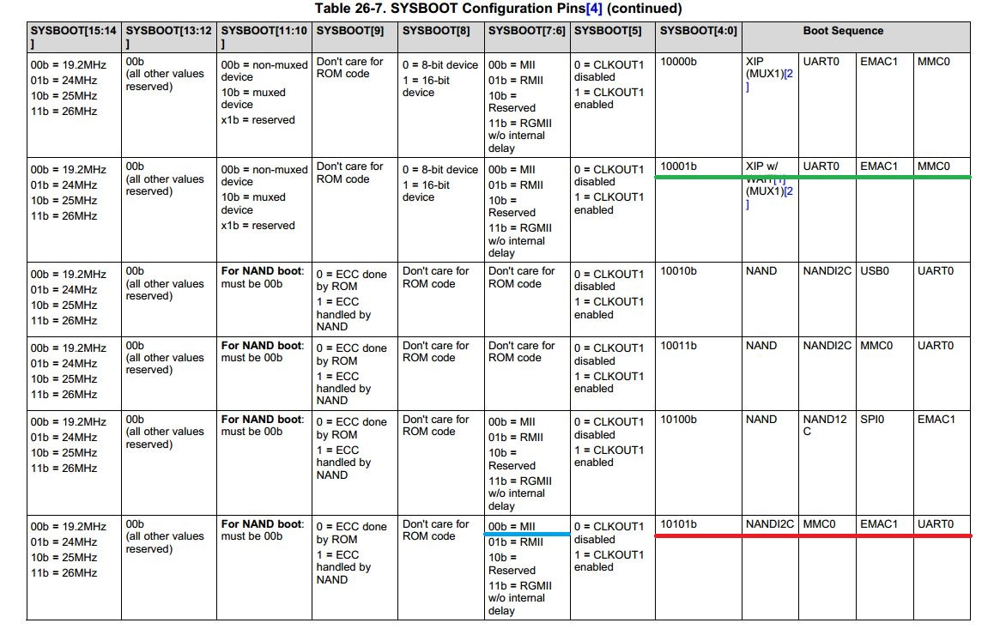

  根据Beaglbone Black原理图“BBB_SCH.pdf”可知MMC0接的是SD卡，EMAC1接的是LAN8710A，SYSBOOT2接了S2。上电后将先从SD启动，如果SD没插或没有系统将继续检测以太网，若还没有反应将继续检测串口，终端会打印“C”，依次循环。

  参考Boot Configuration电路，将R95拆掉接到R70处，将R67拆掉接到R91处。当按下S2时，SYSBOOT[4:0]变为10101b（绿色下划线，启动顺序为EMAC1->MMC0），这样方便反复烧写测试而不需要手动擦除SD卡。由于Beaglbone Black的SYSBOOT[7:6]默认为00b和LAN8710A（MII接口）一致，因此不用修改，如果使用其他接口的话（如RGMII接口的AR8035，则需要修改为11b）。
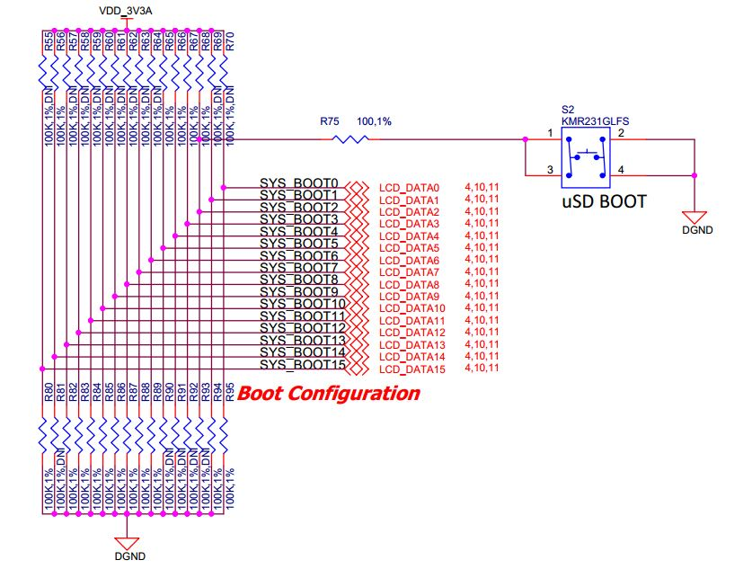

## 3.4 Win7下使用Uniflash工具烧写测试
### 3.4.1 安装UniFlash V3.4
  安装UniFlash V3.4（附件3下载），选择Sitara ARM Processors以支持AM335x芯片。
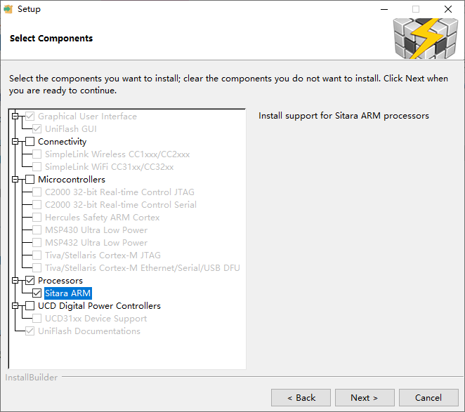

### 3.4.2 建立连接
  点击“New Target Configuration”，选择Sitara Flash Devices创建新的连接。
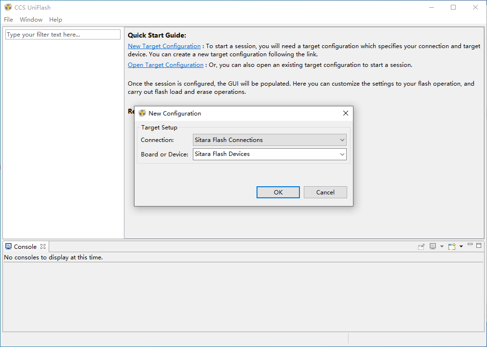

  将3.2节制作的文件从Ubuntu14拷贝到Win7中（Flasher.sh附件2下载），并修改TFTP home folder与之一致。
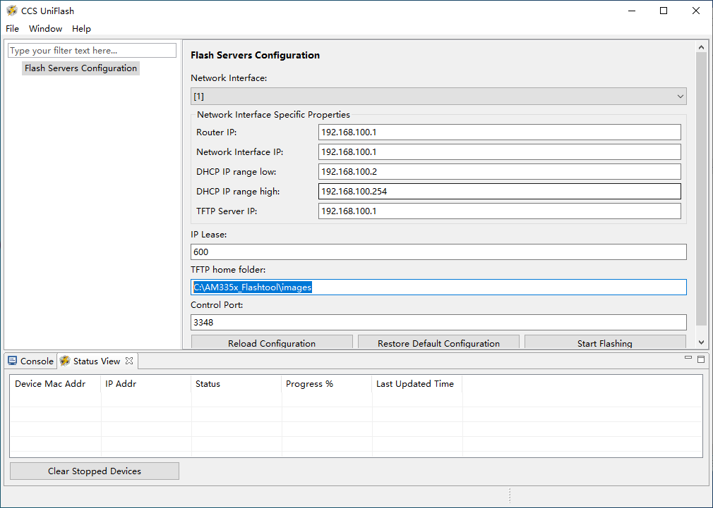

  使用USB转TTL线连接PC和Beaglebone Black的串口J1，在设备管理器中查看对应的COM号，然后打开串口终端（本文使用putty）。
  使用网线连接PC和Beaglebone Black的网口P5，然后上电（最好不要插SD卡），打开网络和共享中心，这时会出现一个新的本地连接，将IP地址修改与上面一致。
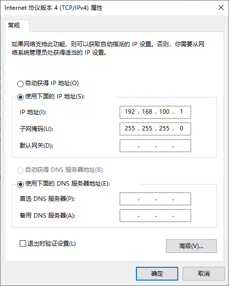

### 3.4.3 启动和烧写流程分析
  点击“Start Flashing”，UniFlash启动并作为DHCP/BOOTP和TFTP服务器。
  将Beaglebone Black重新上电，然后插入SD卡，观察终端启动和烧写信息。

## 3.5 Ubuntu14下搭建DHCP/BOOTP和TFTP服务器
### 3.5.1 配置DHCP/BOOTP服务
  1. 安装isc-dhcp-server服务，然后修改配置文件。
```shell
sudo apt install isc-dhcp-server
sudo vim /etc/dhcp/dhcpd.conf
新增内容：
subnet 192.168.2.0 netmask 255.255.255.0 {
  range dynamic-bootp 192.168.2.2 192.168.2.100;

  if substring(option vendor-class-identifier,0,10) = "AM335x ROM" {
    filename "u-boot-spl-restore.bin";
  } elsif substring(option vendor-class-identifier,0,10) = "DM814x ROM" {
    filename "u-boot-spl-restore.bin";
  } elsif substring(option vendor-class-identifier,0,17) = "AM335x U-Boot SPL" {
    filename "u-boot-restore.img";
  } else {
    filename "zImage";
  }

  range 192.168.2.101 192.168.2.199;
}
```

  2. 设置dhcpd的网口号（如ens33），然后修改该网口的IP地址与上面在同一网段。
```shell
sudo vim /etc/default/isc-dhcp-server
修改内容：
INTERFACESv4="ens33"
```

  Ubuntu20默认使用NetworkManager管理网络连接，点击桌面右上角”Wired Connected“展开，选择”Wired Settings“打开Network配置界面，然后点击Wired右边的齿轮符号打开Wired配置界面（或者点击右上角+号创建新连接），在IPv4页面修改IPv4 Method为Manual，Address为192.168.2.1，Netmask为255.255.255.0，Gateway为192.168.2.1，点击右上角Apply保存。

  将虚拟机的网络适配器改为桥接模式，然后重启网络。
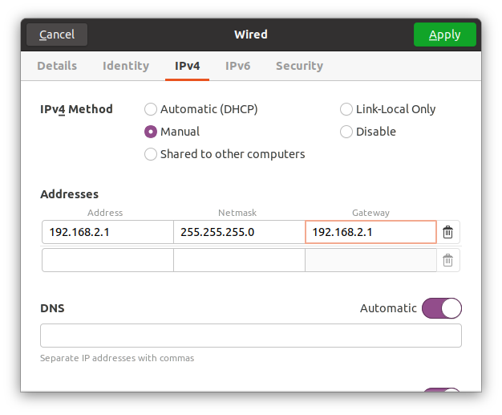

  3. 安装tftpd-hpa服务并配置。
```shell
sudo apt install tftpd-hpa
sudo chmod 777 -Rf /tftpboot #修改/tftpboot的权限
sudo vim /etc/default/tftpd-hpa
修改内容：
TFTP_USERNAME="tftp"
TFTP_DIRECTORY="/tftpboot"
TFTP_ADDRESS=":69"
TFTP_OPTIONS="--secure"
```

  最后重启各项服务以使配置生效。
```shell
sudo service isc-dhcp-server restart
sudo service tftpd-hpa restart
```

# 4 注意事项

  1. AM335xSDK的命名有两种版本，旧版本命名格式为ti-sdk-am335x-evm-x.x.x.x，新版本命名格式为ti-processor-sdk-linux-am335x-evm-x.x.x.x。

附件：

1. [PROCESSOR-SDK-LINUX-AM335X  06_03_00_106](http://software-dl.ti.com/processor-sdk-linux/esd/AM335X/latest/index_FDS.html)
2. [BBB_eMMC_flasher.tar.xz](https://e2e.ti.com/cfs-file/__key/communityserver-discussions-components-files/791/BBB_5F00_eMMC_5F00_flasher.tar.xz)
3. [UniFlash V3.4](https://processors.wiki.ti.com/index.php/CCS_UniFlash_v3.4.1_Release_Notes)

参考链接：

1. [Sitara Linux Program the eMMC on Beaglebone Black](https://processors.wiki.ti.com/index.php/Sitara_Linux_Program_the_eMMC_on_Beaglebone_Black#Setup_the_Hardware)
2. [Ubuntu 12.04 Set Up to Network Boot an AM335x Based Platform](https://processors.wiki.ti.com/index.php/Ubuntu_12.04_Set_Up_to_Network_Boot_an_AM335x_Based_Platform)
3. [BeagleBone Black Industrial 4G](https://www.cnx-software.com/2016/01/28/beaglebone-black-industrial-4g-is-red-and-offers-an-extended-temperature-range/)