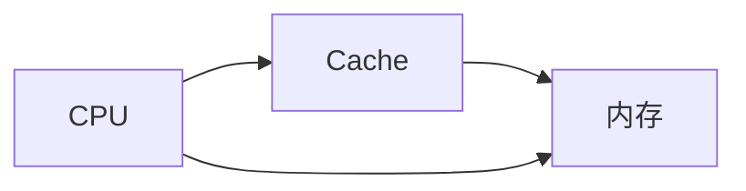
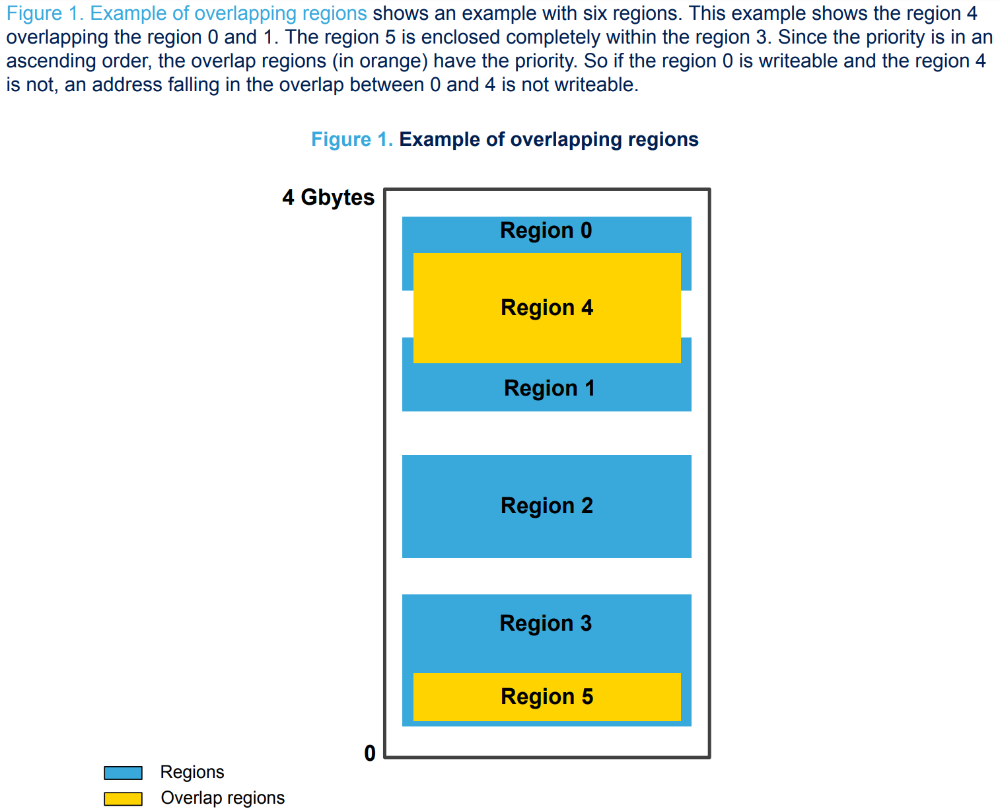
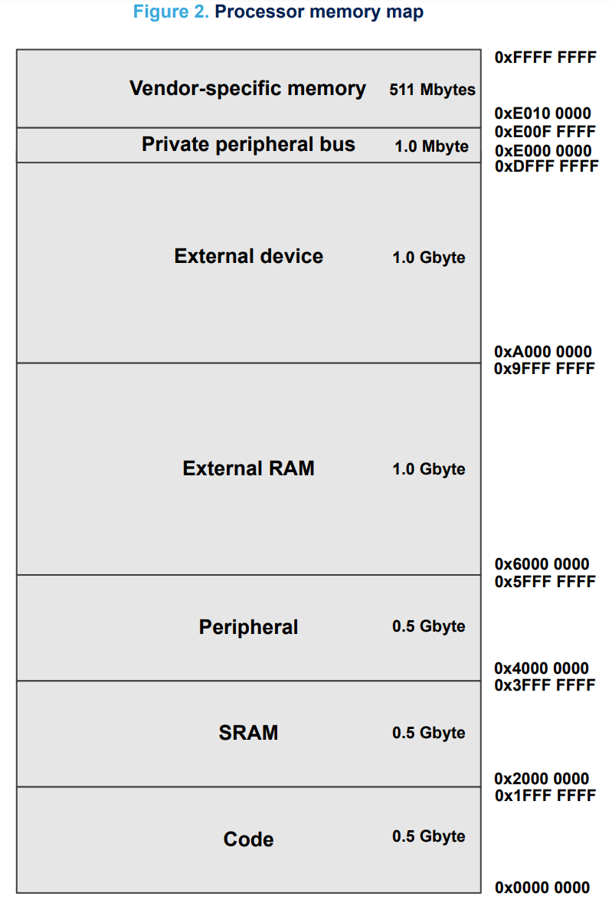
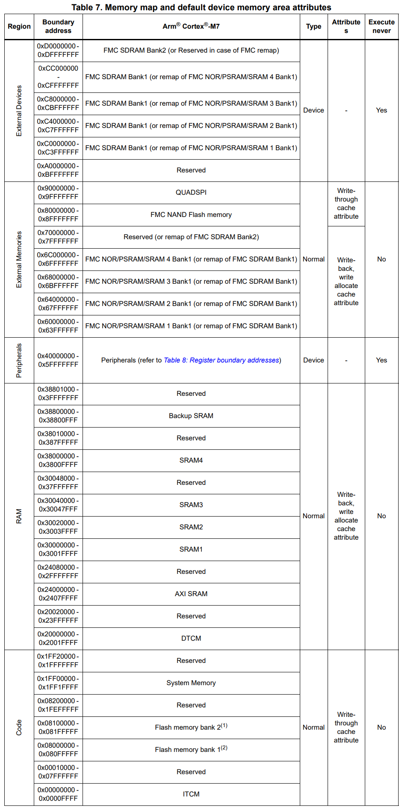
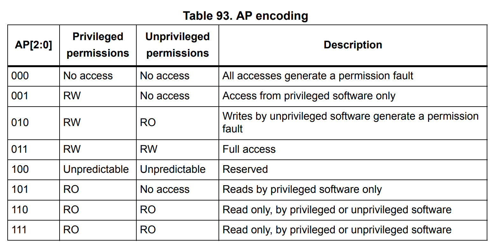
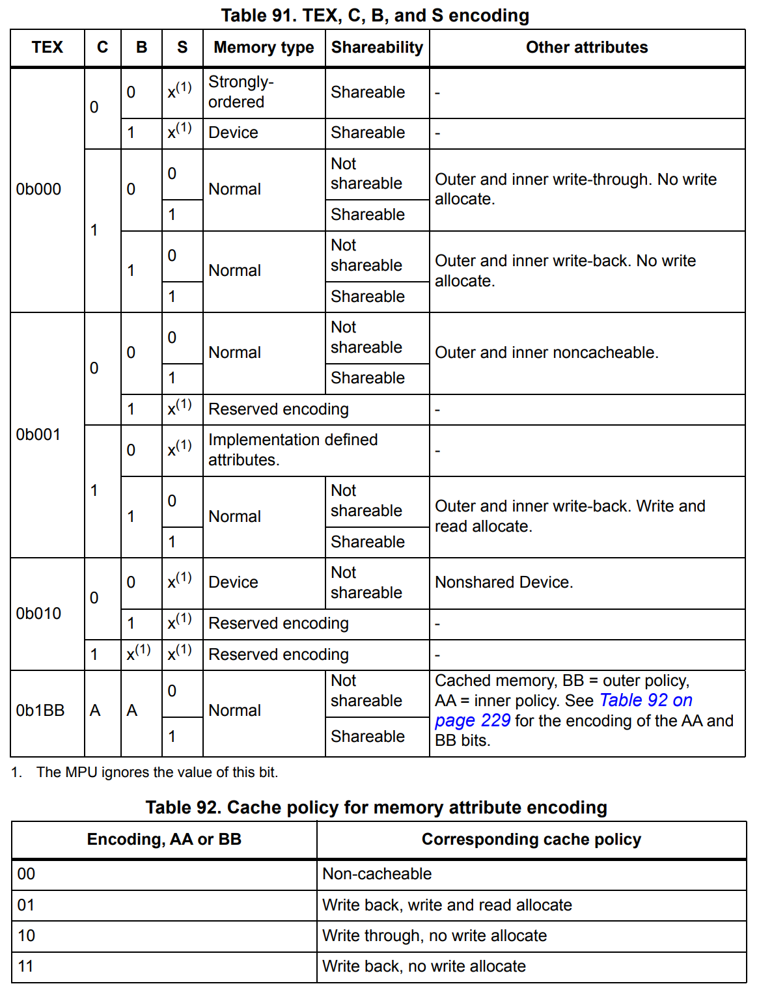

# 基本概念
## 原理
  缓存（Cache）是位于CPU和内存之间的临时存储器，速度与CPU相同，但是比内存快的多，用来解决CPU运行速率和内存访问速率不匹配的问题。

  CPU要读/写数据时，首先从Cache中查找，如果找到就可以立即从Cache中读/写，之后Cache和内存会自己同步数据；如果没有找到，就需要直接访问内存，同时在Cache中分配相应的空间并使之数据同步。

## 分配和命中
  **分配**：CPU在访问内存时，会在Cache中开辟一段空间用作两者的缓冲，之后CPU就可以访问Cache而不用直接访问内存，加快了访问速率。读和写操作时的分配分别叫做读分配（Read allocate）和写分配（Write allocate）。
  **命中**：CPU读/写数据时，首先从Cache中查找，若在Cache中找到了（之前已经分配），称为命中（Cache hit），否则称为未命中（Cache miss）。CPU读取Cache的命中率非常高（大多数CPU可达90%左右），也就是说CPU下一次要读取的数据90%都在Cache，只有大约10%需要从内存读取。读和写操作时的命中或未命中分别叫做读命中（Read hit）、写命中（Write hit）或读未命中（Read miss）、写未命中（Write miss）。

## 写分配和无写分配
  在写未命中时，通常有两种分配策略：写分配（Write allocate policy）和无写分配（No write allocate policy）。
  **写分配**：写内存的同时在Cache中分配一段空间，并将要写的地址所在的块从内存调入Cache。
  **无写分配**：把要写的内容直接写回内存，但不在Cache中分配空间。
  **注意，读必有分配！**

## 写回和写通
  CPU写Cache通常有两种写策略：写回（Write back）和写通（Write through）。
  **写回**：CPU对Cache写命中时，只修改Cache的内容而不立即写入内存，同时使用dirty标志位记录Cache的修改，当某个Cache行被换出时根据dirty位的值决定将该行内容写回内存或者丢弃。
  CPU对Cache写未命中时，有两种情况：一种是写回写分配WBWA（Write Back with Write Allocate），此时会为欲写的内存块在Cache中分配一行，并将整个内存块拷贝到Cache，然后对该Cache行进行修改。之所以不直接修改内存，是因为在分配Cache行时可能需要将换出的Cache行写回内存，这样耗时较长。对该Cache行的修改将在其换出时写到内存。另一种是写回无写分配WBNWA（Write Back with No Write Allocate），此时CPU直接写内存但不在Cache中为其分配一行。
  这种写Cache和写内存分开进行的方式显著减少了写内存次数，但也带来了Cache和内存严重的不一致性，需要针对写回法维护Cache的一致性（比如MESI协议）。

  **写通**：又称全写、写透、写直达法。
  CPU对Cache写命中时，同时修改Cache和内存，可以较好的维护Cache和内存的一致性。但在多处理器系统中各CPU都有自己的Cache，当某个CPU以写通法来修改它的Cache和内存时，其他CPU的Cache内容就过时了。即使在单处理器系统中，也有I/O设备不经过Cache直接写内存的情况，这样Cache和内存也会不一致。
  CPU对Cache写未命中时，将直接写内存，但对于是否在Cache中分配一行有两种选择：一种是写通写分配WTWA（Write Through with Write Allocate）；一种是写通无写分配WTNWA（Write Through with No Write Allocate），只有在读未命中时才会在Cache中为其分配行。
  写通法对Cache和内存的修改同步进行，无需对每行Cache设置一个dirty位及判断。但CPU对内存的写操作相当于没有Cache的高速缓冲，只有读操作才使用，降低了Cache的性能。

# STM32H7
## Cache
  STM32H7系列芯片内置了一级缓存（L1 Cache），包括16KB I-Cache和16KB D-Cache。

## MPU
  内存保护单元（Memory Protection Unit）简称MPU，可以提高系统的安全性和稳定性，比如：
* 使用多任务实时系统（RTOS）时，防止用户代码破坏共享数据。
* 将SRAM设置为不可执行，防止代码注入攻击。
* 修改内存访问属性。

  MPU支持最多16个域（Region 0~15），由于Cache line长度为32字节，所以域的大小至少是32字节。当域的大小超过256（8 x 32）字节时，还可以划分为8个子域（Subregion 0~7），每个子域大小相等，同样至少是32字节，每个子域都可以单独使能或禁止。另外还有一个默认的域称为背景域（Region -1），仅允许特权访问，PRIVDEFENA=1时沒有设置的内存空间都属于背景域。
  这些域拥有固定的优先级，且数字越大，优先级越高。因此，当不同的域存在重叠或嵌套时，内存属性取决于最高优先级的域。

  Cortex-M7的MPU是统一的，对于数据访问和指令访问没有单独的域，拥有相同访问策略。可以通过MPU设置内存属性，并且导出到系统缓存单元（Cache）和内存控制器。Cache控制是通过Cache控制寄存器全局设置，但是可以通过MPU指定某个域的Cache策略以及是否支持Cache。

  MPU将STM32的内存映射划分为域，每个域定义了内存类型和内存属性，这些决定了内存的访问策略。

## 内存类型
  内存类型分为三种：
* Normal memory：允许CPU以高效的方式加载或存储字节、半字和字，不需要按照程序中的顺序执行。
* Device memory：在设备域内，必须严格按照顺序加载或存储，这是为了确保以正确的顺序设置寄存器。
* Strongly ordered memory：总是按照程序中的顺序执行，在执行程序中的下一条指令前，CPU必须等待加载或存储指令完成，这会导致性能下降。

## 内存属性

## MPU寄存器
|符号|名称|说明|
|---|---|---|
|MPU_TYPE|MPU类型寄存器|[31:24]：保留 [23:16]：IREGION，指示支持的MPU指令域个数，由于MPU是统一的，该值总是为0  [15:8]：DREGION，指示支持的MPU数据域个数，值为8或16  [7:1]：保留  [0]：SEPARATE，指示支持统一或独立的指令和数据域，总是0 |
|MPU_CTL|MPU控制寄存器|[31:3]：保留  [2]：PRIVDEFENA，允许或禁止特权访问背景域；MPU使能且此位为0时，禁止默认内存映射，对MPU域之外的地址访问将导致错误；MPU使能且此位为1时，使能默认内存映射，MPU域之外的地址设为背景域，允许特权访问，非特权访问将导致MemManage错误  [1]：HFNMIENA，在处理优先级为-1或-2的异常时允许使能MPU，通常是在HardFault、NMI错误或使能了FaultMask时；MPU使能且此位为0时，在发生上述错误时禁止MPU；MPU使能且此位为1时，在发生上述错误时不禁止MPU  [0]：使能/禁止MPU；此位为1时，除非PRIVDEFENA=1使能背景域（只允许特权访问），否则必须至少使能一个域才能使系统工作，但始终运行对系统控制空间和中断向量表的访问；此位为0时，系统使用默认内存映射，内存属性跟没有实现MPU一样，支持特权和非特权访问；此位不影响内存的XN和Strongly ordered规则|
|MPU_RNR|MPU域号寄存器|[31:8]：保留  [7:0]：REGION，指示MPU_RBAR和MPU_RASR影响的域，可选值0~7（DREGION=8）或0~15（DREGION=16），一般在修改后面两个寄存器之前先设置该寄存器|
|MPU_RBAR|MPU基地址寄存器|[31:N]：ADDR，待设置域的基地址，N=Log2(Region size in bytes)；域大小至少为32字节，此时N=5，下一个保留项无效；当域大小为4G字节时，该值为0x00000000，表示域大小为整个内存映射空间；基地址必须根据域大小对齐，比如一个64KB的域，其基地址必须是64KB的倍数，如0x00010000或0x00020000等  [N-1:5]：保留  [4]：VALID，此位为0时，更新MPU_RNR指定域的基地址；此位为1时，使用REGION的值更新MPU_RNR并设置该域的基地址  [3:0]：REGION，和MPU_RNR作用相同，配合VALID工作|
|MPU_RASR|MPU域属性和大小寄存器|[31:29]：保留  [28]：XN，取指禁止（Execute  never）  [27]：保留  [26:24]：AP，数据访问权限，参考[AP](###AP)  [23:22]：保留  [21:19]：TEX，类型扩展，参考[TEX,C,B,S](###TEX,C,B,S)  [18]：S，可共享，参考[TEX,C,B,S](###TEX,C,B,S)  [17]：C，可缓存，参考[TEX,C,B,S](###TEX,C,B,S)  [16]：B，可缓冲，参考[TEX,C,B,S](###TEX,C,B,S)  [15:8]：SRD，子域禁止，每一位分别对应8个子域中的一个，最低位控制第一个子域，以此类推；当域大小小于256字节时值必须为0  [7:6]：保留  [5:1]：SIZE，域大小，(Region size in bytes) = 2(SIZE+1)，SIZE最小值为4，对应域大小为32字节；最大值为31，对应域大小为4G字节  [0]：ENABLE，域使能|
### AP
  AP（Access Permission）位定义域的特权和非特权访问权限。

### TEX,C,B,S
* C（Cacheable）：可缓存
* B（Bufferable）：可缓冲
* S（Shareable）：可共享，即内存可被多个总线主控器访问，内存系统提供数据同步，例如具有DMA的处理器。强序内存总是可共享的，使能了共享的内存意味着不可缓存。当多个总线主设备访问一个不可共享的内存时，需要通过软件确保数据的一致性，STM32H7不支持硬件数据一致性。

# 配置

# 参考
* [DM00237416-STM32F7 Series and STM32H7 Series Cortex®-M7 processor programming manual](https://www.st.com/content/ccc/resource/technical/document/programming_manual/group0/78/47/33/dd/30/37/4c/66/DM00237416/files/DM00237416.pdf/jcr:content/translations/en.DM00237416.pdf)
* [AN4838-Managing memory protection unit in STM32 MCUs - Application note](https://www.st.com/content/ccc/resource/technical/document/application_note/group0/bc/2d/f7/bd/fb/3f/48/47/DM00272912/files/DM00272912.pdf/jcr:content/translations/en.DM00272912.pdf)
* [AN4839-Level 1 cache on STM32F7 Series and STM32H7 Series](https://www.st.com/content/ccc/resource/technical/document/application_note/group0/08/dd/25/9c/4d/83/43/12/DM00272913/files/DM00272913.pdf/jcr:content/translations/en.DM00272913.pdf)
* [cache的三种写操作工作方式](https://blog.csdn.net/babydream520/article/details/45842083?utm_medium=distribute.pc_relevant.none-task-blog-2%7Edefault%7EBlogCommendFromMachineLearnPai2%7Edefault-1.base&depth_1-utm_source=distribute.pc_relevant.none-task-blog-2%7Edefault%7EBlogCommendFromMachineLearnPai2%7Edefault-1.base)
* [言简意赅介绍STM32H7的Cache工作流程，摸爬滚打半年的经验总结](https://baijiahao.baidu.com/s?id=1616356401416260461&wfr=spider&for=pc)