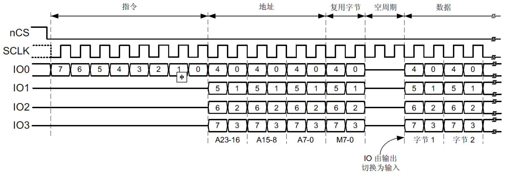

# QSPI基础知识
## QSPI寄存器
|名称|说明|
|---|---|
|QUADSPI_CR|<br>控制寄存器<br>[31:24]：PRESCALE[7:0]，QUADSPI时钟分频，0~255表示1~256分频</br><br>[12:8]：FTHRES[4:0]，用于设置FIFO阈值，0~31表示FIFO的阈值为1~32字节</br><br>[7]：FSEL，用于选择FLASH的BANK，0选择BANK0，1选择BANK1</br><br>[6]：DFM，用于设置双闪存模式，0表示单闪存模式，1表示双闪存模式</br><br>[4]：SSHIFT，用于设置采样移位，考虑到外部信号延迟，推迟数据采集，确保数据稳定。设置为1时，QUADSPI在FLASH驱动数据后半个CLK周期后开始采集数据。</br><br>[1]：ABORT，用于终止当前的QUADSPI传输（设置为1）。</br><br>[0]：EN，用于使能QUADSPI接口（设置为1）。</br>|
|QUADSPI_DCR|<br>器件配置寄存器<br><br>[0]：CKMODE，时钟模式，指定片选信号nCS为高电平时CLK的时钟极性，0表示低电平，称为模式0；1表示高电平，称为模式3</br><br>[10:8]：CSHT[2:0]，设置两条命令之间nCS高电平的时间，0~7表示1~8个时钟周期</br><br>[20:16]：FSIZE[4:0]，定义FLASH的大小=2^[FSIZE＋1］</br>|
|QUADSPI_CCR|<br>通信配置寄存器<br>[7:0]：INSTRUCTION，8位指令</br><br>[9:8]：IMODE[1:0]，指令发送线数，0表示无需发送指令，1~3表示单线/双线/四线发送指令</br><br>[11:10]：ADMODE[1:0]，地址发送线数，0表示无需发送地址，1~3表示单线/双线/四线发送地址</br><br>[13:12]：ADSIZE[1:0]，0~3表示1~4字节地址长度</br><br>[15:14]：ABMODE[1:0]，交替字节发送线数，0表示跳过交替字节阶段，1~3表示单线/双线/四线发送交替字节</br><br>[17:16]：ABSIZE[1:0]，0~3表示1~4个交替字节数</br><br>[22:18]：DCYC[4:0]，空指令周期数，0表示跳过空指令周期阶段，否则在1~31个周期内不发送或接收任何数据</br><br>[25:24]：DMODE[1:0]，数据发送/接收线数，0表示无数据，1~3表示以单线/双线/四线发送数据</br><br>[27:26]：FMODE[1:0]，0表示间接写入模式，1表示间接读取模式，2表示自动轮询模式，3表示内存映射模式。</br><br>[28]：SIOO，用于设置指令是否只发送一次，0表示每次都发送指令</br><br>[31]：DDRM，用于设置双倍率模式，0表示单倍率SDR，1表示双倍率DDR</br>|
|QUADSPI_AR|32位地址寄存器：在间接模式和轮询模式下指定待发送的地址|
|QUADSPI_ABR|指定待发送的交替字节数据|
|QUADSPI_DLR|32位数据长度寄存器：在间接模式和轮询模式下指定待发送的数据长度（字节），0xFFFFFFFF视为数据长度未定义，QUADSPI将持续传输数据，直到到达FLASH结尾。|
|QUADSPI_DR|32位数据寄存器：在间接模式下读写数据|
|QUADSPI_SR|<br>状态寄存器</br><br>[5]：BUSY，1表示QUADSPI正在操作，当操作完成或FIFO为空时，该位自动清零。</br><br>[2]：FTF，表示FIFO是否达到阈值</br><br>[1]：TCF，传输完成标志，在间接模式下，当传输的数据量达到设定值，或在任何模式下传输中止时，该位置1。</br>|
|QUADSPI_FCR|<br>标志清零寄存器</br><br>[1]：CTCF，清除QUADSPI传输完成标志（QUADSPI_SR的TCF位）。</br>|

## QSPI命令序列

  QSPI的命令序列主要包括指令、地址、交替字节、空周期和数据五个阶段，至少要包含除空周期外的一个。

* 指令阶段
  发送8位指令数据，可以1线、2线或4线方式发送，在某些只发送地址的案例中，该阶段可以跳过。

* 地址阶段
  发送1~4字节地址数据，可以1线、2线或4线方式发送，如果不需要发送地址，该阶段可以跳过。

* 交替字节阶段
  发送1~4字节数据，是QSPI接口支持的一个额外阶段，具有更大的灵活性，通常用于控制操作模式。该阶段一般用不到，可以省略。

* 空周期阶段
  在高速时钟下运行时，此阶段可以确保有足够的“周转”时间从输出模式切换到输入模式，该阶段可以跳过。

* 数据阶段
  发送或接收数据，该阶段可以跳过。

## QSPI的1线、2线、4线、SDR和DDR模式
  这里的线是指数据线的个数。
* 1线模式
  使用IO0作为输出，使用IO1作为输入，IO2处于输出模式并强制置0，IO3处于输出模式并强制置1。

* 2线模式
  使用IO0、IO1作为输入输出，读取数据时处于输入（高阻）状态，其他情况为输出，IO2处于输出模式并强制置0，IO3处于输出模式并强制置1。

* 4线模式
  使用IO0、IO1、IO2、IO3作为输入输出，读取数据时处于输入（高阻）状态，其他情况为输出。

* SDR模式
  当QSPI驱动IO0、IO1、IO2、IO3时，这些信号仅在CLK的下降沿发生转变。

* DDR模式
  当QSPI驱动IO0、IO1、IO2、IO3时，这些信号在CLK的上升沿和下降沿都发生转变。

## QSPI间接模式、轮询模式和内存映射
* 间接模式
  通过寄存器操作QSPI，就像传统的SPI、USART等外设那样通过寄存器控制。
  例如对QSPI Flash的擦除或编程操作必须使用间接模式，最大支持4GB。

* 轮询模式
  QSPI可以自动轮询内存中的指定寄存器，并且可以设置屏蔽的数据位，数据匹配（支持与操作和或操作模式）时产生中断。

* 内存映射
  类似于FMC那样将QSPI外设映射到内存空间0x90000000~0x9FFFFFFF（最大256MB），然后像读写普通内存那样访问QSPI连接的外设。
  例如向内部Flash一样使用外部QSPI Flash，任何AHB总线主控都可以自主读取数据。也可以用于从外部QSPI Flash执行代码。

# HAL库使用
## HAL库函数
* HAL_QSPI_Command
```C

```

* HAL_QSPI_Transmit
```C

```

* HAL_QSPI_Receive
```C

```

## 示例
### 以LAN9252 SQI驱动为例
* 使能SQI模式
```C
static BOOL SQIOpen(void)
{
    QSPI_CommandTypeDef command = {0};

    command.Instruction = CMD_ENABLE_SQI;
    command.InstructionMode = QSPI_INSTRUCTION_1_LINE;
    command.AddressMode = QSPI_ADDRESS_NONE;
    command.AlternateByteMode = QSPI_ALTERNATE_BYTES_NONE;
    command.DummyCycles = 0;
    command.DataMode = QSPI_DATA_NONE;
    command.DdrMode = QSPI_DDR_MODE_DISABLE;
    command.DdrHoldHalfCycle = QSPI_DDR_HHC_ANALOG_DELAY;
    command.SIOOMode = QSPI_SIOO_INST_EVERY_CMD;

    if(HAL_OK != HAL_QSPI_Command(&hqspi, &command, HAL_QSPI_TIMEOUT_DEFAULT_VALUE))
    {
        return FALSE;
    }

    return TRUE;
```

* SQI读
```C
static BOOL SQIRead (UINT16 Address, void *data, UINT32 size)
{
    QSPI_CommandTypeDef command = {0};

    command.Instruction = CMD_FAST_READ_SQI;
    command.InstructionMode = QSPI_INSTRUCTION_4_LINES;
    command.Address = Address;
    command.AddressSize = QSPI_ADDRESS_16_BITS;
    command.AddressMode = QSPI_ADDRESS_4_LINES;
    command.AlternateByteMode = QSPI_ALTERNATE_BYTES_NONE;
    command.DummyCycles = CMD_FAST_READ_DUMMY_SQI * 8 / 4;
    command.NbData = size;
    command.DataMode = QSPI_DATA_4_LINES;
    command.DdrMode = QSPI_DDR_MODE_DISABLE;
    command.DdrHoldHalfCycle = QSPI_DDR_HHC_ANALOG_DELAY;
    command.SIOOMode = QSPI_SIOO_INST_EVERY_CMD;

    if(HAL_OK != HAL_QSPI_Command(&hqspi, &command, HAL_QSPI_TIMEOUT_DEFAULT_VALUE))
    {
        return FALSE;
    }

    if(size)
    {
        if(HAL_OK != HAL_QSPI_Receive(&hqspi, data, HAL_QSPI_TIMEOUT_DEFAULT_VALUE))
        {
            return FALSE;
        }
    }

    return TRUE;
}
```

* SQI写
```C
static BOOL SQIWrite (UINT16 Address, void *data, UINT32 size)
{
    QSPI_CommandTypeDef command = {0};

    command.Instruction = CMD_WRITE_SQI;
    command.InstructionMode = QSPI_INSTRUCTION_4_LINES;
    command.Address = Address;
    command.AddressSize = QSPI_ADDRESS_16_BITS;
    command.AddressMode = QSPI_ADDRESS_4_LINES;
    command.AlternateByteMode = QSPI_ALTERNATE_BYTES_NONE;
    command.DummyCycles = CMD_WRITE_DUMMY_SQI * 8 / 4;
    command.NbData = size;
    command.DataMode = QSPI_DATA_4_LINES;
    command.DdrMode = QSPI_DDR_MODE_DISABLE;
    command.DdrHoldHalfCycle = QSPI_DDR_HHC_ANALOG_DELAY;
    command.SIOOMode = QSPI_SIOO_INST_EVERY_CMD;

    if(HAL_OK != HAL_QSPI_Command(&hqspi, &command, HAL_QSPI_TIMEOUT_DEFAULT_VALUE))
    {
        return FALSE;
    }

    if(size)
    {
        if(HAL_OK != HAL_QSPI_Transmit(&hqspi, data, HAL_QSPI_TIMEOUT_DEFAULT_VALUE))
        {
            return FALSE;
        }
    }

    return TRUE;
}
```
