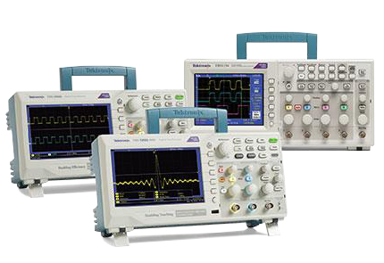

# 基于树莓派的双通道示波器的设计
  目前全球最好的示波器厂商为[泰克](https://www.tek.com/)。


  此外还有一些口袋仪器，如[Analog Discovery 2](https://analogdiscovery.com/)、  [ADALM2000](https://www.analog.com/cn/design-center/evaluation-hardware-and-software/evaluation-boards-kits/ADALM2000.html#eb-overview)、[OpenScope MZ](https://store.digilentinc.com/openscope-mz-open-source-all-in-one-instrumentation/)、[Red Pitaya](https://www.redpitaya.com/)。


## 方案及器件选型
  通常示波器的指标包括模拟带宽（Analog Bandwidth）、采样率（Sample Rate）、记录深度（Record Length）、模拟通道数（Analog Channels）。
|指标   |单位    |备注   |
|------|-------|-------|
|模拟带宽|赫兹（Hz）|
|采样率|每秒采样个数（S/s）|一般为模拟带宽的5~10倍|
|存储深度|点（points）|
|模拟通道数|个||
  本项目基于树莓派，需要制作一个外设电路板用于采集信号，使用开源的KiCad软件设计。

用于示波器的ADC可选ADI、TI、美信：

|型号|电压|通道数|位数|采样率|电平|功耗|封装|价格|
|-|-|-|-|-|-|-|-|-|
|AD9286|1.8V|2|8bits|250Msps|LVDS|315mW|EP48|$25.06|
|MAX1121|1.8V|1|8bits|250Msps|LVDS|477mW|QFN68|$23.06|
|MAX19506|1.8V|2|8bits|100Msps|CMOS|57mW\*2|QFN48|$6.49（有样片）|
|MAX19516|1.8V|2|10bits|100Msps|CMOS|57mW\*2|QFN48|$11.88|
|MAX19517|1.8V|2|10bits|130Msps|CMOS|75mW|TQFN48|$17.84|
|MAX1190|3.3V|2|10bits|120Msps|CMOS|492mW|EP48|$25.06|
|AD9600-125|1.8V|2|10bits|105Msps|CMOS|370mW|LFCSP64|$20.19|
|MAX1449|3.3V|1|10bits|105Msps|CMOS|186mW|TQFP32|$18.31|
|LTC2281|3.3V|2|10bits|125Msps|CMOS|790mW|QFN64|$28|
|AD9283|3.0V|1|8bits|100Msps|CMOS|90mW|20 SSOP|$5.57|
* 表格有误
## KiCad介绍、安装及资料
  [KiCad](https://kicad-pcb.org/)是一个跨平台和开源的电子设计自动化（EDA）套件，支持GNU/Linux、Apple macOS及Windows。主要由以下几个部分组成：
|程序名称|描述|文件扩展|
|:-|:-|:-|
|KiCad|项目管理器|*.pro|
|Eeschema|原理图和元件库编辑器|*.sch, *.lib, *.net|
|Pcbnew|PCB 和封装编辑器|*.kicad_pcb, *.kicad_mod|
|GerbView|光绘文件及钻孔文件查看|\*.g\*, *.drl, etc.|
|Bitmap2Component|将位图转换为元件符号或封装|*.lib, *.kicad_mod, *.kicad_wks|
|PCB Calculator|便携式计算器，可以用于方便的计算线宽/电气间隙/色环代码等等|无|
|Pl Editor|图框编辑器|*.kicad_wks|

  KiCad工作流程如下：

  参考KiCad官网教程完成[下载、安装](https://kicad-pcb.org/download/)，在[电子森林](https://www.eetree.cn/)搜索[KiCad：免费、开源的PCB设计工具](https://www.eetree.cn/doc/detail/66?from=t)获取资料。

```shell

```

## DSO模拟链路的设计要点
## 电源变换
## 数据接口及FPGA的选用要点
## 设计和调试过程中的一些问题
## 从原理图到布局布线