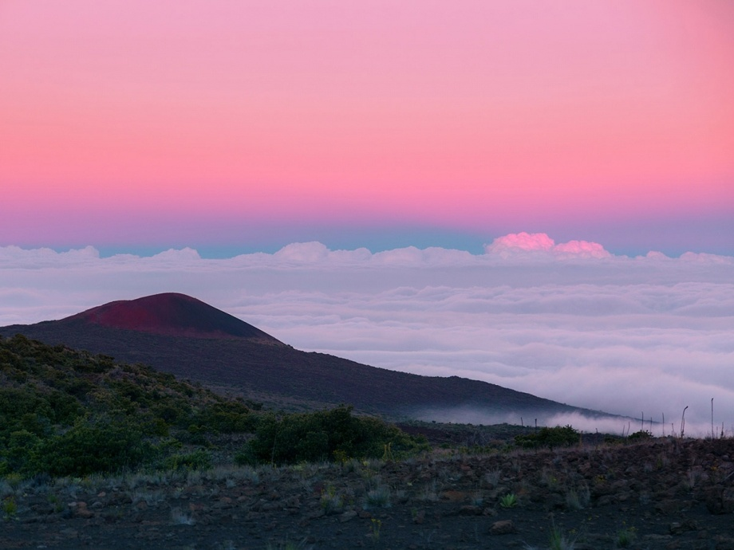
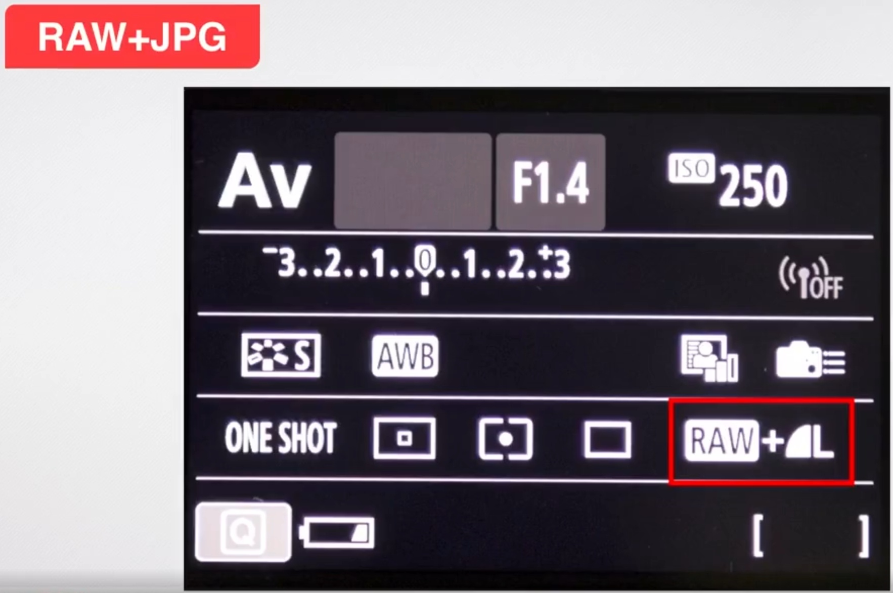

简介
===
  [蚂蚁摄影MaE](http://mp.weixin.qq.com/mp/video?__biz=MjM5MTY4NjUyOA==&mid=506423907&sn=096c0eaa2ad36c3d321a62706cd2eee6&vid=wxv_2061731894957801475&idx=1&vidsn=3b16491588449ce4fff113bf25807928&fromid=1&scene=18&xtrack=1#wechat_redirect)新手训练营318期。
  从建立思维框架，学好基础知识（光线、构图、色彩等），不断提升审美，反复练习实践，最后再根据自己需求看是否要升级器材。

## 老师作品展示
### 一北
  一北老师作品：

### 赵老师
  蚂蚁蔓蔓复古风，需要调节曲线、色彩饱和度，让整体画面偏黄调。

## 学过摄影和没学过摄影的拍出来的照片差距有多大
   学过摄影和没学过摄影的拍出来的照片对比：

## 课程安排
  课程安排如下：

课程
===
## 新手入门基础课
  这节课主要讲摄影中重要的参数和原理。

### 一、曝光
#### 1. 曝光的概念
  外部的光线通过镜头进入到相机内部，在感光元件上成像，再经过一系列的计算和处理形成最终的影像，这个过程就叫做曝光。

* 曝光过度

* 曝光不足
  整个画面非常暗，根本看不出来拍什么，看起来很费劲。

* 曝光正常
  进入到镜头的光线不多不少刚刚好，看着比较舒服。

#### 2. 曝光三要素
##### 光圈
  光圈是在镜头里面的一个零部件，它是由一些叶片所组成的，光圈是控制光线进入到相机内部的唯一通道。

* 光圈的表示
  如下图的F5.6：

  数字越小光圈越大，照片越明亮。

* 光圈和曝光的关系

* 大光圈和小光圈怎么用
  光圈除了控制曝光量，还有控制照片虚化程度的作用，光圈越大虚化的部分越多，清晰的部分越少，虚化效果越好（背景更加干净）。巧用大光圈，使被拍摄的主题更突出，比如人像。

##### 快门
  快门是控制曝光时间的装置，它由快门按钮来控制的，快门开启，光线就可以到达照相机内部的这个影像传感器上，快门开启关闭的这个过程，就是拍摄曝光的过程，相机是利用快门开启时间的长短控制曝光时间，快门越快，曝光时间越短，快门越慢，曝光时间越长。

* 快门的表示
  以时间（秒/S）来表示，相机中用"表示整数秒，不足1秒用分数表示。

* 快门的作用
1. 不同的快门速度影响照片的明暗
    快门越快，曝光时间越短，照片越暗。

2. 抓拍或者记录物体运动的轨迹
    短快门用于拍摄运动、回眸的瞬间，长快门记录物体运动的轨迹。

    长快门可以拍车流等“拉丝”效果。

##### 感光度
  感光度代表了相机的感光元件对光线的敏感程度，也称为ISO。

* 感光度的表示
  在相机中表示如下：

* 感光度和曝光的关系
  ISO数字越高，曝光量越多，画面越亮。

* ISO特点
1. ISO过高，画质粗糙不细腻
    会有噪点，尤其是晚上更明显，需要用较低的ISO拍摄，白天光线充足的情况下，建议范围100~400。

2. ISO较低，画质细腻无颗粒感

  需要用高ISO的情况：
（1） 晚上手持相机拍摄夜景的情况下
  提高相机对光线敏感度，使相机正常曝光，使快门速度变快，避免照片因为抖动导致模糊。

（2） 长焦端拍摄为避免抖动需要高ISO
  提高快门速度，保证画面清晰。

（3） 抓拍运动物体需要用到高ISO
  抓拍运动物体时，为了保证较快的快门速度，能够清晰的拍到运动的瞬间，需要提高ISO。

  画面有颗粒感不一定不好，如拍摄复古风格的片子

##### 三者之间存在什么样子的关系？
1. ISO不变的情况下，光圈越大，快门速度越快
2. 光圈不变的情况下，ISO越高，快门速度越快

#### 3. 曝光模式
  佳能相机的曝光模式：

##### A+模式
  全自动模式，环境是什么样，拍出来就是什么样，无法进行特殊处理。不能调光圈、快门、ISO，无法实现短快门抓拍，长快门记录物体移动轨迹，所以不建议使用。

##### AV模式
  光圈优先模式，可以手动进行前景/背景虚化（大光圈），使主体更突出。

案例：在光圈优先模式下拍摄，有时候按下快门要等一会才拍完，照片也是糊的。原因是当拍摄环境光线不充足，在AV模式又用了小光圈，进光少，相机为了保证进光量，曝光时间就会变长，甚至到几秒钟时间，手持过程中发生抖动，都被相机记录到，所以拍摄出来的照片是模糊的。这时，可以将光圈设置的更大一点，或者提高ISO，保证快门速度不低于手持的安全快门速度（1/60秒）。

##### TV模式
  快门优先模式
* 短快门
  抓拍高速运动物体

* 长快门
  慢门海景人像，拉丝效果

##### M模式
  全手动模式，与A+模式完全相反，难度较高，不建议新手使用。

### 二、对焦
#### 1. 对焦的概念
  通过照相机对焦机构调节物距和相距的位置，使被拍物成像清晰的过程就是对焦。

#### 2. 对焦方式
  相机常用的对焦方式就是自动对焦，半按下相机的快门，听到滴滴的提示声，说明相机合焦成功了，这时候再完全按下快门拍摄就可以了。

#### 3. 对焦区域
##### 单点自动对焦
  单点自动对焦就是选择画面当中的一个点去对焦的，精确度最高，适用于拍摄静物、产品、美食、特写、局部、人像等等，适用题材比较广泛，也是使用率最高的对焦区域模式。
  拍人特写的时候一定要把对焦点对焦在人的眼睛上，显得更加的传神。

##### 45点自动对焦
  在拍摄风光题材的时候，本身也没有必要精准地控制相机的对焦点在某一个特定位置，对焦在哪里效果都是差不多的，这个时候就让相机自动选择对焦点，这就是45点自动对焦的用处。

#### 4. 对焦模式
##### 单次自动对焦
  半按快门，单次自动对焦，适合拍摄静止不动的物体、人像等。
  如果合焦完成之后按下开门之前物体移动了，就会拍到一个焦点不实的照片，这时就需要用到人工智能自动对焦。

##### 人工智能自动对焦
  人工智能自动对焦就是一种可根据被摄主体的状态去进行跟踪对焦，哪怕被摄物体突然从静态的转变为动态的，也很容易就找准跟踪到被摄物体。 适合拍运动的物体，如调皮的小孩，宠物等。

### 三、存储格式
#### 1. 照片格式设置
  RAW+JPG双格式存储，JPG格式方便在电脑中浏览和筛选，RAW格式一般用于专业的后期软件（PS、LR等）进行调色、优化。

## 新手易犯得的5大错误
  好看的照片有几个规律，如有明确的主题，有突出的主体，有简洁的背景，干净的画面，经过思考后的拍摄，一看就让人知道你在拍什么。

### 一、好的照片要有一个主题
#### 1. 什么是主题？
  主题就是能直观的告诉看照片的人你想表达的内容是什么。

#### 2. 如何发现、确定主题
  需要思考的问题：
* 想要拍什么
* 想要传达什么感受

### 二、好的照片要有一个主体
#### 1. 什么是主体？主体与主题的关系
* 主体是表现主题的重要载体，主体明确了、清晰了，才能把主题的含义准确的表现出来。
* 主体是要烘托主题的，是要抓住观看者的视线留在照片里的。

  以下图为例，主题是想表达秋天来了的感觉，主体是人物及手中的黄叶，和背景对比，更能突出秋天的氛围。

  下图拍出了一种干枯、凋落的感觉。

#### 2. 如何突出主体
（1）虚化背景，突出主体
* 大光圈虚化背景；大长焦，人物远离背景，达到虚化效果。
反例：背景太清晰，主体不明显。

正例

* 单独拍；虚化背景突出主体。
反例：主体太多，不明确。

正例

（2） 找干净简洁的背景突出主体

* 利用简单干净的白墙做背景

* 利用简单干净的门做背景

* 利用纯色的天空为背景

（3）改变角度突出主体
  当环境不够简洁，平拍的视角容易把周围无关的元素拍摄到画面里，从而让照片看起来非常杂乱，主体不突出。

* 俯拍
  以绿油油的小草为背景来拍，避开了周围杂乱的物体，背景简洁了。

  以披萨为主体，周围搭配了刀叉、咖啡等点缀，不需要拍全，给人一些想象的空间，但披萨在画面中是占大半部分的。

* 仰拍
  游玩的时候不希望画面出现很多游客，蹲下来，以天空为背景，并且结合大光圈虚化背景。

（4）缩小取景范围突出主体
* 拍摄微距
  下图拍摄花的时候，不一定非得把所有花都拍下来。

  不妨拍摄微距，加一个小的微距镜片，几十块钱不贵。

* 拍摄半身
  拍摄人像的时候，很多人都喜欢拍全身的人像，需要对环境的把控能力很强。

  不妨缩小取景范围，拍摄半身，画面中元素少了，再虚化一下背景，主体人物就突出来了。

### 三、完全不懂构图，照片像白开水
  以下图为例，画面中有主题，有主体，背景也挺简洁，但是依然不美，因为缺少了构图，看起很平淡。

#### 1. 巧用三分法
  给视线方向留空间。

  拍风光时水平线可上可下，就是别在中间，否则容易使画面有割裂感。

（1） 水平线在上，更多的展现地面或海面
  水平线在画面上方1/3处，沙滩和海面占比很大，且人只占很小一部分，两相对比，更体现出了沙滩和海面的宽广。

（2） 水平线在下，更多的展现天空
  水平线在画面下方1/3处。

#### 2. 前景虚化提升摄影感
  可以借助前景挡掉一些杂乱的元素，还可以给照片制造一种朦胧的效果。
  没有前景虚化：

  有前景虚化，摄影感强烈很多。拍摄时镜头离前景越近，虚化的效果越好。
  下图利用室内很薄的窗帘作为前景来拍的。

  下图利用绿植作为前景来拍的。

  一般选择前景时，最好选择明亮的、浅色的、简洁的、色调统一的物体均可作为前景。

#### 3. 留白，让照片更有想象空间
  留白就是主体在画面中占的比例很小，大面积的留白会给人一种宁静悠远的感觉，使照片更有意境，让人有想象的空间，非常好用。

  下图左右对比，可以看到留白的作用，把天空留多一点，效果立马不一样了。

  下图拍摄整体的树时，借助天空进行留白，同时和右侧的小鸟、风筝形成对比，给然以更多的想象空间。

### 四、你忽视了光线，光线就会忽视你的照片
  以下图为例，画面有主题（一个女生在逛公园，表现的非常开心），有主体（这个女生），有构图（周围的绿植形成了一个框把女生框在了里面，背景也虚化掉了，主体放在了画面右侧，视线的方向也留了空间），但依然不美。因为女生脸上的光线，有很多阴影，看着不太好看。

#### 1. 不同时间段光线不同，照片的效果不同
  下面这张照片是下午2点钟的太阳，这个时候会有一些问题，比如人物睁不开眼，光线直射在脸上不好。

（1） 可以站在阴影下，避开强光直射
  形成散射光，光线更柔和。

（2） 利用遮阳伞柔和光线
  可以使用透明的伞，光线打在伞上，被柔化掉了，像柔光箱一样，透过伞再打在人物脸上就柔和了很多。此外，伞还可以当成道具，但要选择浅色的，不能太花哨，否则会导致照片比较乱。

（3）晴天时，日出后1小时和日落前的一小时，是最佳拍摄时间

  拍摄风光的时候，得考虑时间的问题，靠天吃饭。
  下面这张照片，光线很硬，太阳是白色的，照在水面上的光死白的一片，看不到水面的细节了。

  下面这张照片，是日落时拍摄，阳光照在水面上，波光粼粼，整个比较柔和，细节保留地很好。

#### 2. 经常拍成大黑脸的原因
  逆光导致大黑脸，光在人物身后，换个角度后，脸上有光了，效果就好了。

  在逆光拍摄时，可以使用以下方法解决：
* 增加相机的曝光补偿
  只要保证人物脸部曝光正常就可以了。

* 设置相机的点测光
  以画面的中心为测光点，也就是人物的脸部。如果构图的时候把人物的脸部放在了画面的靠上的位置，需要先设置点测光，测好了脸部的光线之后，设置曝光锁定，然后重新构图，这样可以保证拍摄出来的照片人物脸部曝光正常。

  此外，有些可以借助逆光拍摄的题材：
（1）主体全黑，轮廓清晰
  俗称剪影，需要被摄主体的轮廓清晰，不要太杂乱，有种神秘的氛围。

#### 3. 主体上有影子怎么办
  下面这张拍摄蛋糕，有影子。

* 从侧面拍
  灯光在蛋糕的上方，属于顶光，如果从上往下拍，相机或人会挡住一部分光线，形成影子投射到蛋糕上。
* 缩小取景范围

  下面这张人像，在室内拍摄，脸上的光影比较重，由于顶光显得鼻子很大。

* 往后退一点
* 微微抬头面向光源
  人物的脸部可以接受从顶上投射下来的光线，非常均匀，这样顶光就变成了顺光。

#### 4. 注意避免阴阳脸
  光线只照射到人物脸部的一半，形成了明显的阴阳脸。
  让人物找光源，转一下脸，面朝光源。

### 五、如果不美，就不值得去拍
  下面这些照片没有美感，需要提高审美，如果不美就不要去拍，对拍摄技术提升没有帮助。

### 课程总结

## 拍人像的六大核心问题解答
  为什么你拍的照片不好看？照片应具有摄影感和意境。

（1）照片的好看与否，与器材无关。
* 专业单反和微单，未必拍的就比手机好。
* 好的器材未必能拍摄出好看的照片来。

（2）拍好看的照片，理论和实践缺一不可。
* 学会各种摄影技巧，是拍摄的前提。
* 学习摄影在于大量的实拍练习。

  照片不好看是哪些问题导致的。
#### 1. 器材选的不对，当然怎么拍都不好看
* 拍摄人像，选择了拍摄风光的器材。
* 拍摄风光，选择了拍摄人像的器材。
* 没有发挥器材本身的优势。

#### 2. 为什么你拍的照片千篇一律、单调无聊
* 无论是单张还是一组照片，基本都是单调无聊，毫无视觉冲击力。
* 即使不停的变换场景和姿势，也完全没有改善。

#### 3. 姿势总是万年剪刀手
* 即使人物再漂亮，但是完全不会引导其摆姿势。
* 姿势很丑或者太单一，万年不变剪刀手，表情僵硬。
* 拍摄氛围尴尬无比。

#### 4. 不会使用光线，甚至脑子里都没有光线的概念
* 拍照片从来不管光线是否合适，瞄准就拍。
* 人物不是阴阳脸就是包公脸，脸部阴影浓重，眼袋和笑沟暴露无遗。

#### 5. 没有构图的概念，面对拍摄场景无从下手
* 不知道拍哪里会好看，不知道如何取景构图。
* 照片背景杂乱无章，元素太多，人物淹没在照片中，根本找不到。

#### 6. 拍完都是原图，完全没有后期修图
* 原图展示。
* 套个现成的滤镜，然后再加个挂件。

### 一、机身和镜头的巧妙选择
  根据拍摄题材来选择合适的器材。
（1）大场景的风光摄影，更适合用广角镜头拍摄

（2）广角镜头拍摄人像产生变形

  可以选择85mm-F1.2人像焦段，或者50mm-F1.8的定焦镜头（便宜、好用、大光圈、定焦，性价比非常高）。

### 二、为什么你拍的照片千篇一律、单调无聊
#### 1. 景别
  景别包括全身、大半身、半身、特写和局部。

  景别可以让一组照片更加丰富多彩有变化，避免千篇一律、单调无聊。在服装、场景都相同的情况下，只是变化了景别，效果就完全不同了。

  不同的景别对人物本身和画面也有不同的影响：
* 全身
1. 全身可以最大程度上展现人物的身材和比例。下图展现了人物的大长腿。

* 大半身
* 半身
  半身展现腰胸曲线。

* 特写
  以非常近的距离拍摄头部。

  作用包括视觉的冲击力特别大、体现视线的微妙变化和展现更多的情绪。

  初期拍特写容易犯错的地方：不能使用广角镜头拍摄特写，拍人物头部、五官时会变形。

* 局部
  比特写距离更近，不局限于头部，比如嘴唇、耳朵、发丝、脚、脖子、锁骨、蝴蝶骨、脊骨、大腿等等。

#### 2. 方位
  拍摄的方位即拍摄时人物相对镜头的不同朝向，有正面、前侧面、侧面、后侧面和背面。 一组照片尽量多拍不同的方位，可以极大的丰富画面本身。

  方位的作用：
*  让一组照片变化更丰富

* 让人物更瘦更苗条
  下图正面脸比较大，肩膀比较宽，侧面脸比较小，肩显得比较窄。

（1）正面

（2）前侧面
  让人物更苗条

（3）侧面
  比较完美的展现人物轮廓

（4）后侧面

（5）背面
  瞬间提升照片的格调，让画面有神秘感和想象空间。

  展现蝴蝶骨及背部线条。

#### 3. 高度
  拍摄高度分为平拍、俯拍和仰拍三种。

（1）平拍

（2）俯拍
  相机高于人物，可以把人物拍出比较娇小可爱的感觉，效果展示：

  俯拍的作用有：
* 让背景简洁干净

* 让脸部变瘦变窄

（3）仰拍

### 三、姿势总是万年剪刀手
  不会引导人物摆姿势

  正确引导人物的姿势，适合照片氛围。

  引导摆姿势的方法：
#### 1. 典型错误姿势避免
#### 2. 简单使用的摆拍技巧
  与场景互动姿势更自然多样

  反例

  正例

#### 3. 引导人物和场景互动
  引导人物摆拍，灵活运用人物的五官和四肢。
（1）利用眼睛
  不同视线朝向给人的感觉也不一样。

（2）利用嘴巴
  撅嘴，咬嘴唇，给人生气、调皮的感觉。

（3）利用头发

（4）利用手和手臂

（4）利用腿和脚

  小技巧：让人物眼睛看向画面之外，让照片更具有电影感。

#### 4. 利用抓拍
#### 5. 利用道具

### 四、光线是好照片的决定性因素
  光线运用不当会出现大黑脸、阴阳脸、包公脸，眼袋、笑沟都出来了。

  摄影是用光的艺术，了解并控制光线才能拍出好看的照片。

  光线的种类及特点：
#### 1. 顺光
（1）如何利用室外的顺光拍摄
（2）如何利用室内的顺光拍摄

#### 2. 逆光
（1）如何利用室外的逆光拍摄
（2）如何利用室内的逆光拍摄

#### 3. 侧光

#### 4. 顶光

#### 5. 散射光
  散射光和直射光相对，不是阳光直射的。

  散射光的优势：
* 比其他光线柔和，可以美化皮肤。
* 可以避免阴阳脸、包公脸。
* 可以避免眼袋、笑沟的产生。
* 用起来简单可行。

（1）如何利用室外的散射光拍摄
  技巧：相机用AV挡或TV挡时，把曝光补偿增加0.7~1，因为阴天多少有点暗，人为地给照片增加亮度。阴天时人像最好的时候，建议选择薄云遮日、多云的天气，不要那种快下雨的时候。

### 五、构图是好照片永恒的话题
  构图是照片的核心，没有构图就会变杂，构图可以整理景物的顺序，把它变得秩序化，让人物更突出。

  有构图的照片明显给人一种眼前一亮的感觉。

  没有构图，照片会出现两个问题：
* 画面单一，没有变化，不丰富。
* 照片中主体人物不突出。

  构图的方法：

  详细讲解三种构图方法：前景、对称和留白。

#### 1. 前景
  前景就是人物和相机之间的物体，通常虚化掉。

（1）前景的作用
* 虚化前景来获得非常朦胧的美感
* 增加照片的空间感和层次感

（2）可以当前景的物体
* 手
  利用摄影师或人物的手。

* 花朵/绿叶

* 塑料袋、白色窗帘、玻璃窗等等

#### 2. 对称
  在画面中的左右或者上下对等的安排相同或者不同的景物。

（1）对称式构图的作用
* 让照片有完整感
* 让照片有安静平缓的感觉

（2）对称的两种方式
* 人物自身对称

* 人物和其他物体的对称

#### 3. 留白
  人物在画面中占很小的比例

（1）留白的作用
* 让画面产生雅致、平静、悠远的感觉。
* 让照片更有意境和故事性。

（2）留白的两种方式
* 干净背景留白
  水面、天空、地面、墙等等。

* 虚化背景留白

### 六、后期修图让照片华丽转身
  俗话说三分画七分裱，一张好看的照片拍摄完成，后期修图也很重要。
  修图前后效果对比：

## 风光摄影快速入门——生活场景秒变风光大片
  旅行中的风光大片，并不是身边的景色不够美，而是因为对身边的场景太熟悉了，忽略了一些美的地方。如果换一种方式看身边的事物，会发现即使很普通的场景，只要善于观察，就能拍出不一样的照片。越是普通的场景，越能拍出有生活味道的照片。

  建筑与植物

  房顶

  拍摄名山大川对器材要求比较高，需要准备一些滤镜、脚架等。
  重点学习摄影技巧，不要太过于关注场景，思考如何突出主体、如何让背景更干净、如何对称构图、如何利用光线，而不是花、树、路怎么拍。

### 一、如何把普通的花卉拍出大片效果
  理想中拍摄的花卉：
* 逆光下的花卉

* 有实有虚，层次分明。

  现实中拍摄的花卉：
  下图虽然颜色很鲜艳，但是杂乱无章，花也不够突出，被杂草淹没。

  背景不够简洁，太吸引注意力。

  想把背景拍成黑色，但还不够暗，有亮点。

#### 1. 找干净简洁的背景
  反例：背景太乱，分散注意力

  方法：
* 缩小取景范围
* 仰拍以天空为背景

#### 2. 虚化杂乱背景
  大光圈镜头虚化背景

#### 3. 拍摄黑背景花卉
  反例：
  下图背景黑了，但是花也黑了。

  方法：
* 花与背景亮度反差大
* 对焦在花上，曝光正常。
  下图光照在右边的花上，其他地方比较暗，反差比较大。注意观察。

#### 4. 逆光拍摄花卉
  逆光拍摄出暖暖的效果
* 逆光，使用屏幕取景
* 适当增加曝光补偿

### 二、如何在公园拍摄
  反例:

#### 1. 照片要横平竖直
  反例：
  下图楼是斜的

  水平线倾斜给人一种不稳的感觉，让人抓狂。

  正例：初学尽量不要随便发挥，保证横平竖直。

#### 2. 改变取景范围
  反例：
  空间密集场所，不适合拍摄大景别的照片，很容易拍到多余的物体，显得很乱。

  方法：
* 竖画幅

* 缩小取景范围

#### 3. 改变取景角度
  反例：

  在2的基础上：
* 蹲下低视角拍摄，改变取景角度。

* 仰拍，以天空为背景

#### 小结
* 注意水平线是不是平稳
* 大场景太乱，可以改变取景范围
* 改变取景角度，有新颖的视觉效果

### 三、 在学校也可以拍出好看的风光照
#### 1. 框架式构图
* 起到强调的作用

* 给画面增加层次，更有空间感
  下图以树和树叶作为框

#### 2. 对比构图
  大小、虚实、明暗、动静、疏密的对比等，给照片增加艺术冲击力和感染力。

* 动静对比
  小鱼在水里游动。

* 色彩对比
  荷叶大面积的绿色，能很明显的衬托出花瓣的颜色。技巧是面积差，万绿丛中一点红。

* 虚实对比

#### 3. 利用线条
  生活中充满了线条，让杂乱的画面更有特色
* 利用曲线
  起到指引的作用，从近到远

* 低角度，利用电梯和两边的线做引导

  下图利用纵向的线条加上近大远小的视觉，有很强烈的纵深感。

#### 4. 对称构图
* 站在正中间拍摄
* 两边对称
  利用物体本身的对称

  利用水面倒影拍对称，要在没有风的时候，水面平静。

#### 5. 对角线构图
  照片里最长的线条，引导人的视线

### 四、 夜景
#### 1. 拍夜景为什么会模糊
  手持会抖

（1） 使用三脚架
* 关闭镜头防抖
* 使用快门线
* 如果没有快门线，设置相机延时拍摄

（2）不使用三脚架
* 放在台阶、石凳等可以稳定相机的地方

  拍夜景的最佳时间： 日落后半小时，天还没全黑，灯都亮了的时候，天空是梦幻蓝的颜色。

#### 2. 尾灯拉丝如何拍才好看
  拉丝效果很短，一节一节的，快门太短。

  拍摄时相机不稳。

（1） 快门时间比较短，可以反复试拍；相机抖动可以使用三脚架等。

（2）选择合适的时间、地点
  在梦幻蓝时刻拍摄，有弯道曲线的马路，能表现出光轨绵延纵深的效果。

  繁华地段，十字路口附近的天桥，车流较多可以保证光轨、拉丝效果。

### 课程总结

## 拯救你的废片——后期修图攻略

技巧分享
===
## 第一次（2022.3.20）
### 1.今天想拍摄2岁的小朋友，很活泼 不听你指挥，你会用到什么模式，怎么去设置相机呢
1. 关闭闪光灯　　　　                    
2. 调到Tv档（快门优先），设置最低1/100s的快门
3. 根据室内或者室外灵活设置ISO
4. 对焦方式设置成连续自动对焦（AF-C）；佳能是人工智能对焦或者人工智能伺服对焦
5. 设置为高速连拍

### 如何实现前景虚化
  大光圈和长焦距可以让背景有虚化的效果，起到压缩背景的作用。背景虚化只是在杂乱的背景中选择背景简洁的一种方式，背景简洁有四种方式。

  背景虚化需要满足的条件，不是必须同时存在，是相互调节的：
1. 大光圈
2. 长焦距
3. 相机离被摄物越近，虚化效果越明显。
4. 背景离被摄物越远，虚化效果越明显。

  买相机的时候搭配的镜头（15~45左右），虚化背景效果不是很好。有的定焦镜头，如50mm F1.8小痰盂，本身就是大光圈。现在的镜头是非恒定光圈的变焦头，最大光圈会随着焦距的增加而减小。
  好的虚化效果可以让主体更突出：

  有背景虚化，当然也有前景虚化，两者方法差不多。
1. 大光圈
2. 长焦距
3. 相机离前景越近，虚化效果越明显。
4. 主体离前景越远，虚化效果越明显。

### 拍糊了的原因
1. 不会对焦，AF模式下没有半按快门对焦，MF模式下需要转动镜头前的对焦环对焦
2. 被摄物体移动了
3. 手持相机拍摄时，快门速度小于安全快门速度（安全快门 = 1 / 镜头焦段）
4. 光线太暗，按快门的那一刻抖动了
5. 使用三脚架的时候，要关闭相机防抖功能，双重防抖会模糊
6. 有可能距离太近，超出了最近对焦范围；正常的相机一般是45~50cm对焦距离，如果太近，就会模糊

参考
===
* [华为手机拍照专业模式功能介绍](https://jingyan.baidu.com/article/f3ad7d0ff23a1848c3345bb5.html)
* [华为相机专业模式教程,华为手机专业拍照使用方法？](https://www.yaoruanwen.com/n/858434.html)