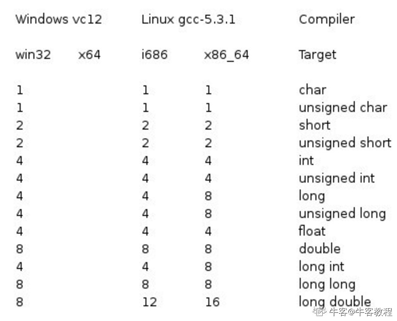
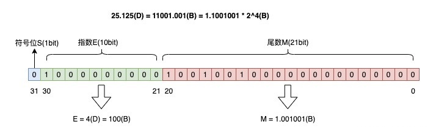
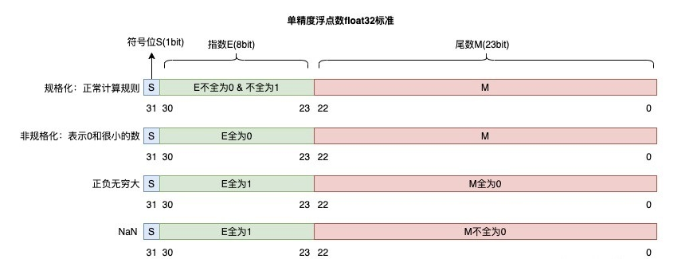
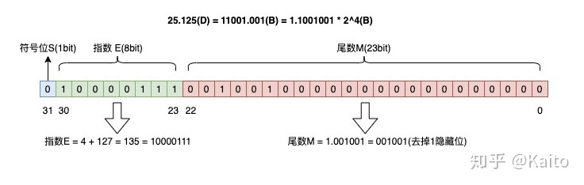

简介
===
  C语言是一种面向结构的高级语言，最初是由丹尼斯·里奇（Dennis·Retchie）与1972年在贝尔实验室为开发UNIX操作系统而设计的，后与布莱恩·柯林汉（Brain·Kernighan）在1987年制作了第一个公开可用的描述（被称为K&R标准），现在的C语言标准是由美国国家标准协会（American National Standard Institute，ANSI）于1988年制定的。当前最新的C语言标准是C11或C1X（ISO/IEC9899:2011），之前的称为C99。
  由于C语言编写的代码运行速度和汇编语言几乎一样，常用来作为系统开发语言，例如操作系统（UNIX、Linux）、语言编译器、汇编器、文本编辑器、打印机、网络驱动器、现代程序、数据库（MySQL）、语言解释器、实体工具等。

语法
===
### 基础
  C程序的结构主要包括编译器预处理指令、函数、变量、语句&表达式、注释，C以分号";"作为语句结束符，用空格来分割各个元素，有两种注释方式：
```C
// 单行注释

/* 单行注释 */

/*
 多行注释1
 ...
 多行注释n
 */
```

示例：
```C
#include <stdio.h>

int main()
{
   /* 我的第一个 C 程序 */
   printf("Hello, World! \n");

   return 0;
}
```

#### 令牌
  令牌是C程序的最小单元，主要包括关键字、标识符、常量、变量、运算符或符号。
* 关键字
  C中有一些保留字不能作为变量、常量或函数等其他标识符名称，共32个。
|名称|说明|
|---|---|
|const|声明只读变量（即常量）|
|signed|声明有符号类型变量、常量或函数返回值类型|
|unsigned|声明无符号类型变量、常量或函数返回值类型|
|char|声明字符型变量或函数返回值类型|
|int|声明整形变量、常量或函数返回值类型|
|short|声明短整型变量、常量或函数返回值类型|
|long|声明长整型变量、常量或函数返回值类型|
|float|声明浮点型变量、常量或函数返回值类型|
|double|声明双精度浮点型变量、常量或函数返回值类型|
|void|声明无参数或无返回值函数，声明无类型指针（void \*）|
|auto|声明自动变量|
|register|声明寄存器变量|
|if|if条件语句关键字|
|else|if条件语句其他分支|
|switch|switch语句关键字|
|case|switch语句自定义分支|
|default|switch语句的默认分支|
|break|跳出当前switch/for/while/do-while循环|
|for|for循环语句关键字|
|do|do-while循环语句关键字|
|while|while或do-while语句的循环条件|
|continue|结束当前for/while/do-while循环，开始下一轮循环|
|goto|无条件跳转语句|
|return|函数返回语句（可以带参数也可以返回空）|
|enum|声明枚举类型|
|struct|声明结构体类型|
|union|声明联合体类型|
|typedef|给数据类型起别名（待补充）|
|extern|声明外部引用的变量、常量或函数等|
|static|声明静态变量、常量或函数|
|sizeof|计算变量、常量或数据类型的大小（字节）|
|volatile|说明变量在程序执行中科被隐含地改变（待补充）|

  C99新增关键字：
|名称|说明|
|---|---|
|\_Bool|声明布尔类型的变量、常量或函数返回值类型，大小为1字节|
|\_Complex||
|\_Imaginary||
|inline||
|restrict||

  C11新增关键字：
|名称|说明|
|---|---|
|\_Alignas||
|\_Alignof||
|\_Atomic||
|\_Generic||
|\_Noreturn||
|\_Static_assert||
|\_Thread_local||

* 标识符
  C的标识符是用来标识变量、常量、函数、自定义类型（enum、struct、union）、宏定义等，由字母（区分大小写）、数字或下划线组成，且只能以字母或下划线开头，不允许出现标点符号或特殊字符。

### 数据类型
  数据类型决定了变量存储所占的空间，及如何解释内存中的数据，可分为以下四种。
|类型|说明|
|---|---|
|基本类型|算术类型，包括整数类型和浮点类型。|
|枚举类型|算术类型，用户自定义的只能取某些离散整数值的数据类型。|
|void类型|通常用来表明函数返回为空、函数参数为空和指针类型为空（void \*）。|
|派生类型|包括指针类型、数组类型、结构体类型、联合体类型和函数（返回值）类型。|

#### 整数类型
  整数类型的存储大小与系统位数有关，可以使用sizeof计算某个类型的大小。


#### 浮点类型
  标准浮点类型的存储大小、值范围和精度如下表所示，在头文件float.h中宏定义了这些值。
|类型|存储大小（字节）|值范围|精度（小数位）|
|---|---|---|
|float|4|FLT_MIN~FLT_MAX = 1.2e-38~3.4e38|FLT_DIG = 6|
|double|8|2.3e-308~1.7e308|15|
|long double|16|3.4e-4932~1.1e4932|19|

##### 定点数和浮点数
* 定点数
  定点数是小数点固定的数字，既可以表示整数，也可以表示小数。表示纯整数时小数点固定在最后一位，表示纯小数时小数点固定在最高位，表示整数+小数时需要约定小数点的位置，整数和小数部分分别转换成二进制形式。
  受限与小数点的位置，用定点数表示小数时，数值的范围和小数的精度是有限的。
  在现代计算机中，定点数通常用来表示整数，对于高精度的小数通常用浮点数表示。

* 浮点数
  浮点数是小数点位置漂浮不定的数字，采用科学计数法表示：
```C
V = (-1)^S * M * R^E
// 例如用科学计数法表示8.345
8.345 = 8.345 * 10^0
8.345 = 83.45 * 10^-1
8.345 = 834.5 * 10^-2
```
|符号|说明|
|---|---|
|S|符号位，取0或1，决定一个数字的正负。|
|M|尾数，用小数表示，如示例的83.45 * 10^-1的83.45。|
|R|基数，十进制R=10，二进制R=2|
|E|指数，用整数表示，如示例的83.45 * 10^-1的-1。|

  假设计算机中用32位表示一个浮点数，1位符号S、10位指数E和21位尾数M。将十进制书25.125转换为浮点数，过程如下：
1.整数部分：25(D) = 11001(B)
2.小数部分：0.125(D) = 0.001(B)
3.二进制科学计数法：25.125(D) = 11001.001(b) = 1.1001001 * 2^4(B)
其中符号位S = 0，位数M = 1.1001001(B)，指数位E = 4(D) = 100(B)。
  表示为32位浮点数如下：


  IEEE754浮点数标准提供了2种浮点格式：
|格式|说明|
|---|---|
|单精度浮点数float|32位，S = 1，E = 8， M = 23|
|双精度浮点数double|64位，S = 1，E = 11， M= 52|

  为了使其表示的数字范围、精度最大化，浮点数标准还对指数和尾数进行了规定：
1.位数M的第一位总是1（1 <= M < 2），可以隐藏不写，这样单精度23位位数可以表示24位有效数字，双精度52位可以表示53位有限数字。
2.指数E是个无符号整数，表示float时占8bit，取值范围0~255，但因为指数可以时负的，所以规定在存入E时在它原本的值加上一个中间值127，这样E的取值范围位-127~128；表示double时占11bit，存入E时加上中间数1023，这样取值范围位-1023~1024。
3.指数E非全0且非全1：规格化数字，按上面的规则正常计算。
4.指数E全0，尾数非0：非规格化数，尾数隐藏位不再是1，而是0（M = 0.xxxxx），这样可以表示0和很小的数。
5.指数E全1，尾数全0：正无穷大/负无穷大（正负取决于S符号位）。
6.指数E全1，尾数非0，NaN（Not a Number）


  把25.125转换位标准的float浮点数：S = 0，M = 1.001001(B) = 001001(B)，E = 4 + 127 = 135(D) = 10000111(B)。填充到32bit中如下：


  有些小数无法精确转换成二进制，会无限循环，存储时只能被截断，导致小数精度发生损失。
  浮点数在表示的范围和精度非常大，所以计算机中通常使用浮点数来存储小数。

### 变量和常量


备注
===
* 变量只能在当前的大括号及其子括号中使用
* 常量是在程序运行期间不变的数据

参考
===
* [#pragma alias](https://docs.oracle.com/cd/E19205-01/820-1210/6nct7sd4f/index.html)
* [__attribute__((alias))](https://www.cnblogs.com/moonflow/archive/2012/08/14/2637874.html)
* [什么是定点数？](https://zhuanlan.zhihu.com/p/338588296)
* [什么是浮点数？](https://zhuanlan.zhihu.com/p/339949186?ivk_sa=1024320u)
