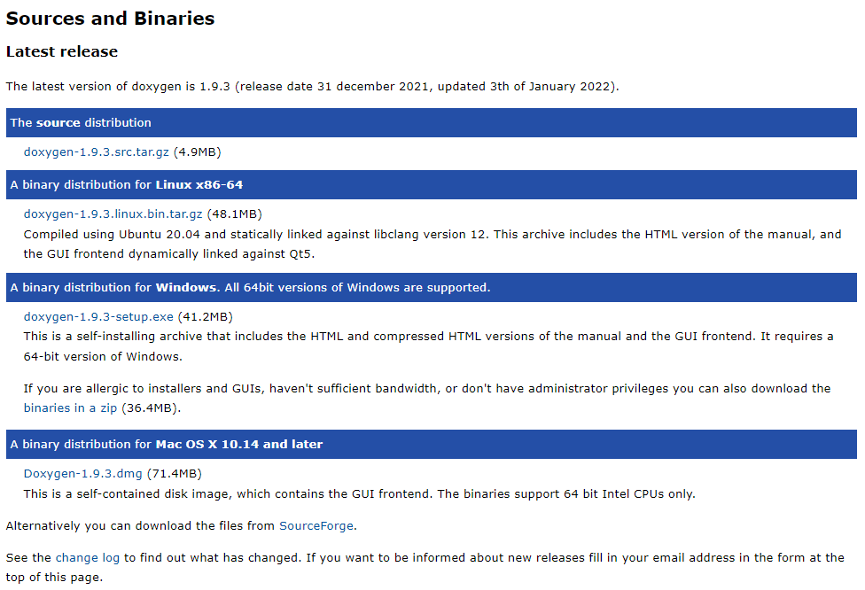
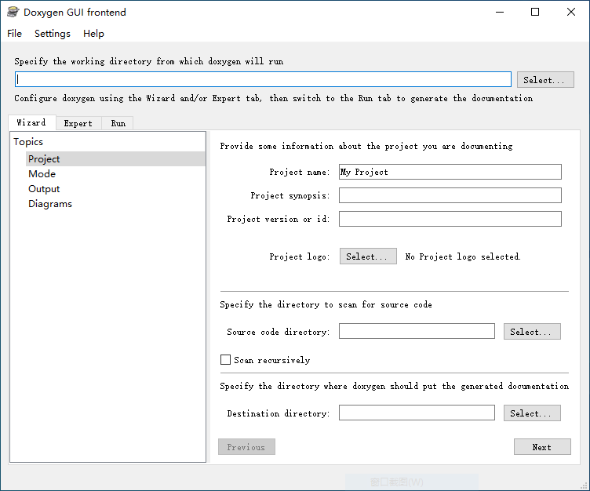

# 简介
  [Doxygen](https://www.doxygen.nl/index.html)用于将源代码中的注释转换成说明文档，只需要在写注释的时候按照Doxygen的格式即可。
  目前Doxygen支持的语言有C,C++,Objective-C, C#, PHP, Java, Python, IDL (Corba, Microsoft, and UNO/OpenOffice flavors), Fortran, VHDL等，可以导出为HTML,LaTex,RTF(MS-Word), PostScript, hyperlinked PDF, compressed HTML和Unix Man Page等格式。
  Doxygen可以自动地将各种元素之间的关系（依赖、继承、协作等）可视化，还可以配置从源文件中提取代码结构。

# 使用
## 格式

## 软件
### 下载和安装
* Doxygen
  进入Doxygen主页，点击左侧的[Downloads](https://www.doxygen.nl/download.html)进入下载页面，可以下载源代码手动编译安装，也可以直接下载合适的安装包。

* [Moritz](https://sourceforge.net/projects/moritz/)
  Eckard Klotz开发的插件，可以将C/C++源代码的函数和方法生成html格式的NS（Nassi-Shneiderman）图。

* graphviz
  Doxygen使用graphviz自动生成类之间和文件之间的调用关系图。

* Windows Help Workshop
  Doxygen可以使用这个工具生成CHM格式的文档。

* 配置

* 导出

# 参考
* [Doxygen使用教程（个人总结）](https://blog.csdn.net/zwl1584671413/article/details/82799483)
* [Nassi-Shneiderman diagrams](https://m2.allhistory.com/detail/5924603f55b54278ac03bedb)