简介
===
  [Redmine中文版](http://www.redmine.org.cn/)

教程
===
## 基础
### 注册
  点右上角注册按钮，设置登陆名、密码、姓名和邮件，以及可选的用户语言。
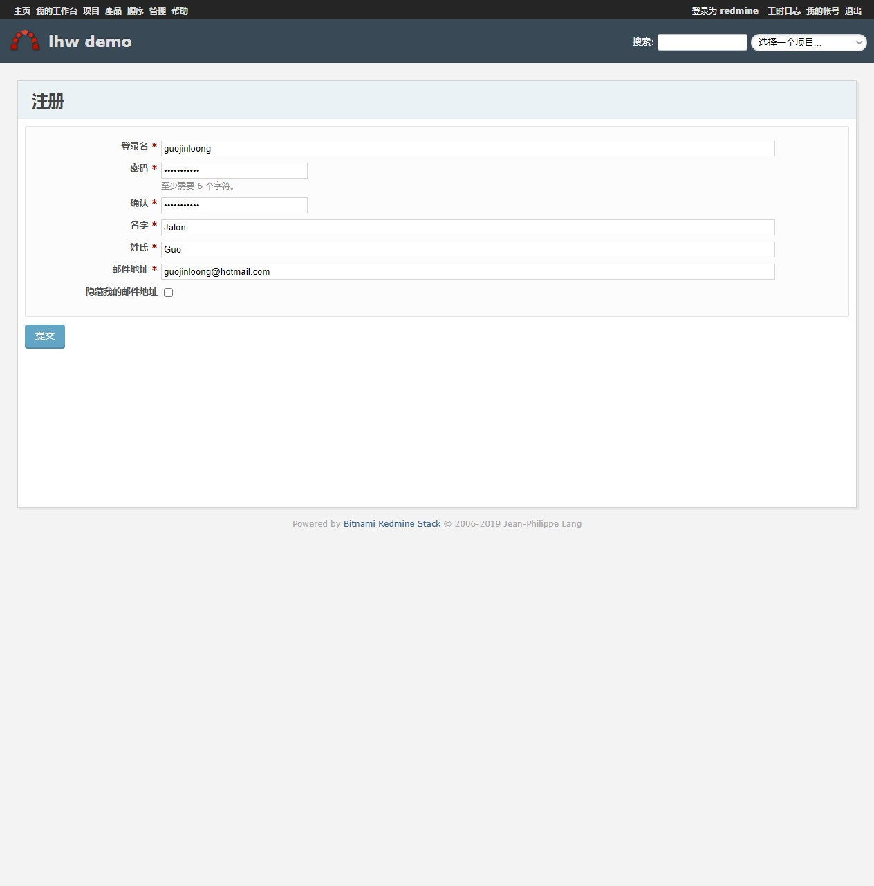

  注册需管理员开启允许用户注册功能，支持以下几种激活方式。
* 通过邮件认证激活，点击邮件接收的激活链接即可激活刚注册的账号。
* 用户注册后需要等待管理员手动激活账户。
* 用户注册后自动激活账号并登录系统。
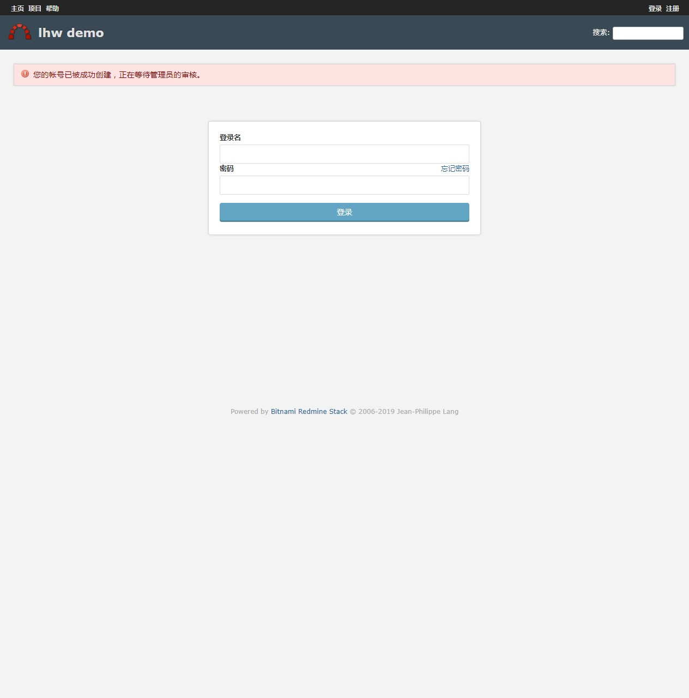

### 登陆
  点右上角登陆按钮，输入登陆名和密码登录。

#### 我的账号
  点击右上角我的账号，可以修改姓名和邮箱，以及时区和接收邮件的设置。
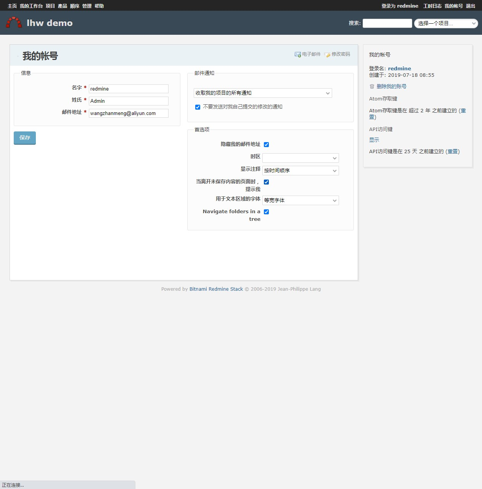

#### 我的工作台
  显示所参与的项目的各种信息块，默认启动两个模块：指派给我的问题和已报告的问题。
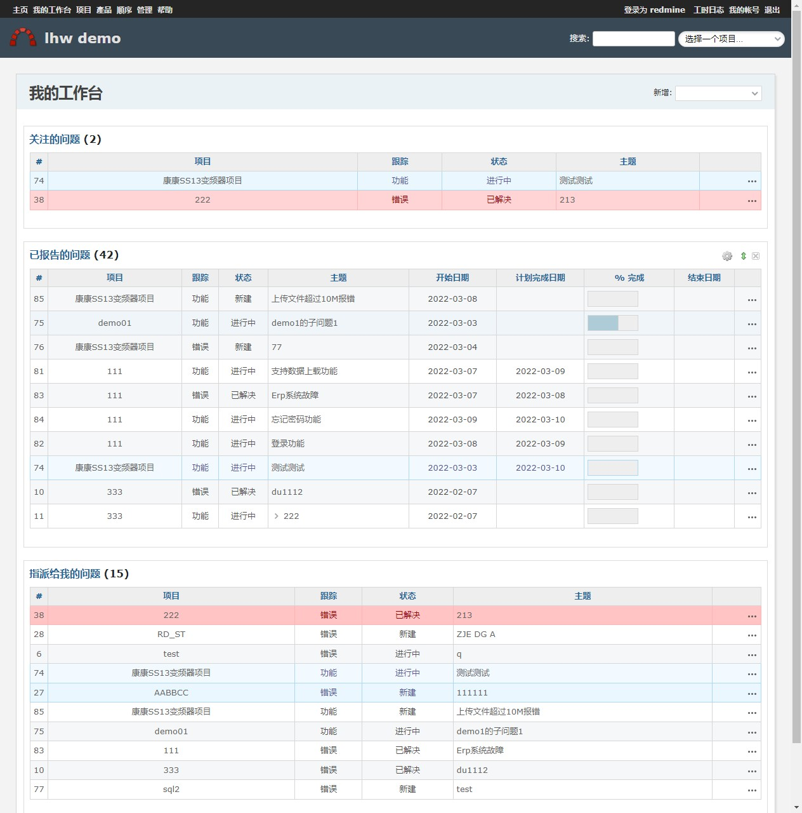

  可以点击右上角新增信息块，定制我的工作台。
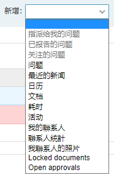

|模块|说明|
|---|---|
|关注的问题|显示跨项目的当前用户关注的问题列表，包括问题的ID、所属项目、跟踪类型、完成状态和主题等|
|已报告的问题|显示跨项目的由当前用户报告的问题列表，包括问题的ID、所属项目、跟踪类型、完成状态和主题等|
|指派给我的问题|显示跨项目的指派给当前用户的问题列表，包括问题的ID、所属项目、跟踪类型、完成状态和主题等|
|日历|显示跨项目的每周日历概述|
|文档|显示跨项目的最近文档概述|
|最近的新闻|显示跨项目的最近新闻概述|
|耗时|显示跨项目的关于当前用户最近7天工时的概述|
|跟踪的问题|显示跨项目的由当前用户跟踪的问题列表|

## 项目
  点击左上方的项目选项卡，可以看到当前用户的所有项目。
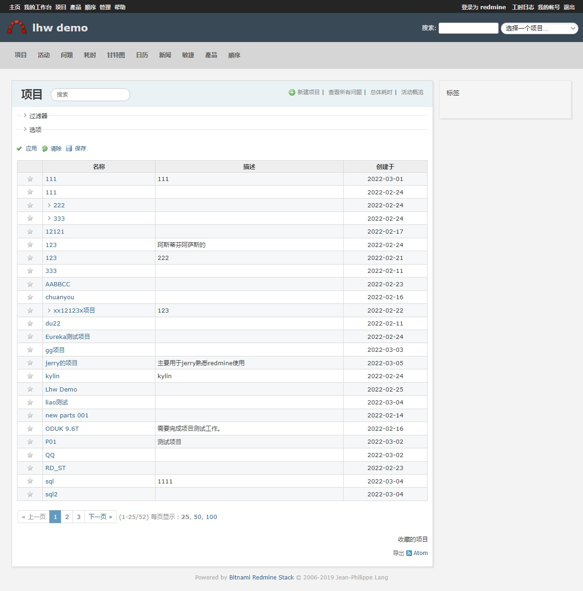

### 概述
  点击任意一个项目，首先显示该项目的概述。
* 问题跟踪：列出了目前项中每一种问题跟踪标签的打开数量以及总共数量
* 成员：列出该项目组的所有成员
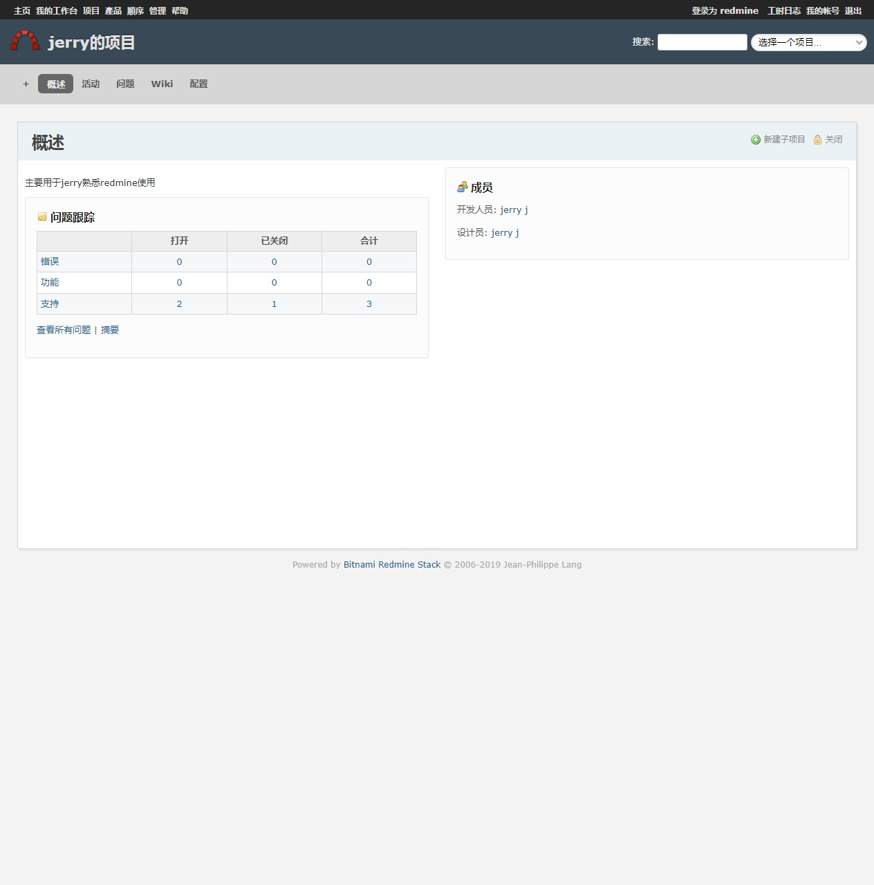

### 活动
  点击左上方的活动选项卡，显示该项目所有活动的历史记录，包括问题、变更、新闻、文档、文件、Wiki编辑记录、帖子和耗时，可以在右边栏选择显示哪类活动。
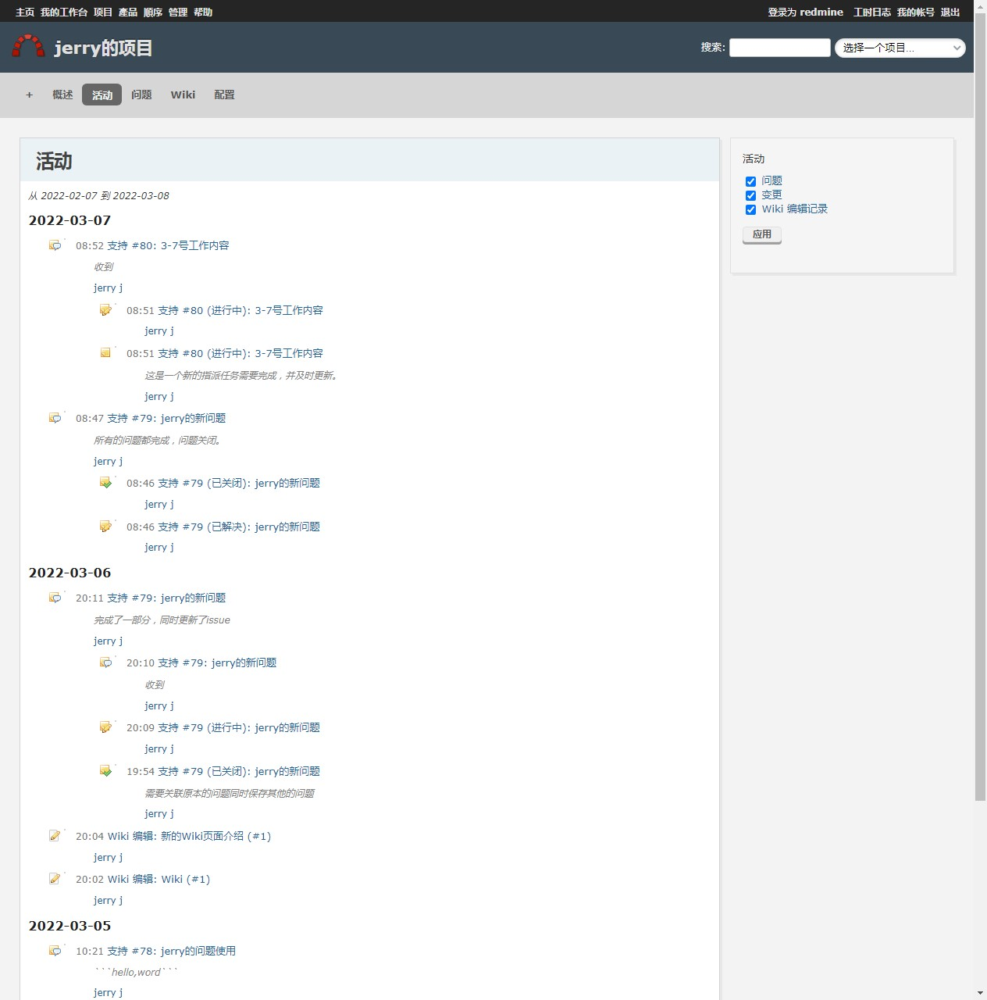

### 问题
  问题是redmine的核心业务，一个问题绑定到一个项目，由某一用户创建，可以关联到某一版本等等。
  点击左上方的问题选项卡，首先看到该项目的问题列表，默认显示所有处于打开状态的问题。
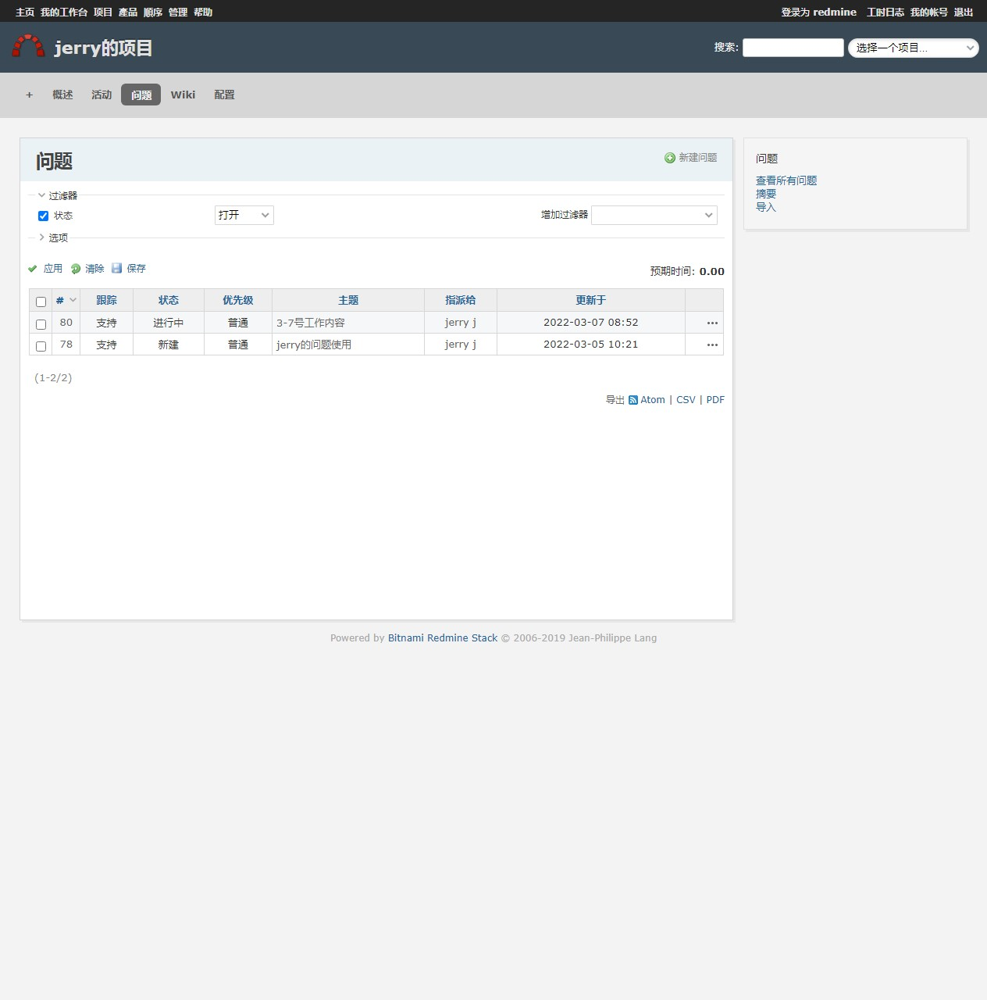

* 过滤器
  默认添加状态过滤器且为打开状态，可以手动添加其他过滤器，然后点应用按钮刷新问题列表，点击清除按钮删除设置的过滤器。可以点击某个过滤器右侧的小+号，为该过滤器选择多个值，按住ctrl键，在显示的选择列表中选择多个值。

* 自定义查询
  在上一步添加的过滤器，刷新页面后就会消失。这时可以点击保存按钮，建立自定义查询，输入新建查询的名称，以及过滤器和其他属性的设置，保存后将出现在问题列表的右边栏中。

* 快捷菜单
  在问题列表中，右键某个问题出现快捷菜单，包括编辑、状态、跟踪、优先级、指派给、%完成、喜好、关注者、关注、复制和删除。
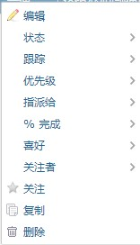

* 批量编辑问题
  在问题列表中，勾选问题左侧的复选框或者按住ctrl键同时选择多个问题，然后右键选择快捷菜单，可以同时对选中的多个问题进行批量编辑。

* 边栏
  边栏包括了问题区域和自定义查询区域。
  问题区域包括查看所有问题（从自定i义查询页面跳回问题列表页面）、摘要（从项目级别上查看问题的概述）。
  自定义查询区域列出了所有自定义查询的选项。

#### 问题描述
  点击某个问题的主题链接，查看问题的具体描述。
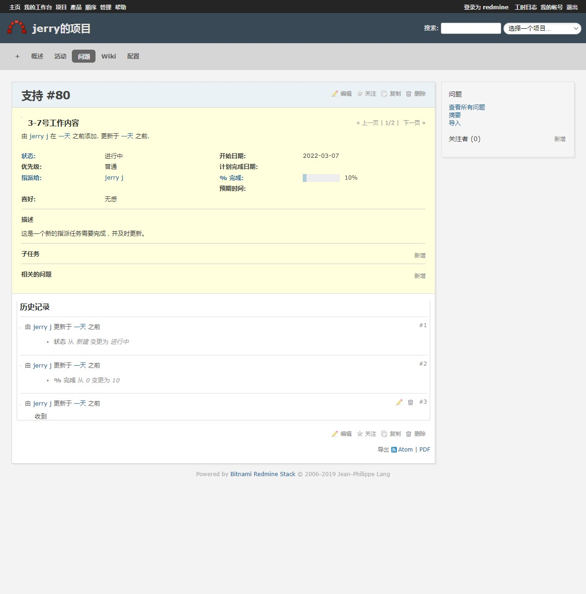

* 相关的问题
  将某一问题与其他问题建立关联，点击相关问题区域的新增按钮，建立问题关联，包括以下关联类型：
|关联类型|说明|
|重复||
|阻挡||
|优先于||
|跟随于||

* 登记工时
  点击右上方的登记工时按钮，输入问题iD、日期、小时（可写1，1h，1hour，2hours，30m，30min，1h30，1h30m）、注释等。如果问题字段为空，那么该工时就属于整个项目的工时。
  跟踪解决某一具体问题所花费的时间，通过填写预期时间，项目经理可以根据你的进度更好的指定项目计划。同时实时跟踪与项目成员建立了关联，从而有效的度量了每个成员的工作情况。

#### 新建问题
  点击左上方的+号新建问题，输入主题、描述、跟踪类型（缺陷、功能、支持）等。在某个项目下新建问题，需要有该项目新建问题的权限。
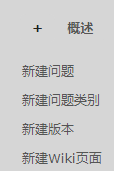
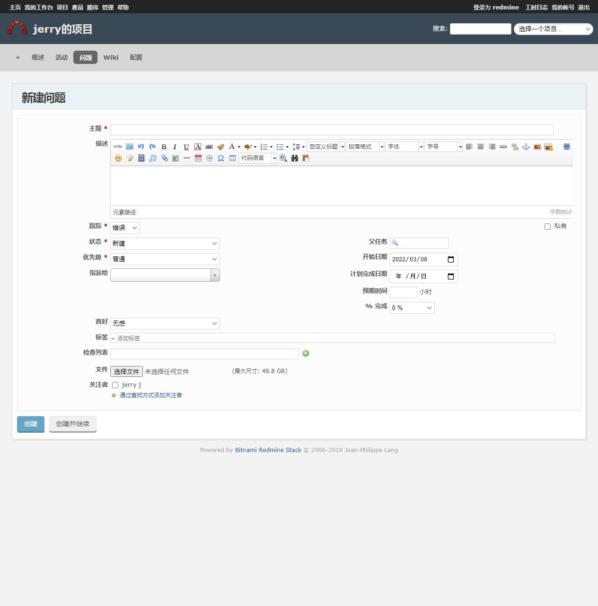

### 路线图
  路线图提供了一个更高级别的基于项目版本的对于整个问题跟踪系统的概述，可以帮助指定项目计划，管理项目开发。
  点击右上方的路线图选项卡，可以查看当前项目的进展状态：版本名称、完成时间、完成进度（根据所有问题的完成度统计目标版本的完成度）和目标版本相关联的问题列表。
  如果有权限，可以为版本添加一个Wiki页面，描述当前版本的一些主要事件。
  路线图右边栏可以选择显示跟踪标签，所有版本链接及是否显示已完成的版本。

#### 新建版本
  点击左上方的+号新建版本，输入名称、描述、Wiki页面等，点击创建完成。
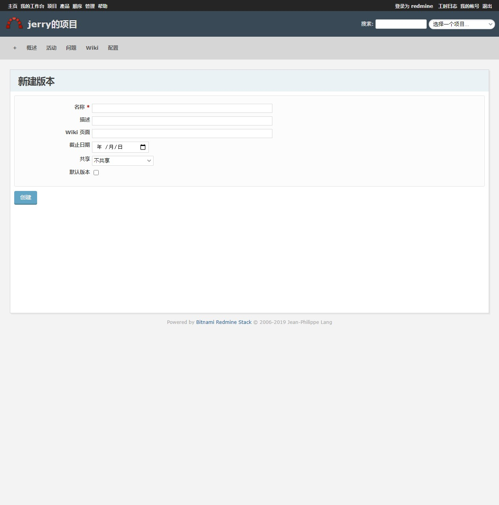

### 日历
  点击左上方的日历选项卡，显示一个按月份的项目预览，可以看到一个项目起止日期。

### 甘特图
  点击左上方的甘特图选项卡，显示问题的起止日期以及版本的截止日期。

### 新闻
  点击左上方的新闻选项卡，发布关于项目的新闻条目，由标题、概述和详细信息组成，前两个会被显示在项目概述页面的最近新闻部分，点击该新闻条目可查看详细信息。
  如果有权限的话可以添加、编辑、删除新闻。

### 文档
  点击左上方的文档选项卡，然后点击右上方的+号新建文档，默认支持两种文档类型：用户文档和技术文档。

### 文件
  点击左上方的文件选项卡，可以上传项目需要用到的其他资源，如图片、视频等。

### Wiki
#### 语法

参考
===
* [Redmine中文用户手册- redmine中文网
](https://www.toutiao.com/i6844874409505718798/?wid=1646706566787)
* [Textile 格式化](https://www.redmine.org/projects/redmine/wiki/SimplifiedChineseWikiFormatting)