简介
===
  [U-Boot](https://www.denx.de/wiki/U-Boot/)全称Universal Boot Loader，进入官网，主页如下：


  点击Source Code进入U-Boot Source Code页面，可以访问GIT仓库或FTP服务器下载源码。
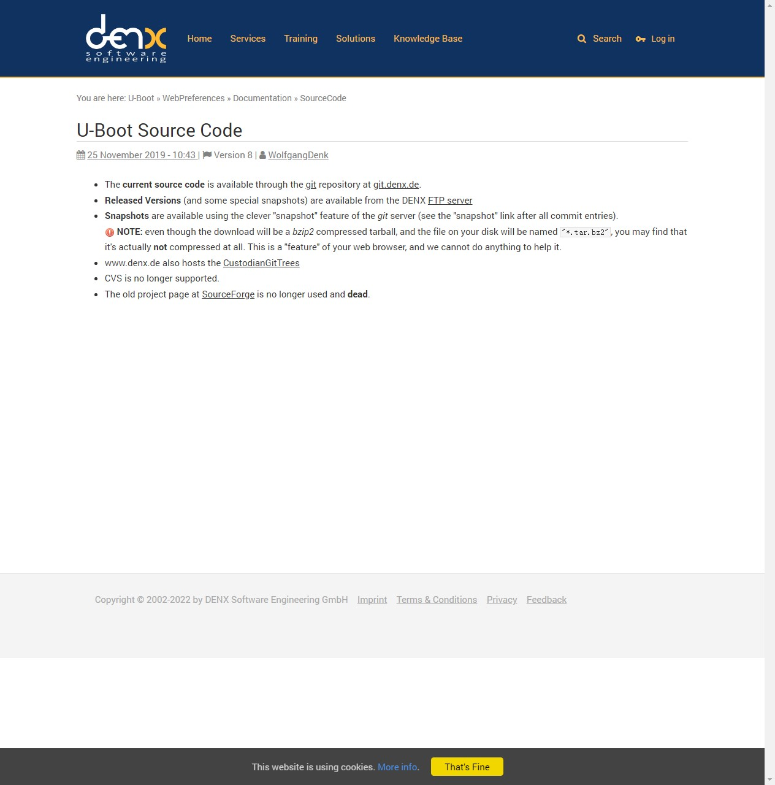

  U-Boot启动，打印信息如下：
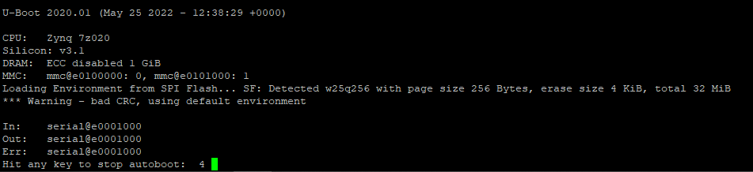

```shell
U-Boot 2020.01 (May 25 2022 - 12:38:29 +0000) # U-Boot版本号和编译时间

CPU:   Zynq 7z020 # CPU型号
Silicon: v3.1 # CPU版本
DRAM:  ECC disabled 1 GiB # DRAM大小为1GB，禁止ECC。
MMC:   mmc@e0100000, mmc@e0101000: 1 # 检测到两个MMC控制器，mmc@e0100000: 0接的是SD卡，mmc@e0101000: 1接的是eMMC。
Loading Environment from SPI Flash... SF: Detected w25q256 with page size 256 Bytes, erase size 4 KiB, total 32 MiB # 检测到SPI Flash w25q256，大小为32MB。
*** Warning - bad CRC, using default environment # U-Boot没有在Flash中找到有效的环境变量，使用默认的环境变量（可以使用saveenv把默认环境编辑写入Flash，下次启动就不会警告了）。

In:    serial@e0001000 # 标准输入为serial@e0001000即UART1
Out:   serial@e0001000 # 标准输出为serial@e0001000即UART1
Err:   serial@e0001000 # 标准错误为serial@e0001000即UART1
Hit any key to stop autoboot:  4 # 在4秒（默认，可以通过环境变量bootdelay修改）倒计时内按下任意键即可进入命令行模式，否则将自动启动Linux内核。
```

U-Boot
===
## 命令
  U-Boot提供了很多命令，可以配置是否使能，也可以自定义命令。支持TAB键自动补全，上下键查看历史命令。
### 信息查询命令

|命令|说明|
|---|---|
|```help```|显示U-Boot支持的所有命令的简要描述。|
|```help command ...```|查看一个或多个命令的详细的使用方法。|
|```?```|help的别名，完全等效。|
|```bdinfo```|查看板子信息，如启动参数（boot_params）、DRAM起始地址和大小（DRAM bank、start、size）、串口波特率（baudrate）、堆栈起始地址（sp start）等。|
|```version```|查看U-Boot版本号及编译信息。|

### 环境变量操作命令
|命令|说明|
|---|---|
|```print [-a]```|打印U-Boot所有环境变量的值(都是字符串），如baudrate、board_name、boot_img、bootcmd、bootdelay等。|
|```print name ...```|打印一个或多个环境变量的值。|
|```printenv```|与print相同。|
|```setenv [-f] name value ...```|设置环境变量，U-Boot启动时会从Flash中加载环境变量到DRAM中，该命令修改的是DRAM中的值，断电后即丢失。如果变量不存在，会自动创建。可以跟多个value，用空格分开。|
|```setenv [-f] name```|删除环境变量。|
|```saveenv```|保存环境变量，将DRAM中的环境变量保存到Flash，断电重启后依然有效。|
注：
1. U-Boot中的数字都是十六进制的，前缀“0x”可写可不写。

### 内存操作命令
|命令|说明|
|---|---|
|```md [.b, .w, .l] address [# of objects]```|显示内存，```[.b, .w, .l]```分别对应byte、word和long，即分别以1、2、4字节显示，address为内存起始地址，```[# of objects]```为数据长度，其单位不一定是字节，而是由```[.b, .w, .l]```决定。如果没有指定```[.b, .w, .l]```项即```md```，与```md.l```等效；如果没有指定```[# of objects]```项，则默认为16。|
|```nm [.b, .w, .l] address```|修改内存，输入地址后回车，显示当前值并等待输入新值，输入后回车，可以看到当前值已经变为输入的新值，可以继续修改，也可以输入“q”后回车退出。|
|```mm [.b, .w, .l] address```|连续修改内存，与nm相似，但地址会自增。|
|```mw [.b, .w, .l] address value [count]```|内存填充，使用value值填充起始地址为address，长度为count的一段内存。|
|```cp [.b, .w, .l] source target count```|内存拷贝，将DRAM中的数据从一段内存拷贝到另一段内存中。source为源地址，target为目的地址，长度为count。|
|```cmp [.b, .w, .l] addr1 addr2 count```|内存比较，比较DRAM中两段内存的数据是否相等。|
|```mtest [start [end [pattern [iterations]]]]```|简单的内存读写测试命令。|
注：
1. ```[.b, .w, .l]```和```md```中间不要加空格。

### 网络操作命令
  U-Boot中支持网络功能，并提供了一些网络操作命令，便于调试。此外，还有一些网络相关的环境变量，用来配置网络功能。

|环境变量|说明|
|---|---|
|ethaddr|MAC地址|
|ipaddr|IP地址|
|netmask|子网掩码|
|gatewayip|网关地址|
|serverip|服务器IP地址|
注：
1. ipaddr、netmask和gatewayip可以手动设置，也可以使用```dhcp```命令从路由器获取。

|命令|说明|
|---|---|
|```ping pingAddress```|发送ICMP ECHO_REQUEST，通常用来测试网络通不通。|
|```dhcp```|自动从路由器获取ipaddr、netmask和gatewayip。|
|```dhcp [loadAddress] [[hostIPaddr:]bootfilename]```|使用DHCP/TFTP协议从网络启动系统镜像。|
|```tftpboot [loadAddress] [[hostIPaddr:]bootfilename]```|使用TFTP协议从网络下载系统镜像（zImage）和设备树。|
|```nfs [loadAddress] [[hostIPaddr:]bootfilename]```|使用NFS协议从网络下载系统镜像（zImage）和设备树，常用于网络调试内核。|
注：
1. 使用tftpboot或nfs命令下载完zImage后，可以使用```od -tx1 -vN 0x100 zImage```或```xxd -g 1 -k 0x100 zImage```检查下载到DRAM中的数据是否与源文件一致。
2. 使用tftpboot和nfs时，前者bootfilename只需要输入文件名，后者需要输入完整路径。

### MMC操作命令
  U-Boot支持eMMC和SD卡，通称为MMC设备，U-Boot中使用```mmc```系列命令操作MMC设备，后面可以跟不同参数以实现不同的功能，输入```? mmc```查看详细使用方法。
|命令|说明|
|---|---|
|```mmc info```|显示当前MMC设备的信息，还有个```mmcinfo```命令，与之相同。|
|```mmc read addr blk# cnt```|从MMC读取数据|
|```mmc write addr blk# cnt```|向MMC写入数据|
|```mmc erase blk# cnt```|擦除MMC数据|
|```mmc rescan```|重新扫描MMC设备|
|```mmc part```|列出当前MMC设备的可用分区|
|```mmc dev [dev] [part]```|显示或设置当前MMC设备及分区|
|```mmc list```|列出可用的MMC设备|
|```mmc hwpartition [args...]```|设置MMC设备分区，只需要设置一遍，且需要重启以生效。<br>args为参数项，以512字节的块为单位：<br>```[user [enh start cnt] [wrrel {on|off}]]```：设置用户数据区属性<br>```[gp1|gp2|gp3|gp4 cnt [enh] [wrrel {on|off}]]```：通用分区<br>```[check|set|complete]```：模式，分区设置完成|
|```mmc setdsr <value>```|设置DSR寄存器的值|

### 文件系统操作命令
  U-Boot支持FAT和EXT格式文件系统，并提供相应的操作命令。
|命令|说明|
|---|---|
|```fstype <interface> <dev>:<part>```|显示interface接口上dev设备part分区的文件系统格式。|
|```fstype <interface> <dev>:<part> <varname>```|设置环境变量，值为interface接口上dev设备part分区的文件系统类型。|
|```fatinfo <interface> [<dev[:part]>]```|打印interface接口上dev设备part分区的文件系统信息，例如```fatinfo mmc 0:1```。|
|```fatls <interface> [<dev[:part]>] [directory]```|列出interface接口上dev设备part分区的directory路径下的所有文件（包括文件夹）。|
|```fatmkdir <interface> [<dev[:part]>] <directory>```|在interface接口上dev设备part分区创建文件夹。|
|```fatrm <interface> [<dev[:part]>] <filename>```|删除interface接口上dev设备part分区的指定文件。|
|```fatsize <interface> <dev[:part]> <filename>```|显示interface接口上dev设备part分区的指定文件的大小。|
|```fatload <interface> [<dev[:part]> [<addr> [<filename> [bytes [pos]]]]]```|将interface接口上dev设备part分区的指定文件读取到DRAM中，addr为内存起始地址，filename为要读取的文件名，bytes为要读取的数据大小（0表示读取整个文件），pos为要读取的数据当对于文件首地址的偏移（0或省略表示从文件收地址开始读取）。|
|```fatwrite <interface> <dev[:part]> <addr> <filename> [<bytes> [<offset>]]```|将DRAM中的数据写入到interface接口上dev设备part分区的指定文件，addr为内存起始地址，filename为要写入的文件名，bytes为要写入的数据大小（必需且不能为0），offset为要写入的数据当对于文件首地址的偏移（0或省略表示从文件收地址开始写入）。|
|```ext2load <interface> [<dev[:part]> [addr [filename [bytes [pos]]]]]```|参考fatload|
|```ext2ls <interface> <dev[:part]> [directory]```|参考fatls|
|```ext4load <interface> [<dev[:part]> [addr [filename [bytes [pos]]]]]```|参考fatload|
|```ext4ls <interface> <dev[:part]> [directory]```|参考fatls|
|```ext4size <interface> <dev[:part]> <filename>```|参考fatsize|
|```ext4write <interface> <dev[:part]> <addr> <absolute filename path>```|参考fatwrite|

### 系统引导命令
  U-Boot本质是引导操作系统，提供了相应的系统引导命令。先通过文件系统操作命令fatload、ext2load、ext4load或网络操作命令tftpboot、nfs将系统镜像和设备树文件下载到DRAM中，然后使用系统引导命令bootm、bootz或boot命令启动系统。
|命令|说明|
|---|---|
|```bootm [addr [arg ...]]```|从内存中启动系统镜像，用于mkimage工具处理过的内核镜像，ZYNQ使用的image.ub属于U-Boot fitImage，包含linux内核和设备树，可以将image.ub下载到DRAM中，然后使用bootm启动。例如：<br>```tftpboot 10000000 image.ub```<br>```bootm 10000000```<br>可以使用netboot环境变量，运行```run netboot```即可。|
|```bootz [addr [initrd[:size]] [fdt]]```|从内存中启动zImage镜像，addr是zImage文件在DRAM中的地址，initrd是initrd文件（INITRAM根文件系统）在DRAM中的地址，如果不使用initrd用”-“代替，fdt是设备树文件（system.dtb）在DRAM中的地址。例如：<br>```tftpboot 00000000 zImage```<br>```tftpboot 05000000 system.dtb```<br>```bootz 00000000 - 05000000```|
|```boot```|默认的启动命令，前面U-Boot倒计时结束后就是执行该命令，通过运行“bootcmd”环境变量来启动系统，可以修改该变量改变启动方式。|
|```reset|复位CPU，重启系统。|
|```run var [...]```|运行环境变量var中的命令，例如```run bootcmd```。|

## 源码
### 文件和目录结构
  解压U-Boot源码，文件和工程目录结构如下图所示。
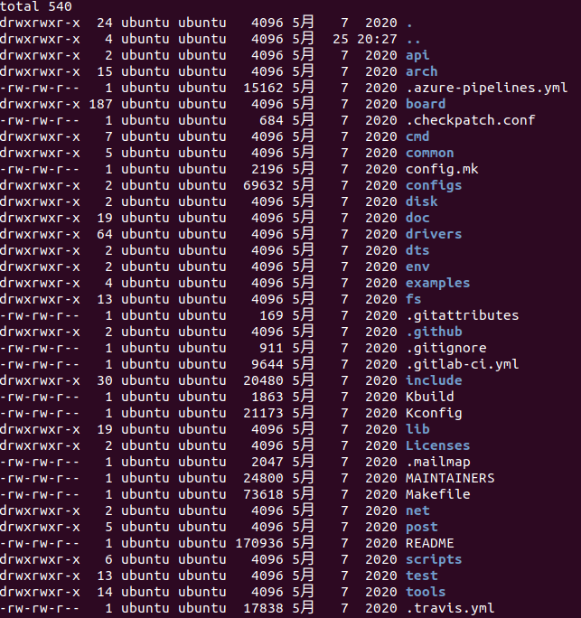

|名称|说明|
|---|---|
|api/|与硬件无关的API函数|
|arch/|与架构体系有关的代码|
|board/|不同板子的定制代码|
|cmd/|命令相关代码|
|common/|通用代码|
|configs/|配置文件|
|disk/|磁盘分区相关代码|
|doc/|文档|
|drivers/|驱动代码|
|dts/|设备树|
|env/|环境变量|
|examples/|示例代码|
|fs/|文件系统|
|include/|头文件|
|lib/|库文件|
|Licenses/|许可证相关文件|
|net/|网络相关代码|
|post/|上电自检程序|
|scripts/|脚本文件|
|test/|测试代码|
|tools/|工具文件夹|
|.github/<br>.gitattributes<br>.gitignore<br>.gitlab-ci.yml|git相关文件|
|.mailmap|邮件列表|
|.checkpath.conf|路径检查配置文件|
|config.mk|某个Makefile会调用此文件|
|Kbuild|用于生成一些和汇编有关的文件|
|Kconfig|图形配置界面描述文件|
|MAINTAINERS|维护者联系方式文件|
|Makefile|顶层Makefile文件|
|README|相当于帮助文档|

#### arch
  arch文件下存放着和架构有关的文件，如arm、avr32、riscv等。
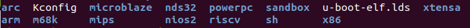

  arm文件夹如下，mach开头的文件夹是与具体的设备有关的，如mach-exynos是三星的exynos系列CPU相关文件。
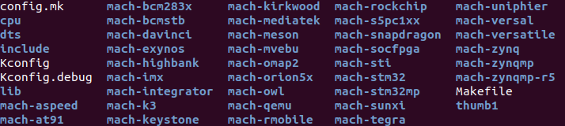

  mach-zynq文件夹存放着与ZYNQ相关的文件。
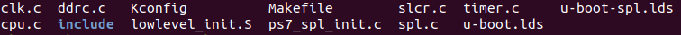

  另外，cpu文件夹也是和CPU架构有关的，包含了多种ARM架构。ZYNQ使用的是Cortex-A9内核，属于armv7架构，对应armv7文件夹，分析U-Boot启动源码时需要重点关注。u-boot.lds是ARM架构处理器使用的U-Boot链接脚本文件。
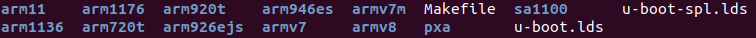

#### board
  board文件夹下包含了很多以SoC厂商命名的文件夹，如xilinx、ti、freescale、samsung、huawei等，在这些文件夹下都有很多基于其推出的SoC平台的开发板所对应的板级支持文件。
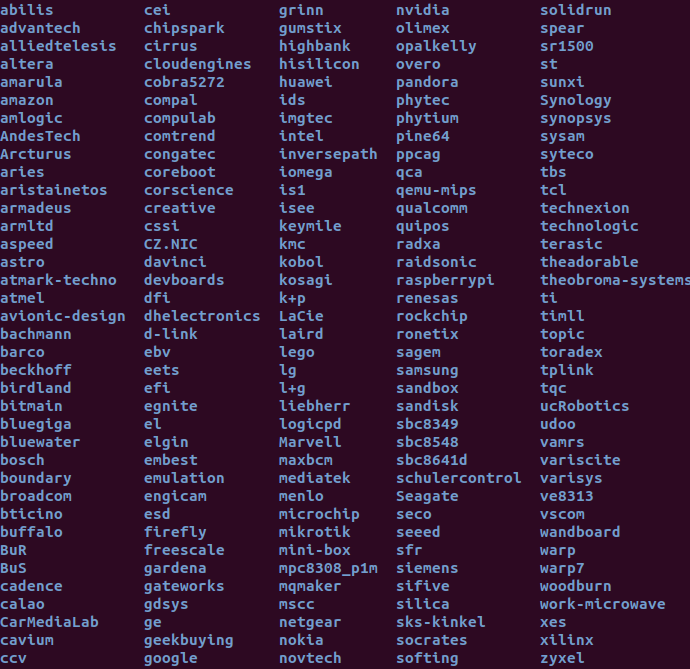

  xilinx文件夹如下，其中microblaze-generic表示使用microblaze软核的FPGA开发板，zynq表示使用ZYNQ-7000系列芯片的开发板，zynqmp表示使用ZYNQ MP系列芯片的开发板。
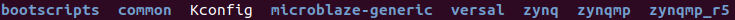

  zynq文件夹如下，zynq-microzed对应microzed开发板，zynq-zed对应zed开发板，也可以为自己的板子创建文件夹。
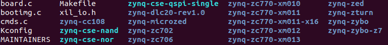

#### configs
  configs文件夹包含了很多U-Boot配置文件，半导体厂商或开发板厂商会制作好一个配置文件，统一命名为“xxx_defconfig”，可以在其基础上添加自定义功能。
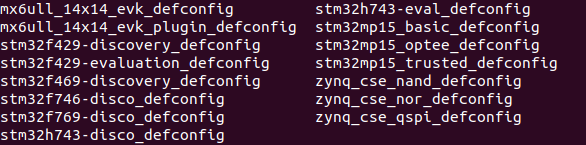

#### Makefile
  对于大型项目，不会把所有的源码放在同一个目录中，而是按功能模块划分，放在各自的目录中。每个功能模块目录下都有一个Makefile，只负责本模块的编译链接工作。这样所有的编译链接工作不用全部放到一个Makefile文件中，可以使Makefile简洁明了。
  U-Boot源码根目录下的Makefile文件是顶层Makefile，它会调用各个功能模块目录下的Makefile文件，以及其他复杂的工作。

#### README
  README文件描述了U-Boot的详细信息，包括如何编译、各个文件夹的含义、相应的命令等。

### 顶层Makefile
  通过分析Makefile可以了解整个工程的组织结构，先从顶层Makefile开始，然后层层分析子Makefile，可以更清晰的理解U-Boot源码。

#### 版本号
```shell
VERSION = 2020 # 主版本号
PATCHLEVEL = 01 # 补丁版本号
SUBLEVEL = # 次版本号
EXTRAVERSION = # 附加版本信息，通常不使用
NAME = # 名字，通常不使用
```

#### MAKEFLAGS变量
  make支持递归调用，在Makefile中可以使用make来执行其他的Makefile文件，工程编译时主目录的Makefile会自动调用子目录下的Makefile，以此完成所有子目录的编译。
  顶层Makefile在调用子目录中的Makefile编译时，可以通过"export"向子make传递环境变量，使用"unexport"取消传递。有两个特殊的环境变量："SHELL"和"MAKESFLAG"，在整个make过程中始终自动传递给子make。
```shell
MAKEFLAGS += -rR --include-dir=$(CURDIR)
```
  使用"+="追加参数，"-rR"禁止使用内置的隐含规则和变量定义，"--include-dir"指明搜索路径，"$(CURDIR)"表示当前目录。

#### 命令输出
  编译U-Boot需要用到交叉编译工具，如arm-linux-gnueabihf-gcc、arm-none-eabi-gcc等，使用方法如下：
```shell
make ARCH=arm CROSS_COMPILE=arm-none-eabi- distclean
make ARCH=arm CROSS_COMPILE=arm-none-eabi- zynq_cse_qspi_defconfig
make ARCH=arm CROSS_COMPILE=arm-none-eabi- [V=1] -j4
```

  ARCH指定目标架构为arm，CROSS_COMPILE指定所使用的交叉编译器为arm-none-eabi-gcc（只需要写出前缀即可）。
  第一条命令清除工程，包括生成的文件 、配置文件、各种备份文件、编辑器备份和补丁文件。
  第二条命令配置U-Boot，如自定义架构和外设等，使用配置文件zynq_cse_qspi_defconfig（在configs文件夹下），也可以使用图形化界面配置。
  第三条命令编译工程，V（verbose缩写）指定编译模式，默认为0（可以不写），表示quiet模式，只显示短命令，如CC、LD等，V=1显示完整的命令，便于调试；-j指定编译核数为4核，加快编译速度。
  使用quiet模式编译，部分过程如下：
```shell
scripts/kconfig/conf  --syncconfig Kconfig
  CHK     include/config.h
  UPD     include/config.h
  CFG     u-boot.cfg
  GEN     include/autoconf.mk.dep
  CFG     spl/u-boot.cfg
  GEN     include/autoconf.mk
  GEN     spl/include/autoconf.mk
  CHK     include/config/uboot.release
  ...
  LD      u-boot
  OBJCOPY u-boot.srec
  OBJCOPY u-boot-nodtb.bin
  SYM     u-boot.sym
  COPY    u-boot.bin
  FDTGREP dts/dt-spl.dtb
  MKIMAGE u-boot.img
  LD      u-boot.elf
  ...
  LD      spl/arch/arm/cpu/built-in.o
  CC      spl/arch/arm/cpu/armv7/cache_v7.o
  CC      spl/arch/arm/mach-zynq/timer.o
  AS      spl/arch/arm/lib/vectors.o
  ...
  LD      spl/u-boot-spl
  OBJCOPY spl/u-boot-spl-nodtb.bin
  COPY    spl/u-boot-spl.bin
  MKIMAGE spl/boot.bin
===================== WARNING ======================
CONFIG_OF_EMBED is enabled. This option should only
be used for debugging purposes. Please use
CONFIG_OF_SEPARATE for boards in mainline.
See doc/README.fdt-control for more info.
====================================================
  CFGCHK  u-boot.cfg
```

  顶层Makefile中控制命令输出的代码如下：
```shell
ifeq ("$(origin V)", "command line")
  KBUILD_VERBOSE = $(V)
endif
ifndef KBUILD_VERBOSE
  KBUILD_VERBOSE = 0
endif

ifeq ($(KBUILD_VERBOSE),1)
  quiet =
  Q =
else
  quiet=quiet_
  Q = @
endif
...
ifneq ($(filter 4.%,$(MAKE_VERSION)),)	# make-4
ifneq ($(filter %s ,$(firstword x$(MAKEFLAGS))),)
  quiet=silent_
endif
else					# make-3.8x
ifneq ($(filter s% -s%,$(MAKEFLAGS)),)
  quiet=silent_
endif
endif

export quiet Q KBUILD_VERBOSE
```

  使用origin函数判断变量V是否来源于命令行，然后设置变量"quiet”和”Q"的值，用来控制编译时是否在终端输出完整的命令。
|变量名|值|作用|
|-|-|-|
|quiet|quiet\_、silent\_|有些命令会有2个版本，如"quiet\_\<cmd>"，带"quiet\_"前缀的命令执行时输出的信息少即短命令，否则输出完整的命令即长命令。当前缀为"silent\_"时什么都不输出，因为该命令不存在。当quiet值为空时，整个命令都会输出，即V=1时。|
|Q|@|在make命令前加上"@"后就不会在终端输出命令了。|
  若V=1，将"quiet”和"Q"设为空，编译时显示完整的命令；若V=0或没有定义，设置"quiet=quiet\_和Q=@"，编译时显示短命令。
  使用"make -s"编译时不输出任何信息，即静默模式。

#### 设置输出目录
  在编译时使用"make O=xxx"命令设置目标文件输出目录，可以将源文件和编译生成的文件分开，否则默认目标文件与对应源文件在相同目录。
```shell
# kbuild supports saving output files in a separate directory.
# To locate output files in a separate directory two syntaxes are supported.
# In both cases the working directory must be the root of the kernel src.
# 1) O=
# Use "make O=dir/to/store/output/files/"
#
# 2) Set KBUILD_OUTPUT
# Set the environment variable KBUILD_OUTPUT to point to the directory
# where the output files shall be placed.
# export KBUILD_OUTPUT=dir/to/store/output/files/
# make
#
# The O= assignment takes precedence over the KBUILD_OUTPUT environment
# variable.

# KBUILD_SRC is set on invocation of make in OBJ directory
# KBUILD_SRC is not intended to be used by the regular user (for now)
ifeq ($(KBUILD_SRC),)

# OK, Make called in directory where kernel src resides
# Do we want to locate output files in a separate directory?
ifeq ("$(origin O)", "command line")
  KBUILD_OUTPUT := $(O)
endif

# That's our default target when none is given on the command line
PHONY := _all
_all:

# Cancel implicit rules on top Makefile
$(CURDIR)/Makefile Makefile: ;

ifneq ($(KBUILD_OUTPUT),)
# Invoke a second make in the output directory, passing relevant variables
# check that the output directory actually exists
saved-output := $(KBUILD_OUTPUT)
KBUILD_OUTPUT := $(shell mkdir -p $(KBUILD_OUTPUT) && cd $(KBUILD_OUTPUT) \
								&& /bin/pwd)
$(if $(KBUILD_OUTPUT),, \
     $(error failed to create output directory "$(saved-output)"))

PHONY += $(MAKECMDGOALS) sub-make

$(filter-out _all sub-make $(CURDIR)/Makefile, $(MAKECMDGOALS)) _all: sub-make
	@:

sub-make: FORCE
	$(Q)$(MAKE) -C $(KBUILD_OUTPUT) KBUILD_SRC=$(CURDIR) \
	-f $(CURDIR)/Makefile $(filter-out _all sub-make,$(MAKECMDGOALS))

# Leave processing to above invocation of make
skip-makefile := 1
endif # ifneq ($(KBUILD_OUTPUT),)
endif # ifeq ($(KBUILD_SRC),)

# We process the rest of the Makefile if this is the final invocation of make
ifeq ($(skip-makefile),)

# Do not print "Entering directory ...",
# but we want to display it when entering to the output directory
# so that IDEs/editors are able to understand relative filenames.
MAKEFLAGS += --no-print-directory
```

#### 代码检查
  U-Boot在编译时可以使能代码检查，使用"make C=1"检查需要重新编译的文件，使用"make C=2"检查所有源代码，C没定义或=0则不检查。
```shell
# Call a source code checker (by default, "sparse") as part of the
# C compilation.
#
# Use 'make C=1' to enable checking of only re-compiled files.
# Use 'make C=2' to enable checking of *all* source files, regardless
# of whether they are re-compiled or not.
#
# See the file "Documentation/sparse.txt" for more details, including
# where to get the "sparse" utility.

ifeq ("$(origin C)", "command line")
  KBUILD_CHECKSRC = $(C)
endif
ifndef KBUILD_CHECKSRC
  KBUILD_CHECKSRC = 0
endif
```

#### 模块编译
  U-Boot编译时可以使用"make M=dir"（新）或"make SUBDIRS=dir"（旧）单独编译某个模块，前一个优先级更高。
```shell
# Use make M=dir to specify directory of external module to build
# Old syntax make ... SUBDIRS=$PWD is still supported
# Setting the environment variable KBUILD_EXTMOD take precedence
ifdef SUBDIRS
  KBUILD_EXTMOD ?= $(SUBDIRS)
endif

ifeq ("$(origin M)", "command line")
  KBUILD_EXTMOD := $(M)
endif

# If building an external module we do not care about the all: rule
# but instead _all depend on modules
PHONY += all
ifeq ($(KBUILD_EXTMOD),)
_all: all
else
_all: modules
endif

ifeq ($(KBUILD_SRC),)
        # building in the source tree
        srctree := .
else
        ifeq ($(KBUILD_SRC)/,$(dir $(CURDIR)))
                # building in a subdirectory of the source tree
                srctree := ..
        else
                srctree := $(KBUILD_SRC)
        endif
endif
objtree		:= .
src		:= $(srctree)
obj		:= $(objtree)

VPATH		:= $(srctree)$(if $(KBUILD_EXTMOD),:$(KBUILD_EXTMOD))

export srctree objtree VPATH

# Make sure CDPATH settings don't interfere
unexport CDPATH
```

#### 获取主机架构和系统
  定义变量HOSTARCH，使用"uname -m"获取当前主机架构，使用"sed -e s/i.86/x86/"将"i.86"替换成"x86"......
  定义变量HOSTOS，使用"uname -s"获取当前主机系统，使用"tr '[:upper:]' '[:lower:]'"将大写字母替换为小写，使用"sed -e 's/\(cygwin\).*/sygwin/'"将"cygwin.\*"替换为"cygwin"。
```shell
HOSTARCH := $(shell uname -m | \
	sed -e s/i.86/x86/ \
	    -e s/sun4u/sparc64/ \
	    -e s/arm.*/arm/ \
	    -e s/sa110/arm/ \
	    -e s/ppc64/powerpc/ \
	    -e s/ppc/powerpc/ \
	    -e s/macppc/powerpc/\
	    -e s/sh.*/sh/)

HOSTOS := $(shell uname -s | tr '[:upper:]' '[:lower:]' | \
	    sed -e 's/\(cygwin\).*/cygwin/')

export	HOSTARCH HOSTOS
```

#### 定义目标架构、交叉编译器和配置文件
  编译时使用"make ARCH=arm CROSS_COMPILE=arm-linux-gnu-eabihf-"制定目标架构和交叉编译器，也可以在顶层Makefile中指定ARCH和CROSS_COMPILE。
  "configs"目录下存储了U-Boot的初始配置文件，使用"make xxx_defconfig"后将初始配置文件复制到U-Boot源码根目录并重命名为".config"，之后使用"make menuconfig"等命令修改配置后都保存在".config"。使用"make distclean"会删除该配置文件，需要重新配置，使用"make clean"不会。
```shell
# set default to nothing for native builds
ifeq ($(HOSTARCH),$(ARCH))
CROSS_COMPILE ?=
endif

# Set default value for ARCH and CROSS_COMPILE
ARCH ?= arm
CROSS_COMPILE ?= arm-linux-gnueabihf-

KCONFIG_CONFIG	?= .config
export KCONFIG_CONFIG
...
```

#### 调用scripts/Kbuild.include
```shell
# We need some generic definitions (do not try to remake the file).
scripts/Kbuild.include: ;
include scripts/Kbuild.include
```

  使用include包含scripts/Kbuild.include，此文件定义了很多变量，在U-Boot编译过程中会用到。
```shell
####
# kbuild: Generic definitions

# Convenient variables
comma   := ,
quote   := "
squote  := '
empty   :=
space   := $(empty) $(empty)
pound := \#

###
# Name of target with a '.' as filename prefix. foo/bar.o => foo/.bar.o
dot-target = $(dir $@).$(notdir $@)

###
# The temporary file to save gcc -MD generated dependencies must not
# contain a comma
depfile = $(subst $(comma),_,$(dot-target).d)
...
```

#### 交叉编译工具变量设置
  上面通过CROSS_COMPILE设置了交叉编译器的名字，还需要设置其他工具，相关代码如下：
```shell
# Make variables (CC, etc...)

AS		= $(CROSS_COMPILE)as
# Always use GNU ld
ifneq ($(shell $(CROSS_COMPILE)ld.bfd -v 2> /dev/null),)
LD		= $(CROSS_COMPILE)ld.bfd
else
LD		= $(CROSS_COMPILE)ld
endif
CC		= $(CROSS_COMPILE)gcc
CPP		= $(CC) -E
AR		= $(CROSS_COMPILE)ar
NM		= $(CROSS_COMPILE)nm
LDR		= $(CROSS_COMPILE)ldr
STRIP		= $(CROSS_COMPILE)strip
OBJCOPY		= $(CROSS_COMPILE)objcopy
OBJDUMP		= $(CROSS_COMPILE)objdump
...
```

#### 导出其他变量
  顶层Makefile会导出很多变量，
```shell
export VERSION PATCHLEVEL SUBLEVEL UBOOTRELEASE UBOOTVERSION
export ARCH CPU BOARD VENDOR SOC CPUDIR BOARDDIR
export CONFIG_SHELL HOSTCC HOSTCFLAGS HOSTLDFLAGS CROSS_COMPILE AS LD CC
export CPP AR NM LDR STRIP OBJCOPY OBJDUMP
export MAKE LEX YACC AWK PERL PYTHON PYTHON2 PYTHON3
export HOSTCXX HOSTCXXFLAGS CHECK CHECKFLAGS DTC DTC_FLAGS

export KBUILD_CPPFLAGS NOSTDINC_FLAGS UBOOTINCLUDE OBJCOPYFLAGS LDFLAGS
export KBUILD_CFLAGS KBUILD_AFLAGS
```
  其中ARCH、CPU、BOARD、VENDOR、SOC、CPUDIR、BOARDDIR这七个变量在Makefile中找不到，而是在根目录下的config.mk中定义，文件内容如下：
```shell
# SPDX-License-Identifier: GPL-2.0+
#
# (C) Copyright 2000-2013
# Wolfgang Denk, DENX Software Engineering, wd@denx.de.
#########################################################################

# This file is included from ./Makefile and spl/Makefile.
# Clean the state to avoid the same flags added twice.
#
# (Tegra needs different flags for SPL.
#  That's the reason why this file must be included from spl/Makefile too.
#  If we did not have Tegra SoCs, build system would be much simpler...)
PLATFORM_RELFLAGS :=
PLATFORM_CPPFLAGS :=
PLATFORM_LDFLAGS :=
LDFLAGS :=
LDFLAGS_FINAL :=
LDFLAGS_STANDALONE :=
OBJCOPYFLAGS :=
# clear VENDOR for tcsh
VENDOR :=
#########################################################################

ARCH := $(CONFIG_SYS_ARCH:"%"=%)
CPU := $(CONFIG_SYS_CPU:"%"=%)
ifdef CONFIG_SPL_BUILD
ifdef CONFIG_TEGRA
CPU := arm720t
endif
endif
BOARD := $(CONFIG_SYS_BOARD:"%"=%)
ifneq ($(CONFIG_SYS_VENDOR),)
VENDOR := $(CONFIG_SYS_VENDOR:"%"=%)
endif
ifneq ($(CONFIG_SYS_SOC),)
SOC := $(CONFIG_SYS_SOC:"%"=%)
endif

# Some architecture config.mk files need to know what CPUDIR is set to,
# so calculate CPUDIR before including ARCH/SOC/CPU config.mk files.
# Check if arch/$ARCH/cpu/$CPU exists, otherwise assume arch/$ARCH/cpu contains
# CPU-specific code.
CPUDIR=arch/$(ARCH)/cpu$(if $(CPU),/$(CPU),)

sinclude $(srctree)/arch/$(ARCH)/config.mk	# include architecture dependend rules
sinclude $(srctree)/$(CPUDIR)/config.mk		# include  CPU	specific rules

ifdef	SOC
sinclude $(srctree)/$(CPUDIR)/$(SOC)/config.mk	# include  SoC	specific rules
endif
ifneq ($(BOARD),)
ifdef	VENDOR
BOARDDIR = $(VENDOR)/$(BOARD)
else
BOARDDIR = $(BOARD)
endif
endif
ifdef	BOARD
sinclude $(srctree)/board/$(BOARDDIR)/config.mk	# include board specific rules
endif
...
```

  可以看到ARCH、CPU、BOARD、VENDOR、SOC这五个变量是根据CONFIG_SYS_ARCH、CONFIG_SYS_CPU、CONFIG_SYS_BOARD、CONFIG_SYS_VENDOR、CONFIG_SYS_SOC得来，而后者是在根目录下的.config文件中定义的。
```shell
CONFIG_SYS_ARCH="arm"
CONFIG_SYS_CPU="armv7"
CONFIG_SYS_SOC="zynq"
CONFIG_SYS_VENDOR="xilinx"
CONFIG_SYS_BOARD="zynq"
```

  由此可知，ARCH、CPU、BOARD、VENDOR、SOC、CPUDIR、BOARDDIR这七个变量定义如下：
```shell
ARCH= arm
CPU= armv7
BOARD= zynq
VENDOR= xilinx
SOC= zynq
CPUDIR= arch/arm/cpu/armv7
BOARDDIR= xilinx/zynq
```

  此外，config.mk还使用sinclude读取其他文件，具体如下：
```shell
arch/arm/config.mk
arch/arm/cpu/armv7/config.mk
arch/arm/cpu/armv7/zynq/config.mk # 此文件不存在
boad/xilinx/zynq/config.mk # 此文件不存在
```

#### make xxx_defconfig过程
```shell
# To make sure we do not include .config for any of the *config targets
# catch them early, and hand them over to scripts/kconfig/Makefile
# It is allowed to specify more targets when calling make, including
# mixing *config targets and build targets.
# For example 'make oldconfig all'.
# Detect when mixed targets is specified, and make a second invocation
# of make so .config is not included in this case either (for *config).

version_h := include/generated/version_autogenerated.h
timestamp_h := include/generated/timestamp_autogenerated.h
defaultenv_h := include/generated/defaultenv_autogenerated.h
dt_h := include/generated/dt.h

no-dot-config-targets := clean clobber mrproper distclean \
			 help %docs check% coccicheck \
			 ubootversion backup tests check qcheck

config-targets := 0
mixed-targets  := 0
dot-config     := 1

ifneq ($(filter $(no-dot-config-targets), $(MAKECMDGOALS)),)
	ifeq ($(filter-out $(no-dot-config-targets), $(MAKECMDGOALS)),)
		dot-config := 0
	endif
endif

ifeq ($(KBUILD_EXTMOD),)
        ifneq ($(filter config %config,$(MAKECMDGOALS)),)
                config-targets := 1
                ifneq ($(words $(MAKECMDGOALS)),1)
                        mixed-targets := 1
                endif
        endif
endif

ifeq ($(mixed-targets),1)
# ===========================================================================
# We're called with mixed targets (*config and build targets).
# Handle them one by one.

PHONY += $(MAKECMDGOALS) __build_one_by_one

$(filter-out __build_one_by_one, $(MAKECMDGOALS)): __build_one_by_one
	@:

__build_one_by_one:
	$(Q)set -e; \
	for i in $(MAKECMDGOALS); do \
		$(MAKE) -f $(srctree)/Makefile $$i; \
	done

else
ifeq ($(config-targets),1)
# ===========================================================================
# *config targets only - make sure prerequisites are updated, and descend
# in scripts/kconfig to make the *config target

KBUILD_DEFCONFIG := sandbox_defconfig
export KBUILD_DEFCONFIG KBUILD_KCONFIG

config: scripts_basic outputmakefile FORCE
	$(Q)$(MAKE) $(build)=scripts/kconfig $@

%config: scripts_basic outputmakefile FORCE
	$(Q)$(MAKE) $(build)=scripts/kconfig $@

else
# ===========================================================================
# Build targets only - this includes vmlinux, arch specific targets, clean
# targets and others. In general all targets except *config targets.

# Additional helpers built in scripts/
# Carefully list dependencies so we do not try to build scripts twice
# in parallel
PHONY += scripts
scripts: scripts_basic include/config/auto.conf
	$(Q)$(MAKE) $(build)=$(@)

ifeq ($(dot-config),1)
# Read in config
-include include/config/auto.conf
```

  定义变量version_h为include/generated/version_autogenerated.h，该文件是自动生成的，包含了版本号信息，内容如下：
```shell
#define PLAIN_VERSION "2020.01"
#define U_BOOT_VERSION "U-Boot " PLAIN_VERSION
#define CC_VERSION_STRING "arm-xilinx-eabi-gcc.real (GCC) 9.2.0"
#define LD_VERSION_STRING "GNU ld (GNU Binutils) 2.32.0.20190204"
```

  定义变量timestamp_h为include/generated/timestamp_autogenerated.h，该文件也是自动生成的，包含了时间戳，内容如下：
```shell
#define U_BOOT_DATE "May 28 2022"
#define U_BOOT_TIME "16:10:58"
#define U_BOOT_TZ "+0800"
#define U_BOOT_DMI_DATE "05/28/2022"
#define U_BOOT_BUILD_DATE 0x20220528
```

  定义变量no-dot-config-targets，表示不使用配置文件.config的目标。
  定义变量config-targets，默认为0，表示是否是配置目标。
  定义变量mixed-targets，默认为0，表示只有一个目标。
  定义变量dot-config，默认为1，表示使用配置文件.config。
  MAKECMDGOALS是make的一个环境变量，保存了指定的终极目标列表，使用filter过滤MAKECMDGOALS是否有no-dot-config-targets中定义的目标，如果有使dot-config为0，即不使用配置文件.config。
  接着，判断KBUILD_EXTMOD是否为空，如果为空，继续使用filter过滤MAKECMDGOALS，判断是否为config或\*config（如zynq_cse_qspi_defconfig），如果是，令config-targets为1，然后使用words计算MAKECMDGOALS中单词个数，即目标个数，如果不等于1，令mixed-targets为1，即需要编译多个目标。
  综上，这些变量值如下：
```shell
config-targets := 1
mixed-targets  := 0
dot-config     := 1
```

  接着，判断mixed-targets是否等于1，如果为1，就逐个编译和构建，否则继续判断config-targets是否等于1，如果为1，定义变量KBUILD_KCONFIG，默认为sandbox_defconfig，接着执行config或%config（如make zynq_cse_qspi_defconfig时），依赖于scripts_basic、outputmakefile、FORCE。
  scripts_basic的定义如下：
```shell
# Basic helpers built in scripts/
PHONY += scripts_basic
scripts_basic:
	$(Q)$(MAKE) $(build)=scripts/basic
	$(Q)rm -f .tmp_quiet_recordmcount

# To avoid any implicit rule to kick in, define an empty command.
scripts/basic/%: scripts_basic ;
```

  其中变量Q等于@或为空，MAKE等于make，build在script/Kbuild.include中定义如下：
```shell
###
# Shorthand for $(Q)$(MAKE) -f scripts/Makefile.build obj=
# Usage:
# $(Q)$(MAKE) $(build)=dir
build := -f $(srctree)/scripts/Makefile.build obj
```

  变量srctree为”.“，build展开后如下：
```shell
build := -f ./scripts/Makefile.build obj
```

  scripts_basic展开后如下：
```shell
scripts_basic:
	@make -f ./scripts/Makefile.build obj=scripts/basic
	@rm -f .tmp_quiet_recordmcount
```

  %config展开后如下：
```shell
%config: scripts_basic outputmakefile FORCE
	@make -f ./scripts/Makefile.build obj=scripts/kconfig xxx_defconfig
```

  可以发现scripts_basic和%config都会执行scripts/Makefile.build脚本，部分代码如下：
```shell
# SPDX-License-Identifier: GPL-2.0
# ==========================================================================
# Building
# ==========================================================================

# Modified for U-Boot
prefix := tpl
src := $(patsubst $(prefix)/%,%,$(obj))
ifeq ($(obj),$(src))
prefix := spl
src := $(patsubst $(prefix)/%,%,$(obj))
ifeq ($(obj),$(src))
prefix := .
endif
endif
...
# The filename Kbuild has precedence over Makefile
kbuild-dir := $(if $(filter /%,$(src)),$(src),$(srctree)/$(src))
kbuild-file := $(if $(wildcard $(kbuild-dir)/Kbuild),$(kbuild-dir)/Kbuild,$(kbuild-dir)/Makefile)
include $(kbuild-file)
...
__build: $(if $(KBUILD_BUILTIN),$(builtin-target) $(lib-target) $(extra-y)) \
	 $(if $(KBUILD_MODULES),$(obj-m) $(modorder-target)) \
	 $(subdir-ym) $(always)
	@:
...
```

   首先，使用patsubst模式替换函数将obj中“tpl/%”替换为“%”，显然结果src=obj，继续使用patsubst将obj中“spl/%”替换为“%”，最终结果src=obj。

**scripts_basic**
   对于scripts_basic，obj=scripts/basic，所有src=scripts/basic，prefix=.。
   将kbuild-dir展开后如下：
```shell
kbuild-dir := ./scripts/basic
```

   将kbuild-file展开后如下（./scripts/basic/Kbuild文件不存在）：
```shell
kbuild-file := ./scripts/basic/Makefile
```

  scripts_basic中“@make -f ./scripts/Makefile.build obj=scripts/basic”没有指定目标，所以使用默认目标\_\_build。顶层Makefile中KBUILD_BUILTIN为1，KBUILD_MODULES为0，所以\_\_build展开如下：
```shell
__build: $(builtin-target) $(lib-target) $(extra-y) $(subdir-ym) $(always)
	@:
```

  可以看出\_\_build目标有5个依赖builtin-target、lib-target、extra-y、subdir-ym、always，前四个都为空，只有always有效，值为scripts/basic/fixdep。
  \_\_build最终如下，即依赖于scripts/basic/fixdep，所以要先编译scripts/basic/fixdep.c，生成fixdep（根据./scripts/basic/Makefile）。
```shell
__build: scripts/basic/fixdep
	@:
```

  综上所述，scripts_basic的目标就是编译出scripts/basic/fixdep程序。

**%config**
   对于%config，obj=scripts/kconfig，所有src=scripts/kconfig，prefix=.。
   将kbuild-dir展开后如下：
```shell
kbuild-dir := ./scripts/kconfig
```

   将kbuild-file展开后如下（./scripts/kconfig/Kbuild文件不存在）：
```shell
kbuild-file := ./scripts/kconfig/Makefile
```

  Makefile.build会读取scripts/kconfig/Makefile，部分代码如下。目标%\_defconfig依赖scripts/kconfig/conf，检查依赖项并生成conf。
```shell
%_defconfig: $(obj)/conf
	$(Q)$< $(silent) --defconfig=arch/$(SRCARCH)/configs/$@ $(Kconfig)

# Added for U-Boot (backward compatibility)
%_config: %_defconfig
	@:
```

  接着，执行目标“$(Q)$< $(silent) --defconfig=arch/$(SRCARCH)/configs/$@ $(Kconfig)”，其中silent=-s或为空，SRCARCH=..，Kconfig=Kconfig，展开后如下。这里会将xxx_defconfig的配置输出到根目录下的.config文件中。
```shell
@ scripts/kconfig/conf --defconfig=arch/../configs/xxx_defconfig Kconfig
```

  outputmakefile的定义如下，首先判断KBUILD_SRC是否不为空，经过前面分析KBUILD_SRC为空，outputmakefile无效。
```shell
PHONY += outputmakefile
# outputmakefile generates a Makefile in the output directory, if using a
# separate output directory. This allows convenient use of make in the
# output directory.
outputmakefile:
ifneq ($(KBUILD_SRC),)
	$(Q)ln -fsn $(srctree) source
	$(Q)$(CONFIG_SHELL) $(srctree)/scripts/mkmakefile \
	    $(srctree) $(objtree) $(VERSION) $(PATCHLEVEL)
endif
```

  FORCE的定义如下，没有规则和依赖，每次都会重新生成。当其作为其他目标的依赖时，由于FORCE总是被更新，因此该依赖所在的规则总是会执行。
```shell
PHONY += FORCE
FORCE:
```

  make xxx_defconfig的执行流程图如下：
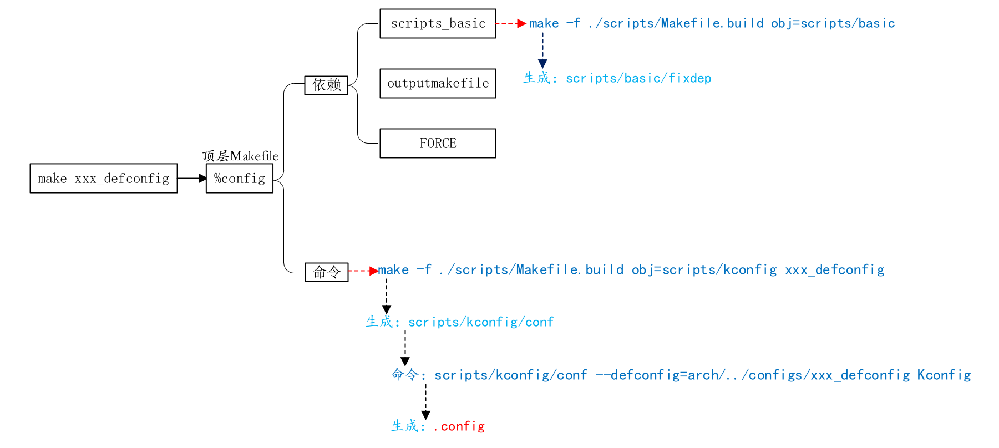

  使用”make zynq_cse_qspi_defconfig V=1“命令配置U-Boot，可以看到配置过程如下，与分析的一致。
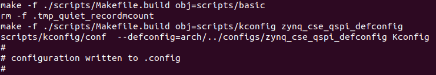

#### make过程
  配置好U-Boot后就可以直接make编译了，因为没有指明目标，所有使用默认目标PHONY：
```shell
# That's our default target when none is given on the command line
PHONY := _all
_all:
```

  目标\_all依赖于all，如果KBUILD_EXTMOD为空则\_all依赖于all，否则编译模块，\_all依赖于modules。
```shell
# If building an external module we do not care about the all: rule
# but instead _all depend on modules
PHONY += all
ifeq ($(KBUILD_EXTMOD),)
_all: all
else
_all: modules
endif
```

  目标all定义如下，依赖于$(ALL-y)。
```shell
all:		$(ALL-y)
ifeq ($(CONFIG_DEPRECATED),y)
	$(warning "You have deprecated configuration options enabled in your .config! Please check your configuration.")
ifeq ($(CONFIG_SPI),y)
ifneq ($(CONFIG_DM_SPI)$(CONFIG_OF_CONTROL),yy)
	$(warning "The relevant config item with associated code will remove in v2019.07 release.")
endif
endif
endif
ifneq ($(CONFIG_DM),y)
	@echo >&2 "===================== WARNING ======================"
	@echo >&2 "This board does not use CONFIG_DM. CONFIG_DM will be"
	@echo >&2 "compulsory starting with the v2020.01 release."
	@echo >&2 "Failure to update may result in board removal."
	@echo >&2 "See doc/driver-model/migration.rst for more info."
	@echo >&2 "===================================================="
endif
...
	@# Check that this build does not use CONFIG options that we do not
	@# know about unless they are in Kconfig. All the existing CONFIG
	@# options are whitelisted, so new ones should not be added.
	$(call cmd,cfgcheck,u-boot.cfg)
```

  ALL-y定义如下，包含u-boot.srec、u-boot.bin、u-boot.sym、System.map、binary_size_check等文件，根据U-Boot配置包含其他文件（例如，如果使能了ONENAND，在.config中会有“CONFIG_ONENAND_U_BOOT=y”，所以“ALL-y += u-boot-onenand.bin”）。
```shell
# Always append ALL so that arch config.mk's can add custom ones
ALL-y += u-boot.srec u-boot.bin u-boot.sym System.map binary_size_check

ALL-$(CONFIG_ONENAND_U_BOOT) += u-boot-onenand.bin
ifeq ($(CONFIG_SPL_FSL_PBL),y)
ALL-$(CONFIG_RAMBOOT_PBL) += u-boot-with-spl-pbl.bin
else
ifneq ($(CONFIG_SECURE_BOOT), y)
# For Secure Boot The Image needs to be signed and Header must also
# be included. So The image has to be built explicitly
ALL-$(CONFIG_RAMBOOT_PBL) += u-boot.pbl
endif
endif
ALL-$(CONFIG_SPL) += spl/u-boot-spl.bin
ifeq ($(CONFIG_MX6)$(CONFIG_IMX_HAB), yy)
ALL-$(CONFIG_SPL_FRAMEWORK) += u-boot-ivt.img
else
ifeq ($(CONFIG_MX7)$(CONFIG_IMX_HAB), yy)
ALL-$(CONFIG_SPL_FRAMEWORK) += u-boot-ivt.img
else
ALL-$(CONFIG_SPL_FRAMEWORK) += u-boot.img
endif
endif
ALL-$(CONFIG_TPL) += tpl/u-boot-tpl.bin
ALL-$(CONFIG_OF_SEPARATE) += u-boot.dtb
ifeq ($(CONFIG_SPL_FRAMEWORK),y)
ALL-$(CONFIG_OF_SEPARATE) += u-boot-dtb.img
endif
ALL-$(CONFIG_OF_HOSTFILE) += u-boot.dtb
ifneq ($(CONFIG_SPL_TARGET),)
ALL-$(CONFIG_SPL) += $(CONFIG_SPL_TARGET:"%"=%)
endif
ALL-$(CONFIG_REMAKE_ELF) += u-boot.elf
ALL-$(CONFIG_EFI_APP) += u-boot-app.efi
ALL-$(CONFIG_EFI_STUB) += u-boot-payload.efi

ifneq ($(BUILD_ROM)$(CONFIG_BUILD_ROM),)
ALL-$(CONFIG_X86_RESET_VECTOR) += u-boot.rom
endif

# Build a combined spl + u-boot image for sunxi
ifeq ($(CONFIG_ARCH_SUNXI)$(CONFIG_SPL),yy)
ALL-y += u-boot-sunxi-with-spl.bin
endif

# enable combined SPL/u-boot/dtb rules for tegra
ifeq ($(CONFIG_TEGRA)$(CONFIG_SPL),yy)
ALL-y += u-boot-tegra.bin u-boot-nodtb-tegra.bin
ALL-$(CONFIG_OF_SEPARATE) += u-boot-dtb-tegra.bin
endif

ALL-$(CONFIG_ARCH_MEDIATEK) += u-boot-mtk.bin

# Add optional build target if defined in board/cpu/soc headers
ifneq ($(CONFIG_BUILD_TARGET),)
ALL-y += $(CONFIG_BUILD_TARGET:"%"=%)
endif
```

  u-boot.bin是最终的目标，定义如下：
```shell
ifeq ($(CONFIG_MULTI_DTB_FIT),y)

ifeq ($(CONFIG_MULTI_DTB_FIT_LZO),y)
FINAL_DTB_CONTAINER = fit-dtb.blob.lzo
else ifeq ($(CONFIG_MULTI_DTB_FIT_GZIP),y)
FINAL_DTB_CONTAINER = fit-dtb.blob.gz
else
FINAL_DTB_CONTAINER = fit-dtb.blob
endif

fit-dtb.blob.gz: fit-dtb.blob
	@gzip -kf9 $< > $@

fit-dtb.blob.lzo: fit-dtb.blob
	@lzop -f9 $< > $@

fit-dtb.blob: dts/dt.dtb FORCE
	$(call if_changed,mkimage)
ifneq ($(SOURCE_DATE_EPOCH),)
	touch -d @$(SOURCE_DATE_EPOCH) fit-dtb.blob
	chmod 0600 fit-dtb.blob
endif

MKIMAGEFLAGS_fit-dtb.blob = -f auto -A $(ARCH) -T firmware -C none -O u-boot \
	-a 0 -e 0 -E \
	$(patsubst %,-b arch/$(ARCH)/dts/%.dtb,$(subst ",,$(CONFIG_OF_LIST))) -d /dev/null

ifneq ($(EXT_DTB),)
u-boot-fit-dtb.bin: u-boot-nodtb.bin $(EXT_DTB)
		$(call if_changed,cat)
else
u-boot-fit-dtb.bin: u-boot-nodtb.bin $(FINAL_DTB_CONTAINER)
	$(call if_changed,cat)
endif

u-boot.bin: u-boot-fit-dtb.bin FORCE
	$(call if_changed,copy)

u-boot-dtb.bin: u-boot-nodtb.bin dts/dt.dtb FORCE
	$(call if_changed,cat)

else ifeq ($(CONFIG_OF_SEPARATE),y)
u-boot-dtb.bin: u-boot-nodtb.bin dts/dt.dtb FORCE
	$(call if_changed,cat)

u-boot.bin: u-boot-dtb.bin FORCE
	$(call if_changed,copy)
else
u-boot.bin: u-boot-nodtb.bin FORCE
	$(call if_changed,copy)
endif
```

  首先，判断CONFIG_MULTI_DTB_FIT是否等于y（.config中未设置），如果不相等，继续判断CONFIG_OF_SEPARATE是否等于y（.config中未设置），如果不相等，执行最后一个u-boot.bin目标。u-boot.bin依赖于u-boot-nodtb.bin，使用call命令调用if_changed函数，在script/Kbuild.include中定义如下：
```shell
###
# if_changed      - execute command if any prerequisite is newer than
#                   target, or command line has changed
# if_changed_dep  - as if_changed, but uses fixdep to reveal dependencies
#                   including used config symbols
# if_changed_rule - as if_changed but execute rule instead
# See Documentation/kbuild/makefiles.txt for more info

ifneq ($(KBUILD_NOCMDDEP),1)
# Check if both arguments has same arguments. Result is empty string if equal.
# User may override this check using make KBUILD_NOCMDDEP=1
arg-check = $(strip $(filter-out $(cmd_$(1)), $(cmd_$@)) \
                    $(filter-out $(cmd_$@),   $(cmd_$(1))) )
else
arg-check = $(if $(strip $(cmd_$@)),,1)
endif

# Replace >$< with >$$< to preserve $ when reloading the .cmd file
# (needed for make)
# Replace >#< with >$(pound)< to avoid starting a comment in the .cmd file
# (needed for make)
# Replace >'< with >'\''< to be able to enclose the whole string in '...'
# (needed for the shell)
make-cmd = $(call escsq,$(subst $(pound),$$(pound),$(subst $$,$$$$,$(cmd_$(1)))))

# Find any prerequisites that is newer than target or that does not exist.
# PHONY targets skipped in both cases.
any-prereq = $(filter-out $(PHONY),$?) $(filter-out $(PHONY) $(wildcard $^),$^)

# Execute command if command has changed or prerequisite(s) are updated.
#
if_changed = $(if $(strip $(any-prereq) $(arg-check)),                       \
	@set -e;                                                             \
	$(echo-cmd) $(cmd_$(1));                                             \
	printf '%s\n' 'cmd_$@ := $(make-cmd)' > $(dot-target).cmd)
```

  在一些先决条件比目标新的时候，或者命令行有改变的时候，if_changed就会执行一些命令。最终，if_changed从u-boot-nodtb.bin生成u-boot.bin，u-boot-nodtb.bin的定义如下：
```shell
u-boot-nodtb.bin: u-boot FORCE
	$(call if_changed,objcopy)
	$(call DO_STATIC_RELA,$<,$@,$(CONFIG_SYS_TEXT_BASE))
	$(BOARD_SIZE_CHECK)
```

  目标u-boot-nodtb.bin又依赖于u-boot，定义如下：
```shell
u-boot:	$(u-boot-init) $(u-boot-main) u-boot.lds FORCE
	+$(call if_changed,u-boot__)
ifeq ($(CONFIG_KALLSYMS),y)
	$(call cmd,smap)
	$(call cmd,u-boot__) common/system_map.o
endif
```

  目标u-boot又依赖于u-boot-init、u-boot-main和u-boot.lds，前两个是变量，定义如下：
```shell
u-boot-init := $(head-y)
u-boot-main := $(libs-y)
```

  head-y在arch/arm/Makefile中定义如下：
```shell
head-y := arch/arm/cpu/$(CPU)/start.o
```

  其中$(CPU)=armv7，展开后“head-y := arch/arm/cpu/armv7/start.o”，即u-boot-init=arch/arm/cpu/armv7/start.o。
  libs-y定义如下：
```shell
libs-y += lib/
libs-$(HAVE_VENDOR_COMMON_LIB) += board/$(VENDOR)/common/
libs-$(CONFIG_OF_EMBED) += dts/
libs-y += fs/
libs-y += net/
libs-y += disk/
libs-y += drivers/
libs-y += drivers/dma/
libs-y += drivers/gpio/
libs-y += drivers/i2c/
libs-y += drivers/net/
libs-y += drivers/net/phy/
libs-y += drivers/power/ \
	drivers/power/domain/ \
	drivers/power/fuel_gauge/ \
	drivers/power/mfd/ \
	drivers/power/pmic/ \
	drivers/power/battery/ \
	drivers/power/regulator/
libs-y += drivers/spi/
libs-$(CONFIG_FMAN_ENET) += drivers/net/fm/
libs-$(CONFIG_SYS_FSL_DDR) += drivers/ddr/fsl/
libs-$(CONFIG_SYS_FSL_MMDC) += drivers/ddr/fsl/
libs-$(CONFIG_$(SPL_)ALTERA_SDRAM) += drivers/ddr/altera/
libs-y += drivers/serial/
libs-y += drivers/usb/cdns3/
libs-y += drivers/usb/dwc3/
libs-y += drivers/usb/common/
libs-y += drivers/usb/emul/
libs-y += drivers/usb/eth/
libs-$(CONFIG_USB_GADGET) += drivers/usb/gadget/
libs-$(CONFIG_USB_GADGET) += drivers/usb/gadget/udc/
libs-y += drivers/usb/host/
libs-y += drivers/usb/musb/
libs-y += drivers/usb/musb-new/
libs-y += drivers/usb/phy/
libs-y += drivers/usb/ulpi/
libs-y += cmd/
libs-y += common/
libs-y += env/
libs-$(CONFIG_API) += api/
libs-$(CONFIG_HAS_POST) += post/
libs-$(CONFIG_UNIT_TEST) += test/ test/dm/
libs-$(CONFIG_UT_ENV) += test/env/
libs-$(CONFIG_UT_OPTEE) += test/optee/
libs-$(CONFIG_UT_OVERLAY) += test/overlay/

libs-y += $(if $(BOARDDIR),board/$(BOARDDIR)/)

libs-y := $(sort $(libs-y))

u-boot-dirs	:= $(patsubst %/,%,$(filter %/, $(libs-y))) tools examples

u-boot-alldirs	:= $(sort $(u-boot-dirs) $(patsubst %/,%,$(filter %/, $(libs-))))

libs-y		:= $(patsubst %/, %/built-in.o, $(libs-y))
```

  libs-y是U-Boot下各子目录的集合，最后使用patsubst将libs-y中的“/”替换为“/built-in.o”，libs-y变成了U-Boot下各子目录下built-in.o的集合。因此，u-boot-main是U-Boot下各个子目录下built-in.o的集合。
  u-boot.lds是链接脚本，定义如下：
```shell
u-boot.lds: $(LDSCRIPT) prepare FORCE
	$(call if_changed_dep,cpp_lds)
```

  所以，目标u-boot是用u-boot.lds将arch/arm/cpu/armv7/start.o和各个子目录下built-in.o链接在一起生成u-boot。
  以drivers/gpio/built-in.o为例，在drivers/gpio/目录下有个.built-in.o.cmd文件，内容如下：
```shell
cmd_drivers/gpio/built-in.o :=  rm -f drivers/gpio/built-in.o; arm-none-eabi-ar rcs drivers/gpio/built-in.o
```

  查看编译过程，可以看到最终使用arm-none-eabi-ld.bfd命令将arch/arm/cpu/armv7/start.o和各个子目录下built-in.o链接在一起生成u-boot。
```shell
arm-none-eabi-ld.bfd   -pie  --gc-sections -Bstatic  --no-dynamic-linker -Ttext 0xFFFC0000 -o u-boot -T u-boot.lds arch/arm/cpu/armv7/start.o --start-group  arch/arm/cpu/built-in.o  arch/arm/cpu/armv7/built-in.o  arch/arm/lib/built-in.o  arch/arm/mach-zynq/built-in.o  board/xilinx/zynq/built-in.o  cmd/built-in.o  common/built-in.o  disk/built-in.o  drivers/built-in.o  drivers/dma/built-in.o  drivers/gpio/built-in.o  drivers/i2c/built-in.o  drivers/net/built-in.o  drivers/net/phy/built-in.o  drivers/power/built-in.o  drivers/power/battery/built-in.o  drivers/power/domain/built-in.o  drivers/power/fuel_gauge/built-in.o  drivers/power/mfd/built-in.o  drivers/power/pmic/built-in.o  drivers/power/regulator/built-in.o  drivers/serial/built-in.o  drivers/spi/built-in.o  drivers/usb/cdns3/built-in.o  drivers/usb/common/built-in.o  drivers/usb/dwc3/built-in.o  drivers/usb/emul/built-in.o  drivers/usb/eth/built-in.o  drivers/usb/host/built-in.o  drivers/usb/musb-new/built-in.o  drivers/usb/musb/built-in.o  drivers/usb/phy/built-in.o  drivers/usb/ulpi/built-in.o  dts/built-in.o  env/built-in.o  fs/built-in.o  lib/built-in.o  net/built-in.o --end-group arch/arm/lib/eabi_compat.o  arch/arm/lib/lib.a -Map u-boot.map;  true
```

  u-boot.srec、u-boot.sym、System.map和binary_size_check的生成方法和u-boot.bin类似。
  综上所述，make的流程如下：
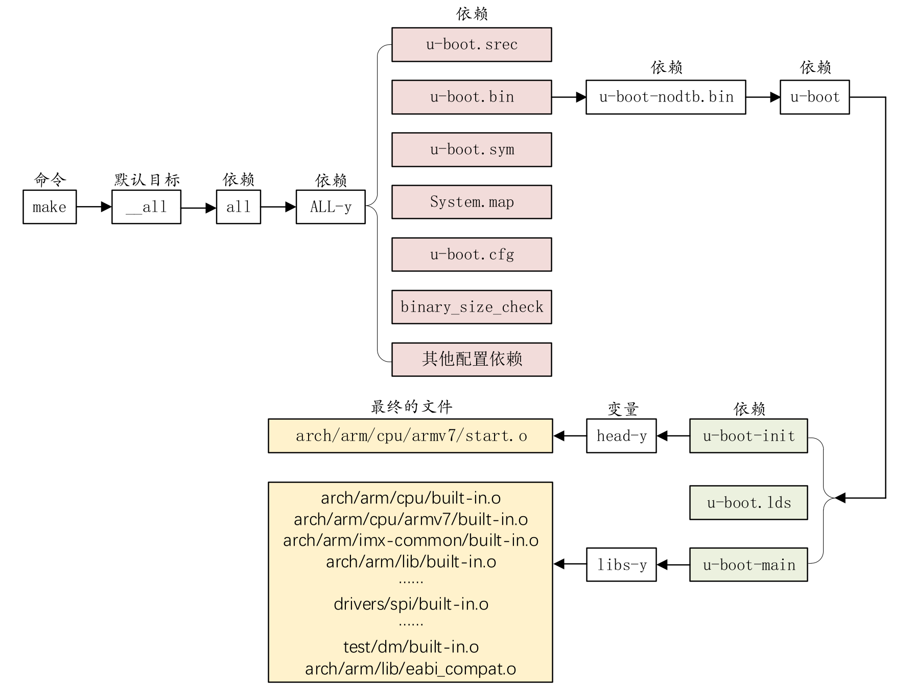

## 启动流程
  分析U-Boot的启动流程，了解各个外设在哪里被初始化，以及Linux内核如何被启动。

### 链接脚本u-boot.lds
  通过链接脚本可以找到程序的入口，U-Boot编译之后会在根目录下生成链接脚本u-boot.lds（在arch/arm/cpu/u-boot.lds基础上生成），决定了生成的U-Boot镜像中所有.o和.a文件的链接地址。内容如下：
```shell
OUTPUT_FORMAT("elf32-littlearm", "elf32-littlearm", "elf32-littlearm")
OUTPUT_ARCH(arm)
ENTRY(_start)
SECTIONS
{
 . = 0x00000000;
 . = ALIGN(4);
 .text :
 {
  *(.__image_copy_start)
  *(.vectors)
  arch/arm/cpu/armv7/start.o (.text*)
 }
 .__efi_runtime_start : {
  *(.__efi_runtime_start)
 }
 .efi_runtime : {
  *(.text.efi_runtime*)
  *(.rodata.efi_runtime*)
  *(.data.efi_runtime*)
 }
 .__efi_runtime_stop : {
  *(.__efi_runtime_stop)
 }
 .text_rest :
 {
  *(.text*)
 }
 . = ALIGN(4);
 .rodata : { *(SORT_BY_ALIGNMENT(SORT_BY_NAME(.rodata*))) }
 . = ALIGN(4);
 .data : {
  *(.data*)
 }
 . = ALIGN(4);
 . = .;
 . = ALIGN(4);
 .u_boot_list : {
  KEEP(*(SORT(.u_boot_list*)));
 }
 . = ALIGN(4);
 .efi_runtime_rel_start :
 {
  *(.__efi_runtime_rel_start)
 }
 .efi_runtime_rel : {
  *(.rel*.efi_runtime)
  *(.rel*.efi_runtime.*)
 }
 .efi_runtime_rel_stop :
 {
  *(.__efi_runtime_rel_stop)
 }
 . = ALIGN(4);
 .image_copy_end :
 {
  *(.__image_copy_end)
 }
 .rel_dyn_start :
 {
  *(.__rel_dyn_start)
 }
 .rel.dyn : {
  *(.rel*)
 }
 .rel_dyn_end :
 {
  *(.__rel_dyn_end)
 }
 .end :
 {
  *(.__end)
 }
 _image_binary_end = .;
 .bss_start __rel_dyn_start (OVERLAY) : {
  KEEP(*(.__bss_start));
  __bss_base = .;
 }
 .bss __bss_base (OVERLAY) : {
  *(.bss*)
   . = ALIGN(4);
   __bss_limit = .;
 }
 .bss_end __bss_limit (OVERLAY) : {
  KEEP(*(.__bss_end));
 }
 /DISCARD/ : { *(.dynsym) }
 /DISCARD/ : { *(.dynbss*) }
 /DISCARD/ : { *(.dynstr*) }
 /DISCARD/ : { *(.dynamic*) }
 /DISCARD/ : { *(.plt*) }
 /DISCARD/ : { *(.interp*) }
 /DISCARD/ : { *(.gnu*) }
 /DISCARD/ : { *(.ARM.exidx*) }
 /DISCARD/ : { *(.gnu.linkonce.armexidx.*) }
}
```

  OUTPUT_FORMAT指定输出32位ARM指令、小端模式的ELF格式可执行文件。
  OUTPUT_ARCH指定输出ARM平台的可执行文件。
  ENTRY指定代码入口为\_start，在arch/arm/lib/vectors.S中定义。
  接着是SECTIONS定义，首先指明目标代码的起始地址为0x00000000，4字节对齐，“.”表示当前位置。
  打开u-boot.map，搜索\_\_image_copy_start和vectors，内容如下。\_\_image_copy_start起始地址为0x00000000fffc0000，与.text地址一样。vectors段保存了中断向量表，起始地址也是0x00000000fffc0000，说明整个U-Boot的起始地址也是0x00000000fffc0000。
```shell
.text           0x00000000fffc0000      0x390
 *(.__image_copy_start)
 .__image_copy_start
                0x00000000fffc0000        0x0 arch/arm/lib/built-in.o
                0x00000000fffc0000                __image_copy_start
 *(.vectors)
 .vectors       0x00000000fffc0000      0x2e8 arch/arm/lib/built-in.o
                0x00000000fffc0000                _start
                0x00000000fffc0020                _undefined_instruction
                0x00000000fffc0024                _software_interrupt
                0x00000000fffc0028                _prefetch_abort
                0x00000000fffc002c                _data_abort
                0x00000000fffc0030                _not_used
                0x00000000fffc0034                _irq
                0x00000000fffc0038                _fiq
                0x00000000fffc0040                IRQ_STACK_START_IN
```

  接着将arch/arm/cpu/armv7/start.o放到中断向量表后面。
  .rodata为只读数据段，.data为数据段。
  .bss_start标号指向bss段的开始位置。
  .bss为BSS（Block Started by Symbol）段，用于存放定义时未初始化的全局变量，该段的变量在使用前由系统初始化为0。
  u-boot.lds中有一些跟地址有关的变量，可以在u-boot.map中找到，修改U-Boot源码、配置或优化等级后重新编译，地址都可能变化（\_\_image_copy_start除外）。
|变量|地址|说明|
|---|---|---|
|\_\_image_copy_start|0x00000000fffc0000|U-Boot拷贝的首地址|
|\_\_image_copy_end|0x00000000fffd5248|U-Boot拷贝的结束地址|
|\_\_rel_dyn_start|0x00000000fffd5248|.rel.dyn起始地址|
|\_\_rel_dyn_end|0x00000000fffd7a18|.rel.dyn结束地址|
|\_image_binary_end|0x00000000fffd7a18|二进制镜像结束地址|
|\_\_bss_start|0x00000000fffd5248|BSS段起始地址|
|\_\_bss_end|0x00000000fffd5b1c|BSS段结束地址|

### U-Boot启动流程
#### reset
  根据链接脚本u-boot.lds可知，U-Boot的入口是arch/arm/lib/vectors.S文件中的\_start，代码如下：
```shell
/* SPDX-License-Identifier: GPL-2.0+ */
/*
 *  vectors - Generic ARM exception table code
 *
 *  Copyright (c) 1998	Dan Malek <dmalek@jlc.net>
 *  Copyright (c) 1999	Magnus Damm <kieraypc01.p.y.kie.era.ericsson.se>
 *  Copyright (c) 2000	Wolfgang Denk <wd@denx.de>
 *  Copyright (c) 2001	Alex Züpke <azu@sysgo.de>
 *  Copyright (c) 2001	Marius Gröger <mag@sysgo.de>
 *  Copyright (c) 2002	Alex Züpke <azu@sysgo.de>
 *  Copyright (c) 2002	Gary Jennejohn <garyj@denx.de>
 *  Copyright (c) 2002	Kyle Harris <kharris@nexus-tech.net>
 */

#include <config.h>

/*
 * A macro to allow insertion of an ARM exception vector either
 * for the non-boot0 case or by a boot0-header.
 */
        .macro ARM_VECTORS
#ifdef CONFIG_ARCH_K3
	ldr     pc, _reset
#else
	b	reset
#endif
	ldr	pc, _undefined_instruction
	ldr	pc, _software_interrupt
	ldr	pc, _prefetch_abort
	ldr	pc, _data_abort
	ldr	pc, _not_used
	ldr	pc, _irq
	ldr	pc, _fiq
	.endm


/*
 *************************************************************************
 *
 * Symbol _start is referenced elsewhere, so make it global
 *
 *************************************************************************
 */

.globl _start

/*
 *************************************************************************
 *
 * Vectors have their own section so linker script can map them easily
 *
 *************************************************************************
 */

	.section ".vectors", "ax"

#if defined(CONFIG_ENABLE_ARM_SOC_BOOT0_HOOK)
/*
 * Various SoCs need something special and SoC-specific up front in
 * order to boot, allow them to set that in their boot0.h file and then
 * use it here.
 *
 * To allow a boot0 hook to insert a 'special' sequence after the vector
 * table (e.g. for the socfpga), the presence of a boot0 hook supresses
 * the below vector table and assumes that the vector table is filled in
 * by the boot0 hook.  The requirements for a boot0 hook thus are:
 *   (1) defines '_start:' as appropriate
 *   (2) inserts the vector table using ARM_VECTORS as appropriate
 */
#include <asm/arch/boot0.h>
#else

/*
 *************************************************************************
 *
 * Exception vectors as described in ARM reference manuals
 *
 * Uses indirect branch to allow reaching handlers anywhere in memory.
 *
 *************************************************************************
 */

_start:
#ifdef CONFIG_SYS_DV_NOR_BOOT_CFG
	.word	CONFIG_SYS_DV_NOR_BOOT_CFG
#endif
	ARM_VECTORS
#endif /* !defined(CONFIG_ENABLE_ARM_SOC_BOOT0_HOOK) */
```

  在.config中搜索CONFIG_ENABLE_ARM_SOC_BOOT0_HOOK，发现没有设置，所以执行“#else”部分。由于CONFIG_SYS_DV_NOR_BOOT_CFG未定义，所以\_start开始的是中断向量表ARM_VECTORS。U-Boot启动后，首先跳转到“reset”处执行（在arch/arm/cpu/armv7/start.S中定义），接着跳转到“save_boot_params”，然后跳转到“save_boot_params_ret”。
```shell
/* SPDX-License-Identifier: GPL-2.0+ */
/*
 * armboot - Startup Code for OMAP3530/ARM Cortex CPU-core
 *
 * Copyright (c) 2004	Texas Instruments <r-woodruff2@ti.com>
 *
 * Copyright (c) 2001	Marius Gröger <mag@sysgo.de>
 * Copyright (c) 2002	Alex Züpke <azu@sysgo.de>
 * Copyright (c) 2002	Gary Jennejohn <garyj@denx.de>
 * Copyright (c) 2003	Richard Woodruff <r-woodruff2@ti.com>
 * Copyright (c) 2003	Kshitij <kshitij@ti.com>
 * Copyright (c) 2006-2008 Syed Mohammed Khasim <x0khasim@ti.com>
 */

#include <asm-offsets.h>
#include <config.h>
#include <asm/system.h>
#include <linux/linkage.h>
#include <asm/armv7.h>

/*************************************************************************
 *
 * Startup Code (reset vector)
 *
 * Do important init only if we don't start from memory!
 * Setup memory and board specific bits prior to relocation.
 * Relocate armboot to ram. Setup stack.
 *
 *************************************************************************/

	.globl	reset
	.globl	save_boot_params_ret
	.type   save_boot_params_ret,%function
#ifdef CONFIG_ARMV7_LPAE
	.global	switch_to_hypervisor_ret
#endif

reset:
	/* Allow the board to save important registers */
	b	save_boot_params
save_boot_params_ret:
#ifdef CONFIG_ARMV7_LPAE
/*
 * check for Hypervisor support
 */
	mrc	p15, 0, r0, c0, c1, 1		@ read ID_PFR1
	and	r0, r0, #CPUID_ARM_VIRT_MASK	@ mask virtualization bits
	cmp	r0, #(1 << CPUID_ARM_VIRT_SHIFT)
	beq	switch_to_hypervisor
switch_to_hypervisor_ret:
#endif
	/*
	 * disable interrupts (FIQ and IRQ), also set the cpu to SVC32 mode,
	 * except if in HYP mode already
	 */
	mrs	r0, cpsr
	and	r1, r0, #0x1f		@ mask mode bits
	teq	r1, #0x1a		@ test for HYP mode
	bicne	r0, r0, #0x1f		@ clear all mode bits
	orrne	r0, r0, #0x13		@ set SVC mode
	orr	r0, r0, #0xc0		@ disable FIQ and IRQ
	msr	cpsr,r0

/*
 * Setup vector:
 * (OMAP4 spl TEXT_BASE is not 32 byte aligned.
 * Continue to use ROM code vector only in OMAP4 spl)
 */
#if !(defined(CONFIG_OMAP44XX) && defined(CONFIG_SPL_BUILD))
	/* Set V=0 in CP15 SCTLR register - for VBAR to point to vector */
	mrc	p15, 0, r0, c1, c0, 0	@ Read CP15 SCTLR Register
	bic	r0, #CR_V		@ V = 0
	mcr	p15, 0, r0, c1, c0, 0	@ Write CP15 SCTLR Register

#ifdef CONFIG_HAS_VBAR
	/* Set vector address in CP15 VBAR register */
	ldr	r0, =_start
	mcr	p15, 0, r0, c12, c0, 0	@Set VBAR
#endif
#endif

	/* the mask ROM code should have PLL and others stable */
#ifndef CONFIG_SKIP_LOWLEVEL_INIT
#ifdef CONFIG_CPU_V7A
	bl	cpu_init_cp15
#endif
#ifndef CONFIG_SKIP_LOWLEVEL_INIT_ONLY
	bl	cpu_init_crit
#endif
#endif

	bl	_main
...

/*************************************************************************
 *
 * void save_boot_params(u32 r0, u32 r1, u32 r2, u32 r3)
 *	__attribute__((weak));
 *
 * Stack pointer is not yet initialized at this moment
 * Don't save anything to stack even if compiled with -O0
 *
 *************************************************************************/
ENTRY(save_boot_params)
	b	save_boot_params_ret		@ back to my caller
```

  首先，判断CONFIG_ARMV7_LPAE是否定义，LPAE（Large Physical Address Extensions）是ARMv7系列的一种地址扩展技术，可以让32位的ARM能支持最大1TB的内存空间，但是一般不使用。
  读取cpsr寄存器的值并保存到r0寄存器中，然后与上0x1F并将结果保存到r1寄存器中，目的是提取cpusr的bit0~4位M[4:0]，用来设置处理器的工作模式。
|M[4:0]|模式|
|---|---|
|10000|User(usr)|
|10001|FIQ(fiq)|
|10010|IRQ(irq)|
|10011|Suprvisor(svc)|
|10110|Monitor(mon)|
|10111|Abort(abt)|
|11010|Hyp(hyp)|
|11011|Undefined(und)|
|11111|System(sys)|

  判断r1寄存器的值是否等于0x1A（11010），即当前处理器是否处于Hyp模式。否的话清除r0寄存器的bit0～4位，即清除模式位。
  如果当前处理器不处于Hyp模式，将r0寄存器或上0x13（10011），即设置处理器进入SVC模式。
  将r0寄存器或上0xC0，结果为0xD3，设置cpsr的I位和F位为1，关闭FIQ和IRQ。
  最后，将r0寄存器的值写回cpsr寄存器中，处理器处于SVC32模式，并且关闭了FIQ和IRQ中断。
  继续执行Setup vector代码，判断是否未定义CONFIG_OMAP44XX和CONFIG_SPL_BUILD，这里都没有定义，条件成立。第二阶段程序加载器（Secondary Program Loader，SPL）用来初始化DDR并加载U-Boot到内存中，使用CONFIG_SPL_BUILD来配置，一般不使用。
  读取CP15中c1（即SCTLR）寄存器的值到r0寄存器中，并与上CR_V（在arch/arm/include/asm/system.h中定义），目的是清除r0寄存器中的bit13。然后，将r0寄存器的值写回SCTLR寄存器中。
```shell
#define CR_V	(1 << 13)	/* Vectors relocated to 0xffff0000	*/
```

  SCTLR寄存器如下，bit13位V是向量表控制位，为0时向量表基地址为0x00000000，软件可以重定位向量表。为1时向量表基地址为0xFFFF0000，软件不能重定位向量表。所以，先将V清零，以便于重定位向量表。
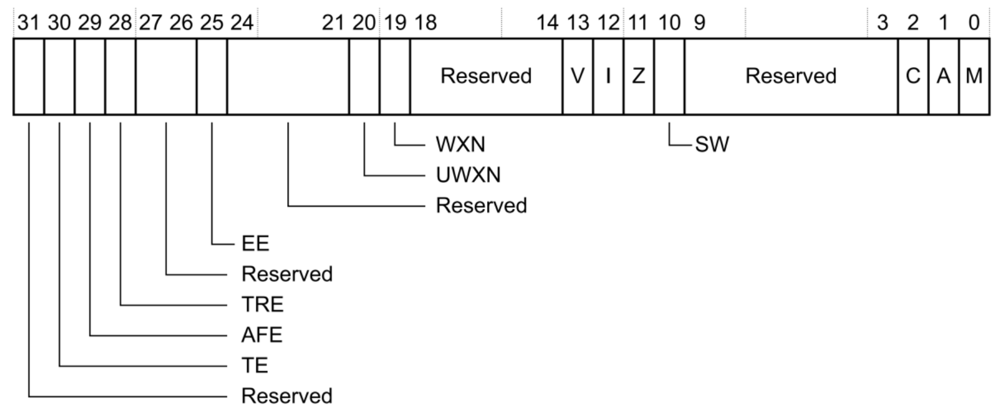

  接着，设置r0寄存起的值为\_start，即整个U-Boot的入口地址，也即向量表的起始地址。
  最后，将r0寄存器的值写入CP15额c12（即VBAR）寄存器中，重定位向量表。
  接下来，判断是否未定义CONFIG_SKIP_LOWLEVEL_INIT，条件成立，执行“cpu_init_cp15”、“cpu_init_crit”和“\_main”。
  “cpu_init_cp15”定义如下，用来设置CP15相关内容，如关闭L1 I/D-Cache、关闭MMU等。
```shell
/*************************************************************************
 *
 * cpu_init_cp15
 *
 * Setup CP15 registers (cache, MMU, TLBs). The I-cache is turned on unless
 * CONFIG_SYS_ICACHE_OFF is defined.
 *
 *************************************************************************/
ENTRY(cpu_init_cp15)
	/*
	 * Invalidate L1 I/D
	 */
	mov	r0, #0			@ set up for MCR
	mcr	p15, 0, r0, c8, c7, 0	@ invalidate TLBs
	mcr	p15, 0, r0, c7, c5, 0	@ invalidate icache
	mcr	p15, 0, r0, c7, c5, 6	@ invalidate BP array
	mcr     p15, 0, r0, c7, c10, 4	@ DSB
	mcr     p15, 0, r0, c7, c5, 4	@ ISB

	/*
	 * disable MMU stuff and caches
	 */
	mrc	p15, 0, r0, c1, c0, 0
	bic	r0, r0, #0x00002000	@ clear bits 13 (--V-)
	bic	r0, r0, #0x00000007	@ clear bits 2:0 (-CAM)
	orr	r0, r0, #0x00000002	@ set bit 1 (--A-) Align
	orr	r0, r0, #0x00000800	@ set bit 11 (Z---) BTB
#if CONFIG_IS_ENABLED(SYS_ICACHE_OFF)
	bic	r0, r0, #0x00001000	@ clear bit 12 (I) I-cache
#else
	orr	r0, r0, #0x00001000	@ set bit 12 (I) I-cache
#endif
	mcr	p15, 0, r0, c1, c0, 0
...
	mov	pc, r5			@ back to my caller
ENDPROC(cpu_init_cp15)
```

  “cpu_init_crit”定义如下，跳转到“lowlevel_init”。
```shell
#if !defined(CONFIG_SKIP_LOWLEVEL_INIT) && \
	!defined(CONFIG_SKIP_LOWLEVEL_INIT_ONLY)
/*************************************************************************
 *
 * CPU_init_critical registers
 *
 * setup important registers
 * setup memory timing
 *
 *************************************************************************/
ENTRY(cpu_init_crit)
	/*
	 * Jump to board specific initialization...
	 * The Mask ROM will have already initialized
	 * basic memory. Go here to bump up clock rate and handle
	 * wake up conditions.
	 */
	b	lowlevel_init		@ go setup pll,mux,memory
ENDPROC(cpu_init_crit)
#endif
```

#### cpu_init_crit
  “cpu_init_crit”在arch/arm/mach-zynq-lowlevel_init.S中定义，为了允许执行函数board_init_f做了基本的初始化。内容如下，使能VFP，然后返回调用。
```shell
/* SPDX-License-Identifier: GPL-2.0+ */
/*
 * Copyright (C) 2013 - 2015 Xilinx, Inc. All rights reserved.
 */

#include <asm-offsets.h>
#include <config.h>
#include <linux/linkage.h>

ENTRY(lowlevel_init)

	/* Enable the the VFP */
	mrc	p15, 0, r1, c1, c0, 2
	orr	r1, r1, #(0x3 << 20)
	orr	r1, r1, #(0x3 << 20)
	mcr	p15, 0, r1, c1, c0, 2
	isb
	fmrx	r1, FPEXC
	orr	r1,r1, #(1<<30)
	fmxr	FPEXC, r1

	/* Move back to caller */
	mov	pc, lr

ENDPROC(lowlevel_init)
```

#### \_main
  接下来执行“\_main”，在arch/arm/lib/crt0.S中定义，内容如下：
```shell
/* SPDX-License-Identifier: GPL-2.0+ */
/*
 *  crt0 - C-runtime startup Code for ARM U-Boot
 *
 *  Copyright (c) 2012  Albert ARIBAUD <albert.u.boot@aribaud.net>
 */

#include <config.h>
#include <asm-offsets.h>
#include <linux/linkage.h>
#include <asm/assembler.h>

/*
 * This file handles the target-independent stages of the U-Boot
 * start-up where a C runtime environment is needed. Its entry point
 * is _main and is branched into from the target's start.S file.
 *
 * _main execution sequence is:
 *
 * 1. Set up initial environment for calling board_init_f().
 *    This environment only provides a stack and a place to store
 *    the GD ('global data') structure, both located in some readily
 *    available RAM (SRAM, locked cache...). In this context, VARIABLE
 *    global data, initialized or not (BSS), are UNAVAILABLE; only
 *    CONSTANT initialized data are available. GD should be zeroed
 *    before board_init_f() is called.
 *
 * 2. Call board_init_f(). This function prepares the hardware for
 *    execution from system RAM (DRAM, DDR...) As system RAM may not
 *    be available yet, , board_init_f() must use the current GD to
 *    store any data which must be passed on to later stages. These
 *    data include the relocation destination, the future stack, and
 *    the future GD location.
 *
 * 3. Set up intermediate environment where the stack and GD are the
 *    ones allocated by board_init_f() in system RAM, but BSS and
 *    initialized non-const data are still not available.
 *
 * 4a.For U-Boot proper (not SPL), call relocate_code(). This function
 *    relocates U-Boot from its current location into the relocation
 *    destination computed by board_init_f().
 *
 * 4b.For SPL, board_init_f() just returns (to crt0). There is no
 *    code relocation in SPL.
 *
 * 5. Set up final environment for calling board_init_r(). This
 *    environment has BSS (initialized to 0), initialized non-const
 *    data (initialized to their intended value), and stack in system
 *    RAM (for SPL moving the stack and GD into RAM is optional - see
 *    CONFIG_SPL_STACK_R). GD has retained values set by board_init_f().
 *
 * 6. For U-Boot proper (not SPL), some CPUs have some work left to do
 *    at this point regarding memory, so call c_runtime_cpu_setup.
 *
 * 7. Branch to board_init_r().
 *
 * For more information see 'Board Initialisation Flow in README.
 */

/*
 * Macro for clearing BSS during SPL execution. Usually called during the
 * relocation process for most boards before entering board_init_r(), but
 * can also be done early before entering board_init_f() on plaforms that
 * can afford it due to sufficient memory being available early.
 */

.macro SPL_CLEAR_BSS
	ldr	r0, =__bss_start	/* this is auto-relocated! */

#ifdef CONFIG_USE_ARCH_MEMSET
	ldr	r3, =__bss_end		/* this is auto-relocated! */
	mov	r1, #0x00000000		/* prepare zero to clear BSS */

	subs	r2, r3, r0		/* r2 = memset len */
	bl	memset
#else
	ldr	r1, =__bss_end		/* this is auto-relocated! */
	mov	r2, #0x00000000		/* prepare zero to clear BSS */

clbss_l:cmp	r0, r1			/* while not at end of BSS */
	strlo	r2, [r0]		/* clear 32-bit BSS word */
	addlo	r0, r0, #4		/* move to next */
	blo	clbss_l
#endif
.endm

/*
 * entry point of crt0 sequence
 */

ENTRY(_main)

/*
 * Set up initial C runtime environment and call board_init_f(0).
 */

#if defined(CONFIG_TPL_BUILD) && defined(CONFIG_TPL_NEEDS_SEPARATE_STACK)
	ldr	r0, =(CONFIG_TPL_STACK)
#elif defined(CONFIG_SPL_BUILD) && defined(CONFIG_SPL_STACK)
	ldr	r0, =(CONFIG_SPL_STACK)
#else
	ldr	r0, =(CONFIG_SYS_INIT_SP_ADDR)
#endif
	bic	r0, r0, #7	/* 8-byte alignment for ABI compliance */
	mov	sp, r0
	bl	board_init_f_alloc_reserve
	mov	sp, r0
	/* set up gd here, outside any C code */
	mov	r9, r0
	bl	board_init_f_init_reserve

#if defined(CONFIG_SPL_EARLY_BSS)
	SPL_CLEAR_BSS
#endif

	mov	r0, #0
	bl	board_init_f

#if ! defined(CONFIG_SPL_BUILD)

/*
 * Set up intermediate environment (new sp and gd) and call
 * relocate_code(addr_moni). Trick here is that we'll return
 * 'here' but relocated.
 */

	ldr	r0, [r9, #GD_START_ADDR_SP]	/* sp = gd->start_addr_sp */
	bic	r0, r0, #7	/* 8-byte alignment for ABI compliance */
	mov	sp, r0
	ldr	r9, [r9, #GD_BD]		/* r9 = gd->bd */
	sub	r9, r9, #GD_SIZE		/* new GD is below bd */

	adr	lr, here
	ldr	r0, [r9, #GD_RELOC_OFF]		/* r0 = gd->reloc_off */
	add	lr, lr, r0
#if defined(CONFIG_CPU_V7M)
	orr	lr, #1				/* As required by Thumb-only */
#endif
	ldr	r0, [r9, #GD_RELOCADDR]		/* r0 = gd->relocaddr */
	b	relocate_code
here:
/*
 * now relocate vectors
 */

	bl	relocate_vectors

/* Set up final (full) environment */

	bl	c_runtime_cpu_setup	/* we still call old routine here */
#endif
#if !defined(CONFIG_SPL_BUILD) || CONFIG_IS_ENABLED(FRAMEWORK)

#if !defined(CONFIG_SPL_EARLY_BSS)
	SPL_CLEAR_BSS
#endif

# ifdef CONFIG_SPL_BUILD
	/* Use a DRAM stack for the rest of SPL, if requested */
	bl	spl_relocate_stack_gd
	cmp	r0, #0
	movne	sp, r0
	movne	r9, r0
# endif

#if ! defined(CONFIG_SPL_BUILD)
	bl coloured_LED_init
	bl red_led_on
#endif
	/* call board_init_r(gd_t *id, ulong dest_addr) */
	mov     r0, r9                  /* gd_t */
	ldr	r1, [r9, #GD_RELOCADDR]	/* dest_addr */
	/* call board_init_r */
#if CONFIG_IS_ENABLED(SYS_THUMB_BUILD)
	ldr	lr, =board_init_r	/* this is auto-relocated! */
	bx	lr
#else
	ldr	pc, =board_init_r	/* this is auto-relocated! */
#endif
	/* we should not return here. */
#endif

ENDPROC(_main)
```

  首先，加载CONFIG_SYS_INIT_SP_ADDR到r0寄存器，在include/configs/zynq-common.h文件中定义如下：
```shell
#define CONFIG_SYS_INIT_RAM_ADDR	0xFFFF0000
#define CONFIG_SYS_INIT_RAM_SIZE	0x2000
#define CONFIG_SYS_INIT_SP_ADDR		(CONFIG_SYS_INIT_RAM_ADDR + \
					CONFIG_SYS_INIT_RAM_SIZE - \
					GENERATED_GBL_DATA_SIZE)
```

  GENERATED_GBL_DATA_SIZE在include/generated/generic-asm-offsets.h中定义，内容如下：
```shell
#ifndef __GENERIC_ASM_OFFSETS_H__
#define __GENERIC_ASM_OFFSETS_H__
/*
 * DO NOT MODIFY.
 *
 * This file was generated by Kbuild
 */

#define GENERATED_GBL_DATA_SIZE 208 /* (sizeof(struct global_data) + 15) & ~15	@ */
#define GENERATED_BD_INFO_SIZE 112 /* (sizeof(struct bd_info) + 15) & ~15	@ */
#define GD_SIZE 200 /* sizeof(struct global_data)	@ */
#define GD_BD 0 /* offsetof(struct global_data, bd)	@ */
#define GD_MALLOC_BASE 156 /* offsetof(struct global_data, malloc_base)	@ */
#define GD_RELOCADDR 56 /* offsetof(struct global_data, relocaddr)	@ */
#define GD_RELOC_OFF 76 /* offsetof(struct global_data, reloc_off)	@ */
#define GD_START_ADDR_SP 72 /* offsetof(struct global_data, start_addr_sp)	@ */
#define GD_NEW_GD 80 /* offsetof(struct global_data, new_gd)	@ */

#endif
```

  综上所述，CONFIG_SYS_INIT_SP_ADDR=0xFFFF0000 + 0x2000 - 208=0xFFFF1F30，即r0=0xFFFF1F30。
  接着，对r0寄存器的值做8字节对齐，并加载到sp寄存器，即sp=0xFFFF1F30，在ZYNQ内部RAM。
  调用函数“board_init_f_alloc_reserve”，在common/init/board_init.c中定义，内容如下。参数top为r0寄存器的值，
```shell
/*
 * Allocate reserved space for use as 'globals' from 'top' address and
 * return 'bottom' address of allocated space
 *
 * Notes:
 *
 * Actual reservation cannot be done from within this function as
 * it requires altering the C stack pointer, so this will be done by
 * the caller upon return from this function.
 *
 * IMPORTANT:
 *
 * Alignment constraints may differ for each 'chunk' allocated. For now:
 *
 * - GD is aligned down on a 16-byte boundary
 *
 *  - the early malloc arena is not aligned, therefore it follows the stack
 *   alignment constraint of the architecture for which we are bulding.
 *
 *  - GD is allocated last, so that the return value of this functions is
 *   both the bottom of the reserved area and the address of GD, should
 *   the calling context need it.
 */

ulong board_init_f_alloc_reserve(ulong top)
{
	/* Reserve early malloc arena */
#if CONFIG_VAL(SYS_MALLOC_F_LEN)
	top -= CONFIG_VAL(SYS_MALLOC_F_LEN);
#endif
	/* LAST : reserve GD (rounded up to a multiple of 16 bytes) */
	top = rounddown(top-sizeof(struct global_data), 16);

	return top;
}
```

### bootz启动内核过程

## 移植
## 图形化配置

参考
===