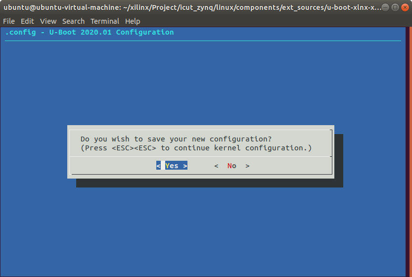

简介
===
  [U-Boot](https://www.denx.de/wiki/U-Boot/)全称Universal Boot Loader，进入官网，主页如下：


  点击Source Code进入U-Boot Source Code页面，可以访问GIT仓库或FTP服务器下载源码。


  U-Boot启动，打印信息如下：


```shell
U-Boot 2020.01 (May 25 2022 - 12:38:29 +0000) # U-Boot版本号和编译时间

CPU:   Zynq 7z020 # CPU型号
Silicon: v3.1 # CPU版本
DRAM:  ECC disabled 1 GiB # DRAM大小为1GB，禁止ECC。
MMC:   mmc@e0100000, mmc@e0101000: 1 # 检测到两个MMC控制器，mmc@e0100000: 0接的是SD卡，mmc@e0101000: 1接的是eMMC。
Loading Environment from SPI Flash... SF: Detected w25q256 with page size 256 Bytes, erase size 4 KiB, total 32 MiB # 检测到SPI Flash w25q256，大小为32MB。
*** Warning - bad CRC, using default environment # U-Boot没有在Flash中找到有效的环境变量，使用默认的环境变量（可以使用saveenv把默认环境编辑写入Flash，下次启动就不会警告了）。

In:    serial@e0001000 # 标准输入为serial@e0001000即UART1
Out:   serial@e0001000 # 标准输出为serial@e0001000即UART1
Err:   serial@e0001000 # 标准错误为serial@e0001000即UART1
Hit any key to stop autoboot:  4 # 在4秒（默认，可以通过环境变量bootdelay修改）倒计时内按下任意键即可进入命令行模式，否则将自动启动Linux内核。
```

U-Boot
===
## 命令
  U-Boot提供了很多命令，可以配置是否使能，也可以自定义命令。支持TAB键自动补全，上下键查看历史命令。
### 信息查询命令

|命令|说明|
|---|---|
|```help```|显示U-Boot支持的所有命令的简要描述。|
|```help command ...```|查看一个或多个命令的详细的使用方法。|
|```?```|help的别名，完全等效。|
|```bdinfo```|查看板子信息，如启动参数（boot_params）、DRAM起始地址和大小（DRAM bank、start、size）、串口波特率（baudrate）、堆栈起始地址（sp start）等。|
|```version```|查看U-Boot版本号及编译信息。|

### 环境变量操作命令
|命令|说明|
|---|---|
|```print [-a]```|打印U-Boot所有环境变量的值(都是字符串），如baudrate、board_name、boot_img、bootcmd、bootdelay等。|
|```print name ...```|打印一个或多个环境变量的值。|
|```printenv```|与print相同。|
|```setenv [-f] name value ...```|设置环境变量，U-Boot启动时会从Flash中加载环境变量到DRAM中，该命令修改的是DRAM中的值，断电后即丢失。如果变量不存在，会自动创建。可以跟多个value，用空格分开。|
|```setenv [-f] name```|删除环境变量。|
|```saveenv```|保存环境变量，将DRAM中的环境变量保存到Flash，断电重启后依然有效。|
|```run var [...]```|运行环境变量var中的命令，例如```run bootcmd```。|

  还有一个env命令，后面可以跟不同参数以实现不同的功能，输入```? env```查看详细使用方法。
|命令|说明|
|---|---|
|```env default [-f] -a```|重置所有环境变量为默认值。|
|```env default [-f] var [...]```|重置一个或多个环境变量为默认值。|
|```env delete [-f] var [...]```|删除一个或多个环境变量。|
|```env edit name```|修改某个环境变量的名称。|
|```env exists name```|检查某个环节变量是否存在。|
|```env export [-t | -b | -c] [-s size] addr [var ...]```|导出一个或多个环境环境变量。|
|```env import [-d] [-t [-r] | -b | -c] addr [size] [var ...]```|导入一个或多个环境环境变量。|
|```env print [-a | name ...]```|与print相同。|
|```env set [-f] name [arg ...]```|与setenv相同。|
|```env save```|与saveenv相同。|
|```env run var [...]```|与run相同。|
注：
1. U-Boot中的数字都是十六进制的，前缀“0x”可写可不写。
2. -f是forcibly缩写，表示强制执行。

### 内存操作命令
|命令|说明|
|---|---|
|```md [.b, .w, .l] address [# of objects]```|显示内存，```[.b, .w, .l]```分别对应byte、word和long，即分别以1、2、4字节显示，address为内存起始地址，```[# of objects]```为数据长度，其单位不一定是字节，而是由```[.b, .w, .l]```决定。如果没有指定```[.b, .w, .l]```项即```md```，与```md.l```等效；如果没有指定```[# of objects]```项，则默认为16。|
|```nm [.b, .w, .l] address```|修改内存，输入地址后回车，显示当前值并等待输入新值，输入后回车，可以看到当前值已经变为输入的新值，可以继续修改，也可以输入“q”后回车退出。|
|```mm [.b, .w, .l] address```|连续修改内存，与nm相似，但地址会自增。|
|```mw [.b, .w, .l] address value [count]```|内存填充，使用value值填充起始地址为address，长度为count的一段内存。|
|```cp [.b, .w, .l] source target count```|内存拷贝，将DRAM中的数据从一段内存拷贝到另一段内存中。source为源地址，target为目的地址，长度为count。|
|```cmp [.b, .w, .l] addr1 addr2 count```|内存比较，比较DRAM中两段内存的数据是否相等。|
|```mtest [start [end [pattern [iterations]]]]```|简单的内存读写测试命令。|
注：
1. ```[.b, .w, .l]```和```md```中间不要加空格。

### 网络操作命令
  U-Boot中支持网络功能，并提供了一些网络操作命令，便于调试。此外，还有一些网络相关的环境变量，用来配置网络功能。

|环境变量|说明|
|---|---|
|ethaddr|MAC地址|
|ipaddr|IP地址|
|netmask|子网掩码|
|gatewayip|网关地址|
|serverip|服务器IP地址|
注：
1. ipaddr、netmask和gatewayip可以手动设置，也可以使用```dhcp```命令从路由器获取。

|命令|说明|
|---|---|
|```ping pingAddress```|发送ICMP ECHO_REQUEST，通常用来测试网络通不通。|
|```dhcp```|自动从路由器获取ipaddr、netmask和gatewayip。|
|```dhcp [loadAddress] [[hostIPaddr:]bootfilename]```|使用DHCP/TFTP协议从网络启动系统镜像。|
|```tftpboot [loadAddress] [[hostIPaddr:]bootfilename]```|使用TFTP协议从网络下载系统镜像（zImage）和设备树。|
|```nfs [loadAddress] [[hostIPaddr:]bootfilename]```|使用NFS协议从网络下载系统镜像（zImage）和设备树，常用于网络调试内核。|
注：
1. 使用tftpboot或nfs命令下载完zImage后，可以使用```od -tx1 -vN 0x100 zImage```或```xxd -g 1 -k 0x100 zImage```检查下载到DRAM中的数据是否与源文件一致。
2. 使用tftpboot和nfs时，前者bootfilename只需要输入文件名，后者需要输入完整路径。

### MMC操作命令
  U-Boot支持eMMC和SD卡，通称为MMC设备，使用```mmc```命令操作MMC设备，后面可以跟不同参数以实现不同的功能，输入```? mmc```查看详细使用方法。
|命令|说明|
|---|---|
|```mmc info```|显示当前MMC设备的信息，还有个```mmcinfo```命令，与之相同。|
|```mmc read addr blk# cnt```|从MMC读取数据|
|```mmc write addr blk# cnt```|向MMC写入数据|
|```mmc erase blk# cnt```|擦除MMC数据|
|```mmc rescan```|重新扫描MMC设备|
|```mmc part```|列出当前MMC设备的可用分区|
|```mmc dev [dev] [part]```|显示或设置当前MMC设备及分区|
|```mmc list```|列出可用的MMC设备|
|```mmc hwpartition [args...]```|设置MMC设备分区，只需要设置一遍，且需要重启以生效。<br>args为参数项，以512字节的块为单位：<br>```[user [enh start cnt] [wrrel {on|off}]]```：设置用户数据区属性<br>```[gp1|gp2|gp3|gp4 cnt [enh] [wrrel {on|off}]]```：通用分区<br>```[check|set|complete]```：模式，分区设置完成|
|```mmc setdsr <value>```|设置DSR寄存器的值|

### SPI Flash操作命令
  U-Boot支持SPI Flash检测、读、写、擦除等操作，使用```sf```命令，后面可以跟不同参数以实现不同的功能，输入```? sf```查看详细使用方法。
|命令|说明|
|---|---|
|```sf probe [[bus:]cs] [hz] [mode]```|初始化SPI给定bus总线cs片选上的设备，hz为SPI速度（默认30MHz），mode为SPI模式（默认为3），必须在其他sf命令前调用。|
|```sf read addr offset|partition len```|从SPI Flash的offset偏移地址或mdt的partition分区起始地址读取len字节到内存addr地址。|
|```sf write addr offset|partition len```|从内存addr地址向SPI Flash的offset偏移地址或mdt的partition分区起始地址写入len字节。|
|```sf erase offset|partition [+]len```|从SPI Flash的offset偏移地址或mdt的partition分区起始地址擦除len字节，+号将len按块大小向上舍入。|
|```sf update addr offset|partition len```|先执行sf erase操作，再执行sf write 操作。|
|```sf protect lock/unlock sector len```|从sector扇区开始的len字节添加或去除保护。|

### FPGA操作命令
  U-Boot支持FPGA检测、配置等操作，使用```fpga```命令操作FPGA，后面可以跟不同参数以实现不同的功能，输入```? fpga```查看详细使用方法。
|命令|说明|
|---|---|
|```fpga dump  [dev] [address] [size]```|将FPGA中的镜像加载到内存缓冲区中，dev表示FPGA设备号，address表示FPGA镜像加载到内存中的地址，size表示镜像大小。|
|```fpga info  [dev]```|列出FPGA已知的设备信息，例如：<br>Xilinx Device<br>Descriptor @ 0x3ffdba84<br>Family:         Zynq PL<br>Interface type: Device configuration interface (Zynq)<br>Device Size:    4045564 bytes<br>Cookie:         0x0 (0)<br>Device name:    7z020<br>No Device Function Table.|
|```fpga load  [dev] [address] [size]```|从内存缓冲区中加载镜像到FPGA。|
|```fpga loadp [dev] [address] [size]```|使用部分比特流从内存缓冲区中加载镜像到FPGA。|
|```fpga loadb [dev] [address] [size]```|从比特流缓存中加载镜像到FPGA（仅限Xilinx）。|
|```fpga loadbp [dev] [address] [size]```|使用部分比特流从比特流缓存中加载镜像到FPGA（仅限Xilinx）。|
|```fpga loadfs [dev] [address] [image size] [blocksize] <interface> [<dev[:part]>] <filename>```|从文件系统中加载镜像到FPGA中（仅限Xilinx），默认文件系统为FAT格式。|
|```fpga loadmk [dev] [address]```|从使用mkimage生成的文件中加载镜像到FPGA，如果是FIT格式的uImage，address中需要包含子单元名称，如addr:<subimg_uname>。|

### 文件系统操作命令
  U-Boot支持FAT和EXT格式文件系统，并提供相应的操作命令。
|命令|说明|
|---|---|
|```fstype <interface> <dev>:<part>```|显示interface接口上dev设备part分区的文件系统格式。|
|```fstype <interface> <dev>:<part> <varname>```|设置环境变量，值为interface接口上dev设备part分区的文件系统类型。|
|```fatinfo <interface> [<dev[:part]>]```|打印interface接口上dev设备part分区的文件系统信息，例如```fatinfo mmc 0:1```。|
|```fatls <interface> [<dev[:part]>] [directory]```|列出interface接口上dev设备part分区的directory路径下的所有文件（包括文件夹）。|
|```fatmkdir <interface> [<dev[:part]>] <directory>```|在interface接口上dev设备part分区创建文件夹。|
|```fatrm <interface> [<dev[:part]>] <filename>```|删除interface接口上dev设备part分区的指定文件。|
|```fatsize <interface> <dev[:part]> <filename>```|显示interface接口上dev设备part分区的指定文件的大小。|
|```fatload <interface> [<dev[:part]> [<addr> [<filename> [bytes [pos]]]]]```|将interface接口上dev设备part分区的指定文件读取到DRAM中，addr为内存起始地址，filename为要读取的文件名，bytes为要读取的数据大小（0或省略表示读取整个文件），pos为要读取的数据当对于文件首地址的偏移（0或省略表示从文件收地址开始读取）。|
|```fatwrite <interface> <dev[:part]> <addr> <filename> [<bytes> [<offset>]]```|将DRAM中的数据写入到interface接口上dev设备part分区的指定文件，addr为内存起始地址，filename为要写入的文件名，bytes为要写入的数据大小（必需有且不能为0），offset为要写入的数据当对于文件首地址的偏移（0或省略表示从文件收地址开始写入）。|
|```ext2load <interface> [<dev[:part]> [addr [filename [bytes [pos]]]]]```|参考fatload。|
|```ext2ls <interface> <dev[:part]> [directory]```|参考fatls。|
|```ext4load <interface> [<dev[:part]> [addr [filename [bytes [pos]]]]]```|参考fatload。|
|```ext4ls <interface> <dev[:part]> [directory]```|参考fatls。|
|```ext4size <interface> <dev[:part]> <filename>```|参考fatsize。|
|```ext4write <interface> <dev[:part]> <addr> <absolute filename path>```|参考fatwrite|
|```load <interface> [<dev[:part]> [<addr> [<filename> [bytes [pos]]]]]```|参考fatload，自动识别文件系统类型。|
|```ls <interface> [<dev[:part]> [directory]]```|参考fatls，自动识别文件系统类型。|
|```size <interface> <dev[:part]> <filename>```|参考fatsize，自动识别文件系统类型。|

### 系统引导命令
  U-Boot本质是引导操作系统，提供了相应的系统引导命令。先通过文件系统操作命令fatload、ext2load、ext4load或网络操作命令tftpboot、nfs将系统镜像和设备树文件下载到DRAM中，然后使用系统引导命令bootm、bootz或boot命令启动系统。
|命令|说明|
|---|---|
|```bootm [addr [arg ...]]```|从内存中启动系统镜像，用于mkimage工具处理过的内核镜像，ZYNQ使用的image.ub属于U-Boot fitImage，包含linux内核和设备树，可以将image.ub下载到DRAM中，然后使用bootm启动。例如：<br>```tftpboot 10000000 image.ub```<br>```bootm 10000000```<br>可以使用netboot环境变量，运行```run netboot```即可。|
|```bootz [addr [initrd[:size]] [fdt]]```|从内存中启动zImage镜像，addr是zImage文件在DRAM中的地址，initrd是initrd文件（INITRAM根文件系统）在DRAM中的地址，如果不使用initrd用”-“代替，fdt是设备树文件（system.dtb）在DRAM中的地址。例如：<br>```tftpboot 00000000 zImage```<br>```tftpboot 05000000 system.dtb```<br>```bootz 00000000 - 05000000```|
|```go addr [arg ...]```|从addr地址处开始执行程序，通过arg传递参数。|
|```boot```|默认的启动命令，前面U-Boot倒计时结束后就是执行该命令，通过运行“bootcmd”环境变量来启动系统，可以修改该变量改变启动方式。|
|```reset```|复位CPU，重启系统。|

### 其他命令
|命令|说明|
|---|---|
|```test```|Linux下test命令的精简版，如```test -e interface FILE```检测FILE是否存在，存在返回true，否则返回false。|

## 源码
### 文件和目录结构
  解压U-Boot源码，文件和工程目录结构如下图所示。


|名称|说明|
|---|---|
|api/|与硬件无关的API函数|
|arch/|与架构体系有关的代码|
|board/|不同板子的定制代码|
|cmd/|命令相关代码|
|common/|通用代码|
|configs/|配置文件|
|disk/|磁盘分区相关代码|
|doc/|文档|
|drivers/|驱动代码|
|dts/|设备树|
|env/|环境变量|
|examples/|示例代码|
|fs/|文件系统|
|include/|头文件|
|lib/|库文件|
|Licenses/|许可证相关文件|
|net/|网络相关代码|
|post/|上电自检程序|
|scripts/|脚本文件|
|test/|测试代码|
|tools/|工具文件夹|
|.github/<br>.gitattributes<br>.gitignore<br>.gitlab-ci.yml|git相关文件|
|.mailmap|邮件列表|
|.checkpath.conf|路径检查配置文件|
|config.mk|某个Makefile会调用此文件|
|Kbuild|用于生成一些和汇编有关的文件|
|Kconfig|图形配置界面描述文件|
|MAINTAINERS|维护者联系方式文件|
|Makefile|顶层Makefile文件|
|README|相当于帮助文档|

#### arch
  arch文件下存放着和架构有关的文件，如arm、avr32、riscv等。


  arm文件夹如下，mach开头的文件夹是与具体的设备有关的，如mach-exynos是三星的exynos系列CPU相关文件。


  mach-zynq文件夹存放着与ZYNQ相关的文件。


  另外，cpu文件夹也是和CPU架构有关的，包含了多种ARM架构。ZYNQ使用的是Cortex-A9内核，属于armv7架构，对应armv7文件夹，分析U-Boot启动源码时需要重点关注。u-boot.lds是ARM架构处理器使用的U-Boot链接脚本文件。


#### board
  board文件夹下包含了很多以SoC厂商命名的文件夹，如xilinx、ti、freescale、samsung、huawei等，在这些文件夹下都有很多基于其推出的SoC平台的开发板所对应的板级支持文件。


  xilinx文件夹如下，其中microblaze-generic表示使用microblaze软核的FPGA开发板，zynq表示使用ZYNQ-7000系列芯片的开发板，zynqmp表示使用ZYNQ MP系列芯片的开发板。


  zynq文件夹如下，zynq-microzed对应microzed开发板，zynq-zed对应zed开发板，也可以为自己的板子创建文件夹。


#### configs
  configs文件夹包含了很多U-Boot配置文件，半导体厂商或开发板厂商会制作好一个配置文件，统一命名为“xxx_defconfig”，可以在其基础上添加自定义功能。


#### Makefile
  对于大型项目，不会把所有的源码放在同一个目录中，而是按功能模块划分，放在各自的目录中。每个功能模块目录下都有一个Makefile，只负责本模块的编译链接工作。这样所有的编译链接工作不用全部放到一个Makefile文件中，可以使Makefile简洁明了。
  U-Boot源码根目录下的Makefile文件是顶层Makefile，它会调用各个功能模块目录下的Makefile文件，以及其他复杂的工作。

#### README
  README文件描述了U-Boot的详细信息，包括如何编译、各个文件夹的含义、相应的命令等。

### 顶层Makefile
  通过分析Makefile可以了解整个工程的组织结构，先从顶层Makefile开始，然后层层分析子Makefile，可以更清晰的理解U-Boot源码。

#### 版本号
```makefile
VERSION = 2020 # 主版本号
PATCHLEVEL = 01 # 补丁版本号
SUBLEVEL = # 次版本号
EXTRAVERSION = # 附加版本信息，通常不使用
NAME = # 名字，通常不使用
```

#### MAKEFLAGS变量
  make支持递归调用，在Makefile中可以使用make来执行其他的Makefile文件，工程编译时主目录的Makefile会自动调用子目录下的Makefile，以此完成所有子目录的编译。
  顶层Makefile在调用子目录中的Makefile编译时，可以通过"export"向子make传递环境变量，使用"unexport"取消传递。有两个特殊的环境变量："SHELL"和"MAKESFLAG"，在整个make过程中始终自动传递给子make。
```makefile
MAKEFLAGS += -rR --include-dir=$(CURDIR)
```
  使用"+="追加参数，"-rR"禁止使用内置的隐含规则和变量定义，"--include-dir"指明搜索路径，"$(CURDIR)"表示当前目录。

#### 命令输出
  编译U-Boot需要用到交叉编译工具，如arm-linux-gnueabihf-gcc、arm-none-eabi-gcc等，使用方法如下：
```shell
make ARCH=arm CROSS_COMPILE=arm-none-eabi- distclean
make ARCH=arm CROSS_COMPILE=arm-none-eabi- xilinx_zynq_virt_defconfig
make ARCH=arm CROSS_COMPILE=arm-none-eabi- [V=1] -j4
```

  ARCH指定目标架构为arm，CROSS_COMPILE指定所使用的交叉编译器为arm-none-eabi-gcc（只需要写出前缀即可）。
  第一条命令清除工程，包括生成的文件 、配置文件、各种备份文件、编辑器备份和补丁文件。
  第二条命令配置U-Boot，如自定义架构和外设等，使用配置文件xilinx_zynq_virt_defconfig（在configs文件夹下），也可以使用图形化界面配置。
  第三条命令编译工程，V（verbose缩写）指定编译模式，默认为0（可以不写），表示quiet模式，只显示短命令，如CC、LD等，V=1显示完整的命令，便于调试；-j指定编译核数为4核，加快编译速度。
  使用quiet模式编译，部分过程如下：
```makefile
scripts/kconfig/conf  --syncconfig Kconfig
  CHK     include/config.h
  UPD     include/config.h
  CFG     u-boot.cfg
  GEN     include/autoconf.mk.dep
  CFG     spl/u-boot.cfg
  GEN     include/autoconf.mk
  GEN     spl/include/autoconf.mk
  CHK     include/config/uboot.release
  ...
  LD      u-boot
  OBJCOPY u-boot.srec
  OBJCOPY u-boot-nodtb.bin
  SYM     u-boot.sym
  COPY    u-boot.bin
  FDTGREP dts/dt-spl.dtb
  MKIMAGE u-boot.img
  LD      u-boot.elf
  ...
  LD      spl/arch/arm/cpu/built-in.o
  CC      spl/arch/arm/cpu/armv7/cache_v7.o
  CC      spl/arch/arm/mach-zynq/timer.o
  AS      spl/arch/arm/lib/vectors.o
  ...
  LD      spl/u-boot-spl
  OBJCOPY spl/u-boot-spl-nodtb.bin
  COPY    spl/u-boot-spl.bin
  MKIMAGE spl/boot.bin
===================== WARNING ======================
CONFIG_OF_EMBED is enabled. This option should only
be used for debugging purposes. Please use
CONFIG_OF_SEPARATE for boards in mainline.
See doc/README.fdt-control for more info.
====================================================
  CFGCHK  u-boot.cfg
```

  顶层Makefile中控制命令输出的代码如下：
```makefile
ifeq ("$(origin V)", "command line")
  KBUILD_VERBOSE = $(V)
endif
ifndef KBUILD_VERBOSE
  KBUILD_VERBOSE = 0
endif

ifeq ($(KBUILD_VERBOSE),1)
  quiet =
  Q =
else
  quiet=quiet_
  Q = @
endif
...
ifneq ($(filter 4.%,$(MAKE_VERSION)),)	# make-4
ifneq ($(filter %s ,$(firstword x$(MAKEFLAGS))),)
  quiet=silent_
endif
else					# make-3.8x
ifneq ($(filter s% -s%,$(MAKEFLAGS)),)
  quiet=silent_
endif
endif

export quiet Q KBUILD_VERBOSE
```

  使用origin函数判断变量V是否来源于命令行，然后设置变量"quiet”和”Q"的值，用来控制编译时是否在终端输出完整的命令。
|变量名|值|作用|
|-|-|-|
|quiet|quiet\_、silent\_|有些命令会有2个版本，如"quiet\_\<cmd>"，带"quiet\_"前缀的命令执行时输出的信息少即短命令，否则输出完整的命令即长命令。当前缀为"silent\_"时什么都不输出，因为该命令不存在。当quiet值为空时，整个命令都会输出，即V=1时。|
|Q|@|在make命令前加上"@"后就不会在终端输出命令了。|
  若V=1，将"quiet”和"Q"设为空，编译时显示完整的命令；若V=0或没有定义，设置"quiet=quiet\_和Q=@"，编译时显示短命令。
  使用"make -s"编译时不输出任何信息，即静默模式。

#### 设置输出目录
  在编译时使用"make O=xxx"命令设置目标文件输出目录，可以将源文件和编译生成的文件分开，否则默认目标文件与对应源文件在相同目录。
```makefile
# kbuild supports saving output files in a separate directory.
# To locate output files in a separate directory two syntaxes are supported.
# In both cases the working directory must be the root of the kernel src.
# 1) O=
# Use "make O=dir/to/store/output/files/"
#
# 2) Set KBUILD_OUTPUT
# Set the environment variable KBUILD_OUTPUT to point to the directory
# where the output files shall be placed.
# export KBUILD_OUTPUT=dir/to/store/output/files/
# make
#
# The O= assignment takes precedence over the KBUILD_OUTPUT environment
# variable.

# KBUILD_SRC is set on invocation of make in OBJ directory
# KBUILD_SRC is not intended to be used by the regular user (for now)
ifeq ($(KBUILD_SRC),)

# OK, Make called in directory where kernel src resides
# Do we want to locate output files in a separate directory?
ifeq ("$(origin O)", "command line")
  KBUILD_OUTPUT := $(O)
endif

# That's our default target when none is given on the command line
PHONY := _all
_all:

# Cancel implicit rules on top Makefile
$(CURDIR)/Makefile Makefile: ;

ifneq ($(KBUILD_OUTPUT),)
# Invoke a second make in the output directory, passing relevant variables
# check that the output directory actually exists
saved-output := $(KBUILD_OUTPUT)
KBUILD_OUTPUT := $(shell mkdir -p $(KBUILD_OUTPUT) && cd $(KBUILD_OUTPUT) \
								&& /bin/pwd)
$(if $(KBUILD_OUTPUT),, \
     $(error failed to create output directory "$(saved-output)"))

PHONY += $(MAKECMDGOALS) sub-make

$(filter-out _all sub-make $(CURDIR)/Makefile, $(MAKECMDGOALS)) _all: sub-make
	@:

sub-make: FORCE
	$(Q)$(MAKE) -C $(KBUILD_OUTPUT) KBUILD_SRC=$(CURDIR) \
	-f $(CURDIR)/Makefile $(filter-out _all sub-make,$(MAKECMDGOALS))

# Leave processing to above invocation of make
skip-makefile := 1
endif # ifneq ($(KBUILD_OUTPUT),)
endif # ifeq ($(KBUILD_SRC),)

# We process the rest of the Makefile if this is the final invocation of make
ifeq ($(skip-makefile),)

# Do not print "Entering directory ...",
# but we want to display it when entering to the output directory
# so that IDEs/editors are able to understand relative filenames.
MAKEFLAGS += --no-print-directory
```

#### 代码检查
  U-Boot在编译时可以使能代码检查，使用"make C=1"检查需要重新编译的文件，使用"make C=2"检查所有源代码，C没定义或=0则不检查。
```makefile
# Call a source code checker (by default, "sparse") as part of the
# C compilation.
#
# Use 'make C=1' to enable checking of only re-compiled files.
# Use 'make C=2' to enable checking of *all* source files, regardless
# of whether they are re-compiled or not.
#
# See the file "Documentation/sparse.txt" for more details, including
# where to get the "sparse" utility.

ifeq ("$(origin C)", "command line")
  KBUILD_CHECKSRC = $(C)
endif
ifndef KBUILD_CHECKSRC
  KBUILD_CHECKSRC = 0
endif
```

#### 模块编译
  U-Boot编译时可以使用"make M=dir"（新）或"make SUBDIRS=dir"（旧）单独编译某个模块，前一个优先级更高。
```makefile
# Use make M=dir to specify directory of external module to build
# Old syntax make ... SUBDIRS=$PWD is still supported
# Setting the environment variable KBUILD_EXTMOD take precedence
ifdef SUBDIRS
  KBUILD_EXTMOD ?= $(SUBDIRS)
endif

ifeq ("$(origin M)", "command line")
  KBUILD_EXTMOD := $(M)
endif

# If building an external module we do not care about the all: rule
# but instead _all depend on modules
PHONY += all
ifeq ($(KBUILD_EXTMOD),)
_all: all
else
_all: modules
endif

ifeq ($(KBUILD_SRC),)
        # building in the source tree
        srctree := .
else
        ifeq ($(KBUILD_SRC)/,$(dir $(CURDIR)))
                # building in a subdirectory of the source tree
                srctree := ..
        else
                srctree := $(KBUILD_SRC)
        endif
endif
objtree		:= .
src		:= $(srctree)
obj		:= $(objtree)

VPATH		:= $(srctree)$(if $(KBUILD_EXTMOD),:$(KBUILD_EXTMOD))

export srctree objtree VPATH

# Make sure CDPATH settings don't interfere
unexport CDPATH
```

#### 获取主机架构和系统
  定义变量HOSTARCH，使用"uname -m"获取当前主机架构，使用"sed -e s/i.86/x86/"将"i.86"替换成"x86"......
  定义变量HOSTOS，使用"uname -s"获取当前主机系统，使用"tr '[:upper:]' '[:lower:]'"将大写字母替换为小写，使用"sed -e 's/\(cygwin\).*/sygwin/'"将"cygwin.\*"替换为"cygwin"。
```makefile
HOSTARCH := $(shell uname -m | \
	sed -e s/i.86/x86/ \
	    -e s/sun4u/sparc64/ \
	    -e s/arm.*/arm/ \
	    -e s/sa110/arm/ \
	    -e s/ppc64/powerpc/ \
	    -e s/ppc/powerpc/ \
	    -e s/macppc/powerpc/\
	    -e s/sh.*/sh/)

HOSTOS := $(shell uname -s | tr '[:upper:]' '[:lower:]' | \
	    sed -e 's/\(cygwin\).*/cygwin/')

export	HOSTARCH HOSTOS
```

#### 定义目标架构、交叉编译器和配置文件
  编译时使用"make ARCH=arm CROSS_COMPILE=arm-linux-gnu-eabihf-"制定目标架构和交叉编译器，也可以在顶层Makefile中指定ARCH和CROSS_COMPILE。
  "configs"目录下存储了U-Boot的初始配置文件，使用"make xxx_defconfig"后将初始配置文件复制到U-Boot源码根目录并重命名为".config"，之后使用"make menuconfig"等命令修改配置后都保存在".config"。使用"make distclean"会删除该配置文件，需要重新配置，使用"make clean"不会。
```makefile
# set default to nothing for native builds
ifeq ($(HOSTARCH),$(ARCH))
CROSS_COMPILE ?=
endif

# Set default value for ARCH and CROSS_COMPILE
ARCH ?= arm
CROSS_COMPILE ?= arm-linux-gnueabihf-

KCONFIG_CONFIG	?= .config
export KCONFIG_CONFIG
...
```

#### 调用scripts/Kbuild.include
```makefile
# We need some generic definitions (do not try to remake the file).
scripts/Kbuild.include: ;
include scripts/Kbuild.include
```

  使用include包含scripts/Kbuild.include，此文件定义了很多变量，在U-Boot编译过程中会用到。
```makefile
####
# kbuild: Generic definitions

# Convenient variables
comma   := ,
quote   := "
squote  := '
empty   :=
space   := $(empty) $(empty)
pound := \#

###
# Name of target with a '.' as filename prefix. foo/bar.o => foo/.bar.o
dot-target = $(dir $@).$(notdir $@)

###
# The temporary file to save gcc -MD generated dependencies must not
# contain a comma
depfile = $(subst $(comma),_,$(dot-target).d)
...
```

#### 交叉编译工具变量设置
  上面通过CROSS_COMPILE设置了交叉编译器的名字，还需要设置其他工具，相关代码如下：
```makefile
# Make variables (CC, etc...)

AS		= $(CROSS_COMPILE)as
# Always use GNU ld
ifneq ($(shell $(CROSS_COMPILE)ld.bfd -v 2> /dev/null),)
LD		= $(CROSS_COMPILE)ld.bfd
else
LD		= $(CROSS_COMPILE)ld
endif
CC		= $(CROSS_COMPILE)gcc
CPP		= $(CC) -E
AR		= $(CROSS_COMPILE)ar
NM		= $(CROSS_COMPILE)nm
LDR		= $(CROSS_COMPILE)ldr
STRIP		= $(CROSS_COMPILE)strip
OBJCOPY		= $(CROSS_COMPILE)objcopy
OBJDUMP		= $(CROSS_COMPILE)objdump
...
```

#### 导出其他变量
  顶层Makefile会导出很多变量，
```makefile
export VERSION PATCHLEVEL SUBLEVEL UBOOTRELEASE UBOOTVERSION
export ARCH CPU BOARD VENDOR SOC CPUDIR BOARDDIR
export CONFIG_SHELL HOSTCC HOSTCFLAGS HOSTLDFLAGS CROSS_COMPILE AS LD CC
export CPP AR NM LDR STRIP OBJCOPY OBJDUMP
export MAKE LEX YACC AWK PERL PYTHON PYTHON2 PYTHON3
export HOSTCXX HOSTCXXFLAGS CHECK CHECKFLAGS DTC DTC_FLAGS

export KBUILD_CPPFLAGS NOSTDINC_FLAGS UBOOTINCLUDE OBJCOPYFLAGS LDFLAGS
export KBUILD_CFLAGS KBUILD_AFLAGS
```
  其中ARCH、CPU、BOARD、VENDOR、SOC、CPUDIR、BOARDDIR这七个变量在Makefile中找不到，而是在根目录下的config.mk中定义，文件内容如下：
```makefile
# SPDX-License-Identifier: GPL-2.0+
#
# (C) Copyright 2000-2013
# Wolfgang Denk, DENX Software Engineering, wd@denx.de.
#########################################################################

# This file is included from ./Makefile and spl/Makefile.
# Clean the state to avoid the same flags added twice.
#
# (Tegra needs different flags for SPL.
#  That's the reason why this file must be included from spl/Makefile too.
#  If we did not have Tegra SoCs, build system would be much simpler...)
PLATFORM_RELFLAGS :=
PLATFORM_CPPFLAGS :=
PLATFORM_LDFLAGS :=
LDFLAGS :=
LDFLAGS_FINAL :=
LDFLAGS_STANDALONE :=
OBJCOPYFLAGS :=
# clear VENDOR for tcsh
VENDOR :=
#########################################################################

ARCH := $(CONFIG_SYS_ARCH:"%"=%)
CPU := $(CONFIG_SYS_CPU:"%"=%)
ifdef CONFIG_SPL_BUILD
ifdef CONFIG_TEGRA
CPU := arm720t
endif
endif
BOARD := $(CONFIG_SYS_BOARD:"%"=%)
ifneq ($(CONFIG_SYS_VENDOR),)
VENDOR := $(CONFIG_SYS_VENDOR:"%"=%)
endif
ifneq ($(CONFIG_SYS_SOC),)
SOC := $(CONFIG_SYS_SOC:"%"=%)
endif

# Some architecture config.mk files need to know what CPUDIR is set to,
# so calculate CPUDIR before including ARCH/SOC/CPU config.mk files.
# Check if arch/$ARCH/cpu/$CPU exists, otherwise assume arch/$ARCH/cpu contains
# CPU-specific code.
CPUDIR=arch/$(ARCH)/cpu$(if $(CPU),/$(CPU),)

sinclude $(srctree)/arch/$(ARCH)/config.mk	# include architecture dependend rules
sinclude $(srctree)/$(CPUDIR)/config.mk		# include  CPU	specific rules

ifdef	SOC
sinclude $(srctree)/$(CPUDIR)/$(SOC)/config.mk	# include  SoC	specific rules
endif
ifneq ($(BOARD),)
ifdef	VENDOR
BOARDDIR = $(VENDOR)/$(BOARD)
else
BOARDDIR = $(BOARD)
endif
endif
ifdef	BOARD
sinclude $(srctree)/board/$(BOARDDIR)/config.mk	# include board specific rules
endif
...
```

  可以看到ARCH、CPU、BOARD、VENDOR、SOC这五个变量是根据CONFIG_SYS_ARCH、CONFIG_SYS_CPU、CONFIG_SYS_BOARD、CONFIG_SYS_VENDOR、CONFIG_SYS_SOC得来，而后者是在根目录下的.config文件中定义的。
```makefile
CONFIG_SYS_ARCH="arm"
CONFIG_SYS_CPU="armv7"
CONFIG_SYS_SOC="zynq"
CONFIG_SYS_VENDOR="xilinx"
CONFIG_SYS_BOARD="zynq"
```

  由此可知，ARCH、CPU、BOARD、VENDOR、SOC、CPUDIR、BOARDDIR这七个变量定义如下：
```makefile
ARCH= arm
CPU= armv7
BOARD= zynq
VENDOR= xilinx
SOC= zynq
CPUDIR= arch/arm/cpu/armv7
BOARDDIR= xilinx/zynq
```

  此外，config.mk还使用sinclude读取其他文件，具体如下：
```makefile
arch/arm/config.mk
arch/arm/cpu/armv7/config.mk
arch/arm/cpu/armv7/zynq/config.mk # 此文件不存在
boad/xilinx/zynq/config.mk # 此文件不存在
```

#### make xxx_defconfig过程
```makefile
# To make sure we do not include .config for any of the *config targets
# catch them early, and hand them over to scripts/kconfig/Makefile
# It is allowed to specify more targets when calling make, including
# mixing *config targets and build targets.
# For example 'make oldconfig all'.
# Detect when mixed targets is specified, and make a second invocation
# of make so .config is not included in this case either (for *config).

version_h := include/generated/version_autogenerated.h
timestamp_h := include/generated/timestamp_autogenerated.h
defaultenv_h := include/generated/defaultenv_autogenerated.h
dt_h := include/generated/dt.h

no-dot-config-targets := clean clobber mrproper distclean \
			 help %docs check% coccicheck \
			 ubootversion backup tests check qcheck

config-targets := 0
mixed-targets  := 0
dot-config     := 1

ifneq ($(filter $(no-dot-config-targets), $(MAKECMDGOALS)),)
	ifeq ($(filter-out $(no-dot-config-targets), $(MAKECMDGOALS)),)
		dot-config := 0
	endif
endif

ifeq ($(KBUILD_EXTMOD),)
        ifneq ($(filter config %config,$(MAKECMDGOALS)),)
                config-targets := 1
                ifneq ($(words $(MAKECMDGOALS)),1)
                        mixed-targets := 1
                endif
        endif
endif

ifeq ($(mixed-targets),1)
# ===========================================================================
# We're called with mixed targets (*config and build targets).
# Handle them one by one.

PHONY += $(MAKECMDGOALS) __build_one_by_one

$(filter-out __build_one_by_one, $(MAKECMDGOALS)): __build_one_by_one
	@:

__build_one_by_one:
	$(Q)set -e; \
	for i in $(MAKECMDGOALS); do \
		$(MAKE) -f $(srctree)/Makefile $$i; \
	done

else
ifeq ($(config-targets),1)
# ===========================================================================
# *config targets only - make sure prerequisites are updated, and descend
# in scripts/kconfig to make the *config target

KBUILD_DEFCONFIG := sandbox_defconfig
export KBUILD_DEFCONFIG KBUILD_KCONFIG

config: scripts_basic outputmakefile FORCE
	$(Q)$(MAKE) $(build)=scripts/kconfig $@

%config: scripts_basic outputmakefile FORCE
	$(Q)$(MAKE) $(build)=scripts/kconfig $@

else
# ===========================================================================
# Build targets only - this includes vmlinux, arch specific targets, clean
# targets and others. In general all targets except *config targets.

# Additional helpers built in scripts/
# Carefully list dependencies so we do not try to build scripts twice
# in parallel
PHONY += scripts
scripts: scripts_basic include/config/auto.conf
	$(Q)$(MAKE) $(build)=$(@)

ifeq ($(dot-config),1)
# Read in config
-include include/config/auto.conf
```

  定义变量version_h为include/generated/version_autogenerated.h，该文件是自动生成的，包含了版本号信息，内容如下：
```makefile
#define PLAIN_VERSION "2020.01"
#define U_BOOT_VERSION "U-Boot " PLAIN_VERSION
#define CC_VERSION_STRING "arm-xilinx-eabi-gcc.real (GCC) 9.2.0"
#define LD_VERSION_STRING "GNU ld (GNU Binutils) 2.32.0.20190204"
```

  定义变量timestamp_h为include/generated/timestamp_autogenerated.h，该文件也是自动生成的，包含了时间戳，内容如下：
```makefile
#define U_BOOT_DATE "May 28 2022"
#define U_BOOT_TIME "16:10:58"
#define U_BOOT_TZ "+0800"
#define U_BOOT_DMI_DATE "05/28/2022"
#define U_BOOT_BUILD_DATE 0x20220528
```

  定义变量no-dot-config-targets，表示不使用配置文件.config的目标。
  定义变量config-targets，默认为0，表示是否是配置目标。
  定义变量mixed-targets，默认为0，表示只有一个目标。
  定义变量dot-config，默认为1，表示使用配置文件.config。
  MAKECMDGOALS是make的一个环境变量，保存了指定的终极目标列表，使用filter过滤MAKECMDGOALS是否有no-dot-config-targets中定义的目标，如果有使dot-config为0，即不使用配置文件.config。
  接着，判断KBUILD_EXTMOD是否为空，如果为空，继续使用filter过滤MAKECMDGOALS，判断是否为config或\*config（如xilinx_zynq_virt_defconfig），如果是，令config-targets为1，然后使用words计算MAKECMDGOALS中单词个数，即目标个数，如果不等于1，令mixed-targets为1，即需要编译多个目标。
  综上，这些变量值如下：
```makefile
config-targets := 1
mixed-targets  := 0
dot-config     := 1
```

  接着，判断mixed-targets是否等于1，如果为1，就逐个编译和构建，否则继续判断config-targets是否等于1，如果为1，定义变量KBUILD_KCONFIG，默认为sandbox_defconfig，接着执行config或%config（如make xilinx_zynq_virt_defconfig时），依赖于scripts_basic、outputmakefile、FORCE。
  scripts_basic的定义如下：
```makefile
# Basic helpers built in scripts/
PHONY += scripts_basic
scripts_basic:
	$(Q)$(MAKE) $(build)=scripts/basic
	$(Q)rm -f .tmp_quiet_recordmcount

# To avoid any implicit rule to kick in, define an empty command.
scripts/basic/%: scripts_basic ;
```

  其中变量Q等于@或为空，MAKE等于make，build在script/Kbuild.include中定义如下：
```makefile
###
# Shorthand for $(Q)$(MAKE) -f scripts/Makefile.build obj=
# Usage:
# $(Q)$(MAKE) $(build)=dir
build := -f $(srctree)/scripts/Makefile.build obj
```

  变量srctree为”.“，build展开后如下：
```makefile
build := -f ./scripts/Makefile.build obj
```

  scripts_basic展开后如下：
```makefile
scripts_basic:
	@make -f ./scripts/Makefile.build obj=scripts/basic
	@rm -f .tmp_quiet_recordmcount
```

  %config展开后如下：
```makefile
%config: scripts_basic outputmakefile FORCE
	@make -f ./scripts/Makefile.build obj=scripts/kconfig xxx_defconfig
```

  可以发现scripts_basic和%config都会执行scripts/Makefile.build脚本，部分代码如下：
```makefile
# SPDX-License-Identifier: GPL-2.0
# ==========================================================================
# Building
# ==========================================================================

# Modified for U-Boot
prefix := tpl
src := $(patsubst $(prefix)/%,%,$(obj))
ifeq ($(obj),$(src))
prefix := spl
src := $(patsubst $(prefix)/%,%,$(obj))
ifeq ($(obj),$(src))
prefix := .
endif
endif
...
# The filename Kbuild has precedence over Makefile
kbuild-dir := $(if $(filter /%,$(src)),$(src),$(srctree)/$(src))
kbuild-file := $(if $(wildcard $(kbuild-dir)/Kbuild),$(kbuild-dir)/Kbuild,$(kbuild-dir)/Makefile)
include $(kbuild-file)
...
__build: $(if $(KBUILD_BUILTIN),$(builtin-target) $(lib-target) $(extra-y)) \
	 $(if $(KBUILD_MODULES),$(obj-m) $(modorder-target)) \
	 $(subdir-ym) $(always)
	@:
...
```

   首先，使用patsubst模式替换函数将obj中“tpl/%”替换为“%”，显然结果src=obj，继续使用patsubst将obj中“spl/%”替换为“%”，最终结果src=obj。

**scripts_basic**
   对于scripts_basic，obj=scripts/basic，所有src=scripts/basic，prefix=.。
   将kbuild-dir展开后如下：
```makefile
kbuild-dir := ./scripts/basic
```

   将kbuild-file展开后如下（./scripts/basic/Kbuild文件不存在）：
```makefile
kbuild-file := ./scripts/basic/Makefile
```

  scripts_basic中“@make -f ./scripts/Makefile.build obj=scripts/basic”没有指定目标，所以使用默认目标\_\_build。顶层Makefile中KBUILD_BUILTIN为1，KBUILD_MODULES为0，所以\_\_build展开如下：
```makefile
__build: $(builtin-target) $(lib-target) $(extra-y) $(subdir-ym) $(always)
	@:
```

  可以看出\_\_build目标有5个依赖builtin-target、lib-target、extra-y、subdir-ym、always，前四个都为空，只有always有效，值为scripts/basic/fixdep。
  \_\_build最终如下，即依赖于scripts/basic/fixdep，所以要先编译scripts/basic/fixdep.c，生成fixdep（根据./scripts/basic/Makefile）。
```makefile
__build: scripts/basic/fixdep
	@:
```

  综上所述，scripts_basic的目标就是编译出scripts/basic/fixdep程序。

**%config**
   对于%config，obj=scripts/kconfig，所有src=scripts/kconfig，prefix=.。
   将kbuild-dir展开后如下：
```makefile
kbuild-dir := ./scripts/kconfig
```

   将kbuild-file展开后如下（./scripts/kconfig/Kbuild文件不存在）：
```makefile
kbuild-file := ./scripts/kconfig/Makefile
```

  Makefile.build会读取scripts/kconfig/Makefile，部分代码如下。目标%\_defconfig依赖scripts/kconfig/conf，检查依赖项并生成conf。
```makefile
%_defconfig: $(obj)/conf
	$(Q)$< $(silent) --defconfig=arch/$(SRCARCH)/configs/$@ $(Kconfig)

# Added for U-Boot (backward compatibility)
%_config: %_defconfig
	@:
```

  接着，执行目标“$(Q)$< $(silent) --defconfig=arch/$(SRCARCH)/configs/$@ $(Kconfig)”，其中silent=-s或为空，SRCARCH=..，Kconfig=Kconfig，展开后如下。这里会将xxx_defconfig的配置输出到根目录下的.config文件中。
```makefile
@ scripts/kconfig/conf --defconfig=arch/../configs/xxx_defconfig Kconfig
```

  outputmakefile的定义如下，首先判断KBUILD_SRC是否不为空，经过前面分析KBUILD_SRC为空，outputmakefile无效。
```makefile
PHONY += outputmakefile
# outputmakefile generates a Makefile in the output directory, if using a
# separate output directory. This allows convenient use of make in the
# output directory.
outputmakefile:
ifneq ($(KBUILD_SRC),)
	$(Q)ln -fsn $(srctree) source
	$(Q)$(CONFIG_SHELL) $(srctree)/scripts/mkmakefile \
	    $(srctree) $(objtree) $(VERSION) $(PATCHLEVEL)
endif
```

  FORCE的定义如下，没有规则和依赖，每次都会重新生成。当其作为其他目标的依赖时，由于FORCE总是被更新，因此该依赖所在的规则总是会执行。
```makefile
PHONY += FORCE
FORCE:
```

  make xxx_defconfig的执行流程图如下：


  使用”make xilinx_zynq_virt_defconfig V=1“命令配置U-Boot，可以看到配置过程如下，与分析的一致。


#### make过程
  配置好U-Boot后就可以直接make编译了，因为没有指明目标，所有使用默认目标PHONY：
```makefile
# That's our default target when none is given on the command line
PHONY := _all
_all:
```

  目标\_all依赖于all，如果KBUILD_EXTMOD为空则\_all依赖于all，否则编译模块，\_all依赖于modules。
```makefile
# If building an external module we do not care about the all: rule
# but instead _all depend on modules
PHONY += all
ifeq ($(KBUILD_EXTMOD),)
_all: all
else
_all: modules
endif
```

  目标all定义如下，依赖于$(ALL-y)。
```makefile
all:		$(ALL-y)
ifeq ($(CONFIG_DEPRECATED),y)
	$(warning "You have deprecated configuration options enabled in your .config! Please check your configuration.")
ifeq ($(CONFIG_SPI),y)
ifneq ($(CONFIG_DM_SPI)$(CONFIG_OF_CONTROL),yy)
	$(warning "The relevant config item with associated code will remove in v2019.07 release.")
endif
endif
endif
ifneq ($(CONFIG_DM),y)
	@echo >&2 "===================== WARNING ======================"
	@echo >&2 "This board does not use CONFIG_DM. CONFIG_DM will be"
	@echo >&2 "compulsory starting with the v2020.01 release."
	@echo >&2 "Failure to update may result in board removal."
	@echo >&2 "See doc/driver-model/migration.rst for more info."
	@echo >&2 "===================================================="
endif
...
	@# Check that this build does not use CONFIG options that we do not
	@# know about unless they are in Kconfig. All the existing CONFIG
	@# options are whitelisted, so new ones should not be added.
	$(call cmd,cfgcheck,u-boot.cfg)
```

  ALL-y定义如下，包含u-boot.srec、u-boot.bin、u-boot.sym、System.map、binary_size_check等文件，根据U-Boot配置包含其他文件（例如，如果使能了ONENAND，在.config中会有“CONFIG_ONENAND_U_BOOT=y”，所以“ALL-y += u-boot-onenand.bin”）。
```makefile
# Always append ALL so that arch config.mk's can add custom ones
ALL-y += u-boot.srec u-boot.bin u-boot.sym System.map binary_size_check

ALL-$(CONFIG_ONENAND_U_BOOT) += u-boot-onenand.bin
ifeq ($(CONFIG_SPL_FSL_PBL),y)
ALL-$(CONFIG_RAMBOOT_PBL) += u-boot-with-spl-pbl.bin
else
ifneq ($(CONFIG_SECURE_BOOT), y)
# For Secure Boot The Image needs to be signed and Header must also
# be included. So The image has to be built explicitly
ALL-$(CONFIG_RAMBOOT_PBL) += u-boot.pbl
endif
endif
ALL-$(CONFIG_SPL) += spl/u-boot-spl.bin
ifeq ($(CONFIG_MX6)$(CONFIG_IMX_HAB), yy)
ALL-$(CONFIG_SPL_FRAMEWORK) += u-boot-ivt.img
else
ifeq ($(CONFIG_MX7)$(CONFIG_IMX_HAB), yy)
ALL-$(CONFIG_SPL_FRAMEWORK) += u-boot-ivt.img
else
ALL-$(CONFIG_SPL_FRAMEWORK) += u-boot.img
endif
endif
ALL-$(CONFIG_TPL) += tpl/u-boot-tpl.bin
ALL-$(CONFIG_OF_SEPARATE) += u-boot.dtb
ifeq ($(CONFIG_SPL_FRAMEWORK),y)
ALL-$(CONFIG_OF_SEPARATE) += u-boot-dtb.img
endif
ALL-$(CONFIG_OF_HOSTFILE) += u-boot.dtb
ifneq ($(CONFIG_SPL_TARGET),)
ALL-$(CONFIG_SPL) += $(CONFIG_SPL_TARGET:"%"=%)
endif
ALL-$(CONFIG_REMAKE_ELF) += u-boot.elf
ALL-$(CONFIG_EFI_APP) += u-boot-app.efi
ALL-$(CONFIG_EFI_STUB) += u-boot-payload.efi

ifneq ($(BUILD_ROM)$(CONFIG_BUILD_ROM),)
ALL-$(CONFIG_X86_RESET_VECTOR) += u-boot.rom
endif

# Build a combined spl + u-boot image for sunxi
ifeq ($(CONFIG_ARCH_SUNXI)$(CONFIG_SPL),yy)
ALL-y += u-boot-sunxi-with-spl.bin
endif

# enable combined SPL/u-boot/dtb rules for tegra
ifeq ($(CONFIG_TEGRA)$(CONFIG_SPL),yy)
ALL-y += u-boot-tegra.bin u-boot-nodtb-tegra.bin
ALL-$(CONFIG_OF_SEPARATE) += u-boot-dtb-tegra.bin
endif

ALL-$(CONFIG_ARCH_MEDIATEK) += u-boot-mtk.bin

# Add optional build target if defined in board/cpu/soc headers
ifneq ($(CONFIG_BUILD_TARGET),)
ALL-y += $(CONFIG_BUILD_TARGET:"%"=%)
endif
```

  u-boot.bin是最终的目标，定义如下：
```makefile
ifeq ($(CONFIG_MULTI_DTB_FIT),y)

ifeq ($(CONFIG_MULTI_DTB_FIT_LZO),y)
FINAL_DTB_CONTAINER = fit-dtb.blob.lzo
else ifeq ($(CONFIG_MULTI_DTB_FIT_GZIP),y)
FINAL_DTB_CONTAINER = fit-dtb.blob.gz
else
FINAL_DTB_CONTAINER = fit-dtb.blob
endif

fit-dtb.blob.gz: fit-dtb.blob
	@gzip -kf9 $< > $@

fit-dtb.blob.lzo: fit-dtb.blob
	@lzop -f9 $< > $@

fit-dtb.blob: dts/dt.dtb FORCE
	$(call if_changed,mkimage)
ifneq ($(SOURCE_DATE_EPOCH),)
	touch -d @$(SOURCE_DATE_EPOCH) fit-dtb.blob
	chmod 0600 fit-dtb.blob
endif

MKIMAGEFLAGS_fit-dtb.blob = -f auto -A $(ARCH) -T firmware -C none -O u-boot \
	-a 0 -e 0 -E \
	$(patsubst %,-b arch/$(ARCH)/dts/%.dtb,$(subst ",,$(CONFIG_OF_LIST))) -d /dev/null

ifneq ($(EXT_DTB),)
u-boot-fit-dtb.bin: u-boot-nodtb.bin $(EXT_DTB)
		$(call if_changed,cat)
else
u-boot-fit-dtb.bin: u-boot-nodtb.bin $(FINAL_DTB_CONTAINER)
	$(call if_changed,cat)
endif

u-boot.bin: u-boot-fit-dtb.bin FORCE
	$(call if_changed,copy)

u-boot-dtb.bin: u-boot-nodtb.bin dts/dt.dtb FORCE
	$(call if_changed,cat)

else ifeq ($(CONFIG_OF_SEPARATE),y)
u-boot-dtb.bin: u-boot-nodtb.bin dts/dt.dtb FORCE
	$(call if_changed,cat)

u-boot.bin: u-boot-dtb.bin FORCE
	$(call if_changed,copy)
else
u-boot.bin: u-boot-nodtb.bin FORCE
	$(call if_changed,copy)
endif
```

  首先，判断CONFIG_MULTI_DTB_FIT是否等于y（.config中未设置），如果不相等，继续判断CONFIG_OF_SEPARATE是否等于y（.config中未设置），如果不相等，执行最后一个u-boot.bin目标。u-boot.bin依赖于u-boot-nodtb.bin，使用call命令调用if_changed函数，在script/Kbuild.include中定义如下：
```makefile
###
# if_changed      - execute command if any prerequisite is newer than
#                   target, or command line has changed
# if_changed_dep  - as if_changed, but uses fixdep to reveal dependencies
#                   including used config symbols
# if_changed_rule - as if_changed but execute rule instead
# See Documentation/kbuild/makefiles.txt for more info

ifneq ($(KBUILD_NOCMDDEP),1)
# Check if both arguments has same arguments. Result is empty string if equal.
# User may override this check using make KBUILD_NOCMDDEP=1
arg-check = $(strip $(filter-out $(cmd_$(1)), $(cmd_$@)) \
                    $(filter-out $(cmd_$@),   $(cmd_$(1))) )
else
arg-check = $(if $(strip $(cmd_$@)),,1)
endif

# Replace >$< with >$$< to preserve $ when reloading the .cmd file
# (needed for make)
# Replace >#< with >$(pound)< to avoid starting a comment in the .cmd file
# (needed for make)
# Replace >'< with >'\''< to be able to enclose the whole string in '...'
# (needed for the shell)
make-cmd = $(call escsq,$(subst $(pound),$$(pound),$(subst $$,$$$$,$(cmd_$(1)))))

# Find any prerequisites that is newer than target or that does not exist.
# PHONY targets skipped in both cases.
any-prereq = $(filter-out $(PHONY),$?) $(filter-out $(PHONY) $(wildcard $^),$^)

# Execute command if command has changed or prerequisite(s) are updated.
#
if_changed = $(if $(strip $(any-prereq) $(arg-check)),                       \
	@set -e;                                                             \
	$(echo-cmd) $(cmd_$(1));                                             \
	printf '%s\n' 'cmd_$@ := $(make-cmd)' > $(dot-target).cmd)
```

  在一些先决条件比目标新的时候，或者命令行有改变的时候，if_changed就会执行一些命令。最终，if_changed从u-boot-nodtb.bin生成u-boot.bin，u-boot-nodtb.bin的定义如下：
```makefile
u-boot-nodtb.bin: u-boot FORCE
	$(call if_changed,objcopy)
	$(call DO_STATIC_RELA,$<,$@,$(CONFIG_SYS_TEXT_BASE))
	$(BOARD_SIZE_CHECK)
```

  目标u-boot-nodtb.bin又依赖于u-boot，定义如下：
```makefile
u-boot:	$(u-boot-init) $(u-boot-main) u-boot.lds FORCE
	+$(call if_changed,u-boot__)
ifeq ($(CONFIG_KALLSYMS),y)
	$(call cmd,smap)
	$(call cmd,u-boot__) common/system_map.o
endif
```

  目标u-boot又依赖于u-boot-init、u-boot-main和u-boot.lds，前两个是变量，定义如下：
```makefile
u-boot-init := $(head-y)
u-boot-main := $(libs-y)
```

  head-y在arch/arm/Makefile中定义如下：
```makefile
head-y := arch/arm/cpu/$(CPU)/start.o
```

  其中$(CPU)=armv7，展开后“head-y := arch/arm/cpu/armv7/start.o”，即u-boot-init=arch/arm/cpu/armv7/start.o。
  libs-y定义如下：
```makefile
libs-y += lib/
libs-$(HAVE_VENDOR_COMMON_LIB) += board/$(VENDOR)/common/
libs-$(CONFIG_OF_EMBED) += dts/
libs-y += fs/
libs-y += net/
libs-y += disk/
libs-y += drivers/
libs-y += drivers/dma/
libs-y += drivers/gpio/
libs-y += drivers/i2c/
libs-y += drivers/net/
libs-y += drivers/net/phy/
libs-y += drivers/power/ \
	drivers/power/domain/ \
	drivers/power/fuel_gauge/ \
	drivers/power/mfd/ \
	drivers/power/pmic/ \
	drivers/power/battery/ \
	drivers/power/regulator/
libs-y += drivers/spi/
libs-$(CONFIG_FMAN_ENET) += drivers/net/fm/
libs-$(CONFIG_SYS_FSL_DDR) += drivers/ddr/fsl/
libs-$(CONFIG_SYS_FSL_MMDC) += drivers/ddr/fsl/
libs-$(CONFIG_$(SPL_)ALTERA_SDRAM) += drivers/ddr/altera/
libs-y += drivers/serial/
libs-y += drivers/usb/cdns3/
libs-y += drivers/usb/dwc3/
libs-y += drivers/usb/common/
libs-y += drivers/usb/emul/
libs-y += drivers/usb/eth/
libs-$(CONFIG_USB_GADGET) += drivers/usb/gadget/
libs-$(CONFIG_USB_GADGET) += drivers/usb/gadget/udc/
libs-y += drivers/usb/host/
libs-y += drivers/usb/musb/
libs-y += drivers/usb/musb-new/
libs-y += drivers/usb/phy/
libs-y += drivers/usb/ulpi/
libs-y += cmd/
libs-y += common/
libs-y += env/
libs-$(CONFIG_API) += api/
libs-$(CONFIG_HAS_POST) += post/
libs-$(CONFIG_UNIT_TEST) += test/ test/dm/
libs-$(CONFIG_UT_ENV) += test/env/
libs-$(CONFIG_UT_OPTEE) += test/optee/
libs-$(CONFIG_UT_OVERLAY) += test/overlay/

libs-y += $(if $(BOARDDIR),board/$(BOARDDIR)/)

libs-y := $(sort $(libs-y))

u-boot-dirs	:= $(patsubst %/,%,$(filter %/, $(libs-y))) tools examples

u-boot-alldirs	:= $(sort $(u-boot-dirs) $(patsubst %/,%,$(filter %/, $(libs-))))

libs-y		:= $(patsubst %/, %/built-in.o, $(libs-y))
```

  libs-y是U-Boot下各子目录的集合，最后使用patsubst将libs-y中的“/”替换为“/built-in.o”，libs-y变成了U-Boot下各子目录下built-in.o的集合。因此，u-boot-main是U-Boot下各个子目录下built-in.o的集合。
  u-boot.lds是链接脚本，定义如下：
```makefile
u-boot.lds: $(LDSCRIPT) prepare FORCE
	$(call if_changed_dep,cpp_lds)
```

  所以，目标u-boot是用u-boot.lds将arch/arm/cpu/armv7/start.o和各个子目录下built-in.o链接在一起生成u-boot。
  以drivers/gpio/built-in.o为例，在drivers/gpio/目录下有个.built-in.o.cmd文件，内容如下：
```makefile
cmd_drivers/gpio/built-in.o :=  rm -f drivers/gpio/built-in.o; arm-none-eabi-ar rcs drivers/gpio/built-in.o
```

  查看编译过程，可以看到最终使用arm-none-eabi-ld.bfd命令将arch/arm/cpu/armv7/start.o和各个子目录下built-in.o链接在一起生成u-boot。
```shell
arm-none-eabi-ld.bfd   -pie  --gc-sections -Bstatic  --no-dynamic-linker -Ttext 0xFFFC0000 -o u-boot -T u-boot.lds arch/arm/cpu/armv7/start.o --start-group  arch/arm/cpu/built-in.o  arch/arm/cpu/armv7/built-in.o  arch/arm/lib/built-in.o  arch/arm/mach-zynq/built-in.o  board/xilinx/zynq/built-in.o  cmd/built-in.o  common/built-in.o  disk/built-in.o  drivers/built-in.o  drivers/dma/built-in.o  drivers/gpio/built-in.o  drivers/i2c/built-in.o  drivers/net/built-in.o  drivers/net/phy/built-in.o  drivers/power/built-in.o  drivers/power/battery/built-in.o  drivers/power/domain/built-in.o  drivers/power/fuel_gauge/built-in.o  drivers/power/mfd/built-in.o  drivers/power/pmic/built-in.o  drivers/power/regulator/built-in.o  drivers/serial/built-in.o  drivers/spi/built-in.o  drivers/usb/cdns3/built-in.o  drivers/usb/common/built-in.o  drivers/usb/dwc3/built-in.o  drivers/usb/emul/built-in.o  drivers/usb/eth/built-in.o  drivers/usb/host/built-in.o  drivers/usb/musb-new/built-in.o  drivers/usb/musb/built-in.o  drivers/usb/phy/built-in.o  drivers/usb/ulpi/built-in.o  dts/built-in.o  env/built-in.o  fs/built-in.o  lib/built-in.o  net/built-in.o --end-group arch/arm/lib/eabi_compat.o  arch/arm/lib/lib.a -Map u-boot.map;  true
```

  u-boot.srec、u-boot.sym、System.map和binary_size_check的生成方法和u-boot.bin类似。
  综上所述，make的流程如下：


## 启动
  分析U-Boot的启动流程，了解各个外设在哪里被初始化，以及Linux内核如何被启动。

### 链接脚本u-boot.lds
  通过链接脚本可以找到程序的入口，U-Boot编译之后会在根目录下生成链接脚本u-boot.lds（在arch/arm/cpu/u-boot.lds基础上生成），决定了生成的U-Boot镜像中所有.o和.a文件的链接地址。内容如下：
```shell
OUTPUT_FORMAT("elf32-littlearm", "elf32-littlearm", "elf32-littlearm")
OUTPUT_ARCH(arm)
ENTRY(_start)
SECTIONS
{
 . = 0x00000000;
 . = ALIGN(4);
 .text :
 {
  *(.__image_copy_start)
  *(.vectors)
  arch/arm/cpu/armv7/start.o (.text*)
 }
 .__efi_runtime_start : {
  *(.__efi_runtime_start)
 }
 .efi_runtime : {
  *(.text.efi_runtime*)
  *(.rodata.efi_runtime*)
  *(.data.efi_runtime*)
 }
 .__efi_runtime_stop : {
  *(.__efi_runtime_stop)
 }
 .text_rest :
 {
  *(.text*)
 }
 . = ALIGN(4);
 .rodata : { *(SORT_BY_ALIGNMENT(SORT_BY_NAME(.rodata*))) }
 . = ALIGN(4);
 .data : {
  *(.data*)
 }
 . = ALIGN(4);
 . = .;
 . = ALIGN(4);
 .u_boot_list : {
  KEEP(*(SORT(.u_boot_list*)));
 }
 . = ALIGN(4);
 .efi_runtime_rel_start :
 {
  *(.__efi_runtime_rel_start)
 }
 .efi_runtime_rel : {
  *(.rel*.efi_runtime)
  *(.rel*.efi_runtime.*)
 }
 .efi_runtime_rel_stop :
 {
  *(.__efi_runtime_rel_stop)
 }
 . = ALIGN(4);
 .image_copy_end :
 {
  *(.__image_copy_end)
 }
 .rel_dyn_start :
 {
  *(.__rel_dyn_start)
 }
 .rel.dyn : {
  *(.rel*)
 }
 .rel_dyn_end :
 {
  *(.__rel_dyn_end)
 }
 .end :
 {
  *(.__end)
 }
 _image_binary_end = .;
 .bss_start __rel_dyn_start (OVERLAY) : {
  KEEP(*(.__bss_start));
  __bss_base = .;
 }
 .bss __bss_base (OVERLAY) : {
  *(.bss*)
   . = ALIGN(4);
   __bss_limit = .;
 }
 .bss_end __bss_limit (OVERLAY) : {
  KEEP(*(.__bss_end));
 }
 /DISCARD/ : { *(.dynsym) }
 /DISCARD/ : { *(.dynbss*) }
 /DISCARD/ : { *(.dynstr*) }
 /DISCARD/ : { *(.dynamic*) }
 /DISCARD/ : { *(.plt*) }
 /DISCARD/ : { *(.interp*) }
 /DISCARD/ : { *(.gnu*) }
 /DISCARD/ : { *(.ARM.exidx*) }
 /DISCARD/ : { *(.gnu.linkonce.armexidx.*) }
}
```

  OUTPUT_FORMAT指定输出32位ARM指令、小端模式的ELF格式可执行文件。
  OUTPUT_ARCH指定输出ARM平台的可执行文件。
  ENTRY指定代码入口为\_start，在arch/arm/lib/vectors.S中定义。
  接着是SECTIONS定义，首先指明目标代码的起始地址为0x00000000，4字节对齐，“.”表示当前位置。
  打开u-boot.map，搜索\_\_image_copy_start和vectors，内容如下。\_\_image_copy_start起始地址为0x0000000004000000，与.text地址一样。vectors段保存了中断向量表，起始地址也是0x0000000004000000，说明整个U-Boot的起始地址也是0x0000000004000000。

```shell
.text           0x0000000004000000      0x3a8
 *(.__image_copy_start)
 .__image_copy_start
                0x0000000004000000        0x0 arch/arm/lib/built-in.o
                0x0000000004000000                __image_copy_start
 *(.vectors)
 .vectors       0x0000000004000000      0x2e8 arch/arm/lib/built-in.o
                0x0000000004000000                _start
                0x0000000004000020                _undefined_instruction
                0x0000000004000024                _software_interrupt
                0x0000000004000028                _prefetch_abort
                0x000000000400002c                _data_abort
                0x0000000004000030                _not_used
                0x0000000004000034                _irq
                0x0000000004000038                _fiq
                0x0000000004000040                IRQ_STACK_START_IN
```

  接着将arch/arm/cpu/armv7/start.o放到中断向量表后面。
  .rodata为只读数据段，.data为数据段。
  .bss_start标号指向bss段的开始位置。
  .bss为BSS（Block Started by Symbol）段，用于存放定义时未初始化的全局变量，该段的变量在使用前由系统初始化为0。
  u-boot.lds中有一些跟地址有关的变量，可以在u-boot.map中找到，修改U-Boot源码、配置或优化等级后重新编译，地址都可能变化（\_\_image_copy_start除外）。
|变量|地址|说明|
|---|---|---|
|\_\_image_copy_start|0x0000000004000000|U-Boot拷贝的首地址|
|\_\_image_copy_end|0x000000000409e974|U-Boot拷贝的结束地址|
|\_\_rel_dyn_start|0x000000000409e974|.rel.dyn起始地址|
|\_\_rel_dyn_end|0x00000000040aecec|.rel.dyn结束地址|
|\_image_binary_end|0x00000000040aecec|二进制镜像结束地址|
|\_\_bss_start|0x000000000409e974|BSS段起始地址|
|\_\_bss_end|0x00000000040c0640|BSS段结束地址|

### U-Boot启动流程
#### reset
  根据链接脚本u-boot.lds可知，U-Boot的入口是arch/arm/lib/vectors.S文件中的\_start，代码如下：
```asm
/* SPDX-License-Identifier: GPL-2.0+ */
/*
 *  vectors - Generic ARM exception table code
 *
 *  Copyright (c) 1998	Dan Malek <dmalek@jlc.net>
 *  Copyright (c) 1999	Magnus Damm <kieraypc01.p.y.kie.era.ericsson.se>
 *  Copyright (c) 2000	Wolfgang Denk <wd@denx.de>
 *  Copyright (c) 2001	Alex Züpke <azu@sysgo.de>
 *  Copyright (c) 2001	Marius Gröger <mag@sysgo.de>
 *  Copyright (c) 2002	Alex Züpke <azu@sysgo.de>
 *  Copyright (c) 2002	Gary Jennejohn <garyj@denx.de>
 *  Copyright (c) 2002	Kyle Harris <kharris@nexus-tech.net>
 */

#include <config.h>

/*
 * A macro to allow insertion of an ARM exception vector either
 * for the non-boot0 case or by a boot0-header.
 */
        .macro ARM_VECTORS
#ifdef CONFIG_ARCH_K3
	ldr     pc, _reset
#else
	b	reset
#endif
	ldr	pc, _undefined_instruction
	ldr	pc, _software_interrupt
	ldr	pc, _prefetch_abort
	ldr	pc, _data_abort
	ldr	pc, _not_used
	ldr	pc, _irq
	ldr	pc, _fiq
	.endm


/*
 *************************************************************************
 *
 * Symbol _start is referenced elsewhere, so make it global
 *
 *************************************************************************
 */

.globl _start

/*
 *************************************************************************
 *
 * Vectors have their own section so linker script can map them easily
 *
 *************************************************************************
 */

	.section ".vectors", "ax"

#if defined(CONFIG_ENABLE_ARM_SOC_BOOT0_HOOK)
/*
 * Various SoCs need something special and SoC-specific up front in
 * order to boot, allow them to set that in their boot0.h file and then
 * use it here.
 *
 * To allow a boot0 hook to insert a 'special' sequence after the vector
 * table (e.g. for the socfpga), the presence of a boot0 hook supresses
 * the below vector table and assumes that the vector table is filled in
 * by the boot0 hook.  The requirements for a boot0 hook thus are:
 *   (1) defines '_start:' as appropriate
 *   (2) inserts the vector table using ARM_VECTORS as appropriate
 */
#include <asm/arch/boot0.h>
#else

/*
 *************************************************************************
 *
 * Exception vectors as described in ARM reference manuals
 *
 * Uses indirect branch to allow reaching handlers anywhere in memory.
 *
 *************************************************************************
 */

_start:
#ifdef CONFIG_SYS_DV_NOR_BOOT_CFG
	.word	CONFIG_SYS_DV_NOR_BOOT_CFG
#endif
	ARM_VECTORS
#endif /* !defined(CONFIG_ENABLE_ARM_SOC_BOOT0_HOOK) */
```

  在.config中搜索CONFIG_ENABLE_ARM_SOC_BOOT0_HOOK，发现没有设置，所以执行“#else”部分。由于CONFIG_SYS_DV_NOR_BOOT_CFG未定义，所以\_start开始的是中断向量表ARM_VECTORS。U-Boot启动后，首先跳转到“reset”处执行（在arch/arm/cpu/armv7/start.S中定义），接着跳转到“save_boot_params”，然后跳转到“save_boot_params_ret”。
```asm
/* SPDX-License-Identifier: GPL-2.0+ */
/*
 * armboot - Startup Code for OMAP3530/ARM Cortex CPU-core
 *
 * Copyright (c) 2004	Texas Instruments <r-woodruff2@ti.com>
 *
 * Copyright (c) 2001	Marius Gröger <mag@sysgo.de>
 * Copyright (c) 2002	Alex Züpke <azu@sysgo.de>
 * Copyright (c) 2002	Gary Jennejohn <garyj@denx.de>
 * Copyright (c) 2003	Richard Woodruff <r-woodruff2@ti.com>
 * Copyright (c) 2003	Kshitij <kshitij@ti.com>
 * Copyright (c) 2006-2008 Syed Mohammed Khasim <x0khasim@ti.com>
 */

#include <asm-offsets.h>
#include <config.h>
#include <asm/system.h>
#include <linux/linkage.h>
#include <asm/armv7.h>

/*************************************************************************
 *
 * Startup Code (reset vector)
 *
 * Do important init only if we don't start from memory!
 * Setup memory and board specific bits prior to relocation.
 * Relocate armboot to ram. Setup stack.
 *
 *************************************************************************/

	.globl	reset
	.globl	save_boot_params_ret
	.type   save_boot_params_ret,%function
#ifdef CONFIG_ARMV7_LPAE
	.global	switch_to_hypervisor_ret
#endif

reset:
	/* Allow the board to save important registers */
	b	save_boot_params
save_boot_params_ret:
#ifdef CONFIG_ARMV7_LPAE
/*
 * check for Hypervisor support
 */
	mrc	p15, 0, r0, c0, c1, 1		@ read ID_PFR1
	and	r0, r0, #CPUID_ARM_VIRT_MASK	@ mask virtualization bits
	cmp	r0, #(1 << CPUID_ARM_VIRT_SHIFT)
	beq	switch_to_hypervisor
switch_to_hypervisor_ret:
#endif
	/*
	 * disable interrupts (FIQ and IRQ), also set the cpu to SVC32 mode,
	 * except if in HYP mode already
	 */
	mrs	r0, cpsr
	and	r1, r0, #0x1f		@ mask mode bits
	teq	r1, #0x1a		@ test for HYP mode
	bicne	r0, r0, #0x1f		@ clear all mode bits
	orrne	r0, r0, #0x13		@ set SVC mode
	orr	r0, r0, #0xc0		@ disable FIQ and IRQ
	msr	cpsr,r0

/*
 * Setup vector:
 * (OMAP4 spl TEXT_BASE is not 32 byte aligned.
 * Continue to use ROM code vector only in OMAP4 spl)
 */
#if !(defined(CONFIG_OMAP44XX) && defined(CONFIG_SPL_BUILD))
	/* Set V=0 in CP15 SCTLR register - for VBAR to point to vector */
	mrc	p15, 0, r0, c1, c0, 0	@ Read CP15 SCTLR Register
	bic	r0, #CR_V		@ V = 0
	mcr	p15, 0, r0, c1, c0, 0	@ Write CP15 SCTLR Register

#ifdef CONFIG_HAS_VBAR
	/* Set vector address in CP15 VBAR register */
	ldr	r0, =_start
	mcr	p15, 0, r0, c12, c0, 0	@Set VBAR
#endif
#endif

	/* the mask ROM code should have PLL and others stable */
#ifndef CONFIG_SKIP_LOWLEVEL_INIT
#ifdef CONFIG_CPU_V7A
	bl	cpu_init_cp15
#endif
#ifndef CONFIG_SKIP_LOWLEVEL_INIT_ONLY
	bl	cpu_init_crit
#endif
#endif

	bl	_main
...

/*************************************************************************
 *
 * void save_boot_params(u32 r0, u32 r1, u32 r2, u32 r3)
 *	__attribute__((weak));
 *
 * Stack pointer is not yet initialized at this moment
 * Don't save anything to stack even if compiled with -O0
 *
 *************************************************************************/
ENTRY(save_boot_params)
	b	save_boot_params_ret		@ back to my caller
```

  首先，判断CONFIG_ARMV7_LPAE是否定义，LPAE（Large Physical Address Extensions）是ARMv7系列的一种地址扩展技术，可以让32位的ARM能支持最大1TB的内存空间，但是一般不使用。
  读取cpsr寄存器的值并保存到r0寄存器中，然后与上0x1F并将结果保存到r1寄存器中，目的是提取cpusr的bit0~4位M[4:0]，用来设置处理器的工作模式。

|M[4:0]|模式|
|---|---|
|10000|User(usr)|
|10001|FIQ(fiq)|
|10010|IRQ(irq)|
|10011|Suprvisor(svc)|
|10110|Monitor(mon)|
|10111|Abort(abt)|
|11010|Hyp(hyp)|
|11011|Undefined(und)|
|11111|System(sys)|

  判断r1寄存器的值是否等于0x1A（11010），即当前处理器是否处于Hyp模式。否的话清除r0寄存器的bit0～4位，即清除模式位。
  如果当前处理器不处于Hyp模式，将r0寄存器或上0x13（10011），即设置处理器进入SVC模式。
  将r0寄存器或上0xC0，结果为0xD3，设置cpsr的I位和F位为1，关闭FIQ和IRQ。
  最后，将r0寄存器的值写回cpsr寄存器中，处理器处于SVC32模式，并且关闭了FIQ和IRQ中断。
  继续执行Setup vector代码，判断是否未定义CONFIG_OMAP44XX和CONFIG_SPL_BUILD，这里都没有定义，条件成立。第二阶段程序加载器（Secondary Program Loader，SPL）用来初始化DDR并加载U-Boot到内存中，使用CONFIG_SPL_BUILD来配置，一般不使用。
  读取CP15中c1（即SCTLR）寄存器的值到r0寄存器中，并与上CR_V（在arch/arm/include/asm/system.h中定义），目的是清除r0寄存器中的bit13。然后，将r0寄存器的值写回SCTLR寄存器中。
```C
#define CR_V	(1 << 13)	/* Vectors relocated to 0xffff0000	*/
```

  SCTLR寄存器如下，bit13位V是向量表控制位，为0时向量表基地址为0x00000000，软件可以重定位向量表。为1时向量表基地址为0xFFFF0000，软件不能重定位向量表。所以，先将V清零，以便于重定位向量表。


  接着，设置r0寄存起的值为\_start，即整个U-Boot的入口地址0x0000000004000000，也即向量表的起始地址。
  最后，将r0寄存器的值写入CP15额c12（即VBAR）寄存器中，重定位向量表。
  接下来，判断是否未定义CONFIG_SKIP_LOWLEVEL_INIT，条件成立，执行“cpu_init_cp15”、“cpu_init_crit”和“\_main”。
  “cpu_init_cp15”定义如下，用来设置CP15相关内容，如关闭L1 I/D-Cache、关闭MMU等。
```asm
/*************************************************************************
 *
 * cpu_init_cp15
 *
 * Setup CP15 registers (cache, MMU, TLBs). The I-cache is turned on unless
 * CONFIG_SYS_ICACHE_OFF is defined.
 *
 *************************************************************************/
ENTRY(cpu_init_cp15)
	/*
	 * Invalidate L1 I/D
	 */
	mov	r0, #0			@ set up for MCR
	mcr	p15, 0, r0, c8, c7, 0	@ invalidate TLBs
	mcr	p15, 0, r0, c7, c5, 0	@ invalidate icache
	mcr	p15, 0, r0, c7, c5, 6	@ invalidate BP array
	mcr     p15, 0, r0, c7, c10, 4	@ DSB
	mcr     p15, 0, r0, c7, c5, 4	@ ISB

	/*
	 * disable MMU stuff and caches
	 */
	mrc	p15, 0, r0, c1, c0, 0
	bic	r0, r0, #0x00002000	@ clear bits 13 (--V-)
	bic	r0, r0, #0x00000007	@ clear bits 2:0 (-CAM)
	orr	r0, r0, #0x00000002	@ set bit 1 (--A-) Align
	orr	r0, r0, #0x00000800	@ set bit 11 (Z---) BTB
#if CONFIG_IS_ENABLED(SYS_ICACHE_OFF)
	bic	r0, r0, #0x00001000	@ clear bit 12 (I) I-cache
#else
	orr	r0, r0, #0x00001000	@ set bit 12 (I) I-cache
#endif
	mcr	p15, 0, r0, c1, c0, 0
...
	mov	pc, r5			@ back to my caller
ENDPROC(cpu_init_cp15)
```

  “cpu_init_crit”定义如下，跳转到“lowlevel_init”。
```asm
#if !defined(CONFIG_SKIP_LOWLEVEL_INIT) && \
	!defined(CONFIG_SKIP_LOWLEVEL_INIT_ONLY)
/*************************************************************************
 *
 * CPU_init_critical registers
 *
 * setup important registers
 * setup memory timing
 *
 *************************************************************************/
ENTRY(cpu_init_crit)
	/*
	 * Jump to board specific initialization...
	 * The Mask ROM will have already initialized
	 * basic memory. Go here to bump up clock rate and handle
	 * wake up conditions.
	 */
	b	lowlevel_init		@ go setup pll,mux,memory
ENDPROC(cpu_init_crit)
#endif
```

#### cpu_init_crit
  “cpu_init_crit”在arch/arm/mach-zynq-lowlevel_init.S中定义，为了允许执行函数board_init_f做了基本的初始化。内容如下，使能VFP，然后返回调用。
```asm
/* SPDX-License-Identifier: GPL-2.0+ */
/*
 * Copyright (C) 2013 - 2015 Xilinx, Inc. All rights reserved.
 */

#include <asm-offsets.h>
#include <config.h>
#include <linux/linkage.h>

ENTRY(lowlevel_init)

	/* Enable the the VFP */
	mrc	p15, 0, r1, c1, c0, 2
	orr	r1, r1, #(0x3 << 20)
	orr	r1, r1, #(0x3 << 20)
	mcr	p15, 0, r1, c1, c0, 2
	isb
	fmrx	r1, FPEXC
	orr	r1,r1, #(1<<30)
	fmxr	FPEXC, r1

	/* Move back to caller */
	mov	pc, lr

ENDPROC(lowlevel_init)
```

#### \_main
  接下来执行“\_main”，在arch/arm/lib/crt0.S中定义，内容如下：
```asm
/* SPDX-License-Identifier: GPL-2.0+ */
/*
 *  crt0 - C-runtime startup Code for ARM U-Boot
 *
 *  Copyright (c) 2012  Albert ARIBAUD <albert.u.boot@aribaud.net>
 */

#include <config.h>
#include <asm-offsets.h>
#include <linux/linkage.h>
#include <asm/assembler.h>

/*
 * This file handles the target-independent stages of the U-Boot
 * start-up where a C runtime environment is needed. Its entry point
 * is _main and is branched into from the target's start.S file.
 *
 * _main execution sequence is:
 *
 * 1. Set up initial environment for calling board_init_f().
 *    This environment only provides a stack and a place to store
 *    the GD ('global data') structure, both located in some readily
 *    available RAM (SRAM, locked cache...). In this context, VARIABLE
 *    global data, initialized or not (BSS), are UNAVAILABLE; only
 *    CONSTANT initialized data are available. GD should be zeroed
 *    before board_init_f() is called.
 *
 * 2. Call board_init_f(). This function prepares the hardware for
 *    execution from system RAM (DRAM, DDR...) As system RAM may not
 *    be available yet, , board_init_f() must use the current GD to
 *    store any data which must be passed on to later stages. These
 *    data include the relocation destination, the future stack, and
 *    the future GD location.
 *
 * 3. Set up intermediate environment where the stack and GD are the
 *    ones allocated by board_init_f() in system RAM, but BSS and
 *    initialized non-const data are still not available.
 *
 * 4a.For U-Boot proper (not SPL), call relocate_code(). This function
 *    relocates U-Boot from its current location into the relocation
 *    destination computed by board_init_f().
 *
 * 4b.For SPL, board_init_f() just returns (to crt0). There is no
 *    code relocation in SPL.
 *
 * 5. Set up final environment for calling board_init_r(). This
 *    environment has BSS (initialized to 0), initialized non-const
 *    data (initialized to their intended value), and stack in system
 *    RAM (for SPL moving the stack and GD into RAM is optional - see
 *    CONFIG_SPL_STACK_R). GD has retained values set by board_init_f().
 *
 * 6. For U-Boot proper (not SPL), some CPUs have some work left to do
 *    at this point regarding memory, so call c_runtime_cpu_setup.
 *
 * 7. Branch to board_init_r().
 *
 * For more information see 'Board Initialisation Flow in README.
 */

/*
 * Macro for clearing BSS during SPL execution. Usually called during the
 * relocation process for most boards before entering board_init_r(), but
 * can also be done early before entering board_init_f() on plaforms that
 * can afford it due to sufficient memory being available early.
 */

.macro SPL_CLEAR_BSS
	ldr	r0, =__bss_start	/* this is auto-relocated! */

#ifdef CONFIG_USE_ARCH_MEMSET
	ldr	r3, =__bss_end		/* this is auto-relocated! */
	mov	r1, #0x00000000		/* prepare zero to clear BSS */

	subs	r2, r3, r0		/* r2 = memset len */
	bl	memset
#else
	ldr	r1, =__bss_end		/* this is auto-relocated! */
	mov	r2, #0x00000000		/* prepare zero to clear BSS */

clbss_l:cmp	r0, r1			/* while not at end of BSS */
	strlo	r2, [r0]		/* clear 32-bit BSS word */
	addlo	r0, r0, #4		/* move to next */
	blo	clbss_l
#endif
.endm

/*
 * entry point of crt0 sequence
 */

ENTRY(_main)

/*
 * Set up initial C runtime environment and call board_init_f(0).
 */

#if defined(CONFIG_TPL_BUILD) && defined(CONFIG_TPL_NEEDS_SEPARATE_STACK)
	ldr	r0, =(CONFIG_TPL_STACK)
#elif defined(CONFIG_SPL_BUILD) && defined(CONFIG_SPL_STACK)
	ldr	r0, =(CONFIG_SPL_STACK)
#else
	ldr	r0, =(CONFIG_SYS_INIT_SP_ADDR)
#endif
	bic	r0, r0, #7	/* 8-byte alignment for ABI compliance */
	mov	sp, r0
	bl	board_init_f_alloc_reserve
	mov	sp, r0
	/* set up gd here, outside any C code */
	mov	r9, r0
	bl	board_init_f_init_reserve

#if defined(CONFIG_SPL_EARLY_BSS)
	SPL_CLEAR_BSS
#endif

	mov	r0, #0
	bl	board_init_f

#if ! defined(CONFIG_SPL_BUILD)

/*
 * Set up intermediate environment (new sp and gd) and call
 * relocate_code(addr_moni). Trick here is that we'll return
 * 'here' but relocated.
 */

	ldr	r0, [r9, #GD_START_ADDR_SP]	/* sp = gd->start_addr_sp */
	bic	r0, r0, #7	/* 8-byte alignment for ABI compliance */
	mov	sp, r0
	ldr	r9, [r9, #GD_BD]		/* r9 = gd->bd */
	sub	r9, r9, #GD_SIZE		/* new GD is below bd */

	adr	lr, here
	ldr	r0, [r9, #GD_RELOC_OFF]		/* r0 = gd->reloc_off */
	add	lr, lr, r0
#if defined(CONFIG_CPU_V7M)
	orr	lr, #1				/* As required by Thumb-only */
#endif
	ldr	r0, [r9, #GD_RELOCADDR]		/* r0 = gd->relocaddr */
	b	relocate_code
here:
/*
 * now relocate vectors
 */

	bl	relocate_vectors

/* Set up final (full) environment */

	bl	c_runtime_cpu_setup	/* we still call old routine here */
#endif
#if !defined(CONFIG_SPL_BUILD) || CONFIG_IS_ENABLED(FRAMEWORK)

#if !defined(CONFIG_SPL_EARLY_BSS)
	SPL_CLEAR_BSS
#endif

# ifdef CONFIG_SPL_BUILD
	/* Use a DRAM stack for the rest of SPL, if requested */
	bl	spl_relocate_stack_gd
	cmp	r0, #0
	movne	sp, r0
	movne	r9, r0
# endif

#if ! defined(CONFIG_SPL_BUILD)
	bl coloured_LED_init
	bl red_led_on
#endif
	/* call board_init_r(gd_t *id, ulong dest_addr) */
	mov     r0, r9                  /* gd_t */
	ldr	r1, [r9, #GD_RELOCADDR]	/* dest_addr */
	/* call board_init_r */
#if CONFIG_IS_ENABLED(SYS_THUMB_BUILD)
	ldr	lr, =board_init_r	/* this is auto-relocated! */
	bx	lr
#else
	ldr	pc, =board_init_r	/* this is auto-relocated! */
#endif
	/* we should not return here. */
#endif

ENDPROC(_main)
```

  首先，加载CONFIG_SYS_INIT_SP_ADDR到r0寄存器，在include/configs/zynq-common.h文件中定义如下：
```C
#define CONFIG_SYS_INIT_RAM_ADDR	0xFFFF0000
#define CONFIG_SYS_INIT_RAM_SIZE	0x2000
#define CONFIG_SYS_INIT_SP_ADDR		(CONFIG_SYS_INIT_RAM_ADDR + \
					CONFIG_SYS_INIT_RAM_SIZE - \
					GENERATED_GBL_DATA_SIZE)
```

  GENERATED_GBL_DATA_SIZE在include/generated/generic-asm-offsets.h中定义，内容如下：
```C
#ifndef __GENERIC_ASM_OFFSETS_H__
#define __GENERIC_ASM_OFFSETS_H__
/*
 * DO NOT MODIFY.
 *
 * This file was generated by Kbuild
 */

#define GENERATED_GBL_DATA_SIZE 208 /* (sizeof(struct global_data) + 15) & ~15	@ */
#define GENERATED_BD_INFO_SIZE 112 /* (sizeof(struct bd_info) + 15) & ~15	@ */
#define GD_SIZE 200 /* sizeof(struct global_data)	@ */
#define GD_BD 0 /* offsetof(struct global_data, bd)	@ */
#define GD_MALLOC_BASE 156 /* offsetof(struct global_data, malloc_base)	@ */
#define GD_RELOCADDR 56 /* offsetof(struct global_data, relocaddr)	@ */
#define GD_RELOC_OFF 76 /* offsetof(struct global_data, reloc_off)	@ */
#define GD_START_ADDR_SP 72 /* offsetof(struct global_data, start_addr_sp)	@ */
#define GD_NEW_GD 80 /* offsetof(struct global_data, new_gd)	@ */

#endif
```

  综上所述，CONFIG_SYS_INIT_SP_ADDR=0xFFFF0000 + 0x2000 - 208=0xFFFF1F30，即r0=0xFFFF1F30。
  接着，对r0寄存器的值做8字节对齐，并加载到sp寄存器，即sp=0xFFFF1F30，在ZYNQ内部RAM。
  调用函数“board_init_f_alloc_reserve”，在common/init/board_init.c中定义，内容如下。参数top为r0寄存器的值，主要是从内存顶部分支分配保留空间以用作全局变量，返回分配空间的底部地址。
```C
/*
 * Allocate reserved space for use as 'globals' from 'top' address and
 * return 'bottom' address of allocated space
 *
 * Notes:
 *
 * Actual reservation cannot be done from within this function as
 * it requires altering the C stack pointer, so this will be done by
 * the caller upon return from this function.
 *
 * IMPORTANT:
 *
 * Alignment constraints may differ for each 'chunk' allocated. For now:
 *
 * - GD is aligned down on a 16-byte boundary
 *
 *  - the early malloc arena is not aligned, therefore it follows the stack
 *   alignment constraint of the architecture for which we are bulding.
 *
 *  - GD is allocated last, so that the return value of this functions is
 *   both the bottom of the reserved area and the address of GD, should
 *   the calling context need it.
 */

ulong board_init_f_alloc_reserve(ulong top)
{
	/* Reserve early malloc arena */
#if CONFIG_VAL(SYS_MALLOC_F_LEN)
	top -= CONFIG_VAL(SYS_MALLOC_F_LEN);
#endif
	/* LAST : reserve GD (rounded up to a multiple of 16 bytes) */
	top = rounddown(top-sizeof(struct global_data), 16);

	return top;
}
```

  CONFIG_VAL()定义如下：
```C
/*
 * CONFIG_VAL(FOO) evaluates to the value of
 *  CONFIG_FOO if CONFIG_SPL_BUILD is undefined,
 *  CONFIG_SPL_FOO if CONFIG_SPL_BUILD is defined.
 *  CONFIG_TPL_FOO if CONFIG_TPL_BUILD is defined.
 */
#define CONFIG_VAL(option)  config_val(option)
```

  因此CONFIG_VAL(SYS_MALLOC_F_LEN)即CONFIG_SYS_MALLOC_F_LEN，在include/generated/autoconf中定义：
```C
#define CONFIG_SYS_MALLOC_F_LEN 0x800
```

  sizeof(struct global_data)即GD_SIZE，在generated/generic-asm-offsets.h中定义：
```C
#define GD_SIZE 208 /* sizeof(struct global_data)	@ */
```

  rounddown函数是向下舍入（16字节对齐），结果top=0xFFFF1660，返回新的top值。
  回到\_main函数，将r0寄存器（保存着board_init_f_alloc_reserve的返回值）的值写入sp寄存器，即sp=0xFFFF1660。
  将r寄存器的值写入r9寄存器，因为r9寄存器存放着全局变量gd的地址，在arch/arm/include/asm/global_data.h中定义如下：
```C
#ifdef CONFIG_ARM64
#define DECLARE_GLOBAL_DATA_PTR		register volatile gd_t *gd asm ("x18")
#else
#define DECLARE_GLOBAL_DATA_PTR		register volatile gd_t *gd asm ("r9")
#endif
#endif
```

  可以看到，U-Boot中定义了一个gd_t类型的指针gd，存放在r9寄存器，因此gd是个全局变量。gd_t是个结构体（也就是前面的“struct global_data”），在include/asm-generic/global_data.h中定义如下：
```C
typedef struct global_data {
	bd_t *bd;
	unsigned long flags;
	unsigned int baudrate;
	unsigned long cpu_clk;		/* CPU clock in Hz!		*/
	unsigned long bus_clk;
	/* We cannot bracket this with CONFIG_PCI due to mpc5xxx */
	unsigned long pci_clk;
	unsigned long mem_clk;
#if defined(CONFIG_LCD) || defined(CONFIG_VIDEO) || defined(CONFIG_DM_VIDEO)
	unsigned long fb_base;		/* Base address of framebuffer mem */
#endif
#if defined(CONFIG_POST)
	unsigned long post_log_word;	/* Record POST activities */
	unsigned long post_log_res;	/* success of POST test */
	unsigned long post_init_f_time;	/* When post_init_f started */
#endif
#ifdef CONFIG_BOARD_TYPES
	unsigned long board_type;
#endif
	unsigned long have_console;	/* serial_init() was called */
#if CONFIG_IS_ENABLED(PRE_CONSOLE_BUFFER)
	unsigned long precon_buf_idx;	/* Pre-Console buffer index */
#endif
	unsigned long env_addr;		/* Address  of Environment struct */
	unsigned long env_valid;	/* Environment valid? enum env_valid */
	unsigned long env_has_init;	/* Bitmask of boolean of struct env_location offsets */
	int env_load_prio;		/* Priority of the loaded environment */

	unsigned long ram_base;		/* Base address of RAM used by U-Boot */
	unsigned long ram_top;		/* Top address of RAM used by U-Boot */
	unsigned long relocaddr;	/* Start address of U-Boot in RAM */
	phys_size_t ram_size;		/* RAM size */
	unsigned long mon_len;		/* monitor len */
	unsigned long irq_sp;		/* irq stack pointer */
	unsigned long start_addr_sp;	/* start_addr_stackpointer */
	unsigned long reloc_off;
	struct global_data *new_gd;	/* relocated global data */

#ifdef CONFIG_DM
	struct udevice	*dm_root;	/* Root instance for Driver Model */
	struct udevice	*dm_root_f;	/* Pre-relocation root instance */
	struct list_head uclass_root;	/* Head of core tree */
#endif
#ifdef CONFIG_TIMER
	struct udevice	*timer;		/* Timer instance for Driver Model */
#endif

	const void *fdt_blob;		/* Our device tree, NULL if none */
	void *new_fdt;			/* Relocated FDT */
	unsigned long fdt_size;		/* Space reserved for relocated FDT */
#ifdef CONFIG_OF_LIVE
	struct device_node *of_root;
#endif

#if CONFIG_IS_ENABLED(MULTI_DTB_FIT)
	const void *multi_dtb_fit;	/* uncompressed multi-dtb FIT image */
#endif
	struct jt_funcs *jt;		/* jump table */
	char env_buf[32];		/* buffer for env_get() before reloc. */
#ifdef CONFIG_TRACE
	void		*trace_buff;	/* The trace buffer */
#endif
#if defined(CONFIG_SYS_I2C)
	int		cur_i2c_bus;	/* current used i2c bus */
#endif
#ifdef CONFIG_SYS_I2C_MXC
	void *srdata[10];
#endif
	unsigned int timebase_h;
	unsigned int timebase_l;
#if CONFIG_VAL(SYS_MALLOC_F_LEN)
	unsigned long malloc_base;	/* base address of early malloc() */
	unsigned long malloc_limit;	/* limit address */
	unsigned long malloc_ptr;	/* current address */
#endif
#ifdef CONFIG_PCI
	struct pci_controller *hose;	/* PCI hose for early use */
	phys_addr_t pci_ram_top;	/* top of region accessible to PCI */
#endif
#ifdef CONFIG_PCI_BOOTDELAY
	int pcidelay_done;
#endif
	struct udevice *cur_serial_dev;	/* current serial device */
	struct arch_global_data arch;	/* architecture-specific data */
#ifdef CONFIG_CONSOLE_RECORD
	struct membuff console_out;	/* console output */
	struct membuff console_in;	/* console input */
#endif
#ifdef CONFIG_DM_VIDEO
	ulong video_top;		/* Top of video frame buffer area */
	ulong video_bottom;		/* Bottom of video frame buffer area */
#endif
#ifdef CONFIG_BOOTSTAGE
	struct bootstage_data *bootstage;	/* Bootstage information */
	struct bootstage_data *new_bootstage;	/* Relocated bootstage info */
#endif
#ifdef CONFIG_LOG
	int log_drop_count;		/* Number of dropped log messages */
	int default_log_level;		/* For devices with no filters */
	struct list_head log_head;	/* List of struct log_device */
	int log_fmt;			/* Mask containing log format info */
#endif
#if CONFIG_IS_ENABLED(BLOBLIST)
	struct bloblist_hdr *bloblist;	/* Bloblist information */
	struct bloblist_hdr *new_bloblist;	/* Relocated blolist info */
# ifdef CONFIG_SPL
	struct spl_handoff *spl_handoff;
# endif
#endif
#if defined(CONFIG_TRANSLATION_OFFSET)
	fdt_addr_t translation_offset;	/* optional translation offset */
#endif
#if CONFIG_IS_ENABLED(WDT)
	struct udevice *watchdog_dev;
#endif
} gd_t;
#endif
```

  因此，最终的结果是设置gd所指向的地址为0xFFFF1660。
  回到\_main函数，调用board_init_f_init_reserve，在common/init/board_init.c中定义如下。此函数用于初始化（置零）已分配的全局变量gd的保留空间，设置gd->malloc_base为gd基地址+gd大小，并做16字节对齐（向上舍入），最终gd->malloc_base=0xFFFF1730，也是early malloc的起始地址。
```C
/*
 * Initialize reserved space (which has been safely allocated on the C
 * stack from the C runtime environment handling code).
 *
 * Notes:
 *
 * Actual reservation was done by the caller; the locations from base
 * to base+size-1 (where 'size' is the value returned by the allocation
 * function above) can be accessed freely without risk of corrupting the
 * C runtime environment.
 *
 * IMPORTANT:
 *
 * Upon return from the allocation function above, on some architectures
 * the caller will set gd to the lowest reserved location. Therefore, in
 * this initialization function, the global data MUST be placed at base.
 *
 * ALSO IMPORTANT:
 *
 * On some architectures, gd will already be good when entering this
 * function. On others, it will only be good once arch_setup_gd() returns.
 * Therefore, global data accesses must be done:
 *
 * - through gd_ptr if before the call to arch_setup_gd();
 *
 * - through gd once arch_setup_gd() has been called.
 *
 * Do not use 'gd->' until arch_setup_gd() has been called!
 *
 * IMPORTANT TOO:
 *
 * Initialization for each "chunk" (GD, early malloc arena...) ends with
 * an incrementation line of the form 'base += <some size>'. The last of
 * these incrementations seems useless, as base will not be used any
 * more after this incrementation; but if/when a new "chunk" is appended,
 * this increment will be essential as it will give base right value for
 * this new chunk (which will have to end with its own incrementation
 * statement). Besides, the compiler's optimizer will silently detect
 * and remove the last base incrementation, therefore leaving that last
 * (seemingly useless) incrementation causes no code increase.
 */

void board_init_f_init_reserve(ulong base)
{
	struct global_data *gd_ptr;

	/*
	 * clear GD entirely and set it up.
	 * Use gd_ptr, as gd may not be properly set yet.
	 */

	gd_ptr = (struct global_data *)base;
	/* zero the area */
	memset(gd_ptr, '\0', sizeof(*gd));
	/* set GD unless architecture did it already */
#if !defined(CONFIG_ARM)
	arch_setup_gd(gd_ptr);
#endif
	/* next alloc will be higher by one GD plus 16-byte alignment */
	base += roundup(sizeof(struct global_data), 16);

	/*
	 * record early malloc arena start.
	 * Use gd as it is now properly set for all architectures.
	 */

#if CONFIG_VAL(SYS_MALLOC_F_LEN)
	/* go down one 'early malloc arena' */
	gd->malloc_base = base;
	/* next alloc will be higher by one 'early malloc arena' size */
	base += CONFIG_VAL(SYS_MALLOC_F_LEN);
#endif

	if (CONFIG_IS_ENABLED(SYS_REPORT_STACK_F_USAGE))
		board_init_f_init_stack_protection();
}
```

  回到\_main函数，将r0寄存器设置为0，然后调用board_init_f函数，在common/board_f.c中定义，主要用来初始化DDR、定时器、代码拷贝等，参考[board_init_f](# board_init_f)。
  重新设置环境（sp和gd）、获取gd->start_addr_sp的值赋给r0寄存器，在函数board_init_f中会初始化gd的所有成员变量，其中gd->start_addr_sp=0x3eb19ec0。0x3eb19ec0是DDR中的地址，说明sp和gd将会存放到DDR中，而不是内部RAM了。GD_START_ADDR_SP在generated/generic-asm-offsets.h中定义：

```C
#define GD_START_ADDR_SP 72 /* offsetof(struct global_data, start_addr_sp)	@ */
```

  对r0寄存器做8字节对齐，加载到sp寄存器，获取gd->bd的地址赋给r9寄存器，此时r9存放的是老的gd。通过获取gd-bd的地址来计算出新的gd的位置。GD_BD在generated/generic-asm-offsets.h中定义：
```C
#define GD_BD 0 /* offsetof(struct global_data, bd)	@ */
```

  新的gd在bd下面，所以r9减去gd的大小就是新的gd的位置。
  设置lr寄存器为here，后面执行其他函数返回的时候就回到了here处。
  读取gd->reloc_off的值赋给r0寄存器，GD_RELOC_OFF在generated/generic-asm-offsets.h中定义：
```C
#define GD_RELOC_OFF 76 /* offsetof(struct global_data, reloc_off)	@ */
```

  lr寄存器的值加上r0寄存器的值，接下来要重定位代码，现在U-Boot存放的起始地址为0x0000000004000000，要将代码拷贝到DDR最后面的地址空间。拷贝的代码包括here，因此here要使用重定位后的位置。
  读取gd->relocaddr的值赋给r0寄存器，即U-Boot要拷贝的目的地址，为0x3ff3a00。GD_RELOCADDR在generated/generic-asm-offsets.h中定义：

```C
#define GD_RELOCADDR 56 /* offsetof(struct global_data, relocaddr)	@ */
```

  调用代码重定位函数relocate_code，负责将U-Boot代码拷贝到新的地方去，在arch/arm/lib/relocate.S中定义，参考[relocate_code](# relocate_code)。
  调用中断向量表会重定位函数relocate_vectors，在arch/arm/lib/relocate.S中定义。
  调用c_runtime_cpu_setup函数，在arch/arm/cpu/armv7/start.S中定义，如果启用了I-Cache，则使其无效，参考[relocate_vectors](# relocate_vectors)。
  SPL_CLEAR_BSS清除BSS段。
  board_init_r函数在include/init.h中声明，有两个参数，第一个参数是gd，读取r9寄存器到r0寄存器，第二个参数是目的地址，因此r1=gd->relocaddr。最后设置pc=board_init_r，调用该函数，在common/board_r.c中定义，参考[board_init_r](# board_init_r)。

```C
/* common/board_r.c */
void board_init_r(struct global_data *id, ulong dest_addr)
	__attribute__ ((noreturn));
```

#### board_init_f
  \_main函数调用board_init_f函数，主要有以下两个工作：
* 1. 初始化一系列外设，比如串口、定时器，或者打印一些消息等。
* 2. 初始化gd的各个成员变量，U-Boot会将自己重定位到内存的最后面区域，给Linux内核腾出空间。在拷贝之前要给U-Boot各部分分配好内存位置和大小，比如gd和malloc内存池的存放位置，这些信息都保存在gd的成员变量中，因此要对gd的这些成员变量进行初始化，最终形成一个完整的额内存分配图。
  此函数在common/board_f.c中定义，代码如下：
```C
void board_init_f(ulong boot_flags)
{
	gd->flags = boot_flags;
	gd->have_console = 0;

	if (initcall_run_list(init_sequence_f))
		hang();

#if !defined(CONFIG_ARM) && !defined(CONFIG_SANDBOX) && \
		!defined(CONFIG_EFI_APP) && !CONFIG_IS_ENABLED(X86_64) && \
		!defined(CONFIG_ARC)
	/* NOTREACHED - jump_to_copy() does not return */
	hang();
#endif
}
```

  初始化gd->flags为boot_flags，等于0.
  初始化gd->have_console为0。
  通过initcall_run_list函数来运行初始化序列init_sequence_f里面的一系列初始化函数，定义如下：
```C
static const init_fnc_t init_sequence_f[] = {
	setup_mon_len,
#ifdef CONFIG_OF_CONTROL
	fdtdec_setup,
#endif
#ifdef CONFIG_TRACE_EARLY
	trace_early_init,
#endif
	initf_malloc,
	log_init,
	initf_bootstage,	/* uses its own timer, so does not need DM */
#ifdef CONFIG_BLOBLIST
	bloblist_init,
#endif
	setup_spl_handoff,
	initf_console_record,
#if defined(CONFIG_HAVE_FSP)
	arch_fsp_init,
#endif
	arch_cpu_init,		/* basic arch cpu dependent setup */
	mach_cpu_init,		/* SoC/machine dependent CPU setup */
	initf_dm,
	arch_cpu_init_dm,
#if defined(CONFIG_BOARD_EARLY_INIT_F)
	board_early_init_f,
#endif
#if defined(CONFIG_PPC) || defined(CONFIG_SYS_FSL_CLK) || defined(CONFIG_M68K)
	/* get CPU and bus clocks according to the environment variable */
	get_clocks,		/* get CPU and bus clocks (etc.) */
#endif
#if !defined(CONFIG_M68K)
	timer_init,		/* initialize timer */
#endif
#if defined(CONFIG_BOARD_POSTCLK_INIT)
	board_postclk_init,
#endif
	env_init,		/* initialize environment */
	init_baud_rate,		/* initialze baudrate settings */
	serial_init,		/* serial communications setup */
	console_init_f,		/* stage 1 init of console */
	display_options,	/* say that we are here */
	display_text_info,	/* show debugging info if required */
#if defined(CONFIG_PPC) || defined(CONFIG_SH) || defined(CONFIG_X86)
	checkcpu,
#endif
#if defined(CONFIG_SYSRESET)
	print_resetinfo,
#endif
#if defined(CONFIG_DISPLAY_CPUINFO)
	print_cpuinfo,		/* display cpu info (and speed) */
#endif
#if defined(CONFIG_DTB_RESELECT)
	embedded_dtb_select,
#endif
#if defined(CONFIG_DISPLAY_BOARDINFO)
	show_board_info,
#endif
	INIT_FUNC_WATCHDOG_INIT
#if defined(CONFIG_MISC_INIT_F)
	misc_init_f,
#endif
	INIT_FUNC_WATCHDOG_RESET
#if defined(CONFIG_SYS_I2C)
	init_func_i2c,
#endif
#if defined(CONFIG_VID) && !defined(CONFIG_SPL)
	init_func_vid,
#endif
	announce_dram_init,
	dram_init,		/* configure available RAM banks */
#ifdef CONFIG_POST
	post_init_f,
#endif
	INIT_FUNC_WATCHDOG_RESET
#if defined(CONFIG_SYS_DRAM_TEST)
	testdram,
#endif /* CONFIG_SYS_DRAM_TEST */
	INIT_FUNC_WATCHDOG_RESET

#ifdef CONFIG_POST
	init_post,
#endif
	INIT_FUNC_WATCHDOG_RESET
	/*
	 * Now that we have DRAM mapped and working, we can
	 * relocate the code and continue running from DRAM.
	 *
	 * Reserve memory at end of RAM for (top down in that order):
	 *  - area that won't get touched by U-Boot and Linux (optional)
	 *  - kernel log buffer
	 *  - protected RAM
	 *  - LCD framebuffer
	 *  - monitor code
	 *  - board info struct
	 */
	setup_dest_addr,
#ifdef CONFIG_PRAM
	reserve_pram,
#endif
	reserve_round_4k,
#ifdef CONFIG_ARM
	reserve_mmu,
#endif
	reserve_video,
	reserve_trace,
	reserve_uboot,
	reserve_malloc,
	reserve_board,
	setup_machine,
	reserve_global_data,
	reserve_fdt,
	reserve_bootstage,
	reserve_bloblist,
	reserve_arch,
	reserve_stacks,
	dram_init_banksize,
	show_dram_config,
#if defined(CONFIG_M68K) || defined(CONFIG_MIPS) || defined(CONFIG_PPC) || \
	defined(CONFIG_SH)
	setup_board_part1,
#endif
#if defined(CONFIG_PPC) || defined(CONFIG_M68K)
	INIT_FUNC_WATCHDOG_RESET
	setup_board_part2,
#endif
	display_new_sp,
#ifdef CONFIG_OF_BOARD_FIXUP
	fix_fdt,
#endif
	INIT_FUNC_WATCHDOG_RESET
	reloc_fdt,
	reloc_bootstage,
	reloc_bloblist,
	setup_reloc,
#if defined(CONFIG_X86) || defined(CONFIG_ARC)
	copy_uboot_to_ram,
	do_elf_reloc_fixups,
	clear_bss,
#endif
#if defined(CONFIG_XTENSA)
	clear_bss,
#endif
#if !defined(CONFIG_ARM) && !defined(CONFIG_SANDBOX) && \
		!CONFIG_IS_ENABLED(X86_64)
	jump_to_copy,
#endif
	NULL,
};
```

  setup_mon_len函数设置gd->mon_len成员变量，值为\_\_bss_end - \_start，即整个代码的长度0x00000000040c0640 - 0x0000000004000000 = 0xc0640。
  fdtdec_setup函数配置gd->fdt_blob指针（即设备树所在的存储位置），对于ARM平台，U-Boot的Makefile会通过链接脚本将dtb文件打包到U-Boot镜像的”\_\_dtb_dt_begin“位置处。
  initf_malloc函数初始化gd中跟malloc有关的成员变量，如设置内存大小gd->malloc_limit=CONFIG_SYS_MALLOC_F_LEN=0x800。
  log_init函数将struct log_driver结构体加入到gd->log_head的循环链表中，并初始化gd->default_log_level=CONFIG_LOG_DEFAULT_LEVEL。
  initf_bootstage函数为gd->bootstage分配空间并初始化。
  initf_console_record函数，如果定义了CONFIG_CONSOLE_RECORD和CONFIG_SYS_MALLOC_F_LEN，则调用console_record_init函数。
  arch_cpu_init函数初始化架构相关的内容，CPU级别的操作。
  mach_cpu_init函数初始化SOC相关的内容，CPU级别的操作。
  initf_dm函数，驱动模型有关的初始化，如果定义了CONFIG_DM和CONFIG_SYS_MALLOC_F_LEN，则调用dm_init_and_scan函数初始化并扫描系统所有的device。如果定义了CONFIG_TIMER_EARLY，则调用dm_timer_init函数初始化driver model所需的timer。
  arch_cpu_init_dm函数为空。
  timer_init函数初始化CPU内核的定时器，为U-Boot提供时间。
  env_init函数初始化环境变量，设置gd->env_addr成员变量，即环境变量的保存地址。
  init_baud_rate函数用于初始化串口波特率，设置gd->baudrate为CONFIG_BAUDRATE。
  serial_init函数初始化串口。
  console_init_f函数设置gd->have_console为1，表示有1个控制台，接着讲前面暂存在缓冲区的数据通过控制台打印出来。
  display_options函数通过串口输出U-Boot版本信息，如下所示，也可以添加自定义信息。
```shell
U-Boot 2020.01 (May 25 2022 - 12:38:29 +0000)
```

  display_text_info函数打印一些文本信息，如果开启DEBUG功能（在include/common.h中添加一行宏定义：```#define DEBUG```）的话会输出text_base、bss_start、bss_end，如下所示：
```shell
U-Boot code: 04000000 -> 0409e974  BSS: -> 040c0640
```

  show_board_info函数用于打印开发板信息（如Model、Board、Silicon等），会调用checkboard函数。
  INIT_FUNC_WATCHDOG_INIT初始化看门狗，未定义。
  INIT_FUNC_WATCHDOG_RESET复位看门狗，未定义。
  init_func_i2c函数初始化I2C，完成后会打印如下信息：
```shell
I2:   ready
```

  announce_dram_init函数只是输出字符串”DRAM:“。
  dram_init函数并非真正初始化DDR，只是设置gd->ram_size的值，如1GB时为0x40000000，并检测ECC。
  setup_dest_addr函数设置目的地址，gd->ram_top=0x40000000，gd->relocaddr=0x40000000，即重定位后的最后地址为0x40000000。
  reserve_round_4k函数用于对gd->relocaddr做4K字节对齐。
  reserve_mmu函数流出MMU的TLB表的wei值，分配MMU和TLB表内存以后对gd->relocaddr做64K字节对齐。完后之后，gd->arch.tlb_size=0x4000、gd->relocaddr=0x3fff0000、gd->arch.tlb_addr=0x3fff0000。
  reserve_video函数为适配显示开辟帧空间，zynq未用到。
  reserve_trace函数流出跟踪调试的内存，zynq未用到。
  reserve_uboot函数流出重定位后的U-Boot所占用的内存区域，大小由gd->mon_len指定，为0xc0640；然后对gd->relocaddr做4K字节对齐结果为0x3ff3f000，并且重新设置gd->start_addr_sp=gd->relocaddr=0x3ff3f000。
  reserve_malloc函数留出malloc区域，大小由TOTAL_MALLOC_LEN指定，TOTAL_MALLOC_LEN=CONFIG_SYS_MALLOC_LEN + CONFIG_ENV_SIZE=0x1400000 + 0x20000=0x1420000，然后调整gd->start_addr_sp位置为0x3eb1f0000。
  reserve_board函数留出板子所占的内存区域，对应gd->bd，是结构体bd_t类型，大小为80字节，结果gd->bd=gd->start_addr_sp=0x3eb1efb0。
  setup_machine函数设置机器ID，Linux启动的时候会和这个机器ID匹配，如果匹配的话就会正常启动。这是以前老版本的U-Boot和Linux使用的，新版本使用设备树，此函数不起作用。
  reserve_global_data函数保留出gd_t的内存区域，大小为208，结果gd->new_gd=gd->start_addr_sp=0x3eb1eee0。
  reserve_fdt函数留出设备树相关的内存区域，没有用到。
  reserve_bootstage函数留出bootstage空间，没有用到。
  reserve_arch函数是空函数。
  reserve_stacks函数留出栈空间，先对gd->start_addr_sp减16，然后做16字节对齐，然后调用arch_reserve_stacks函数留出IRQ相应的内存，这里为空。结果gd->start_addr_sp=0x3eb1eed0。
  dram_init_banksize函数为空。
  show_dram_config函数用于显示DRAM的配置，如下所示：
```shell
DRAM:  ECC disabled 1 GiB
```

  display_new_sp函数用于显示新的sp位置，即gd->start_addr_sp（需要定义宏DEBUG）如下所示：
```shell
New Stack Pointer is: 3eb1eed0
```

  reloc_fdt函数用于重定位fdt，没有用到。
  reloc_bootstage函数用于重定位bootstage，没有用到。
  setup_reloc函数设置gd其他一些成员变量，供后面重定位时使用，并将以前的gd拷贝到gd->new_gd处。
  最终内存分配如下：


#### relocate_code
  relocate_code函数是用于代码拷贝的，在arch/arm/lib/relocate.S中定义如下：
```asm
ENDPROC(relocate_vectors)

/*
 * void relocate_code(addr_moni)
 *
 * This function relocates the monitor code.
 *
 * NOTE:
 * To prevent the code below from containing references with an R_ARM_ABS32
 * relocation record type, we never refer to linker-defined symbols directly.
 * Instead, we declare literals which contain their relative location with
 * respect to relocate_code, and at run time, add relocate_code back to them.
 */

ENTRY(relocate_code)
	ldr	r1, =__image_copy_start	/* r1 <- SRC &__image_copy_start */
	subs	r4, r0, r1		/* r4 <- relocation offset */
	beq	relocate_done		/* skip relocation */
	ldr	r2, =__image_copy_end	/* r2 <- SRC &__image_copy_end */

copy_loop:
	ldmia	r1!, {r10-r11}		/* copy from source address [r1]    */
	stmia	r0!, {r10-r11}		/* copy to   target address [r0]    */
	cmp	r1, r2			/* until source end address [r2]    */
	blo	copy_loop

	/*
	 * fix .rel.dyn relocations
	 */
	ldr	r2, =__rel_dyn_start	/* r2 <- SRC &__rel_dyn_start */
	ldr	r3, =__rel_dyn_end	/* r3 <- SRC &__rel_dyn_end */
fixloop:
	ldmia	r2!, {r0-r1}		/* (r0,r1) <- (SRC location,fixup) */
	and	r1, r1, #0xff
	cmp	r1, #R_ARM_RELATIVE
	bne	fixnext

	/* relative fix: increase location by offset */
	add	r0, r0, r4
	ldr	r1, [r0]
	add	r1, r1, r4
	str	r1, [r0]
fixnext:
	cmp	r2, r3
	blo	fixloop

relocate_done:

#ifdef __XSCALE__
	/*
	 * On xscale, icache must be invalidated and write buffers drained,
	 * even with cache disabled - 4.2.7 of xscale core developer's manual
	 */
	mcr	p15, 0, r0, c7, c7, 0	/* invalidate icache */
	mcr	p15, 0, r0, c7, c10, 4	/* drain write buffer */
#endif

	/* ARMv4- don't know bx lr but the assembler fails to see that */

#ifdef __ARM_ARCH_4__
	mov	pc, lr
#else
	bx	lr
#endif

ENDPROC(relocate_code)
```

  加载\_\_image_copy_start到r1寄存器，即源地址0x4000000。
  由前面代码可知，r0寄存器保存着gd->relocaddr为0x3ff3f000，r4=r0-r1=0x3ff3f000-0x4000000=0x3fb3f000，因此r4寄存器保存着偏移量。
  如果r0与r1相等，说明源地址和目的地址相同，则不需要拷贝，执行relocate_done函数。
  加载\_\_image_copy_end到r2寄存器，即代码结束地址0x409e974。
  执行copy_loop完成代码拷贝工作：从r1即\_\_image_copy_start开始，读取U-Boot代码保存到r10和r11中，一次只拷贝2个32位数据，完成后r1的值会更新，保存着下一个要读取的数据地址；将r10和r11的数据写到r0开始的地方，即目的地址，完成后r0的值会更新，保存着下一个要写入的数据地址；比较r1和r2是否相等，果然不相等说明拷贝未完成，回到copy_loop继续拷贝。
  接下来是动态重定位，U-Boot在运行时将自身拷贝到DRAM的另一个地方去继续运行，需要解决运行地址和链接地址不同导致的寻址问题，在具体实现时涉及到链接工具和相对寻址的内容。如下所示，”-pie“选项用于重定位，编译时会生成一个.rel.dyn（.relocation.dynamic的简写）段，存放这需要重定位的地址，U-Boot在运行时relocate_code函数遍历.rel.dyn段，根据.rel.dyn段中存储的地址进行重定位，从而完成对所有需要重定位的地址的修改。
```shell
# needed for relocation
LDFLAGS_u-boot += -pie
```

  r2=\_\_rel_dyn_start即.rel.dyn段的起始地址，r3=\_\_rel_dyn_end即.rel.dyn段的结束地址，从.rel.dyn段的起始地址开始，每次读取2个32位数据存放到r0和r1寄存器中，其中r0存放着代码拷贝前的地址，r1存放的是需要重定位的标志。将r1中的值与0xff进行与运算即取低8位，判断r1的值是否等于R_ARM_RELATIVE（23=0x17，在include/elf.h中定义），如果不等于的话就说明不需要重定位，执行fixnext函数，否则继续执行下面的代码进行重定位。r0+r4得到代码拷贝后的地址，读取r0所指向的代码拷贝后的地址处的值到r1中，结果为代码拷贝前的地址。r1+r4得到代码拷贝后的地址，并写入到代码拷贝后的r0所指地址处。比较r2和r3，如果不相等说明.rel.dyn段重定位未完成，回到fixloop继续重定位。
  最后为relocate_done代码。

#### relocate_vectors
  relocate_vectors函数用于重定位向量表，在arch/arm/lib/relocate.S中定义如下：
```asm
/*
 * Default/weak exception vectors relocation routine
 *
 * This routine covers the standard ARM cases: normal (0x00000000),
 * high (0xffff0000) and VBAR. SoCs which do not comply with any of
 * the standard cases must provide their own, strong, version.
 */

	.section	.text.relocate_vectors,"ax",%progbits
	.weak		relocate_vectors

ENTRY(relocate_vectors)

#ifdef CONFIG_CPU_V7M
	/*
	 * On ARMv7-M we only have to write the new vector address
	 * to VTOR register.
	 */
	ldr	r0, [r9, #GD_RELOCADDR]	/* r0 = gd->relocaddr */
	ldr	r1, =V7M_SCB_BASE
	str	r0, [r1, V7M_SCB_VTOR]
#else
#ifdef CONFIG_HAS_VBAR
	/*
	 * If the ARM processor has the security extensions,
	 * use VBAR to relocate the exception vectors.
	 */
	ldr	r0, [r9, #GD_RELOCADDR]	/* r0 = gd->relocaddr */
	mcr     p15, 0, r0, c12, c0, 0  /* Set VBAR */
#else
	/*
	 * Copy the relocated exception vectors to the
	 * correct address
	 * CP15 c1 V bit gives us the location of the vectors:
	 * 0x00000000 or 0xFFFF0000.
	 */
	ldr	r0, [r9, #GD_RELOCADDR]	/* r0 = gd->relocaddr */
	mrc	p15, 0, r2, c1, c0, 0	/* V bit (bit[13]) in CP15 c1 */
	ands	r2, r2, #(1 << 13)
	ldreq	r1, =0x00000000		/* If V=0 */
	ldrne	r1, =0xFFFF0000		/* If V=1 */
	ldmia	r0!, {r2-r8,r10}
	stmia	r1!, {r2-r8,r10}
	ldmia	r0!, {r2-r8,r10}
	stmia	r1!, {r2-r8,r10}
#endif
#endif
	bx	lr

ENDPROC(relocate_vectors)
```

  如果定义了CONFIG_CPU_V7M，即Cortex-M系列的ARM处理器，直接向VTOR寄存器写入新的向量表地址；否则执行下面的代码。
  如果定义了CONFIG_HAS_VBAR，则使用VBAR来重定位向量表，Cortex-A9是支持的，.config中定义了CONFIG_HAS_VBAR；否则执行下面的代码。
  向量表从r0=gd->relocaddr即重定位后U-Boot的首地址0x3ff3f000开始存放，将r0的值写入CP15的VBAR寄存器中，也就是将新的向量表首地址写入到寄存器VBAR中，设置向量表偏移。

#### board_init_r
  board_init_f会调用一系列的函数来初始化一些外设和gd的成员变量，但是并没有初始化所有的外设，还有一些后续的工作由board_init_r函数来完成，在common/board_r.c中定义如下：
```C
void board_init_r(gd_t *new_gd, ulong dest_addr)
{
	/*
	 * Set up the new global data pointer. So far only x86 does this
	 * here.
	 * TODO(sjg@chromium.org): Consider doing this for all archs, or
	 * dropping the new_gd parameter.
	 */
#if CONFIG_IS_ENABLED(X86_64)
	arch_setup_gd(new_gd);
#endif

#ifdef CONFIG_NEEDS_MANUAL_RELOC
	int i;
#endif

#if !defined(CONFIG_X86) && !defined(CONFIG_ARM) && !defined(CONFIG_ARM64)
	gd = new_gd;
#endif
	gd->flags &= ~GD_FLG_LOG_READY;

#ifdef CONFIG_NEEDS_MANUAL_RELOC
	for (i = 0; i < ARRAY_SIZE(init_sequence_r); i++)
		init_sequence_r[i] += gd->reloc_off;
#endif

	if (initcall_run_list(init_sequence_r))
		hang();

	/* NOTREACHED - run_main_loop() does not return */
	hang();
}
```

  通过initcall_run_list函数来运行初始化序列init_sequence_r里面的一系列初始化函数，定义如下：
```C
/*
 * We hope to remove most of the driver-related init and do it if/when
 * the driver is later used.
 *
 * TODO: perhaps reset the watchdog in the initcall function after each call?
 */
static init_fnc_t init_sequence_r[] = {
	initr_trace,
	initr_reloc,
	/* TODO: could x86/PPC have this also perhaps? */
#ifdef CONFIG_ARM
	initr_caches,
	/* Note: For Freescale LS2 SoCs, new MMU table is created in DDR.
	 *	 A temporary mapping of IFC high region is since removed,
	 *	 so environmental variables in NOR flash is not available
	 *	 until board_init() is called below to remap IFC to high
	 *	 region.
	 */
#endif
	initr_reloc_global_data,
#if defined(CONFIG_SYS_INIT_RAM_LOCK) && defined(CONFIG_E500)
	initr_unlock_ram_in_cache,
#endif
	initr_barrier,
	initr_malloc,
	log_init,
	initr_bootstage,	/* Needs malloc() but has its own timer */
	initr_console_record,
#ifdef CONFIG_SYS_NONCACHED_MEMORY
	initr_noncached,
#endif
#ifdef CONFIG_OF_LIVE
	initr_of_live,
#endif
#ifdef CONFIG_DM
	initr_dm,
#endif
#if defined(CONFIG_ARM) || defined(CONFIG_NDS32) || defined(CONFIG_RISCV) || \
	defined(CONFIG_SANDBOX)
	board_init,	/* Setup chipselects */
#endif
	/*
	 * TODO: printing of the clock inforamtion of the board is now
	 * implemented as part of bdinfo command. Currently only support for
	 * davinci SOC's is added. Remove this check once all the board
	 * implement this.
	 */
#ifdef CONFIG_CLOCKS
	set_cpu_clk_info, /* Setup clock information */
#endif
#ifdef CONFIG_EFI_LOADER
	efi_memory_init,
#endif
	stdio_init_tables,
	initr_serial,
	initr_announce,
#if CONFIG_IS_ENABLED(WDT)
	initr_watchdog,
#endif
	INIT_FUNC_WATCHDOG_RESET
#ifdef CONFIG_NEEDS_MANUAL_RELOC
	initr_manual_reloc_cmdtable,
#endif
#if defined(CONFIG_PPC) || defined(CONFIG_M68K) || defined(CONFIG_MIPS)
	initr_trap,
#endif
#ifdef CONFIG_ADDR_MAP
	initr_addr_map,
#endif
#if defined(CONFIG_BOARD_EARLY_INIT_R)
	board_early_init_r,
#endif
	INIT_FUNC_WATCHDOG_RESET
#ifdef CONFIG_POST
	initr_post_backlog,
#endif
	INIT_FUNC_WATCHDOG_RESET
#if defined(CONFIG_PCI) && defined(CONFIG_SYS_EARLY_PCI_INIT)
	/*
	 * Do early PCI configuration _before_ the flash gets initialised,
	 * because PCU resources are crucial for flash access on some boards.
	 */
	initr_pci,
#endif
#ifdef CONFIG_ARCH_EARLY_INIT_R
	arch_early_init_r,
#endif
	power_init_board,
#ifdef CONFIG_MTD_NOR_FLASH
	initr_flash,
#endif
	INIT_FUNC_WATCHDOG_RESET
#if defined(CONFIG_PPC) || defined(CONFIG_M68K) || defined(CONFIG_X86)
	/* initialize higher level parts of CPU like time base and timers */
	cpu_init_r,
#endif
#ifdef CONFIG_CMD_NAND
	initr_nand,
#endif
#ifdef CONFIG_CMD_ONENAND
	initr_onenand,
#endif
#ifdef CONFIG_MMC
	initr_mmc,
#endif
	initr_env,
#ifdef CONFIG_SYS_BOOTPARAMS_LEN
	initr_malloc_bootparams,
#endif
	INIT_FUNC_WATCHDOG_RESET
	initr_secondary_cpu,
#if defined(CONFIG_ID_EEPROM) || defined(CONFIG_SYS_I2C_MAC_OFFSET)
	mac_read_from_eeprom,
#endif
	INIT_FUNC_WATCHDOG_RESET
#if defined(CONFIG_PCI) && !defined(CONFIG_SYS_EARLY_PCI_INIT)
	/*
	 * Do pci configuration
	 */
	initr_pci,
#endif
	stdio_add_devices,
	initr_jumptable,
#ifdef CONFIG_API
	initr_api,
#endif
	console_init_r,		/* fully init console as a device */
#ifdef CONFIG_DISPLAY_BOARDINFO_LATE
	console_announce_r,
	show_board_info,
#endif
#ifdef CONFIG_ARCH_MISC_INIT
	arch_misc_init,		/* miscellaneous arch-dependent init */
#endif
#ifdef CONFIG_MISC_INIT_R
	misc_init_r,		/* miscellaneous platform-dependent init */
#endif
	INIT_FUNC_WATCHDOG_RESET
#ifdef CONFIG_CMD_KGDB
	initr_kgdb,
#endif
	interrupt_init,
#ifdef CONFIG_ARM
	initr_enable_interrupts,
#endif
#if defined(CONFIG_MICROBLAZE) || defined(CONFIG_M68K)
	timer_init,		/* initialize timer */
#endif
#if defined(CONFIG_LED_STATUS)
	initr_status_led,
#endif
	/* PPC has a udelay(20) here dating from 2002. Why? */
#ifdef CONFIG_CMD_NET
	initr_ethaddr,
#endif
#if defined(CONFIG_GPIO_HOG)
	gpio_hog_probe_all,
#endif
#ifdef CONFIG_BOARD_LATE_INIT
	board_late_init,
#endif
#if defined(CONFIG_SCSI) && !defined(CONFIG_DM_SCSI)
	INIT_FUNC_WATCHDOG_RESET
	initr_scsi,
#endif
#ifdef CONFIG_BITBANGMII
	initr_bbmii,
#endif
#ifdef CONFIG_CMD_NET
	INIT_FUNC_WATCHDOG_RESET
	initr_net,
#endif
#ifdef CONFIG_POST
	initr_post,
#endif
#if defined(CONFIG_IDE) && !defined(CONFIG_BLK)
	initr_ide,
#endif
#ifdef CONFIG_LAST_STAGE_INIT
	INIT_FUNC_WATCHDOG_RESET
	/*
	 * Some parts can be only initialized if all others (like
	 * Interrupts) are up and running (i.e. the PC-style ISA
	 * keyboard).
	 */
	last_stage_init,
#endif
#ifdef CONFIG_CMD_BEDBUG
	INIT_FUNC_WATCHDOG_RESET
	initr_bedbug,
#endif
#if defined(CONFIG_PRAM)
	initr_mem,
#endif
	run_main_loop,
};
```

  initr_trace函数，如果定义了宏CONFIG_TRACE，会调用trace_init函数来初始化和调试跟踪有关的内容。
  initr_reloc函数用于设置gd->flags，标记重定位完成。
  initr_caches函数用于初始化Cache（使能）。
  initr_reloc_global_data函数初始化重定位后gd的一些成员变量。
  initr_barrier函数为空。
  initr_malloc函数初始化malloc。
  log_init函数将所有的struct log_driver结构体都加入到gd->log_head的循环链表中，并初始化gd->default_log_level。
  initr_bootstage函数初始化bootstage标志ID。
  initr_console_record函数初始化控制台相关的内容。
  initr_dm函数保存先前的重定位驱动程序模型并开始新的驱动模型。
  board_init函数进行板级初始化。
  set_cpu_clk_info函数建立时钟信息。
  efi_memory_init函数初始化efi memory。
  stdio_init_tables函数初始化stdio。
  initr_serial函数初始化串口。
  initr_announce函数与调试有关，通知已经在RAM中运行。
  power_init_board函数初始化电源芯片，未用到。
  initr_mmc函数初始化eMMC。
  initr_env函数初始化环境变量。
  initr_secondary_cpu函数初始化其他CPU核。
  stdio_add_devices函数初始化各种输入输出设备。
  initr_jumptable函数初始化跳转表。
  console_init_r函数初始化控制台，完成后会调用print_pre_console_buffer函数打印当前的控制台设备，如下所示：
```shell
In:    serial@e0001000
Out:   serial@e0001000
Err:   serial@e0001000
```

  console_announce_r函数略。
  show_board_info函数显示开发板信息。
  interrupt_init函数初始化中断。
  initr_enable_interrupts函数使能中断。
  initr_ethaddr函数初始化网络地址，也就是获取MAC地址，读取环境变量”ethaddr“的值。
  board_late_init函数板子进行后续初始化，读取启动模式并设置环境变量，在bard/xilinx/zynq/board.c中定义。
  initr_net函数初始化网络设备，调用eth_initialize函数，串口输出如下：
```shell
Net:   ZYNQ GEM:  e000b000, phyaddr ffffffff, interface rgmii-id
eth0: ethernet@e000b000
```

  最后执行run_main_loop函数，主循环，处理命令，参考[run_main_loop](# run_main_loop)。

#### run_main_loop
  U-Boot启动后会进入3秒倒计时，按下任意键就会进入命令行模式，否则自动启动Linux内核，这个功能就是由run_main_loop函数来完成的，在common/board_r.c定义如下：
```C
static int run_main_loop(void)
{
#ifdef CONFIG_SANDBOX
	sandbox_main_loop_init();
#endif
	/* main_loop() can return to retry autoboot, if so just run it again */
	for (;;)
		main_loop();
	return 0;
}
```

  在run_main_loop函数中循环调用了main_loop函数，在common/main.c中定义如下：
```C
/* We come here after U-Boot is initialised and ready to process commands */
void main_loop(void)
{
	const char *s;

	bootstage_mark_name(BOOTSTAGE_ID_MAIN_LOOP, "main_loop");

	if (IS_ENABLED(CONFIG_VERSION_VARIABLE))
		env_set("ver", version_string);  /* set version variable */

	cli_init();

	if (IS_ENABLED(CONFIG_USE_PREBOOT))
		run_preboot_environment_command();

	if (IS_ENABLED(CONFIG_UPDATE_TFTP))
		update_tftp(0UL, NULL, NULL);

	s = bootdelay_process();
	if (cli_process_fdt(&s))
		cli_secure_boot_cmd(s);

	autoboot_command(s);

	cli_loop();
	panic("No CLI available");
}
```

  bootstage_mark_name函数打印启动进度。
  如果定义了宏CONFIG_USE_PREBOOT，就执行env_set函数，设置变量ver的值为version_string，即版本号环境变量。
  cli_init函数与命令初始化有关，初始化hush shell有关的变量。
  如果定义了宏CONFIG_USE_PREBOOT，就执行run_preboot_environment_command函数，获取环境变量preboot的内容，是一些预启动命令，一般不使用。
  如果定义了宏CONFIG_UPDATE_TFTP，就执行update_tftp函数更新TFTP，没有定义。
  bootdelay_process函数会读取环境变量bootdelay和bootcmd的内容，然后将bootdelay的值赋给全局变量stored_bootdelay，返回值为环境变量bootcmd的值。
  cli_process_fdt函数读取设备树中的bootcmd，复制之前的bootcmd值。
  autoboot_command函数检查倒计时是否结束，在common/autoboot.c中定义。
  cli_loop函数是U-Boot的命令行处理函数，在common/cli.c中定义。

### bootz启动内核过程
#### images
  不管是bootz还是bootm命令，在启动Linux内核时都会用到一个重要的全局变量images，在common/bootm.c中定义如下：
```C
bootm_headers_t images;		/* pointers to os/initrd/fdt images */
```

  bootm_headers_t结构体在include/iamge.h中定义如下：
```C
/*
 * Legacy and FIT format headers used by do_bootm() and do_bootm_<os>()
 * routines.
 */
typedef struct bootm_headers {
	/*
	 * Legacy os image header, if it is a multi component image
	 * then boot_get_ramdisk() and get_fdt() will attempt to get
	 * data from second and third component accordingly.
	 */
	image_header_t	*legacy_hdr_os;		/* image header pointer */
	image_header_t	legacy_hdr_os_copy;	/* header copy */
	ulong		legacy_hdr_valid;

#if IMAGE_ENABLE_FIT
	const char	*fit_uname_cfg;	/* configuration node unit name */

	void		*fit_hdr_os;	/* os FIT image header */
	const char	*fit_uname_os;	/* os subimage node unit name */
	int		fit_noffset_os;	/* os subimage node offset */

	void		*fit_hdr_rd;	/* init ramdisk FIT image header */
	const char	*fit_uname_rd;	/* init ramdisk subimage node unit name */
	int		fit_noffset_rd;	/* init ramdisk subimage node offset */

	void		*fit_hdr_fdt;	/* FDT blob FIT image header */
	const char	*fit_uname_fdt;	/* FDT blob subimage node unit name */
	int		fit_noffset_fdt;/* FDT blob subimage node offset */

	void		*fit_hdr_setup;	/* x86 setup FIT image header */
	const char	*fit_uname_setup; /* x86 setup subimage node name */
	int		fit_noffset_setup;/* x86 setup subimage node offset */
#endif

#ifndef USE_HOSTCC
	image_info_t	os;		/* os image info */
	ulong		ep;		/* entry point of OS */

	ulong		rd_start, rd_end;/* ramdisk start/end */

	char		*ft_addr;	/* flat dev tree address */
	ulong		ft_len;		/* length of flat device tree */

	ulong		initrd_start;
	ulong		initrd_end;
	ulong		cmdline_start;
	ulong		cmdline_end;
	bd_t		*kbd;
#endif

	int		verify;		/* env_get("verify")[0] != 'n' */

#define	BOOTM_STATE_START	(0x00000001)
#define	BOOTM_STATE_FINDOS	(0x00000002)
#define	BOOTM_STATE_FINDOTHER	(0x00000004)
#define	BOOTM_STATE_LOADOS	(0x00000008)
#define	BOOTM_STATE_RAMDISK	(0x00000010)
#define	BOOTM_STATE_FDT		(0x00000020)
#define	BOOTM_STATE_OS_CMDLINE	(0x00000040)
#define	BOOTM_STATE_OS_BD_T	(0x00000080)
#define	BOOTM_STATE_OS_PREP	(0x00000100)
#define	BOOTM_STATE_OS_FAKE_GO	(0x00000200)	/* 'Almost' run the OS */
#define	BOOTM_STATE_OS_GO	(0x00000400)
	int		state;

#ifdef CONFIG_LMB
	struct lmb	lmb;		/* for memory mgmt */
#endif
} bootm_headers_t;
```

  其中os成员变量为系统镜像信息，是image_info_t类型的，定义如下：
```C
typedef struct image_info {
	ulong		start, end;		/* start/end of blob */
	ulong		image_start, image_len; /* start of image within blob, len of image */
	ulong		load;			/* load addr for the image */
	uint8_t		comp, type, os;		/* compression, type of image, os type */
	uint8_t		arch;			/* CPU architecture */
} image_info_t;
```

  BOOTM_STATE\_\*系列的宏表示BOOT的不同阶段。

#### do_bootz
  do_bootz为bootz命令的执行函数，在cmd/bootz.c中定义如下：
```C
int do_bootz(cmd_tbl_t *cmdtp, int flag, int argc, char * const argv[])
{
	int ret;

	/* Consume 'bootz' */
	argc--; argv++;

	if (bootz_start(cmdtp, flag, argc, argv, &images))
		return 1;

	/*
	 * We are doing the BOOTM_STATE_LOADOS state ourselves, so must
	 * disable interrupts ourselves
	 */
	bootm_disable_interrupts();

	images.os.os = IH_OS_LINUX;
	ret = do_bootm_states(cmdtp, flag, argc, argv,
#ifdef CONFIG_SYS_BOOT_RAMDISK_HIGH
			      BOOTM_STATE_RAMDISK |
#endif
			      BOOTM_STATE_OS_PREP | BOOTM_STATE_OS_FAKE_GO |
			      BOOTM_STATE_OS_GO,
			      &images, 1);

	return ret;
}
```

  调用bootz_start函数，参考[bootz_start](# bootz_start)。
  调用bootm_disable_interrupts函数关闭中断。
  设置images.os.os为IH_OS_LINUX，即系统镜像为Linux，后面会用来选择具体的启动函数。
  调用do_bootm_states函数来执行不同的BOOT阶段：BOOTM_STATE_OS_PREP、BOOTM_STATE_OS_FAKE_GO和BOOTM_STATE_OS_GO，参考[do_bootm_states](# do_bootm_states)。

#### bootz_start
  bootz_start函数用于支持zImage镜像的启动，在cmd/bootz.c中定义如下：
```C
/*
 * zImage booting support
 */
static int bootz_start(cmd_tbl_t *cmdtp, int flag, int argc,
			char * const argv[], bootm_headers_t *images)
{
	int ret;
	ulong zi_start, zi_end;

	ret = do_bootm_states(cmdtp, flag, argc, argv, BOOTM_STATE_START,
			      images, 1);

	/* Setup Linux kernel zImage entry point */
	if (!argc) {
		images->ep = load_addr;
		debug("*  kernel: default image load address = 0x%08lx\n",
				load_addr);
	} else {
		images->ep = simple_strtoul(argv[0], NULL, 16);
		debug("*  kernel: cmdline image address = 0x%08lx\n",
			images->ep);
	}

	ret = bootz_setup(images->ep, &zi_start, &zi_end);
	if (ret != 0)
		return 1;

	lmb_reserve(&images->lmb, images->ep, zi_end - zi_start);

	/*
	 * Handle the BOOTM_STATE_FINDOTHER state ourselves as we do not
	 * have a header that provide this informaiton.
	 */
	if (bootm_find_images(flag, argc, argv))
		return 1;

	return 0;
}
```

  调用do_bootm_states函数执行BOOTM_STATE_START阶段。
  设置images->ep成员变量，即系统镜像的入口点，在DRAM中的的存储位置，如果参数中没有指定则使用默认的CONFIG_SYS_LOAD_ADDR=0。
  调用bootz_setup函数判断当前的系统镜像文件是否为Linux的镜像文件，并且打印出镜像相关信息，在arch/arm/lib/zimage.c中定义如下：

```C
int bootz_setup(ulong image, ulong *start, ulong *end)
{
	struct arm_z_header *zi = (struct arm_z_header *)image;

	if (zi->zi_magic != LINUX_ARM_ZIMAGE_MAGIC &&
	    zi->zi_magic != BAREBOX_IMAGE_MAGIC) {
#ifndef CONFIG_SPL_FRAMEWORK
		puts("zimage: Bad magic!\n");
#endif
		return 1;
	}

	*start = zi->zi_start;
	*end = zi->zi_end;
#ifndef CONFIG_SPL_FRAMEWORK
	printf("Kernel image @ %#08lx [ %#08lx - %#08lx ]\n",
	       image, *start, *end);
#endif

	return 0;
}
```

  从传递进来的参数image（系统镜像首地址）中获取zimage头，结构体为arm_z_header。
  判断image是否为ARM Linux系统镜像，如果不是直接返回，并打印”zimage: Bad magic!“，宏LINUX_ARM_ZIMAGE_MAGIC是ARM Linux系统魔术数。
  初始化参数start和end，如果Linux系统镜像正常的话就会输出以下信息：

```shell
Kernel image @ 0x008000 [ 0x000000 - 0x3c6578 ]
```

  回到bootz_start函数，调用bootm_find_images函数查找ramdisk和设备树（dtb）文件，尝试加载可用的ramdisk、设备树以及带有特殊标记的”可加载“映像，在common/bootm.c中定义如下：
```C
/**
 * bootm_find_images - wrapper to find and locate various images
 * @flag: Ignored Argument
 * @argc: command argument count
 * @argv: command argument list
 *
 * boot_find_images() will attempt to load an available ramdisk,
 * flattened device tree, as well as specifically marked
 * "loadable" images (loadables are FIT only)
 *
 * Note: bootm_find_images will skip an image if it is not found
 *
 * @return:
 *     0, if all existing images were loaded correctly
 *     1, if an image is found but corrupted, or invalid
 */
int bootm_find_images(int flag, int argc, char * const argv[])
{
	int ret;

	/* find ramdisk */
	ret = boot_get_ramdisk(argc, argv, &images, IH_INITRD_ARCH,
			       &images.rd_start, &images.rd_end);
	if (ret) {
		puts("Ramdisk image is corrupt or invalid\n");
		return 1;
	}

#if IMAGE_ENABLE_OF_LIBFDT
	/* find flattened device tree */
	ret = boot_get_fdt(flag, argc, argv, IH_ARCH_DEFAULT, &images,
			   &images.ft_addr, &images.ft_len);
	if (ret) {
		puts("Could not find a valid device tree\n");
		return 1;
	}
	if (CONFIG_IS_ENABLED(CMD_FDT))
		set_working_fdt_addr(map_to_sysmem(images.ft_addr));
#endif

#if IMAGE_ENABLE_FIT
#if defined(CONFIG_FPGA)
	/* find bitstreams */
	ret = boot_get_fpga(argc, argv, &images, IH_ARCH_DEFAULT,
			    NULL, NULL);
	if (ret) {
		printf("FPGA image is corrupted or invalid\n");
		return 1;
	}
#endif

	/* find all of the loadables */
	ret = boot_get_loadable(argc, argv, &images, IH_ARCH_DEFAULT,
			       NULL, NULL);
	if (ret) {
		printf("Loadable(s) is corrupt or invalid\n");
		return 1;
	}
#endif

	return 0;
}
```

  调用boot_get_ramdisk函数查找ramdisk。
  调用boot_get_fdt函数查找设备树文件，并将设备树的起始地址和长度分别写到images的ft_addr和ft_len成员变量中。使用bootz命令启动Linux时已经指明了设备树在DRAM中的存储地址，长度根据具体的设备树文件而定。
  调用boot_get_fpga函数查找FPGA的bit流文件，ZYNQ专用。

#### do_bootm_states
  do_bootm_states函数根据不同的BOOT状态执行不同的代码，在common/bootm.c中定义如下：
```C
/**
 * Execute selected states of the bootm command.
 *
 * Note the arguments to this state must be the first argument, Any 'bootm'
 * or sub-command arguments must have already been taken.
 *
 * Note that if states contains more than one flag it MUST contain
 * BOOTM_STATE_START, since this handles and consumes the command line args.
 *
 * Also note that aside from boot_os_fn functions and bootm_load_os no other
 * functions we store the return value of in 'ret' may use a negative return
 * value, without special handling.
 *
 * @param cmdtp		Pointer to bootm command table entry
 * @param flag		Command flags (CMD_FLAG_...)
 * @param argc		Number of subcommand arguments (0 = no arguments)
 * @param argv		Arguments
 * @param states	Mask containing states to run (BOOTM_STATE_...)
 * @param images	Image header information
 * @param boot_progress 1 to show boot progress, 0 to not do this
 * @return 0 if ok, something else on error. Some errors will cause this
 *	function to perform a reboot! If states contains BOOTM_STATE_OS_GO
 *	then the intent is to boot an OS, so this function will not return
 *	unless the image type is standalone.
 */
int do_bootm_states(cmd_tbl_t *cmdtp, int flag, int argc, char * const argv[],
		    int states, bootm_headers_t *images, int boot_progress)
{
	boot_os_fn *boot_fn;
	ulong iflag = 0;
	int ret = 0, need_boot_fn;

	images->state |= states;

	/*
	 * Work through the states and see how far we get. We stop on
	 * any error.
	 */
	if (states & BOOTM_STATE_START)
		ret = bootm_start(cmdtp, flag, argc, argv);

	if (!ret && (states & BOOTM_STATE_FINDOS))
		ret = bootm_find_os(cmdtp, flag, argc, argv);

	if (!ret && (states & BOOTM_STATE_FINDOTHER))
		ret = bootm_find_other(cmdtp, flag, argc, argv);

	/* Load the OS */
	if (!ret && (states & BOOTM_STATE_LOADOS)) {
		iflag = bootm_disable_interrupts();
		ret = bootm_load_os(images, 0);
		if (ret && ret != BOOTM_ERR_OVERLAP)
			goto err;
		else if (ret == BOOTM_ERR_OVERLAP)
			ret = 0;
	}

	/* Relocate the ramdisk */
#ifdef CONFIG_SYS_BOOT_RAMDISK_HIGH
	if (!ret && (states & BOOTM_STATE_RAMDISK)) {
		ulong rd_len = images->rd_end - images->rd_start;

		ret = boot_ramdisk_high(&images->lmb, images->rd_start,
			rd_len, &images->initrd_start, &images->initrd_end);
		if (!ret) {
			env_set_hex("initrd_start", images->initrd_start);
			env_set_hex("initrd_end", images->initrd_end);
		}
	}
#endif
#if IMAGE_ENABLE_OF_LIBFDT && defined(CONFIG_LMB)
	if (!ret && (states & BOOTM_STATE_FDT)) {
		boot_fdt_add_mem_rsv_regions(&images->lmb, images->ft_addr);
		ret = boot_relocate_fdt(&images->lmb, &images->ft_addr,
					&images->ft_len);
	}
#endif

	/* From now on, we need the OS boot function */
	if (ret)
		return ret;
	boot_fn = bootm_os_get_boot_func(images->os.os);
	need_boot_fn = states & (BOOTM_STATE_OS_CMDLINE |
			BOOTM_STATE_OS_BD_T | BOOTM_STATE_OS_PREP |
			BOOTM_STATE_OS_FAKE_GO | BOOTM_STATE_OS_GO);
	if (boot_fn == NULL && need_boot_fn) {
		if (iflag)
			enable_interrupts();
		printf("ERROR: booting os '%s' (%d) is not supported\n",
		       genimg_get_os_name(images->os.os), images->os.os);
		bootstage_error(BOOTSTAGE_ID_CHECK_BOOT_OS);
		return 1;
	}


	/* Call various other states that are not generally used */
	if (!ret && (states & BOOTM_STATE_OS_CMDLINE))
		ret = boot_fn(BOOTM_STATE_OS_CMDLINE, argc, argv, images);
	if (!ret && (states & BOOTM_STATE_OS_BD_T))
		ret = boot_fn(BOOTM_STATE_OS_BD_T, argc, argv, images);
	if (!ret && (states & BOOTM_STATE_OS_PREP)) {
#if defined(CONFIG_SILENT_CONSOLE) && !defined(CONFIG_SILENT_U_BOOT_ONLY)
		if (images->os.os == IH_OS_LINUX)
			fixup_silent_linux();
#endif
		ret = boot_fn(BOOTM_STATE_OS_PREP, argc, argv, images);
	}

#ifdef CONFIG_TRACE
	/* Pretend to run the OS, then run a user command */
	if (!ret && (states & BOOTM_STATE_OS_FAKE_GO)) {
		char *cmd_list = env_get("fakegocmd");

		ret = boot_selected_os(argc, argv, BOOTM_STATE_OS_FAKE_GO,
				images, boot_fn);
		if (!ret && cmd_list)
			ret = run_command_list(cmd_list, -1, flag);
	}
#endif

	/* Check for unsupported subcommand. */
	if (ret) {
		puts("subcommand not supported\n");
		return ret;
	}

	/* Now run the OS! We hope this doesn't return */
	if (!ret && (states & BOOTM_STATE_OS_GO))
		ret = boot_selected_os(argc, argv, BOOTM_STATE_OS_GO,
				images, boot_fn);

	/* Deal with any fallout */
err:
	if (iflag)
		enable_interrupts();

	if (ret == BOOTM_ERR_UNIMPLEMENTED)
		bootstage_error(BOOTSTAGE_ID_DECOMP_UNIMPL);
	else if (ret == BOOTM_ERR_RESET)
		do_reset(cmdtp, flag, argc, argv);

	return ret;
}
```

  在do_bootz函数中用到了BOOTM_STATE_OS_PREP、BOOTM_STATE_OS_FAKE_GO 和
BOOTM_STATE_OS_GO 这三个 BOOT 状态，bootz_start函数中用到了BOOTM_STATE_START 状
态，因此只分析这四个状态相关的代码。
  BOOTM_STATE_START阶段，调用bootm_start函数，用来清零images并重新设置verify和state。
  bootm_os_get_boot_func函数查找启动函数，根据image->os.os中的启动类型来选择对应的启动函数，并作为函数的返回值，IH_OS_LINUX对应的启动函数为do_bootm_linux，因此boot_fn=do_bootm_linux。参考[bootm_os_get_boot_func](# bootm_os_get_boot_func)。
  BOOTM_STATE_OS_PREP阶段，调用boot_fn即do_bootm_linux函数，通过boot_prep_linux函数来完成具体的处理过程，如处理环境变量bootargs，保存着传递给Linux内核的参数。参考[do_bootm_linux](# do_bootm_linux)。
  BOOTM_STATE_OS_GO阶段，调用boot_selected_os函数启动Linux内核，在common/bootm_os.c中定义如下，通过boot_fn即do_bootm_linux函数来启动Linux内核。

```C
int boot_selected_os(int argc, char * const argv[], int state,
		     bootm_headers_t *images, boot_os_fn *boot_fn)
{
	arch_preboot_os();
	board_preboot_os();
	boot_fn(state, argc, argv, images);

	/* Stand-alone may return when 'autostart' is 'no' */
	if (images->os.type == IH_TYPE_STANDALONE ||
	    IS_ENABLED(CONFIG_SANDBOX) ||
	    state == BOOTM_STATE_OS_FAKE_GO) /* We expect to return */
		return 0;
	bootstage_error(BOOTSTAGE_ID_BOOT_OS_RETURNED);
	debug("\n## Control returned to monitor - resetting...\n");

	return BOOTM_ERR_RESET;
}
```

#### bootm_os_get_boot_func
  bootm_os_get_boot_func在common/bootm_os.c中定义如下：
```C
boot_os_fn *bootm_os_get_boot_func(int os)
{
#ifdef CONFIG_NEEDS_MANUAL_RELOC
	static bool relocated;

	if (!relocated) {
		int i;

		/* relocate boot function table */
		for (i = 0; i < ARRAY_SIZE(boot_os); i++)
			if (boot_os[i] != NULL)
				boot_os[i] += gd->reloc_off;

		relocated = true;
	}
#endif
	return boot_os[os];
}
```

  宏CONFIG_NEEDS_MANUAL_RELOC未定义。
  boot_os是个数组，存放着不同系统对应个启动函数，在common/bootm_os.c中定义如下，可以看到IH_OS_LINUX对应的就是do_bootm_linux。
```C
static boot_os_fn *boot_os[] = {
	[IH_OS_U_BOOT] = do_bootm_standalone,
#ifdef CONFIG_BOOTM_LINUX
	[IH_OS_LINUX] = do_bootm_linux,
#endif
#ifdef CONFIG_BOOTM_NETBSD
	[IH_OS_NETBSD] = do_bootm_netbsd,
#endif
#ifdef CONFIG_LYNXKDI
	[IH_OS_LYNXOS] = do_bootm_lynxkdi,
#endif
#ifdef CONFIG_BOOTM_RTEMS
	[IH_OS_RTEMS] = do_bootm_rtems,
#endif
#if defined(CONFIG_BOOTM_OSE)
	[IH_OS_OSE] = do_bootm_ose,
#endif
#if defined(CONFIG_BOOTM_PLAN9)
	[IH_OS_PLAN9] = do_bootm_plan9,
#endif
#if defined(CONFIG_BOOTM_VXWORKS) && \
	(defined(CONFIG_PPC) || defined(CONFIG_ARM) || defined(CONFIG_RISCV))
	[IH_OS_VXWORKS] = do_bootm_vxworks,
#endif
#if defined(CONFIG_CMD_ELF)
	[IH_OS_QNX] = do_bootm_qnxelf,
#endif
#ifdef CONFIG_INTEGRITY
	[IH_OS_INTEGRITY] = do_bootm_integrity,
#endif
#ifdef CONFIG_BOOTM_OPENRTOS
	[IH_OS_OPENRTOS] = do_bootm_openrtos,
#endif
#ifdef CONFIG_BOOTM_OPTEE
	[IH_OS_TEE] = do_bootm_tee,
#endif
};
```

#### do_bootm_linux
  do_bootm_linux函数在arch/arm/lib/bootm.c中定义如下：
```C
/* Main Entry point for arm bootm implementation
 *
 * Modeled after the powerpc implementation
 * DIFFERENCE: Instead of calling prep and go at the end
 * they are called if subcommand is equal 0.
 */
int do_bootm_linux(int flag, int argc, char * const argv[],
		   bootm_headers_t *images)
{
	/* No need for those on ARM */
	if (flag & BOOTM_STATE_OS_BD_T || flag & BOOTM_STATE_OS_CMDLINE)
		return -1;

	if (flag & BOOTM_STATE_OS_PREP) {
		boot_prep_linux(images);
		return 0;
	}

	if (flag & (BOOTM_STATE_OS_GO | BOOTM_STATE_OS_FAKE_GO)) {
		boot_jump_linux(images, flag);
		return 0;
	}

	boot_prep_linux(images);
	boot_jump_linux(images, flag);
	return 0;
}
```

  当参数flag等于BOOTM_STATE_OS_GO或BOOTM_STATE_OS_FAKE_GO的话就执行boot_jump_linux函数，在arch/arm/lib/boot.c中定义如下，boot_selected_os函数在调用do_bootm_linux函数的时候会将flag设置为BOOTM_STATE_OS_GO。
```C
/* Subcommand: GO */
static void boot_jump_linux(bootm_headers_t *images, int flag)
{
#ifdef CONFIG_ARM64
	void (*kernel_entry)(void *fdt_addr, void *res0, void *res1,
			void *res2);
	int fake = (flag & BOOTM_STATE_OS_FAKE_GO);

	kernel_entry = (void (*)(void *fdt_addr, void *res0, void *res1,
				void *res2))images->ep;

	debug("## Transferring control to Linux (at address %lx)...\n",
		(ulong) kernel_entry);
	bootstage_mark(BOOTSTAGE_ID_RUN_OS);

	announce_and_cleanup(fake);

	if (!fake) {
#ifdef CONFIG_ARMV8_PSCI
		armv8_setup_psci();
#endif
		do_nonsec_virt_switch();

		update_os_arch_secondary_cores(images->os.arch);

#ifdef CONFIG_ARMV8_SWITCH_TO_EL1
		armv8_switch_to_el2((u64)images->ft_addr, 0, 0, 0,
				    (u64)switch_to_el1, ES_TO_AARCH64);
#else
		if ((IH_ARCH_DEFAULT == IH_ARCH_ARM64) &&
		    (images->os.arch == IH_ARCH_ARM))
			armv8_switch_to_el2(0, (u64)gd->bd->bi_arch_number,
					    (u64)images->ft_addr, 0,
					    (u64)images->ep,
					    ES_TO_AARCH32);
		else
			armv8_switch_to_el2((u64)images->ft_addr, 0, 0, 0,
					    images->ep,
					    ES_TO_AARCH64);
#endif
	}
#else
	unsigned long machid = gd->bd->bi_arch_number;
	char *s;
	void (*kernel_entry)(int zero, int arch, uint params);
	unsigned long r2;
	int fake = (flag & BOOTM_STATE_OS_FAKE_GO);

	kernel_entry = (void (*)(int, int, uint))images->ep;
#ifdef CONFIG_CPU_V7M
	ulong addr = (ulong)kernel_entry | 1;
	kernel_entry = (void *)addr;
#endif
	s = env_get("machid");
	if (s) {
		if (strict_strtoul(s, 16, &machid) < 0) {
			debug("strict_strtoul failed!\n");
			return;
		}
		printf("Using machid 0x%lx from environment\n", machid);
	}

	debug("## Transferring control to Linux (at address %08lx)" \
		"...\n", (ulong) kernel_entry);
	bootstage_mark(BOOTSTAGE_ID_RUN_OS);
	announce_and_cleanup(fake);

	if (IMAGE_ENABLE_OF_LIBFDT && images->ft_len)
		r2 = (unsigned long)images->ft_addr;
	else
		r2 = gd->bd->bi_boot_params;

	if (!fake) {
#ifdef CONFIG_ARMV7_NONSEC
		if (armv7_boot_nonsec()) {
			armv7_init_nonsec();
			secure_ram_addr(_do_nonsec_entry)(kernel_entry,
							  0, machid, r2);
		} else
#endif
			kernel_entry(0, machid, r2);
	}
#endif
}
```

  CONFIG_ARM64是64位ARM芯片对应的代码，用不到。
  变量machid保存机器ID，如果不适用设备树的话会传递给Linux内核，Linux内核会在自己的机器ID列表中查找是否存在于U-Boot传递进来的machid匹配的项目，如果存在就表面Linux内核支持这个机器，Linux就会启动。如果使用设备树，machid就无效了，设备树有一个”兼容性“属性（compatible），Linux内核会比较compatible属性的值来查看是否支持这个机器。
  kernel_entry是进入Linux内核的，有三个参数：zero、arch和params，zero为0，arch为机器ID，params是ATAGS或者设备树的首地址，ATAGS是传统的方法，用于传递一些命令行，如果使用设备树的话就要传递设备树（dtb）。kernel_entry是Linux内核镜像文件的第一行代码，而images-ep保存着Linux内核镜像的起始地址，所以kernel_entry=images->ep。
  announce_and_cleanup函数打印一些信息并做一些清理工作，在arch/arm/lib/boot.c中定义如下。在启动Linux内核之前输出“Starting kernel ...”，最后调用cleanup_before_linux函数做一些清理工作。

```C
/**
 * announce_and_cleanup() - Print message and prepare for kernel boot
 *
 * @fake: non-zero to do everything except actually boot
 */
static void announce_and_cleanup(int fake)
{
	bootstage_mark_name(BOOTSTAGE_ID_BOOTM_HANDOFF, "start_kernel");
#ifdef CONFIG_BOOTSTAGE_FDT
	bootstage_fdt_add_report();
#endif
#ifdef CONFIG_BOOTSTAGE_REPORT
	bootstage_report();
#endif

#ifdef CONFIG_USB_DEVICE
	udc_disconnect();
#endif

	board_quiesce_devices();

	printf("\nStarting kernel ...%s\n\n", fake ?
		"(fake run for tracing)" : "");
	/*
	 * Call remove function of all devices with a removal flag set.
	 * This may be useful for last-stage operations, like cancelling
	 * of DMA operation or releasing device internal buffers.
	 */
	dm_remove_devices_flags(DM_REMOVE_ACTIVE_ALL);

	cleanup_before_linux();
}
```

  回到boot_jump_linux函数，由于Linux内核一开始是汇编代码，因此函数kernel_entry是个汇编函数，需要使用r0、r1和r2向其传递参数，所以r2寄存器就是kernel_entry的第三个参数。如果使用设备树的话，r2应该是设备树的起始地址images->ft_addr；如果不使用设备树的话，r2应该是U-Boot传递给Linux的参数的起始地址，即环境变量bootargs的值。
  最后执行kernel_entry函数，启动Linux内核。
  bootz命令的执行流程如下所示：


## 移植
### 添加自定义板子
  参考doc/README.kconfig添加新板子，内容如下：
```text
Tips to add/remove boards
-------------------------

When adding a new board, the following steps are generally needed:

 [1] Add a header file include/configs/<target>.h
 [2] Make sure to define necessary CONFIG_SYS_* in Kconfig:
       Define CONFIG_SYS_CPU="cpu" to compile arch/<arch>/cpu/<cpu>
       Define CONFIG_SYS_SOC="soc" to compile arch/<arch>/cpu/<cpu>/<soc>
       Define CONFIG_SYS_VENDOR="vendor" to compile board/<vendor>/common/*
         and board/<vendor>/<board>/*
       Define CONFIG_SYS_BOARD="board" to compile board/<board>/*
         (or board/<vendor>/<board>/* if CONFIG_SYS_VENDOR is defined)
       Define CONFIG_SYS_CONFIG_NAME="target" to include
         include/configs/<target>.h
 [3] Add a new entry to the board select menu in Kconfig.
     The board select menu is located in arch/<arch>/Kconfig or
     arch/<arch>/*/Kconfig.
 [4] Add a MAINTAINERS file
     It is generally placed at board/<board>/MAINTAINERS or
     board/<vendor>/<board>/MAINTAINERS
 [5] Add configs/<target>_defconfig

When removing an obsolete board, the following steps are generally needed:

 [1] Remove configs/<target>_defconfig
 [2] Remove include/configs/<target>.h if it is not used by any other boards
 [3] Remove board/<vendor>/<board>/* or board/<board>/* if it is not used
     by any other boards
 [4] Update MAINTAINERS if necessary
 [5] Remove the unused entry from the board select menu in Kconfig
 [6] Add an entry to doc/README.scrapyard
```

#### 添加板子对应的配置文件
  在configs文件夹下，复制xilinx_zynq_virt_defconfig并重命名为zynq_demo_defconfig，修改内容如下：CONFIG_DEFAULT_DEVICE_TREE指定设备树文件，对应后面创建的zynq-demo.dts。
```shell
CONFIG_DEFAULT_DEVICE_TREE="zynq-demo"
```

#### 添加板子对应的头文件
  在include/configs文件夹下添加自定义开发板的头文件，复制zynq_cse.h并重命名为zynq-demo.h，修改内容如下：
```C
/* SPDX-License-Identifier: GPL-2.0+ */
/*
 * (C) Copyright 2013 - 2017 Xilinx.
 *
 * Configuration settings for the Zynq Demo board.
 * See zynq-common.h for Zynq common configs
 */

#ifndef __CONFIG_ZYNQ_DEMO_H
#define __CONFIG_ZYNQ_DEMO_H

#include <configs/zynq-common.h>

#endif /* __CONFIG_ZYNQ_DEMO_H */
```

#### 添加板子对应的板级文件夹
  U-Boot中每个板子都有一个对应的文件夹用来存放板级文件，比如外设驱动文件。Xilinx的ZYNQ系列芯片的所有板级文件夹都存放着board/xilinx/zynq文件夹下，其中有个zynq-zc702对应的就是Xilinx官方ZC702开发板的板级支持文件夹，复制并重命名为zynq-demo。
  打开zynq-demo文件夹，可以看到只有一个ps7_init_gpl.c文件，用于初始化PS，其包含了一个头文件asm/arch/ps7_init_gpl.h，该文件位于arch/arm/include/asm/arch文件夹下，由于arch是一个软连接，指向../../mach-zynq/include/mach/，所以ps7_init_gpl.h实际位于arch/arm/mach-zynq/include/mach文件夹下。在U-Boot源码根目录下搜索ps7_init_gpl.h文件，发现果真如此。


  对于ZYNQ来说，通常使用Vivado来配置硬件，且自动生成相应的驱动，在Vivado工程根目录下可以找到以下文件：
|文件|说明|
|---|---|
|ps7_init_gpl.c|根据硬件配置自动生成的PS初始化源文件，替换U-Boot源码中的board/xilinx/zynq/zynq-demo/ps7_init_gpl.c文件|
|ps7_init_gpl.h|根据硬件配置自动生成的PS初始化头文件，替换U-Boot源码中的arch/arm/mach-zynq/include/mach/ps7_init_gpl.h文件|
|ps7_init.\*|和ps7_init_gpl.\*基本一样|

  使用Vivado生成的ps7_init_gpl.c和ps7_init_gpl.h分别替换U-Boot源码中对应的文件。

#### 添加板子对应的设备树
  U-Boot支持设备树，每个板子都有一个对应的设备树文件，存放在arch/arm/dts文件夹下。其中有个zynq-zc702.dts就是Xilinx官方ZC702开发板的设备树文件，还有一个zynq-zed.dts是在zynq-zc702.dts的基础上修改而来，复制该文件并重命名为zynq-demo.dts。参考doc/device-tree-bindings文件夹下的相关文档熟悉设备树语法，修改zynq-demo.dts，内容如下：
```shell
// SPDX-License-Identifier: GPL-2.0+
/*
 *  Copyright (C) 2011 - 2015 Xilinx
 *  Copyright (C) 2012 National Instruments Corp.
 */
/dts-v1/;
#include "zynq-7000.dtsi"

/ {
	model = "Zynq Demo board";
	compatible = "xlnx,zynq-demo", "xlnx,zynq-7000";

	aliases {
		ethernet0 = &gem0;
		serial0 = &uart1;
		spi0 = &qspi;
		mmc0 = &sdhci0;
		usb0 = &usb0;
	};

	memory@0 {
		device_type = "memory";
		reg = <0x0 0x40000000>;
	};

	chosen {
		bootargs = "";
		stdout-path = "serial0:115200n8";
	};

	usb_phy0: phy0@e0002000 {
		compatible = "ulpi-phy";
		#phy-cells = <0>;
		reg = <0xe0002000 0x1000>;
		view-port = <0x0170>;
		drv-vbus;
	};
};

&clkc {
	ps-clk-frequency = <33333333>;
};

&gem0 {
	status = "okay";
	phy-mode = "rgmii-id";
	phy-handle = <&ethernet_phy>;

	ethernet_phy: ethernet-phy@0 {
		reg = <0>;
		device_type = "ethernet-phy";
	};
};

&qspi {
	u-boot,dm-pre-reloc;
	status = "okay";
	is-dual = <0>;
	num-cs = <1>;
	flash@0 {
		compatible = "n25q128a11";
		reg = <0x0>;
		spi-tx-bus-width = <1>;
		spi-rx-bus-width = <4>;
		spi-max-frequency = <50000000>;
		#address-cells = <1>;
		#size-cells = <1>;
		partition@0 {
			label = "qspi-fsbl-uboot";
			reg = <0x0 0x100000>;
		};
		partition@100000 {
			label = "qspi-linux";
			reg = <0x100000 0x500000>;
		};
		partition@600000 {
			label = "qspi-device-tree";
			reg = <0x600000 0x20000>;
		};
		partition@620000 {
			label = "qspi-rootfs";
			reg = <0x620000 0x5E0000>;
		};
		partition@c00000 {
			label = "qspi-bitstream";
			reg = <0xC00000 0x400000>;
		};
	};
};

&sdhci0 {
	u-boot,dm-pre-reloc;
	status = "okay";
};

&uart1 {
	u-boot,dm-pre-reloc;
	status = "okay";
};

&usb0 {
	status = "okay";
	dr_mode = "host";
	usb-phy = <&usb_phy0>;
};
```

  接着，修改arch/arm/dts/Makefile文件，添加新的设备树目标zynq-demo.dtb：
```makefile
dtb-$(CONFIG_ARCH_ZYNQ) += \
...
	zynq-demo.dtb
```

#### 修改板子驱动
##### 网络
  对于ARM处理器来说，网络模块通常采用内置MAC+外置PHY方案，通常半导体厂商在U-Boot官方代码的基础上，添加自己的驱动（包括MAC和PHY驱动），如果换了PHY芯片就需要修改相应的驱动。
  以LAN8720为例，修改网络驱动主要在以下三点：
* PHY复位引脚初始化
* LAN8720A器件地址
* LAN8720A驱动

#### 修改U-Boot图形界面配置文件
  U-Boot支持使用图形界面配置，参考[图形化配置](# 图形化配置)，修改arch/arm/mach-zynq/Kconfig如下，使用include/configs/zynq-demo.h作为板子配置文件。
```shell
config SYS_CONFIG_NAME
	string "Board configuration name"
	default "zynq-demo"
	help
	  This option contains information about board configuration name.
	  Based on this option include/configs/<CONFIG_SYS_CONFIG_NAME>.h header
	  will be used for board configuration.
```

#### 使用新添加的板子配置编译U-Boot
  上面将自定义板子添加到了U-Boot中，接下来进行编译，执行以下命令。
```shell
make ARCH=arm CROSS_COMPILE=arm-none-eabi- distclean
make ARCH=arm CROSS_COMPILE=arm-none-eabi- zynq_demo_defconfig
make ARCH=arm CROSS_COMPILE=arm-none-eabi- -j4
```

### bootcmd和bootargs
  bootcmd和bootargs是U-Boot中非常重要的两个环境变量，在include/env_default.h中定义如下：
```C
/* SPDX-License-Identifier: GPL-2.0+ */
/*
 * (C) Copyright 2000-2010
 * Wolfgang Denk, DENX Software Engineering, wd@denx.de.
 *
 * (C) Copyright 2001 Sysgo Real-Time Solutions, GmbH <www.elinos.com>
 * Andreas Heppel <aheppel@sysgo.de>
 */

#include <env_callback.h>

#ifdef DEFAULT_ENV_INSTANCE_EMBEDDED
env_t embedded_environment __UBOOT_ENV_SECTION__(environment) = {
	ENV_CRC,	/* CRC Sum */
#ifdef CONFIG_SYS_REDUNDAND_ENVIRONMENT
	1,		/* Flags: valid */
#endif
	{
#elif defined(DEFAULT_ENV_INSTANCE_STATIC)
static char default_environment[] = {
#else
const uchar default_environment[] = {
#endif
#ifndef CONFIG_USE_DEFAULT_ENV_FILE
#ifdef	CONFIG_ENV_CALLBACK_LIST_DEFAULT
	ENV_CALLBACK_VAR "=" CONFIG_ENV_CALLBACK_LIST_DEFAULT "\0"
#endif
#ifdef	CONFIG_ENV_FLAGS_LIST_DEFAULT
	ENV_FLAGS_VAR "=" CONFIG_ENV_FLAGS_LIST_DEFAULT "\0"
#endif
#ifdef	CONFIG_USE_BOOTARGS
	"bootargs="	CONFIG_BOOTARGS			"\0"
#endif
#ifdef	CONFIG_BOOTCOMMAND
	"bootcmd="	CONFIG_BOOTCOMMAND		"\0"
#endif
#ifdef	CONFIG_RAMBOOTCOMMAND
	"ramboot="	CONFIG_RAMBOOTCOMMAND		"\0"
#endif
#ifdef	CONFIG_NFSBOOTCOMMAND
	"nfsboot="	CONFIG_NFSBOOTCOMMAND		"\0"
#endif
#if defined(CONFIG_BOOTDELAY)
	"bootdelay="	__stringify(CONFIG_BOOTDELAY)	"\0"
#endif
#if defined(CONFIG_BAUDRATE) && (CONFIG_BAUDRATE >= 0)
	"baudrate="	__stringify(CONFIG_BAUDRATE)	"\0"
#endif
#ifdef	CONFIG_LOADS_ECHO
	"loads_echo="	__stringify(CONFIG_LOADS_ECHO)	"\0"
#endif
#ifdef	CONFIG_ETHPRIME
	"ethprime="	CONFIG_ETHPRIME			"\0"
#endif
#ifdef	CONFIG_IPADDR
	"ipaddr="	__stringify(CONFIG_IPADDR)	"\0"
#endif
#ifdef	CONFIG_SERVERIP
	"serverip="	__stringify(CONFIG_SERVERIP)	"\0"
#endif
#ifdef	CONFIG_SYS_AUTOLOAD
	"autoload="	CONFIG_SYS_AUTOLOAD		"\0"
#endif
#ifdef	CONFIG_PREBOOT
	"preboot="	CONFIG_PREBOOT			"\0"
#endif
#ifdef	CONFIG_ROOTPATH
	"rootpath="	CONFIG_ROOTPATH			"\0"
#endif
#ifdef	CONFIG_GATEWAYIP
	"gatewayip="	__stringify(CONFIG_GATEWAYIP)	"\0"
#endif
#ifdef	CONFIG_NETMASK
	"netmask="	__stringify(CONFIG_NETMASK)	"\0"
#endif
#ifdef	CONFIG_HOSTNAME
	"hostname="	CONFIG_HOSTNAME	"\0"
#endif
#ifdef	CONFIG_BOOTFILE
	"bootfile="	CONFIG_BOOTFILE			"\0"
#endif
#ifdef	CONFIG_LOADADDR
	"loadaddr="	__stringify(CONFIG_LOADADDR)	"\0"
#endif
#ifdef	CONFIG_CLOCKS_IN_MHZ
	"clocks_in_mhz=1\0"
#endif
#if defined(CONFIG_PCI_BOOTDELAY) && (CONFIG_PCI_BOOTDELAY > 0)
	"pcidelay="	__stringify(CONFIG_PCI_BOOTDELAY)"\0"
#endif
#ifdef	CONFIG_ENV_VARS_UBOOT_CONFIG
	"arch="		CONFIG_SYS_ARCH			"\0"
#ifdef CONFIG_SYS_CPU
	"cpu="		CONFIG_SYS_CPU			"\0"
#endif
#ifdef CONFIG_SYS_BOARD
	"board="	CONFIG_SYS_BOARD		"\0"
	"board_name="	CONFIG_SYS_BOARD		"\0"
#endif
#ifdef CONFIG_SYS_VENDOR
	"vendor="	CONFIG_SYS_VENDOR		"\0"
#endif
#ifdef CONFIG_SYS_SOC
	"soc="		CONFIG_SYS_SOC			"\0"
#endif
#endif
#if defined(CONFIG_BOOTCOUNT_BOOTLIMIT) && (CONFIG_BOOTCOUNT_BOOTLIMIT > 0)
	"bootlimit="	__stringify(CONFIG_BOOTCOUNT_BOOTLIMIT)"\0"
#endif
#ifdef	CONFIG_EXTRA_ENV_SETTINGS
	CONFIG_EXTRA_ENV_SETTINGS
#endif
	"\0"
#else /* CONFIG_USE_DEFAULT_ENV_FILE */
#include "generated/defaultenv_autogenerated.h"
#endif
#ifdef DEFAULT_ENV_INSTANCE_EMBEDDED
	}
#endif
};
```

  bootargs的默认值是CONFIG_BOOTARGS，bootcmd的默认值是CONFIG_BOOTCOMMAND。另外还包含了宏CONFIG_EXTRA_ENV_SETTINGS，保存了一些环境变量的默认值，在inlude/configs/zynq-common.h文件中定义如下：
```C
/* Default environment */
#ifndef CONFIG_EXTRA_ENV_SETTINGS
#define CONFIG_EXTRA_ENV_SETTINGS	\
	"fdt_high=0x20000000\0"		\
	"initrd_high=0x20000000\0"	\
	"scriptaddr=0x20000\0"	\
	"script_size_f=0x40000\0"	\
	"fdt_addr_r=0x1f00000\0"        \
	"pxefile_addr_r=0x2000000\0"    \
	"kernel_addr_r=0x2000000\0"     \
	"scriptaddr=0x3000000\0"        \
	"ramdisk_addr_r=0x3100000\0"    \
	DFU_ALT_INFO \
	BOOTENV
#endif
```

  其中DFU_ALT_INFO为空，BOOTENV在include/config_distro_bootcmd.h文件中定义如下：
```C
#define BOOTENV \
	BOOTENV_SHARED_HOST \
	BOOTENV_SHARED_MMC \
	BOOTENV_SHARED_PCI \
	BOOTENV_SHARED_USB \
	BOOTENV_SHARED_SATA \
	BOOTENV_SHARED_SCSI \
	BOOTENV_SHARED_NVME \
	BOOTENV_SHARED_IDE \
	BOOTENV_SHARED_UBIFS \
	BOOTENV_SHARED_EFI \
	BOOTENV_SHARED_VIRTIO \
	"boot_prefixes=/ /boot/\0" \
	"boot_scripts=boot.scr.uimg boot.scr\0" \
	"boot_script_dhcp=boot.scr.uimg\0" \
	BOOTENV_BOOT_TARGETS \
	\
	"boot_syslinux_conf=extlinux/extlinux.conf\0" \
	"boot_extlinux="                                                  \
		"sysboot ${devtype} ${devnum}:${distro_bootpart} any "    \
			"${scriptaddr} ${prefix}${boot_syslinux_conf}\0"  \
	\
	"scan_dev_for_extlinux="                                          \
		"if test -e ${devtype} "                                  \
				"${devnum}:${distro_bootpart} "           \
				"${prefix}${boot_syslinux_conf}; then "   \
			"echo Found ${prefix}${boot_syslinux_conf}; "     \
			"run boot_extlinux; "                             \
			"echo SCRIPT FAILED: continuing...; "             \
		"fi\0"                                                    \
	\
	"boot_a_script="                                                  \
		"load ${devtype} ${devnum}:${distro_bootpart} "           \
			"${scriptaddr} ${prefix}${script}; "              \
		"source ${scriptaddr}\0"                                  \
	\
	"scan_dev_for_scripts="                                           \
		"for script in ${boot_scripts}; do "                      \
			"if test -e ${devtype} "                          \
					"${devnum}:${distro_bootpart} "   \
					"${prefix}${script}; then "       \
				"echo Found U-Boot script "               \
					"${prefix}${script}; "            \
				"run boot_a_script; "                     \
				"echo SCRIPT FAILED: continuing...; "     \
			"fi; "                                            \
		"done\0"                                                  \
	\
	"scan_dev_for_boot="                                              \
		"echo Scanning ${devtype} "                               \
				"${devnum}:${distro_bootpart}...; "       \
		"for prefix in ${boot_prefixes}; do "                     \
			"run scan_dev_for_extlinux; "                     \
			"run scan_dev_for_scripts; "                      \
		"done;"                                                   \
		SCAN_DEV_FOR_EFI                                          \
		"\0"                                                      \
	\
	"scan_dev_for_boot_part="                                         \
		"part list ${devtype} ${devnum} -bootable devplist; "     \
		"env exists devplist || setenv devplist 1; "              \
		"for distro_bootpart in ${devplist}; do "                 \
			"if fstype ${devtype} "                           \
					"${devnum}:${distro_bootpart} "   \
					"bootfstype; then "               \
				"run scan_dev_for_boot; "                 \
			"fi; "                                            \
		"done; "                                                  \
		"setenv devplist\0"					  \
	\
	BOOT_TARGET_DEVICES(BOOTENV_DEV)                                  \
	\
	"distro_bootcmd=" BOOTENV_SET_SCSI_NEED_INIT                      \
		BOOTENV_SET_NVME_NEED_INIT                                \
		BOOTENV_SET_IDE_NEED_INIT                                 \
		BOOTENV_SET_VIRTIO_NEED_INIT                              \
		"for target in ${boot_targets}; do "                      \
			"run bootcmd_${target}; "                         \
		"done\0"
```

#### bootcmd
  bootcmd保存着U-Boot倒计时结束后默认执行的命令，通常是读取SD或eMMC中的Linux内核镜像文件和设备树文件到DRAM中，然后启动Linux内核。
  从上面可知，bootcmd的默认值是CONFIG_BOOTCOMMAND，在include/config_distro_bootcmd.h文件中定义如下：
```C
#ifndef CONFIG_BOOTCOMMAND
#define CONFIG_BOOTCOMMAND "run distro_bootcmd"
#endif
```

  其中distro_bootcmd在BOOTENV中定义如下：
```C
...
	"distro_bootcmd=" BOOTENV_SET_SCSI_NEED_INIT                      \
		BOOTENV_SET_NVME_NEED_INIT                                \
		BOOTENV_SET_IDE_NEED_INIT                                 \
		BOOTENV_SET_VIRTIO_NEED_INIT                              \
		"for target in ${boot_targets}; do "                      \
			"run bootcmd_${target}; "                         \
		"done\0"
```

  其中BOOTENV_SET_SCSI_NEED_INIT、BOOTENV_SET_NVME_NEED_INIT、BOOTENV_SET_IDE_NEED_INIT和BOOTENV_SET_VIRTIO_NEED_INIT为空，所以distro_bootcmd的作用就是遍历boot_targets环境变量中的目标设备，查找并启动内核。在U-Boot命令行下打印出boot_targets环境变量的值，如下所示：
```shell
Zynq> printenv boot_targets
boot_targets=mmc0 jtag mmc0 mmc1 qspi nand nor usb0 usb1 pxe dhcp
```

  此外，可以在zynq-demo.h文件重新定义CONFIG_BOOTCOMMAND来设置bootcmd，例如：
```C
#undef CONFIG_BOOTCOMMAND
#define CONFIG_BOOTCOMMAND "mmcinfo && fatload mmc 0 10000000 image.ub;" \
	                       "bootm 10000000;"
```

  也可以在U-Boot命令行中使用setenv命名设置bootcmd：
```shell
setenv bootcmd "mmcinfo && fatload mmc 0 10000000 image.ub; bootm 10000000;"
```

#### bootargs
  bootargs环境变量中保存着U-Boot传递给Linux内核的参数，以下面的命令为例：
```shell
setenv bootargs "console=ttyPS0,115200n8 root=/dev/mmcblk0p2 rootwait rw rootfstype=ext4"
```

  console用来设置Linux终端，可以是串口或屏幕，用来和Linux进行交互。这里设置console为"ttyPS0,115200n8"，即串口0，对应Linux下的设备文件/dev/ttyPS0，波特率115200，8位数据。
  root用来设置根文件系统的位置，这里设置root为"mmcblk0p2 rootwait rw"，即mmc设备0的分区2中，rootwait表示等待mmc设备初始化完成以后再挂载，rw表示根文件系统是可读可写的，如果不加rw的话只读。
  rootfstype一般配合root一起使用，用于指定根文件系统类型，如果根文件系统类型是ext格式的话可以不写，但是如果是yaffs、jffs或ubifs的话就需要使用该选项指定根文件系统类型。
  Zynq的bootargs值为空，不向Linux内核传递参数，由设备树的chosen节点指定，如下所示：
```shell
/ {
...
	chosen {
		bootargs = "console=ttyPS0,115200 earlycon root=/dev/ram0 rw";
		stdout-path = "serial0:115200n8";
	};
...
};
```

## menuconfig图形化配置
### 使用
  前面使用xxx_defconfig文件配置U-Boot，还可以使用图形化配置，可以避免手动修改配置文件出错。
  U-Boot可以通过“make menuconfig”命令打开图形化配置界面，menuconfig是一套图形化的配置工具，需要ncurses库的支持，ncurses库提供了一些了API函数供调用者生成基于文本的图形界面，使用Kconfig文件描述图形界面，即界面有什么内容，很多目录下都有Kconfig文件。由于使用了make命令，因此还需要安装build-essential，命令如下：
```shell
sudo apt install build-essential libncurses5 libncurses5-dev
```

  在打开图形化配置界面之前，需要先使用“make xxx_defconfig”命令对U-Boot进行一次默认配置，在根目录下生成.config文件，之后在图形化界面配置默认都会保存到该文件。
  使用下面的命令打开图形化配置界面：

```shell
make ARCH=arm CROSS_COMPILE=arm-none-eabi- zynq_demo_defconfig
make ARCH=arm CROSS_COMPILE=arm-none-eabi- menuconfig
```


  以使能dns命令为例，依此进入Command line interface --> Network commands界面，找到并选中dns命令，按下”H“或”？“键可以查看说明信息。
  每个选项支持三种编译方式：

1. 编译进U-Boot：按下“Y”键，选项变为[ * ]。
2. 不编译：按下“N“键，选项变为[   ]。
3. 有的功能支持编译为模块：按下”M“键，选项变为< M >。Linux内核很常用，U-Boot不使用。

  也可以按空格键在这几种方式间切换，按两下ESC键可以退出当前界面，返回上一级。在主界面继续按两下ESC键退出menuconfig配置界面，如果修改过配置的话，会提示是否保存配置，选择”Yes“或”No“。


  保存后，可以发现.config文件中”# CONFIG_CMD_DNS is not set“变成了”CONFIG_CMD_DNS=y“。
  编译U-Boot，启动测试，在命令行下输入”? dns“查看是否有dns命令。使用dns命令前需要先设置dns服务器的IP地址（dnsip环境变量），然后测试能否找到百度官网的IP地址，命令如下：
```shell
setenv dnsip 114.114.114.114
dns www.baidu.com
```

### 原理
#### 过程分析
#### Kconfig语法

### 添加自定义菜单

参考
===
* [U-Boot bootlin](https://elixir.bootlin.com/u-boot/v2020.01/source)
* [【u-boot-2016到s5pv210】1.1 自定义板卡ok210](https://blog.csdn.net/gjianw217/article/details/79939889)

